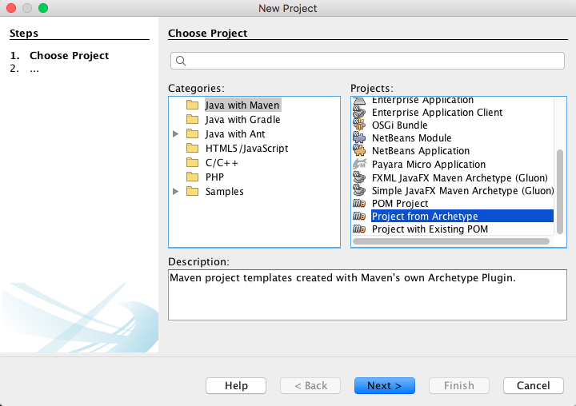
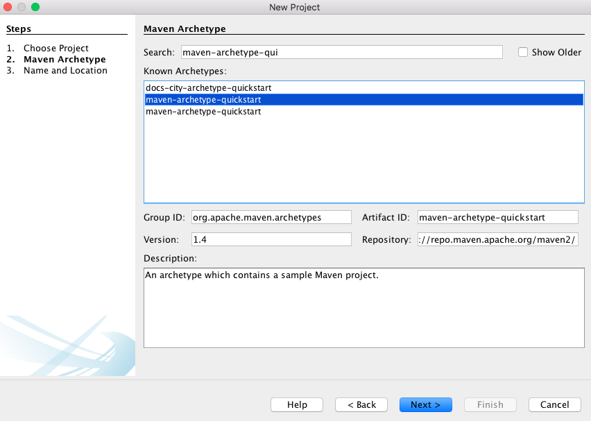
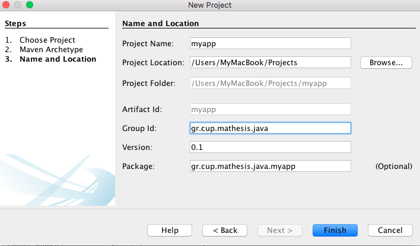

# 6.3 Εργαλεία Οικοδόμισης Κώδικα (Build Tools)
© Γιάννης Κωστάρας

---

[<](../6.2-UsefulClasses/README.md) | [Δ](../../README.md) | [>](../6.4-I18n/README.md) 

---
[](6.3-BuildTools.ipynb)

### Μαθησιακοί στόχοι
Σε αυτήν την ενότητα θα μάθουμε για τα διάφορα εργαλεία οικοδόμησης προγραμμάτων Java:

* Apache Ant
* Apache Maven
* Gradle

## Εισαγωγή
Αν και τα προγράμματα που έχουμε δει σ' αυτή τη σειρά μαθημάτων αποτελούνται από πολύ λίγες κλάσεις, τα εμπορικά ή ανοικτού κώδικα προγράμματα αποτελούνται από πολλές κλάσεις και εξαρτώνται συνήθως από πολλές βιβλιοθήκες (υπό μορφή αρχείων ```jar```). Η μεταγλώττιση αυτού του κώδικα είναι συνήθως μια πολύπλοκη διαδικασία καθώς θα πρέπει να φροντίσουμε να προσθέσουμε όχι μόνο όλες τις απαραίτητες βιβλιοθήκες αλλά και τις σωστές εκδόσεις αυτών για να μπορέσουμε να μεταγλωττίσουμε με επιτυχία τον κώδικά μας. Ευτυχώς δεν είμαστε μόνοι μας σ' αυτόν τον αγώνα, καθώς έχουν αναπτυχθεί ορισμένα εργαλεία γι' αυτό το σκοπό για τα οποία θα μιλήσουμε συνοπτικά σ' αυτό το μάθημα:

* [Apache Ant](http://ant.apache.org/) αντίστοιχο με το [make] για C/C++
* [Apache Maven](http://maven.apache.org/) ίσως το πιο διαδεδομένο εργαλείο διαχείρισης εξαρτήσεων 
* [Gradle](https://gradle.org/) το πιο πρόσφατο εργαλείο στην οικογένεια το οποίο τείνει ν' αντικαταστήσει το maven

## Apache Ant
Είναι ίσως το πιο παλιό πρόγραμμα οικοδόμησης προγραμμάτων java με πολλές εξαρτήσεις (dependencies) σε άλλες βιβλιοθήκες (.jar) και η φιλοσοφία του είναι ίδια με του ```make``` της C/C++.

Μπορείτε να το κατεβάσετε από [εδώ](https://ant.apache.org/bindownload.cgi) και να το αποσυμπιέσετε τοπικά. Στη συνέχεια καλό είναι να ορίσετε μια μεταβλητή περιβάλλοντος ```ANT_HOME``` που να δείχνει στο φάκελο που το αποσυμπιέσατε και στη συνέχεια να την προσθέσετε στην μεταβλητή περιβάλλοντος ```PATH``` μετά την Java, π.χ. ```PATH=$JAVA_HOME/bin:$ANT_HOME/bin:$PATH``` ή ```PATH=%JAVA_HOME%\bin;%ANT_HOME%\bin;%PATH%``` (για Windows). Αν τα κάνετε όλα σωστά θα πρέπει να δείτε κάτι σαν το παρακάτω αν δώσετε την εντολή:

```bash
$ ant -version
Apache Ant(TM) version 1.9.15 compiled on May 10 2020
```
 
Σε κάθε έργο που θέλετε να οικοδομήσετε, θα πρέπει να παρέχετε ένα αρχείο ```build.xml``` όπως το παρακάτω:

```xml
<?xml version="1.0" encoding="UTF-8"?>
<project name="School" default="dist" basedir=".">
    <description>Builds, tests, and runs the project School.</description>
    <property name="src" location="src"/>
    <property name="build" location="build"/>
    <property name="dist" location="dist"/>

<target name="init">
    <!-- Create the time stamp -->
    <tstamp/>
    <!-- Create the build directory structure used by compile -->
    <mkdir dir="${build}"/>
  </target>

  <target name="compile" depends="init"
        description="compile the source">
    <!-- Compile the Java code from ${src} into ${build} -->
    <javac srcdir="${src}" destdir="${build}"/>
  </target>

  <target name="dist" depends="compile"
        description="generate the distribution">
    <!-- Create the distribution directory -->
    <mkdir dir="${dist}/lib"/>
    <!-- Put everything in ${build} into the school.jar file -->
    <jar jarfile="${dist}/lib/school.jar" basedir="${build}"/>
  </target>

  <target name="clean" description="clean up">
    <!-- Delete the ${build} and ${dist} directory trees -->
    <delete dir="${build}"/>
    <delete dir="${dist}"/>
  </target>
</project>
```
το οποίο αναφέρει το όνομα του έργου, τον εξ' ορισμού στόχο (target) και τον κατάλογο που βρίσκονται τα αρχεία σας. Επίσης δηλώνει διάφορους στόχους (targets). 

Στη συνέχεια, δώστε μέσα στο φάκελο του έργου σας όπου βρίσκεται το ```build.xml``` την εντολή:

```bash
$ ant
```
και η εντολή θα οικοδομήσει το έργο σας ακολουθώντας τις οδηγίες που της παρέχονται στο ```build.xml``` αρχείο.

Παρατηρήστε ότι όταν δημιουργείτε ένα έργο _Java with Ant_ στο NetBeans, δημιουργείται ένα αρχείο ```build.xml``` το οποίο μπορείτε να δείτε αν πατήσετε στην καρτέλα **Files**.

## Apache Maven
Ίσως το διασημότερο πλέον πρόγραμμα οικοδόμησης προγραμμάτων, διαχειρίζεται αυτόματα τις διάφορες εξαρτήσεις (dependencies) του προγράμματός σας σε βιβλιοθήκες με τη βοήθεια ενός αρχείου ```pom.xml``` (Project Object Model). Ορίζουμε τις εξαρτήσεις μας σ' αυτό το αρχείο και στη συνέχεια, το Maven, με βάση αυτό το αρχείο τις ψάχνει πρώτα στο τοπικό μας αποθετήριο (repository)  (```~/.m2/repository``` ή ```C:\Users\<user>\.m2\repository```) κι αν δεν τις βρει τότε τις κατεβάζει από κάποιο κεντρικό αποθετήριο όπως το https://search.maven.org/ ή το https://mvnrepository.com/. Γενικά το όφελος είναι η ευκολότερη διαχείριση των εξαρτήσεων και η υποστήριξη των βασικών βημάτων της ανάπτυξης λογισμικού (δηλ. μεταγλώττιση, δοκιμές, καθαρισμός, εγκατάσταση, κλπ). Για το τι είναι ακριβώς το Maven μπορείτε να διαβάσετε [εδώ](http://maven.apache.org/what-is-maven.html).

### Εγκατάσταση

Κατεβάστε το από [εδώ](http://maven.apache.org/download.cgi). Αφού το αποσυμπιέσετε σε κάποιο φάκελο της αρεσκείας σας, θα πρέπει να ορίσετε μια μεταβλητή περιβάλλοντος ```Μ2_ΗΟΜΕ``` που να δείχνει σ' αυτό το φάκελο. Στη συνέχεια, θα πρέπει να την προσθέσετε στη μεταβλητή περιβάλλοντος ```PATH``` μετά τη java, δηλ. ```PATH=$JAVA_HOME/bin:$M2_HOME/bin:$PATH``` ή ```PATH=%JAVA_HOME%\bin;%M2_HOME%\bin;%PATH%``` (για Windows). Αν τα κάνατε όλα σωστά, τότε ανοίγοντας ένα κέλυφος (shell) ή μια γραμμή εντολών DOS και δίνοντας την εντολή:


```bash
mvn -v

Apache Maven 3.8.3 (ff8e977a158738155dc465c6a97ffaf31982d739)
Maven home: /Users/MyMacBook/Applications/Development/languages/java/other/apache/maven/3.8.3
Java version: 17, vendor: Oracle Corporation, runtime: /Library/Java/JavaVirtualMachines/jdk-17.jdk/Contents/Home
Default locale: en_GR, platform encoding: UTF-8
OS name: "mac os x", version: "10.13.6", arch: "x86_64", family: "mac"
```
Να σημειωθεί εδώ ότι οι τελευταίες εκδόσεις απαιτούν JDK 8 ή νεώτερη (προσοχή, JDK όχι JRE).


### Δημιουργία νέου έργου με τον οδηγό δημιουργίας

Μπορείτε να δημιουργήσετε ένα νέο έργο Maven βασιζόμενοι σε κάποιο από τα αρχέτυπα ([archetypes](http://maven.apache.org/archetype/index.html)) ή αλλιώς έτοιμα πρότυπα που προσφέρει το Maven για να δημιουργήσετε διάφορες κατηγορίες έργων. Στη συνέχεια θα δούμε πώς μπορούμε να δημιουργήσουμε νέα έργα Maven από τη γραμμή εντολών αλλά και από το NetBeans.

Το Maven παρέχει πάρα πολλά έτοιμα πρότυπα (templates) έργων που τα ονομάζει αρχέτυπα (archetypes). Για να τα δείτε δώστε την εντολή:

```bash
$ mvn archetype:generate
...
3105: remote -> za.co.absa.hyperdrive:component-archetype (-)
3106: remote -> za.co.absa.hyperdrive:component-archetype_2.11 (-)
3107: remote -> za.co.absa.hyperdrive:component-archetype_2.12 (-)
Choose a number or apply filter (format: [groupId:]artifactId, case sensitive contains): 1917: 
```
Δώστε ```Ctrl-C```.

Η εντολή σας επιστρέφει όλα τα αρχέτυπα, ακόμα κι αυτά που έχουν γράψει άλλοι προγραμματιστές, αλλά ίσως αυτό να μην είναι αυτό που θέλουμε. Θα περιοριστούμε στα αρχέτυπα που παρέχει το ίδιο το maven:

```bash
$ mvn archetype:generate -Dfilter=org.apache.maven.archetypes:
...
[INFO] Generating project in Interactive mode
[INFO] No archetype defined. Using maven-archetype-quickstart (org.apache.maven.archetypes:maven-archetype-quickstart:1.0)
Choose archetype:
1: remote -> org.apache.maven.archetypes:maven-archetype-archetype (An archetype which contains a sample archetype.)
2: remote -> org.apache.maven.archetypes:maven-archetype-j2ee-simple (An archetype which contains a simplified sample J2EE application.)
3: remote -> org.apache.maven.archetypes:maven-archetype-marmalade-mojo (-)
4: remote -> org.apache.maven.archetypes:maven-archetype-mojo (An archetype which contains a sample a sample Maven plugin.)
5: remote -> org.apache.maven.archetypes:maven-archetype-plugin (An archetype which contains a sample Maven plugin.)
6: remote -> org.apache.maven.archetypes:maven-archetype-plugin-site (An archetype which contains a sample Maven plugin site. This archetype can be layered upon an
    existing Maven plugin project.)
7: remote -> org.apache.maven.archetypes:maven-archetype-portlet (An archetype which contains a sample JSR-268 Portlet.)
8: remote -> org.apache.maven.archetypes:maven-archetype-profiles (-)
9: remote -> org.apache.maven.archetypes:maven-archetype-quickstart (An archetype which contains a sample Maven project.)
10: remote -> org.apache.maven.archetypes:maven-archetype-simple (An archetype which contains a simple Maven project.)
11: remote -> org.apache.maven.archetypes:maven-archetype-site (An archetype which contains a sample Maven site which demonstrates some of the supported document types like
    APT, XDoc, and FML and demonstrates how to i18n your site. This archetype can be layered
    upon an existing Maven project.)
12: remote -> org.apache.maven.archetypes:maven-archetype-site-simple (An archetype which contains a sample Maven site.)
13: remote -> org.apache.maven.archetypes:maven-archetype-site-skin (An archetype which contains a sample Maven Site Skin.)
14: remote -> org.apache.maven.archetypes:maven-archetype-webapp (An archetype which contains a sample Maven Webapp project.)
Choose a number or apply filter (format: [groupId:]artifactId, case sensitive contains): 9:
```
Η προεπιλεγμένη επιλογή είναι η 9. Αν διαβάσουμε την περιγραφή θα δούμε ότι αυτό το αρχέτυπο θα δημιουργήσει ένα απλό maven project. Πατήστε ```Enter```.

```bash
Choose org.apache.maven.archetypes:maven-archetype-quickstart version: 
1: 1.0-alpha-1
2: 1.0-alpha-2
3: 1.0-alpha-3
4: 1.0-alpha-4
5: 1.0
6: 1.1
7: 1.3
8: 1.4
Choose a number: 8: 
```
Πατήστε ```Enter```. Στο επόμενο βήμα σας ζητάει να δώσετε το ```groupId```. Αυτό είναι κάτι σαν το όνομα πακέτου. Δώστε ```gr.cup.mathesis.java``` και ```Enter```.
```bash
Define value for property 'groupId': gr.cup.mathesis.java
Define value for property 'artifactId':
```
Έπειτα σας ζητά το ```artifactId``` που είναι το όνομα του έργου. Δώστε ```myapp``` και ```Enter```. 
```bash
Define value for property 'artifactId': myapp
```
Τα ```groupId, artifactId``` ονομάζονται _συντεταγμένες_ του έργου. 

Στη συνέχεια σας ζητά την έκδοση. Πατήστε ```Enter``` δεχόμενοι την προτεινόμενη.

```bash
Define value for property 'version' 1.0-SNAPSHOT: :
```
Πατήστε ```Enter``` και στην επόμενη ιδιότητα:
```bash
Define value for property 'package' gr.cup.mathesis.java: :
```
Τέλος, σας ζητά να επιβεβαιώσετε τις τιμές των ιδιοτήτων. Πατήστε ```Enter```.
```bash
Confirm properties configuration:
groupId: gr.cup.mathesis.java
artifactId: myapp
version: 1.0-SNAPSHOT
package: gr.cup.mathesis.java
 Y: : 
```
Δημιούργησε ένα φάκελο ```myapp``` στον τρέχοντα φάκελο με την εξής δομή:
```bash
$ tree myapp
myapp
├── pom.xml
└── src
    ├── main
    │   └── java
    │       └── gr
    │           └── cup
    │               └── mathesis
    │                   └── java
    │                       └── App.java
    └── test
        └── java
            └── gr
                └── cup
                    └── mathesis
                        └── java
                            └── AppTest.java

13 directories, 3 files
```

Ας δούμε το ```pom.xml```.

```xml
<?xml version="1.0" encoding="UTF-8"?>

<project xmlns="http://maven.apache.org/POM/4.0.0" xmlns:xsi="http://www.w3.org/2001/XMLSchema-instance"
  xsi:schemaLocation="http://maven.apache.org/POM/4.0.0 http://maven.apache.org/xsd/maven-4.0.0.xsd">
  <modelVersion>4.0.0</modelVersion>
```
Ένα αρχείο XML (eXtensible Markup Language) ξεκινά πάντα με την επικεφαλίδα ```<?xml version="1.0" encoding="UTF-8"?>```. Η γλώσσα XML αποτελείται από _ετικέτες (tags)_ όπως και η HTML. Η διαφορά είναι ότι η XML δεν διαθέτει προκαθορισμένες ετικέτες, αλλά εμείς ή ένα framework τις καθορίζει. Ένα αρχείο ```pom.xml``` διαθέτει τη ριζική ετικέτα ```<project>```. Όλες οι άλλες ετικέτες εσωκλείονται μέσα στις  ```<project></project>```.
```xml
  <modelVersion>4.0.0</modelVersion>

  <groupId>gr.cup.mathesis.java</groupId>
  <artifactId>myapp</artifactId>
  <version>1.0-SNAPSHOT</version>

  <name>myapp</name>
  <!-- FIXME change it to the project's website -->
  <url>http://www.example.com</url>
```
Ακολουθούν τα ```<groupId>, <artifactId>, <version>``` όπως τα δώσαμε.
```xml
  <properties>
    <project.build.sourceEncoding>UTF-8</project.build.sourceEncoding>
    <maven.compiler.source>1.7</maven.compiler.source>
    <maven.compiler.target>1.7</maven.compiler.target>
  </properties>
```
Τα properties ορίζουν κάποιες ιδιότητες του μεταγλωττιστή για το έργο. Αλλάξτε την έκδοση ```1.7``` σε ```17``` που είναι η έκδοση της Java που χρησιμοποιούμε.
```xml
  <dependencies>
    <dependency>
      <groupId>junit</groupId>
      <artifactId>junit</artifactId>
      <version>4.11</version>
      <scope>test</scope>
    </dependency>
  </dependencies>
```
Με την ετικέτα ```<dependency>``` προσθέτουμε εξαρτήσεις σε άλλες βιβλιοθήκες που χρειάζεται το έργο μας. Πιο πάνω βλέπουμε μια εξάρτηση στη βιβλιοθήκη JUnit 4.11. Βλέπουμε ότι όλες οι βιβλιοθήκες στο Maven έχουν ```groupId, artifactId, version```. 

Ακολουθεί το τμήμα με την ετικέτα ```<build>``` το οποίο περιέχει διάφορα plugins που χρειάζονται για να οικοδομηθεί (build) το έργο μας.

### Δημιουργία νέου έργου δίνοντας στην εντολή τις συντεταγμένες

Μπορείτε να συντομεύσετε το χρόνο δημιουργίας ενός νέου έργου maven, απλά δίνοντας την εντολή:

```bash
mvn archetype:generate -DgroupId=gr.cup.mathesis.java -DartifactId=myapp -DarchetypeArtifactId=maven-archetype-quickstart -DarchetypeVersion=1.4 -Dinteractive-mode=false
```

Περνάμε με την παράμετρο ```-D``` τις λεγόμενες "συντεταγμένες" έργου μας, δηλ. το ```groupId``` που συνήθως είναι η εταιρεία που εργαζόμαστε και θα αποτελέσει το όνομα της βιβλιοθήκης (package name) του έργου μας, το ```archetypeId``` που είναι το όνομα της εφαρμογής μας, και τέλος, μπορούμε να δώσουμε και το αρχέτυπο, ```archetypeArtifactId``` στο οποίο θέλουμε να βασιστούμε (προαιρετικά) καθώς και την έκδοση του αρχέτυπου (προαιρετικά). [Εδώ](http://maven.apache.org/archetypes/) μπορείτε να βρείτε μια λίστα από αρχέτυπα. Μόλις δώσετε την παραπάνω εντολή θα δείτε ότι θα αρχίσουν να μεταφορτώνονται (download) βιβλιοθήκες (jars) από το κεντρικό αποθετήριο http://repo.maven.apache.org/maven2 οι οποίες αποθηκεύονται στο τοπικό σας αποθετήριο όπως είπαμε παραπάνω. Μόλις δείτε το ```BUILD SUCCESS```, είστε έτοιμοι να χτίσετε το έργο σας δίνοντας κάποια από τις παρακάτω εντολές που αποτελούν τον κύκλο ζωής (lifecycle) ενός έργου maven:

```bash
mvn clean     // καθαρίζει τα μεταγλωττισμένα αρχεία, δηλ. τον φάκελό target
mvn compile   // μεταγλωττίζει το έργο, παράγει τα .class αρχεία
mvn deploy    // αντιγράφει το παραγόμενα αρχεία σε απομακρυσμένο server προς διάθεση 
mvn install   // αντιγράφει το παραγόμενο .jar στο τοπικό αποθετήριο
mvn package   // δημιουργεί το .jar αρχείο
mvn site      // δημιουργεί έναν ιστότοπο με πληροφορίες για το έργο μας
mvn test      // εκτελεί τα unit tests
mvn validate  // ελέγχει ότι το έργο είναι εντάξει και δεν λείπει πληροφορία
mvn verify    // εκτελεί integration tests 
```
Μπορείτε να διαβάσετε περισσότερα για τον κύκλο ζωής (lifecycle) ενός έργου maven [εδώ](http://maven.apache.org/guides/introduction/introduction-to-the-lifecycle.html). 

Στην περίπτωσή μας μπορούμε να δώσουμε:

```bash
cd myapp
mvn clean package
```
για να δημιουργηθεί το αρχείο ```myapp-1.0-SNAPSHOT.jar```.

Μπορείτε να το εκτελέσετε κατά τα γνωστά:

```bash
$ java -cp target/myapp-1.0-SNAPSHOT.jar gr.cup.mathesis.java.App
Hello World!
```
ή μέσω του ```mvn```
```bash
$ mvn exec:java -Dexec.mainClass=gr.cup.mathesis.java.App
Hello World!
```

Πώς μπορείτε να προσθέσετε εξαρτήσεις; Πού βρίσκετε τα ```groupId, artifactId```; Μα στα κεντρικά αποθετήρια. Έστω π.χ. ότι θέλουμε να προσθέσουμε εξάρτηση στη βιβλιοθήκη junit 5. Μεταβείτε στην ιστοσελίδα https://mvnrepository.com/ και αναζητήστε ```junit```. Επιλέξτε το _JUnit Jupiter API_, στη συνέχεια την τελευταία έκδοση, και θα εμφανιστούν καρτέλες για τα διάφορα προγράμματα μεταγλώττισης όπως Maven, Gradle, SBT, Ivy, Grape κλπ. Στην καρτέλα Maven μπορείτε να αντιγράψετε το τμήμα xml για να το επικολλήσετε στο αρχείο ```pom.xml``` του έργου σας μέσα στην ετικέτα ```dependencies``` (στη συγκεκριμένη περίπτωση αντικαθιστώντας την εξάρτηση στο junit 4.11). 

### Δημιουργία έργου Maven με το NetBeans

Για να δούμε πώς μπορούμε να δημιουργήσουμε το ίδιο έργο μέσα από το NetBeans, δημιουργούμε ένα νέο έργο ```File -> New Project``` και επιλέγουμε την κατηγορία _Java with Maven_ και το έργο _Project from Archetype_ όπως φαίνεται στην παρακάτω εικόνα.



**Εικόνα 6.3.1** _File New Maven Project με το NetBeans_

Στο δεύτερο βήμα, εμφανίζεται (μετά από λίγο), μια λίστα από τα διαθέσιμα αρχέτυπα. Αναζητήστε το αρχέτυπο που δώσαμε παραπάνω, όπως φαίνεται στην ακόλουθη εικόνα:



**Εικόνα 6.3.2** _Αναζήτηση αρχέτυπου maven-archetype-quickstart στο NetBeans_

Στο τρίτο και τελευταίο βήμα δώστε το όνομα του έργου (το οποίο είναι το ```artifactId```), το ```groupId``` και μια έκδοση (το maven μπορεί να διαχειρίζεται διαφορετικές εκδόσεις βιβλιοθηκών/έργων οπότε μπορείτε να επιλέγετε και σε ποια έκδοση μιας βιβλιοθήκης θέλετε να εξαρτάται το έργο σας).



**Εικόνα 6.3.3** _Εισαγωγή των συντεταγμένων του έργου στο NetBeans_

Αλλά πώς αποθηκεύονται οι εξαρτήσεις στο τοπικό αποθετήριο; Ελέξτε το μόνοι σας. Πλοηγηθείτε στο ```~/.m2/repository``` (ή ή ```C:\Users\<user>\.m2\repository```) και μεταβείτε σε κάποιο φάκελο. Θα δείτε το αρχείο ```jar``` και το αντίστοιχο αρχείο ```.pom```. Δώστε την παρακάτω εντολή για να βρείτε που βρίσκεται το τοπικό σας αποθετήριο.

```bash
$ mvn help:evaluate -Dexpression=settings.localRepository
/Users/<user>/.m2/repository    (Linux/Mac)
C:\Users\<user>\.m2\repository  (Windows)
```
όπου ```<user>``` είναι το όνομα χρήστη του Η/Υ σας. 

Όταν θα θελήσετε να διανείμετε το έργο σας, θα παρατηρήσετε ότι λείπουν οι βιβλιοθήκες από τις οποίες εξαρτάται (καθώς αυτές βρίσκονται στο τοπικό αποθετήριό σας). Ακολουθήστε τις οδηγίες σ' [αυτή τη σελίδα](https://maven.apache.org/plugins/maven-shade-plugin/) για να μάθετε πώς να δημιουργήσετε ένα αρχείο jar που θα περιέχει όλες τις απαραίτητες βιβλιοθήκες για να εκτελεστεί το έργο σας. Άλλοι τρόποι αναφέρονται [εδώ](https://www.baeldung.com/executable-jar-with-maven).

Μπορείτε επίσης να δημιουργήσετε [τα δικά σας αρχέτυπα](http://maven.apache.org/guides/mini/guide-creating-archetypes.html).

Τα παραπάνω ήταν μια πολύ μικρή εισαγωγή στο Maven. Υπάρχει πολύ υλικό εκμάθησης στο διαδίκτυο ενώ μπορείτε να συμβουλευτείτε και τις πηγές.

## Gradle
To Gradle είναι ένα νεότερο σύστημα για αυτοματοποίηση της οικοδόμησης λογισμικού και τη διαχείριση των εξαρτήσεων. Σε αντίθεση με το Maven, το Gradle δεν χρησιμοποιεί XML αλλά μια πιο λιτή (και συνάμα επεκτάσιμη) γλώσσα. Το Gradle στοχεύει σε μεγάλα έργα, για αυτό και υποστηρίζει αυξητική οικοδόμηση.

Σε αντίθεση με τα άλλα δυο εργαλεία, το Gradle δεν είναι ένα έργο του Apache. [Εδώ](https://gradle.org/install/) παρέχονται οδηγίες εγκατάστασης. Μπορείτε πολύ απλά να κατεβάσετε το τελευταίο binary αρχείο και να το αποσυμπιέσετε τοπικά.

Το gradle δουλεύει με καθήκοντα (tasks). Ο κύκλος ζωής (lifecycle) ενός έργου Gradle αποτελείται από τρία μόνο βήματα: 

1. Αρχικοποίηση (Initialization)
1. Ρύθμιση (Configuration)
1. Εκτέλεση (Execution)

Αν και βασίζεται στο Maven, τα Gradle αρχεία δεν είναι γραμμένα σε XML αλλά σε γλώσσα Groovy ή Kotlin. Σημειώστε ότι η έκδοση Gradle 7.3 ή νεώτερη είναι συμβατή με τη Java 17. Ας δούμε ένα παράδειγμα. Αφού εγκαταστήσατε το Gradle, δημιουργήστε ένα νέο φάκελο και δώστε την εντολή:

```bash
$ gradle init

Select type of project to generate:
  1: basic
  2: application
  3: library
  4: Gradle plugin
Enter selection (default: basic) [1..4] 2

Select implementation language:
  1: C++
  2: Groovy
  3: Java
  4: Kotlin
  5: Scala
  6: Swift
Enter selection (default: Java) [1..6] 3

Split functionality across multiple subprojects?:
  1: no - only one application project
  2: yes - application and library projects
Enter selection (default: no - only one application project) [1..2] 1

Select build script DSL:
  1: Groovy
  2: Kotlin
Enter selection (default: Groovy) [1..2] 1

Select test framework:
  1: JUnit 4
  2: TestNG
  3: Spock
  4: JUnit Jupiter
Enter selection (default: JUnit 4) [1..4]

Project name (default: myappgradle):
Source package (default: myappgradle):

BUILD SUCCESSFUL
2 actionable tasks: 2 executed
```


```bash
$ tree myappgradle/
myappgradle/
├── app
│   ├── build.gradle
│   └── src
│       ├── main
│       │   ├── java
│       │   │   └── myappgradle
│       │   │       └── App.java
│       │   └── resources
│       └── test
│           ├── java
│           │   └── myappgradle
│           │       └── AppTest.java
│           └── resources
├── gradle
│   └── wrapper
│       ├── gradle-wrapper.jar
│       └── gradle-wrapper.properties
├── gradlew
├── gradlew.bat
└── settings.gradle

12 directories, 8 files
```

```settings.gradle```:

```groovy
rootProject.name = 'myappgradle'
include('app')
```

```app/build.gradle```:

```groovy
plugins {
    // Apply the application plugin to add support for building a CLI application in Java.
    id 'application'
}

repositories {
    // Use Maven Central for resolving dependencies.
    mavenCentral()
}

dependencies {
    // Use JUnit Jupiter API for testing.
    testImplementation 'org.junit.jupiter:junit-jupiter-api:6.7.1'

    // Use JUnit Jupiter Engine for testing.
    testRuntimeOnly 'org.junit.jupiter:junit-jupiter-engine'

    // This dependency is used by the application.
    implementation 'com.google.guava:guava:30.0-jre'
}

application {
    // Define the main class for the application.
    mainClass = 'myappgradle.App'
}

tasks.named('test') {
    // Use junit platform for unit tests.
    useJUnitPlatform()
}
```

Για να οικοδομήσετε και να εκτελέσετε την εφαρμογή:

```bash
$ ./gradlew run

> Task :app:run
Hello world!

BUILD SUCCESSFUL
2 actionable tasks: 2 executed
```

Για να παράγετε ένα εκτελέσιμο .jar αρχείο:
```bash
$ gradlew build
```

Στο NetBeans, επιλέξτε από το μενού **File -> New Project** την κατηγορία **Java with Gradle** και το έργο **Java Application** και **Next**. Στο επόμενο βήμα δίνεται ένα όνομα για το έργο και προαιρετικά έκδοση, ομάδα (group) και περιγραφή και **Finish**.

## Πηγές

### Ant
1. [Apache Ant Manual](https://ant.apache.org/manual/index.html).
1. Loughran S. & Hatcher E. (2007), _Ant in Action_, 2nd Ed., Manning.
1. Moodie M. (2006), _Pro Apache Ant_, APress.
1. Tilly J. & Burke E. M. (2002), _Ant: The Definitive Guide_, O'Reilly.
### Maven
1. [Apache Maven Documentation](https://maven.apache.org/guides/index.html).
1. Κασάπογλου Μ., [Εισαγωγή στο Apache Maven](https://kassapoglou.github.io/maven/maven.html).
1. Shirangan (2011), _Apache Maven 3 Cookbook_, Packt.
1. Siriwardena (2014), _Mastering Apache Maven 3_, Packt.
1. Sonatype, [Maven By Example](https://books.sonatype.com/mvnex-book/reference/introduction.html).
1. Sonatype (2008), _Maven The Definitive Guide_, O'Reilly.
1. Varanasi B. & Belida S. (2014), _Introducing Maven_, APress.
### Gradle 
1. [Gradle User Manual](https://docs.gradle.org/current/userguide/userguide.html).
1. Mitra M. (2015), _Mastering Gradle_, Packt.
1. Varanasi B. & Belida S. (2015), _Introducing Gradle_, APress.

---

[<](../6.2-UsefulClasses/README.md) | [Δ](../../README.md) | [>](../6.4-I18n/README.md) 

---
