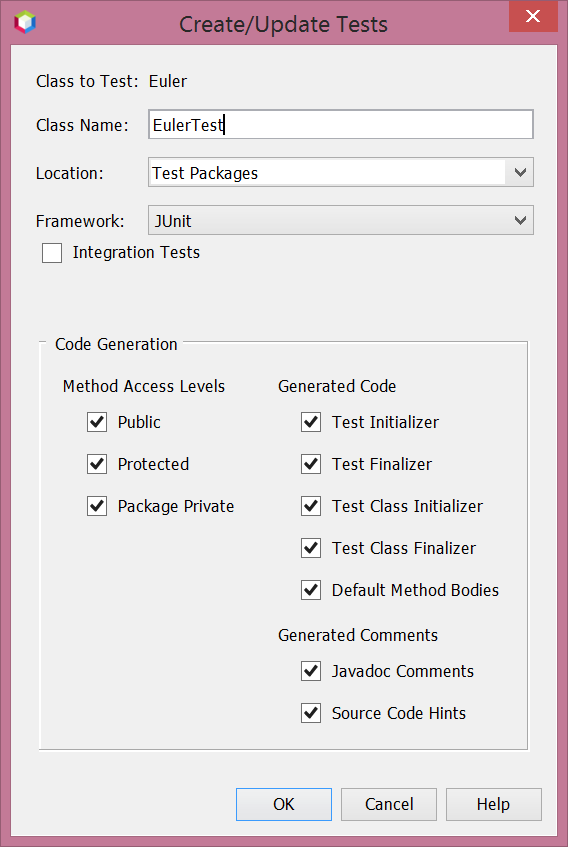
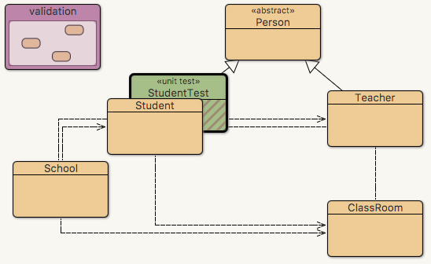
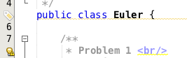
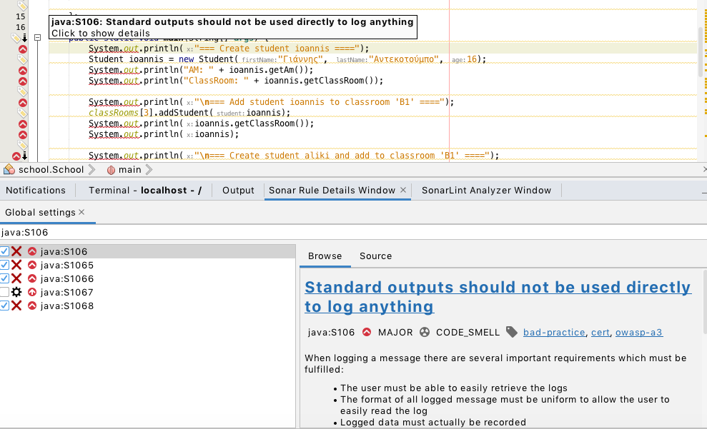

# 6.6 Έλεγχος Ποιότητας κώδικα {#Java} 
© Γιάννης Κωστάρας

---

[🏠](https://jkost.github.io) | [⬆️](../../TOC.ipynb) | [◀️](../6.5-Logging/README.md) | [▶️](../6.7-Exercise/README.md)

---
[](6.6-UnitTesting.ipynb)

## Εισαγωγή
Δεν αρκεί μόνο η συγγραφή κώδικα. Σύμφωνα με τις καλές τεχνικές προγραμματισμού θα πρέπει να μεριμνήσουμε και για την ποιότητα του κώδικά μας, γράφοντας κώδικα χωρίς λάθη (bugs), εφαρμόζοντας π.χ. την Αρχή DRY (Don't Repeat Yourself) κλπ. Στο μάθημα αυτό θα δούμε εργαλεία και τεχνικές που μας βοηθούν στο σκοπό αυτό. 

## Unit Testing

Μια πολύ δημοφιλής τεχνική ελέγχου λαθών είναι το unit testing. Άλλες τεχνικές είναι η ανασκόπηση του κώδικά σας από κάποιον άλλο (peer review) κ.ά. Εδώ θα επικεντρωθούμε στο unit testing (ή έλεγχο μονάδας κώδικα).

Η τεχνική ξεκίνησε από τον [Kent Beck](https://en.wikipedia.org/wiki/Kent_Beck) ως μέρος της προτιμώμενης μεθοδολογίας του [Extreme Programming (XP)](https://en.wikipedia.org/wiki/Extreme_Programming) μέρος της σχετικής μεθοδολογίας [Test Driven Development (TDD)](https://en.wikipedia.org/wiki/Test-driven_development). Με βάση αυτή τη μεθοδολογία, όταν έχουμε να επιλύσουμε κάποιο προγραμματιστικό πρόβλημα, δεν ξεκινάμε να γράφουμε κώδικα για το πρόβλημα, αλλά αντιθέτως γράφουμε ένα μικρό πρόγραμμα ελέγχου για να ελέγξουμε κατά πόσο το παραγόμενο αποτέλεσμα είναι σωστό. Φυσικά, καθώς δεν έχει γραφτεί ακόμα ο κώδικας, το πρόγραμμα ελέγχου αποτυγχάνει και ο προγραμματιστής θα πρέπει να γράψει τον κώδικα ώστε να κάνει τον πρόγραμμα ελέγχου να επιτύχει.  

Η τεχνική ονομάζεται "έλεγχος μονάδας κώδικα" καθώς γράφουμε κώδικα ελέγχου στο επίπεδο της μεθόδου, δηλ. ελέγχουμε κάθε μέθοδο του προγράμματός μας αν συμπεριφέρεται όπως πιστεύουμε ή όπως μας το επιβάλλουν οι απαιτήσεις κλπ. Όταν μελλοντικά χρειαστεί να αλλάξετε κάποιες μεθόδους, ξανατρέχοντας τα unit tests βεβαιώνεστε ότι δε προσθέσατε νέα bugs.

Υπάρχουν διάφορες βιβλιοθήκες unit testing:

* [JUnit](https://junit.org/junit5/) είναι το πιο διαδεδομένο πλαίσιο εργασίας (framework), αυτό που έγραψε ο Kent Beck μαζί με τον Erich Gamma, πάνω στο οποίο βασίζονται πολλά άλλα test frameworks και έχει μεταφερθεί σε πολλές άλλες γλώσσες προγραμματισμού 
* [TestNG](https://en.wikipedia.org/wiki/TestNG) βασισμένο στο JUnit
* [Spock](http://spockframework.org/) γραμμένο σε Groovy

Πολλές φορές, για να μπορέσετε να ελέγξετε ένα τμήμα κώδικα χρειάζεται να αρχικοποιήσετε πολλές άλλες κλάσεις π.χ. για να επικοινωνήσετε με πόρους τους συστήματος, π.χ. με ΒΔ. Στο επίπεδο του testing δε χρειάζεται να φορτώνουμε κάθε φορά πόρους του συστήματος (εκτός κι αν θέλουμε να τους τεστάρουμε) καθώς τα unit tests πρέπει να εκτελούνται γρήγορα. Υπάρχουν για το σκοπό αυτό άλλα είδους testing frameworks που λέγονται mocking frameworks (ψευδείς δοκιμές). Αυτά κάνουν το πρόγραμμά μας να νομίζει ότι επικοινωνεί με τον πόρο ενώ στην πραγματικότητα επικοινωνεί με κλάσεις που συμπεριφέρονται σα να επικοινωνούσε το πρόγραμμά μας με τον πόρο. Τα πιο δημοφιλή είναι τα εξής:

* [EasyMock](https://en.wikipedia.org/wiki/EasyMock)
* [JMock](http://jmock.org)
* [JMockit](http://jmockit.github.io)
* [Mockito](https://site.mockito.org)
* [PowerMock](http://powermock.github.io)

Στη συνέχεια θα επικεντρωθούμε στην τελευταία έκδοση του JUnit.

## JUnit 5
Η έκδοση 5 του JUnit είναι γραμμένη από την αρχή. Η αρχιτεκτονική του αποτελείται από 3 βασικά αρθρώματα (modules):

* **JUnit Platform**: είναι η πλατφόρμα πάνω στην οποία χτίζονται άλλα αρθρώματα
* **JUnit Jupiter**: παρέχει τις εντολές (assertions) που είναι απαραίτητες για να γράφουμε τα unit tests
* **JUnit Vintage**: επιτρέπει να συνδυάζουμε το JUnit 5 με παλαιότερες εκδόσεις

Απαιτεί έκδοση 8 της Java η νεώτερη.

Ας δούμε πώς μπορούμε να χρησιμοποιήσουμε το JUnit, γράφοντας unit tests στο NetBeans το οποίο από την [έκδοση 10](https://netbeans.apache.org/download/nb100/index.html) υποστηρίζει JUnit 5.

Δημιουργήστε ένα νέο έργο _Java Application_ στην κατηγορία _Java with Maven_ και ονομάστε το _Euler_. 

**Σημείωση!** _Μέχρι τη στιγμή που γράφονται αυτές οι γραμμές, το JUnit 5 δεν υποστηρίζει πλέον το [ant](http://ant.apache.org/) που είναι ένας από τους πιο διαδεδομένους τρόπους 'χτισίματος' για Java (το ant, όπως μάθαμε σε προηγούμενο μάθημα, είναι κάτι αντίστοιχο του make της C), αλλά μόνο [Maven](http://maven.apache.org/). Κατά συνέπεια, δημιουργώντας ένα έργο Java --> Java Application, που βασίζεται στο ant, τα unit tests δε θα δουλέψουν._ 

Δημιουργήστε μια νέα κλάση με όνομα ```Euler```. Θα δοκιμάσουμε να επιλύσουμε μερικά από τα προβλήματα του [Euler](https://projecteuler.net/archives).

Το [πρώτο πρόβλημα](https://projecteuler.net/problem=1) είναι το παρακάτω:

```java
public class Euler {

    /**
     * Problem 1 <br/>
     * Multiples of 3 and 6. If we list all the natural numbers below 10 that
     * are multiples of 3 or 5, we get 3, 5, 6 and 9. The sum of these
     * multiples is 23. Find the sum of all the multiples of 3 or 5 below
     * 1000.
     *
     * @param upperLimit 10 or 1000
     * @return the sum of multiples of 3 or 5 below {@code upperLimit}
     */
    public static long sumOf_3_5(int upperLimit) {
        return 0;
    }

}
``` 
Προτού υλοποιήσουμε τη στατική μέθοδο, ακολουθώντας το παράδειγμα του TDD, θα γράψουμε πρώτα το unit test γι' αυτήν. 

Επιλέξτε την κλάση ```Euler``` στο παράθυρο _Projects_, δεξί κλικ και επιλέξτε **Tools --> Create/Update Tests**. Θα εμφανιστεί το παράθυρο _Create/Update Tests_ (βλ. Εικόνα 6.6.1).



**Εικόνα 6.6.1** _Διαλογικό παράθυρο Create/Update Tests του NetBeans_  

Πατώντας **ΟΚ**, το NetBeans θα δημιουργήσει την κλάση ```EulerTest``` μέσα στον κατάλογο _Test Packages_ και θα προσθέσει τις βιβλιοθήκες του JUnit 5 μέσα στον κατάλογο _Test Libraries_.

```java
import org.junit.jupiter.api.AfterEach;
import org.junit.jupiter.api.AfterAll;
import org.junit.jupiter.api.BeforeEach;
import org.junit.jupiter.api.BeforeAll;
import org.junit.jupiter.api.Test;
import static org.junit.jupiter.api.Assertions.*;

public class EulerTest {
    
    public EulerTest() {
    }
    
    @BeforeAll
    public static void setUpClass() {
    }
    
    @AfterAll
    public static void tearDownClass() {
    }
    
    @BeforeEach
    public void setUp() {
    }
    
    @AfterEach
    public void tearDown() {
    }

    /**
     * Test of sumOf_3_5 method, of class Euler.
     */
    @Test
    public void testSumOf_3_5() {
        System.out.println("sumOf_3_5");
        int upperLimit = 0;
        long expResult = 0L;
        long result = Euler.sumOf_3_5(upperLimit);
        assertEquals(expResult, result);
        // TODO review the generated test code and remove the default call to fail.
        fail("The test case is a prototype.");
    }
}
```
Βλέπουμε ότι το NetBeans παρήγαγε μια μέθοδο ```testSumOf_3_5()``` με το annotation ```@Test``` που δηλώνει ότι αυτή είναι ένα unit test, και παρήγαγε και έναν σκελετό κώδικα για να μας βοηθήσει.

Πατήστε δεξί κλικ πάνω στο έργο _Euler_ και επιλέξτε **Test**. Το NetBeans θα εκτελέσει όλα τα unit tests και φυσικά θα εμφανίσει ```Tests passed: 0,00%```. Αν δεν εμφανιστεί το παράθυρο _Test Results_, εμφανίστε το από το μενού **Window --> IDE Tools --> Test Results**.

Με βάση την εκφώνιση του προβλήματος αλλάξτε το unit test όπως φαίνεται στη συνέχεια:

```java
    @Test
    public void testSumOf_3_5() {
        System.out.println("sumOf_3_5");
        assertEquals(23, Euler.sumOf_3_5(10));
        //assertEquals(1, Euler.sumOf_3_5(1000));
    }
```
Η ```assertEquals()``` είναι ένας _ισχυρισμός (assertion)_ όπου δέχεται ως πρώτο όρισμα τι αναμένεται ως αποτέλεσμα και ως δεύτερο το πραγματικό αποτέλεσμα που τεστάρει. Υπάρχουν φυσικά πολλά assertions όπως ```assertTrue(), assertNull()``` κ.ά. Υποστηρίζονται ακόμα και _υποθέσεις (assumptions)_ δηλ. συνθήκες που πρέπει να ισχύουν για να έχει νόημα κάποιο test (π.χ. ```assumeTrue(), assumingThat()```). Αν μια υπόθεση αποτύχει, δε σημαίνει ότι απέτυχε το test, αλλά ότι απλά το συγκεκριμένο test δεν έχει νόημα ή ότι δεν παρέχει καμιά χρήσιμη πληροφορία. 

Φυσικά, αν ξανατρέξετε την εντολή **Test** (ή δεξί κλικ στην κλάση ```Euler``` και **Test File**), πάλι θ' αποτύχει το unit test καθώς η μέθοδος επιστρέφει ```0```. 

Ένα νέο χαρακτηριστικό του JUnit 5 είναι το σχόλιο μεταγλώττισης ```@DisplayName```:

```java
    @DisplayName("sumOf_3_5")
    @Test
    public void testSumOf_3_5() {
        assertEquals(23, Euler.sumOf_3_5(10));
        //assertEquals(1, Euler.sumOf_3_5(1000));
    }
```

Υλοποιώντας την ```sumOf_3_5()```:
```java
    public static long sumOf_3_5(int upperLimit) {
        long sum = 0;
        for (int len = 3; len < upperLimit; len++) {
            if (len % 3 == 0 || len % 5 == 0) {
                sum += len;
            }
        }
        return sum;
    }
```
και ξανατρέχοντας το unit test, βλέπουμε ότι αυτή τη φορά η μπάρα έγινε πράσινη. Επιτυχία! 

Βγάζοντας το σχόλιο από τη 2η γραμμή της ```testSumOf_3_5()``` μπορούμε να βρούμε το αποτέλεσμα και να ενημερώσουμε τη γραμμή ώστε να ξαναεπιστρέψουμε στις δάφνες της πράσινης μπάρας.

Άλλα χρήσιμα annotations:

```java
@Disabled("test is skipped")
```

αν δεν επιθυμείτε να συμπεριλάβετε αυτόν τον έλεγχο.

Μπορείτε ακόμα να δημιουργήσετε ομάδες από ελέγχους με τη βοήθεια των ```@Tag``` και ```@Tags```:

```java
@Tag("core-test")
@Tags({@Tag("persistence-test"), @Tag("performance-test")})
```
Το NetBeans δημιούργησε και τις παρακάτω μεθόδους:

```java
    @BeforeAll
    public static void setUpClass() {
    }
    
    @AfterAll
    public static void tearDownClass() {
    }
    
    @BeforeEach
    public void setUp() {
    }
    
    @AfterEach
    public void tearDown() {
    }
```

Οι ```@BeforeEach``` και ```@AfterEach``` εκτελούνται πριν και αμέσως μετά από κάθε ```@Test```, π.χ. για ν' αρχικοποιήσουν τα δεδομένα που χρησιμοποιούν οι μέθοδοι ελέγχου. Π.χ. αν κάθε έλεγχος χρειάζεται μια άδεια λίστα τότε:

```java
    @BeforeEach
    public void setUp() {
    	items = new LinkedList<>();
    }
    
    @AfterEach
    public void tearDown() {
    }
```

Αντίστοιχα οι ```@BeforeAll``` και ```@AfterAll``` εφαρμόζονται σε στατικές μόνο μεθόδους και εκτελούνται μια φορά πριν την αρχή (μετά το τέλος) όλων των ελέγχων. 

Η έκδοση 5 του JUnit υποστηρίζει και εμφωλιασμένους ελέγχους:

```java
class Test {

	@Nested
	class NestedTest {
		//...
	}
}
```
### Unit testing στο BlueJ

Η δημιουργία unit test κλάσεων στο BlueJ είναι πολύ εύκολη.

1. Κάντε δεξί κλικ σε μια κλάση και επιλέξτε **Create Test Class** από το αναδυόμενο μενού. 

Θα δημιουργηθεί μια νέα κλάση όπως η παρακάτω:
```java
//package school;

import static org.junit.jupiter.api.Assertions.*;
import org.junit.jupiter.api.AfterEach;
import org.junit.jupiter.api.BeforeEach;
import org.junit.jupiter.api.Test;

/**
 * The test class StudentTest.
 *
 * @author  (your name)
 * @version (a version number or a date)
 */
public class StudentTest
{
    /**
     * Default constructor for test class StudentTest
     */
    public StudentTest()
    {
    }

    /**
     * Sets up the test fixture.
     *
     * Called before every test case method.
     */
    @BeforeEach
    public void setUp()
    {
    }

    /**
     * Tears down the test fixture.
     *
     * Called after every test case method.
     */
    @AfterEach
    public void tearDown()
    {
    }
}
```
ενώ το διάγραμμα κλάσεων θα ενημερωθεί όπως στην ακόλουθη εικόνα.



**Εικόνα 6.6.2** _Test classes στο BlueJ_ 

## [Στατικά εργαλεία ελέγχου κώδικα (Static Code Analyzers)](https://www.sparkred.com/blog/open-source-java-static-code-analyzers/)
Αυτά ελέγχουν τον κώδικά σας και ψάχνουν για λάθη που μπορεί να σας έχουν ξεφύγει, π.χ. να έχετε ξεχάσει ν' αρχικοποιήσετε μια μεταβλητή που τη χρησιμοποιείται αργότερα, ή χρήση του τελεστή ```==``` για σύγκριση αντικειμένων κλπ. Προσέξτε ότι τα εργαλεία αυτά προσφέρουν συμβουλές για πιθανά προβλήματα. Δε σημαίνει ότι όλα τα "λάθη" που βρίσκουν είναι πράγματι λάθη (false positives).

* [CheckStyle](http://checkstyle.sourceforge.net/) το οποίο ελέγχει κυρίως κατά πόσο ακολουθεί ο κώδικας κάποιο στυλ 
* [Sonarlint](https://github.com/philippefichet/sonarlint4netbeans) στατικός αναλυτής κώδικα (static code analyzer)
* [SpotBugs](https://spotbugs.github.io/) στατικός αναλυτής κώδικα (static code analyzer)
* [PMD](https://pmd.github.io/) στατικός αναλυτής κώδικα (static code analyzer)

Το NetBeans παρέχει πρόσθετα (plugins) μόνο για τα δυο πρώτα για τα οποία θα μιλήσουμε σ' αυτό το μάθημα. Για τα δυο τελευταία αναφερθείτε στις αντίστοιχες ιστοσελίδες. 

### CheckStyle
Για να προσθέσετε το _CheckStyle_ plugin: 

1. Κλικ στο μενού **Tools --> Plugins --> Available Plugins** για ν' ανοίξετε το διαλογικό παράθυρο _Plugins_ και επιλέξτε την καρτέλα _Settings_. 
1. Πατήστε το κουμπί **Add** και προσθέστε το εξής URL: http://www.sickboy.cz/checkstyle/autoupdate/autoupdate-3.xml με όνομα π.χ. _CheckStyle_. 
1. Επιλέγοντας την καρτέλα _Available Plugins_ και δίνοντας στο πεδίο _Search_ CheckStyle θα εμφανιστούν δυο plugins τα οποία μπορείτε να τα εγκαταστήσετε ακολουθώντας τον οδηγό.



**Εικόνα 6.6.3** _Εμφάνιση συμβουλών CheckStyle στο NetBeans_   

### Sonarlint
Το Sonarlint βελτιώνει σημαντικά την ποιότητα του κώδικά μας με την ανάλυσή του και την υποστήριξη εκατοντάδων κανόνων στατικής ανάλυσης (static analysis) για την ανίχνευση κοινών λαθών, δύσκολων σφαλμάτων και ζητημάτων ασφαλείας. Όπως θα δούμε είναι εύκολο στη χρήση και πάρα πολύ χρήσιμο.

1. Κατεβάστε το plugin για NetBeans από [εδώ](https://plugins.netbeans.apache.org/catalogue/?id=21) και εγκαταστήστε το όπως έχουμε μάθει.
1. Αφού το εγκαταστήσετε, κάντε δεξί κλικ σε μια κλάση και επιλέξτε **Tools -> Analyze with SonarLint**. Θα εμφανιστεί το παράθυρο _SonarLint Analyzer Window_ στο κάτω μέρος με τα διάφορα προβλήματα που βρήκε ο αναλυτής. 
1. Για να δείτε του διαθέσιμους κανόνες που χρησιμοποιεί, κάντε κλικ στο μενού **Window -> Sonar Rule Details**.

Μπορείτε να μάθετε περισσότερα για το plugin [εδώ](https://github.com/philippefichet/sonarlint4netbeans) και για το πώς δουλεύει [εδώ](https://www.sonarlint.org/).



**Εικόνα 6.6.4** _Εμφάνιση συμβουλών SonarLint στο NetBeans_ 

### Πρόσθετο PMD στο BlueJ

Η εγκατάσταση προσθέτων (plugins) στο BlueJ περιγράφεται [εδώ](https://www.bluej.org/extensions/extensions2.html). Στην ίδια ιστοσελίδα μπορείτε να κατεβάσετε και διάφορα πρόσθετα. Εκεί θα δείτε και το "PMD as a BlueJ extension" το οποίο μπορείτε να κατεβάσετε και να εγκαταστήσετε στον υποφάκελο ```extensions2``` του BlueJ όπως περιγράφεται στην ιστοσελίδα. Για να επιβεβαιώσετε ότι εγκαταστάθηκε, επανεκκινήστε το BlueJ αν ήταν ήδη ανοικτό και κάντε κλικ στο **Help -> Installed Extensions**. Θα εμφανιστεί το αντίστοιχο διαλογικό παράθυρο που σας δείχνει ποια πρόσθετα έχουν εγκατασταθεί.

Θα πρέπει να σετάρετε που βρίσκεται το [PMD](https://pmd.github.io/) το οποίο πρέπει να το κατεβάσετε ξεχωριστά και να το αποσυμπιέσετε σε κάποιον φάκελο. Στο BlueJ κάντε κλικ στο **Tools -> Preferences** (ή **BlueJ -> Preferences** στο MacOS), μετά στην καρτέλα **Extensions** και δώστε το _Path to PMD installation_. Πατήστε **ΟΚ**. 

Κάντε δεξί κλικ σε μια κλάση ενός έργου και επιλέξτε **PMD: Check code** από το αναδυόμενο μενού. Θα εμφανιστεί ένα παράθυρο με ότι προβλήματα βρήκε το PMD.

## Ασκήσεις
1. Γράψτε unit tests για τις μεθόδους των κλάσεων του έργου ```School```.
1. Τρέξτε τα CheckStyle και SonarLint plugins στο έργο ```School```. Τι λάθη σας βγάζει; Είναι έγκυρα; Ποια από αυτά θα διορθώσετε και ποια όχι;
1. Αν χρησιμοποιείτε BlueJ, εγκαταστήστε το πρόσθετο PMD και δοκιμάστε το στις κλάσεις του έργου _School_.

## Πηγές
1. ["JUnit 5"](https://junit.org/junit5/)
1. [Java Magazine](https://www.oracle.com/technetwork/java/javamagazine/index.html), Issue Nov/Dec 2016.
1. Beck K. & Andres S. (2005), _Extreme Programming Explained_, 2nd Edition, Pearson.
1. Lahoda J. & Stashkova A., [Static Code Analysis in the NetBeans IDE Java Editor](https://netbeans.org/kb/docs/java/code-inspect.html).

---

[🏠](https://jkost.github.io) | [⬆️](../../TOC.ipynb) | [◀️](../6.5-Logging/README.md) | [▶️](../6.7-Exercise/README.md)

---