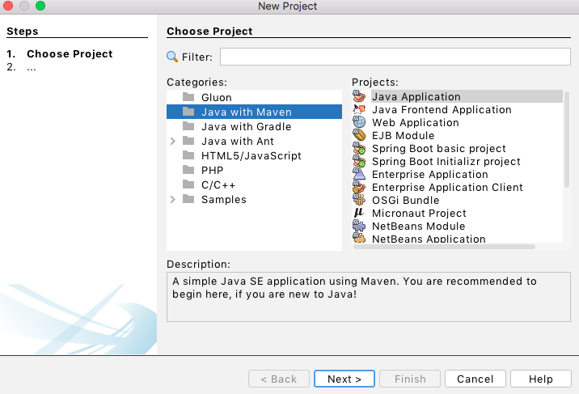

# 6.7 Άσκηση Αντικειμενοστραφούς Προγραμματισμού (συνέχεια) {#Java} 
© Γιάννης Κωστάρας

---

[<](../6.6-UnitTesting/README.md) | [Δ](../../README.md) | [>](../6.8-Assignment/README.md)

---
[](6.7-Exercise.ipynb)

Θα εμπλουτίσουμε το έργο _School_ που ξεκινήσαμε στα μαθήματα των προηγούμενων εβδομάδων με όσα μάθαμε σε αυτήν την εβδομάδα, και πιο συγκεκριμένα:

* Θα προσθέσουμε εξαιρέσεις
* Θα προσθέσουμε αρχεία καταγραφής
* Θα μετατρέψουμε το έργο μας σε maven project
* θα προσθέσουμε ελέγχους μονάδων (unit tests)

## Υλοποίηση με το NetBeans
1. Ανοίξτε το έργο _School_ που δημιουργήσαμε στην προηγούμενη άσκηση από το μενού **File -> Open Project**  ή **File -> Open Recent Project** αν δεν το έχετε ήδη ανοικτό.

Επαναλαμβάνουμε εδώ τον κώδικα των κλάσεών μας. Μην ξεχάσετε να βγάλετε τα σχόλια (uncomment) όταν τον αντιγράψετε σε κάποιο ΟΠΕ.


```Java
//package school.validation;
/**
 * An Utility Validation class.
 */
public final class Validation {
    /** Max size for names. */
    private static final int MAX_SIZE = 20;
    /** Classroom name length. */
    private static final int CLASSROOM_NAME_LENGTH = 2;
    /** Classroom min size. */
    private static final int CLASSROOM_MIN_SIZE = 10;
    /** Classroom default/max size. */
    public static final int CLASSROOM_MAX_SIZE = 30;
    /** Identity length. */
    private static final int ID_LENGTH = 8;

    /**
     * No instance of this class are allowed.
     */
    private Validation() {
    }

    /**
     * A {@code name} is valid if it is neither {@code null} nor empty and 
     * not more than {@code MAX_SIZE}.
     * @param name a name
     * @return {@code true} if {@code name} is valid
     * @see MAX_SIZE
     */
    public static boolean isNameValid(String name) {
        return name != null && !name.isBlank() && name.length() <= MAX_SIZE;
    }
    
    /**
     * A valid age is between 15 and 18 years old. 
     * 
     * @param inAge an age
     * @return {@code true} if {@code inAge} is between the limits
     */
    public static boolean isAgeValid(int inAge) {
        return inAge >= 15 && inAge <= 18;
    }

    /**
     * A valid classroom size is between 10 and 30 pupils.
     * 
     * @param inSize classroom size
     * @return {@code true} if {@code inSize} is between the limits
     * @see CLASSROOM_MIN_SIZE
     * @see CLASSROOM_MAX_SIZE
     */
    public static boolean isSizeValid(int inSize) {
        return inSize >= CLASSROOM_MIN_SIZE && inSize <= CLASSROOM_MAX_SIZE;
    }

    /**
     * A valid classroom name should start with one of the letters {@code Α, Β, Γ}
     * and end with a number. E.g. {@code Γ1}.
     * @param classRoom a classroom name
     * @return {@code true} if {@code classRoom} is valid
     * @see CLASSROOM_NAME_LENGTH
     */
    public static boolean isClassRoomNameValid(String classRoom) {
        return classRoom != null && !classRoom.isBlank()
                && classRoom.length() == CLASSROOM_NAME_LENGTH
                && (classRoom.startsWith("Α")
                || classRoom.startsWith("Β")
                || classRoom.startsWith("Γ"))
                && classRoom.charAt(1) >= '1'
                && classRoom.charAt(1) <= '9';
    }
    
    /**
     * A valid Hellenic ID consists of two letters and six numbers. E.g. {@code XY123456}.
     * @param id a Hellenic ID number (ΑΔΤ)
     * @return {@code true} if the {@code id} is valid
     * @see ID_LENGTH
     */
    public static boolean isIdValid(String id) {
        return id != null && !id.isBlank() && id.length() == ID_LENGTH
                && isCapitalLetter(id.charAt(0))
                && isCapitalLetter(id.charAt(1))
                && isNumber(id.charAt(2))
                && isNumber(id.charAt(3))
                && isNumber(id.charAt(4))
                && isNumber(id.charAt(5))
                && isNumber(id.charAt(6))
                && isNumber(id.charAt(7));
    }

    /**
     * Check if {@code c} is a capital letter.
     * @param c character to check
     * @return {@code true} if {@code c} is capital letter.
     */
    public static boolean isCapitalLetter(char c) {
        return c >= 'A' && c <= 'Ω';
    }
    
    /**
     * Check if {@code c} is a number.
     * @param c character to check
     * @return {@code true} if {@code c} is a number.
     */
    public static boolean isNumber(char c) {
        return c >= '0' && c <= '9';
    }
}
```


```Java
//package school;

//import school.validation.Validation;

/**
 * Parent class of any person.
 */
public abstract class Person {
    /** The empty string used in case no name has been given. */
    static final String NONE = "<Κενό>";
    /** Person's first name. */
    protected String firstName = NONE;
    /** Person's last name. */
    protected String lastName = NONE;

    /**
     * Creates a new person. Is only called by subclasses.
     * 
     * @param firstName first name
     * @param lastName last name
     * @see school.validation.Validation#isNameValid
     */
    Person(String firstName, String lastName) {
        if (Validation.isNameValid(firstName)) {
            this.firstName = firstName.trim();
        }
        if (Validation.isNameValid(lastName)) {
            this.lastName = lastName.trim();
        }
    }

    /**
     * @return person's first name 
     */
    public String getFirstName() {
        return firstName;
    }

    /**
     * Set person's first name. 
     * 
     * @param firstName a new first name
     * @see school.validation.Validation#isNameValid
     */
    public void setFirstName(String firstName) {
        this.firstName = Validation.isNameValid(firstName) ? firstName.trim() : NONE;
    }

    /**
     * @return person's last name 
     */
    public String getLastName() {
        return lastName;
    }
    
    /**
     * Set person's last name. 
     * 
     * @param lastName a new last name
     * @see school.validation.Validation#isNameValid
     */
    public void setLastName(String lastName) {
        this.lastName = Validation.isNameValid(lastName) ? lastName.trim() : NONE;
    }

    @Override
    public String toString() {
        return ", firstName=" + firstName + ", lastName=" + lastName;
    }
}
```

```Java
//package school;

//import school.validation.Validation;

/**
 * A student of the school.
 */
public class Student extends Person {
    /** Automatic counter to set AM. */
    private static int amCounter = 0;
    /** Student's registration number (AM).*/
    private final int am;
    /** Student's age. -1 means age has not been set. */
    private int age = -1;  // 15-18
    /** Student's classroom. */
    private ClassRoom classRoom;

    /**
     * Constructor.
     * 
     * @param firstName student's first name
     * @param lastName student's last name
     * @param age student's age must be between 15 and 18 years old
     * @see school.validation.Validation#isAgeValid(int) 
     */
    public Student(String firstName, String lastName, int age) {
        super(firstName, lastName);
        am = ++amCounter;
        if (Validation.isAgeValid(age)) {
            this.age = age;
        }
    }

    /**
     * Student's AM is calculated automatically.
     * @return student's AM
     */
    public int getAm() {
        return am;
    }
    
    /**
     * @return student's age 
     */
    public int getAge() {
        return age;
    }

    /**
     * Set student's age. It increases every year.
     * @param age student's age.
     * @see school.validation.Validation#isAgeValid(int) 
     */
    public void setAge(int age) {
        this.age = Validation.isAgeValid(age) ? age : -1;
    }

    /**
     * @return the classroom the student is in.
     */
    public ClassRoom getClassRoom() {
        return classRoom;
    }

    /**
     * Set student's classroom.
     * @param classRoom new classroom for student.
     */
    void setClassRoom(ClassRoom classRoom) {
        this.classRoom = classRoom;
    }

    @Override
    public int hashCode() {
        int hash = 7;
        hash = 41 * hash + this.am;
        return hash;
    }

    @Override
    public boolean equals(Object obj) {
        if (this == obj) {
            return true;
        }
        if (obj == null) {
            return false;
        }
        if (getClass() != obj.getClass()) {
            return false;
        }
        final Student other = (Student) obj;
        return this.am == other.am;
    }
    
    @Override
    public String toString() {
        return "Student{" + "am=" + am + super.toString() + ", age=" + age + ", classRoom=" + classRoom + '}';
    }
}
```


```Java
//package school;

import java.util.Arrays;
import java.util.Collection;
import java.util.Collections;
import java.util.HashSet;
import java.util.Objects;
import java.util.Set;
//import school.validation.Validation;

/**
 * A school teacher.
 */
public class Teacher extends Person {
    /** Max number of lessons a teacher can teach in the school. */
    private static final int MAX_LESSONS = 3;
    /** No ID number. */
    private String id = NONE;  // ΑΔΤ
    /** Lessons the teacher can teach. */
    private final Set<String> lessons;

    /**
     * Constructor.
     * 
     * @param id teacher's ID number
     * @param firstName teacher's first name
     * @param lastName teacher's last name
     * @param lessons a teacher can teach up to 3 lessons
     * @see MAX_LESSONS
     * @see school.validation.Validation#isIdValid(java.lang.String) 
     */
    public Teacher(String id, String firstName, String lastName, String... lessons) {
        super(firstName, lastName);
        if (Validation.isIdValid(id)) {
            this.id = id;
        }
        if (lessons != null && lessons.length > 0) { // αντιγράφουμε μόνο τα 3 πρώτα μαθήματα
            int length = lessons.length > MAX_LESSONS ? MAX_LESSONS : lessons.length;
            this.lessons = new HashSet<>(Arrays.asList(Arrays.copyOfRange(lessons, 0, length)));
        } else {
            this.lessons = new HashSet<>(MAX_LESSONS);
        }
    }

    /**
     * @return the teacher's ID number
     */
    public String getId() {
        return id;
    }

    /**
     * Set the teacher's id.
     * 
     * @param id the new ID number. It shouldn't be null.
     * @see school.validation.Validation#isIdValid(java.lang.String)
     */
    public void setId(String id) {
        this.id = Validation.isIdValid(id) ? id : NONE;
    }

    /**
     * Add a new lesson that this teacher teaches. If the number of lessons
     * that a teacher can teach is reached, the lesson is ignored.
     * @param lesson lesson to add
     */
    public void addLesson(String lesson) {
        if (lesson != null && lessons.size() < MAX_LESSONS) {
            lessons.add(lesson);
        }
    }
    /**
     * Remove the lesson from the lessons that this teacher teaches. If the 
     * lesson is not teached by this teacher, it is ignored.
     * @param lesson lesson to remove
     */
    public void removeLesson(String lesson) {
        if (lesson != null) {
            this.lessons.remove(lesson);
        }
    }
    
    /**
     * Checks if the teacher teaches this lesson.
     * @param les lesson to search for
     * @return {@code true} if the teacher teaches this lesson.
     */
    public boolean contains(String les) {
        return les == null ? false : this.lessons.contains(les);
    }
    
    /**
     * @return the lessons that this teacher teaches. 
     */
    public Collection<String> getLessons() {
        return Collections.unmodifiableCollection(this.lessons);
    }    

    @Override
    public int hashCode() {
        int hash = 3;
        hash = 59 * hash + Objects.hashCode(this.id);
        return hash;
    }

    @Override
    public boolean equals(Object obj) {
        if (this == obj) {
            return true;
        }
        if (obj == null) {
            return false;
        }
        if (getClass() != obj.getClass()) {
            return false;
        }
        final Teacher other = (Teacher) obj;
        return Objects.equals(this.id, other.id);
    }

    @Override
    public String toString() {
        return "Teacher{" + "id=" + id + super.toString() + ", lessons=" + lessons + '}';
    }    

}
```

```Java
//package school;
import java.util.Collection;
import java.util.Collections;
import java.util.HashSet;
import java.util.Objects;
import java.util.Set;
//import school.validation.Validation;

/**
 * A classroom has a name, a size and contains students.
 */
public class ClassRoom {
    /** Empty classroom name. */
    private static final String NO_CLASSROOM = "--";
    /** Classroom's name. */ 
    private final String name;
    /** Classroom's size. */ 
    private final int size;
    /** Classrooms' students. */ 
    private final Set<Student> students;

    /**
     * Constructor.
     * 
     * @param name classroom's name
     * @param size classroom's size
     * @see school.validation.Validation#isClassRoomNameValid(java.lang.String) 
     * @see school.validation.Validation#isSizeValid(int)
     * @see school.validation.Validation#CLASSROOM_MAX_SIZE
     * @see NO_CLASSROOM
     */
    public ClassRoom(String name, int size) {
        this.name = Validation.isClassRoomNameValid(name) ? name : NO_CLASSROOM;
        this.size = Validation.isSizeValid(size) ? size : Validation.CLASSROOM_MAX_SIZE;
        this.students = new HashSet<>(size);
    }

    /**
     * Constructor. Default size.
     * 
     * @param name classroom's name. 
     * @see school.validation.Validation#CLASSROOM_MAX_SIZE
     */
    public ClassRoom(String name) {
        this(name, Validation.CLASSROOM_MAX_SIZE);
    }

    /**
     * @return classroom's name
     */
    public String getName() {
        return name;
    }

    /**
     * @return classroom's size
     */
    public int getSize() {
        return size;
    }

    /**
     * Add {@code student} to the class. 
     * @param student to add
     */
    public void addStudent(Student student) {
        if (student != null && students.size() < size) {
            students.add(student);
            student.setClassRoom(this);
        }
    }

    /**
     * Remove student with {@code am} from this class.
     * @param am student's reg. number.
     * @return the removed student
     */
    public Student removeStudent(int am) {
        Student student = contains(am);
        if (removeStudent(student)) {
           student.setClassRoom(null);
        }
        return student;
    }

    /**
     * Remove {@code student} from this class.
     * 
     * @param student student to remove from this class
     * @return {@code true} if student was removed successfully
     */
    public boolean removeStudent(Student student) {
        boolean removed = false;
        if (student != null) {
            removed = students.remove(student);
            student.setClassRoom(null);
        }
        return removed;
    }

    /**
     * Empty this class.
     */
    public void removeAllStudents() {
        for (Student student : students) {
            student.setClassRoom(null);
        }
        students.clear();
    }
    
    /**
     * Checks if the student is in this class.
     * @param am am of student to search for
     * @return {@code true} if the student with the given {@code am} exists in this class.
     */
    public Student contains(int am) {
        for (Student student : students) {
            if (student.getAm() == am) {
                return student;
            }
        }
        return null;
    }
    
    /**
     * @return the students of this class. 
     */
    public Collection<Student> getStudents() {
        return Collections.unmodifiableCollection(students);
    }

    @Override
    public int hashCode() {
        int hash = 7;
        hash = 29 * hash + Objects.hashCode(this.name);
        return hash;
    }

    @Override
    public boolean equals(Object obj) {
        if (this == obj) {
            return true;
        }
        if (obj == null) {
            return false;
    
        }
        if (getClass() != obj.getClass()) {
            return false;
        }
        final ClassRoom other = (ClassRoom) obj;
        return Objects.equals(this.name, other.name);
    }

    @Override
    public String toString() {
        return "ClassRoom{" + "name=" + name + ", size=" + size + ", numOfStudents=" + students.size() + '}';
    }
}
```

### Χρήση εξαιρέσεων

Οι εξαιρέσεις χρησιμοποιούνται για να προστατεύσουν το πρόγραμμά μας από μη αναμενόμενες περιπτώσεις. 

Π.χ. η μέθοδος `setAge()` της κλάσης `Student`

```Java
    /**
     * Set student's age. It increases every year.
     * @param age student's age.
     * @see school.validation.Validation#isAgeValid(int) 
     */
    public void setAge(int age) {
        this.age = Validation.isAgeValid(age) ? age : -1;
    }
```
θέτει το γνώρισμα ```age``` σε μια μη έγκυρη τιμή (```-1```) όταν αυτός που καλεί τη μέθοδο περάσει μια ηλικία που δεν ικανοποιεί τα όρια 15-18. Πιο σωστό στην περίπτωση αυτή θα ήταν να εγείρουμε μια κατάλληλη εξαίρεση ώστε να ειδοποιήσουμε τον χρήστη ότι δεν δόθηκε σωστή ηλικία.

```Java
    /**
     * Set student's age. It increases every year.
     * @param age student's age.
     * @see school.validation.Validation#isAgeValid(int)
     * @throws IllegalArgumentException
     */
    public void setAge(int age) {
        if (Validation.isAgeValid(age)) {
            this.age = age;
        } else {
            throw new IllegalArgumentException("Η ηλικία πρέπει να είναι μεταξύ 15 και 18.");
        }
    }
```
H `IllegalArgumentException()` εγείρεται όταν περάσουμε σε μια μέθοδο μη έγκυρα ορίσματα. Προσέξτε και την επισημείωση `@throws` στα σχόλια Javadoc.

Παρόμοια μπορούμε να γράψουμε και τη μέθοδο κατασκευής:

```Java
    /**
     * Constructor.
     * 
     * @param firstName student's first name
     * @param lastName student's last name
     * @param age student's age must be between 15 and 18 years old
     * @see school.validation.Validation#isAgeValid(int)
     * @throws IllegalArgumentException
     */
    public Student(String firstName, String lastName, int age) {
        super(firstName, lastName);
        am = ++amCounter;
        setAge(age);
    }
```

### Χρήση αρχείων καταγραφής
Θα χρησιμοποιήσουμε το Log4j για να δούμε και πώς μπορούμε να προσθέσουμε βιβλιοθήκες σε ένα έργο Ant του NetBeans. 

1. Κατεβάστε το αρχείο ```apache-log4j-2.17.2-bin.zip``` ή νεώτερο από [εδώ](https://logging.apache.org/log4j/2.x/download.html) και αποσυμπιέστε το.
1. Κάντε δεξί κλικ στο _Libraries_ και επιλέξτε **Add JAR/Folder...**. 
1. Επιλέξτε το ```log4j-core-2.17.2.jar``` και **Open**.
1. Επαναλάβετε για το ```log4j-api-2.17.2.jar```.

Παρακάτω θα δούμε πώς μπορούμε να προσθέσουμε αυτές τις εξαρτήσεις σε ένα έργο maven.

Αφού προσθέσαμε τις βιβλιοθήκες στο έργο, μπορούμε να χρησιμοποιήσουμε τις αντίστοιχες κλάσεις στο πρόγραμμά μας.

Εδώ βλέπουμε για παράδειγμα την κλάση ```Student```:

```java
package school;

import org.apache.logging.log4j.LogManager;
import org.apache.logging.log4j.Logger;
import school.validation.Validation;

/**
 * A student of the school.
 */
public class Student extends Person {
    /** Automatic counter to set AM. */
    private static int amCounter = 0;
    /** Student's registration number (AM).*/
    private final int am;
    /** Student's age. -1 means age has not been set. */
    private int age = -1;  // 15-18
    /** Student's classroom. */
    private ClassRoom classRoom;
    /** Logger. */
    private static final Logger LOG = LogManager.getLogger(Student.class);      

    /**
     * Constructor.
     *
     * @param firstName student's first name
     * @param lastName student's last name
     * @param age student's age must be between 15 and 18 years old
     * @see school.validation.Validation#isAgeValid(int)
     * @throws IllegalArgumentException
     */
    public Student(String firstName, String lastName, int age) {
        super(firstName, lastName);
        am = ++amCounter;
        if (LOG.isDebugEnabled()) {
            LOG.debug("AM=" + am);
        }
        setAge(age);
    }

    /**
     * Student's AM is calculated automatically.
     *
     * @return student's AM
     */
    public int getAm() {
        return am;
    }

    /**
     * @return student's age
     */
    public int getAge() {
        return age;
    }

    /**
     * Set student's age. It increases every year.
     *
     * @param age student's age.
     * @see school.validation.Validation#isAgeValid(int)
     * @throws IllegalArgumentException
     */
    public void setAge(int age) {
        if (Validation.isAgeValid(age)) {
            this.age = age;
        } else {
            LOG.error("Μη έγκυρη ηλικία " + age + ". Η ηλικία πρέπει να είναι μεταξύ 15 και 18");
            throw new IllegalArgumentException("Η ηλικία πρέπει να είναι μεταξύ 15 και 18");
        }
    }

    /**
     * @return the classroom the student is in.
     */
    public ClassRoom getClassRoom() {
        return classRoom;
    }

    /**
     * Set student's classroom.
     *
     * @param classRoom new classroom for student.
     */
    void setClassRoom(ClassRoom classRoom) {
        this.classRoom = classRoom;
        if (LOG.isDebugEnabled()) {
            LOG.debug("Student with am=" + am + " was added to classroom " + classRoom);
        }
    }

    @Override
    public int hashCode() {
        int hash = 7;
        hash = 41 * hash + this.am;
        return hash;
    }

    @Override
    public boolean equals(Object obj) {
        if (this == obj) {
            return true;
        }
        if (obj == null) {
            return false;
        }
        if (getClass() != obj.getClass()) {
            return false;
        }
        final Student other = (Student) obj;
        return this.am == other.am;
    }

    @Override
    public String toString() {
        return "Student{" + "am=" + am + super.toString() + ", age=" + age + ", classRoom=" + classRoom + '}';
    }
}
```

Φυσικά, θα πρέπει να δημιουργήσουμε και το κατάλληλο αρχείο ```log4j.xml``` στον κατάλογο του έργου:

```xml
<?xml version="1.0" encoding="UTF-8"?>

<Configuration status="info">
  <Appenders>
    <Console name="STDOUT" target="SYSTEM_OUT">
      <PatternLayout pattern="%m%n"/>
    </Console>
    <File name="FILE" fileName="log/school.log">
      <PatternLayout>
        <Pattern>%d %p %c{1.} [%t] %m%n</Pattern>
      </PatternLayout>
    </File>
  </Appenders>
  <Loggers>
    <Root level="DEBUG">
      <AppenderRef ref="FILE" level="DEBUG"/>
      <AppenderRef ref="STDOUT" level="DEBUG"/>
    </Root>
  </Loggers>
</Configuration>
```
Βλέπουμε ότι έχουμε δημιουργήσει δυο appenders, έναν για την καταγραφή σε αρχείο κι έναν για καταγραφή στην οθόνη. 

Δεν αρκεί όμως μόνο αυτό. Θα πρέπει να δηλώσουμε στο πρόγραμμά μας ότι θα πρέπει να χρησιμοποιήσει αυτό το αρχείο κι αυτό το δηλώνουμε περνώντας στην ΕΜ Java μια παράμετρο περιβάλλοντος ```-Dlog4j.configurationFile=log4j2.xml```. Στο NetBeans αυτό δηλώνεται στο παράθυρο **Project Properties** όπως φαίνεται στην παρακάτω εικόνα:


**Εικόνα 6.7.1** _Ορισμός παραμέτρων περιβάλλοντος στο παράθυρο Project Properties του NetBeans_

Όταν τώρα εκτελέσετε το πρόγραμμα, θα δείτε να έχει δημιουργηθεί ένα νέο αρχείο καταγραφής ```log/school.log```.

### Δημιουργία έργου Maven
Το έργο που έχουμε δημιουργήσει μέχρι στιγμής είναι ένα έργο _ant_. Αν κάνετε κλικ στην καρτέλα _Files_ θα δείτε ότι υπάρχει ένα αρχείο ```build.xml``` που έχει δημιουργήσει το NetBeans για να οικοδομήσει το έργο. Η διαχείριση των διαφόρων βιβλιοθηκών που απαιτούνται από το έργο για να οικοδομηθεί και να εκτελεστεί γίνεται από τον προγραμματιστή. Π.χ. είδαμε προηγούμενα πώς να προσθέσουμε μόνοι μας τα ```jar``` αρχεία για logging στο φάκελο ```lib```.

Θα μετατρέψουμε το έργο μας σε maven για καλύτερη διαχείριση κλπ.

1) Κάντε κλικ στο μενού **File -> New Project**, κατηγορία **Java with Maven** και έργο **Java Application**. Πατήστε **Next**.



**Εικόνα 6.7.2** _File New Maven Project με το NetBeans_

2) Συμπληρώστε τις συντεταγμένες του έργου όπως στην παρακάτω εικόνα και πατήστε **Finish**.


**Εικόνα 6.7.3** _Συντεταγμένες New Maven Project με το NetBeans_

3) Ανοίξτε το ```pom.xml``` (βρίσκεται μέσα στο φάκελο _Project Files_):

```xml
<?xml version="1.0" encoding="UTF-8"?>
<project xmlns="http://maven.apache.org/POM/4.0.0" xmlns:xsi="http://www.w3.org/2001/XMLSchema-instance" xsi:schemaLocation="http://maven.apache.org/POM/4.0.0 http://maven.apache.org/xsd/maven-4.0.0.xsd">
    <modelVersion>4.0.0</modelVersion>
    <groupId>school</groupId>
    <artifactId>schoolmvn</artifactId>
    <version>1.0-SNAPSHOT</version>
    <packaging>jar</packaging>
    <properties>
        <maven.compiler.source>17</maven.compiler.source>
        <maven.compiler.target>17</maven.compiler.target>
        <exec.mainClass>school.Schoolmvn</exec.mainClass>
    </properties>
</project>
```
4) Διαγράψτε την κλάση ```Schoolmvn.java``` και αντιγράψτε τις κλάσεις από το έργο ```School```.

5) Στο ```pom.xml``` μετονομάστε τη γραμμή ```<exec.mainClass>``` ώστε να είναι:

```xml
<exec.mainClass>school.School</exec.mainClass>
```

6) Πρέπει να προσθέσουμε εξάρτηση στο ```log4j```. Αφού ψάξουμε στο https://mvnrepository.com/ για ```log4j-api, log4j-core```, ενημερώνουμε το ```pom.xml``` προσθέτοντας μια περιοχή ```<dependencies>...</dependencies>``` πριν από το ```</project>```:

```xml
<?xml version="1.0" encoding="UTF-8"?>
<project xmlns="http://maven.apache.org/POM/4.0.0" xmlns:xsi="http://www.w3.org/2001/XMLSchema-instance" xsi:schemaLocation="http://maven.apache.org/POM/4.0.0 http://maven.apache.org/xsd/maven-4.0.0.xsd">
    <modelVersion>4.0.0</modelVersion>
    <groupId>school</groupId>
    <artifactId>schoolmvn</artifactId>
    <version>1.0-SNAPSHOT</version>
    <packaging>jar</packaging>
    <properties>
        <project.build.sourceEncoding>UTF-8</project.build.sourceEncoding>
        <project.reporting.outputEncoding>UTF-8</project.reporting.outputEncoding>        
        <maven.compiler.source>17</maven.compiler.source>
        <maven.compiler.target>17</maven.compiler.target>
        <exec.mainClass>school.School</exec.mainClass>
    </properties>
    
    <dependencies>
        <dependency>
            <groupId>org.apache.logging.log4j</groupId>
            <artifactId>log4j-core</artifactId>
            <version>2.17.2</version>
        </dependency>
        <dependency>
            <groupId>org.apache.logging.log4j</groupId>
            <artifactId>log4j-api</artifactId>
            <version>2.17.2</version>
        </dependency>
    </dependencies>
</project>
```
Προσέξτε ότι λίγο παλαιότερες εκδόσεις του ```log4j-core``` είχαν κάποια σοβαρά κενά ασφαλείας (vulnerabilities) ικανά να κάνουν αρκετούς να χάσουν τον ύπνο τους. 

7) Δεξί κλικ στο έργο ```schoolmvn``` και επιλέξτε **Build**. 

Το αποτέλεσμα θα αντιγραφεί στο ```~/.m2/repository``` ή ```%USERNAME%\.m2\repository``` (Windows):

```bash
Installing /Users/MyMacBook/Projects/Java/Mathesis/schoolmvn/target/schoolmvn-1.0-SNAPSHOT.jar to /Users/MyMacBook/.m2/repository/school/schoolmvn/1.0-SNAPSHOT/schoolmvn-1.0-SNAPSHOT.jar
Installing /Users/MyMacBook/Projects/Java/Mathesis/schoolmvn/pom.xml to /Users/MyMacBook/.m2/repository/school/schoolmvn/1.0-SNAPSHOT/schoolmvn-1.0-SNAPSHOT.pom
```
Μπορείτε να το εκτελέσετε κατά τα γνωστά, π.χ.:

```bash
mvn exec:java -Dexec.mainClass=school.School
```

Μπορείτε να δημιουργήσετε κι άλλους στόχους (target) στο NetBeans ως εξής:

1. Δεξί κλικ στο έργο ```schoolmvn``` και επιλέξτε **Run Maven -> Goals...**
1. Γράψτε μέσα στο πεδίο _Goals_: ```package``` και **OK**

Μπορείτε πλέον να δίνετε στον στόχο **Run Maven -> package** ο οποίος απλά δημιουργεί το ```.jar``` αρχείο και δεν το αντιγράφει στο τοπικό αποθετήριο.

Το ```schoolmvn-1.0-SNAPSHOT.jar``` δεν είναι εκτελέσιμο, αλλά μπορούμε να το κάνουμε εκτελέσιμο χρησιμοποιώντας κάποιον από τους τρόπους που αναφέρονται [εδώ](https://www.baeldung.com/executable-jar-with-maven):

```xml
<?xml version="1.0" encoding="UTF-8"?>
<project xmlns="http://maven.apache.org/POM/4.0.0" xmlns:xsi="http://www.w3.org/2001/XMLSchema-instance" xsi:schemaLocation="http://maven.apache.org/POM/4.0.0 http://maven.apache.org/xsd/maven-4.0.0.xsd">
    <modelVersion>4.0.0</modelVersion>
    <groupId>school</groupId>
    <artifactId>schoolmvn</artifactId>
    <version>1.0-SNAPSHOT</version>
    <packaging>jar</packaging>
    <properties>
        <project.build.sourceEncoding>UTF-8</project.build.sourceEncoding>
        <project.reporting.outputEncoding>UTF-8</project.reporting.outputEncoding>        
        <maven.compiler.source>17</maven.compiler.source>
        <maven.compiler.target>17</maven.compiler.target>
        <exec.mainClass>school.School</exec.mainClass>
    </properties>
    
    <dependencies>
        <dependency>
            <groupId>org.apache.logging.log4j</groupId>
            <artifactId>log4j-core</artifactId>
            <version>2.17.2</version>
        </dependency>
        <dependency>
            <groupId>org.apache.logging.log4j</groupId>
            <artifactId>log4j-api</artifactId>
            <version>2.17.2</version>
        </dependency>
    </dependencies>
    
    <build>
        <plugins>
            <plugin>
                <groupId>org.apache.maven.plugins</groupId>
                <artifactId>maven-assembly-plugin</artifactId>
                <executions>
                    <execution>
                        <phase>package</phase>
                        <goals>
                            <goal>single</goal>
                        </goals>
                        <configuration>
                            <archive>
                                <manifest>
                                    <mainClass>
                                        school.School
                                    </mainClass>
                                </manifest>
                            </archive>
                            <descriptorRefs>
                                <descriptorRef>jar-with-dependencies</descriptorRef>
                            </descriptorRefs>
                        </configuration>
                    </execution>
                </executions>
            </plugin>
        </plugins>
    </build>
        
</project>
```
Αν ξαναχτίσετε το έργο, αυτή τη φορά θα δημιουργηθεί και το ```schoolmvn-1.0-SNAPSHOT-jar-with-dependencies.jar``` το οποίο περιέχει και όλα τα ```.jar``` αρχεία από τα οποία εξαρτάται:

```bash
$ java -jar schoolmvn-1.0-SNAPSHOT-jar-with-dependencies.jar
...
```

### Unit Testing

1. Δεξί κλικ στην κλάση ```Student``` και από το αναδυόμενο μενού επιλέξτε **Tools -> Create/Update Tests** και κλικ στο **ΟΚ**.

Το NetBeans δημιούργησε τη νέα κλάση ```StudentTest``` ενώ πρόσθεσε τις εξής εξαρτήσεις στο ```pom.xml```:

```xml
<dependency>
    <groupId>org.junit.jupiter</groupId>
    <artifactId>junit-jupiter-api</artifactId>
    <version>6.6.0</version>
    <scope>test</scope>
</dependency>
<dependency>
    <groupId>org.junit.jupiter</groupId>
    <artifactId>junit-jupiter-params</artifactId>
    <version>6.6.0</version>
    <scope>test</scope>
</dependency>
<dependency>
    <groupId>org.junit.jupiter</groupId>
    <artifactId>junit-jupiter-engine</artifactId>
    <version>6.6.0</version>
    <scope>test</scope>
</dependency>
```

```java
package school;

import org.junit.jupiter.api.AfterEach;
import org.junit.jupiter.api.BeforeEach;
import org.junit.jupiter.api.Test;
import static org.junit.jupiter.api.Assertions.*;

/**
 *
 */
public class StudentTest {
    
    public StudentTest() {
    }
    
    @BeforeEach
    public void setUp() {
    }
    
    @AfterEach
    public void tearDown() {
    }

    /**
     * Test of getAm method, of class Student.
     */
    @Test
    public void testGetAm() {
        System.out.println("getAm");
        Student instance = null;
        int expResult = 0;
        int result = instance.getAm();
        assertEquals(expResult, result);
        // TODO review the generated test code and remove the default call to fail.
        fail("The test case is a prototype.");
    }

    /**
     * Test of getAge method, of class Student.
     */
    @Test
    public void testGetAge() {
        System.out.println("getAge");
        Student instance = null;
        int expResult = 0;
        int result = instance.getAge();
        assertEquals(expResult, result);
        // TODO review the generated test code and remove the default call to fail.
        fail("The test case is a prototype.");
    }

    /**
     * Test of setAge method, of class Student.
     */
    @Test
    public void testSetAge() {
        System.out.println("setAge");
        int age = 0;
        Student instance = null;
        instance.setAge(age);
        // TODO review the generated test code and remove the default call to fail.
        fail("The test case is a prototype.");
    }

    /**
     * Test of getClassRoom method, of class Student.
     */
    @Test
    public void testGetClassRoom() {
        System.out.println("getClassRoom");
        Student instance = null;
        ClassRoom expResult = null;
        ClassRoom result = instance.getClassRoom();
        assertEquals(expResult, result);
        // TODO review the generated test code and remove the default call to fail.
        fail("The test case is a prototype.");
    }

    /**
     * Test of setClassRoom method, of class Student.
     */
    @Test
    public void testSetClassRoom() {
        System.out.println("setClassRoom");
        ClassRoom classRoom = null;
        Student instance = null;
        instance.setClassRoom(classRoom);
        // TODO review the generated test code and remove the default call to fail.
        fail("The test case is a prototype.");
    }

    /**
     * Test of hashCode method, of class Student.
     */
    @Test
    public void testHashCode() {
        System.out.println("hashCode");
        Student instance = null;
        int expResult = 0;
        int result = instance.hashCode();
        assertEquals(expResult, result);
        // TODO review the generated test code and remove the default call to fail.
        fail("The test case is a prototype.");
    }

    /**
     * Test of equals method, of class Student.
     */
    @Test
    public void testEquals() {
        System.out.println("equals");
        Object obj = null;
        Student instance = null;
        boolean expResult = false;
        boolean result = instance.equals(obj);
        assertEquals(expResult, result);
        // TODO review the generated test code and remove the default call to fail.
        fail("The test case is a prototype.");
    }

    /**
     * Test of toString method, of class Student.
     */
    @Test
    public void testToString() {
        System.out.println("toString");
        Student instance = null;
        String expResult = "";
        String result = instance.toString();
        assertEquals(expResult, result);
        // TODO review the generated test code and remove the default call to fail.
        fail("The test case is a prototype.");
    }
    
}
```

Το NetBeans έχει δημιουργήσει unit tests για όλες τις public μεθόδους της κλάσης. Αν κάνετε δεξί κλικ στη νεοδημιουργηθήσα κλάση και επιλέξετε **Test File** θα δείτε ότι όλα τα τεστ αποτυγχάνουν. Θα πρέπει να τα κάνουμε να επιτύχουν. Θα μας βοηθήσει η κλάση ```School```.

Θα πρέπει να δημιουργήσουμε ελέγχους για το καλό σενάριο, όπου όλα βαίνουν καλώς, αλλά και για τα σενάρια που κάτι μπορεί να πάει λάθος. Η διορθωμένη ```StudentTest``` φαίνεται στη συνέχεια:

```java
package school;

import org.junit.jupiter.api.AfterEach;
import org.junit.jupiter.api.BeforeEach;
import org.junit.jupiter.api.Test;
import static org.junit.jupiter.api.Assertions.*;
import org.junit.jupiter.api.DisplayName;

/**
 * StudentTest 
 */
public class StudentTest {
    
    private static final ClassRoom[] classRooms = { 
        new ClassRoom("Α1"), 
        new ClassRoom("Α2", 28), 
        new ClassRoom("Α3", 25), 
        new ClassRoom("Β1"), 
        new ClassRoom("Β2", 28), 
        new ClassRoom("Β3", 25), 
        new ClassRoom("Γ1"), 
        new ClassRoom("Γ2", 26), 
        new ClassRoom("Γ3", 22), 
    };
    private final Student instance = new Student("Γιάννης", "Αντεκοτούμπο", 16);
    
    @BeforeEach
    public void setUp() {
    }
    
    @AfterEach
    public void tearDown() {
    }

    /**
     * Test of getAm method, of class Student.
     */
    @DisplayName("getAm")
    @Test
    public void testGetAm() {
        assertEquals(1, instance.getAm());
    }

    /**
     * Test of getAge/setAge methods, of class Student.
     */
    @DisplayName("getAge/setAge")
    @Test
    public void testAge() {
        assertEquals(16, instance.getAge());
        instance.setAge(17);
        assertEquals(17, instance.getAge());
    }

    /**
     * Test of getClassRoom/setClassRoom method, of class Student.
     */
    @DisplayName("getClassRoom/setClassRoom")
    @Test
    public void testGetClassRoom() {
        assertEquals(null, instance.getClassRoom());
        instance.setClassRoom(classRooms[3]);
        assertEquals(classRooms[3], instance.getClassRoom());
    }

    /**
     * Test of equals method, of class Student.
     */
    @DisplayName("equals")
    @Test
    public void testEquals() {
        Student student = instance;
        assertTrue(instance.equals(student));
    }

    /**
     * Test of toString method, of class Student.
     */
    @DisplayName("toString")
    @Test
    public void testToString() {
        String expResult = "Student{am=1, firstName=Γιάννης, lastName=Αντεκοτούμπο, age=16, classRoom=null}";
        assertEquals(expResult, instance.toString());
    }

    /**
     * Test of hashCode method, of class Student.
     */
    @DisplayName("hashCode")
    @Test
    public void testHashCode() {
        Student otherStudent = instance;
        assertEquals(otherStudent.hashCode(), instance.hashCode());
        otherStudent = new Student("Νίκος", "Γκάλης", 18);
        assertNotEquals(otherStudent.hashCode(), instance.hashCode());
    }
    
}
```
Αν ξανατρέξετε την ```StudentTest``` θα δείτε ότι όλα 2 τεστ αποτυγχάνουν:
```
-------------------------------------------------------
 T E S T S
-------------------------------------------------------
Running school.StudentTest
Tests run: 6, Failures: 2, Errors: 0, Skipped: 0, Time elapsed: 0.357 s <<< FAILURE! - in school.StudentTest
testGetAm  Time elapsed: 0.067 s  <<< FAILURE!
org.opentest4j.AssertionFailedError: expected: <1> but was: <2>
	at school.StudentTest.testGetAm(StudentTest.java:42)

testToString  Time elapsed: 0.173 s  <<< FAILURE!
org.opentest4j.AssertionFailedError: expected: <Student{am=1, firstName=Γιάννης, lastName=Αντεκοτούμπο, age=16, classRoom=null}> but was: <Student{am=3, firstName=Γιάννης, lastName=Αντεκοτούμπο, age=16, classRoom=null}>
	at school.StudentTest.testToString(StudentTest.java:84)

Results:

Failures: 
  StudentTest.testGetAm:42 expected: <1> but was: <2>
  StudentTest.testToString:84 expected: <Student{am=1, firstName=Γιάννης, lastName=Αντεκοτούμπο, age=16, classRoom=null}> but was: <Student{am=3, firstName=Γιάννης, lastName=Αντεκοτούμπο, age=16, classRoom=null}>

Tests run: 6, Failures: 2, Errors: 0, Skipped: 0

------------------------------------------------------------------------
BUILD FAILURE
------------------------------------------------------------------------
...
```
Το πρόβλημα έγκειται στο ότι το JUnit δημιουργεί εσωτερικά περισσότερα από ένα αντικείμενα για να εκτελέσει τα τεστ, με αποτέλεσμα το unit test μας να αποτυγχάνει. Δυστυχώς δεν μπορούμε να κάνουμε πολλά πράγματα γι' αυτό, πέραν του γεγονότος ότι ίσως να μην ήταν και τόσο καλή ιδέα να δημιουργούμε τους ΑΜ των μαθητών αυτόματα.

Θα βάλουμε σε σχόλια την ```testGetAm()``` αφού δεν μπορούμε να την τεστάρουμε, ενώ μπορούμε να παρακάμψουμε την αποτυχία της ```testToString()``` ως εξής:

```java
    @DisplayName("toString")
    @Test
    public void testToString() {
        String expResult = "Student{am=" + instance.getAm() + ", firstName=Γιάννης, lastName=Αντεκοτούμπο, age=16, classRoom=null}";
        assertEquals(expResult, instance.toString());
    }
```

Τα unit tests των υπόλοιπων κλάσεων παραθέτονται παρακάτω. Η ```Validation``` τεστάρεται μέσω των ελέγχων των υπόλοιπων κλάσεων.

```java
package school;

import java.util.Set;
import org.junit.jupiter.api.AfterEach;
import org.junit.jupiter.api.BeforeEach;
import org.junit.jupiter.api.Test;
import static org.junit.jupiter.api.Assertions.*;
import org.junit.jupiter.api.DisplayName;

public class TeacherTest {

    private Teacher instance;

    @BeforeEach
    public void setUp() {
        instance = new Teacher("AB123456", "Σωκράτης", "Σωκράτης");
        instance.addLesson("Φιλοσοφία");
        instance.addLesson("Αρχαία Ελληνικά");
    }

    @AfterEach
    public void tearDown() {
    }

    /**
     * Test of getId/setId methods, of class Teacher.
     */
    @DisplayName("getId/setId")
    @Test
    public void testId() {
        assertEquals("AB123456", instance.getId());
        instance.setId("ΧΥ123456");
        assertEquals("ΧΥ123456", instance.getId());

    }

    /**
     * Test of addLesson/removeLesson methods, of class Teacher.
     */
    @DisplayName("addLesson/removeLesson")
    @Test
    public void testAddRemoveLesson() {
        Set<String> lessons1 = Set.of("Αρχαία Ελληνικά","Φιλοσοφία");
        assertTrue(lessons1.size() == instance.getLessons().size() &&
                lessons1.containsAll(instance.getLessons()) &&
                instance.getLessons().containsAll(lessons1));
        String lesson1 = "Γραμματική";
        instance.addLesson(lesson1);
        assertTrue(instance.contains(lesson1));
        String lesson2 = "Χημεία";
        instance.addLesson(lesson2);
        assertFalse(instance.contains(lesson2));
        Set<String> lessons2 = Set.of("Φιλοσοφία", "Αρχαία Ελληνικά", lesson1);
        assertTrue(lessons2.size() == instance.getLessons().size() &&
                lessons2.containsAll(instance.getLessons()) &&
                instance.getLessons().containsAll(lessons2));
        instance.removeLesson(lesson2);
        assertTrue(lessons2.size() == instance.getLessons().size() &&
                lessons2.containsAll(instance.getLessons()) &&
                instance.getLessons().containsAll(lessons2));
        instance.removeLesson(lesson1);
        assertTrue(lessons1.size() == instance.getLessons().size() &&
                lessons1.containsAll(instance.getLessons()) &&
                instance.getLessons().containsAll(lessons1));
        assertFalse(instance.contains(lesson1));
        assertFalse(instance.contains(lesson2));
        instance.addLesson(null);
    }

    /**
     * Test of hashCode method, of class Teacher.
     */
    @DisplayName("hashCode")
    @Test
    public void testHashCode() {
        Teacher newInstance = new Teacher("AB123456", "Σωκράτης", "Μάλαμας");
        assertEquals(newInstance.hashCode(), instance.hashCode());
    }

    /**
     * Test of equals method, of class Teacher.
     */
    @DisplayName("equals")
    @Test
    public void testEquals() {
        Teacher newInstance = new Teacher("AB123456", "Σωκράτης", "Μάλαμας");
        assertTrue(instance.equals(newInstance));
    }

    /**
     * Test of toString method, of class Teacher.
     */
    @DisplayName("toString")
    @Test
    public void testToString() {
        String expResult = "Teacher{id=AB123456, firstName=Σωκράτης, lastName=Σωκράτης, lessons=[Φιλοσοφία, Αρχαία Ελληνικά]}";
        assertEquals(expResult, instance.toString());
    }

    /**
     * Test of contains method, of class Teacher.
     */
    @DisplayName("contains")
    @Test
    public void testContains() {
        assertTrue(instance.contains("Φιλοσοφία"));
        assertFalse(instance.contains("Μαθηματικά"));
        assertFalse(instance.contains(null));
        assertFalse(instance.contains(""));
    }

}
```
Παρατηρήστε πώς ελέγχουμε αν δυο σύνολα είναι ίσα καθώς η σειρά δεν έχει σημασία.

Έλεγχος ισότητας δυο συνόλων (```Set```):
```java
        assertTrue(lessons1.size() == instance.getLessons().size() &&
                lessons1.containsAll(instance.getLessons()) &&
                instance.getLessons().containsAll(lessons1));
```

```java
package school;

import org.junit.jupiter.api.AfterEach;
import org.junit.jupiter.api.BeforeEach;
import org.junit.jupiter.api.Test;
import static org.junit.jupiter.api.Assertions.*;
import org.junit.jupiter.api.DisplayName;

public class ClassRoomTest {
    
    private ClassRoom instance;
    private Student student1, student2;
    
    @BeforeEach
    public void setUp() {
        instance = new ClassRoom("Α1", 28);
        student1 = new Student("Γιάννης", "Αντεκοτούμπο", 16);
        student2 = new Student("Νίκος", "Γκάλης", 17);
    }
    
    @AfterEach
    public void tearDown() {
    }

    /**
     * Test of getName method, of class ClassRoom.
     */
    @DisplayName("getName")
    @Test
    public void testGetName() {
        assertEquals("Α1", instance.getName());
    }

    /**
     * Test of getSize method, of class ClassRoom.
     */
    @DisplayName("getSize")
    @Test
    public void testGetSize() {
        assertEquals(28, instance.getSize());
    }

    /**
     * Test of addStudent method, of class ClassRoom.
     */
    @DisplayName("addStudent/removeStudent")
    @Test
    public void testAddRemoveStudent() {
        instance.addStudent(student1);
        assertEquals(student1, instance.contains(student1.getAm()));
        assertEquals(1, instance.getStudents().size());
        assertEquals(instance, student1.getClassRoom());
        instance.removeStudent(student1.getAm());
        assertNull(instance.contains(student1.getAm()));
        assertEquals(0, instance.getStudents().size());
        assertEquals(null, student1.getClassRoom());
    }

    /**
     * Test of removeAllStudents method, of class ClassRoom.
     */
    @DisplayName("removeAllStudents")
    @Test
    public void testRemoveAllStudents() {
        instance.addStudent(student1);
        instance.addStudent(student2);
        assertNotNull(instance.getStudents());
        assertEquals(2, instance.getStudents().size());
        instance.removeAllStudents();
        assertEquals(0, instance.getStudents().size());
        
    }

    /**
     * Test of hashCode method, of class ClassRoom.
     */
    @DisplayName("hashCode")
    @Test
    public void testHashCode() {
        ClassRoom instance2 = new ClassRoom("Α1");
        ClassRoom instance3 = new ClassRoom("Α2");
        assertEquals(instance2.hashCode(), instance.hashCode());
        assertNotEquals(instance3.hashCode(), instance.hashCode());
    }

    /**
     * Test of equals method, of class ClassRoom.
     */
    @DisplayName("equals")
    @Test
    public void testEquals() {
        ClassRoom instance2 = new ClassRoom("Α1");
        ClassRoom instance3 = new ClassRoom("Α2");
        assertTrue(instance.equals(instance2));
        assertTrue(instance2.equals(instance));
        assertFalse(instance.equals(instance3));
    }

    /**
     * Test of toString method, of class ClassRoom.
     */
    @DisplayName("toString")
    @Test
    public void testToString() {
        instance.addStudent(student1);
        instance.addStudent(student2);
        assertEquals("ClassRoom{name=Α1, size=28, numOfStudents=2}", instance.toString());
    }
}
```

## Υλοποίηση με το BlueJ

Η δημιουργία unit tests με το BlueJ είναι πολύ εύκολη όπως μάθαμε. Αν και ο σκελετός που δημιουργεί δεν είναι τόσο πλήρης όσο αυτός που δημιουργεί το NetBeans παρόλ' αυτά μπορείτε να αντιγράψετε τον προηγούμενο πηγαίο κώδικα των unit tests.


**Εικόνα 6.7.4** _Διάγραμμα κλάσεων εφαρμογής σχολείου στο BlueJ με unit tests_

Για να εκτελέσετε ένα unit test, δεξί κλικ πάνω του και **Test All**.

Σε προηγούμενο μάθημα είδαμε ότι οι κλάσεις ```ClassRoom``` και ```Student``` εξαρτώνται η μια από την άλλη. Πώς θα μπορέσουμε να "σπάσουμε" αυτήν την εξάρτηση; Αυτό που γίνεται συνήθως είναι η εισαγωγή μιας τρίτης κλάσης ώστε οι δυο αρχικές κλάσεις να εξαρτώνται απ' αυτήν. Θα χρησιμοποιήσουμε την κλάση ```School``` για το σκοπό αυτό. 

### Αποθετήριο του πηγαίου κώδικα της άσκησης

Μπορείτε να κατεβάσετε τον πηγαίο κώδικα της άσκησης, καθώς και τις διάφορες εκδόσεις που δημιουργήσαμε ανά εβδομάδα, στο [Github](https://github.com/jkost/mathesis/intro2java) με τις εντολές:

```bash
$ git clone https://github.com/mathesiscupgr/school.git
$ git clone https://github.com/mathesiscupgr/schoolmvn.git
```
για τα δυο έργα, ```school``` και ```schoolmvn``` (δηλ. την έκδοση maven) αντίστοιχα.

Για να δείτε το ιστορικό δώστε π.χ.:

```bash
$ cd school
$ git log

commit fe67cb4832719f5b43941f962581b68bff12a479 (HEAD -> master, origin/master, origin/HEAD)
Author: mathesiscupgr <126293884+mathesiscupgr@users.noreply.github.com>
Date:   Sat Feb 25 18:41:32 2023 +0200

    Added LICENSE

commit 86d4c946f7ccf336a24bdfc133cd86fc7f312a66
Author: mathesiscupgr <126293884+mathesiscupgr@users.noreply.github.com>
Date:   Sat Feb 25 17:37:08 2023 +0200

    Create README.md

commit e62f02c731805094121800ba5e649a9268cad0d8
Author: mathesiscupgr <126293884+mathesiscupgr@users.noreply.github.com>
Date:   Sat Feb 25 13:59:23 2023 +0200

    Προστέθηκε log.

commit 4916767c40e572392ac5ef28a3d33dd6080b3159
Author: mathesiscupgr <126293884+mathesiscupgr@users.noreply.github.com>
Date:   Sat Nov 19 22:50:50 2022 +0200

    Week5 - Άσκηση
...
```

και για να μεταβείτε σε μια παλαιότερη έκδοση:

```bash
$ git checkout XXXXXX
```
όπου ```XXXXXX``` είναι , π.χ. ```491676``` δηλ. οι πρώτοι 6 ή περισσότεροι χαρακτήρες από τον κώδικα κατακερματισμού (hash) (στο συγκεκριμένο παράδειγμα αυτός είναι ```4916767c40e572392ac5ef28a3d33dd6080b3159```) κάθε commit. 

Μπορείτε να μάθετε περισσότερα για το Git και το GitHub σε αυτά τα βίντεο:

* [Εγκατάσταση GIT σε Windows](https://youtu.be/2fA2tVp4bpY)
* [Εγκατάσταση GIT σε Linux](https://youtu.be/FtGRkDO3jJ0)

---

[<](../6.6-UnitTesting/README.md) | [Δ](../../README.md) | [>](../6.8-Assignment/README.md)

---
