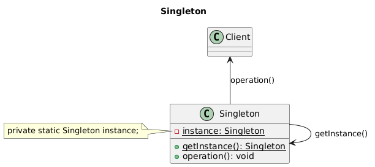

# Singleton
© Ioannis Kostaras

---

| **Name** | Singleton |
|----------|-----------|
| **Scope** | Object |
|**Purpose** | Creational |
| **Intent** | Ensure that a class has only one instance and provide a global point of access to it. | 
| **Also Known As** | |
| **Motivation** | It is necessary for some classes to have only one instance; e.g., to hold system-wide state information or manage a resource (e.g. a database) |
| **Applicability** | when there must be exactly one instance of a class, and it must be accessible from a well-known point of access |
| **Structure** |  |
| **Participants** | A Singleton class defines a static member function that returns a pointer to the sole instance of the class. This `Instance()` function creates the instance if it does not already exist |
| **Collaborations** | Clients access the sole instance solely through this function |

## Implementation

* static instance operation
* registering the singleton instance

### Java
Let's start with the simplest implementation. How can we guarantee a single instance? 

```java
public final class Singleton {
    public static final Singleton INSTANCE = new Singleton();

    // private empty constructor
    private Singleton() {
       // initialize any state here
    }
    // ...	
}

public class Client {
    public static void main(String[] args) {
        // Constructor is private -- cannot use new
        Singleton s1 = Singleton.INSTANCE;
        Singleton s2 = Singleton.INSTANCE;

        if ( s1 == s2 )
            System.out.println( "Same instance" );
    }
}
```
A `static` class is one of the approaches that makes a class “Singleton”, since `static` means shared by all objects of the class. There should be no other way to construct an object apart from the one provided by the class. To achieve that: 

* make all constructors `private`, and create at least one constructor to prevent the compiler from synthesizing a default constructor for you (which it will create using package access);
* `final` prevents cloneability from  being added through inheritance. Since `Singleton` is inherited directly from `Object`, the `clone()` method remains `protected` so it cannot be used (doing so produces a compile-time error). However, if you’re inheriting from a class hierarchy that has already overridden `clone()` as `public` and implemented `Cloneable`, the way to prevent cloning is to override `clone()` and throw a `CloneNotSupportedException`.

 This implementation is also thread safe, since `static final` guarantees that the object will be created.

A similar way is to use a factory method to provide the single point of access:

```java
// Singleton using a factory method
public final class Singleton {
    private static final Singleton INSTANCE = new Singleton();

    // private empty constructor
    private Singleton() {
        // initialize any state here
    }
    
    public static Singleton getInstance() {
        return INSTANCE;
    }
}
```
Lazy initialisation is useful for expensive objects (by lazy initialisation we mean initialise the object only when needed, i.e. when the `Singleton` class is being called for the first time):
```java
// Singleton with lazy initialization
public final class Singleton {
    private static Singleton singleton = null;

    // private constructor
    private Singleton() {
        // initialize any state here
    }
    
    public static Singleton getInstance() {
     if (singleton == null) 
            singleton = new Singleton();	
        return singleton;
    }
}

public class Client {
    public static void main(String[] args) {
        // Constructor is private -- cannot use new
        Singleton s1 = Singleton.getInstance();
        Singleton s2 = Singleton.getInstance();

        if ( s1 == s2 )
            System.out.println( "Same instance" );
    }
}
```
However, the above implementation is not thread-safe. To make it thread-safe:

```java
// Thread-safe singleton with lazy initialization
public final class Singleton {
    private volatile static Singleton singleton = null;
    private static final Object classLock = Singleton.class; 

    // private constructor
    private Singleton() {
        // initialize any state here
    }
    public static Singleton getInstance() {
        if (singleton == null) 
            synchronized (classLock) {
                if (singleton == null) 
                    singleton = new Singleton();	
                return singleton;
            }
    }
}
```
*Double-checked locking* in Java is considered correct and safe under the *Java Memory Model (JMM)* only if the shared field (the singleton instance) is declared `volatile` and all object construction is complete before publishing the reference.

Without `volatile`, the object construction and the assignment to the reference can be reordered, leading to another thread seeing a partially-initialized object. Declaring the singleton reference as `volatile` prevents this reordering and ensures visibility of the fully constructed object to all threads.

**Note**: *Double check locking doesn’t work in JVM 1.4 or earlier (in case you 're still working with such old versions).*

All initialization must be done *before* assigning the reference to instance, to avoid leaking a partially-constructed object.

As a refresher, when you are using a `synchronized` marker, you have two choices on its granularity: "method locks" or "block locks". If you put the `synchronized` on a method, you are locking on `this` object implicitly.

An effective lazy initialisation can be provided by using a Holder class:

```java
// Singleton that uses a Holder class
public final class Singleton {
    private static class SingletonHolder {
        static final Singleton INSTANCE = new Singleton();
        private SingletonHolder() {}
    } 

    // private constructor
    private Singleton() {
        // initialize any state here
    }
    
    public static Singleton getInstance() { 	
        return SingletonHolder.INSTANCE;
    }
}
```
The class loader guarantees that the class is correctly initialised.

If you need a Singleton that can be serialized:

```java
public final class Singleton implements Serializable {
    public static final Singleton INSTANCE = new Singleton();

    // private empty constructor
    private Singleton() {
        // initialize any state here
    }	
    // readResolve method to preserve singleton property
    private Object readResolve() {
    // Return the instance and let the garbage collector
    // take care of the rest.
        return INSTANCE;
    }
}
```
If you don’t implement `readResolve()`, then on the other side, a new `Singleton` object will be created.

Since Java 5.0 you can use `enum`s:

```java
// Singleton using enum
public enum Singleton {
    INSTANCE;
}
```
* It can be serialized, but serialization makes no sense, and its fields cannot be serialized neither
* Client code can only access fields
* It cannot be subclassed

But if the constructor(s) are `private`, how can we pass arguments to a Singleton?

### C#

```csharp
// Singleton pattern -- Lazy initialization  
using System;  
// "Singleton"  
class Singleton {   
    // Fields   
    private static Singleton instance;    
    // Constructor   
    protected Singleton() {}
    // Methods   
    public static Singleton Instance()   {     
        // Uses "Lazy initialization"     
        if ( instance == null ) {       
            instance = new Singleton();     
            return instance;   
        } 
    }
}
```
Client code test:

```csharp
/// <summary>
/// Client test
/// </summary>
public class Client
{
  public static void Main()
  {
    // Constructor is protected -- cannot use new
    Singleton s1 = Singleton.Instance();
    Singleton s2 = Singleton.Instance();

    if ( s1 == s2 )
      Console.WriteLine( "The same instance" );
  }
}
```
Below is a thread-safe Singleton implementation:
```csharp
// Singleton pattern – Thread safe - Lazy initialization
using System;

// "Singleton"
class Singleton
{
   // Fields
   private static volatile Singleton? instance = null;
   // Lock synchronization object
   private static object syncLock = new object();

   // Constructor
   private Singleton() {}
   // Methods
   public static Singleton Instance()
   {
	  // Support multithreaded applications through
	  // "Double checked locking" pattern which (once
 	  // the instance exists) avoids
	  // locking every time the method is invoked
        if (instance == null)
        {
            lock (syncLock)
            {
                if (instance == null)
                {
                    instance = new Singleton();
                }
            }
        }
        return instance;
   }
}
```

### C++

```cpp
// Singleton.h
class Singleton {

public:
    static Singleton* Instance();
private:
    static Singleton* pInstance;
    Singleton();
};

// Singleton.cpp
#include "Singleton.h"

Singleton* Singleton::Instance() 
{
    if (pInstance == nullptr)
    {
        pInstance = new Singleton;
    }
    return pInstance;
}
Singleton* Singleton::pInstance = nullptr;

// 
```

### Rust

## Known Uses

### Java

### C++

### C#

### Rust

 ## Known Uses
 ### Java
 * `Runtime.getRuntime()` uses the public constant implementation
 * `java.awt.Toolkit.getDefaultToolkit()` is a polymorphic Singleton; it creates an instance of the toolkit dynamically depending on the platform, e.g. Windows, Mac, Motif etc.

### C#

### C++
```cpp
// Singleton.h
class Singleton {
  public:
    static Singleton* Instance();
    // Prevent copy
    Singleton(const Singleton&) = delete;
    Singleton& operator=(const Singleton&) = delete;    
  private:
    static Singleton* pInstance;
    Singleton() {};
};

// Singleton.cpp
#include "Singleton.h"
Singleton* Singleton::Instance() 
{
    if (pInstance == nullptr)
    {
        pInstance = new Singleton;
    }
    return pInstance;
}
// Static member initialization
Singleton* Singleton::pInstance = nullptr;

// Client.cpp
#include "Singleton.h"
#include <iostream>

using namespace std;

int main()
{
    Singleton* singleton1 = Singleton::Instance();
    Singleton* singleton2 = Singleton::Instance();

    if (singleton1 == singleton2) 
        cout << "Same instances.";
    else 
        cout << "Different instances.";
}
```

### Rust

 ## Consequences 
 ### Pros
* reduces namespace pollution
* makes it easy to change your mind and allow more than one instance (see [ObjectPool](../ObjectPool/README.md))
### Cons
* same drawbacks of a global variable if misused
* implementation may be less efficient than a global variable
* concurrency pitfalls
* Singletons are difficult to unit test because it’s impossible to substitute a mock implementation for a singleton unless it implements an interface that serves as its type.

## Related Patterns

* [Abstract factory]((../AbstractFactory/README.md)), which is often used to return unique objects. 
* [Builder](../Builder/README.md), which is used to construct a complex object, whereas a singleton is used to create a globally accessible object. 
* [Prototype](../Prototype/README.md), which is used to copy an object, or create an object from its prototype, whereas a singleton is used to ensure that only one prototype is guaranteed.
* [Object Pool](../ObjectPool/README.md), which returns not a single instance but a limited number of instances of a class


### Comparison of Singleton to a class of static methods
Why use Singleton when one could just create a `final` class and declare all its methods as `static`?

```java
public final class StaticClass {
  public static String getMethodA() {}
  public static int getMethodB() {}
  // ...
}
```
A global variable makes an object accessible, but has drawbacks
- *Unwieldy*: What should it be called? Where should it be declared?
- *Unreliable*: It does not prevent the declaration of other instances

## Bibliography and further reading
* Bloch J. (2018), *Effective Java*, 3nd Edition, Addison-Wesley.
* Geary, D. (2003), [Simply Singleton](http://www.javaworld.com/javaworld/jw-04-2003/jw-0425-designpatterns.html?page=1), JavaWorld.com.
* Eckel, B. (2003), [Thinking in Patterns with Java](http://mindview.net/Books/TIPatterns/), MindView. 
* Freeman, E. & Freeman, E. (2021), *Head First Design Patterns*, 2nd Ed., O’ Reilly.
* GoF (1995), *Design Patterns – Elements of reusable components*, Addison-Wesley.
* JavaCamp, http://javacamp.org/designPattern/index.html, Singleton
* Kabutz, H. (2002), [Double-checked locking](http://www.javaspecialists.co.za/archive/newsletter.do?issue=061), The Java Specialists' Newsletter, Issue 061.
* Kabutz, H. (2002), [J2EE Singleton](http://www.javaspecialists.co.za/archive/newsletter.do?issue=052&locale=en_US), The Java Specialists' Newsletter, Issue 052. 
* Metsker, S. J. (2002), *Design Patterns Java Workbook*, Addison-Wesley.