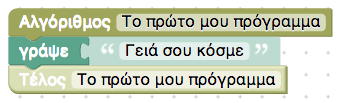
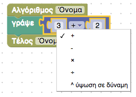
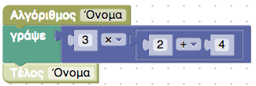
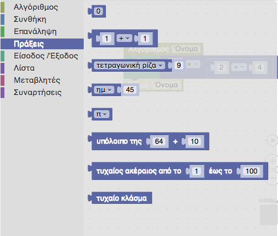
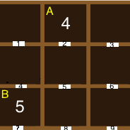
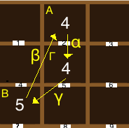
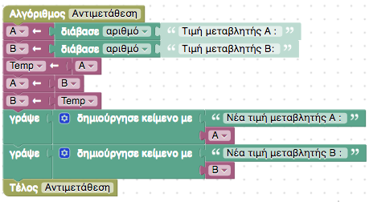
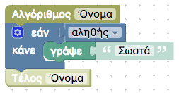
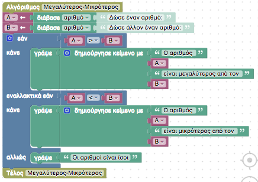
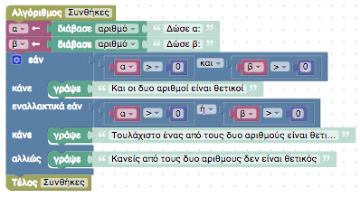

# 1.3 Το πρώτο μου πρόγραμμα {#Intro} 
© Γιάννης Κωστάρας

---

[🏠](https://jkost.github.io) | [⬆️](../../README.md) | [◀️](../1.2-Algorithm/README.md) | [▶️](../1.4-Programs/README.md)

---

## Μαθησιακοί στόχοι
Σε αυτήν την ενότητα θα μάθουμε:

* να γράφουμε προγράμματα
* τι είναι ο προγραμματισμός με πλακίδια

## Προγραμματισμός με πλακίδια
Θα μάθουμε προγραμματισμό ξεκινώντας με τις γλώσσες προγραμματισμού με πλακίδια.

### Το πρώτο μας πρόγραμμα
Μεταβείτε στην ιστοσελίδα [φωτόδεντρο](http://photodentro.edu.gr/v/item/ds/8521/11294). Στην εικόνα 1.3.1 βλέπετε το περιβάλλον εργασίας του Προγραμματισμού με Πλακίδια του φωτόδεντρου. Στο πάνω μέρος βλέπετε μια μπάρα εργαλείων με τα κουμπιά **Εκτέλεση, Βήμα, Τερματισμός, Καθαρισμός εξόδου, Νέος αλγόριθμος**. Στα αριστερά βλέπετε ένα κατακόρυφο μενού με τις επιλογές **Αλγόριθμος, Συνθήκη, Επανάληψη, Πράξεις, Είσοδος/Έξοδος, Λίστα, Μεταβλητές, Συναρτήσεις**. Δίπλα του βλέπετε την περιοχή ανάπτυξης των προγραμμάτων σας και δυο εντολές ```Αλγόριθμος``` και ```Τέλος```. Δεξιά της περιοχής αυτής βλέπετε την περιοχή όπου θα εμφανίζονται τα αποτελέσματα κατά την εκτέλεση του προγράμματός σας.


**Εικόνα 1.3.1** _Το περιβάλλον του προγράμματος φωτόδεντρο_

Όταν ξεκινάμε να μαθαίνουμε μια νέα γλώσσα προγραμματισμού, το πρώτο πράγμα που μαθαίνουμε είναι πώς να εμφανίζουμε το μήνυμα ```"Hello World"``` ή ```"Γειά σου κόσμε"``` στην οθόνη του Η/Υ. Ας δούμε πως θα το πετύχουμε αυτό. Στον προγραμματισμό με πλακίδια σέρνουμε τα κατάλληλα πλακίδια μεταξύ των πλακιδίων ```Αλγόριθμος``` και ```Τέλος``` που δηλώνουν την αρχή και το τέλος του προγράμματός μας. Κάθε πλακίδιο, όπως ίσως καταλάβατε, αποτελεί μια εντολή του προγράμματός μας. Το λεξικό της γλώσσας προγραμματισμού φωτόδεντρο είναι τα πλακίδια που κατηγοροποιούνται στο μενού αριστερά. Αυτό που θέλουμε να επιτύχουμε είναι να εμφανίσουμε ένα μήνυμα στην οθόνη. Κάνουμε κλικ επομένως στο μενού **Είσοδος/Έξοδος**, σέρνουμε το πλακίδιο ```γράψε "abc"``` και το 'κολλάμε' κάτω από το πλακίδιο ```Αλγόριθμος```. Τέλος, κολλάμε και το πλακίδιο ```Τέλος``` κάτω από το ```γράψε "abc"```. Πατήστε το κουμπί **Εκτέλεση**. Τι παρατηρείτε; Το αποτέλεσμα εξόδου δείχνει ```abc``` κι όχι ```"Γειά σου κόσμε"```. Πώς μπορούμε ν' αλλάξουμε το πρόγραμμά μας ώστε να δείχνει το μήνυμα ```"Γειά σου κόσμε"```; Κάντε κλικ εκεί που λέει ```"abc"``` και αλλάξτε το σε ```Γειά σου κόσμε```. Πατήστε ```Enter``` και ξαναεκτελέστε το πρόγραμμα. Θα πρέπει να βλέπετε το σωστό μήνυμα ως αποτέλεσμα. Ας δώσουμε κι ένα πιο χαρακτηριστικό όνομα στο πρόγραμμά μας. Κάντε κλικ στο ```Όνομα``` των πλακιδιών ```Αλγόριθμος``` και ```Τέλος``` και γράψτε ```Το πρώτο μου πρόγραμμα```. Το αποτέλεσμα φαίνεται στην εικόνα 1.3.2.



**Εικόνα 1.3.2** _Το πρώτο μου πρόγραμμα στο φωτόδεντρο_ 

Δεν είναι και τόσο δύσκολο να γίνεις προγραμματιστής, έτσι δεν είναι; Μπορείτε επίσης να δείτε και τον αντίστοιχο κώδικα σε δυο πραγματικές γλώσσες προγραμματισμού, Javascript και Python, πατώντας το κατάλληλο κουμπί. Θα μιλήσουμε γι' αυτές σε επόμενα μαθήματα. Π.χ. στην Python λαμβάνουμε το ίδιο αποτέλεσμα πληκτρολογώντας την εντολή:
```python
print('Γειά σου κόσμε!')
```

Ας δούμε κάτι λίγο πιο δύσκολο. Ας δημιουργήσουμε ένα πρόγραμμα που να μας ρωτάει το όνομά μας και στη συνέχεια να μας εμφανίζει το μήνυμα: "Γειά σου Μαρία" (αν του δώσαμε το όνομα 'Μαρία'). Είδαμε ότι για να εμφανίσουμε κάτι στην οθόνη χρησιμοποιήσαμε την εντολή **γράψε**. Επομένως, για να διαβάσουμε κάτι από το πληκτρολόγιο θα χρησιμοποιήσουμε την εντολή **διάβασε**. Ας δούμε λοιπόν πως μπορούμε να λύσουμε το πρόβλημα με τη γλώσσα προγραμματισμού με πλακίδια του φωτόδεντρου. Το αποτέλεσμα πρέπει ν' αποτελείται από δυο εισόδους: μια το μήνυμα ```"Γειά σου "``` και μια την είσοδο του χρήστη (δηλ. το όνομα που θα παρέχει ο χρήστης). Το αποτέλεσμα αυτών των δυο εισόδων πρέπει να το εμφανίσουμε στα αποτελέσματα εξόδου. 

Κατ' αρχήν ας διαγράψουμε το προηγούμενο πρόγραμμα "πετώντας" την εντολή **γράψε** στον κάλαθο των αχρήστων. 

Για να εμφανίσουμε κάτι στην έξοδο χρειαζόμαστε την εντολή **γράψε**. Προσθέστε λοιπόν την εντολή αυτή μεταξύ των εντολών **Αλγόριθμος** και **Τέλος** όπως είδαμε προηγουμένως. Στη συνέχεια θα πρέπει να δημιουργήσουμε την έξοδό μας από τις δυο εισόδους που περιγράψαμε πιο πάνω, οπότε εισάγετε την εντολή **δημιούργησε κείμενο με** και 'κολλήστε' τη στην εντολή **γράψε**. Βλέπουμε ότι η εντολή **δημιούργησε κείμενο με** δέχεται δυο εισόδους. Στη μια εισάγετε το κείμενο "Γειά σου " και στο άλλο την εντολή **διάβασε** δίνοντας το κείμενο προτροπής ```"Δώστε όνομα"``` όπως φαίνεται στην παρακάτω εικόνα:


**Εικόνα 1.3.3** _Το πρόγραμμα "Γειά σου" στο φωτόδεντρο_ 

Όταν εκτελέσετε το πρόγραμμα, θα εμφανιστεί ένα διαλογικό παράθυρο το οποίο θα σας ζητήσει να δώσετε ένα όνομα και μόλις πατήσετε **ΟΚ** θα εμφανίσει το μήνυμα ```Γειά σου ``` και το όνομα που δώσατε.

Aν το πρόγραμμα αυτό σας φάνηκε πολύπλοκο, μην ανησυχείτε. Κάθε γλώσσα έχει τις δικές της εντολές για να κάνει τη δουλειά. 

Όπως ίσως γνωρίζετε, οι Η/Υ είναι πολύ αποτελεσματικοί στο να εκτελούν πολύπλοκες πράξεις. Ας το δούμε λοιπόν στην πράξη, με απλές όμως πράξεις ώστε να μπορούμε να ελέγξουμε το αποτέλεσμα. Ας ξεκινήσουμε λοιπόν από ένα άδειο πρόγραμμα και ας προσθέσουμε την εντολή **γράψε** μεταξύ των πλακιδίων **Αλγόριθμος** και **Τέλος**. Αυτή τη φορά σύρτε από το μενού _Πράξεις_ το πλακίδιο της πρόσθεσης όπως φαίνεται στην παρακάτω εικόνα.



**Εικόνα 1.3.4** _Εκτέλεση αριθμητικών πράξεων στο φωτόδεντρο_ 

Παρατηρήστε ποιες πράξεις υποστηρίζονται. Αν εκτελέσετε το πρόγραμμα θα πάρετε φυσικά το αποτέλεσμα 5. Ας κάνουμε κάτι ποιο δύσκολο (βλ. εικόνα 1.3.5):



**Εικόνα 1.3.5** _Εκτέλεση αριθμητικών πράξεων στο φωτόδεντρο_ 

Ποιο το αποτέλεσμα; Το αποτέλεσμα είναι 18. Κάποιοι όμως θα πουν ότι δε συνδράμει μ' αυτά που έχουμε μάθει στα μαθηματικά. Από τα μαθηματικά γνωρίζετε ίσως για την προτεραιότητα των αριθμητικών πράξεων. Έτσι, η ύψωση σε δύναμη (```^```) έχει τη υψηλότερη προτεραιότητα, ακολουθούν ο πολλ/σμός και η διαίρεση και τέλος η πρόσθεση κι η αφαίρεση. Έτσι, κανονικά, πρέπει να εκτελεστεί πρώτα ο πολλ/σμός ```3x2``` και το αποτέλεσμα αυτής να προτεθεί στο ```4```. Παρατηρήστε όμως ότι η πράξη αποτελείται από δυο μπλοκ: ένα είναι το ```2+4``` και το άλλο είναι το αποτέλεσμα αυτής της πράξης με το 3, δηλ. ```3*6```. Είναι σα να γράφαμε: ```3*(2+4)```.

Ας δούμε τι άλλες πράξεις μας προσφέρει αυτό το μενού.



**Εικόνα 1.3.6** _Μενού αριθμητικών πράξεων στο φωτόδεντρο_ 

Δοκιμάστε καθεμία από τις εντολές αυτές. Είναι λογικό το αποτέλεσμα; Π.χ. τι κάνει η εντολή ```τυχαίος αριθμός από το 1 έως το 100```; Μάθετε περισσότερα για τις αριθμητικές πράξεις [εδώ](http://photodentro.edu.gr/lor/r/8521/10870?locale=el).

### Μεταβλητές
Η έννοια της _μεταβλητής_ είναι από τις πιο σημαντικές στον προγραμματισμό. Αλλά μη σας τρομάζει. Το όνομα _μεταβλητή_ σημαίνει κάτι που μεταβάλλεται, δηλ. παίρνει διαφορετικές τιμές, π.χ. κατά την εκτέλεση ενός προγράμματος. Μια μεταβλητή αποθηκεύεται στην κύρια μνήμη του Η/Υ. Μπορείτε να φανταστείτε την κύρια μνήμη ενός Η/Υ ως θυρίδες, όπως φαίνεται στην εικόνα 1.3.7. 


**Εικόνα 1.3.7** _Οι θυρίδες παρομοιάζουν τη μνήμη του Η/Υ_ 

Σε κάθε μια απ' αυτές, μπορούμε ν' αποθηκεύσουμε κάτι (π.χ. έναν αριθμό, ή το όνομά μας κλπ.). Ο τρόπος με τον οποίο το πρόγραμμά μας επικοινωνεί με την μνήμη του Η/Υ είναι μέσω των μεταβλητών. Το πρόγραμμά μας ζητάει από το Λειτουργικό Σύστημα της διεύθυνση μιας άδειας θέσης μνήμης στην οποία θ' αποθηκεύσει κάποια τιμή με τον ίδιο τρόπο που ψάχνουμε μια άδεια θυρίδα για να αποθηκεύσουμε μια επιστολή. Επειδή όμως δε θέλουμε να θυμόμαστε έναν αριθμό όπως π.χ. ```0x14BA32```, τα προγράμματα μας επιτρέπουν να δίνουμε ένα όνομα στη μεταβλητή μας και το Λ.Σ. αναλαμβάνει να την αντιστοιχίσει με μια θέση της φυσικής μνήμης του Η/Υ. Με τον ίδιο τρόπο που μπορούμε να ονομάσουμε τη θυρίδα μας με το όνομά μας για να την ξεχωρίσουμε από τις υπόλοιπες.

Ας δούμε ένα παράδειγμα. Πίσω στον προγραμματισμό με πλακίδια του φωτόδεντρου, κάντε κλικ στο μενού **Μεταβλητές** και επιλέξτε **Δημιουργήστε μεταβλητή**. Δώστε ένα όνομα στο διαλογικό παράθυρο που εμφανίζεται, π.χ. ```name``` και πατήστε **OK**. Στη συνέχεια δημιουργήστε το πρόγραμμα που φαίνεται στην παρακάτω εικόνα για να χρησιμοποιήσετε τη νέα μεταβλητή που δημιουργήσατε.


**Εικόνα 1.3.8** _Χρήση μεταβλητών στο φωτόδεντρο_ 

Παρατηρήστε ότι το όνομα που πληκτρολογείτε στο διαλογικό παράθυρο που εμφανίζεται αποθηκεύεται στη μεταβλητή ```name``` (κάπου στη κύρια μνήμη του Η/Υ) και η τιμή της στη συνέχεια εμφανίζεται στην έξοδο όταν εκτελείται το πρόγραμμα. Συγκρίνετε το πρόγραμμα της εικόνας 1.3.8 μ' αυτό την εικόνας 1.3.3.

Αλλά τι είδους τιμές μπορούμε ν' αποθηκεύσουμε στις μεταβλητές; Οι περισσότερες γλώσσες προγ/σμού δέχονται τους παρακάτω τύπους δεδομένων:

* ακέραιους, π.χ. -2, 4, 0
* πραγματικούς, π.χ. 3.14
* χαρακτήρες ή αλφαριθμητικά, π.χ. "Γιάννης", 'Ν' 

Ας δούμε τώρα κάτι λίγο πιο προχωρημένο. Θέλουμε να διαβάσουμε από την είσοδο δυο αριθμούς, π.χ. ```4``` και ```5``` και να τους εμφανίσουμε στην έξοδο με αντίστροφη σειρά, δηλ. ```5``` και ```4```. Πώς θα το κάνουμε και τι θα χρειαστούμε;

Κατ' αρχήν θα χρειαστούμε δυο μεταβλητές που θ' αποθηκεύσουν τις δυο τιμές, ας τις ονομάσουμε ```Α``` και ```Β```. Σ' αυτές θ' αποθηκεύσουμε δυο τιμές που θα διαβάσουμε από την είσοδο. Έστω ότι ο χρήστης δίνει τις τιμές ```4``` -> ```Α``` και ```5``` -> ```Β```. Έστω ότι αποθηκεύονται στη μνήμη όπως φαίνεται στην εικόνα 1.3.9 (η μεταβλητή ```Α``` δείχνει στη θέση μνήμης ```2``` και αποθηκεύει την τιμή ```4``` ενώ η μεταβλητή ```Β``` δείχνει στη θέση μνήμης ```7``` και παίρνει την τιμή ```5```). 

```
Α <- 4
Β <- 5
```



**Εικόνα 1.3.9** _Αντιμετάθεση μεταβλητών_ 

Θέλουμε να τοποθετήσουμε την τιμή της μεταβλητής ```Β``` στη μεταβλητή ```Α``` και την τιμή της ```Α``` στην ```Β```:

```
Α <- Β
Β <- Α
```

Ποιο θα είναι το αποτέλεσμα;

```
Α: 5
Β: 5
```

Γιατί; Επειδή όταν καταχωρούμε την τιμή της ```Β``` στην ```Α```, η τιμή της ```Α``` (```4```) αντικαθίσταται από την τιμή της ```Β``` (```5```) και στη συνέχεια η τιμή της ```Β``` αντικαθίσταται από τη νέα τιμή της ```Α``` (```5```): 

| Εντολή/Μεταβλητή | Α | Β | 
| Α <- 4 | 4 |  |
| Β <- 5 | 4 | 5 |
| Α <- Β | 5 | 5 |
| Β <- Α | 5 | 5 |

Πώς μπορούμε να επιλύσουμε αυτό το πρόβλημα; Σκεφτείτε ότι έχετε ένα νόμισμα 2€ σ' ένα μικρό χάρτινο κουτί και ένα νόμισμα 1€ σε ένα άλλο χάρτινο κουτί και θέλετε να τους ανταλλάξετε θέσεις. Πώς θα το πετύχετε γνωρίζοντας ότι σε κάθε κουτί μπορείτε να αποθηκεύσετε μόνο ένα νόμισμα; Δείτε την [Οπτικοποίηση του αλγορίθμου αντιμετάθεσης των τιμών δύο μεταβλητών](http://photodentro.edu.gr/lor/r/8521/6327?locale=el). Δώστε τις τιμές ```4``` και ```5``` στα πεδία ```Δώσε χ``` και ```Δώσε ψ``` αντίστοιχα και πατήστε το κουμπί **Play**.

Η λύση είναι η χρήση μιας επιπλέον προσωρινής μεταβλητής η οποία θ' αποθηκεύσει προσωρινά την προηγούμενη τιμής της μεταβλητής ```Α```.



**Εικόνα 1.3.10** _Αλγόριθμος αντιμετάθεσης μεταβλητών_ 

```
Γ <- A         : Γ=4, A=4, B=5    
A <- B         : Γ=4, A=5, B=5
Β <- Γ         : Γ=4, A=5, B=4 
```
Το τελικό πρόγραμμα φαίνεται στην εικόνα 1.3.11 (όπου ```Γ``` είναι η ```Temp```).



**Εικόνα 1.3.11** _Αντιμετάθεση μεταβλητών στο φωτόδεντρο_ 

Μπορείτε να δείτε περισσότερα για το πρόβλημα της αντιμετάθεσης δυο αριθμών [εδώ](http://photodentro.edu.gr/lor/r/8521/10507?locale=el) και [εδώ](http://photodentro.edu.gr/lor/r/8521/10555?locale=el).

Προσπαθήστε να λύσετε τις ασκήσεις: 1-3. 

### Αποφάσεις/Συνθήκες
Όταν ενηλικιώθηκε ο Ηρακλής έπρεπε ν' αποφασίσει ποιον δρόμο ν' ακολουθήσει στη ζωή του, αυτόν της Αρετής ή αυτόν της Κακίας; Όπως και στη ζωή, έτσι και στον προγραμματισμό θα πρέπει ενίοτε να λάβουμε αποφάσεις ώστε να εκτελεστεί διαφορετική ροή ενός προγράμματος ανάλογα με το ποια συνθήκη είναι αληθής. Διαφορετικά τα προγράμματα θα ήταν πολύ βαρετά.

Ας γνωρίσουμε πώς μπορούμε να καθοδηγήσουμε το πρόγραμμά μας σε διαφορετικούς δρόμους με τις εντολές συνθήκης. Από το μενού ''Συνθήκη'' σύρετε το πλακίδιο **εάν κάνε** και δημιουργήστε το πρόγραμμα που φαίνεται στην παρακάτω εικόνα.



**Εικόνα 1.3.12** _Εντολή Συνθήκης_ 

Η εντολή ```εάν``` δέχεται μια ''συνθήκη'', κι αν η συνθήκη ισχύει τότε εμφανίζει το μήνυμα ```Σωστά```. Στην περίπτωσή μας η συνθήκη είναι ```αληθής``` επομένως ισχύει πάντα. Δοκιμάστε να την αλλάξετε σε ```ψευδής``` και μετά την εκτέλεση δεν εμφανίζεται τίποτα στην έξοδο.

Ας τροποποιήσουμε την εντολή **εάν κάνε** ως εξής: κάντε κλικ στο γρανάζι και σύρτε την εντολή ```εναλλακτικά εάν``` κάτω από την ```εάν``` όπως φαίνεται στην εικόνα 1.3.13.


**Εικόνα 1.3.13** _Πλακίδιο ```εάν``` στο φωτόδεντρο_  

Κάντε πάλι κλικ στο γρανάζι για να κλείσετε το διαλογικό παράθυρο που εμφανίστηκε. Και προσθέστε τα κατάλληλα πλακίδια ώστε αν η συνθήκη είναι ```ψευδής``` τότε να εμφανιστεί το μήνυμα ```Λάθος```. Υπάρχει κι η εντολή ```αλλιώς``` η οποία δε λαμβάνει συνθήκη (βλ. εικόνα 1.3.13) και η οποία ισχύει όταν όλες οι προηγούμενες συνθήκες είναι ψευδείς.

Αντί για το κουμπί **Εκτέλεση** πατήστε το **Βήμα** το οποίο εκτελεί το πρόγραμμά σας βήμα-βήμα. Κάθε φορά που πατάτε το κουμπί **Βήμα** φωτίζεται η επόμενη εντολή που εκτελείται κι έτσι βλέπεται γιατί εκτελείται η εντολή ```γράψε "Σωστά"```.

Ας δημιουργήσουμε κάτι πιο πολύπλοκο. Μας ζητείται να γράψουμε ένα πρόγραμμα το οποίο να δέχεται δυο αριθμούς ```Α``` και ```Β``` από το χρήστη και αν ο ```Α > Β``` να εμφανίζεται το μήνυμα ```Ο αριθμός Α είναι μεγαλύτερος από τον Β```, αν ```Α < Β``` το μήνυμα ```Ο αριθμός Α είναι μικρότερος από τον Β```, διαφορετικά ```Οι αριθμοί είναι ίσοι```. Δοκιμάστε πρώτα να το γράψετε μόνοι σας.

Κατ' αρχήν ξεκινάμε να διαβάσουμε δυο αριθμούς και να τους αποθηκεύσουμε σε δυο μεταβλητές ```Α``` και ```Β``` όπως μάθαμε προηγούμενα. Στη συνέχεια εισάγουμε μια εντολή ```εάν``` και προσθέτουμε ```εναλλακτικά εάν``` και ```αλλιώς``` για να ελέγξουμε τις 3 συνθήκες που αναφέραμε πιο πάνω. Η πρώτη συνθήκη θα ελέγχει εάν ```Α > Β``` και θα εμφανίζει στην έξοδο το μήνυμα ```Ο αριθμός Α είναι μεγαλύτερος από τον Β``` (όπου ```Α``` και ```Β``` είναι οι μεταβλητές που ορίσαμε). Το μήνυμα αυτό αποτελείται από τέσσερα μέρη, οπότε θα πρέπει να τροποποιήσουμε το πλακίδιο ```δημιούργησε κείμενο με``` ώστε να εμφανίζει 4 αντικείμενα (πατήστε στο γρανάζι για να βρείτε πώς θα το κάνετε αυτό):

1. "Ο αριθμός "
2. η μεταβλητή ```Α```
3. " είναι μεγαλύτερος από τον "
4. η μεταβλητή ```Β```

Με τον ίδιο τρόπο δημιουργούμε και την έξοδο του 2ου σκέλους της εντολής δηλ. το ```εναλλακτικά εάν``` ενώ για το σκέλος ```αλλιώς``` απλά εμφανίζουμε "Οι αριθμοί είναι ίσοι". Το αποτέλεσμα φαίνεται στην παρακάτω εικόνα.



**Εικόνα 1.3.14** _Πρόγραμμα Μεγαλύτερος-Μικρότερος στο φωτόδεντρο_  

Ας μελετήσουμε τώρα λίγο τις συνθήκες ```και``` και ```ή```. Ας δούμε το παρακάτω πρόγραμμα το οποίο επιδεικνύει και μια σύνθετη εντολή ```εάν```. Τι κάνει το πρόγραμμα;



**Εικόνα 1.3.15** _Λογικές συνθήκες στο φωτόδεντρο_  

Το πρόγραμμα ζητάει από το χρήστη δυο ακέραιες τιμές τις οποίες αποθηκεύει στις μεταβλητές ```α``` και ```β```. Στη συνέχεια ελέγχει αν είναι και οι δυο θετικοί με τη συνθήκη ```α > 0 και β > 0``` και εμφανίζει το μήνυμα "Και οι δυο αριθμοί είναι θετικοί". Στη συνέχεια ελέγχει πάλι αν οι δυο αριθμοί είναι θετικοί με τη συνθήκη ```α > 0 ή β >0```. Αυτή η συνθήκη ικανοποιείται αν ένας από τους δυο ή και οι δυο αριθμοί είναι θετικοί, οπότε εμφανίζεται το μήνυμα "Τουλάχιστο ένας από τους δυο αριθμούς είναι θετικός". Διαφορετικά εμφανίζει το μήνυμα ότι κανείς από τους δυο αριθμούς δεν είναι θετικός (δηλ. είναι είτε και ή δυο αρνητικοί ή ένας από τους δυο ή και οι δυο μηδέν).

Οι λογικοί τελεστές ```και``` και ```ή``` διαθέτουν τους παρακάτω λεγόμενους πίνακες αληθείας (Α: Αληθής, Ψ: Ψευδής):

| α | β | α ΚΑΙ β |
| Ψ | Ψ | Ψ | 
| Α | Ψ | Ψ | 
| Ψ | Α | Ψ | 
| Α | Α | Ψ | 

| α | β | α Ή β |
| Ψ | Ψ | Ψ | 
| Α | Ψ | Α | 
| Ψ | Α | Α | 
| Α | Α | Α |

| α | ΌΧΙ α |
| Ψ | Α | 
| Α | Ψ | 

Ο τελευταίος πίνακας εμφανίζει τον πίνακα αληθείας ενός τρίτου λογικού τελεστή του ```ΌΧΙ```. Όποτε επομένως έχετε απορία για την τιμή μιας λογικής συνθήκης που περιέχει ```ΚΑΙ, Ή, ΌΧΙ```, μπορείτε να συμβουλεύεστε τους παραπάνω πίνακες αληθείας. Και όταν εξοικειωθείτε μπορείτε να δοκιμάσετε την άσκηση 5. 

Ας δούμε μερικά παραδείγματα. Έστω ```α = 5``` και ```β = -2```. Ποια είναι η τιμή των παρακάτω λογικών εκφράσεων;

1. ```x > 0 και y > 0```
1. ```x > 0 ή y > 0```
1. ```x > 0 και όχι y > 0```


Προσπαθήστε να λύσετε τις ασκήσεις: 4-5.

### Επαναλήψεις
Όπως ίσως έχετε ακούσει οι Η/Υ είναι πολύ καλοί στο να εκτελούν πράξεις πολύ πιο γρήγορα απ' ότι ο ανθρώπινος εγκέφαλος. Ας υποθέσουμε ότι θέλουμε να εμφανίσουμε στην έξοδο το μήνυμα ```Γειά σου κόσμε!``` όχι μια αλλά δέκα φορές. Εύκολο θα πείτε. Αρκεί να αντιγράψουμε την εντολή ```γράψε "Γειά σου κόσμε"``` δέκα φορές, θα πείτε. Αν όμως πρέπει να εμφανίσετε το μήνυμα 100 φορές; Τότε τα πράγματα γίνονται πολύ βαρετά. Ευτυχώς, οι γλώσσες προγραμματισμού διαθέτουν τις εντολές επανάληψης γι' αυτό το σκοπό.

Η γλώσσα προγραμματισμού με πλακίδια του φωτόδεντρου διαθέτει δυο εντολές επανάληψης όπως φαίνεται στο μενού _Επανάληψη_: 
 


**Εικόνα 1.3.16** _Εντολές επανάληψης στο φωτόδεντρο_

Ας δούμε πώς μπορούμε να χρησιμοποιήσουμε καθεμιά από αυτές τις δυο εντολές για να λύσουμε το πρόβλημα που αναφέραμε πιο πάνω. Η πρώτη εντολή χρησιμοποιεί μια μεταβλητή μετρητή ```i``` η οποία μετράει από το 1 μέχρι το 10 με βήμα 1, δηλ. 1, 2, 3,..., 10. Για κάθε τιμή του μετρητή εμφανίζει στην οθόνη το "Γειά σου κόσμε".	


**Εικόνα 1.3.17** _Εντολή επανάληψης 'μέτρησε από-μέχρι' στο φωτόδεντρο_

Εκτελέστε το πρόγραμμα βήμα-βήμα για να δείτε πώς εκτελείται. Η άλλη εντολή επανάληψης είναι λίγο πιο δύσκολη. Θα χρειαστεί να δημιουργήσουμε μια συνθήκη ώστε να σταματήσει η εντολή επανάληψης, διαφορετικά ο βρόγχος θα εκτελείται επ' άπειρω. Η συνθήκη αυτή θα λέει ότι ο βρόγχος θα πρέπει να εκτελεστεί το πολύ 10 φορές, δηλ. ```i ≤ 10```. Θα πρέπει να δημιουργήσουμε τη μεταβλητή ```i``` και να την αρχικοποιήσουμε: ```i ← 1```.


**Εικόνα 1.3.18** _Εντολή επανάληψης 'επανέλαβε ενώ' στο φωτόδεντρο που προκαλεί ατέρμονα βρόγχο_

Αν εκτελέσετε το πρόγραμμα θα παρατηρήσετε ότι ο πλοηγός σας δεν αποκρίνεται. Εκτελείται ένας ατέρμονας βρόγχος. Θα πρέπει να ανοίξετε ένα νέο παράθυρο και να εισάγετε [αυτή τη διεύθυνση](http://photodentro.edu.gr/v/item/ds/8521/11294) και να κλείσετε με κάποιον τρόπο το παράθυρο που δεν αποκρίνεται ή να κλείσετε τελείως τον πλοηγό σας. Τι συνέβηκε; Τι κάναμε λάθος; Αν εκτελέσουμε το πρόγραμμα βήμα βήμα θα παρατηρήσουμε ότι η μεταβλητή ```i``` παραμένει στην τιμή 1 οπότε η συνθήκη ```i ≤ 10``` ικανοποιείται για πάντα. Για να τελειώσει η εκτέλεση του βρόγχου θα πρέπει κάποια στιγμή το ```i > 10```. Το διορθωμένο πρόγραμμα φαίνεται στην παρακάτω εικόνα:


**Εικόνα 1.3.19** _Εντολή επανάληψης 'επανέλαβε ενώ' στο φωτόδεντρο_

Η εντολή αυτή μπορεί να μετατραπεί και σε 'επανέλαβε μέχρι'. Στην περίπτωση αυτή θα πρέπει να αλλάξετε τη συνθήκη σε ```i = 10```. 

Παρατηρήστε ότι ενώ στην πρώτη εντολή επανάληψης γνωρίζουμε πόσες φορές θα εκτελεστεί ο βρόγχος, στην εντολή επανάληψης ```επανέλαβε ενώ``` δεν το γνωρίζουμε· εξαρτάται από την ικανοποίηση ή μη της συνθήκης.  

### Λίστες ή Συστοιχίες
Μερικές φορές χρειαζόμαστε να αποθηκεύσουμε πολλά δεδομένα ίδιου τύπου, π.χ. τους βαθμούς ή τα ονόματα των μαθητών μιας τάξης, ή τα έξοδα που κάναμε τον προηγούμενο μήνα κλπ. Για να τ' αποθηκεύσουμε θα χρειαστούμε πολλές μεταβλητές, π.χ. για μια τάξη 30 μαθητών θα χρειαζόμασταν 30 μεταβλητές για ν' αποθηκεύσουμε το βαθμό κάθε μαθητή. Για το σκοπό αυτό, οι γλώσσες προγραμματισμού διαθέτουν πιο πολύπλοκους τύπους δεδομένων που μπορούν ν' αποθηκεύουν δεδομένα ίδιου τύπου, π.χ. ακέραιους αριθμούς που αναπαριστούν τους βαθμούς. Το φωτόδεντρο διαθέτει τον τύπο δεδομένων ```Λίστα``` (ή αλλοιώς ```Πίνακα``` ή ```Συστοιχία``` για το σκοπό αυτό).

Δημιουργούμε μια κενή λίστα χρησιμοποιώντας το πλακίδιο ```δημιούργησε κενή λίστα```. Το επόμενο βήμα είναι να προσθέσουμε στοιχεία σ' αυτήν. Μπορούμε να προσπελάσουμε κάθε στοιχείο της λίστας με τη βοήθεια ενός δείκτη, που συνήθως τον ονομάζουμε ```i``` (από το index). Π.χ.

```
Α <- δημιούργησε κενή λίστα
A[1] = 5
A[2] = 12
A[3] = 19
γράψε Α[1]
γράψε Α[2]
γράψε Α[3]
```
Στο παραπάνω ψευδοκώδικα δημιουργούμε μια νέα λίστα που την ονομάζουμε Α, και αποθηκεύουμε 3 ακέραιους αριθμούς σ' αυτήν, στις θέσεις 1, 2 και 3. Στη συνέχεια εμφανίζουμε τα περιεχόμενα της λίστας στην έξοδο. Μπορείτε να γράψετε το παραπάνω πρόγραμμα στο φωτόδεντρο;

Για μεγάλες λίστες μπορούμε να χρησιμοποιήσουμε τους βρόγχους (εντολές επανάληψης) που μάθαμε στην προηγούμενη ενότητα. Ας δούμε το παρακάτω πρόγραμμα:


**Εικόνα 1.3.20** _Δημιουργία λίστας στο φωτόδεντρο_

Κατ' αρχήν ζητάμε ο χρήστης να μας δώσει τον αριθμό των στοιχείων ```Ν``` που θ' αποθηκευθούν στη λίστα. Στη συνέχεια δημιουργούμε μια νέα λίστα ```Α```, και αποθηκεύουμε ```Ν``` τυχαίους αριθμούς σ' αυτήν μέσα σε μια εντολή επανάληψης από το 1 μέχρι το ```Ν``` (οι αριθμοί αυτοί μπορούν να παίρνουν τιμές από το 1 μέχρι το 100). Χρησιμοποιώντας την εντολή ```τυχαίος αριθμός από το 1 μέχρι το Ν``` (του μενού **Πράξεις**) το φωτόδεντρο δημιουργεί τυχαίους αριθμούς σ' αυτό το διάστημα.

Εκτελέστε το πρόγραμμα, δώστε το μέγεθος της λίστας και δείτε τους τυχαίους αριθμούς που αποθηκεύτηκαν σ' αυτήν. Πώς μπορείτε ν' αλλάξετε το πρόγραμμα ώστε να υπολογίσετε το άθροισμα και τον Μ.Ο. των αριθμών αυτών;

### Συναρτήσεις
Όταν αρχίσετε να γράφετε προγράμματα με πολλές γραμμές κώδικα θα δείτε ότι είναι δύσκολο να διαβάσετε τόσο εσείς όσο και άλλοι το πρόγραμμά σας και να καταλάβετε τι κάνει. Είναι δηλ. πολύ πιο δύσκολο να το αλλάξετε ή να το διορθώσετε σε περίπτωση που βρείτε ότι περιέχει κάποιο σφάλμα (bug). Για το λόγο αυτό είναι καλή πρακτική να "σπάτε" το πρόγραμμά σας σε μικρότερα τμήματα τα οποία κάνουν ένα μόνο πράγμα. Η τεχνική αυτή ονομάζεται "Διαίρει και βασίλευε". Αυτά τα μικρότερα τμήματα ονομάζονται _συναρτήσεις (functions)_ ή _διαδικασίες (procedures)_. Επίσης, ένας πολύ καλός τρόπος να χρησιμοποιήσετε συναρτήσεις είναι για να αποφύγετε κώδικα που επαναλαμβάνετε σε πολλά σημεία. Κι αυτό διότι αν χρειαστεί να αλλάξετε ή να διορθώσετε τον κώδικα αυτόν, θα πρέπει να τον διορθώσετε σε όλα τα σημεία που αυτός επαναλαμβάνεται και είναι πολύ πιθανό να ξεχάσετε να τον αλλάξετε σε κάποιο(-α) σημείο(-α) αφήνοντας έτσι σφάλματα (bugs). Αν όμως έχετε τοποθετήσει τον επαναλαμβανόμενο αυτό κώδικα σε μια συνάρτηση, τότε έχετε ένα μόνο σημείο για αλλαγή/διόρθωση. Αυτή είναι η αρχή _Μην Επαναλαμβάνεσαι_ (_DRY - Don't Repeat Yourself_). 

Το φωτόδεντρο διαθέτει ένα μενού με το οποίο μπορείτε να δημιουργήσετε συναρτήσεις. Μια συνάρτηση μοιάζει με τη συνάρτηση που μάθαμε στα μαθηματικά, π.χ. y=f(x), δηλ. δέχεται μια (ή περισσότερες) τιμή(-ές) και υπολογίζει κάποιο αποτέλεσμα. Π.χ. η συνάρτηση y = x&sup;2 υπολογίζει το τετράγωνο ενός αριθμού. Αν αντικαταστήσουμε το x με έναν αριθμό, τότε το y θα είναι το τετράγωνο του αριθμού. Έτσι και η συνάρτηση που φαίνεται στην παρακάτω εικόνα δέχεται μια παράμετρο, που την ονομάζουμε ```x``` και επιστρέφει το τετράγωνο αυτής. Δώσαμε μάλιστα στη συνάρτηση το όνομα ```τετραγωνική ρίζα``` για να δηλώσουμε τι κάνει.

Το κύριο πρόγραμμα (δηλ. οι εντολές μεταξύ της εντολής ```Αλγόριθμος``` και ```Τέλος```) διαβάζει μια τιμή από το χρήστη και την αποθηκεύει στη μεταβλητή ```α```. Στη συνέχεια, με την εντολή ```τετραγωνική ρίζα με: x``` καλεί τη συνάρτηση περνώντας στην τιμή της παραμέτρου ```x``` την τιμή της ```α``` (```x <- α```) (η ```α``` ονομάζεται _όρισμα_ γιατί παρέχει τιμή στην παράμετρο ```x```) και επιστρέφει το αποτέλεσμα που είναι η τετραγωνική ρίζα του αριθμού που δώσαμε.


**Εικόνα 1.3.21** _Χρήση συνάρτησης στο φωτόδεντρο_

Μια συνάρτηση μπορεί να μην επιστρέφει τιμή (κάποιες γλώσσες προγραμματισμού τις ονομάζουν _διαδικασίες_). Ένα παράδειγμα φαίνεται στην ακόλουθη εικόνα. Η συνάρτηση ```εμφάνιση``` εμφανίζει στην έξοδο (οθόνη) την τιμή που δίνουμε στην παράμετρο ```s```.


**Εικόνα 1.3.22** _Χρήση συνάρτησης που δεν επιστρέφει τιμή στο φωτόδεντρο_

## Ψευδογλώσσα
Η [Ψευδογλώσσα](https://www.pseudoglossa.gr/) 


## Ασκήσεις
1. Δημιουργήστε ένα πρόγραμμα στο φωτόδεντρο το οποίο θα ζητάει από το χρήστη την ημέρα της εβδομάδας και θα εμφανίζει το μήνυμα ```Σήμερα είναι: Δευτέρα``` (αν ο χρήστης έδωσε ```Δευτέρα```).
1. Δημιουργήστε ένα πρόγραμμα στο φωτόδεντρο το οποίο θα ζητάει από το χρήστη δυο αριθμούς και θα εμφανίζει το υπόλοιπο της ακέραιας διαίρεσης μεταξύ τους.
1. Μελετήστε το πρόγραμμα "Απόλυτη τιμή" του φωτόδεντρου. Μπορείτε να το ξαναγράψετε μόνοι σας;
1. Αν στο πρόγραμμα της άσκησης 2 δώσετε 0 στη δεύτερη μεταβλητή τότε το αποτέλεσμα είναι ```NaN``` που σημαίνει ''Not a Number'' καθώς δεν υφίσταται διαίρεση με το μηδέν. Αλλάξτε το πρόγραμμα ώστε στην περίπτωση που ο χρήστης δίνει ως διαιρέτη το μηδέν το πρόγραμμα να εμφανίζει το μήνυμα: "Δεν γίνεται διαίρεση με το 0".
1. Γράψτε ένα πρόγραμμα στο Φωτόδεντρο που θα διαβάζει τον αύξοντα αριθμό ```μ``` (δηλ. μια τιμή από 1 ως 12) του μήνα ενός μη δίσεκτου έτους και εμφανίζει το πλήθος ```η``` των ημερών του. Υπενθυμίζεται ότι οι μήνες Ιανουάριος (1ος), Μάρτιος (3ος), Μάιος (5ος), Ιούλιος (7ος), Αύγουστος (8ος), Οκτώβριος (10ος) και Δεκέμβριος (12ος) έχουν 31 ημέρες. Ο Απρίλιος (4ος), ο Ιούνιος (6ος), ο Σεπτέμβριος (9ος) και ο Νοέμβριος (11ος) έχουν 30 ημέρες, ενώ ο Φεβρουάριος (2ος) ενός μη δίσεκτου έτους έχει 28 ημέρες. 
1. Υπολογίστε αν ένα έτος που δίνει ο χρήστης είναι δίσεκτο ή όχι. Ένα έτος είναι δίσκεκτο αν διαιρείται με το 4 αλλά όχι με το 100 ή διαιρείται με το 400. Π.χ. το έτος 2020 είναι δίσεκτο ενώ το 2021 όχι.
1. Μπορούμε να γράψουμε πολύπλοκες συνθήκες χρησιμοποιώντας τις εντολές ```και```, ```ή``` και ```όχι```. Δοκιμάστε την τύχη σας σε [αυτή την ιστοσελίδα](http://photodentro.edu.gr/lor/r/8521/10869?locale=el) όπου καλείστε να υπολογίσετε αν κάθε έκφραση είναι αληθής ή ψευδής. Μπορείτε να γράψετε την κάθε έκφραση σε ένα μικρό πρόγραμμα στο φωτόδεντρο για να τη δοκιμάσετε.
1. Στην προηγούμενη ενότητα είχατε την άσκηση υπολογισμού του αθροίσματος και του Μ.Ο. 5 αριθμών. Υλοποιήστε τον αλγόριθμο στο φωτόδεντρο. Χρησιμοποιήστε μια λίστα για την αποθήκευση των 5 αριθμών. Πώς θα μπορούσατε να αλλάξετε το πρόγραμμα ώστε να μπορεί να υπολογίζει το άθροισμα και Μ.Ο. οποιουδήποτε πλήθους αριθμών;
1. Ένα από τα έτοιμα προγράμματα που διαθέτει το φωτόδεντρο είναι ο υπολογισμός της απόλυτης τιμής ενός αριθμού. Φορτώστε το πρόγραμμα από το αντίστοιχο κουμπί και μελετήστε το. Στην συνέχεια τροποποιήστε το ώστε ο υπολογισμός της απόλυτης τιμής να γίνεται με τη βοήθεια μιας συνάρτησης.

## Περαιτέρω μελέτη
1. [Εισαγωγή στην Έννοια του Αλγορίθμου και στον Προγραμματισμό](http://ebooks.edu.gr/modules/ebook/show.php/DSB102/536/3538,14536/index1_1.html)

---

[🏠](https://jkost.github.io) | [⬆️](../../README.md) | [◀️](../1.2-Algorithm/README.md) | [▶️](../1.4-Programs/README.md)

---