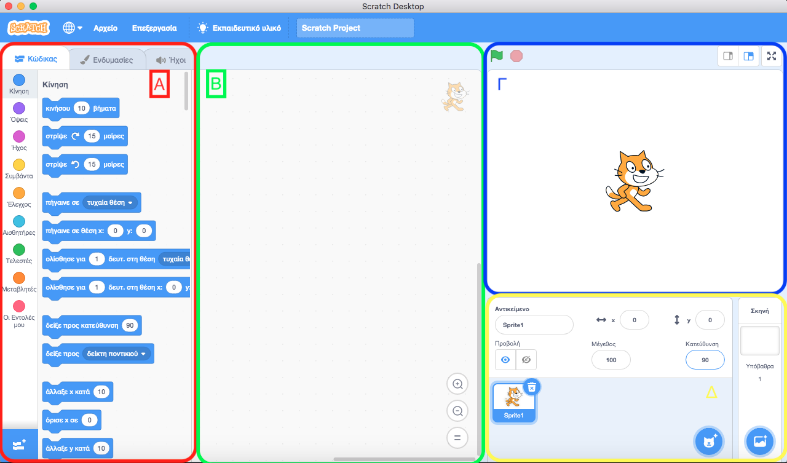
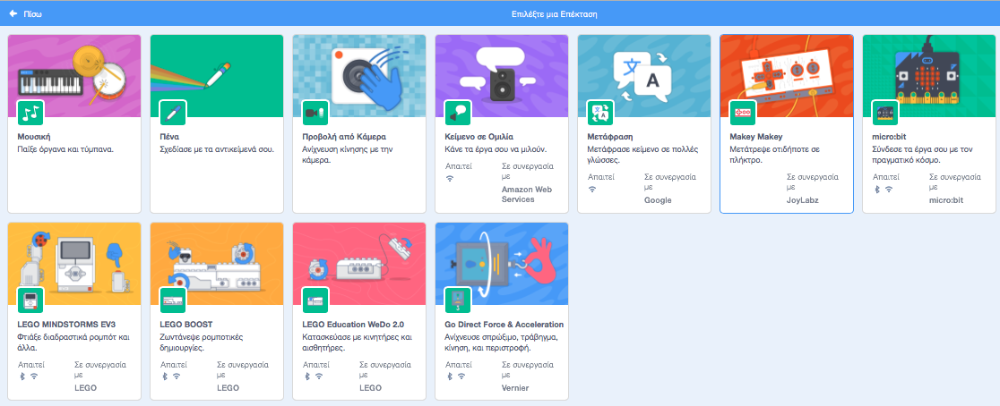
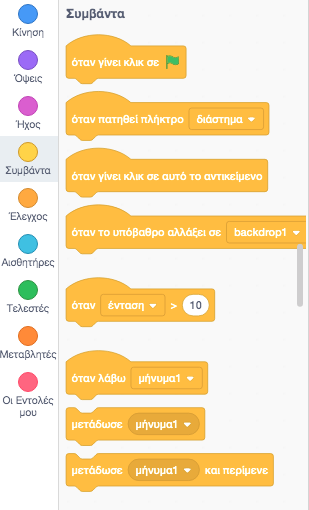
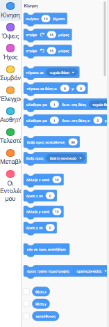
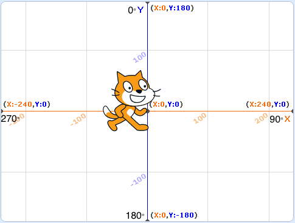
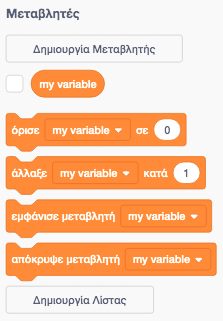
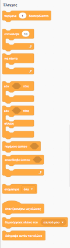
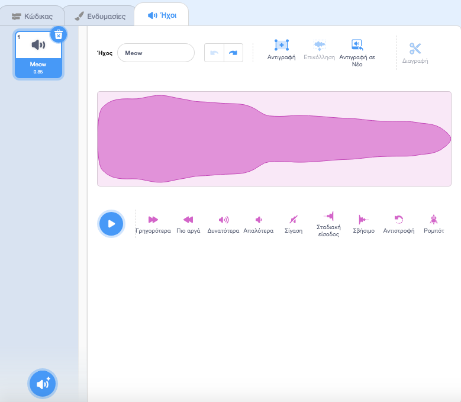

# 2.1 Εισαγωγή στο Scratch

---

[🏠](https://jkost.github.io) | [⬆️](../../README.md) | [▶️](../2.2-Intro2ProgrammingScratch/README.md)

---

## Μαθησιακοί στόχοι
Σε αυτήν την ενότητα θα μάθουμε:

* τι είναι το Scratch
* τις εντολές του Scratch
* τον προγραμματισμό με μπλοκ

## Εισαγωγή στο Scratch

Πολλοί από τους ανθρώπους που διαμόρφωσαν τον ψηφιακό μας κόσμο ξεκίνησαν γράφοντας ηλεκτρονικά παιχνίδια για διασκέδαση. Ο Bill Gates, συνιδρυτής της Microsoft, έγραψε τον πρώτο του πρόγραμμα στην ηλικία των 13 ετών - ένα παιχνίδι τρίλιζας. Λίγα χρόνια αργότερα ένας έφηβος, ο Steve Jobs και ο φίλος του Steve Wozniak, που αργότερα ίδρυσαν την Apple μαζί,
δημιούργησε το παιχνίδι Breakout. Ξεκίνησαν να γράφουν παιχνίδια και προγράμματα για πλάκα, χωρίς να γνωρίζουν ότι οι εταιρίες που δημιούργησαν θα άλλαζαν τον κόσμο. Μήπως είστε ο/η επόμενος/η;

Σε τούτη την εβδομάδα θα μάθουμε προγραμματισμό χρησιμοποιώντας άλλο ένα πολύ διαδεδομένο πρόγραμμα, το Scratch. Το Scratch αναπτύχθηκε από το πανεπιστήμιο του MIT (Massachussets Institute of Technology) και πιο συγκεκριμένα από το Lifelong Kindergarten group με επικεφαλή τον Mitchel Resnick το 2007. Διανέμεται δωρεάν για διαφορετικά λειτουργικά συστήματα (Windows, Mac OS X ή Linux). Μπορείτε είτε να το κατεβάσετε και να το εγκαταστήσετε στον Η/Υ σας, είτε να το χρησιμοποιήσετε απευθείας από τον πλοηγό σας χωρίς εγκατάσταση, online από την [ιστοσελίδα του Scratch](http://scratch.mit.edu/).

1. Πλοηγηθείτε στην ιστοσελίδα [http://scratch.mit.edu](http://scratch.mit.edu) 
2. Πατήστε στο κουμπί **Ξεκινήστε να Δημιουργείτε**

και θα εμφανιστεί το περιβάλλον εργασίας του Scratch (βλ. εικόνα 2.1.1) όπου μπορείτε να ξεκινήσετε να γράφετε προγράμματα  (ο πλοηγός σας θα πρέπει να υποστηρίζει [WebGL](https://www.khronos.org/webgl/wiki/Main_Page)). Μπορείτε επίσης να δημιουργήσετε και ένα λογ/σμό και να συνδεθείτε (το οποίο είναι χρήσιμο ώστε να μοιράζεστε τις δημιουργίες σας στο φόρουμ). 

**Σημείωση!** _Αν δεν εμφανίζεται η ιστοσελίδα στα ελληνικά, αλλάξτε την γλώσσα στο κάτω μέρος της ιστοσελίδας._

Αν θέλετε μπορείτε να κατεβάσετε το περιβάλλον εργασίας του Scratch στον Η/Υ σας και να το δουλέψετε offline (χωρίς σύνδεση στο διαδίκτυο) ακολουθώντας τα παρακάτω βήματα:

1. Πλοηγηθείτε στην ιστοσελίδα [https://scratch.mit.edu/download](https://scratch.mit.edu/download)
2. Επιλέξτε το Λειτουργικό σας Σύστημα (Windows, MacOS, ChromeOS, Android)
3. Επιλέξτε τον υπερσύνδεσμο **Απευθείας Λήψη**

και εγκαταστήστε το στον Η/Υ σας. Παραπιπτόντως, θα δουλέψουμε με την πιο πρόσφατη έκδοση, την έκδοση 3. 

Αφού εκκινήσετε το Scratch, είτε από τον πλοηγό είτε από το κατεβασμένο πρόγραμμα, εμφανίζεται το παράθυρο που φαίνεται στην εικόνα 2.1.1. Το πρώτο πράγμα που μπορείτε να κάνετε είναι να αλλάξετε τη γλώσσα της εφαρμογής στα ελληνικά πατώντας στο μενού **Settings -> Language** και επιλέγοντας _Ελληνικά_.



**Εικόνα 2.1.1** _Το περιβάλλον εργασίας Scratch_

Όπως φαίνεται στην εικόνα 2.1.1, το περιβάλλον εργασίας Scratch χωρίζεται σε διάφορες περιοχές τις οποίες έχουμε ζωγραφίσει με διαφορετικά χρώματα.

1. Στο πάνω μέρος υπάρχει μια μπάρα ή γραμμή μενού με τις εντολές **Αρχείο**, **Επεξεργασία**, **Εκπαιδευτικό υλικό** και το όνομα του έργου στο οποίο δουλεύετε. Όταν αποθηκεύσετε το έργο σας π.χ. στο δίσκο σας, το όνομα του αρχείου θα είναι αυτό που ορίσατε ως όνομα του έργου. Το εξ' ορισμού όνομα έργου είναι ```Scratch Project```.
2. Η περιοχή *Α* περιέχει τις διάφορες εντολές που μπορούμε να χρησιμοποιήσουμε για να προγραμματίσουμε το Scratch. Αυτές χωρίζονται σε διάφορες κατηγορίες ή παλέτες (π.χ. _Κίνηση, Ήχος, Συμβάντα_ κλπ.).
3. Δημιουργούμε προγράμματα σέρνοντας εντολές στην περιοχή *Β*, που ονομάζεται και περιοχή σεναρίων (scripts) ή κώδικα. Εδώ γράφουμε τα προγράμματά μας.
4. Το αποτέλεσμα της εκτέλεσης των προγραμμάτων μας εμφανίζεται στην περιοχή *Γ*. Συνήθως πατάμε την πράσινη σημαιούλα για να εκτελεστεί το πρόγραμμά μας ενώ σταματάμε την εκτέλεση πατώντας στο κόκκινο εξάγωνο. Η περιοχή αυτή ονομάζεται και (θεατρική) _σκηνή (stage)_. 
5. Η περιοχή *Δ*, τέλος, περιέχει τους διάφορους χαρακτήρες ή αντικείμενα (sprites) που θέλουμε να χρησιμοποιήσουμε στα προγράμματά μας καθώς και τα υπόβαθρα (σκηνικά). Βλέπουμε το χαρακτήρα _γάτα_ (Sprite1) στις περιοχές Β, Γ και Δ.

Κάθε φορά που θα γράφουμε ένα νέο πρόγραμμα καλό είναι να του δίνουμε ένα νέο όνομα στο πλαίσιο κειμένου στη μπάρα εντολών (αντικαθιστώντας το εξ' ορισμού όνομα ```Scratch Project```). Επίσης, είναι σημαντικό να αποθηκεύετε συχνά το έργο σας στο δίσκο σας με την εντολή **Αρχείο → Αποθήκευση στον υπολογιστή σου** ώστε αν π.χ. κρασάρει η εφαρμογή Scratch να μην έχετε χάσει πολλές αλλαγές.

Πατώντας στο μπλε κουμπί κάτω αριστερά στην περιοχή *Α*, μπορείτε να προσθέσετε και πρόσθετα/επεκτάσεις στο Scratch. Προσθέστε τις επεκτάσεις _Μουσική_ και _Πένα_. 



**Εικόνα 2.1.2** _Επεκτάσεις του Scratch_

## Εντολές
Όπως και με κάθε γλώσσα προγραμματισμού που θα μάθουμε σ' αυτό το μάθημα, θα πρέπει κατ' αρχήν να μάθουμε τις εντολές και τη σύνταξη της γλώσσας. Όπως θα δείτε, οι εντολές επαναλαμβάνονται πάνω-κάτω σε κάθε γλώσσα και καθώς η επανάληψη είναι η μητέρα της μαθήσεως ... αυτό θα σας βοηθήσει να τις κατανοήσετε καλύτερα και να λύσετε τυχόν απορίες από τα μαθήματα της 1ης εβδομάδας. Στο Scratch δημιουργείτε προγράμματα ενώνοντας μεταξύ τους πλακίδια όπως ακριβώς ένας DJ ενώνει μεταξύ τους μουσικά κομμάτια για να δημιουργήσει μια μουσική σύνθεση. Το όνομά του μάλιστα (_Σκρατς_), προήλθε από τον ήχο που κάνουν οι DJ όταν έπαιζαν με τους δίσκους βινυλίου. 

Ας ξεκινήσουμε με τις εντολές της παλέτας _Συμβάντα_ (βλ. Εικόνα 2.1.3). Η πιο σημαντική ίσως εντολή είναι η "όταν γίνει κλικ σε" η οποία δηλώνει την αρχή του προγράμματός μας. Όταν πατήσουμε τη πράσινη σημαιούλα ξεκινά η εκτέλεση του προγράμματός μας. Βλέπουμε κι άλλους τρόπους εκτέλεσης του προγράμματος, όπως όταν πατηθεί κάποιο πλήκτρο ή όταν κάνουμε κλικ με το ποντίκι πάνω σε κάποιο αντικείμενο κ.ο.κ. Μπορείτε να προσθέσετε π.χ. περισσότερες από μια εντολές "όταν γίνει κλικ σε" και να εκτελέσετε διαφορετικά προγράμματα παράλληλα! Βέβαια, αρκεί απλά να κάνετε κλικ με το ποντίκι πάνω σε μια στοίβα εντολών για να την εκτελέσετε, χωρίς να προσθέσετε στην αρχή της την εντολή "όταν γίνει κλικ σε".



**Εικόνα 2.1.3** _Συμβάντα_

Οι εντολές παλέτας _Κίνηση_, όπως δηλώνει και το όνομά τους (βλ. Εικόνα 2.1.4), μας βοηθούν στο να μπορούμε να μετακινούμε, περιστρέφουμε κλπ. τον ήρωά μας. 



**Εικόνα 2.1.4** _Εντολές παλέτας Κίνησης_

Παρατηρήστε τις εντολές "όρισε x σε 0" ή "άλλαξε y κατά 10". Τι είναι τα x και y; Μα οι γνωστές από τα μαθηματικά συντεταγμένες. _x_ είναι η οριζόντια και _y_ η κατακόρυφη συντεταγμένη, με την αρχή (x, y) = (0, 0) να βρίσκεται στο κέντρο της περιοχής προγραμματισμού (Β). Το σύστημα συντεταγμένων της περιοχής Β φαίνεται στην ακόλουθη εικόνα.



**Εικόνα 2.1.5** _Σύστημα συντεταγμένων του Scratch_

Στην εικόνα 2.1.5 βλέπουμε επίσης και τις διάφορες κατευθύνσεις, δηλ. 0° (πάνω), 90° (δεξιά), 180° (κάτω), 270° (αριστερά), 360° (πάνω).



**Εικόνα 2.1.6** _Παλέτα Μεταβλητές_

Όπως μάθαμε και στο Φωτόδεντρο, και το Scratch υποστηρίζει τη δημιουργία μεταβλητών καθώς και λίστας.

Οι τελεστές που υποστηρίζει το Scratch φαίνονται στην εικόνα 2.1.7. Βλέπουμε ότι υποστηρίζονται οι αριθμητικές πράξεις +, -, *, / καθώς και το ακέραιο υπόλοιπο, οι τελεστές σύγκρισης ```<```, ```>```, ```=``` οι λογικοί τελεστές ```και```, ```ή```, ```όχι``` κλπ. Μπορείτε επίσης να συνενώσετε μεταξύ τους αλφαριθμητικά με την εντολή ```ένωσε```.


**Εικόνα 2.1.7** _Παλέτα Τελεστές_

Οι εντολές ελέγχου περιλαμβάνουν τις εντολές αποφάσεων (π.χ. ```εάν ... τότε```) και επανάληψης (π.χ. ```επανέλαβε```) που μάθαμε στο Φωτόδεντρο. Δέχονται, όπως μάθαμε στα μαθήματα τις προηγούμενης εβδομάδας, συνθήκες που μπορούν να είναι είτε αληθής είτε ψευδής. Τις συνθήκες αυτές μπορείτε να τις βρείτε στην παλέτα _Τελεστές_ που είδαμε πιο πάνω.



**Εικόνα 2.1.8** _Παλέτα Έλεγχος_

Αφήνουμε να κοιτάξετε μόνοι σας τις υπόλοιπες παλέτες. Θα τις δούμε στην πράξη στα επόμενα μαθήματα. 

   _[Κοιτάξτε τι μπορείτε να δημιουργήσετε με το Scratch](https://scratch.mit.edu/projects/217564513/). Απλά πατήστε την πράσινη σημαιούλα._
   
## Αντικείμενα, σκηνικά και σενάρια
Ένα έργο στο Scratch μοιάζει με ένα θεατρικό έργο. Περιλαμβάνει ηθοποιούς (αντικείμενα), σκηνικό και σενάρια. Θα μιλήσουμε για τα σενάρια στα επόμενα μαθήματα, ενώ σε τούτη την ενότητα θα μιλήσουμε για τα αντικείμενα και τα σκηνικά. 

Επιλέγοντας τον ήρωά σας (τη γατούλα στην προκειμένη περίπτωση) και επιλέγοντας την καρτέλα _Ενδυμασίες_ βλέπουμε τις δυο ενδυμασίες της γατούλας. Όπως θα μάθουμε σε επόμενο μάθημα να κινούμε τη γατούλα, μπορούμε να εναλλάσουμε αυτές τις δυο ενδυμασίες για να δείχνουμε μια πιο φυσική κίνηση της γατούλας ώστε να φαίνεται ότι κινεί τα πόδια της. Μπορείτε να προσθέσετε ενδυμασίες πατώντας στο στρογγυλό κουμπί κάτω αριστερά (είτε από τις έτοιμες είτε βγάζοντας φωτογραφίες από την κάμερα του Η/Υ ή κινητού σας) ή να τροποποιήσετε την επιλεγμένη ενδυμασία χρησιμοποιώντας τα κουμπιά ζωγραφικής που είναι παρόμοια με το πρόγραμμα _Ζωγραφική_ των Windows.


**Εικόνα 2.1.9** _Καρτέλα ενδυμασίες_

Παρόμοια είναι και η καρτέλα _Ήχοι_. Μπορείτε να προσθέσετε ήχους πατώντας στο στρογγυλό κουμπί κάτω αριστερά (είτε από τους έτοιμους που παρέχει το Scratch είτε εγγράφοντας εσύ δικούς σας) ή να τροποποιήσετε τον επιλεγμένο ήχο με τα κουμπιά κάτω από την κυματομορφή του. Μη φοβάστε να δοκιμάσετε τα διάφορα εφέ. Αν κάτι δε σας αρέσει μπορείτε να πατήσετε τα κουμπάκια **Αναίρεση** (και **Επανάληψη**) για να αναιρέσετε τα εφέ που εφαρμόσατε.



**Εικόνα 2.1.10** _Καρτέλα ήχοι_

Τέλος, μπορείτε να επιλέξετε από μια πληθώρα σκηνικών από το στρογγυλό κουμπί κάτω δεξιά στην περιοχή _Σκηνή_. Ένα εντυπωσιακό σκηνικό δημιουργεί μια κατάλληλη ατμόσφαιρα για το παιχνίδι. Όπως και στις προηγούμενες περιπτώσεις των ήχων και των ενδυμασιών, μπορείτε να ζωγραφίσετε τα δικά σας σκηνικά, ή να τροποποιήσετε τα δικά σας είτε να προσθέσετε σκηνικά (είτε από τα έτοιμα που παρέχει το Scratch είτε βγάζοντας φωτογραφίες από την κάμερα του Η/Υ ή κινητού σας). 
   
Προτού συνεχίσετε, ξοδέψτε 10' για να παρακολουθήσετε αυτό το διασκεδαστικό [αλληλεπιδραστικό πρόγραμμα](https://scratch.mit.edu/projects/34561116/embed) γραμμένο σε τι άλλο; Μα φυσικά σε Scratch. 

## Βιβλιογραφία
Υπάρχουν άπειρες πηγές για το Scratch. 

1. [Μάθετε το Scratch με το Scratch!](https://scratch.mit.edu/projects/34561116/embed).
1. [Μαθαίνω να προγραμματίζω με το Scratch](http://robotics-edu.gr/scratch/).
1. [Μαθαίνω το Scratch](http://users.sch.gr/kosrop/scratch/scratch.html).
1. [Scratch 4 Teachers](https://scratch4teachers.appspot.com/course), Ελληνικό Ανοικτό Πανεπιστήμιο.
1. Λαδιάς Τ. & Καρβουνίδης Θ. (2020), [Let's Scratch](https://www.academia.edu/42383101/Lets_Scratch_3_%CE%9F%CE%B4%CE%B7%CE%B3%CF%8C%CF%82_%CE%95%CE%BA%CF%80%CE%B1%CE%B9%CE%B4%CE%B5%CF%85%CF%84%CE%B9%CE%BA%CE%BF%CF%8D), STEM Education.
1. Παλαιγεωργίου Γ. κ.ά. (2010), [Δημιουργώ παιχνίδια στο Scratch](http://www.scratchplay.gr/contents/scratchplaybook.pdf), Τμήμα Μηχανικών Η/Υ, Δικτύων και Τηλεπικοινωνιών, Πανεπιστήμιο Θεσσαλίας.
1. Παπαδόπουλος Γ. κ.ά. (2015), _Ειδικά θέματα προγραμματισμού σε Scratch_, 2η έκδοση, Βιβλίο μαθητή, Ελληνογερμανική Αγωγή.
1. Τζόρτζογλου Φ. (2018), ["Scratch 3.0: Τα βασικά χαρακτηριστικά της νέας δημοφιλούς πλατφόρμας"](https://edtech.gr/scratch-3-0/), EdTech. 
1. [Προγραμματισμός για Αρχάριους, Εύκολα με το Scratch](https://www.pcsteps.gr/103733-%CF%80%CF%81%CE%BF%CE%B3%CF%81%CE%B1%CE%BC%CE%BC%CE%B1%CF%84%CE%B9%CF%83%CE%BC%CF%8C%CF%82-%CE%B3%CE%B9%CE%B1-%CE%B1%CF%81%CF%87%CE%AC%CF%81%CE%B9%CE%BF%CF%85%CF%82-scratch/), PC Steps.
1. Anthropy A. (2019), _Make your own Scratch Games_, No Starch Press.
1. Baldwin B. (2020), _Coding For Kids Scratch_.
1. Bers M. U. & Resnick M. (2016), _The Official Scratch Book_, No Starch Press.
1. Breen D. (2015), _Scratch For Kids For Dummies_, Wiley.
1. Breen D. (2016), _Designing Digital Games_, Wiley.
1. Codings Z. (2020), _Scratch Coding for Kids_.
1. Hopper M. (2020), _Coding For Kids Scratch_.
1. Marji M. (2014), _Learn to Program with Scratch_, No Starch Press.
1. Morisson C. (2020), _Scratch Coding for Kids_, 
1. Python J. (2020), _Coding For Kids Scratch_. 
1. Sweigart A. (2021), _Scratch 3 Programming Playground_, No Starch Press.
1. The Lead project, (2012), _Super Scratch Programming Adventure_, No Starch Press.
1. Vlieg E. (2016), _Scratch by Example_, APress.
1. Wilson T. (2020), _CODING FOR KIDS SCRATCH_.
1. Woodcock J. (2015), _Coding Games in Scratch_, DK.

---

[🏠](https://jkost.github.io) | [⬆️](../../README.md) | [▶️](../2.2-Intro2ProgrammingScratch/README.md)

---