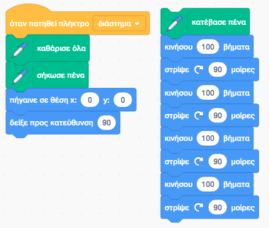
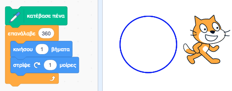
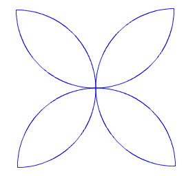
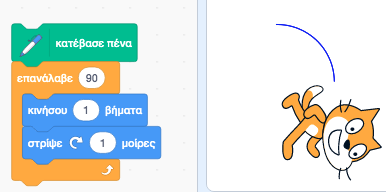
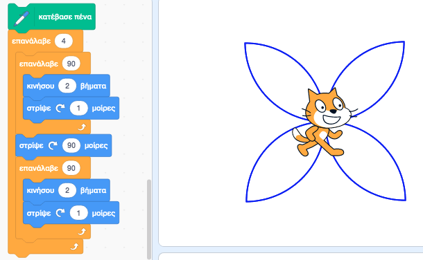
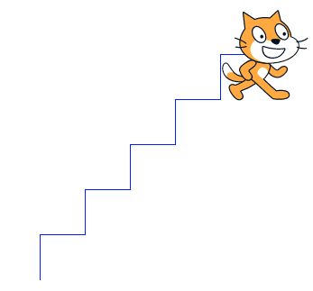
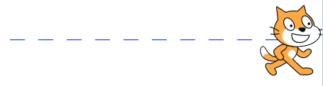
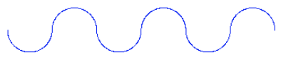
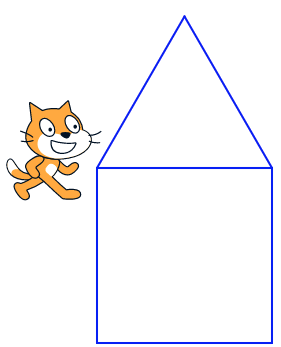
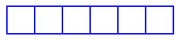

# 2.2 Προγραμματισμός με το Scratch
@ Γιάννης Κωστάρας

---

[🏠](https://jkost.github.io) | [⬆️](../../README.md) | [◀️](../2.1-Intro2Scratch/README.md) | [▶️](../2.3-Variables/README.md)

---

## Μαθησιακοί στόχοι
Σε αυτήν την ενότητα θα μάθουμε:

* να προγραμματίζουμε με το Scratch

## Το πρώτο μας πρόγραμμα με το Scratch

Το πρώτο μας πρόγραμμα είναι ο σχεδιασμός ενός τετραγώνου με το Scratch. Για σκεφτείτε το μια στιγμή. Θα χρειαστούμε εντολές από τις κατηγορίες _Κίνηση_ και _Πένα_. Όταν πατηθεί η σειρά εντολών, η γατούλα θα κινηθεί 100 εικονοστοιχεία (pixels), στη συνέχεια θα πρέπει να περιστραφεί κατά 90 μοίρες δεξιόστροφα, να κινηθεί άλλα 100 pixels κλπ.

Συγκρίνετε τη λύση σας με την παρακάτω (βλ. εντολές στη δεξιά μεριά).



**Εικόνα 2.2.1** _Δημιουργία τετραγώνου με το Scratch_

Οι εντολές στα αριστερά καθαρίζουν την σκηνή (stage) όταν πατηθεί το πλήκτρο κενό (space). Παρατηρήτε ότι δεν προλαβαίνουμε να δούμε πότε η γατούλα ζωγράφησε το τετράγωνο. Πώς μπορείτε να τροποποιήσετε το πρόγραμμα ώστε να προσθέσετε μια καθυστέρηση μετά από κάθε εντολή ώστε να μπορούμε να δούμε καλύτερα τι κάνει η γατούλα; (βλ. στο μενού _Έλεγχος_).

Πώς μπορείτε να βελτιώσετε το πρόγραμμα; Παρατηρήστε ότι επαναλαμβάνουμε τις ίδιες εντολές πολλές φορές. Όπως μάθαμε στα μαθήματα της προηγούμενης εβδομάδας, οι εντολές επανάληψης που μας βοηθούν να γράφουμε λιγότερο κώδικα. Γράφοντας λιγότερο κώδικα δε γλυτώνουμε μόνο χρόνο αλλά δημιουργούμε και προγράμματα με λιγότερα λάθη. Πώς μπορείτε να έχετε το ίδιο αποτέλεσμα χρησιμοποιώντας μια εντολή επανάληψης για να μειώσετε τον αριθμό των εντολών του προγράμματος; Πόσες φορές θα πρέπει να εκτελεστεί η εντολή επανάληψης;

Πώς μπορούμε τώρα να δημιουργήσουμε ένα ισόπλευρο τρίγωνο αντί για ένα τετράγωνο; Δοκιμάστε διάφορες τιμές μέχρι να πετύχετε το ζητούμενο (η τεχνική αυτή λέγεται "Δοκιμή και Σφάλμα" (Trial and Error)).

Αν τα καταφέρατε, τότε δε θα 'ναι δύσκολο να ζωγραφίσετε ένα πεντάγωνο και ένα εξάγωνο. Προσπαθήστε τα.

Πώς όμως μπορείτε να υπολογίζετε κάθε φορά τη γωνία περιστροφής (εκτός του να δοκιμάζετε διαφορετικές γωνίες κάθε φορά μέχρι να πετύχετε το ζητούμενο); Κάθε φορά η γατούλα κάνει μια πλήρη περιστροφή, δηλ. 360°. Αν παρατηρήσετε, όταν ζωγραφίζετε ένα τετράγωνο, τότε 4x90°=360°, ένα πεντάγωνο 5x72°=360° κ.ο.κ. Καταλαβαίνετε λοιπόν ότι ο αλγόριθμος υπολογισμού της γωνίας περιστροφής είναι 360°/<αρ. πλευρών>. Π.χ. 360°/5 = 72° είναι η γωνία κατά την οποία πρέπει να περιστρέψουμε τη γατούλα μας ώστε να ζωγραφίσει ένα πεντάγωνο.  

Και τώρα κάτι ποιο δύσκολο. Πώς μπορούμε να ζωγραφίσουμε έναν κύκλο; Ας το σκεφτούμε λίγο. Ένας κύκλος αποτελείται από 360°. Πόσα βήματα πρέπει να κινηθούμε κάθε φορά και πόσες μοίρες πρέπει να περιστραφούμε;



**Εικόνα 2.2.2** _Δημιουργία κύκλου με το Scratch_
 
Παρατηρήσατε ίσως ότι ο σχεδιασμός του κύκλου είναι πολύ αργός. Πώς θα μπορούσατε να κάνετε τη σχεδίαση του κύκλου πιο γρήγορη; Θα πρέπει πάντα το βήμα επί τον αριθμό των επαναλήψεων να μας κάνει 360°.

Ας δούμε κάτι πιο δύσκολο μαζί. Πώς μπορούμε να δημιουργήσουμε ένα τετράφυλλο λουλούδι όπως αυτό της παρακάτω εικόνας;



**Εικόνα 2.2.3** _Δημιουργία ενός λουλουδιού με το Scratch_

Κατ' αρχήν καθαρίστε την οθόνη πατώντας το κενό (space). Ξεκινάμε προσπαθώντας να δημιουργήσουμε το ένα μόνο από τα 4 φύλλα. Μας θυμίζει κύκλο οπότε ας δοκιμάσουμε να δημιουργήσουμε μόνο το 1/4 του κύκλου. Προσπαθήστε μόνοι σας. Πώς θα μπορούσαμε να μακρύνουμε λίγο τον κύκλο; Ποια από τις 4 εντολές τις εικόνας 2.2.4 πρέπει να αλλάξουμε;



**Εικόνα 2.2.4** _Δημιουργία ενός τεταρτημόριου στο Scratch_

Αν αλλάξατε την εντολή ```κινήσου 1 βήματα``` σε ```κινήσου 2 βήματα``` τότε απαντήσατε σωστά. Τώρα πρέπει να ζωγραφίσουμε το υπόλοιπο τμήμα του φύλλου. Πόσες μοίρες πρέπει να στρίψουμε τη γατούλα; Δοκιμάστε διάφορες γωνίες μέχρις ότου βρείτε τη σωστή. Αφού καταφέρατε να δημιουργήσετε το ένα φύλλο, να δημιουργήσετε τα υπόλοιπα 3 είναι εύκολο καθώς η γατούλα είναι ήδη στραμμένη στη σωστή γωνία για να ξεκινήσει τη σχεδίαση του επόμενου φύλλου. Το τελικό πρόγραμμα φαίνεται στην παρακάτω εικόνα:



**Εικόνα 2.2.5** _Δημιουργία ενός λουλουδιού στο Scratch_

## Ασκήσεις
1. Δημιουργήστε 5 σκαλοπάτια όπως φαίνεται στην παρακάτω εικόνα:



**Εικόνα 2.2.6** _Άσκηση 1: Δημιουργία σκαλοπατιών με το Scratch_

2. Δημιουργήστε την εστιγμένη γραμμή της παρακάτω εικόνας:



**Εικόνα 2.2.7** _Άσκηση 2: Δημιουργία εστιγμένης γραμμής με το Scratch_

3. Δημιουργήστε την κυματομορφή της παρακάτω εικόνας:



**Εικόνα 2.2.8** _Άσκηση 3: Δημιουργία κυματομορφής με το Scratch_
   
   Η άσκηση αυτή χρειάζεται εμφωλιασμένους βρόγχους, δηλ. ένα βρόγχο (για την ακρίβεια 2) μέσα σε άλλον.    
   
4. Ζωγραφίστε ένα σπιτάκι:



**Εικόνα 2.2.9** _Άσκηση 4: Δημιουργία ενός σπιτιού με το Scratch_

5. Ζωγραφίστε 6 τετραγωνάκια:



**Εικόνα 2.2.10** _Άσκηση 5: Δημιουργία έξι τετραγώνων με το Scratch_

---

[🏠](https://jkost.github.io) | [⬆️](../../README.md) | [◀️](../2.1-Intro2Scratch/README.md) | [▶️](../2.3-Variables/README.md)

---