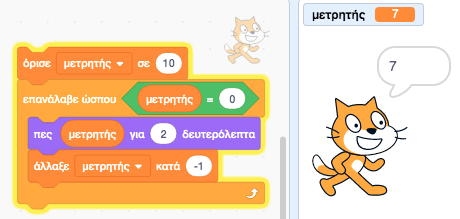
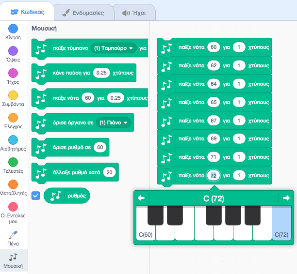
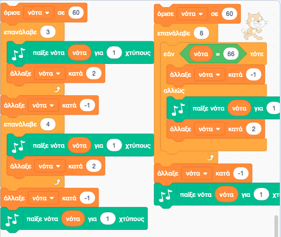
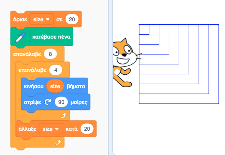
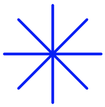
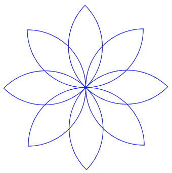
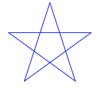
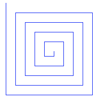

# 2.3 Μεταβλητές
@ Γιάννης Κωστάρας

---

[🏠](https://jkost.github.io) | [⬆️](../../README.md) | [◀️](../2.2-Intro2ProgrammingScratch/README.md) | [▶️](../2.4-Movement/README.md)

---

## Μαθησιακοί στόχοι
Σε αυτήν την ενότητα θα μάθουμε:

* τι είναι οι μεταβλητές

## Μεταβλητές

Όπως και κάθε γλώσσα προγ/σμού έτσι και το Scratch υποστηρίζει μεταβλητές. Χρησιμοποιούμε μεταβλητές ως προσωρινές αποθήκες τιμών. Μπορούμε να δημιουργήσουμε μια νέα μεταβλητή από την πλακέτα _Μεταβλητές_ πατώντας στο κουμπί **Δημιουργία Μεταβλητής**. Εμφανίζεται ένα διαλογικό παράθυρο στο οποίο καλείστε να δώσετε κάποιο όνομα για τη μεταβλητή σας. Δημιουργήστε μια νέα μεταβλητή με το όνομα ```μετρητής```. Δοκιμάστε να γράψετε ένα σενάριο (πρόγραμμα) που να μετράει από το 10 μέχρι το 0. Χρησιμοποιήστε την εντολή ```Πες Γειά! για 2 δευτερόλεπτα```.

Αρχικοποιούμε τη μεταβλητή μας στην τιμή 10. Στη συνέχεια χρησιμοποιούμε ένα βρόγχο με συνθήκη, όπου η συνθήκη είναι να τερματιστεί ο βρόγχος όταν η μεταβλητή μας πάρει την τιμή 0. Μέσα στο βρόγχο εμφανίζουμε τη τιμή της μεταβλητής μας για 2 δευτ. και μειώνουμε την τιμή της κατά 1. 

Συγκρίνετε τη λύση σας με αυτή της παρακάτω εικόνας.



**Εικόνα 2.3.1** _Παράδειγμα χρήσης μεταβλητής στο Scratch_

Ας δούμε μερικές άλλες χρήσεις των μεταβλητών. Προσθέστε την επέκταση _Μουσική_, αν δεν το ΄χετε κάνει ήδη, και ας δούμε πώς μπορούμε να συνθέσουμε μουσικά κομμάτια με το Scratch.

Ως πρώτο πρόγραμμα θα θέλαμε να ακούσουμε το Ντο-Ρε-Μι-Φα-Σο-Λα-Σι-Ντο. Η απάντηση φαίνεται στην παραπάνω εικόνα.



**Εικόνα 2.3.2** _Παλέτα Μουσική στο Scratch_

Παρατηρήστε ότι έχουμε αλλάξει τους χτύπους από 0.25 (εξ' ορισμού) σε 1. Πώς μπορείτε μειώσετε τον αριθμό των εντολών του προγράμματος; Παρατηρήστε ότι οι τιμές αλλάζουν ως εξής: 60-62-64 και στη συνέχεια 65-67-69-71-72. Αφήνεται ως άσκηση.

Αλλά τι σημαίνει _χτύπος_; Ο χτύπος ή (beat) δηλώνει τη διάρκεια της νότας. Όσο μεγαλύτερη η τιμή του τόσο περισσότερο διαρκεί ο ήχος. Δοκιμάστε να δώσετε μια τιμή μικρότερη και μια τιμή μεγαλύτερη του 1 και ξανατρέξτε το πρόγραμμα. Εμφανίστε το ρυθμό στην περιοχή εκτέλεσης (Γ) επιλέγοντας το κουμπί επιλογής (checkbox) δίπλα στην εντολή **ρυθμός**.

Η παρακάτω εικόνα προσφέρει 2 λύσεις στο πιο πάνω πρόβλημα. Πώς συγκρίνονται με τη δική σας;



**Εικόνα 2.3.3** _Ντο-Ρε-Μι-Φα-Σο-Λα-Σι-Ντο στο Scratch_

Ορίζουμε μια μεταβλητή ```νότα``` (την οποία μπορείτε να την εμφανίσετε επίσης στην περιοχή εκτέλεσης επιλέγοντας το κουμπί επιλογής της). Στην πρώτη λύση χρησιμοποιούμε δυο βρόγχους επανάληψης. Προσέξτε ότι όταν τελειώνει ο πρώτος βρόγχος η τιμή της μεταβλητής ```νότα = 66```, δηλ. 1 παραπάνω από ότι χρειαζόμαστε για την επόμενη νότα (65), άρα μειώνουμε πρώτα τη μεταβλητή μας κατά 1. 

Στη δεύτερη λύση χρησιμοποιούμε μόνο ένα βρόγχο και μια εντολή επιλογής και ελέγχουμε αν η μεταβλητή μας ```νότα = 66``` τότε τη μειώνουμε κατά 1. Εσείς τι λύση(-εις) βρήκατε;

Ας δούμε τώρα πώς μπορούμε να χρησιμοποιήσουμε μια μεταβλητή για να σχεδιάσουμε πολλά σχήματα. Στην παρακάτω εικόνα ορίζουμε τη μεταβλητή ```size = 20``` που είναι το μέγεθος ενός τετραγώνου. Μπορείτε να αναγνωρίσετε τον βρόγχο που σχεδιάζει το τετράγωνο, από το προηγούμενο μάθημα (```επανέλαβε 4 φορές, κινήσου size βήματα, στρίψε 90° δεξιόστροφα```). Ο εσωτερικός αυτός βρόγχος τυλίγεται από έναν εξωτερικό βρόγχο ο οποίος εκτελείται 8 φορές, και κάθε φορά αυξάνεται η τιμή της ```size``` κατά 20, δηλ. ```size = 20, 40, 80``` κλπ. Το αποτέλεσμα φαίνεται στην παρακάτω εικόνα.



**Εικόνα 2.3.4** _Σχεδίαση 8 τετραγώνων στο Scratch_

## Ασκήσεις
1. Η εντολή **όρισε όργανο σε (1) Πιάνο** (βλ. εικόνα 2.3.2) διαθέτει 21 όργανα. Θα θέλαμε να γράψετε ένα πρόγραμμα ώστε να ακούσουμε όλα τα όργανα, γράφοντας όσο το δυνατό λιγότερες εντολές. Η εντολή αυτή συνδυάζεται με την εντολή **παίξε νότα 60 για 0.25 χτύπους**. 
1. Η στιγμή που γράφεται αυτό το μάθημα είναι Χριστούγεννα (με lockdown). Θα ήθελες να γράψεις τα κάλαντα των Χριστουγέννων ή της Πρωτοχρονιάς και να δημοσιεύσεις το κομμάτι σου στο φόρουμ; Φυσικά με όσο το δυνατό λιγότερες εντολές. 
1. Μετατρέψτε το πληκτρολόγιό σας σε synthesizer. Αντιστοιχίστε κάθε πλήκτρο με μια νότα και παίξτε μουσικά κομμάτια όπως σε πιάνο. Αντιστοιχίστε και πλήκτρα για να επιλέξετε διαφορετικά όργανα, όπως σ' ένα synthesizer.
1. Μετατρέψτε το πρόγραμμα της εικόνας 2.3.4 ώστε να ζωγραφίσετε (κάθε φορά):
   α. 8 τρίγωνα
   β. 8 πεντάγωνα
1. Σχεδιάστε το ακόλουθο σχήμα στο Scratch:

   

   **Εικόνα 2.3.5** _Σχεδίαση ενός αστεριού στο Scratch_
1. Σχεδιάστε το ακόλουθο σχήμα στο Scratch:

    

    **Εικόνα 2.3.6** _Σχεδίαση ενός λουλουδιού στο Scratch_
1. Σχεδιάστε το ακόλουθο σχήμα στο Scratch:

    

    **Εικόνα 2.3.7** _Σχεδίαση ενός αστεριού στο Scratch_
1. Σχεδιάστε το ακόλουθο σχήμα στο Scratch:

    

    **Εικόνα 2.3.8** _Σχεδίαση ενός τετράγωνου σπιράλ στο Scratch_

---

[🏠](https://jkost.github.io) | [⬆️](../../README.md) | [◀️](../2.2-Intro2ProgrammingScratch/README.md) | [▶️](../2.4-Movement/README.md)

---