# 2.4 Κίνηση
@ Γιάννης Κωστάρας

---

[🏠](https://jkost.github.io) | [⬆️](../../README.md) | [◀️](../2.3-Variables/README.md) | [▶️](../2.5-NewCommands/README.md)

---

## Μαθησιακοί στόχοι
Σε αυτήν την ενότητα θα μάθουμε:

* πώς να δώσουμε κίνηση στα προγράμματά μας

## Κίνηση

Μπορούμε να δώσουμε κίνηση στον ήρωά μας είτε με τον ποντίκι είτε με το πληκτρολόγιο. Με το παρακάτω πρόγραμμα μπορούμε να μετακινήσουμε τη γατούλα χρησιμοποιώντας τα πλήκτρα βέλη του πληκτρολογίου. 

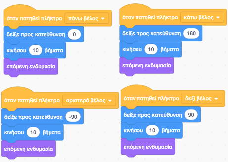

**Εικόνα 2.4.1** _Κίνηση με τα πλήκτρα βέλη του πληκτρολογίου στο Scratch_

Όπως και στα κόμικς, τα αντικείμενα που δημιουργούμε στο Scratch μπορούν να έχουν διαφορετικές ενδυμασίες, τις οποίες
είναι σε θέση να «φορέσουν» σε διαφορετικές στιγμές εκτέλεσης των έργων μας. Μπορείτε να δείτε (και να προσθαφαιρέσετε) ενδυμασίες από την καρτέλα **Ενδυμασίες**. Αλλάζοντας ενδυμασίες με την εντολή ```επόμενη ενδυμασία``` κάνει τη γατούλα μας να κινεί τα πόδια της κι έτσι η κίνησή της είναι πιο ρεαλιστική.

Ένας άλλος τρόπος φαίνεται στην ακόλουθη εικόνα (χωρίς ν' αλλάζουμε αυτή τη φορά την κατεύθυνση που κοιτάει η γατούλα).


**Εικόνα 2.4.2** _Κίνηση με τα πλήκτρα βέλη του πληκτρολογίου στο Scratch_

Παραπάνω είδαμε 2 τρόπους κίνησης που μας προσφέρει το Scratch.

Ο πρώτος τρόπος αφορά τη «σχετική κίνηση των αντικειμένων», δηλαδή τη μετακίνησή τους χωρίς να γνωρίζουμε την ακριβή τους θέση. Ο δεύτερος τρόπος αφορά τη μετακίνηση των αντικειμένων «βάσει συντεταγμένων». Σε αυτήν την περίπτωση προσδιορίζουμε με ακρίβεια το που θα βρίσκεται ο χαρακτήρας μας πάνω στην οθόνη του Scratch. Η κίνηση και στις δυο αυτές περιπτώσεις είναι ακαριαία. Τέλος υπάρχει και η «ομαλή μετακίνηση» κατά την οποία το αντικείμενο μεταφέρεται σε μια άλλη θέση στην οθόνη παρουσιάζοντας όμως την πορεία μετακίνησης, δηλαδή σιγά-σιγά.

Προσθέστε έναν ακόμα χαρακτήρα (sprite), ένα σκυλάκι, επιλέξτε το και βάλτε το να κυνηγάει το γατάκι.

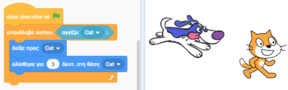

**Εικόνα 2.4.3** _Κίνηση για το σκυλάκι στο Scratch_

Θα θέλαμε να δείξουμε μια συμπεριφορά _κάθε_ φορά που το σκυλάκι "πιάνει" το γατάκι. Το αντίστοιχο πρόγραμμα φαίνεται στην ακόλουθη εικόνα. Παρατηρήστε ότι ο κώδικας εσωκλείεται σε έναν ατέρμονα βρόγχο, δηλ. μια εντολή επανάληψης που δουλεύει για πάντα. Αν ο γατούλης αγγίξει το σκυλάκι (ή το σκυλάκι αγγίξει τον γατούλη) τότε ο γατούλης θα σκέφτεται κάτι και θα νιαουρίζει. 

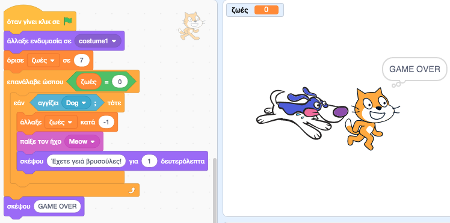

**Εικόνα 2.4.4** _Όταν το σκυλάκι αγγίξει το γατάκι στο Scratch_

Πώς θα μπορούσαμε να κρατήσουμε το σκορ; Για σκεφτείτε το λίγο;

Μα με τη βοήθεια μιας μεταβλητής. Ορίστε μια νέα μεταβλητή ```ζωές``` την οποία αρχικοποιήστε στην τιμή 7 και κάθε φορά που το σκυλάκι αγγίζει τη γατούλα τη μειώνουμε κατά 1. Όταν οι ```ζωές``` της εφτάψυχης γάτας τελειώσουν, εμφανίζουμε το GAME OVER και αλλάζουμε την ενδυμασία της γάτας μας. Μπορείτε να προσθέσετε ενδυμασίες από την καρτέλα **Ενδυμασίες**. 

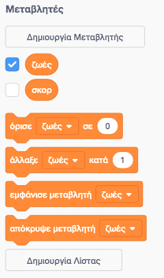

**Εικόνα 2.4.5** _Δημιουργία μεταβλητής ζωές_

Παρατηρούμε όμως ότι η νεκρή γάτα μπορεί ακόμα να κινείται. Πώς μπορούμε ν' αλλάξουμε το πρόγραμμά μας ώστε να μην ανταποκρίνεται στα πλήκτρα του πληκτρολογίου όταν δεν της έχουν μείνει πλέον ζωές;

## Παιχνίδι σκοποβολή
Θα δημιουργήσουμε το παρακάτω παιχνίδι. Πόσες χιονονιφάδες μπορείτε να πετύχετε;

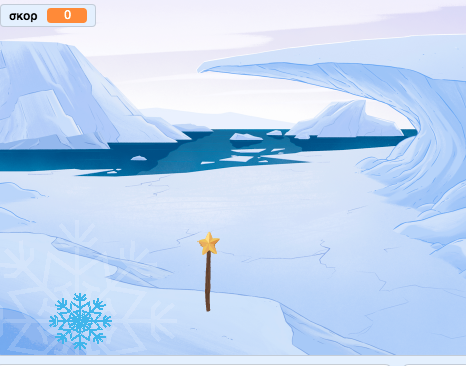

**Εικόνα 2.4.6** _Παιχνίδι σκοποβολή_

Δοκιμάστε να προσθέσετε μόνοι σας το σκηνικό, τη χιονονιφάδα και το μαγικό ραβδί. Το μαγικό ραβδί θα πρέπει να πηγαίνει όπου πάει και το ποντίκι.

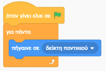

**Εικόνα 2.4.7** _Κώδικας μαγικού ραβδιού_

Ο κώδικας της χιονονιφάδας είναι κάπως πιο πολύπλοκος. Περιμένουμε 1-3 δευτερόλεπτα και στη συνέχεια επιλέμε μια τυχαία θέση (x τυχαίος αριθμός μεταξύ -220 έως 220 εικονοστοιχεία δηλ. το οριζόντιο μήκος της σκηνής μας ενώ το y=194 δηλ. στο άνω μέρος της σκηνής μας) για να εμφανιστεί. Στη συνέχεια μέχρις ότου να φθάσει στο κάτω μέρος της σκηνής (y = -190) αλλάζουμε το y κατά -5 εικονοστοιχεία. Μπορείτε να αλλάξετε αυτή την τιμή ώστε η χιονοστοιβάδα να πέφτει πιο γρήγορα ή πιο αργά. Πότε όμως πετυχαίνουμε την χιονονιφάδα; Ισχύουν δυο συνθήκες: θα πρέπει το μαγικό ραβδί να αγγίζει την χιονονιφάδα αλλά να πατάμε ταυτόχρονα και το αριστερό πλήκτρο του ποντικιού. Τότε η χιονονιφάδα εξαφανίζεται και αυξάνεται το σκορ μας.

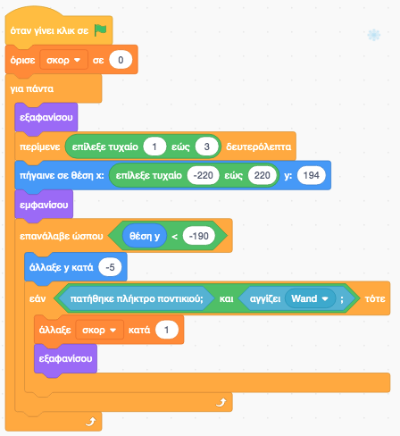

**Εικόνα 2.4.8** _Κώδικας χιονονιφάδας_

## Κλώνοι
Μπορούμε να δημιουργήσουμε κλώνους ενός sprite. Ας δούμε πώς μπορούμε να ξαναγράψουμε το προηγούμενο παιχνίδι χρησιμοποιώντας κλώνους. Θα δημιουργούμε κάθε φορά ένα νέο κλώνο της χιονονιφάδας μας. 

Από την παλέτα _Έλεγχος_ προσθέστε την εντολή ```Όταν ξεκινήσω ως κλώνος``` και αντικαταστήστε με αυτήν την εντολή ```όταν γίνει κλικ σε πράσινη σημαιούλα``` και προσθέστε από κάτω της ότι βρίσκεται μέσα στον ατέρμονα βρόγχο ```για πάντα```. Όταν πατήσω πάνω της με το μαγικό ραβδί τότε μπορώ να διαγράψω αυτόν τον κλώνο, ή όταν ακουμπήσω το κάτω μέρος της σκηνής μου.

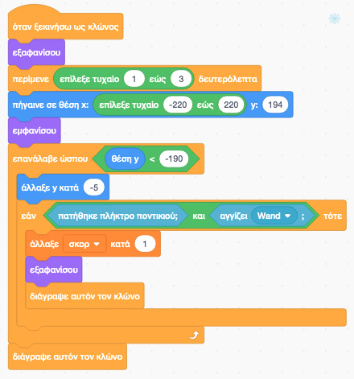

**Εικόνα 2.4.9** _Κώδικας χιονονιφάδας με χρήση κλώνου_

Την εντολή αρχικοποίησης της μεταβλητής ```σκορ``` μπορώ να την μεταφέρω στο σενάριο για το μαγικό ραβδί ακριβώς από κάτω από την εντολή ```όταν γίνει κλικ σε πράσινη σημαιούλα```. Αν πατήσετε την πράσινη σημαιούλα δε συμβαίνει τίποτα. Ξεχάσαμε να πούμε στο πρόγραμμά μας να δημιουργήσει κλώνους. Αυτό το κάνουμε με την εντολή ```δημιούργησε κλώνο του Snowflake```.

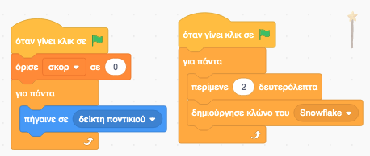

**Εικόνα 2.4.10** _Δημιουργία κλώνου_ 

Μπορείτε να κάνετε το παιχνίδι πιο δύσκολο είτε μειώνοντας το χρόνο που θα περιμένει το σενάριο προτού δημιουργήσει ένα νέο κλώνο ή να τυχαιοποιήσετε αυτό το χρόνο (αφήνεται ως άσκηση);

## Ασκήσεις
1. Παιχνίδι λαβύρινθος. Κατεβάστε ένα σχέδιο λαβύρινθου από το Internet και ορίστε το ως σκηνή του έργου σας. Στη συνέχεια γράψτε ένα σενάριο που να μπορεί ο χρήστης να καθοδηγεί τον ήρωά σας με τα βελάκια του πληκτρολογίου για να φθάσει στην έξοδο του λαβυρίνθου ή σε κάποιο στόχο μέσα στο λαβύρινθο χωρίς ν' ακουμπήσει στους τοίχους. Αν ακουμπήσει τον τοίχο τότε θα οπισθοδρομεί 2 pixels και θα του δίνεται έτσι η ευκαιρία να ξαναπροσπαθήσει σε άλλη κατεύθυνση. Σε κάθε 10 βήματά του να αφήνει πίσω του ένα ίχνος που να δείχνει τη διαδρομή που ακολούθησε.   

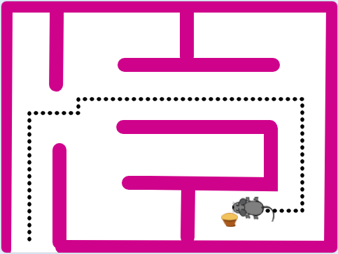

**Εικόνα 2.4.11** _Παιχνίδι λαβύρινθος_

2. Παιχνίδι αγώνες αυτοκινήτων. Δημιουργήστε ένα παιχνίδι αγώνων αυτοκινήτου για δυο παίκτες. Ο πρώτος παίκτης θα κινεί τη φόρμουλά του με τα πλήκτρα ◀️ ▶️ ενώ ο άλλος με τα πλήκτρα ```Ζ``` ```Χ```. Αν μια βολίδα βγει από την πίστα, χάνει. Νικά όποιος τερματίσει πρώτος μετά από 3 γύρους. 
 
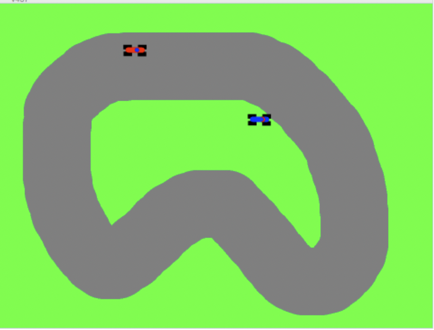

**Εικόνα 2.4.12** _Παιχνίδι αγώνες αυτοκινήτων_
 
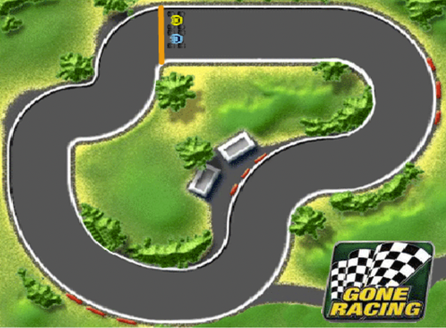

**Εικόνα 2.4.13** _Παιχνίδι αγώνες αυτοκινήτων_

Κατεβάστε τα γραφικά από [εδώ](http://tinyurl.com/pbt7oo6).

---

[🏠](https://jkost.github.io) | [⬆️](../../README.md) | [◀️](../2.3-Variables/README.md) | [▶️](../2.5-NewCommands/README.md)

---