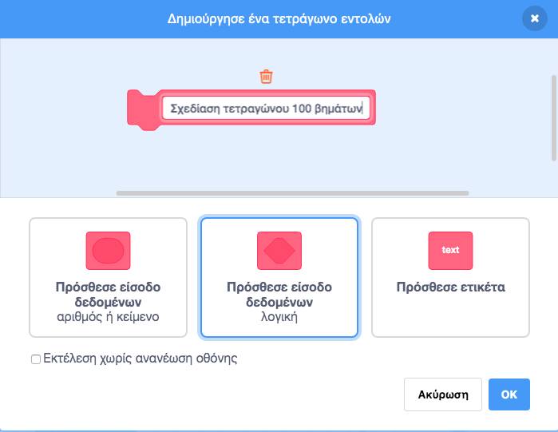
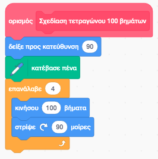
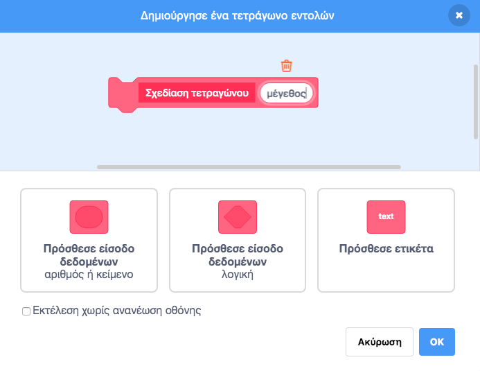
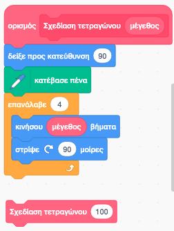

# 2.5 Δημιουργία Νέων Εντολών

---

[🏠](https://jkost.github.io) | [⬆️](../../README.md) | [◀️](../2.4-Movement/README.md) | [▶️](../2.6-Games/README.md)

---

## Μαθησιακοί στόχοι
Σε αυτήν την ενότητα θα μάθουμε:

* πώς να δημιουργήσουμε νέες εντολές στο Scratch

## Δημιουργία Νέων Εντολών

Μπορείτε να δημιουργήσετε τις δικές σας εντολές στο Scratch. Επιλέξτε την παλέτα **Οι εντολές μου** και στη συνέχεια το κουμπί **Δημιουργία Εντολής**. Εμφανίζεται το διαλογικό παράθυρο της εικόνας 2.5.1. Δώστε ένα όνομα για την εντολή σας.



**Εικόνα 2.5.1** _Δημιουργία νέας εντολής_

Μπορείτε τώρα να γράψετε το σενάριο για την εντολή σας.



**Εικόνα 2.5.2** _Εντολή Σχεδίαση τετραγώνου 100 βημάτων_

Η παραπάνω εντολή μας περιορίζει στο να μπορούμε να σχεδιάσουμε ένα τετράγωνο μεγέθους πλευράς 100 εικονοστοιχείων. Αν θέλουμε να σχεδιάσουμε τετράγωνα με μεγαλύτερη ή μικρότερη των 100 pixels πλευρά, θα πρέπει να δημιουργούμε κάθε φορά μια νέα εντολή;

Όπως φαίνεται στην εικόνα 2.5.1 μπορούμε να ορίσουμε παραμέτρους για την εντολή μας. Στην εικόνα 2.5.2 ορίζουμε μια νέα εντολή η οποία δέχεται το _μέγεθος_ της πλευράς σε εικονοστοιχεία. Αυτό το πετυχαίνουμε πατώντας το κουμπί **Πρόσθεσε είσοδο δεδομένων αριθμός ή κείμενο**. 



**Εικόνα 2.5.3** _Δημιουργία νέας εντολής με μια παράμετρο_

Μπορείτε να προσθέσετε και μια λογική παράμετρο (δηλ. που να μπορεί να πάρει μόνο τις τιμές ```Αληθής``` ή ```Ψευδής```) ή ακόμα και μια ετικέτα για να δώσετε περισσότερες πληροφορίες για το τι κάνει η εντολή. Αν σας ήρθε στο μυαλό ότι οι εντολές μοιάζουν με τις συναρτήσεις που μάθαμε στο φωτόδεντρο, τότε πέσατε μέσα. Με τις εντολές μπορούμε να τμηματοποιήσουμε τα προγράμματά μας όπως ακριβώς και με τις συναρτήσεις του φωτόδεντρου.

Αλλά πώς μπορούμε να χρησιμοποιήσουμε την παράμετρο ```μέγεθος```; Σκεφτείτε το λίγο μόνοι σας. Η απάντηση δίνεται στην εικόνα 2.5.4.



**Εικόνα 2.5.4** _Σχεδίαση τετραγώνου με μήκος πλευράς ίσο με την παράμετρο ```μέγεθος```_

Αν τώρα εκτελέσετε την εντολή σας η γατούλα δε ζωγραφίζει τίποτα. Ο λόγος είναι ότι δεν έχετε δώσει τιμή στην παράμετρο ```μέγεθος``` με αποτέλεσμα αυτή να λαμβάνει την εξ' ορισμού 0 και η εντολή να σχεδιάζει ένα τετράγωνο πλευράς 0. Στην εικόνα 2.5.4 έχουμε δημιουργήσει μια άλλη εντολή ```Σχεδίαση τετραγώνου 100``` (την οποία σύραμε από την παλέτα _Οιν εντολές μου_ την οποία καλούμε δίνοντάς της τιμή ```100```. Η τιμή ```100``` αποτελεί το όρισμα που περνάμε στην παράμετρο ```μέγεθος```. Όταν εκτελέσουμε αυτή την εντολή τότε καλείται η εντολή ```Σχεδίαση τετραγώνου``` αντιστοιχίζοντας την παράμετρο ```μέγεθος``` με το ```100``` και σχεδιάζεται έτσι ένα τετράγωνο μήκους 100 εικονοστοιχείων. Δοκιμάστε και με άλλα μήκη πλευρών.

Πλέον μπορείτε να χρησιμοποιήσετε τη νέα σας εντολή σε άλλα σενάρια. 

## Ασκήσεις
1. Δημιουργήστε μια νέα εντολή ```Σχεδίαση πενταγώνου``` που θα λαμβάνει μια παράμετρο ```μήκος πλευράς``` και θα σχεδιάζει ένα πεντάγωνο πλευράς μήκους ίσης με το ```μήκος πλευράς```.
1. Δημιουργήστε μια νέα εντολή ```Σχεδίαση κύκλου``` που θα λαμβάνει μια παράμετρο ```μήκος``` και θα σχεδιάζει ένα κύκλο με βήμα ίσο με το δοθέν μήκος.
1. Χρησιμοποιώντας την εντολή ```Σχεδίαση τετραγώνου``` της εικόνας 2.5.4, γράψτε ένα σενάριο που να σχεδιάζει 10 εμφωλιασμένα τετράγωνα όπως αυτά τους σχήματος 2.3.4. Επαναλάβετε την άσκηση σχεδιάζονται 10 εμφωλιασμένα πεντάγωνα με τη βοήθεια της εντολής της άσκησης 1 και 10 εμφωλιασμένους κύκλους με τη βοήθεια της εντολής της άσκησης 2. 
1. Δημιουργήστε μια εντολή ```Σχεδίαση σχήματος``` που θα δέχεται δυο παραμέτρους: το πλήθος των πλευρών και το μήκος της πλευράς. Τεστάρετε την εντολή σας σχεδιάζοντας ένα τρίγωνο, ένα τετράγωνο, ένα πεντάγωνο, ένα εξάγωνο κι ένα οκτάγωνο.
1. Χρησιμοποιήστε την παραπάνω εντολή για να γράψετε δυο σενάρια που θα σχεδιάζουν τα παρακάτω σχήματα:


**Εικόνα 2.5.5** _Σχεδίαση εμφωλιασμένων σχημάτων_

1. Δημιουργήστε μια νέα εντολή ```Σχεδίαση ημικύκλιου``` με μια παράμετρο ```μήκος``` που θα σχεδιάζει ένα ημικύκλιο. Χρησιμοποιήστε τη για να σχεδιάσετε ένα ουράνιο τόξο που θα αποτελείται από 10 ομόκεντρα ημικύκλια όπου κάθε ημικύκλιο θα έχει διαφορετικό χρώμα.
 
---

[🏠](https://jkost.github.io) | [⬆️](../../README.md) | [◀️](../2.4-Movement/README.md) | [▶️](../2.6-Games/README.md)

---