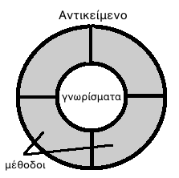

# 3.1 Εισαγωγή στον Αντικειμενοστραφή Προγραμματισμό

---

[🏠](https://jkost.github.io) | [⬆️](../../README.md) | [▶️](../3.2-Intro2BlueJ/README.md)

---

### Μαθησιακοί στόχοι
Σε αυτήν την ενότητα θα μάθουμε:

* τι είναι ο αντικειμενοστραφής προγραμματισμός (Object Oriented Programming)
* για τις κλάσεις (classes) και τα αντικείμενα (objects) των κλάσεων
* για τα χαρακτηριστικά των αντικειμένων
* τις κατηγορίες κλάσεων: ```class, record, interface, enum```
* τις ιδιότητες του αντικειμενοστραφούς προγραμματισμού

## Εισαγωγή στον Αντικειμενοστραφή Προγραμματισμό
Τα προγράμματα που γράψαμε τις προηγούμενες εβδομάδες ονομάζονται _διαδικαστικά_.

Ο διαδικαστικός (procedural) προγραμματισμός είναι καλός για μικρά προγράμματα και προβλήματα αλλά όχι τόσο για μεγάλα προγράμματα. Γι' αυτό το σκοπό έχει αναπτυχθεί ο _αντικειμενοστραφής προγραμματισμός_ (Object Oriented Programming).

Καθώς ο κόσμος μας αποτελείται από αντικείμενα, αναπαριστώντας τα με κάποιον τρόπο στους Η/Υ έφερε μια νέα επανάσταση στην ανάπτυξη εφαρμογών. Οι εφαρμογές που βασίζονται στα αντικείμενα είναι πιο εύκολες στην κατανόηση και στη συντήρηση.

Θα μάθουμε τα βασικά του αντικειμενοστραφούς προγραμματισμού με μια πραγματική γλώσσα προγραμματισμού, τη γλώσσα Java. Η Java ήταν από την αρχή της δημιουργίας της μια αμιγώς αντικειμενοστραφής γλώσσα προγραμματισμού.

### Κλάσεις και Αντικείμενα
Μια _κλάση_ (class) είναι όπως ένα αρχιτεκτονικό σχέδιο, ένα πρότυπο (καλούπι), μια αφαιρετική εικόνα της πραγματικότητας που περιγράφει τις _ιδιότητες (γνωρίσματα)_ ενός αντικειμένου καθώς και τις _ενέργειες_ που μπορούν να εκτελεστούν σ’ αυτές τις ιδιότητες. Κάθε κλάση περιγράφει μία μοναδική οντότητα με ξεχωριστές ιδιότητες (γνωρίσματα). Οι κλάσεις οργανώνονται σε δενδρικές δομές μοναδικού γονικού κόμβου (_κληρονομικότητα_).

Π.χ. το _αυτοκίνητο_ αποτελεί μια κλάση, καθώς είναι μια αφαίρεση της πραγματικότητας. Κάθε αυτοκίνητο διαθέτει κάποια γνωρίσματα, π.χ. χρώμα, τελική ταχύτητα, κυβισμό, κ.ά. Επίσης, κάθε αυτοκίνητο μπορεί να κινείται, να επιταχύνει και να επιβραδύνει, να στρίβει κλπ. Αυτά αποτελούν τις _ενέργειες_ της κλάσης.

Από μία κλάση μπορούν να δημιουργηθούν πολλά _στιγμιότυπα (αντικείμενα)_. Π.χ. μπορούμε από τη κλάση _Αυτοκίνητο_ να έχουμε απτά αντικείμενα, π.χ. ένα Fiat 500, ένα Peugeot 208, ένα Audi A3. Όλα τα αντικείμενα μιας κλάσης έχουν τα ίδια γνωρίσματα, αλλά οι τιμές των γνωρισμάτων διαφέρουν.

Κάθε κλάση περιγράφει μία μοναδική οντότητα με ξεχωριστές ιδιότητες. Κάθε αντικείμενο μπορεί να:

* παραλάβει μηνύματα από άλλα αντικείμενα
* επεξεργαστεί δεδομένα
* στείλει μηνύματα σε άλλα αντικείμενα

Π.χ. αν θεωρήσουμε ένα αντικείμενο της κλάσης _Οδηγός_, αυτό μπορεί να επιταχύνει ή/και να επιβραδύνει το στιγμιότυπο αυτοκινήτου το οποίο οδηγεί.

Άλλο παράδειγμα είναι η μοντελοποίηση μιας εταιρίας. Μια εταιρία αποτελείται από υπαλλήλους. Οπότε χρειαζόμαστε μια κλάση ```Employee``` η οποία να διαθέτει π.χ. τα εξής γνωρίσματα:

* Όνομα
* Επώνυμο
* Κωδικός Υπαλλήλου
* ΑΦΜ
* Μισθός
* ημέρες αδείας
* τμήμα (στο οποίο δουλεύει)

κλπ.

και π.χ. τις εξής μεθόδους:

* εργάζεται (π.χ. μπορεί να είναι άρρωστος)
* πληρώθηκε
* ζητά άδεια

κλπ.

### Χαρακτηριστικά των αντικειμένων

Ο αντικειμενοστραφής προγραμματισμός εισήχθηκε για να βοηθήσει τους προγραμματιστές να δημιουργούν κλάσεις και αντικείμενα ως μια αφαίρεση της πραγματικότητας και έτσι να μπορούν να σχεδιάζουν πιο εύκολα και κατανοητά τα προγράμματά τους.

Η αφαιρετικότητα (abstraction) είναι επιλεκτική άγνοια! Είναι επιλογή του τι είναι σημαντικό και τι όχι. Δίνει έμφαση και εξάρτηση στα σημαντικά ενώ αγνοεί τα _ΜΗ_ σημαντικά. Επιτυγχάνεται με τη χρήση _ενθυλάκωσης (encapsulation)_ όπως θα δούμε παρακάτω. Σε μια καλή αντικειμενοστραφή σχεδίαση, κάθε αντικείμενο έχει συγκεκριμένο ρόλο και ευθύνες.

Τα αντικείμενα στον αντικειμενοστραφή προγραμματισμό έχουν τρία βασικά χαρακτηριστικά:

* _Ταυτότητα (identity)_: Το “κλειδί” μέσω του οποίου μπορούμε να αποκτήσουμε πρόσβαση στο αντικείμενο (ένα όνομα ή μια διεύθυνση μνήμης)
* _Κατάσταση (state)_: Οι τιμές των ιδιοτήτων/γνωρισμάτων του αντικειμένου κάθε χρονική στιγμή
* _Συμπεριφορά (behaviour)_: Το σύνολο των ενεργειών (μεθόδων) που μπορεί να διεκπεραιώσει το αντικείμενο

Η Java διαθέτει τους εξής τύπους δεδομένων για την αναπαράσταση κλάσεων, τους οποίους και θα μελετήσουμε στη συνέχεια:

* ```Record``` (εγγραφή), από την έκδοση 14 και μετά
* ```Class``` (κλάση)
* ```Interface``` (διεπαφή)
* ```Enum``` (απαριθμημένος τύπος) από την έκδοση 5 και μετά

Στο επόμενο μάθημα θα δούμε πώς να δημιουργήσουμε κλάσεις.

## Ιδιότητες του αντικειμενοστραφούς προγραμματισμού

Ο αντικειμενοστραφής προγραμματισμός περιλαμβάνει τέσσερεις βασικές ιδιότητες που τον χαρακτηρίζουν:

* Ενθυλάκωση (Encapsulation)
* Αφαιρετικότητα (Abstraction)
* Κληρονομικότητα (Inheritance)
* Πολυμορφισμός (Polymorphism)

### Αφαιρετικότητα
Η Αφαιρετικότητα (Abstraction) μας επιτρέπει να επικεντρωνόμαστε σ' εκείνα τα χαρακτηριστικά (γνωρίσματα) που είναι πιο σημαντικά για το πρόβλημά (την εφαρμογή) μας και να αγνοούμε τα μη σημαντικά. 

Π.χ. αν θέλουμε να φτιάξουμε ένα παιχνίδι αγώνων αυτοκινήτου, τότε μας ενδιαφέρουν τα εξής γνωρίσματα για το αυτοκίνητο: η ταχύτητά του, πόσο γρήγορα επιταχύνει/επιβραδύνει, το χρώμα του, πόσο γρήγορα στρίβει κλπ. Αν θέλουμε να φτιάξουμε μια εφαρμογή βάσης δεδομένων που ν' αποθηκεύει αυτοκίνητα για μια εταιρία ταξί τότε προφανώς ενδιαφέρει πόσες θέσεις έχει το κάθε αυτ/το, πόση είναι η αυτονομία του κλπ. Βλέπουμε λοιπόν ότι ανάλογα με το πρόβλημα που έχουμε να επιλύσουμε, κάθε φορά είναι άλλα τα χαρακτηριστικά που είναι σημαντικά για το πρόβλημά μας. 

Η αφαιρετικότητα είναι επομένως μια επιλεκτική άγνοια! Επιλέγουμε τι είναι σημαντικό και τι όχι. Ένα αυτ/το ή ένα κινητό τηλέφωνο έχει πάρα πολλά χαρακτηριστικά αλλά εμείς επιλέγουμε αυτά που μας ενδιαφέρουν.

### Ενθυλάκωση (Encapsulation)

Ένα από τα πολλά προβλήματα που υπάρχουν με το διαδικαστικό μοντέλο προγραμματισμού είναι ότι υπάρχει πρόσβαση χωρίς κάποιον έλεγχο στις καθολικές μεταβλητές (global variables), δηλ. οποιοδήποτε τμήμα του προγράμματος μπορεί να τις αλλάξει. Αυτό καθιστά πολύ δύσκολη την αποσφαλμάτωση, όταν εμφανίζονται bugs που οφείλονται στη μεταβολή των καθολικών μεταβλητών.

Το αντικειμενοστραφές μοντέλο έφερε περιορισμούς στην πρόσβαση των δεδομένων. Έτσι, πλέον, οι μεταβλητές ορίζονται και χρησιμοποιούνται μόνο από το τμήμα κώδικα που τις χρειάζεται. Επίσης τα δεδομένα ορίζονται πλέον μαζί με τις μεθόδους που τις αλλάζουν, δηλ. μέσα στις κλάσεις, όπως είδαμε στο προηγούμενο μάθημα. 



**Εικόνα 3.1.1** _Ενθυλάκωση στον αντικειμενοστραφή προγραμματισμό_

Όπως φαίνεται στην παραπάνω εικόνα, η αλλαγή ή πρόσβαση στα δεδομένα ενός αντικειμένου γίνεται μόνο μέσω των μεθόδων του, οι οποίες μέθοδοι φαίνεται να τα εσωκλείουν (ενθυλακώνουν) προστατεύοντάς τα έτσι από τον έξω κόσμο (π.χ. αντικείμενα άλλων κλάσεων).

Με την ενθυλάκωση:

* επιτρέπεται ο έλεγχος πρόσβασης στα δεδομένα ενός αντικειμένου μόνο μέσω των μεθόδων του
* η χρήση του αντικειμένου δεν αλλάζει αν αλλάξουν τα δεδομένα

Πώς επιτυγχάνεται η ενθυλάκωση; Η Java παρέχει κάποιες δεσμευμένες λέξεις για το σκοπό αυτό:

* ```public``` σημαίνει ότι το γνώρισμα ή η μέθοδος ή η κλάση μπορούν να προσπελαστούν από άλλες κλάσεις (η πρόσβαση είναι ανοικτή σε όλους)
* ```private``` σημαίνει ότι το γνώρισμα ή η μέθοδος ή η κλάση μπορούν να προσπελαστούν μόνο από την ίδια κλάση

Φανταστείτε την ενθυλάκωση ως εξής. ```public``` σημαίνει ότι όταν σας ζητούν χρήματα ή την ταυτότητά σας δίνετε το πορτοφόλι σας στον καλούντα χωρίς να έχετε έλεγχο στο τι κάνει μ' αυτό. ```private``` σημαίνει ότι όταν σας ζητούν χρήματα ή την ταυτότητά σας, εσείς κρατάτε το πορτοφόλι σας και βγάζετε από μέσα ότι σας ζητά ο καλών, εσείς δηλ. έχετε τον έλεγχο.

Υπάρχουν δυο ακόμα τρόποι πρόσβασης που θα δούμε στη συνέχεια:

* ```package``` σημαίνει ότι το γνώρισμα ή η μέθοδος ή η κλάση μπορούν να προσπελαστούν από άλλες κλάσεις που ανήκουν στο ίδιο πακέτο (package) με την εν λόγω κλάση
* ```protected``` σημαίνει ότι το γνώρισμα ή η μέθοδος ή η κλάση μπορούν να προσπελαστούν από τις υποκλάσεις της εν λόγω κλάσης

Συνήθως τα δεδομένα χαρακτηρίζονται σχεδόν πάντα ως ```private``` (ή ```protected```) και οι μέθοδοι που επιτρέπουν πρόσβαση σ' αυτά τα δεδομένα ως ```public```.

Τα παραπάνω συνοψίζονται στον παρακάτω πίνακα:

| Τροποποιητής πρόσβασης | Ίδια κλάση | Ίδιο πακέτο | Υποκλάση | Άλλα πακέτα |
| ```public``` | X | X | X | X |
| ```protected``` | X | X | X | |
| ```package``` ή τίποτα | X | X | | |
| ```private``` | X | | | |

### Κληρονομικότητα

Άλλο ένα "όπλο" που έχουν οι προγραμματιστές αντικειμενοστραφών προγραμμάτων στο "οπλοστάσιό" τους για τη δημιουργία πιο κατανοητού και ευκολότερα συντηρήσιμου κώδικα είναι η κληρονομικότητα (inheritance). Επιτρέπει την επαναχρησιμοποίηση κώδικα (αρχή "Μην επαναλαμβάνεσαι" - "Don't Repeat Yourself" ή DRY principle).

Σε αυτή την ιδιότητα μια κλάση κληρονομεί τα χαρακτηριστικά και τις μεθόδους μιας γονικής κλάσης ή υπερκλάσης. Π.χ. έστω ότι έχουμε μια κλάση ```Shape``` και μια κλάση ```Line``` η οποία είναι κι αυτή ένα είδος σχήματος. Λέμε ότι η ```Line``` κληρονομεί (inherits) την κλάση ```Shape```, οπότε η ```Line``` λέγεται υποκλάση (subclass) και η ```Shape``` υπερκλάση ή γονική κλάση (superclass). Φυσικά μπορεί να υπάρχει ολόκληρη ιεραρχία κλάσεων.

### Πολυμορφισμός

Η λέξη _πολυμορφισμός (polymorphism)_ σημαίνει "πολλές μορφές". Στον αντικειμενοστραφή προγραμματισμό σημαίνει ότι μια μέθοδος μπορεί να παίρνει πολλές μορφές. Σχετίζεται με την αποσύνδεση των μεθόδων από τους τύπους.

Υπάρχουν τα εξής είδη πολυμορφισμού:

- υπερφόρτωση μεθόδων (method overloading)
- υπερκάλυψη/υπερσκέλιση μεθόδων (method overriding)
- δυναμική πρόσδεση (Late (Dynamic) Binding)

## Περίληψη
Σε αυτό το μάθημα μάθαμε τις βασικές αρχές που διέπουν τον αντικειμενοστραφή προγραμματισμό, καθώς και τι είναι οι κλάσεις και τα αντικείμενα. Στα επόμενα μαθήματα θα δούμε αυτές τις έννοιες στην πράξη.

---

[🏠](https://jkost.github.io) | [⬆️](../../README.md) | [▶️](../3.2-Intro2BlueJ/README.md)

---