# 3.2 Αντικειμενοστραφής Προγραμματισμός με το BlueJ

---

[🏠](https://jkost.github.io) | [⬆️](../../README.md) | [◀️](../3.1-Intro2BlueJ/README.md) | [▶️](../3.3-OOProperties/README.md)

---

### Μαθησιακοί στόχοι
Σε αυτήν την ενότητα θα:

* δούμε τι είναι το BlueJ και πώς να το εγκαταστήσουμε
* δούμε πώς να εφαρμόσουμε ότι μάθαμε στην προηγούμενη ενότητα στο BlueJ


Το [BlueJ](https://www.bluej.org/) είναι ένα Ολοκληρωμένο Περιβάλλον Εργασίας (ΟΠΕ) (IDE - Integrated Development Environment) για αρχάριους προγραμματιστές που δημιουργήθηκε από το πανεπιστήμιο του Kent.

## Εγκατάσταση του BlueJ

Κατεβάστε το BlueJ για την πλατφόρμα σας από [εδώ](https://www.bluej.org/) και εγκαταστήστε το ακολουθώντας τον οδηγό εγκατάστασης. Η έκδοση που χρησιμοποιούμε σε αυτό το μάθημα είναι η 5.5.0. Η δική σας έκδοση μπορεί να είναι νεώτερη.

## Εγγραφές (records)
Η πιο απλή μορφή αναπαράστασης κλάσεων είναι η _εγγραφή (record)_.

Ας υποθέσουμε ότι θέλουμε να φτιάξουμε ένα πρόγραμμα ζωγραφικής στο οποίο ο χρήστης θα μπορεί να σχεδιάζει πάνω σε έναν καμβά, κάτι π.χ. σαν το πρόγραμμα ζωγραφικής των Windows. Θέλουμε να μοντελοποιήσουμε το σημείο. Ένα σημείο ορίζεται στο δισδιάστατο επίπεδο με δυο συντεταγμένες ```x``` και ```y```. Ας δούμε πώς μπορούμε να γράψουμε τον τύπο δεδομένων _Σημείο_ στην Java.

Εκκινήστε το BlueJ, π.χ. κάνοντας διπλό κλικ πάνω του.

1. Δημιουργήστε ένα νέο έργο από το μενού **Project -> New Project** και δώστε του το όνομα _Shapes_.
2. Κλικ στο κουμπί **New Class...**. Παρατηρούμε ότι το BlueJ υποστηρίζει τους τύπους 'Class'(Κλάση), 'Interface' (Διεπαφή), 'Unit Test' (Έλεγχος Τμήματος Κώδικα, θα μάθουμε σε επόμενο μάθημα πώς να τεστάρουμε τις κλάσεις μας), 'Enum' (Απαριθμημένος Τύπος), 'Record' (Εγγραφή) και 'JavaFX Class' για την οποία δεν θα ασχοληθούμε σε αυτό το μάθημα.

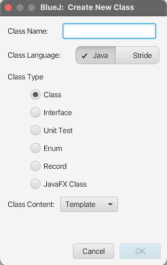

**Εικόνα 3.2.1** _Παράθυρο δημιουργίας νέας κλάσης στο BlueJ_

3. Επιλέξτε **Record**, δώστε το όνομα ```Point``` και πατήστε **OK**. Δημιουργήθηκε ένα παραλληλόγραμμο με το όνομα _Point_. Αυτό είναι το σύμβολο της κλάσης. Οι εγγραφές (records) είναι κι αυτές κλάσεις, ή πιο σωστά, συντομογραφίες κλάσεων, που μας επιτρέπουν να ορίζουμε κλάσεις γράφοντας όσο το δυνατόν λιγότερο κώδικα.


**Εικόνα 3.2.2** _Κλάση Point στο BlueJ_

4. Πατήστε διπλό κλικ πάνω στην _Point_ για να ανοίξει ο κειμενογράφος ή διορθωτής του BlueJ.

5. Επιλέξτε όλον τον κώδικα που έχει δημιουργήσει το BlueJ. Σβήστε τα κίτρινα μπλοκ κώδικα. Ο κώδικας σας θα πρέπει να μοιάζει με τον παρακάτω:

```java
/**
 * A 2D Point.
 *
 * @author ikost
 * @version 1.0
 * @param x The x coordinate
 * @param y The y coordinate
 */
public record Point(int x, int y)
{
}
```

Ό,τι βλέπετε μεταξύ ```/**``` και ```*/``` είναι σχόλια και δεν λαμβάνονται υπόψιν από τον μεταγλωττιστή της γλώσσας. Τα ```x, y``` είναι τα γνωρίσματα της κλάσης.

Το παραπάνω είναι το "καλούπι" ενός σημείου. Από αυτό μπορούμε να δημιουργήσουμε όσα σημεία, δηλ. αντικείμενα της ```Point```, θέλουμε, ως εξής:

1. Κλείστε ή ελαχιστοποιήστε το παράθυρο του κειμενογράφου.
2. Στο παράθυρο project του BlueJ, κάντε δεξί κλικ πάνω στην κλάση ```Point``` και επιλέξτε **Compile** (μεταγλώττισε). Θα δείτε το ορθογώνιο παραλληλόγραμμο της κλάσης να αλλάζει (δεν υπάρχουν οι διαγραμμίσεις) και στην μπάρα κατάστασης στο κάτω μέρος βλέπετε το μήνυμα: _Compiling...Done_. Πλέον ο μεταγλωττιστής της Java έχει μεταγλωττίσει τον πηγαίο κώδικα που γράψατε σε ενδιάμεση γλώσσα που μπορεί να εκτελέσει η εικονική μηχανή της Java (Java Virtual Machine).
3. Κάντε πάλι δεξί κλικ πάνω στην κλάση ```Point``` και επιλέξτε **new Point(int, int)**. Στο διαλογικό παράθυρο που εμφανίζεται δώστε δυο ακέραιες τιμές για τις συντεταγμένες ```x, y```, π.χ. ```0, 0``` και ένα όνομα για το αντικείμενο που θα δημιουργηθεί, π.χ. ```point1``` και πατήστε **ΟΚ**. Θα δείτε να εμφανίζεται ένα κόκκινο ορθογώνιο παραλληλόγραμμο ```point1: Point``` που δηλώνει ότι δημιουργήθηκε ένα νέο αντικείμενο ```point1``` το οποίο είναι τύπου ```Point```.

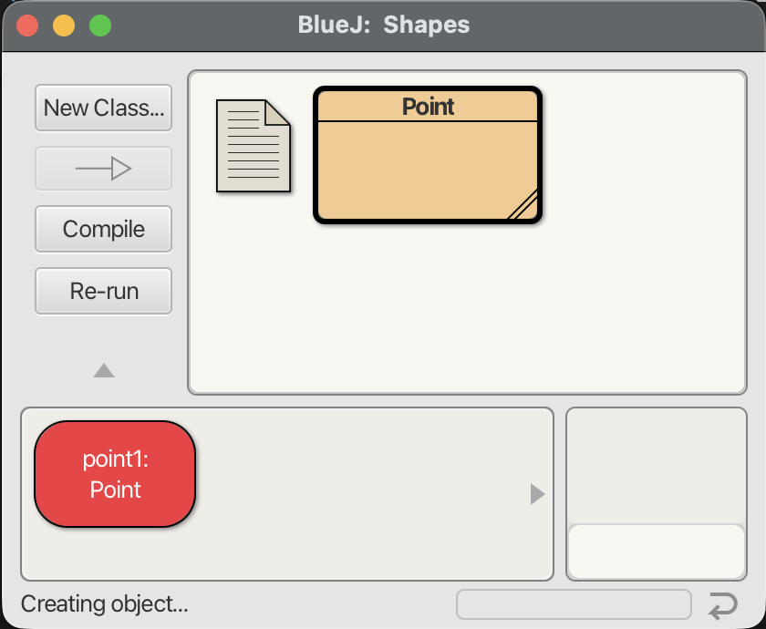

**Εικόνα 3.2.3** _Δημιουργία ενός νέου αντικειμένου από την κλάση Point στο BlueJ_

4. Κάντε δεξί κλικ στο αντικείμενο και επιλέξτε τις εντολές ```String toString(), int x(), int y()``` και δείτε τα αποτελέσματα.

Δημιουργήσαμε ένα νέο αντικείμενο της κλάσης ```Point``` καλώντας μια ειδική μέθοδο, την ```new Point(int, int)```, η οποία ονομάζεται μέθοδος κατασκευής (constructor). Αυτή κλήθηκε ως ```new Point(0, 0)``` (ή ότι άλλες τιμές δώσατε για τα ```x, y```). Οι ```String toString(), int x(), int y()``` ονομάζονται μέθοδοι και συνιστούν την συμπεριφορά του αντικειμένου. Αν και δεν φαίνονται στον κώδικα της εγγραφής που ορίσαμε, υπάρχουν από σύμβαση. Π.χ. κάθε εγγραφή διαθέτει κάποιες εξ' ορισμού μεθόδους που κληρονομεί από την κλάση ```Object```, κι αυτές είναι: η ```String toString()``` που εμφανίζει την κατάσταση του αντικειμένου σε μορφή φιλική στο χρήστη, τις ```boolean equals(Object)``` και ```int hashCode()``` που συγκρίνουν δυο αντικείμενα, και τις ```int x(), int y()``` που είναι μέθοδοι πρόσβασης στα γνωρίσματα του αντικειμένου. Όπως μάθαμε στο προηγούμενο μάθημα, λόγω της ενθυλάκωσης δεν μπορούμε να προσπελάσουμε απευθείας τις τιμές των γνωρισμάτων ```x, y``` αλλά γι' αυτό το σκοπό χρησιμοποιούμε τις αντίστοιχες μεθόδους πρόσβασης (ή getters).

Μπορείτε να δημιουργήσετε όσα αντικείμενα θέλετε. Δημιουργήστε ένα ακόμα αντικείμενο ```point2``` με συντεταγμένες ```x=5, y=10```.

Πώς θα μπορούσαμε να ορίσουμε μια ευθεία γραμμή; Μια ευθεία γραμμή αποτελείται από δυο σημεία.

Δημιουργήστε μια νέα κλάση ```Line``` όπως μάθατε προηγουμένως (μην ξεχάσετε να τη μεταγλωττίσετε):

```java
/**
 * A 2D Line.
 *
 * @author ikost
 * @version 1.0
 * @param p1 The first point of the line
 * @param p2 The second point of the line
 */
public record Line(Point p1, Point p2)
{
}
```

Δημιουργείστε μια νέα γραμμή (ένα αντικείμενο τύπου ```Line```) δίνοντάς της τα δυο σημεία ```point1, point2```  που δημιουργήσαμε προηγουμένως (κάθε φορά που κάνετε **Compile** θα πρέπει να ξαναδημιουργήσετε τα αντικείμενα).

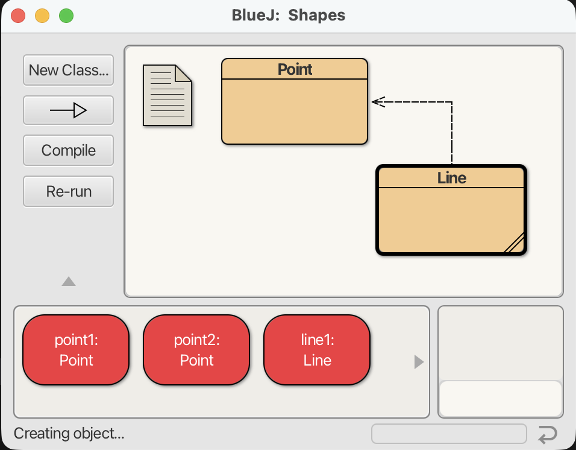

**Εικόνα 3.2.4** _Δημιουργία ενός νέου αντικειμένου τύπου ```Line``` στο BlueJ_

Παρατηρήσατε ότι δημιουργήθηκε ένα βέλος εστιγμένης γραμμής μεταξύ των δυο κλάσων. Αυτό το βέλος είναι μια _συσχέτιση (association)_ μεταξύ δυο κλάσεων. Υπάρχουν δίαφορες συσχετίσεις μεταξύ κλάσεων, όπως θα δούμε. Η συγκεκριμένη συσχέτιση ονομάζεται _εξάρτηση (dependency)_ και δηλώνει ότι η κλάση ```Line``` εξαρτάται από την κλάση ```Point``` κι αυτό διότι η ```Line``` χρησιμοποιεί την κλάση ```Point```.

Παρόμοια μπορούμε να δημιουργήσουμε και τις εγγραφές ```Circle, Rectangle```:

```java
/**
 * A Circle.
 *
 * @author ikost
 * @version 1.0
 * @param center The center point of the circle
 * @param radius The circle's radius
 */
public record Circle(Point center, int radius)
{
}
```
```java
/**
 * A 2D Rectangle.
 *
 * @author ikost
 * @version 1.0
 * @param upperLeft The upper left point of the rectangle
 * @param lowerRight The lower right point of the rectangle
 */
public record Rectangle(Point upperLeft, Point lowerRight)
{
}
```
Ένας κύκλος ορίζεται από το κέντρο και την ακτίνα του. Ένα ορθογώνιο παραλληλόγραμμο ορίζεται από δυο σημεία, το πάνω αριστερό και το κάτω δεξί.

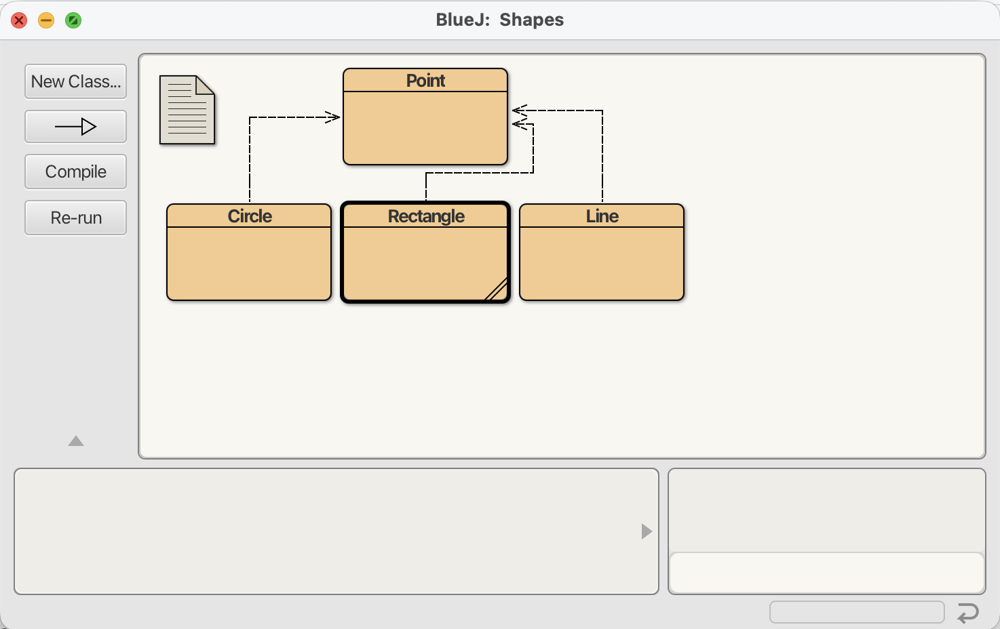

**Εικόνα 3.2.5** _Διάγραμμα κλάσεων γεωμετρικών σχημάτων στο BlueJ_

Μέσα στα άγκιστρα μπορούμε να ορίσουμε και δικές μας μεθόδους, π.χ. ορίστε μια μέθοδο που μας επιστρέφει την περιφέρεια του κύκλου στην κλάση ```Circle```:

```java
/**
 * A Circle.
 *
 * @author ikost
 * @version 1.0
 * @param center The center point of the circle
 * @param radius The circle's radius
 */
public record Circle(Point center, int radius)
{
    double circumference() {
        return 2*Math.PI*radius;
    }
}
```
Η ```Math.PI``` αντιστοιχεί στην τιμή του ```π = 3.14```.

Δημιουργήστε ένα νέο αντικείμενο ```circle1``` και υπολογίστε την περιφέρειά του:

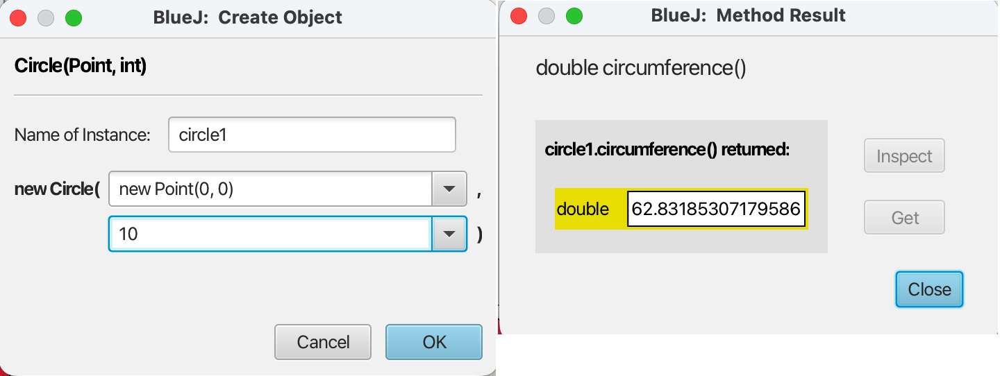

**Εικόνα 3.2.6** _Υπολογισμός περιφέρειας κύκλου στο BlueJ_

Σαν άσκηση τροποποιήστε την εγγραφή ```Rectangle``` προσθέτοντάς της μια μέθοδο που να υπολογίζει το εμβαδό του ορθογώνιου παραλληλογράμμου.

Έστω ότι θέλουμε να δημιουργήσουμε μια μέθοδο που να μπορεί να αλλάζει την τιμή της ακτίνας του κύκλου αφού ένα αντικείμενο κύκλου έχει δημιουργηθεί:

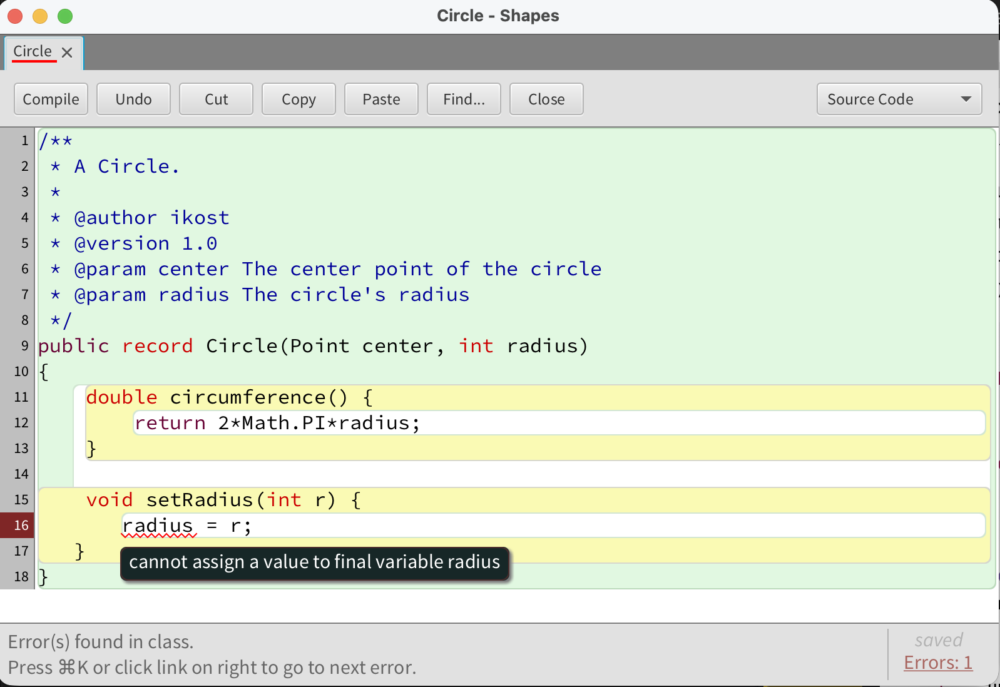

**Εικόνα 3.2.7** _Προσθήκη setter μεθόδου στην κλάση ```Circle```_

Προς έκπληξή μας δεν μας αφήνει (μας λέει ότι η ```radius``` είναι ```final```, δηλ. σταθερά). Ο τύπος εγγραφή (record) είναι μια _αμετάβλητη κλάση (immutable class)_, δηλ. δεν επιτρέπει ν' αλλάξουν οι τιμές των γνωρισμάτων της μετά τη δημιουργία των αντικειμένων της. Θα πρέπει να δημιουργήσετε έναν νέο αντικείμενο με τις νέες τιμές, σε ένα υπάρχον αντικείμενο δεν μπορούν να αλλάξουν οι αρχικές τιμές.

Επίσης, όπως είδαμε, αντικείμενα άλλων κλάσεων ή εγγραφών δεν μπορούν να προσπελάσουν τα γνωρίσματα άλλων εγγραφών καθώς αυτά είναι ```private```. Π.χ. ένα αντικείμενο τύπου ```Circle``` δεν μπορεί να προσπελάσει την τιμή του γνωρίσματος ```x``` ενός αντικειμένου τύπου ```Point```. Θα πρέπει να το προσπελάσει μόνο μέσω της αντίστοιχης μεθόδου ```x()```. Τα γνωρίσματα μιας εγγραφής είναι προσπελάσιμα από τις μεθόδους της εγγραφής, όχι όμως και εξωτερικά από την εγγραφή. Μια μέθοδος της ίδιας κλάσης μπορεί να προσπελάσει τα γνωρίσματα της κλάσης, όπως είδαμε με τη μέθοδο ```circumference()``` η οποία μπορεί να προσπελάσει την τιμή του γνωρίσματος ```radius``` (δηλ. δεν χρειάζεται να καλέσει την μέθοδο ```radius()``` αν και θα μπορούσε να το κάνει κι αυτό).

Αυτό το γνώρισμα του αντικειμενοστραφούς προγραμματισμού λέγεται _ενθυλάκωση (encapsulation)_, όπως θα δούμε σε επόμενο μάθημα, και διαφέρει σε σχέση με τον διαδικαστικό προγραμματισμό, όπου μεταβλητές και μέθοδοι είναι ανεξάρτητες. Στον αντικειμενοστραφή προγραμματισμό, οι μεταβλητές ανήκουν σε μια κλάση και μόνο αντικείμενα αυτής της κλάσης έχουν πρόσβαση στις μεταβλητές.

## Κλάσεις (Class)

Η _εγγραφή (record)_ εισήχθηκε στην Java από την έκδοση 14 και μετά. Από την αρχή της δημιουργίας της, η γλώσσα υποστηρίζει τις κλάσεις. Τα πάντα είναι κλάσεις στη Java. Ας δούμε πώς θα γράφαμε την εγγραφή ```Point``` στις εκδόσεις της Java πριν την 14.

1. Δημιουργήστε ένα νέο έργο και ονομάστε το ```Shapes-classes```.
2. Δημιουργήστε μια νέα κλάση ```Point``` αλλά αυτή τη φορά αφήστε τον τύπο ```Class```.
3. Επικολλήστε τον παρακάτω κώδικα:

```java
/**
 * A 2D Point.
 *
 * @author ikost
 * @version 1.0
 * @param x The x coordinate
 * @param y The y coordinate
 */
public class Point {
    private final int x, y;

    public Point() {
	    x=0;
	    y=0;
    }

    public Point(int x, int y) {
	    this.x = x;
	    this.y = y;
    }
	
    public int getX() {
	    return x;
    }
	
    public int getY() {
	    return y;
    }
    
    public String toString() {
        return "Point[" + "x=" + x + ", y=" + y + "]";
    }      
}
```

Όπως βλέπετε, η εγγραφή (record) μας γλυτώνει από πολύ πληκτρολόγηση! Κατ' αρχήν βλέπουμε πώς ορίζονται τα γνωρίσματα μέσα σε μια κλάση. Τα γνωρίσματα ```x, y``` ορίζονται ως ```private final```. Όπως έχουμε μάθει, η δεσμευμένη λέξη ```final``` δηλώνει ότι πρόκειται για σταθερές, δηλ. ότι η τιμή τους δεν μπορεί ν' αλλάξει. Η δεσμευμένη λέξη ```private``` είναι η αντίθετη της ```public```. Το ```public``` δηλώνει ότι το γνώρισμα είναι προσβάσιμο από οποιαδήποτε άλλη κλάση και από την Εικονική Μηχανή της Java (ΕΜ ή JVM). Το ```private``` δηλώνει ότι είναι προσβάσιμο μόνο από αντικείμενα της ίδιας κλάσης.

Οι μέθοδοι ```getX()``` και ```getY()``` είναι ίδιες με τις ```x()``` και ```y()``` της εγγραφής. Απλά παλαιότερα, η σύμβαση ήταν ότι μέθοδοι προσπέλασης των γνωρισμάτων θα πρέπει να ονομάζονται ως ```getXXX()``` όπου ```xxx``` το γνώρισμα που προσπελάζουν. Παρατηρούμε ότι αυτές οι μέθοδοι είναι ```public```.

Αλλά τι είναι οι ```Point()``` και ```Point(int x, int y)```; Καλά το μαντέψατε! Είναι οι μέθοδοι κατασκευής (constructors). Καλούνται όταν καλείται η ```new```. Παρατηρήστε πώς διαφέρουν από τις κανονικές μεθόδους επειδή έχουν το ίδιο όνομα με το όνομα της κλάσης και _δεν_ έχουν τύπο επιστροφής. Η πρώτη μέθοδος κατασκευής καλείται όταν δημιουργείτε ένα _στιγμιότυπο (instance)_ ή _αντικείμενο (object)_ της κλάσης ```Point``` χωρίς να περάσετε ορίσματα, οπότε οι τιμές των γνωρισμάτων είναι εξ' ορισμού ```x=0, y=0```.

Οι σταθερές ```x, y``` μπορούν να αρχικοποιούνται είτε κατά τη δήλωσή τους είτε μέσα στις μεθόδους κατασκευής.

Αλλά τι είναι αυτό το ```this```; Το ```this``` αναφέρεται στο αντικείμενο που δημιουργείται από την κλάση. Επειδή δεν γνωρίζουμε πώς θα το ονομάσει ο προγραμματιστής, μέσα στην κλάση αναφερόμαστε σ' αυτό με τη δεσμευμένη λέξη ```this```. Π.χ. για το παράδειγμα της ```Point``` το ```this``` μπορεί να αναφέρεται στο ```point1``` ή στο ```point2```, δηλ. σε οποιοδήποτε αντικείμενο της κλάσης. Οπότε ```this.x``` σημαίνει το γνώρισμα ```x``` του αντικειμένου. Αλλά γιατί δεν αναφερόμαστε στο γνώρισμα απλά και μόνο με το όνομά του;

Ας δούμε λίγο καλύτερα το σώμα του δεύτερου κατασκευαστή:

```java
	public Point(int x, int y) {
		this.x = x;
		this.y = y;
	}
```
Αν γράφαμε:
```java
	public Point(int x, int y) {
		x = x;
		y = y;
	}
```
τότε ο μεταγλωττιστής δεν μπορεί να καταλάβει αν αναφερόμαστε στο γνώρισμα ```x``` ή στην παράμετρο ```x```. Μάλιστα αυτό είναι ένα πολύ κοινό λάθος που γίνεται από τους προγραμματιστές κι ενώ νομίζουν ότι έχουν αλλάξει την τιμή του γνωρίσματος στην ουσία εκχωρούν στην παράμετρο ```x``` την τιμή του εαυτού της.

Ας το δούμε στην πράξη.

```java
/**
 * A 2D Point.
 *
 * @author ikost
 * @version 1.0
 * @param x The x coordinate
 * @param y The y coordinate
 */
public class Point {
    private final int x, y;

    public Point() {
	    x=0;
	    y=0;
    }

    public Point(int x, int y) {
	    x = x;
	    y = y;
    }
	
    public int getX() {
	    return x;
    }
	
    public int getY() {
	    return y;
    }
    
    public String toString() {
        return "Point[" + "x=" + x + ", y=" + y + "]";
    }      
}
```

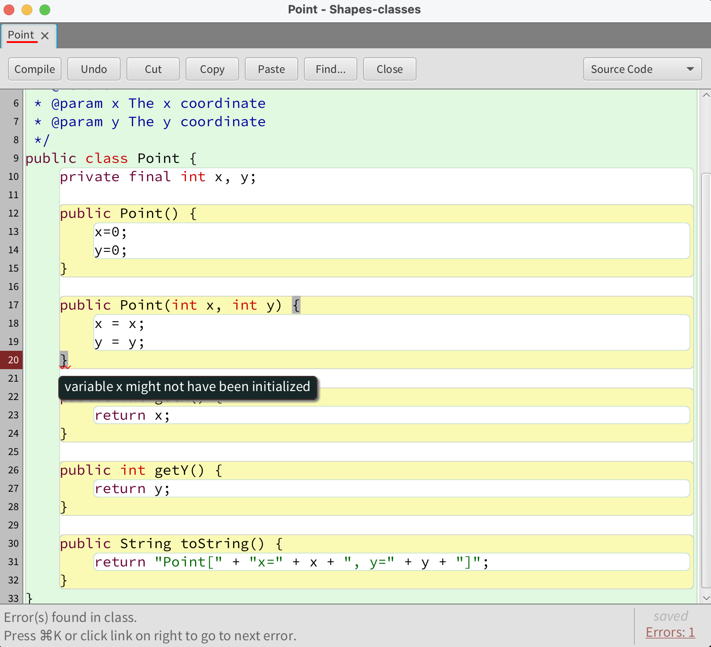

**Εικόνα 3.2.8** _Λάθος μεταγλώττισης λόγω μη αρχικοποίησης σταθερών γνωρισμάτων_

Στο συγκεκριμένο παράδειγμα ο μεταγλωττιστής μας προειδοποιεί ότι τα γνωρίσματα ```x``` και ```y``` δεν έχουν αρχικοποιηθεί επειδή είναι ```final``` και θα 'πρεπε να αρχικοποιηθούν στον κατασκευαστή. Αλλά ας πάμε ένα βήμα πιο πέρα. Ας μην τις ορίσουμε ```final```.

```java
/**
 * A 2D Point.
 *
 * @author ikost
 * @version 1.0
 * @param x The x coordinate
 * @param y The y coordinate
 */
public class Point {
    private int x, y;
...
```

Δημιουργήστε ένα νέο αντικείμενο τύπου ```Point``` χρησιμοποιώντας την μέθοδο κατασκευής δυο ορισμάτων:

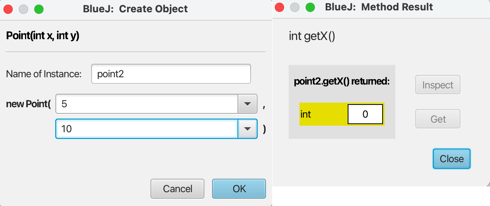

**Εικόνα 3.2.9** _Λογικό λάθος αρχικοποίησης ορισμάτων στην κλάση ```Point```_

Όπως βλέπετε τα γνωρίσματα ```x, y``` δεν αρχικοποιήθηκαν από τις τιμές των ορισμάτων που περάσαμε στην μέθοδο κατασκευής. Πολύ προσοχή λοιπόν και καλό είναι να μην ονομάζουμε τις παραμέτρους όπως και τα γνωρίσματα.

Η μέθοδος ```toString()``` επιστρέφει μια φιλική προς τον χρήστη αναπαράσταση του αντικειμένου. Αν την αφαιρέσουμε, τότε, δημιουργώντας ένα νέο αντικείμενο και καλώντας **inherited from Object -> String toString()**:

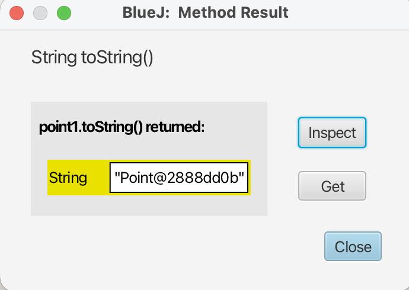

**Εικόνα 3.2.10** _Χωρίς μέθοδο ```toString()```_

Αυτό που συμβαίνει στο παρασκήνιο είναι ότι η ΕΜ της Java διαθέτει την ανάλογη μνήμη που χρειάζεται για τη δημιουργία του αντικειμένου, αναθέτει μια μοναδική ταυτότητα στο αντικείμενό μας (```Point@2888dd0b```) και εκτελεί τον κώδικα της μεθόδου κατασκευής (constructor).

Σαν άσκηση γράψτε την εγγραφή ```Circle``` που ορίσαμε πιο πάνω σαν κλάση.

Μπορούν να υπάρχουν πολλοί κατασκευαστές με το ίδιο όνομα (overloading) αλλά όχι με την ίδια υπογραφή, δηλ. θα πρέπει να περιέχουν διαφορετικό αριθμό ή/και τύπο παραμέτρων. Ένας κατασκευαστής χωρίς παραμέτρους ονομάζεται _εξ' ορισμού κατασκευαστής (default constructor)_. Σε περίπτωση που δεν δηλωθεί κατασκευαστής, δημιουργείται αυτόματα ο default (no-args) constructor (αυτό είναι ένα χαρακτηριστικό της γλώσσας).

_**Σημαντική σημείωση**: Αν δηλώσουμε έστω μια μέθοδο κατασκευής σε μια κλάση, τότε **δεν** δημιουργείται αυτόματα default constructor_.

Έτσι π.χ. αν ορίσουμε την κλάση Point χωρίς μεθόδους κατασκευής (constructors) (απαιτείται τώρα ν' αρχικοποιήσουμε τα γνωρίσματά της):

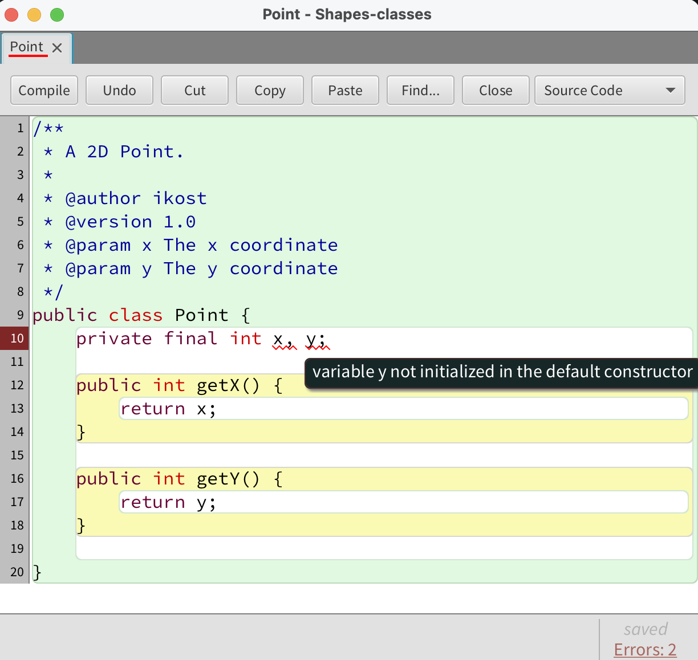

**Εικόνα 3.2.11** _Λάθος αρχικοποίησης γνωρισμάτων λόγω μη ύπαρξης constructors_

```java
/**
 * A 2D Point.
 *
 * @author ikost
 * @version 1.0
 * @param x The x coordinate
 * @param y The y coordinate
 */
public class Point {
    private final int x=0, y=0;
	
    public int getX() {
	return x;
    }
	
    public int getY() {
	return y;
    }
}
```
Η Java εισάγει κρυφά έναν default constructor χωρίς παραμέτρους. Αυτό επειδή δεν έχουμε δηλώσει άλλες μεθόδους κατασκευής. Αν όμως δηλώσουμε τουλάχιστο μια μέθοδο κατασκευής τότε δεν δημιουργείται κρυφά ένας no argument default constructor.

Ένας έξυπνος τρόπος να μειώσουμε τις πιθανές αλλαγές, κι άρα και τις πιθανότητες λάθους στον κώδικά μας, είναι η χρήση της ```this()``` (μην την μπερδέψετε με το ```this``` που είδαμε πιο πάνω)  όπως φαίνεται παρακάτω:

```java
/**
 * A 2D Point.
 *
 * @author ikost
 * @version 1.0
 * @param x The x coordinate
 * @param y The y coordinate
 */
public class Point {
    private final int x, y;

    public Point() {
        this(0, 0);
    }

    public Point(int x, int y) {
        this.x = x;
        this.y = y;
    }

    public int getX() {
        return x;
    }
    
    public int getY() {
    return y;
    }
    
    public String toString() {
        return "Point[" + "x=" + x + ", y=" + y + "]";
    }
}
```

Η σύνταξη ```this(0,0)``` στο σώμα του κατασκευαστή χωρίς παραμέτρους σημαίνει ότι καλεί τον άλλον κατασκευαστή περνώντας του ως ορίσματα τα ```0, 0```. Με αυτόν τον τρόπο μπορούμε να μειώσουμε κατά πολύ κώδικα που επαναλαμβάνεται στους διάφορους κατασκευαστές μιας κλάσης. Η τεχνική που ακολουθούμε είναι να καλούμε με την ```this()``` τον constructor με τις περισσότερες παραμέτρους που θα είναι κι αυτός που θα περιέχει την υλοποίηση. Είναι σημαντικό να σημειώσουμε εδώ ότι η ```this()``` πρέπει να είναι η πρώτη γραμμή σε μια μέθοδο κατασκευής, αλλιώς ο μεταγλωττιστής θα παραπονεθεί.

Ας δούμε ακόμα ένα παράδειγμα. Ας υποθέσουμε ότι θέλουμε να γράψουμε ένα παιχνίδι αγώνων αυτοκινήτων σε Java. Χρειαζόμαστε λοιπόν, μιαν αφαιρετική αναπαράσταση ενός αυτοκινήτου, δηλ. μια κλάση ```Car```. Τι γνωρίσματα θέλουμε να έχουμε για την κλάση αυτή (η κατάστασή του); Μας ενδιαφέρει να γνωρίζουμε το μοντέλο του (π.χ. _Tesla Model S_), την μέγιστη ταχύτητά του, τον κυβισμό του κλπ. καθώς επίσης και την ταχύτητά του κάθε στιγμή (καθώς θα τρέχει σε αγώνες).

Τι συμπεριφορά θα θέλαμε να έχει το αυτοκίνητο; Θα θέλαμε να μπορούμε να επιταχύνουμε όταν πατάμε το γκάζι και να επιβραδύνουμε όταν πατάμε το φρένο. Επίσης, να στρίβουμε.

Τα παραπάνω τα συνοψίζουμε στην ακόλουθη κλάση ```Car```:

1. Δημιουργήστε ένα νέο έργο με όνομα ```Car```.
2. Δημιουργήστε μια νέα κλάση, ονομάστε τη ```Car``` και πατήστε **OK**.
3. Διπλό κλικ πάνω στην κλάση ```Car``` ώστε να ανοίξει ο κειμενογράφος και επικολλήστε τον ακόλουθο κώδικα:

```java
/**
 * A Car.
 *
 * @author ikost
 * @version 0.1
 */
public class Car { // κλάση
  // ιδιότητες/γνωρίσματα
  private String model;
  private int maxSpeed;
  private int ccm;
  private int speed = 0;

  /**
   * Constructor.
   * 
   * @param m model
   * @param s max speed
   * @param c ccm
   */
  public Car(String m, int s, int c) {
    model = m; maxSpeed = s; ccm = c;
  }
  // ενέργειες/μέθοδοι
  public void accelerate() {
    if (speed <= maxSpeed - 10)
       speed+=10;
  }
  public void decelerate() {
    if (speed >= 10)
       speed-=10;
  }
  public int getSpeed() {
    return speed;
  }

  public String toString() {
    return "Car[" + "model=" + model + ", maxSpeed=" + maxSpeed + ", ccm=" + ccm + ", speed=" + speed + "]"; 
  }
}
```
Η κλάση ```Car``` περιέχει 4 γνωρίσματα (```model, maxSpeed, ccm, speed```), 4 μεθόδους (```accelerate(), decelerate(), getSpeed(), toString()```) και μια μέθοδο κατασκευής.

Για να δημιουργήσετε ένα νέο αντικείμενο της κλάσης ```Car```, κάντε δεξί κλικ πάνω στο εικονίδιο της ```Car``` και επιλέξτε τον constructor της κλάσης. Δώστε τις παρακάτω τιμές στο διαλογικό παράθυρο που εμφανίζεται:

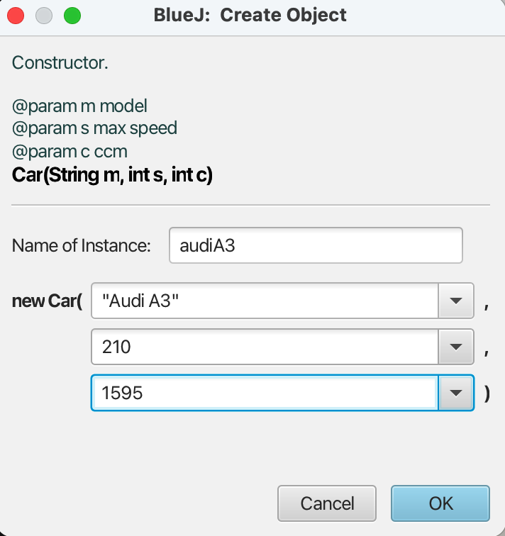

**Εικόνα 3.2.12** _Δημιουργία νέου αντικειμένου κλάσης ```Car``` στο BlueJ_

Ποιά μέθοδο πρέπει να καλέσετε για να δείτε την τρέχουσα ταχύτητά του; Πόση είναι αυτή; Στη συνέχεια καλέστε τη μέθοδο ```accelerate()```. Πόση είναι τώρα η ταχύτητα του αυτοκινήτου;

Το BlueJ σας δίνει επίσης τη δυνατότητα να δημιουργήσετε αντικείμενα από κλάσεις που δεν είναι μέρος του έργου σας αλλά μέρος της βιβλιοθήκης της Java.

Από το μενού **Tools –> Use Library Class...** θα εμφανιστεί ένα διαλογικό παράθυρο παροτρύνοντας σας να εισάγετε ένα πλήρως κατάλληλο όνομα κλάσης, όπως π.χ. ```java.lang.String```. Μόλις εισαχθεί ένα όνομα κλάσης, πατώντας **Enter** θα παρουσιάσει όλες τις μεθόδους κατασκευής και τις στατικές μεθόδους (θα μάθουμε τι είναι οι στατικές μέθοδοι σε επόμενο μάθημα) εκείνης της κλάσης σε έναν κατάλογο στο διαλογικό παράθυρο. Οποιοιδήποτε από αυτές τις μεθόδους κατασκευής ή στατικές μεθόδους μπορούν να κληθούν επιλέγοντας τους από αυτόν τον κατάλογο. Η επίκληση (invocation) προχωρά όπως και με κάθε άλλη μέθοδο κατασκευής ή κλήση μεθόδου.

Σαν άσκηση δημιουργήστε ένα αντικείμενο της ```java.util.Random```. Η ```Random``` είναι μια γεννήτρια τυχαίων αριθμών. Αφού δημιουργήσετε ένα αντικείμενο της κλάσης, στη συνέχεια κάντε δεξί κλικ πάνω του και καλέστε τη μέθοδο ```nextInt()```. Θα εμφανιστεί ένα διαλογικό παράθυρο με τον τυχαίο ακέραιο αριθμό που "γέννησε" η μέθοδος.

Με το BlueJ μπορούμε πολύ εύκολα να δημιουργήσουμε ένα εκτελέσιμο ```.jar``` αρχείο ως εξής:

1. Επιλέξτε το μενού **Project -> Create Jar File...** 
2. Από το αναδυόμενο παράθυρο επιλέξτε ως _Main class_ την κλάση που περιέχει την ```main()``` μέθοδο
3. Αποεπιλέξτε τα τσεκαρισμένα πεδία _Include source_ και _Include Blue project files_ και πατήστε **Continue**. Θα εμφανιστεί ένα διαλογικό παράθυρο που θα σας ζητήσει το όνομα του ```.jar``` αρχείου που πρόκειται να δημιουργηθεί καθώς και τον φάκελο στον οποίο θέλετε να δημιουργηθεί και πατήστε **Save**.

## Διεπαφές (Interface)
Η _διεπαφή (interface)_ είναι ένα είδος κλάσης που περιέχει όμως μόνο σκελετούς μεθόδων (δηλ. χωρίς υλοποίηση) ή/και σταθερές. Στο έργο ```Shapes``` δημιουργήστε μια νέα κλάση ```Shape``` και επιλέξτε ```Interface``` ως τύπο κλάσης. Στη συνέχεια επικολήστε τον ακόλουθο κώδικα στον κειμενογράφο της διεπαφής: 

```java
/**
 * A 2D Shape.
 *
 * @author ikost
 * @version 0.1
 */
public interface Shape
{
    /**
     * @return the number of edges
     */
    int edges();
    
    /**
     * @return the shape's are
     */
    double area();

    /**
     * @return the shape's perimeter
     */
    double perimeter();
}
```
Βλέπουμε ότι η παραπάνω διεπαφή περιέχει 3 αφηρημένες (abstract) μεθόδους που δεν περιέχουν υλοποίηση, δηλ. βλέπουμε μόνο τους ορισμούς των μεθόδων. Η υλοποίηση των μεθόδων γίνεται σε άλλες κλάσεις.

Δεν μπορούμε να δημιουργήσουμε απευθείας αντικείμενα μιας διεπαφής (εκτός κι αν παρέχουμε υλοποιήσεις όλων των μεθόδων της). Θα μιλήσουμε αναλυτικά για διεπαφές σε επόμενο μάθημα.

## Απαριθμημένοι Τύποι (Enum)
Οι _απαριθμημένοι τύποι (enums)_ είναι ένα σταθερό πλήθος από σταθερές. Ο ```enum``` στην Java είναι κι αυτός ένα είδος κλάσης. Στο έργο ```Car``` πάμε να δημιουργήσουμε έναν νέο ```enum``` με όνομα ```EngineType```.

```java
/**
 * EngineType.
 * 
 * @author ikost
 * @version 1.0
 */
public enum EngineType
{
    BENZINE, DIEZEL, ELECTRIC, HYBRID
}
```
 Ας προσθέσουμε ένα νέο γνώρισμα τύπου ```EngineType``` στην κλάση ```Car```:
```java
/**
 * A Car.
 *
 * @author ikost
 * @version 0.2
 */
public class Car { // κλάση
  // ιδιότητες/γνωρίσματα
  private String model;
  private int maxSpeed;
  private int ccm;
  private int speed = 0;
  private EngineType engineType;

  /**
   * Constructor.
   * 
   * @param m model
   * @param s max speed
   * @param c ccm
   * @param et engineType
   */
  public Car(String m, int s, int c, EngineType et) {
    model = m; maxSpeed = s; ccm = c; engineType = et;
  }
  // ενέργειες/μέθοδοι
  public void accelerate() {
     if (speed <= maxSpeed - 10)
        speed+=10;
  }
  public void decelerate() {
     if (speed >= 10)
        speed-=10;
  }
  public int getSpeed() {
      return speed;
  }
  public String toString() {
     return "Car[" + "model=" + model + ", maxSpeed=" + maxSpeed + ", ccm=" + ccm + ", engineType=" + engineType + ", speed=" + speed + "]"; 
  }
}
```

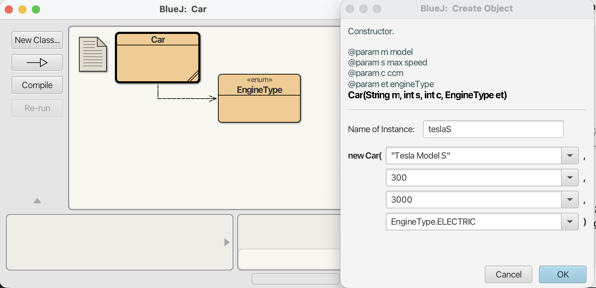

**Εικόνα 3.2.13** _Δημιουργία γνωρίσματος τύπου enum ```EngineType``` στην κλάση ```Car```_

## Περίληψη

Σε αυτήν την ενότητα εξερευνήσαμε  τα βασικά στοιχεία των _κλάσεων (classes)_ και των _αντικειμένων (objects)_. Μάθαμε ότι τα αντικείμενα καθορίζονται από κλάσεις. Οι κλάσεις αντιπροσωπεύουν τη γενική έννοια των πραγμάτων, ενώ τα αντικείμενα αντιπροσωπεύουν συγκεκριμένες περιπτώσεις μιας κλάσης. Μπορούμε να έχουμε πολλά αντικείμενα μιας κλάσης.

Τα αντικείμενα έχουν _μεθόδους (methods)_ που χρησιμοποιούμε για να επικοινωνήσουμε μαζί τους. Μπορούμε να χρησιμοποιήσουμε μια μέθοδο για να κάνουμε μια αλλαγή στο αντικείμενο ή για λήψη πληροφοριών από το αντικείμενο. Οι μέθοδοι μπορεί να έχουν παραμέτρους και
οι παράμετροι έχουν τύπους. Οι μέθοδοι έχουν τύπους επιστροφής, οι οποίοι καθορίζουν τον τύπο δεδομένων που επιστρέφουν. Εάν ο τύπος επιστροφής είναι ```void```, δεν επιστρέφουν τίποτα.

Τα αντικείμενα αποθηκεύουν δεδομένα σε _πεδία ή γνωρίσματα (fields)_ (τα οποία έχουν και αυτά τύπους, π.χ. ```int, String```). Όλες οι τιμές δεδομένων ενός αντικειμένου μαζί αναφέρεται ως η _κατάσταση (state)_ του αντικειμένου.

Τα αντικείμενα δημιουργούνται από ορισμούς κλάσεων που έχουν γραφτεί σε μια συγκεκριμένη γλώσσα προγραμματισμού. Μεγάλο μέρος του προγραμματισμού στη Java αφορά την εκμάθηση της σύνταξης ορισμών κλάσεων. Ένα μεγάλο πρόγραμμα Java θα έχει πολλές κλάσεις, η καθεμία με πολλές μεθόδους που καλούν η μία την άλλη με πολλούς διαφορετικούς τρόπους.

Για να μάθουμε να αναπτύσσουμε αντικειμενοστραφή προγράμματα σε Java, πρέπει να μάθουμε πώς να γράφουμε ορισμούς κλάσεων, συμπεριλαμβανομένων των πεδίων και μεθόδων, και πώς να συνδυάσουμε αυτές τις κλάσεις. Οι υπόλοιπες ενότητες αυτού του μαθήματος πραγματεύονται αυτά τα ζητήματα.

---

[🏠](https://jkost.github.io) | [⬆️](../../README.md) | [◀️](../3.1-Intro2BlueJ/README.md) | [▶️](../3.3-OOProperties/README.md)

---