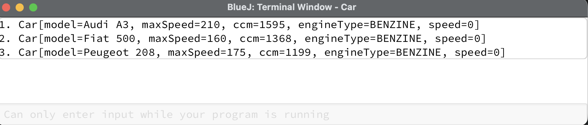

# 3.3 Στατικότητα
© Γιάννης Κωστάρας

---

[🏠](https://jkost.github.io) | [⬆️](../../README.md) | [◀️](../3.2-Intro2OOPWithBlueJ/README.md) | [▶️](../3.4-Encapsulation/README.md)

---

### Μαθησιακοί στόχοι
Σε αυτήν την ενότητα θα:

* μάθουμε για την στατικότητα (static)

Στο πρώτο μάθημα αυτής της βδομάδας κάναμε μια εισαγωγή στον αντικειμενοστραφή προγραμματισμό και μάθαμε για τις τέσσερις βασικές ιδιότητες που τον χαρακτηρίζουν. Σε αυτό το μάθημα θα μάθουμε για ένα άλλο χαρακτηριστικό των αντικειμενοστραφών προγραμμάτων, την στατικότητα, που παρόλο δεν ανήκει στις τέσσερις βασικές ιδιότητες είναι εξίσου σημαντική.

## Στατικότητα

### Στατικά γνωρίσματα (Static attributes)

Πολλές φορές υπάρχουν δεδομένα (γνωρίσματα) που είναι τα ίδια για όλα τα αντικείμενα μιας κλάσης. Π.χ. όλα τα αυτοκίνητα έχουν 4 ρόδες, ο μέγιστος αριθμός ημερών αδείας για όλους τους υπαλλήλους κλπ. Αυτά τα γνωρίσματα ονομάζονται _στατικά_ (_static_). Τα στατικά δεδομένα (static) περιγράφουν πληροφορίες που ισχύουν για _όλα_ τα αντικείμενα της κλάσης από την οποία προέρχονται, ανήκουν δηλ. στην κλάση και όχι στο αντικείμενο. Ονομάζονται και _class data_.

Τα στατικά γνωρίσματα αρχικοποιούνται μόνο μία φορά, στην αρχή της εκτέλεσης του προγράμματος και πριν την δημιουργία οποιουδήποτε αντικειμένου της κλάσης. Ένα αντίγραφό τους κατανέμεται σε όλα τα αντικείμενα (στιγμιότυπα) της κλάσης. Μπορούμε να έχουμε πρόσβαση σε ένα στατικό γνώρισμα απευθείας ως εξής: ```<class-name>.<attribute-name>```:

Π.χ.

```java
public class Car { // κλάση
  // ιδιότητες/γνωρίσματα
  public static final int WHEELS = 4;
  // ...
}
```

Στο πιο πάνω παράδειγμα ορίσαμε μια στατική μεταβλητή τύπου ```int``` η οποία τυχαίνει να είναι και ```final```, δηλ. η τιμή της δεν μπορεί ν' αλλάξει. Ορίσαμε δηλ. μια καθολική σταθερά. Ανάθεση στις ```final``` μεταβλητές μπορεί να γίνει μόνο μία φορά, είτε κατά τη δήλωσή τους είτε στις μεθόδους κατασκευής (constructors) για μη στατικές σταθερές, είτε σε ένα ```static``` μπλοκ για τις στατικές σταθερές όπως θα δούμε στη συνέχεια. Μπορούμε φυσικά να έχουμε και μη ```final``` στατικές μεταβλητές που η τιμή τους μπορεί ν' αλλάξει κατά την εκτέλεση του προγράμματος.

Μπορούμε να προσπελάσουμε αυτή τη σταθερά ως εξής: ```Car.WHEELS```. Η τιμή του γνωρίσματος αυτού είναι η ίδια για όλα τα αντικείμενα της κλάσης ```Car```.

Ας δούμε ένα παράδειγμα. Ας υποθέσουμε ότι θα θέλαμε να δώσουμε έναν μοναδικό αύξοντα αριθμό για κάθε αυτοκίνητο που δημιουργούμε. Έστω π.χ. ότι δημιουργούμε 3 αυτοκίνητα, ένα Audi A3 (με αύξοντα αριθμό ```1```), ένα Fiat 500 (με αύξοντα αριθμό ```2```) κι ένα Peugeot 208 (με αύξοντα αριθμό ```3```). Πώς θα το καταφέρουμε αυτό;

```Java
/**
 * A Car.
 *
 * @author ikost
 * @version 0.3
 */
public class Car { // κλάση
  // ιδιότητες/γνωρίσματα
  public static final int WHEELS = 4;
  private static int counter = 0;
  private String model;
  private int maxSpeed;
  private int ccm;
  private int speed = 0;
  private EngineType engineType;

  /**
   * Constructor.
   * 
   * @param m model
   * @param s max speed
   * @param c ccm
   * @param et engineType
   */
  public Car(String m, int s, int c, EngineType et) {
    ++counter;
    model = m; maxSpeed = s; ccm = c; engineType = et;
  }
  // ενέργειες/μέθοδοι
  public void accelerate() {
     if (speed <= maxSpeed - 10)
        speed+=10;
  }
  public void decelerate() {
     if (speed >= 10)
        speed-=10;
  }
  public int getSpeed() {
      return speed;
  }
  public String toString() {
     return "Car[" + "model=" + model + ", maxSpeed=" + maxSpeed + ", ccm=" + ccm + ", engineType=" + engineType + ", speed=" + speed + "]"; 
  }
}
```

### Στατικές μέθοδοι (Static methods)

Αντίστοιχα με τα στατικά γνωρίσματα, υπάρχουν και στατικές μέθοδοι. Ισχύουν για όλα τα αντικείμενα της κλάσης και ονομάζονται και _class methods_.

Οι στατικές μέθοδοι μπορούν να έχουν πρόσβαση ΜΟΝΟ σε στατικά δεδομένα ενώ μπορούν να καλέσουν ΜΟΝΟ άλλες στατικές μεθόδους. Όπως και με τα στατικά γνωρίσματα, για να καλέσουμε μια στατική μέθοδο αρκεί η σύνταξη: ```<class-name>.<method-name>```. Πιο γνωστό παράδειγμα μιας στατικής μεθόδου είναι η ```public static void main()```. Αυτή δίνει την δυνατότητα στο περιβάλλον της ΕΜ Java (JVM) να καλέσει την μέθοδο ```main()``` και να ξεκινήσει την εκτέλεση του προγράμματος χωρίς να είναι απαραίτητο να δημιουργηθεί πρώτα ένα αντικείμενο της κλάσης.

Η ```println()``` είναι μια στατική μέθοδος. Παρατηρήστε ότι δεν απαιτείται να δημιουργήσουμε ένα αντικείμενο της ```System.out``` για να την καλέσουμε.

Ας δημιουργήσουμε μια στατική μέθοδο στην κλάση ```Car``` που να μας επιστρέφει τον αύξοντα αριθμό του αυτοκινήτου.


```Java
/**
 * A Car.
 *
 * @author ikost
 * @version 0.4
 */
public class Car { // κλάση
  // ιδιότητες/γνωρίσματα
  public static final int WHEELS = 4;
  private static int counter = 0;
  private String model;
  private int maxSpeed;
  private int ccm;
  private int speed = 0;
  private EngineType engineType;

  /**
   * Constructor.
   * 
   * @param m model
   * @param s max speed
   * @param c ccm
   * @param et engineType
   */
  public Car(String m, int s, int c, EngineType et) {
    ++counter;
    model = m; maxSpeed = s; ccm = c; engineType = et;
  }
  // ενέργειες/μέθοδοι
  public void accelerate() {
     if (speed <= maxSpeed - 10)
        speed+=10;
  }
  
  public void decelerate() {
     if (speed >= 10)
        speed-=10;
  }
  
  public int getSpeed() {
      return speed;
  }
    
  public static int getCounter() {
     return counter;   
  }
  
  public String toString() {
     return "Car[" + "model=" + model + ", maxSpeed=" + maxSpeed + ", ccm=" + ccm + ", engineType=" + engineType + ", speed=" + speed + "]"; 
  }
  
    public static void main(String... args) {
      Car audiA3 = new Car("Audi A3", 210, 1595, EngineType.BENZINE);
      System.out.println(audiA3.counter + ". " + audiA3);
      Car fiat500 = new Car("Fiat 500", 160, 1368, EngineType.BENZINE);
      System.out.println(fiat500.counter + ". " + fiat500);
      Car peugeot208 = new Car("Peugeot 208", 175, 1199, EngineType.BENZINE);
      System.out.println(Car.counter + ". " + peugeot208);      
  }
}
```

Ένα αντικείμενο μπορεί να καλέσει μια στατική μέθοδο αλλά το σωστό είναι να καλούμε μια στατική μέθοδο από την κλάση (δηλ. ```Car.getCounter()```).

Επίσης, προσθέσαμε και μια στατική μέθοδο ονόματι ```main()```. Η ```main()``` είναι πολύ σημαντική μέθοδος γιατί, όπως είπαμε, αποτελεί το σημείο εκκίνησης εκτέλεσης του προγράμματός μας. Όταν μια κλάση περιέχει μια μέθοδο ```main()``` αυτό σημαίνει ότι μπορεί να εκτελεστεί από το περιβάλλον της ΕΜ. Στη ```main()``` ορίζουμε και αρχικοποιούμε 3 αντικείμενα αυτοκινήτων και τα εμφανίζουμε στην οθόνη με την εντολή ```System.out.println()```.

Παρατηρήστε ότι ενώ τις δυο πρώτες φορές καλούμε την ```counter``` από τα αντικείμενα, την τρίτη φορά την καλούμε απευθείας από την κλάση (```Car.counter```) που είναι και το πιο σωστό. Πάντα να καλείτε ένα στατικό γνώρισμα από την κλάση κι όχι από το αντικείμενο.

Κάντε δεξί κλικ πάνω στη κλάση ```Car``` και επιλέξτε τη μέθοδο ```void main(String... args)``` και στο διαλογικό παράθυρο που εμφανίζεται απλά πατήστε **OK**. Το αποτέλεσμα της εκτέλεσης φαίνεται στην παρακάτω εικόνα:



**Εικόνα 1** _Αποτέλεσμα της εκτέλεσης της μεθόδου ```main()```_

Ένα άλλο παράδειγμα στατικής μεθόδου θα μπορούσε να είναι μια εναλλακτική μέθοδος κατασκευής (alternative constructor) για την εγγραφή ```Point```:

```Java
public record Point(int x, int y) { 
	public static Point of(int x, int y) {
		return new Point(x, y);
	}
}
```

Ισχύουν οι εξής κανόνες:

* μια στατική μέθοδος (static method) μπορεί να προσπελάσει ένα στατικό γνώρισμα (static attribute)
* μια μη στατική μέθοδος (instance method) μπορεί να προσπελάσει ένα στατικό γνώρισμα (static attribute)
* αντιθέτως, μια στατική μέθοδος (static method) _δεν_ μπορεί να προσπελάσει ένα μη στατικό γνώρισμα (instance attribute)

Ας δούμε ένα παράδειγμα:


```Java
public class StaticExample {
	private int var1;
	private static int var2;
	public void method1() { }
	public static void method2() {} 
   
	public static void main( String args[]) {
		// Error: var1 is NOT static
		var1 = 1;
		// OK var2 is static
		var2 = 2;
		// Error: method1() is NOT static
		method1();
		// OK method2() is static
		method2();
        new StaticExample().anInstanceMethod();
	}
    
    public void anInstanceMethod() {
        var1 = 11;  // OK
        var2 = 12;  // OK
        method1();  // OK
        method2();  // OK
    }
}
|  Error:
|  non-static variable var1 cannot be referenced from a static context
|  		var1 = 1;
|    ^--^
|  Error:
|  non-static method method1() cannot be referenced from a static context
|  		method1();
|    ^-----^
```

## Περίληψη
Σε αυτό το μάθημα μάθαμε για τα στατικά γνωρίσματα και τις στατικές μεθόδους. Στο επόμενο μάθημα θα μάθουμε για την 2η ιδιότητα, την ενθυλάκωση.

---

[🏠](https://jkost.github.io) | [⬆️](../../README.md) | [◀️](../3.2-Intro2OOPWithBlueJ/README.md) | [▶️](../3.4-Encapsulation/README.md)

---