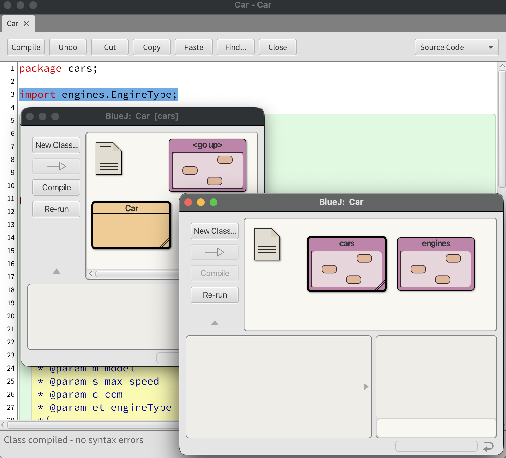

# 3.4 Ενθυλάκωση
© Γιάννης Κωστάρας

---

[🏠](https://jkost.github.io) | [⬆️](../../README.md) | [◀️](../3.3-Static/README.md) | [▶️](../3.5-Inheritance/README.md)

---

### Μαθησιακοί στόχοι
Σε αυτήν την ενότητα θα μάθουμε:

* πώς υλοποιείται η ενθυλάκωση στη Java
* για τα πακέτα/βιβλιοθήκες (packages)

Δεν θα μιλήσουμε για Εμφωλευμένες (nested) ή εσωτερικές κλάσεις (Inner Classes) που είναι άλλος ένας τρόπος ενθυλάκωσης.

## Ενθυλάκωση (Encapsulation)

Μιλήσαμε για την ενθυλάκωση στο 1ο μάθημα αυτής της εβδομάδας.

Ας δούμε πώς εφαρμόσαμε την ενθυλάκωση στην κλάση ```Car```:
  
```java
/**
 * A Car.
 *
 * @author ikost
 * @version 0.5
 */
public class Car { // κλάση
  // ιδιότητες/γνωρίσματα
  public static final int WHEELS = 4;
  private static int counter = 0;
  private String model;
  private int maxSpeed;
  private int ccm;
  private int speed = 0;
  private EngineType engineType;

  /**
   * Constructor.
   * 
   * @param m model
   * @param s max speed
   * @param c ccm
   * @param et engineType
   */
  public Car(String m, int s, int c, EngineType et) {
    ++counter;
    model = m; maxSpeed = s; ccm = c; engineType = et;
  }
  // ενέργειες/μέθοδοι
  public void accelerate() {
     if (speed <= maxSpeed - 10)
        speed+=10;
  }
  
  public void decelerate() {
     if (speed >= 10)
        speed-=10;
  }
  
  public int getMaxSpeed() {
      return maxSpeed;
  }
  
  public int getSpeed() {
      return speed;
  }
  
  public int getCcm() {
      return ccm;
  }
  
  public String getModel() {
      return model;
  }
  
  public EngineType getEngineType() {
      return engineType;
  }
    
  public static int getCounter() {
     return counter;   
  }
  
  public String toString() {
     return "Car[" + "model=" + model + ", maxSpeed=" + maxSpeed + ", ccm=" + ccm + ", engineType=" + engineType + ", speed=" + speed + "]"; 
  }
  
    public static void main(String... args) {
      Car audiA3 = new Car("Audi A3", 210, 1595, EngineType.BENZINE);
      System.out.println(audiA3.counter + ". " + audiA3);
      Car fiat500 = new Car("Fiat 500", 160, 1368, EngineType.BENZINE);
      System.out.println(fiat500.counter + ". " + fiat500);
      Car peugeot208 = new Car("Peugeot 208", 175, 1199, EngineType.BENZINE);
      System.out.println(Car.counter + ". " + peugeot208);      
  }
}
```

Έχουμε ενθυλακώσει τα γνωρίσματα της κλάσης ορίζοντάς τα ως ```private```, που σημαίνει ότι είναι προσβάσιμα μόνο από αντικείμενα της κλάσης ```Car```, και την κλάση και τις μεθόδους της ως ```public``` πράγμα που σημαίνει ότι είναι προσβάσιμες από οποιαδήποτε άλλη κλάση του προγράμματος.

Έτσι δεν μπορούμε να καλέσουμε το γνώρισμα ```speed``` της κλάσης ```Car``` καθώς η πρόσβαση σ' αυτό έχει οριστεί ως ```private```. Θα πρέπει να χρησιμοποιήσουμε την αντίστοιχη μέθοδο ```get``` για να προσπελάσουμε το γνώρισμα. Το γνώρισμα έχει πλέον ενθυλακωθεί στην κλάση και δεν είναι προσβάσιμο πέραν των αντικειμένων της κλάσης.

Είναι καλή τακτική να περιορίζετε όσο γίνεται την πρόσβαση στα γνωρίσματα, τις μεθόδους και τις κλάσεις. Π.χ. αν γνωρίζετε ότι μια μέθοδος θα καλείται μόνο μέσα από την κλάση, τότε καλό είναι να την ορίσετε ως ```private```. Μια κλάση που θα καλείται μόνο από κλάσεις από το ίδιο πακέτο στο οποίο ανήκει, καλό είναι να ορίζεται με τον εξ' ορισμού τροποποιητή (δηλ. ```package```).

**Προσοχή!** _Δεν υπάρχει τροποποιητής ```package``` στην Java. Απλά δεν γράφετε κανέναν τροποποιητή πριν από την κλάση ή γνώρισμα ή μέθοδο._

## Πακέτα ή Βιβλιοθήκες (packages)
Μπορούμε να ομαδοποιήσουμε τις κλάσεις σε βιβλιοθήκες ή πακέτα (packages). Αρκεί να χρησιμοποιήσουμε την λέξη-κλειδί ```package``` μαζί με το όνομα της βιβλιοθήκης, στην αρχή κάθε αρχείου, το οποίο θέλουμε να εντάξουμε στην βιβλιοθήκη.

Στο έργο ```Car```, δημιουργήστε δυο νέες βιβλιοθήκες, ```cars``` και ```engines```, από το μενού **Edit -> New Package**. Στη συνέχεια, ανοίξτε την κλάση ```Engine``` και στο άνω μέρος εισάγετε τη γραμμή:

```java
package engines;
```
Το BlueJ θα σας εμφανίσει ένα μήνυμα αν θέλετε να μεταφέρετε τον απαριθμημένο τύπο ```Engine``` στο package ```engines```. Πατήστε **Move**. Επαναλάβετε για την κλάση ```Car```:

```java
package cars;
```
Θα παρατηρήσετε ότι εμφανίστηκε ένα λάθος. Η ```Car ``` δεν μπορεί πλέον να βρει την κλάση ```Engine```. Κι αυτό γιατί οι κλάσεις ```Car``` και ```Engine``` δεν είναι πλέον στην ίδια βιβλιοθήκη. Για να το διορθώσουμε, εισάγετε την ακόλουθη γραμμή κάτω από την πρώτη που προσθέσατε παραπάνω:

```java
import engines.EngineType;
```
Αν η κλάση που θέλουμε να χρησιμοποιήσουμε ανήκει σε κάποια άλλη βιβλιοθήκη, τότε μπορούμε να την εισάγουμε με την εντολή ```import```. Εναλλακτικά θα μπορούσαμε να γράψουμε το πλήρες όνομα της κλάσης που θέλουμε να προσπελάσουμε, π.χ. ```private engines.EngineType engineType;```. Αν μια βιβλιοθήκη περιέχει πολλές κλάσεις, τότε μπορείτε να εισάγετε όσες από αυτές χρειάζεστε με τον μεταχαρακτήρα ```*```, π.χ. ```import engines.*;```.

Πλέον μόνο ότι έχετε δηλώσει ως ```public``` είναι προσβάσιμο εκτός της βιβλιοθήκης. Ο εξ' ορισμού τροποποιητής πρόσβασης (```package```) επιτρέπει σε κλάσεις της βιβλιοθήκης να έχουν πρόσβαση σε άλλες κλάσεις της ίδιας βιβλιοθήκης αλλά όχι σε κλάσεις άλλων βιβλιοθηκών.


**Figure 1** _Δημιουργία βιβλιοθηκών (packages) java στο BlueJ_

Κανονικά, το BlueJ θα έπρεπε να δημιουργήσει και μια σχέση εξάρτησης από τη βιβλιοθήκη ```cars``` στη βιβλιοθήκη ```engines```.

Ο βασικός λόγος της εισαγωγής βιβλιοθηκών στην Java, μέσα στον πηγαίο κώδικα, οφείλεται στην ανάγκη διαχείρισης της ονοματολογίας (name spaces) για την αποφυγή συγκρούσεων (name clashes). Π.χ. τι θα συνέβαινε αν ορίζαμε δυο κλάσεις ```Util``` ή υπήρχε μια κλάση ```Util``` μέσα σε μια εξωτερική βιβλιοθήκη (```jar```) που χρησιμοποιούμε στο πρόγραμμά μας;

Τα ονόματα των βιβλιοθηκών ακολουθούν συνήθως την ονοματολογία των πεδίων διαδικτύου (internet domains) τα οποία θεωρούνται μοναδικά, π.χ.
```java
gr.mycompany.app
gr.mycompany.app.model
gr.mycompany.app.view
gr.mycompany.app.controller
gr.mycompany.app.utils
```

Με τη χρήση στατικής εισαγωγής (static import) μπορούμε να κάνουμε χρήση των στατικών πεδίων μιας κλάσης, χωρίς να χρησιμοποιούμε το όνομα της κλάσης στην οποία ανήκουν. Μπορούμε να εισάγουμε τα στατικά μέλη μιας κλάσης χρησιμοποιώντας την ```import static```. Π.χ. 

```java
import static cars.Car.WHEELS;
```

Για εξοικονόμηση χώρου, οι βιβλιοθήκες προγραμμάτων Java αποθηκεύονται σε αρχεία τύπου ```.jar``` (Java Archive). Με το BlueJ μπορούμε πολύ εύκολα να δημιουργήσουμε ένα εκτελέσιμο ```.jar``` αρχείο ως εξής:

1. Επιλέξτε το μενού **Project -> Create Jar File...** 
2. Από το αναδυόμενο παράθυρο επιλέξτε ως _Main class_ την κλάση που περιέχει την ```main()``` μέθοδο
3. Αποεπιλέξτε τα τσεκαρισμένα πεδία _Include source_ και _Include Blue project files_ και πατήστε **Continue**. Θα εμφανιστεί ένα διαλογικό παράθυρο που θα σας ζητήσει το όνομα του ```.jar``` αρχείου που πρόκειται να δημιουργηθεί καθώς και τον φάκελο στον οποίο θέλετε να δημιουργηθεί και πατήστε **Save**.

## Περίληψη
Σε αυτό το μάθημα μάθαμε για το πώς η Java ικανοποιεί την ιδιότητα _ενθυλάκωση (encapsulation)_ του αντικειμενοστραφούς προγραμματισμού. Μάθαμε για τους τροποποιητές πρόσβασης (```public, package, private```) (και θα μάθουμε για ακόμα έναν, τον ```protected``` στο επόμενο μάθημα) που δουλεύουν σε επίπεδο κλάσεων, γνωρισμάτων και μεθόδων. Μάθαμε επίσης πώς να δημιουργούμε βιβλιοθήκες (packages) ώστε να ομαδοποιούμε παρόμοιες κλάσεις μεταξύ τους. Η Java παρέχει κι άλλους τρόπους ενθυλάκωσης, όπως π.χ. τα αρθρώματα (modules) τα οποία όμως ξεφεύγουν από ένα εισαγωγικό μάθημα. 

Στο επόμενο μάθημα θα μάθουμε για το τρίτο χαρακτηριστικό του αντικειμενοστραφούς προγραμματισμού, την κληρονομικότητα.

---

[🏠](https://jkost.github.io) | [⬆️](../../README.md) | [◀️](../3.3-Static/README.md) | [▶️](../3.5-Inheritance/README.md)

---