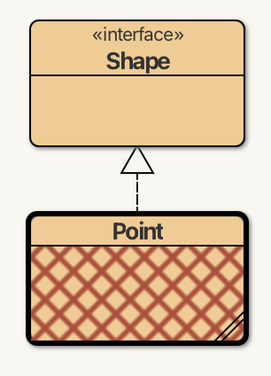
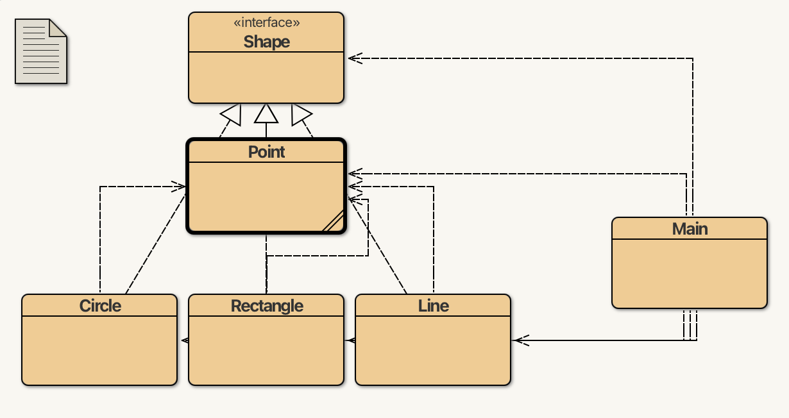
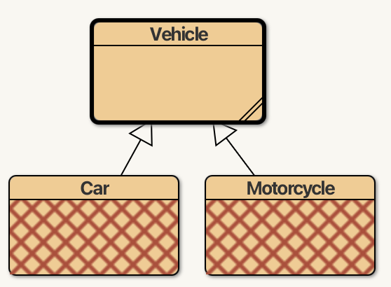

# 3.5 Κληρονομικότητα {#Java} 
© Γιάννης Κωστάρας

---

[🏠](https://jkost.github.io) | [⬆️](../../README.md) | [◀️](../3.4-Encapsulation/README.md) | [▶️](../3.6-Polymorphism/README.md)

---

### Μαθησιακοί στόχοι
Σε αυτήν την ενότητα θα μάθουμε:

* τι είναι η κληρονομικότητα (inheritance) στον αντικειμενοστραφή προγραμματισμό
* για τις αφαιρετικές κλάσεις (abstract classes)
* για τις σφραγισμένες κλάσεις (sealed classes)
* για την κλάση ```Object```
* για τις διεπαφές (interfaces)
* για τις επισημειώσεις (annotations)

## Κληρονομικότητα Κλάσης-Διεπαφής

Άλλο ένα "όπλο" που έχουν οι προγραμματιστές αντικειμενοστραφών προγραμμάτων στο "οπλοστάσιό" τους για τη δημιουργία πιο κατανοητού και ευκολότερα συντηρήσιμου κώδικα είναι η κληρονομικότητα (inheritance). Επιτρέπει την επαναχρησιμοποίηση κώδικα (αρχή "Μην επαναλαμβάνεσαι" - "Don't Repeat Yourself" ή DRY principle).

Ας δούμε ένα παράδειγμα. Στο έργο _Shapes_ θα θέλαμε να ζωγραφίσουμε όλα τα σχήματα στην οθόνη. Έστω ότι αυτό μπορεί να γίνει με μια μέθοδο

```java
void draw();
```
Θα πρέπει να ορίσουμε αυτή τη μέθοδο σε καθεμία από τις κλάσεις σχημάτων που δημιουργήσαμε. Αντί όμως να επαναλαμβανόμαστε, υπάρχει ένας άλλος τρόπος. Στο 2ο μάθημα ορίσαμε τη διεπαφή ```Shape```:

```java
/**
 * A 2D Shape.
 *
 * @author ikost
 * @version 0.1
 */
public interface Shape
{
    /**
     * Draw the shape.
     */
    void draw();
}
```
Η παραπάνω διεπαφή είναι ένα _συμβόλαιο_ που μας λέει ότι οποιαδήποτε κλάση το υλοποιεί θα πρέπει να υλοποιήσει μια μέθοδο ```void draw()```. Όπως είπαμε, δεν μπορούμε να δημιουργήσουμε απευθείας αντικείμενα μιας διεπαφής (εκτός κι αν παρέχουμε υλοποιήσεις όλων των μεθόδων της).

Πώς μπορούμε να ζωγραφίσουμε τώρα ένα σημείο; Τροποποιήστε τον κώδικα της ```Point``` ως ακολούθως:

1. Πατήστε στο 2ο κουμπί με το βέλος (_Insert an inheritance relation_), στη συνέχεια στην κλάση ```Point``` (υποκλάση) και ακολούθως στη διεπαφή ```Shape``` (υπερκλάση).  

Παρατηρήστε ότι δημιουργείται μια σχέση μεταξύ των δυο κλάσεων, όπως φαίνεται στην παρακάτω εικόνα, που ονομάζεται _κληρονομικότητα (inheritance)_, όπου η υποκλάση (```Point```) κληρονομεί τις ιδιότητες και τα γνωρίσματα της υπερκλάσης (```Shape```).



**Εικόνα 3.5.1** _Κληρονομικότητα στο BlueJ_

Παρατηρήστε, επίσης, ότι η ```Point``` περιέχει λάθη μεταγλώττισης. Αν ανοίξουμε τον κώδικά της θα δούμε ότι προστέθηκε η ```implements Shape```:

```java
public class Point implements Shape {
    private final int x, y;
```
και εμφανίστηκε το λάθος ```Point is not abstract and does not override abstract method draw() in Shape```. Η δεσμευμένη λέξη ```implements``` χρησιμοποιείται όταν μια κλάση ή εγγραφή κληρονομεί από μια διεπαφή. Για να ικανοποιήσει το συμβόλαιο της διεπαφής, η κλάση ```Point``` πρέπει να παρέχει μια υλοποίηση της αφηρημένης μεθόδου της διεπαφής ```Shape```. Ας την προσθέσουμε:

```java
/**
 * A 2D Point.
 *
 * @author hawk
 * @version 0.2
 * @param x The x coordinate
 * @param y The y coordinate
 */
public record Point(int x, int y) implements Shape
{
    @Override
    public void draw() {
        System.out.println("Draw Point(" + x + ", " + y + ")");
    }
}
```

Παρέχουμε μια υλοποίηση της μεθόδου ```void draw()``` και την σχολιάζουμε με την επισημείωση ```@Override``` για να δηλώσουμε ότι κληρονομεί από μια υπερκλάση. Μπορείτε πλέον να μεταγλωττίσετε την ```Point``` και δεν θα λάβετε λάθη μεταγλώττισης.

Μπορούμε να ομορφήνουμε κάπως τον κώδικά μας τροποποιώντας τον ως εξής:

```java
/**
 * A 2D Point.
 *
 * @author hawk
 * @version 0.2
 * @param x The x coordinate
 * @param y The y coordinate
 */
public record Point(int x, int y) implements Shape
{
    @Override
    public void draw() {
        System.out.println("Draw " + toString());
    }
    
    @Override
    public String toString() {
        return "Point(" + x + ", " + y + ")";
    }
}
```

Η μέθοδος ```toString()``` προέρχεται από την υπερκλάση όλων των κλάσεων, την ```Object```, όπως θα δούμε σ' αυτό το μάθημα, και όπως είδαμε στο 2ο μάθημα αυτής της εβδομάδας, καλό είναι να την υλοποιούμε στις κλάσεις μας ώστε να έχουμε μια πιο φιλική απεικόνισή τους.

Επαναλάβετε τη διαδικασία και για τα υπόλοιπα σχήματα. Θα πρέπει να δείτε μια εικόνα όπως την παρακάτω:



**Εικόνα 3.5.2** _Κληρονομικότητα στο BlueJ_

Ο κώδικας για τις υπόλοιπες κλάσεις:

```java
/**
 * A 2D Line.
 *
 * @author ikost
 * @version 0.2
 * @param p1 The first point of the line
 * @param p2 The second point of the line
 */
public record Line(Point p1, Point p2) implements Shape
{
    @Override
    public void draw() {
        System.out.println("Draw " + toString());
    }
    
    @Override
    public String toString() {
        return "Line from " + p1 + " to " + p2;
    }    
}

/**
 * A Circle.
 *
 * @author ikost
 * @version 0.2
 * @param center The center point of the circle
 * @param radius The circle's radius
 */
public record Circle(Point center, int radius) implements Shape
{
    double circumference() {
        return 2*Math.PI*radius;
    }
    
    @Override
    public void draw() {
        System.out.println("Draw " + toString());
    }
    
    @Override
    public String toString() {
        return "Circle with center " + center + " and radius " + radius;
    }
}

/**
 * A 2D Rectangle.
 *
 * @author ikost
 * @version 0.2
 * @param upperLeft The upper left point of the rectangle
 * @param lowerRight The lower right point of the rectangle
 */
public record Rectangle(Point upperLeft, Point lowerRight) implements Shape
{
    @Override
    public void draw() {
        System.out.println("Draw " + toString());
    }
    
    @Override
    public String toString() {
        return "Rectangle from " + upperLeft + " to " + lowerRight;
    }    
}

/**
 * Test shapes.
 *
 * @author ikost
 * @version 0.1
 */
public class Main
{
    public static void main(String[] args) {
        Point p1 = new Point(0, 0);
        p1.draw();
        Point p2 = new Point(10, 10);
        p2.draw();
        Shape l = new Line(p1, p2);
        l.draw();
        Shape c = new Circle(p1, 10);
        c.draw();
        Shape r = new Rectangle(p1, p2);
        r.draw();        
    }
}
```
Προσθέσαμε και μια νέα κλάση ```Main``` για να τεστάρουμε τον κώδικά μας. Αν εκτελέσετε την μέθοδο ```main()``` θα πρέπει να δείτε την παρακάτω έξοδο:
```
Draw Point(0, 0)
Draw Point(10, 10)
Draw Line from Point(0, 0) to Point(10, 10)
Draw Circle with center Point(0, 0) and radius 10
Draw Rectangle from Point(0, 0) to Point(10, 10)
```

### Επισημειώσεις (Annotations)
Το ```@Override``` είναι μια _επισημείωση (annotation)_ η οποία χρησιμοποιείται από τον μεταγλωττιστή για να επιβεβαιώσει ότι υπερκαλύπτουμε (override) τη σωστή μέθοδο, διαφορετικά ο μεταγλωττιστής εμφανίζει λάθος μεταγλώττισης (```method does not override or implement a method```). Η γλώσσα διαθέτει κι άλλες τέτοιες επισημειώσεις όπως:

* ```@deprecated```: δηλώνει ότι η μέθοδος/κλάση/γνώρισμα κλπ. δεν εγκρίνεται προς χρήση πλέον (είτε γιατί υπάρχει μια καλύτερη υλοποίηση, είτε γιατί η υλοποίησή της ήταν λάθος, είτε γιατί μπορεί να διαγραφεί ή να είναι ασύμβατη σε μελλοντικές εκδόσεις). Ο μεταγλωττιστής παράγει προειδοποιήσεις (warnings) όταν χρησιμοποιείται. Π.χ. ```@deprecated(since="9", forRemoval=true)``` δηλώνει ότι το στοιχείο αυτό (μέθοδος/κλάση/γνώρισμα κλπ.) έχει γίνει παρωχημένο από την έκδοση 9 της Java και ότι πρόκειται να διαγραφεί στο μέλλον
* ```@SuppressWarnings```: προτρέπει τον μεταγλωττιστή να μην εμφανίζει προειδοποιήσεις (warnings) κατά τη μεταγλώττιση, π.χ. ```@SuppressWarnings("unchecked")```
  
## Κληρονομικότητα Κλάσης-Κλάσης
Προηγουμένως είδαμε ότι μια κλάση μπορεί να υλοποιήσει μια διεπαφή με τη δεσμευμένη λέξη ```implements``` και θα πρέπει να υλοποιήσει όλες τις αφηρημένες μεθόδους της διεπαφής για να μην υπάρχουν λάθη μεταγλώττισης. Με τον όρο _αφηρημένη μέθοδος (abstract method)_ εννοούμε μια μέθοδο η οποία δεν έχει υλοποίηση.

Ας δούμε άλλο ένα παράδειγμα. Το παιχνίδι αγώνων αυτοκινήτου πήγε καλά οπότε ήρθε νέα απαίτηση να το επεκτείνουμε να υποστηρίζει και μοτοσυκλέτες.

Θα δημιουργήσουμε μια νέα κλάση ```Motorcycle``` βασισμένη στην τελευταία έκδοση της κλάσης ```Car``` από τα μαθήματα της προηγούμενης εβδομάδας, την οποία ξαναδείχνουμε παρακάτω:
```java
package cars;

import engines.EngineType;

/**
 * A Car.
 *
 * @author ikost
 * @version 0.6
 */
public class Car { // κλάση
  // ιδιότητες/γνωρίσματα
  private String model;
  private int maxSpeed;
  private int ccm;
  private int speed = 0;
  private EngineType engineType;

  /**
   * Constructor.
   * 
   * @param m model
   * @param s max speed
   * @param c ccm
   * @param et engineType
   */
  public Car(String m, int s, int c, EngineType et) {
    model = m; maxSpeed = s; ccm = c; engineType = et;
  }
  // ενέργειες/μέθοδοι
  public void accelerate() {
     if (speed <= maxSpeed - 10)
        speed+=10;
  }
  
  public void decelerate() {
     if (speed >= 10)
        speed-=10;
  }
  
  public int getMaxSpeed() {
      return maxSpeed;
  }
  
  public int getSpeed() {
      return speed;
  }
  
  public int getCcm() {
      return ccm;
  }
  
  public String getModel() {
      return model;
  }
  
  public EngineType getEngineType() {
      return engineType;
  }
  
  public String toString() {
     return "Car[" + "model=" + model + ", maxSpeed=" + maxSpeed + ", ccm=" + ccm + ", engineType=" + engineType + ", speed=" + speed + "]"; 
  }
}
```
```java
package cars;

import engines.EngineType;

/**
 * A Motorcycle.
 *
 * @author ikost
 * @version 0.1
 */
public class Motorcycle { // κλάση
  // ιδιότητες/γνωρίσματα
  private String model;
  private int maxSpeed;
  private int ccm;
  private int speed = 0;
  private EngineType engineType;

  /**
   * Constructor.
   * 
   * @param m model
   * @param s max speed
   * @param c ccm
   * @param et engineType
   */
  public Motorcycle(String m, int s, int c, EngineType et) {
    model = m; maxSpeed = s; ccm = c; engineType = et;
  }
  // ενέργειες/μέθοδοι
  public void accelerate() {
     if (speed <= maxSpeed - 20)
        speed+=20;
  }
  
  public void decelerate() {
     if (speed >= 20)
        speed-=20;
  }
  
  public int getMaxSpeed() {
      return maxSpeed;
  }
  
  public int getSpeed() {
      return speed;
  }
  
  public int getCcm() {
      return ccm;
  }
  
  public String getModel() {
      return model;
  }
  
  public EngineType getEngineType() {
      return engineType;
  }
  
  public String toString() {
     return "Motorcycle[" + "model=" + model + ", maxSpeed=" + maxSpeed + ", ccm=" + ccm + ", engineType=" + engineType + ", speed=" + speed + "]"; 
  }
}
```
Τι παρατηρείτε; Οι δυο κλάσεις περιέχουν πλέον πολύ διπλότυπο (επαναλαμβανόμενο) κώδικα. Αν θελήσουμε να κάνουμε μια αλλαγή ή διόρθωση στην κλάση ```Car``` θα πρέπει να επαναλάβουμε την αλλαγή/διόρθωση και στην κλάση ```Motorcycle```. Κι αν αργότερα μας ζητηθεί να επεκτείνουμε το πρόγραμμα ώστε να περιλαμβάνει και ταχύπλοα και αεροπλάνα, τότε θα πρέπει να κάνουμε την ίδια αλλαγή 4 φορές! Κάτι δεν πάει καλά λοιπόν. Η αντιγραφή/επικόλληση κώδικα δεν είναι καλή ιδέα και είναι ενάντια στο DRY principle.

Μια λύση στο πρόβλημα του επαναλαμβανόμενου κώδικα, αν και όχι πάντα η καλύτερη, είναι η κληρονομικότητα. Δημιουργούμε μια νέα κλάση ```Vehicle``` στο BlueJ, που περιέχει τα κοινά στοιχεία των ```Car, Motorcycle``` και κάνουμε τις ```Car, Motorcycle``` να κληρονομούν απ' αυτήν. Η ```Vehicle``` ονομάζεται υπερκλάση (superclass) ή γονική κλάση και οι ```Car, Motorcycle``` υποκλάσεις (subclass) ή κλάσεις παιδιά.

```java
package cars;

import engines.EngineType;

/**
 * A Vehicle.
 *
 * @author ikost
 * @version 0.1
 */
public class Vehicle { // κλάση
  // ιδιότητες/γνωρίσματα
  protected String model;
  protected int maxSpeed;
  protected int ccm;
  protected int speed = 0;
  protected EngineType engineType;

  /**
   * Constructor.
   * 
   * @param m model
   * @param s max speed
   * @param c ccm
   * @param et engineType
   */
  public Vehicle(String m, int s, int c, EngineType et) {
    model = m; maxSpeed = s; ccm = c; engineType = et;
  }
  // ενέργειες/μέθοδοι
  public int getMaxSpeed() {
      return maxSpeed;
  }
  
  public int getSpeed() {
      return speed;
  }
  
  public int getCcm() {
      return ccm;
  }
  
  public String getModel() {
      return model;
  }
  
  public EngineType getEngineType() {
      return engineType;
  }
  
  public String toString() {
     return "Vehicle[" + "model=" + model + ", maxSpeed=" + maxSpeed + ", ccm=" + ccm + ", engineType=" + engineType + ", speed=" + speed + "]"; 
  }
}
```
1. Δημουργήσαμε μια νέα κλάση ```Vehicle``` και αντιγράψαμε σ' αυτήν τα περιεχόμενα μιας από τις κλάσεις ```Car``` ή ```Motorcycle```.
2. Μετονομάσαμε την κλάση σε ```Vehicle``` καθώς και τον constructor και αλλάξαμε το κείμενο στην ```toString()```. 
3. Αλλάξαμε την πρόσβαση στα γνωρίσματα από ```private``` σε ```protected``` ώστε να μπορούν να κληρονομηθούν από τις υποκλάσεις.
4. Διαγράψαμε τις δυο μεθόδους ```accelerate(), decelerate()``` επειδή έχουν διαφορετική υλοποίηση στις υποκλάσεις.

Δηλώνουμε ότι οι κλάσεις ```Car, Motorcycle``` κληρονομούν από την ```Vehicle``` με τη δεσμευμένη λέξη ```extends``` στον ορισμό της υποκλάσης. Στο BlueJ μπορείτε να πατήσετε στο κουμπί με το βέλος της κληρονομικότητας (inheritance) και να επιλέξετε πρώτα την υποκλάση (π.χ. ```Car```) και στη συνέχεια την υπερκλάση (```Vehicle```). Επαναλάβετε για την ```Motorcycle```.

Θα πρέπει να δείτε το παρακάτω (με διαγραμμισμένες τις κλάσεις ```Car, Motorcycle``` επειδή υπάρχουν λάθη μεταγλώττισης).



**Εικόνα 3.5.3** _Κληρονομικότητα κλάσεων στο BlueJ_

Θα πρέπει να κάνουμε κάποιες αλλαγές στις δυο κλάσεις για να διαγράψουμε τον κοινό κώδικα που έχουμε ορίσει στην ```Vehicle``` και να διορθώσουμε τα λάθη μεταγλώττισης:

1. Διαγράψτε όλα τα πεδία από τις υποκλάσεις ```Car``` και ```Motorcycle```. Αυτά έχουν ήδη οριστεί στην ```Vehicle``` ως ```protected``` οπότε κληρονομούνται από τις υποκλάσεις.
1. Υπάρχει λάθος μεταγλώττισης στον constructor. Για να δημιουργηθεί ένα αντικείμενο της υποκλάσης θα πρέπει πρώτα να κληθεί ο constructor της υπερκλάσης. Αυτό το πετυχαίνουμε αντικαθιστώντας το σώμα της μεθόδου κατασκευής της ```Car``` και ```Motorcycle``` με:
   ```java
   super(m, s, c, et);
   ```
1. Διαγράψτε όλες τις άλλες μεθόδους εκτός από τις ```accelerate(), decelerate()``` και ```toString()```.

Το αποτέλεσμα φαίνεται παρακάτω:
```java
package cars;

import engines.EngineType;

/**
 * A Car.
 *
 * @author ikost
 * @version 0.7
 */
public class Car extends Vehicle { // κλάση
  // ιδιότητες/γνωρίσματα

  /**
   * Constructor.
   * 
   * @param m model
   * @param s max speed
   * @param c ccm
   * @param et engineType
   */
  public Car(String m, int s, int c, EngineType et) {
    super(m, s, c, et);
  }
  // ενέργειες/μέθοδοι
  public void accelerate() {
     if (speed <= maxSpeed - 10)
        speed+=10;
  }
  
  public void decelerate() {
     if (speed >= 10)
        speed-=10;
  }
  
  public String toString() {
     return "Car[" + "model=" + model + ", maxSpeed=" + maxSpeed + ", ccm=" + ccm + ", engineType=" + engineType + ", speed=" + speed + "]"; 
  }
}

```
```java
package cars;

import engines.EngineType;

/**
 * A Motorcycle.
 *
 * @author ikost
 * @version 0.2
 */
public class Motorcycle extends Vehicle { // κλάση
  /**
   * Constructor.
   * 
   * @param m model
   * @param s max speed
   * @param c ccm
   * @param et engineType
   */
  public Motorcycle(String m, int s, int c, EngineType et) {
    super(m, s, c, et);
  }
  // ενέργειες/μέθοδοι
  public void accelerate() {
     if (speed <= maxSpeed - 20)
        speed+=20;
  }
  
  public void decelerate() {
     if (speed >= 20)
        speed-=20;
  }
  
  public String toString() {
     return "Motorcycle[" + "model=" + model + ", maxSpeed=" + maxSpeed + ", ccm=" + ccm + ", engineType=" + engineType + ", speed=" + speed + "]"; 
  }
}

```
Τα κοινά στοιχεία δυο ή περισσοτέρων παρόμοιων κλάσεων μπορούν να οριστούν σε μια κοινή _υπερκλάση (superclass)_. Μία _υποκλάση (subclass)_ μπορεί να κληρονομήσει όλα τα "επιτρεπτά" γνωρίσματα και μεθόδους από τους "προγόνους" της (δηλ. όσα είναι δηλωμένα ως ```protected``` και ```public```) εκτός από τις μεθόδους κατασκευής. Αν οι κλάσεις βρίσκονται στο ίδιο package, τότε και μέλη με προσβασιμότητα πακέτου είναι διαθέσιμα στην κλάση παιδί. Η σχέση μεταξύ μιας υπερκλάσης και μιας υποκλάσης είναι σχέση τύπου "ΕΊΝΑΙ (IS-A)".

Μια υποκλάση μπορεί να ορίσει νέα γνωρίσματα και μεθόδους, μπορεί να υπερφορτώσει υφιστάμενες μεθόδους (overloading) ή ακόμα και να υπερσκελίσει (επανακαθορίσει, υπερκαλύψει) υφιστάμενες μεθόδους (overriding). Όλες οι κλάσεις στη Java κληρονομούν από την κλάση ```Object```.

Η ```super()``` χρησιμοποιείται:

* για να καλέσει τον constructor της υπερκλάσης καθώς αυτοί δεν κληρονομούνται. Στην περίπτωση αυτή πρέπει να είναι η πρώτη εντολή στον κώδικα της μεθόδου κατασκευής της υποκλάσης.
* για να καλέσει μία μέθοδο της υπερκλάσης

Η κλήση της μεθόδου κατασκευής μιας υποκλάσης καλεί τις μεθόδους κατασκευής όλων των υπερκλάσεων αυτής.

```java
class Person {
   public Person() {
      System.out.println("(1) Person's no-arg constructor");
   }
}

class Student extends Person {
	public Student() {
		System.out.println("(2) Student's no-arg constructor");
	}
}

// new Student()
// (1) Person's no-arg constructor
// (2) Student's no-arg constructor
```
Στο πιο πάνω παράδειγμα βλέπουμε ότι παρόλο που ο constructor της κλάσης ```Student``` δεν καλεί την ```super```, η εξ'ορισμού μέθοδος κατασκευής (default constructor) της υπερκλάσης καλείται ούτως ή άλλως. 

Όπως έχουμε ήδη πει, αν δεν ορίσουμε κάποιον constructor σε μια κλάση, τότε δημιουργείται αυτόματα ο no argument constructor, διαφορετικά αν ορίσουμε έναν constructor, δε δημιουργείται no argument constructor. Αυτό έχει ως συνέπεια κώδικας όπως ο παρακάτω να μην μεταγλωττίζεται καθώς ο εξ'ορισμού no argument constructor της ```Carnivor``` δεν βρίσκει να καλέσει no argument constructor στην υπερκλάση. Από τη στιγμή που ορίσαμε constructor στην ```Animal```, δεν δημιουργείται η εξ'ορισμού μέθοδος κατασκευής χωρίς παραμέτρους. Καθώς όμως δεν ορίσαμε constructor στην ```Carnivor```, δημιουργείται σ' αυτήν no argument constructor, ο οποίος θα προσπαθήσει να καλέσει τον no argument constructor της ```Animal```, δεν τον βρίσκει οπότε έχουμε το παρακάτω λάθος μεταγλώττισης.

```java
class Animal {
   public Animal(String name) {
      //...
   }
}

public class Carnivor extends Animal {}
|  Error:
|  constructor Animal in class Animal cannot be applied to given types;
|    required: java.lang.String
|    found:    no arguments
|    reason: actual and formal argument lists differ in length
|  public class Carnivor extends Animal {}
|         ^
|  created class Carnivor, however, it cannot be referenced until this error is corrected: 
|      constructor Animal in class Animal cannot be applied to given types;
|        required: java.lang.String
|        found:    no arguments
|        reason: actual and formal argument lists differ in length
|      public class Carnivor extends Animal {}
|             ^
```

Ας προχωρήσουμε το παράδειγμά μας λίγο περαιτέρω. Ένα όχημα θα πρέπει να μπορεί να επιταχύνει και να επιβραδύνει. Επομένως, οποιαδήποτε άλλη κλάση οχήματος κληρονομεί την ```Vehicle``` θα πρέπει να μπορεί να έχει αυτές τις δυο ιδιότητες. Πώς μπορούμε να το επιτύχουμε αυτό; Προσθέτοντας τις μεθόδους αυτές ως αφηρημένες (abstract) μεθόδους στη ```Vehicle``` ώστε όποια υποκλάση την κληρονομεί να πρέπει να υλοποιήσει αυτές τις δυο μεθόδους. Μια κλάση που περιέχει αφηρημένες μεθόδους πρέπει να οριστεί να οριστεί η ίδια ως αφηρημένη:

```java
package cars;

import engines.EngineType;

/**
 * A Vehicle.
 *
 * @author ikost
 * @version 0.2
 */
public abstract class Vehicle { // κλάση
  // ιδιότητες/γνωρίσματα
  protected String model;
  protected int maxSpeed;
  protected int ccm;
  protected int speed = 0;
  protected EngineType engineType;

  /**
   * Constructor.
   * 
   * @param m model
   * @param s max speed
   * @param c ccm
   * @param et engineType
   */
  public Vehicle(String m, int s, int c, EngineType et) {
    model = m; maxSpeed = s; ccm = c; engineType = et;
  }
  // ενέργειες/μέθοδοι
  public abstract void accelerate();
  
  public abstract void decelerate();

  public int getMaxSpeed() {
      return maxSpeed;
  }
  
  public int getSpeed() {
      return speed;
  }
  
  public int getCcm() {
      return ccm;
  }
  
  public String getModel() {
      return model;
  }
  
  public EngineType getEngineType() {
      return engineType;
  }
  
  public String toString() {
     return "Vehicle[" + "model=" + model + ", maxSpeed=" + maxSpeed + ", ccm=" + ccm + ", engineType=" + engineType + ", speed=" + speed + "]"; 
  }
}
```
Το μόνο που μένει είναι να προσθέσετε την επισημείωση ```@Override``` στις αντίστοιχες μεθόδους των υποκλάσεων ```Car``` και ```Motorcycle```. 

Ακολουθεί και η κλάση ```Main```:

```java
package cars;

import engines.EngineType;

/**
 * Κλάση Main.
 * 
 * @author ikost 
 * @version 0.1
 */
public class Main
{
    public static void main(String[] args) {
      Car audiA3 = new Car("Audi A3", 210, 1595, EngineType.BENZINE);
      System.out.println(audiA3);
      Motorcycle honda = new Motorcycle("Honda CBR 650", 250, 649, EngineType.BENZINE);
      System.out.println(honda);
  }
}

// Car[model=Audi A3, maxSpeed=210, ccm=1595, engineType=BENZINE, speed=0]
// Motorcycle[model=Honda CBR 650, maxSpeed=250, ccm=649, engineType=BENZINE, speed=0]
```

### Αρχή της Υποκατάστασης (Substitution Principle)
Η _Αρχή της Υποκατάστασης (Substitution Principle)_ μας λέει ότι όταν περιμένουμε ένα αντικείμενο μιας κλάσης, μπορούμε να παρέχουμε και μια οποιανδήποτε υπο-κλάσης αυτής της κλάσης:

**Αρχή της Υποκατάστασης (Substitution Principle)**: _σε μια μεταβλητή μιας δοθείσας κλάσης μπορεί να αποθηκευθεί μια τιμή μιας οποιασδήποτε υπο-κλάσης αυτής της κλάσης, και μια μέθοδος με μια παράμετρο μιας δοθείσας κλάσης μπορεί να κληθεί με όρισμα μια οποιαδήποτε υποκλάση αυτής της κλάσης._

Με βάση την αρχή αυτή μπορούμε να γράψουμε:

```java
Vehicle v = new Car("Subaru Impreza", 180, 1600, EngineType.BENZINE);
```
Δεν μπορούμε όμως να γράψουμε το ανάποδο.
```java
Car c = new Vehicle("Subaru Impreza", 180, 1600, EngineType.BENZINE);
|  Error:
|  incompatible types: Vehicle cannot be converted to Car
|  Car c = new Vehicle("Subaru Impreza", 180, 1600, EngineType.BENZINE);
|          ^--------------------------------------^
```
Αν δε θέλουμε να επιτρέψουμε να μπορούν να δημιουργηθούν υποκλάσεις μιας κλάσης (δηλ. δε θέλουμε να μπορεί να κληρονομηθεί) τότε τη δηλώνουμε ως ```final``` (π.χ. ```public final class Car```).

Επίσης, αν δε θέλουμε να μπορούν να υπερκαλυφθούν (overriden) οι μέθοδοι μιας κλάσης, τότε τις δηλώνουμε ```final```, π.χ.:

```java
public final double circumference() {
  return 2*Math.PI*radius;
}
```

### Σειρά εκτέλεσης υπερσκελισμένης μεθόδου στον constructor
Ένα συχνό λάθος είναι όταν καλούμε μια υπερκαλυμμένη (overridable) μέθοδο στο σώμα της μεθόδου κατασκευής (constructor). Ας δούμε ένα παράδειγμα:

```java
class Point {
  protected final int x, y;

  public Point(int x, int y) {  // 3
	  this.x = x;  
	  this.y = y;
	  print();  // 4
  }

  public int getX() {
	  return this.x;
  }

  public int getY() {
	  return this.y;
  } 

  public void print() {
  	System.out.println("{x=" + this.x + ", y=" + this.y + "}");
  }
}

class ColouredPoint extends Point {
	private Color color = null;
	
	public ColouredPoint(int x, int y, Color color) {  // 1
		super(x, y);  // 2
		this.color = color;
	}
	
	public Color getColor() {
		return color;
	}

  	public void print() {  // 5
  		System.out.println("{x=" + this.x + ", y=" + this.y + ", color=" + this.color + "}");
  	}
}
```

Αν εκτελέσουμε τον παραπάνω κώδικα:

```java
Point p = new Point(1,1); // {x=1, y=1}
Point cp = new ColouredPoint(1,2,Color.BLACK); // {x=1, y=2, color=null}
```
1. Καλείται η μέθοδος κατασκευής της ColouredPoint
2. Με τη σειρά της καλεί την μέθοδο κατασκευής της υπερκλάσης
3. Καλείται ο constructor της ```Point```
4. Ο δε constructor της ```Point``` καλεί την μέθοδο ```print()``` της υποκλάσης
5. Καλείται η ```print()``` της υποκλάσης η οποία με τη σειρά της τυπώνει την τιμή της ```color``` η οποία δεν έχει προλάβει ν' αρχικοποιηθεί ακόμα. (Το γιατί συμβαίνει αυτό θα το εξηγήσουμε στο επόμενο μάθημα).

Το πρόβλημα διορθώνεται είτε αν αποφύγουμε να καλέσουμε την υπερκαλυμμένη μέθοδο ```print()``` στον constructor της ```Point``` είτε αν δηλώσουμε την ```print()``` ως ```final``` ώστε να μην μπορεί να υπερκαλυφθεί.

## Αφαιρετικές/Ιδεατές Κλάσεις (Abstract class)
Η κλάση ```Vehicle``` είναι αφαιρετική κλάση, με την έννοια ότι δεν έχει νόημα να δημιουργήσουμε αντικείμενα απ' αυτήν, ενώ έχει νόημα να δημιουργήσουμε αντικείμενα των υποκλάσεών της ```Car``` και ```Motorcycle```. Δηλώνοντας επομένως την κλάση ```Vehicle``` ως ```abstract``` μπορούμε να εμποδίσουμε την απευθείας δημιουργία αντικειμένων τύπου ```Vehicle```.

Μια αφαιρετική κλάση μπορεί να περιλαμβάνει αφαιρετικές μεθόδους, δηλ. μεθόδους που δεν έχουν σώμα υλοποίησης παρά μόνο ορισμό. Την υλοποίηση των αφαιρετικών μεθόδων την αναλαμβάνουν οι υποκλάσεις, οι οποίες υποχρεούνται να παρέχουν μια υλοποίηση για τις αφαιρετικές μεθόδους που κληρονομούν, διαφορετικά πρέπει να δηλωθούν κι αυτές ως ```abstract```.

Συνοπτικά λοιπόν, μια κλάση η οποία περιλαμβάνει έστω και μια «αφαιρετική» μέθοδο, καθίσταται επίσης αφαιρετική και πρέπει να δηλωθεί ως αφαιρετική (abstract). Δε μπορούμε να δημιουργήσουμε αντικείμενα μιας αφαιρετικής κλάσης εκτός κι αν παρέχουμε μια υλοποίηση όλων των αφαιρετικών μεθόδων της. Μια κλάση που κληρονομεί από μια αφαιρετική κλάση θα πρέπει να υλοποιήσει όλες τις αφαιρετικές μεθόδους της υπερκλάσης, διαφορετικά ο μεταγλωτιστής επιβάλλει να οριστεί και η υποκλάση ως αφαιρετική.

```java
Vehicle v = new Vehicle("Abstract Vehicle", 100, 1000); 
|  Error:
|  Vehicle is abstract; cannot be instantiated
|  Vehicle v = new Vehicle("Abstract Vehicle", 100, 1000);
|              ^----------------------------------------^
```
Παρατηρούμε ότι δεν μπορούμε ν' αρχικοποιήσουμε μια abstract κλάση.

## Σφραγισμένες κλάσεις
Στην έκδοση 15 της γλώσσας εμφανίστηκαν δυο νέες δεσμευμένες λέξεις, η ```sealed``` και η ```permits```. Με τις αυτές τις δεσμευμένες λέξεις περιορίζουμε ποιες κλάσεις μπορούν να κληρονομήσουν μια αφηρημένη κλάση. Ας δούμε ένα παράδειγμα:

```java
public abstract sealed class Vehicle permits Car, Motorcycle {...}

public final class Car extends Vehicle {...} 
public final class Motorcycle extends Vehicle {...} 
public final class Quad extends Vehicle {...}   // compilation error
```

Η ```sealed``` περιορίζει ποιες άλλες κλάσεις μπορούν να κληρονομήσουν την κλάση ```Vehicle```. Βλέπουμε ότι επιτρέπει μόνο τις ```Car, Motorcycle``` με αποτέλεσμα η κλάση ```Quad``` να εμφανίζει λάθος μεταγλώττισης.

```
error: class is not allowed to extend sealed class: Quad (as it is not listed in its permits clause)
```

Από δω και πέρα, έχουμε διάφορες επιλογές για τις (επιτρεπόμενες) υποκλάσεις (```Car, Motorcycle```). Μπορούμε να τις ορίσουμε ως ```final``` (δεν επιτρέπεται να κληρονομηθούν), ή ως ```sealed``` (οπότε πρέπει να ορίσουμε με την ```permits``` ποιες άλλες κλάσεις επιτρέπεται να τις κληρονομήσουν), ή ακόμα μπορούμε να τις ορίσουμε ως ```non-sealed```.

## Κλάση ```Object```
Όλες οι κλάσεις στη Java κληρονομούν (νοητά) από την κλάση ```Object``` (δηλ. κάθε κλάση μπορεί να γραφτεί και ως ```class MyClass extends Object```). Η κλάση ```Object``` είναι η ριζική κλάση της ιεραρχίας, δηλ. η μόνη που δεν έχει γονέα. Οι πρωτογενείς τύποι ```int, char``` κλπ. δεν κληρονομούν από την ```Object``` αφού δεν είναι αντικείμενα, οι επικαλυπτόμενοι τύποι ```Integer, Character``` κλπ. όμως την κληρονομούν.

Η κλάση ```Object``` δηλώνει έναν αριθμό από χρήσιμες μεθόδους:

```java
public class Object {
	boolean	equals(Object obj); // Indicates whether some other object is "equal to" this one.
	int	hashCode();	// Returns a hash code value for the object.
	String toString(); 	// Returns a string representation of the object.
}
```
Είναι πολύ σημαντικό να υπερκαλύπτουμε (override) αυτές τις μεθόδους όταν ορίζουμε τις κλάσεις μας.

Η ```equals()``` ελέγχει για ισότητα μεταξύ δυο αντικειμένων και είναι πολύ σημαντική όταν θέλουμε να συγκρίνουμε αντικείμενα. Επιστρέφει ```true``` αν ένα αντικείμενο της κλάσης είναι ίσο μ' ένα άλλο αντικείμενο της κλάσης ή μιας υποκλάσης της κλάσης.

Η ```hashCode()``` επιστρέφει ένα μοναδικό αριθμό με βάση τις τιμές των γνωρισμάτων του αντικειμένου της κλάσης και χρησιμοποιείται όταν το αντικείμενο εισαχθεί σε μια συλλογή (collection).

Τέλος η ```toString()``` επιστρέφει μια αναπαράσταση του αντικειμένου σε φιλική μορφή για τον προγραμματιστή. Μας βοηθάει ώστε να αναγνωρίζουμε εύκολα τι τιμές έχει το αντικείμενό μας. Η κλάση ```Object``` παρέχει μια όχι και τόσο χρήσιμη υλοποίηση της μεθόδου αυτής παρέχοντας το όνομα της κλάσης, το χαρακτήρα ```@``` ακολουθούμενο από τον κωδικό κατακερματισμού (hash) της κλάσης.

Σε γενικές γραμμές, μια καλή υλοποίηση της μεθόδου ```equals()``` πρέπει ν' ακολουθεί τους εξής κανόνες:

1. Έλεγχος αν ένα αντικείμενο είναι ίδιο με τον εαυτό του χρησιμοποιώντας τον τελεστή ```==```
1. Έλεγχος αν το αντικείμενο που περνάμε είναι του ίδιου τύπου, με χρήση της ```instanceof``` (η οποία καλύπτει και την περίπτωση το αντικείμενο που περνάμε να είναι ```null```)
1. Μετατροπή (cast) του αντικειμένου που περνάμε στον σωστό τύπο
1. Έλεγχος για ισότητα όλων των γνωρισμάτων των δυο αντικειμένων
1. Πάντα υπερσκελίστε την ```hashCode()``` όταν υπερσκελίζετε την ```equals()```. Δυο ίσα αντικείμενα (με βάση την ```equals()```) πρέπει να επιστρέφουν την ίδια τιμή ```hashCode()```

Π.χ.

```java
package cars;

import engines.EngineType;

/**
 * A Car.
 *
 * @author ikost
 * @version 0.8
 */
public final class Car extends Vehicle { // κλάση
  // ιδιότητες/γνωρίσματα

  /**
   * Constructor.
   * 
   * @param m model
   * @param s max speed
   * @param c ccm
   * @param et engineType
   */
  public Car(String m, int s, int c, EngineType et) {
    super(m, s, c, et);
  }
  // ενέργειες/μέθοδοι
   @Override
  public void accelerate() {
     if (speed <= maxSpeed - 10)
        speed+=10;
  }
  
   @Override
  public void decelerate() {
     if (speed >= 10)
        speed-=10;
  }
  
    @Override
    public boolean equals(Object o) {
      if (o == this)
        return true;
      if (!(o instanceof Car car))
        return false;
      return car.model.equals(this.model) && car.maxSpeed == this.maxSpeed && car.ccm == this.ccm && car.engineType == this.engineType;
    }
  
    @Override 
    public int hashCode() {
      int result = model.hashCode();
      result = 31 * result + Integer.hashCode(maxSpeed);
      result = 31 * result + Integer.hashCode(ccm);
      result = 31 * result + engineType.hashCode();
      return result;
    // return Objects.hash(model, maxSpeed, ccm);
    }  
  
  public String toString() {
     return "Car[" + "model=" + model + ", maxSpeed=" + maxSpeed + ", ccm=" + ccm + ", engineType=" + engineType + ", speed=" + speed + "]"; 
  }
}
```
Ο τελεστής ```instanceof``` ελέγχει από ποια κλάση δημιουργήθηκε αρχικά το αντικείμενο. Ο τελεστής ```==``` συγκρίνει αν δυο αντικείμενα έχουν την ίδια ταυτότητα (object ID) κι όχι αν έχουν την ίδια τιμή. Αν θέλουμε να συγκρίνουμε αν οι τιμές δυο αντικειμένων είναι ίσες τότε θα πρέπει να χρησιμοποιήσουμε την μέθοδο ```equals()```.

## Διεπαφές (Interfaces)
Η Java (αντίθετα με άλλες γλώσσες προγραμματισμού όπως η C++) δεν υποστηρίζει πολλαπλή κληρονομικότητα κλάσεων. Αντιθέτως, υποστηρίζει πολλαπλή κληρονομικότητα διεπαφών.

Μία διεπαφή (interface) είναι μία δομή (παρόμοια με την κλάση) η οποία μπορεί να περιλαμβάνει:

* Δηλώσεις μεθόδων (δηλ. αφαιρετικές - abstract) χωρίς τις υλοποιήσεις τους
* Εξ'ορισμού (default) μεθόδους με τις υλοποιήσεις τους (από την έκδοση 8)
* Σταθερές (constant)

Με άλλα λόγια, αποτελεί ένα "συμβόλαιο" που θα πρέπει να υλοποιήσει μια κλάση.

Μια κλάση μπορεί να υλοποιεί (```implements```) μια ή περισσότερες διεπαφές. Επίσης, μια διεπαφή μπορεί να κληρονομήσει άλλες διεπαφές (```extends```) αλλά όχι άλλες κλάσεις.

Μία κλάση πρέπει να υλοποιεί _όλες_ τις μεθόδους μίας διεπαφής εκτός και αν είναι δηλωμένη ως ```abstract```.
Χαρακτηριστικές διεπαφές της γλώσσας Java:

* ```Serializable```: ονομάζεται και marker interface καθώς δεν περιέχει καμία μέθοδο προς υλοποίηση.
* ```Comparable```: καθορίζει μία φυσική σειρά για τα αντικείμενα όπως ισχύει π.χ. για τους αριθμούς.
```java
interface Comparable {
	int compareTo(T o);
}
``` 
Π.χ.

```java
/**
 * A Circle.
 *
 * @author ikost
 * @version 0.3
 * @param center The center point of the circle
 * @param radius The circle's radius
 */
public record Circle(Point center, int radius) implements Shape, Comparable
{
    double circumference() {
        return 2*Math.PI*radius;
    }
    
    @Override
    public void draw() {
        System.out.println("Draw " + toString());
    }
    
    @Override
    public String toString() {
        return "Circle with center " + center + " and radius " + radius;
    }
    
    @Override
    public int compareTo(Object o) {
        if (!(o instanceof Circle c)) {
            throw new ClassCastException("must be an instance of Circle");
        }
        if (radius() > c.radius()) {
            return 1;
        } else if (radius() < c.radius()) {
            return -1;
        } else {
            return 0;
        }
    }
}
```
Επιστρέφει ```0``` αν τα δυο αντικείμενα είναι ίσα (έχουν ίσες ακτίνες), ```1``` αν το αντικείμενο ```this``` είναι μεγαλύτερο απ' αυτό που περνάμε για σύγκριση, ή ```-1``` στην αντίθετη περίπτωση.

## Περίληψη
Ας δούμε περιληπτικά τι μάθαμε σε αυτό και τα προηγούμενα μαθήματα.

* Η Java υποστηρίζει απλή κληρονομικότητα κλάσεων (με την ```extends```) και πολλαπλή κληρονομικότητα διεπαφών (με την ```implements```).
* Μια υποκλάση κληρονομεί όλα τα ```public, protected``` μη στατικά γνωρίσματα και μη στατικές μεθόδους μιας υπερκλάσης. Οι constructors της υπερκλάσης δεν κληρονομούνται.
* Η κλάση ```Object``` είναι η ριζική (root) κλάση από την οποία κληρονομούν (νοητά) όλες οι άλλες κλάσεις. Καλό είναι να υπερσκελίζουμε τις μεθόδους ```equals(), hashCode()``` και ```toString()``` της κλάσης ```Object```.

Για τις μεθόδους κατασκευής μάθαμε ότι:
* Μια κλάση μπορεί να περιέχει πολλούς υπερφορτωμένους (overloaded) constructors με διαφορετικές παραμέτρους
* Ο μεταγλωττιστής εισάγει έναν εξ'ορισμού constructor χωρίς παραμέτρους αν δεν δηλώσουμε άλλες μεθόδους κατασκευής για την κλάση
* Αν μια μέθοδος κατασκευής καλέσει την ```this()``` πρέπει να είναι η πρώτη εντολή της μεθόδου κατασκευής
* Η Java δεν επιτρέπει να δημιουργήσουμε κύκλους όπου ένας constructor καλεί έναν άλλο ο οποίος με τη σειρά του καλεί τον αρχικό.
* Η πρώτη γραμμή κάθε constructor είναι μια κλήση είτε στον γονικό constructor με τη ```super()``` είτε σε έναν υπερφορτωμένο constructor με την ```this()```.
* Αν η μέθοδος κατασκευής δεν περιέχει μια εντολή ```this()``` ή ```super()``` τότε ο μεταγλωττιστής εισάγει αυτόματα μια εντολή ```super()``` χωρίς ορίσματα ως την πρώτη γραμμή της μεθόδου κατασκευής.
* Αν ένανς constructor καλεί μια εντολή ```super()``` τότε αυτή πρέπει να είναι η πρώτη γραμμή του constructor.
* Αν μια κλάση κληρονομεί μια άλλη κλάση που έχει δηλώσει constructor με παραμέτρους, η υποκλάση πρέπει κι αυτή να δηλώσει μέθοδο κατασκευής που να καλεί τον constructor της υπερκλάσης με την ```super()```.

Ακόμα μάθαμε ότι:
* Ενώ λόγω της αρχής της υποκατάστασης (substitution principle), αν ```class B extends A``` μπορούμε να γράψουμε ```A a = new B();``` δεν μπορούμε να γράψουμε ```B b = new A();```.
* Υπάρχουν αφαιρετικές κλάσεις (abstract classes) που έχουν γνωρίσματα, abstract μεθόδους αλλά και κανονικές μεθόδους. Οι διεπαφές (interfaces) διαθέτουν μεθόδους που μπορούν να είναι abstract, default, static ή private. Δεν μπορούμε να δημιουργήσουμε αντικείμενα απευθείας ούτε από τις αφαιρετικές κλάσεις ούτε από τις διεπαφές.
* Οι σφραγισμένες κλάσεις (sealed classes) δηλώνουν τις κλάσεις που μπορούν να κληρονομήσουν από αυτές.

## Πηγές
1. Bloch J. (2018), _Effective Java_, 3rd Ed., Addison-Wesley. 
1. Evans B. (2019), [Inside the Language: Sealed Types](https://blogs.oracle.com/javamagazine/inside-the-language-sealed-types), Java Magazine.

---

[🏠](https://jkost.github.io) | [⬆️](../../README.md) | [◀️](../3.4-Encapsulation/README.md) | [▶️](../3.6-Polymorphism/README.md)

---