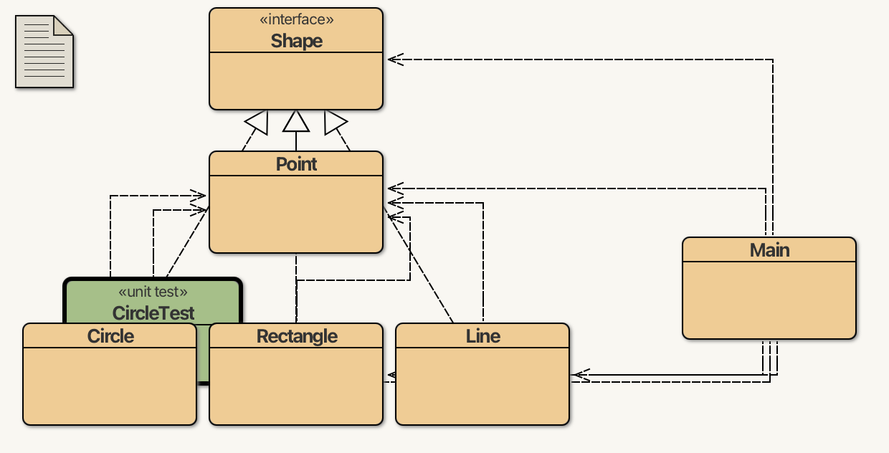
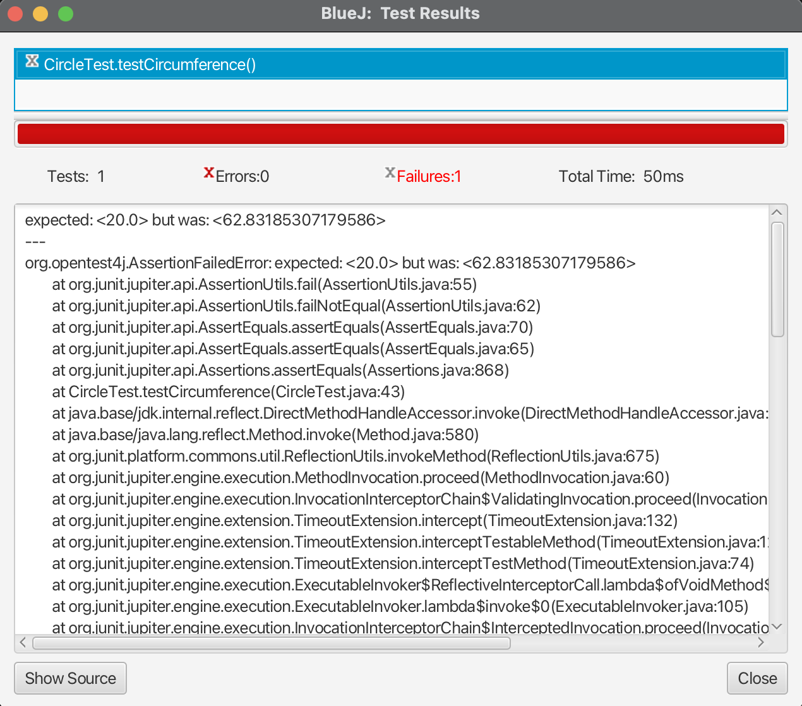
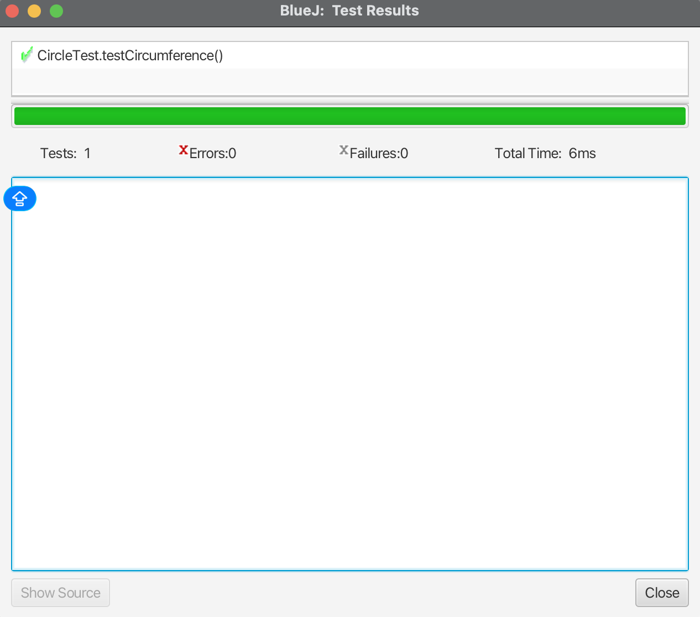
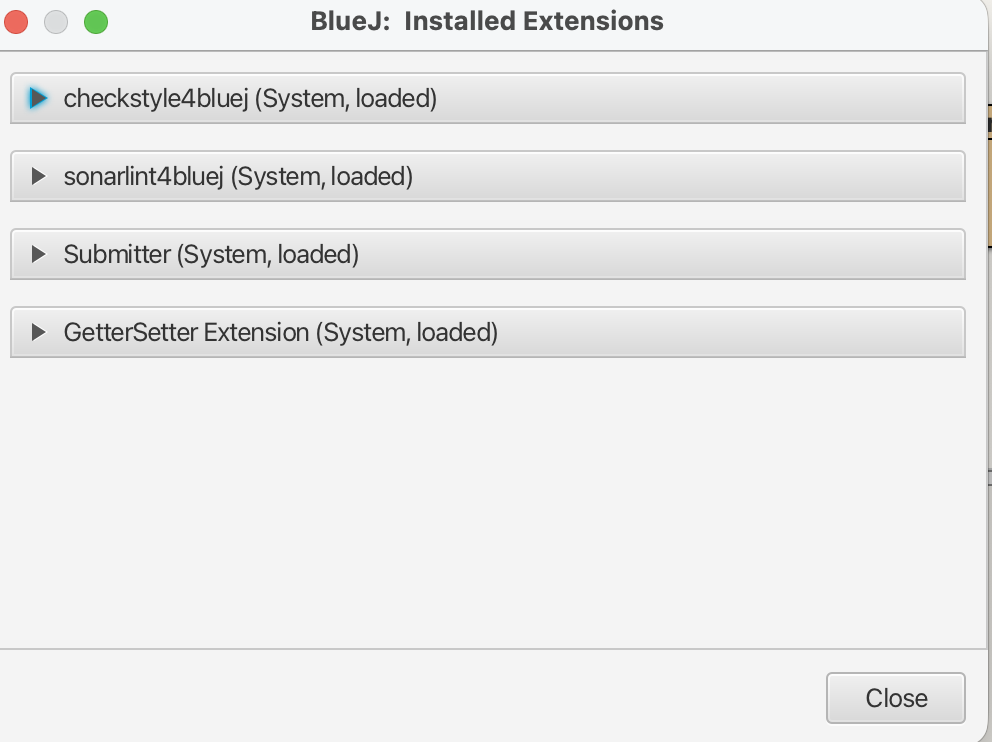
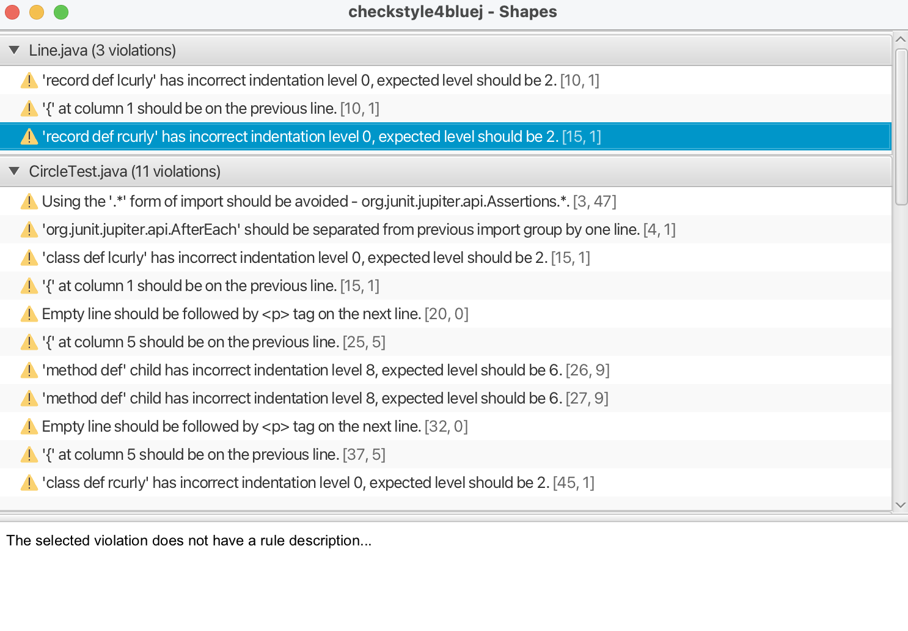

# 3.6 Έλεγχος Ποιότητας κώδικα {#Java} 
© Γιάννης Κωστάρας

---

[🏠](https://jkost.github.io) | [⬆️](../../README.md) | [◀️](../3.6-Polymorphism/README.md)

---

## Εισαγωγή
Δεν αρκεί μόνο η συγγραφή κώδικα. Σύμφωνα με τις καλές τεχνικές προγραμματισμού θα πρέπει να μεριμνήσουμε και για την ποιότητα του κώδικά μας, γράφοντας κώδικα χωρίς λάθη (bugs), εφαρμόζοντας π.χ. την Αρχή DRY (Don't Repeat Yourself) κλπ. Στο μάθημα αυτό θα δούμε εργαλεία και τεχνικές που μας βοηθούν στο σκοπό αυτό.

## Unit Testing

Μια πολύ δημοφιλής τεχνική ελέγχου λαθών είναι το unit testing (ή έλεγχος ή δοκιμασία κώδικα).

Η τεχνική ξεκίνησε από τον [Kent Beck](https://en.wikipedia.org/wiki/Kent_Beck) ως μέρος της προτιμώμενης μεθοδολογίας του [Extreme Programming (XP)](https://en.wikipedia.org/wiki/Extreme_Programming) μέρος της σχετικής μεθοδολογίας [Test Driven Development (TDD)](https://en.wikipedia.org/wiki/Test-driven_development). Με βάση αυτή τη μεθοδολογία, όταν έχουμε να επιλύσουμε κάποιο προγραμματιστικό πρόβλημα, δεν ξεκινάμε να γράφουμε κώδικα για το πρόβλημα, αλλά αντιθέτως γράφουμε ένα μικρό πρόγραμμα ελέγχου για να ελέγξουμε κατά πόσο το παραγόμενο αποτέλεσμα είναι σωστό. Φυσικά, καθώς δεν έχει γραφτεί ακόμα ο κώδικας, το πρόγραμμα ελέγχου αποτυγχάνει και ο προγραμματιστής θα πρέπει να γράψει τον κώδικα ώστε να κάνει τον πρόγραμμα ελέγχου να επιτύχει.  

Η τεχνική ονομάζεται "έλεγχος ή δοκιμασία κώδικα" (unit testing) καθώς γράφουμε κώδικα δοκιμασίας στο επίπεδο της μεθόδου, δηλ. ελέγχουμε κάθε μέθοδο του προγράμματός μας αν συμπεριφέρεται όπως πιστεύουμε ή όπως μας το επιβάλλουν οι απαιτήσεις κλπ. Όταν μελλοντικά χρειαστεί να αλλάξετε κάποιες μεθόδους, ξανατρέχοντας τα unit tests βεβαιώνεστε ότι δε προσθέσατε νέα bugs.

Υπάρχουν διάφορες βιβλιοθήκες unit testing:

* [JUnit](https://junit.org/junit5/) είναι το πιο διαδεδομένο πλαίσιο εργασίας (framework), αυτό που έγραψε ο Kent Beck μαζί με τον Erich Gamma, πάνω στο οποίο βασίζονται πολλά άλλα test frameworks και έχει μεταφερθεί σε πολλές άλλες γλώσσες προγραμματισμού 
* [TestNG](https://en.wikipedia.org/wiki/TestNG) βασισμένο στο JUnit
* [Spock](http://spockframework.org/) γραμμένο σε Groovy

Το BlueJ ενσωματώνει το JUnit. Για να μπορέσουμε να δημιουργήσουμε unit tests στο BlueJ θα πρέπει πρώτα να κάνουμε κλικ στο μενού **Προβολή -> Εμφάνιση αποτελεσμάτων δοκιμασιών (test)** ή **View -> Show Test Results**. Θα εμφανιστεί το αντίστοιχο παράθυρο. 

Κάντε δεξί κλικ πάνω στην κλάση ```Circle``` και επιλέξτε **Create Test Class** (**Δημιουργία κλάσης δοκιμασίας**). Θα δημιουργηθεί μια νέα κλάση δοκιμασίας με τον παρακάτω κώδικα:



**Εικόνα 3.7.1** _Δημιουργία ```CircleTest``` για την κλάση ```Circle```_  

```java
import static org.junit.jupiter.api.Assertions.*;
import org.junit.jupiter.api.AfterEach;
import org.junit.jupiter.api.BeforeEach;
import org.junit.jupiter.api.Test;

/**
 * The test class CircleTest.
 *
 * @author  (your name)
 * @version (a version number or a date)
 */
public class CircleTest
{
    /**
     * Default constructor for test class CircleTest
     */
    public CircleTest()
    {
    }

    /**
     * Sets up the test fixture.
     *
     * Called before every test case method.
     */
    @BeforeEach
    public void setUp()
    {
    }

    /**
     * Tears down the test fixture.
     *
     * Called after every test case method.
     */
    @AfterEach
    public void tearDown()
    {
    }
}
```
Αντικαταστήστε τη με την παρακάτω:
```java
import static org.junit.jupiter.api.Assertions.*;
import org.junit.jupiter.api.AfterEach;
import org.junit.jupiter.api.BeforeEach;
import org.junit.jupiter.api.Test;

/**
 * The test class CircleTest.
 *
 * @author ikost
 * @version 0.1
 */
public class CircleTest
{
    private Circle circle;

    /**
     * Sets up the test fixture.
     *
     * Called before every test case method.
     */
    @BeforeEach
    public void setUp()
    {
        Point centre = new Point(0, 0);
        circle = new Circle(centre, 10);
    }

    /**
     * Tears down the test fixture.
     *
     * Called after every test case method.
     */
    @AfterEach
    public void tearDown()
    {
    }
    
    @Test
    public void testCircumference() {
        System.out.println("circumference");
        assertEquals(20, circle.circumference());
    }
}
```
Καθώς δεν γνωρίζουμε την περιφέρεια του κύκλου ```circle``` δίνουμε μια λάθος τιμή και θα εκτελέσουμε την κλάση δοκιμασίας ```CircleTest``` κάνοντας δεξί κλικ πάνω της και επιλέγοντας **Test All**. 



**Εικόνα 3.7.2** _Αποτυχία δοκιμασίας ```testCircumference()```_

Δώστε τη σωστή τιμή για την περιφέρεια (```62.83185307179586```) και ξαναεκτελέστε την **Test All**. Αυτή τη φορά θα πρέπει να δείτε το παράθυρο επιτυχίας:



**Εικόνα 3.7.3** _Επιτυχία δοκιμασίας ```testCircumference()```_

Φυσικά θα πρέπει να ελέγξετε ότι το αποτέλεσμα είναι όντως το σωστό (```2x3.14x10=62.8```).

Η ```assertEquals()``` είναι ένας _ισχυρισμός (assertion)_ όπου δέχεται ως πρώτο όρισμα τι αναμένεται ως αποτέλεσμα και ως δεύτερο το πραγματικό αποτέλεσμα που τεστάρει. Υπάρχουν φυσικά πολλά assertions όπως ```assertTrue(), assertNull()``` κ.ά. Υποστηρίζονται ακόμα και _υποθέσεις (assumptions)_ δηλ. συνθήκες που πρέπει να ισχύουν για να έχει νόημα κάποιο test (π.χ. ```assumeTrue(), assumingThat()```). Αν μια υπόθεση αποτύχει, δε σημαίνει ότι απέτυχε το test, αλλά ότι απλά το συγκεκριμένο test δεν έχει νόημα ή ότι δεν παρέχει καμιά χρήσιμη πληροφορία.

Μπορείτε να χρησιμοποιήσετε την επισημείωση (annotation) ```@DisplayName```:

```java
    @DisplayName("circumference")
    @Test
    public void testCircumference() {
        assertEquals(20, circle.circumference());
    }
```

Άλλα χρήσιμα annotations:

```java
@Disabled("test is skipped")
```

αν δεν επιθυμείτε να συμπεριλάβετε τη συγκεκριμένη μέθοδο ελέγχου.

Οι ```@BeforeEach``` και ```@AfterEach``` εκτελούνται πριν και αμέσως μετά από κάθε ```@Test```, π.χ. για ν' αρχικοποιήσουν τα δεδομένα που χρησιμοποιούν οι μέθοδοι ελέγχου.

Αντίστοιχα οι ```@BeforeAll``` και ```@AfterAll``` εφαρμόζονται σε στατικές μόνο μεθόδους και εκτελούνται μια φορά πριν την αρχή (μετά το τέλος) όλων των ελέγχων. 

## [Στατικά εργαλεία ελέγχου κώδικα (Static Code Analyzers)](https://www.sparkred.com/blog/open-source-java-static-code-analyzers/)
Αυτά ελέγχουν τον κώδικά σας και ψάχνουν για λάθη που μπορεί να σας έχουν ξεφύγει, π.χ. να έχετε ξεχάσει ν' αρχικοποιήσετε μια μεταβλητή που τη χρησιμοποιείται αργότερα, ή χρήση του τελεστή ```==``` για σύγκριση αντικειμένων κλπ. Προσέξτε ότι τα εργαλεία αυτά προσφέρουν συμβουλές για πιθανά προβλήματα. Δε σημαίνει ότι όλα τα "λάθη" που βρίσκουν είναι πράγματι λάθη (false positives).

* [CheckStyle](http://checkstyle.sourceforge.net/) το οποίο ελέγχει κυρίως κατά πόσο ακολουθεί ο κώδικας κάποιο στυλ 
* [Sonarlint](https://github.com/philippefichet/sonarlint4netbeans) στατικός αναλυτής κώδικα (static code analyzer)
* [SpotBugs](https://spotbugs.github.io/) στατικός αναλυτής κώδικα (static code analyzer)
* [PMD](https://pmd.github.io/) στατικός αναλυτής κώδικα (static code analyzer)

Η εγκατάσταση προσθέτων (plugins) στο BlueJ περιγράφεται [εδώ](https://www.bluej.org/extensions/extensions2.html). Στην ίδια ιστοσελίδα μπορείτε να κατεβάσετε τα πρόσθετα:

* [SonarLint plugin extension](https://github.com/NTNU-IE-IIR/BlueJ-SonarLint-Plugin/releases/latest)
* [CheckStyle plugin extension](https://github.com/NTNU-IE-IIR/BlueJ-Checkstyle-Plugin/releases/latest)
* [PMD as a BlueJ extension](https://sourceforge.net/projects/pmd/files/pmd-bluej/)

Κατεβάστε τα ```.jar``` αρχεία και εγκαταστήστε τα στον υποφάκελο ```extensions2``` του BlueJ όπως περιγράφεται στην ιστοσελίδα. Για να επιβεβαιώσετε ότι εγκαταστάθηκαν, επανεκκινήστε το BlueJ αν ήταν ήδη ανοικτό και κάντε κλικ στο **Help -> Installed Extensions**. Θα εμφανιστεί το αντίστοιχο διαλογικό παράθυρο που σας δείχνει ποια πρόσθετα έχουν εγκατασταθεί.



**Εικόνα 3.7.4** _Εγκατεστημένα πρόσθετα στο BlueJ_

### CheckStyle
Κάθε γλώσσα προγραμματισμού διαθέτει κανόνες συγγραφής του κώδικα που καλό είναι να ακολουθούν οι προγραμματιστές. Η αναγνωσιμότητα του κώδικα είναι πολύ σημαντική τόσο για εσάς όσο και για άλλους προγραμματιστές που θα διαβάσουν τον κώδικά σας για να διορθώσουν κάποιο σφάλμα ή να προσθέσουν νέα χαρακτηριστικά. Φυσικά κάθε εταιρία ή ομάδα μπορεί να δημιουργήσει τους δικούς της κανόνες.

  * Ο [επίσημος οδηγός](https://www.oracle.com/technetwork/java/codeconventions-150003.pdf) από τη Sun Microsystems που δημιούργησε τη γλώσσα Java
  * [Το code style της Google](https://google.github.io/styleguide/javaguide.html)

Το πρόσθετο CheckStyle τσεκάρει ότι ο κώδικάς ακολουθεί τους κανόνες συγγραφής της γλώσσας. 
Εμφανίστε το από το μενού **Tools -> Show CheckStyle Overview**.



**Εικόνα 3.7.5** _Εμφάνιση συμβουλών CheckStyle στο BlueJ_

Π.χ. το BlueJ γράφει το ```{``` σε μια νέα γραμμή ενώ οι επίσημοι κανόνες της γλώσσας λένε ότι θα 'ναι στην προηγούμενη γραμμή.

### Sonarlint
Το Sonarlint βελτιώνει σημαντικά την ποιότητα του κώδικά μας με την ανάλυσή του και την υποστήριξη εκατοντάδων κανόνων στατικής ανάλυσης (static analysis) για την ανίχνευση κοινών λαθών, δύσκολων σφαλμάτων και ζητημάτων ασφαλείας. 

Εμφανίστε το από το μενού  **Tools -> Show Sonarlint Overview**


**Εικόνα 3.7.6** _Εμφάνιση συμβουλών SonarLint στο BlueJ_ 

Μπορείτε να μάθετε περισσότερα για το plugin [εδώ](https://github.com/philippefichet/sonarlint4netbeans) και για το πώς δουλεύει [εδώ](https://www.sonarlint.org/).

Π.χ. σας λέει ότι θα πρέπει να ορίζετε τις κλάσεις μέσα σε βιβλιοθήκες/πακέτα (packages) κι όχι στο εξ' ορισμού πακέτο.

## Περίληψη
Σε αυτό το μάθημα μάθαμε πώς να βελτιώσουμε την ποιότητα του κώδικά μας

* μειώνοντας τα σφάλματα με δοκιμασίες (unit tests)
* βελτιώνοντας την αναγνωσιμότητα του κώδικά μας με το πρόσθετο CheckStyle
* χρησιμοποιώντας έναν στατικό αναλυτή όπως το sonarlint για να μας βρει πιθανά προβλήματα στον κώδικά μας

## Πηγές
1. ["JUnit 5"](https://junit.org/junit5/)
2. Beck K. & Andres S. (2005), _Extreme Programming Explained_, 2nd Edition, Pearson.
3. [Java Code Conventions](https://www.oracle.com/technetwork/java/codeconventions-150003.pdf)

---

[🏠](https://jkost.github.io) | [⬆️](../../README.md) | [◀️](../3.6-Polymorphism/README.md)

---