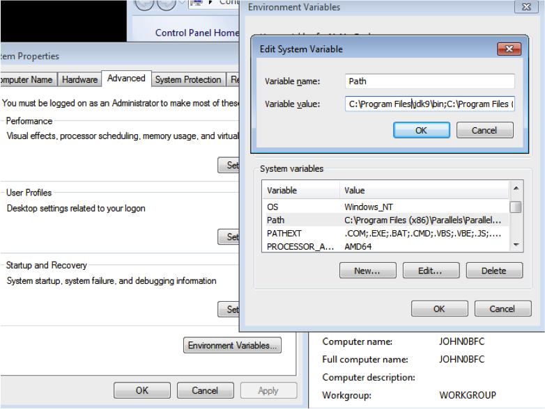
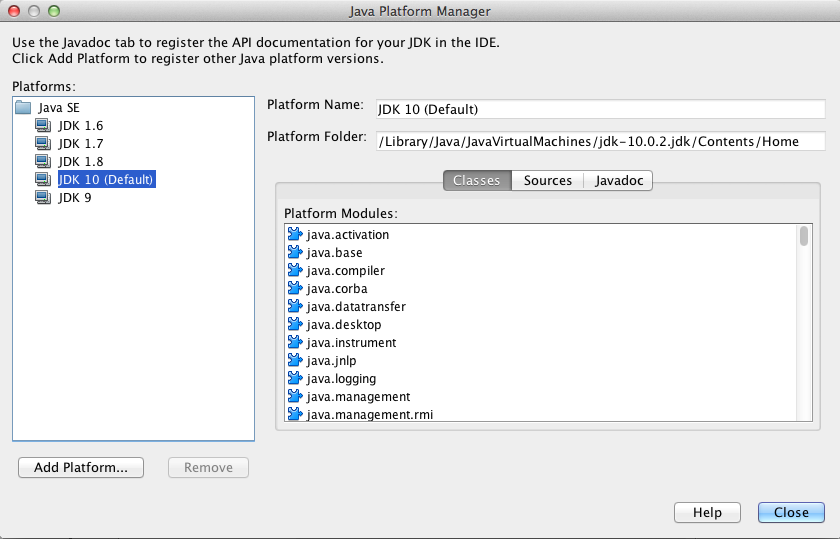

# 5.3 Η γλώσσα προγραμματισμού Java
@ Γιάννης Κωστάρας

---

[🏠](https://jkost.github.io) | [⬆️](../../README.md) | [◀️](../5.2-Python/README.md) | [▶️](../5.4-End/README.md)

---

## Μαθησιακοί Στόχοι
Σε αυτό το μάθημα θα κάνουμε μια εισαγωγή σε μια ακόμα πραγματική γλώσσα προγραμματισμού, τη γλώσσα προγραμματισμού Java.

## Η γλώσσα προγραμματισμού Java

Η τελευταία γλώσσα που θα μάθουμε σ' αυτό το μάθημα είναι η γλώσσα Java. Η Java παραμένει μια από τις πιο [δημοφιλείς γλώσσες προγραμματισμού](https://www.jetbrains.com/research/devecosystem-2018/?utm_content=event&utm_campaign=general&mkt_tok=eyJpIjoiT1dKbU4yTTBZelZsTldGbSIsInQiOiJ2VjBoK2x0d2dOZ2dOR0hnSE8raEVDbCs5dElHRjN2NXVWazZZdzNpdXpESTFTZUhzY0d1NzVGZVgxcGlnQ083aFwvQkRQNlJkQzJwamFzaVhiMjZnMFpXMktLR1RCdnpZUlwvbTg2d2VXOFZ1Q1NXWlV2ek44eDJ3UUJ0MjJoNnBwIn0%3D). Ξεκίνησε ως μια απλοποίηση της C/C++, αφαιρώντας όσα χαρακτηριστικά ήταν δύσκολα και πηγές λάθους. Ορίστηκε από την αρχή ως μια αυστηρά _αντικειμενοστραφής (object-oriented)_ γλώσσα προγραμματισμού. Άλλο σημαντικό χαρακτηριστικό της είναι ότι είναι ανεξάρτητη πλατφόρμας χάρις στην _Εικονική Μηχανή Java - Java Virtual Machine_ με αποτέλεσμα να μη χρειάζεται επαναμεταγλώττιση του πηγιαίου κώδικα για να τρέξει σε άλλες πλατφόρμες (‘Write Once Run Everywhere’). 

## Ολίγη ιστορία
Η γλώσσα προγραμματισμού Java ιδρύθηκε το 1991 και αρχικά ονομάστηκε _"Δρυς" (Oak)_ από μια ομάδα προγραμματιστών υπό τον [James Gosling](https://en.wikipedia.org/wiki/James_Gosling) στη [Sun Microsystems](https://en.wikipedia.org/wiki/Sun_Microsystems) με στόχο την αυτοματοποίηση των οικιακών συσκευών. Τα επόμενα δύο χρόνια ήταν απογοητευτικά για τη γλώσσα μέχρι το 1994, όταν η ομάδα ανάπτυξης επαναπροσδιορίζει τη γλώσσα με στόχο την κοινότητα του Internet. Η Oak μετονομάζεται σε _"Java"_ από το μάρκετινγκ. 


**Εικόνα 5.3.1** _Ο πατέρας της Java James Gosling_

Ο [Netscape Navigator 2.0](https://en.wikipedia.org/wiki/Netscape_Navigator) υποστηρίζει τη γλώσσα το Σεπτέμβριο του 1995 με τη μορφή των μη αυτόνομων εφαρμογών [Java applets](https://en.wikipedia.org/wiki/Java_applet). Η Microsoft ενσωματώνει τη γλώσσα στον [Internet Explorer](https://en.wikipedia.org/wiki/Internet_Explorer) στο τέλος του 1995. Από τότε, οι δυνατότητες της γλώσσας απογειώνονται. Το 1996 η Sun αναπτύσσει το [Java Development Kit 1.02](https://en.wikipedia.org/wiki/Java_Development_Kit).

Η Java έχει προκαλέσει περισσότερο ενθουσιασμό από οποιαδήποτε άλλη εξέλιξη στο Διαδίκτυο από την εποχή του [Mosaic](https://en.wikipedia.org/wiki/Mosaic_(web_browser)). Είναι μια γλώσσα προγραμματισμού για κατανεμημένες εφαρμογές. Έχει γίνει παγκοσμίως γνωστή ωστόσο, επειδή επιτρέπει στους χρήστες να αλληλεπιδρούν με τις ιστοσελίδες. Ένα πολύ βασικό χαρακτηριστικό που αποτέλεσε κι έναν από τους κυριότερους λόγους διάδοσης της γλώσσας είναι ότι είναι ανεξάρτητη πλατφόρμας ('Write Once Run Everywhere'). Αυτό σημαίνει ότι γράφετε κώδικα μια φορά και αυτός τρέχει σε οποιαδήποτε πλατφόρμα που έχει εγκατεστημένο το [Java Virtual Machine](https://en.wikipedia.org/wiki/Java_virtual_machine). 

Το 2009 ο ήλιος της Sun έσβησε μετά την εξαγορά της από την Oracle, η οποία μάλιστα ισχυρίζεται, ότι η Java ήταν ο κύριος λόγος εξαγοράς της Sun καθώς το μεγαλύτερο μέρος του middleware της Oracle είναι γραμμένο σε Java. Σήμερα βγαίνει μια νέα έκδοση Java κάθε 6 μήνες και τη στιγμή που γράφονται αυτές οι γραμμές βρισκόμαστε στην έκδοση 16.

## Μεταγλωτισμένη/δερμηνευόμενη γλώσσα
Αν θυμάστε στο μάθημα της 1ης εβδομάδες μάθαμε για τις κατηγορίες των γλωσσών προγραμματισμού. Με βάση τις κατηγορίες αυτές, μπορούμε να πούμε ότι η Java είναι μια _αντικειμενοστραφής_, _στατική_, _μεταγλωττιζόμενη_ (αλλά και _διερμηνευόμενη_) γλώσσα προγραμματισμού.


**Εικόνα 5.3.2** _Διαδικασία μεταγλώττισης/διερμήνευσης πηγαίου κώδικα Java_

Αντί όμως ο μεταγλωττιστής να παράγει κώδικα σε γλώσσα μηχανής που να τρέχει σε κάποια συγκεκριμένη πλατφόρμα (π.χ. Windows), παράγει τον λεγόμενο κώδικα bytecode. Αυτός είναι ένας ενδιάμεσος κώδικας το οποίο κατανοεί μόνο η Εικονική Μηχανή της Java (Java Virtual Machine). Στη συνέχεια, ανάλογα με την πλατφόρμα στην οποία την έχετε εγκαταστήσει (Windows, Linux, Mac OS κλπ.) αναλαμβάνει να μετατρέψει τα bytecodes σε γλώσσα μηχανής για αυτή την πλατφόρμα. Η Εικονική Μηχανής της τρέχει πάνω σε διάφορες πλατφόρμες ανεξαρτήτως αρχιτεκτονικής, π.χ. Windows, Linux, Mac OS, Solaris. Με αυτό το "κόλπο" επιτρέπει στα προγράμματα γραμμένα στη γλώσσα Java να μεταγλωττίζονται μόνο μια φορά και να μπορούν να εκτελούνται σε οποιαδήποτε πλατφόρμα χωρίς την ανάγκη επαναμεταλώττισης. Με άλλα λόγια μας επιτρέπει να γράφουμε τον κώδικά μας και να τον μεταγλωττίσουμε μόνο μια φορά και η JVM αναλαμβάνει να τον εκτελέσει σε οποιοδήποτε Λειτουργικό Σύστημα (**Write once run everywhere** ή αλλιώς _φορητότητα (portability)_). Αυτός είναι και ένας από τους βασικότερους λόγους που έγινε τόσο διαδεδομένη.

## Εγκατάσταση
Όπως είδαμε, η Java αποτελείται από μια _Εικονική Μηχανή_ που επιτρέπει την εκτέλεση των εφαρμογών Java σε οποιαδήποτε πλατφόρμα (Windows, Mac, Linux, Unix). Για να εκτελέσετε μια εφαρμογή Java χρειάζεστε το _Java Runtime Environment (JRE)_. Για να αναπτύξετε όμως μια εφαρμογή Java χρειάζεστε το _Java Development Kit (JDK)_ το οποίο περιλαμβάνει το JRE. Θα εγκαταστήσουμε την έκδοση 11 (αλλά μπορείτε να εγκαταστήσετε την πιο νέα έκδοση που θα βρείτε).

Πλοηγηθείτε στο [jdk.java.net](http://jdk.java.net/) και κατεβάστε την τελευταία έκδοση για την πλατφόρμα σας. Αποσυμπιέστε το και ακολουθείστε τα βήματα που περιγράφονται παρακάτω για να το εισάγετε στο ```PATH```. Καλό είναι να το εγκαταστήσετε σε μια διαδρομή (path) χωρίς κενά. 

### Εγκατάσταση του Oracle JDK στα Windows
1. Πλοηγηθείτε στον ιστοχώρο της [Oracle](http://www.oracle.com/technetwork/java/javase/downloads/index.html) και κατεβάστε την τελευταία έκδοση του JDK. Αποδεχθείτε την άδεια χρήσης (License Agreement) και κατεβάστε το για την πλατφόρμα σας (```jdk-XX.X.X_windows-x64_bin.exe```. **Σημείωση.** _Η έκδοση της Java που κατεβάσατε είναι 64 bit και 'τρέχει' σε 64-bit Windows. Αν τρέχετε παλιά έκδοση των Windows η οποία μπορεί να εκτελέσει μόνο 32 bit προγράμματα, τότε θα πρέπει να κατεβάσετε την τελευταία έκδοση x86 του JDK 8 (```jdk-8uXXX-windows-i586.exe```)_. 
1. Κάντε διπλό κλικ πάνω στο αρχείο αυτό και ακολουθήστε τα βήματα του οδηγού. Καλό είναι να το εγκαταστήσετε σε μια διαδρομή (path) χωρίς κενά, π.χ. ```C:\Programs\Java``` αντί για την προτεινόμενη διαδρομή ```C:\Program Files\Java```. Ο οδηγός θα σας ζητήσει στη συνέχεια να εγκαταστήσετε και το JRE. Επιλέξτε ```C:\Programs\Java\jdkXX.X.X\jre```.
1. Προσθέστε την εγκατάσταση στη μεταβλητή περιβάλλοντος ```PATH``` ως εξής:

* Δεξί κλικ στο εικονίδιο Computer ⇒ Properties
* System Properties
* Καρτέλα "Advanced" ⇒  Environment Variables
* "System Variables", 
* Επιλέξτε **New** και εισάγετε τη νέα μεταβλητή περιβάλλοντος ```JAVA_HOME``` δίνοντάς της την τιμή ```C:\Programs\Java\jdkXX.X.X```, όπου ```XX.X.X``` η έκδοση που κατεβάσατε π.χ. ```13.0.2```
* Επιλέξτε **"PATH" ⇒  Edit** και προσθέστε ```%JAVA_HOME%\bin;``` μπροστά από οποιαδήποτε άλλη τιμή της μεταβλητής αυτής
* Πατήστε **ΟΚ** σε όλα τ' ανοικτά παράθυρα



**Εικόνα 5.3.3** _Ορισμός μεταβλητών περιβάλλοντος στα Windows_

### Εγκατάσταση του Oracle JDK στο MacOS
1. Πλοηγηθείτε στον ιστοχώρο της [Oracle](http://www.oracle.com/technetwork/java/javase/downloads/index.html) και κατεβάστε την τελευταία έκδοση του JDK. Αποδεχθείτε την άδεια χρήσης (License Agreement) και κατεβάστε το για την πλατφόρμα σας (```jdk-XX.X.X_osx-x64_bin.dmg```), όπου ```XX.X.X``` η έκδοση που κατεβάσατε π.χ. ```13.0.2```.
1. Εγκαταστήστε το αρχείο κατά τα γνωστά.
1. Ορίστε τις ακόλουθες μεταβλητές περιβάλλοντος στο αρχείο ```.bash_profile```: ```JAVA_HOME=$HOME/Programs/Java/jdkXX.X.X``` και ```PATH=$JAVA_HOME/bin:$PATH```

Αν έχετε και άλλες εγκατεστημένες εκδόσεις της Java, τότε για να ορίσετε π.χ. την έκδοση που κατεβάσατε ως την εξ' ορισμού έκδοση στο σύστημά σας ακολουθήστε τα παρακάτω βήματα (σε ένα κέλυφος) (οι εκδόσεις στο σύστημά σας θα διαφέρουν από αυτές του παρακάτω παραδείγματος):

```bash
$ /usr/libexec/java_home -V
Matching Java Virtual Machines (8):
	13.0.2, x86_64:	"Java SE 13.0.2"	/Library/Java/JavaVirtualMachines/jdk-13.0.2.jdk/Contents/Home
	11.0.1, x86_64:	"Java SE 11.0.1"	/Library/Java/JavaVirtualMachines/jdk-11.0.1.jdk/Contents/Home
    10.0.2, x86_64:	"Java SE 10.0.2"	/Library/Java/JavaVirtualMachines/jdk-10.0.2.jdk/Contents/Home
    9.0.4, x86_64:	"Java SE 9.0.4"	/Library/Java/JavaVirtualMachines/jdk-9.0.4.jdk/Contents/Home
    1.8.0_181, x86_64:	"Java SE 8"	/Library/Java/JavaVirtualMachines/jdk1.8.0_181.jdk/Contents/Home
    1.7.0_80, x86_64:	"Java SE 7"	/Library/Java/JavaVirtualMachines/jdk1.7.0_80.jdk/Contents/Home
    1.6.0_65-b14-462, x86_64:	"Java SE 6"	/System/Library/Java/JavaVirtualMachines/1.6.0.jdk/Contents/Home
    1.6.0_65-b14-462, i386:	"Java SE 6"	/System/Library/Java/JavaVirtualMachines/1.6.0.jdk/Contents/Home

/Library/Java/JavaVirtualMachines/jdk-13.0.2.jdk/Contents/Home
```
Στη συνέχεια μπορείτε να ορίσετε τη μεταβλητή περιβάλλοντος ```JAVA_HOME``` στο ```.bash_profile``` όπως είδαμε παραπάνω δίνοντάς της την τιμή ```export JAVA_HOME=`/usr/libexec/java_home -v 13.0.2` ```.

_Πηγή:_ [StackOverflow](https://stackoverflow.com/questions/21964709/how-to-set-or-change-the-default-java-jdk-version-on-os-x#24657630)

### Εγκατάσταση του Oracle JDK στο Linux
1. Πλοηγηθείτε στον ιστοχώρο της [Oracle](http://www.oracle.com/technetwork/java/javase/downloads/index.html) και κατεβάστε την τελευταία έκδοση του JDK. Αποδεχθείτε την άδεια χρήσης (License Agreement) και κατεβάστε το για την πλατφόρμα σας (προτιμήστε το αρχείο ```jdk-XX.X.X_linux-x64_bin.tar.gz```), όπου ```XX.X.X``` η έκδοση που κατεβάσατε π.χ. ```13.0.2```.
1. Αποσυμπιέστε το (π.χ. από τον εξερευνητή αρχείων κάντε δεξί κλικ και επιλέξτε **Extract here**). Μετακινήστε το φάκελο ```jdkXX.X.X``` σε μια διαδρομή (path) χωρίς κενά, π.χ. ```$HOME/Programs/Java```. Συνίσταται να την εγκαταστήσετε στη διαδρομή ```/usr/lib/jvm``` δίνοντας τις εντολές: ```sudo mkdir -p /usr/lib/jvm/jdk-XX.X.X``` και ```sudo mv $HOME/Downloads/jdkXX.X.X/* /usr/lib/jvm/jdk-XX.X.X/```.
1. Ορίστε τις ακόλουθες μεταβλητές περιβάλλοντος στο αρχείο ```.bashrc```: ```JAVA_HOME=$HOME/Programs/Java/jdkXX.X.X``` ή ```JAVA_HOME=/usr/lib/jvm/jdkXX.X.X``` και ```PATH=$JAVA_HOME/bin:$PATH```

Αν έχετε και άλλες εγκατεστημένες εκδόσεις της Java, τότε για να ορίσετε την έκδοση που κατεβάσατε ως την εξ' ορισμού έκδοση στο σύστημά σας:

```bash
$ sudo update-alternatives –-config java
```
και επιλέξτε τη από το μενού που εμφανίζεται.

Εναλλακτικά μπορείτε να την εγκαταστήσετε ως την εξ' ορισμού με την εντολή (π.χ. XX.X.X εδώ είναι 13.0.2):

```bash
$ sudo update-alternatives –-install "/usr/bin/java" "java" "/usr/lib/jvm/jdk-13.0.3/bin/java" 1010
$ sudo update-alternatives –-install "/usr/bin/javac" "javac" "/usr/lib/jvm/jdk-13.0.3/bin/javac" 1010
```

### Επαλήθευση εγκατάστασης
Αν όλα πήγαν καλά, τότε μπορείτε ν' ανοίξετε μια προτροπή DOS (command prompt) ή ένα κέλυφος (shell) και να δώσετε τις εντολές (η έκδοση που κατεβάσατε θα διαφέρει από τα παρακάτω παραδείγματα):

```bash 
$ java –version
java version "12" 2019-03-19
Java(TM) SE Runtime Environment (build 12+33)
Java HotSpot(TM) 64-Bit Server VM (build 12+33, mixed mode, sharing)
```
για το Oracle JDK, ενώ για το OpenJDK:
```bash
$ java –version
openjdk version "11" 2018-09-25
OpenJDK Runtime Environment 18.9 (build 11+28)
OpenJDK 64-Bit Server VM 18.9 (build 11+28, mixed mode)
```

```bash
$ jshell
|  Welcome to JShell -- Version 12.0.1
|  For an introduction type: /help intro

jshell> 2+2
$1 ==> 4

jshell> (Ctrl+D)
```

Η έκδοσή σας μπορεί να διαφέρει από την παραπάνω. 

Το ```jshell```, όπως θα δούμε, είναι ένα νέο κέλυφος Java που έρχεται μαζί με την έκδοση 9 της Java (ή νεώτερη) και μας επιτρέπει να δοκιμάζουμε εντολές κλπ. εύκολα και γρήγορα.

## Ολοκληρωμένα Περιβάλλοντα Εργασίας (Integrated Development Environments - IDEs)
Αν και μπορείτε να γράψετε ολόκληρες εφαρμογές Java με τη χρήση ενός απλού επεξεργαστή κειμένου όπως το Notepad ή το vi, τα Ολοκληρωμένα Περιβάλλοντα Εργασίας (ΟΠΕ) σας παρέχουν πολλά καλούδια που σας βοηθούν στην ανάπτυξη των εφαρμογών σας γρηγορότερα, όπως αυτόματη συμπλήρωση κώδικα, online βοήθεια κλπ.

Τα πιο δημοφιλή ΟΠΕ για Java είναι:
* [BlueJ](https://www.bluej.org/)
* [DrJava](http://www.drjava.org/)
* [Eclipse](http://www.eclipse.org/)
* [IDEA](https://www.jetbrains.com/idea/)
* [JDeveloper](http://www.oracle.com/technetwork/developer-tools/jdev/overview/index.html)
* [NetBeans](https://netbeans.apache.org/) ή [OpenBeans](https://www.openbeans.org/)

Σ' αυτή την ενότητα θα χρησιμοποιήσουμε το NetBeans, αλλά μπορείτε κάλλιστα να χρησιμοποιήσετε όποιο ΟΠΕ ή επεξεργαστή κειμένου προτιμάτε.

Αν δεν επιθυμείτε να εγκαταστήσετε κάποιο πρόγραμμα στον Η/Υ σας, μπορείτε ακόμα να χρησιμοποιήσετε κάποιο από τα παρακάτω online:
* [Browxy                    ](http://www.browxy.com/)
* [Codecademy                ](https://www.codecademy.com/learn/learn-java)
* [CodeChef                  ](https://www.codechef.com/ide)
* [CodePad                   ](https://codepad.remoteinterview.io/)
* [Codiva                    ](https://www.codiva.io/)
* [CompileJava               ](https://www.compilejava.net/)
* [Guru99                    ](https://www.guru99.com/try-java-editor.html)
* [Ideone                    ](https://ideone.com/)
* [JDoodle                   ](https://www.jdoodle.com/online-java-compiler)
* [TryJShell - Online JShell ](https://tryjshell.org)
* [Learn Java Online         ](http://www.learnjavaonline.org/)
* [Paiza.io                  ](https://paiza.io/en/projects/new?language=java)
* [Repl.it                   ](https://repl.it/languages/java10)
* [Rextester                 ](http://rextester.com/l/java_online_compiler)
* [Online Java Debugger      ](https://www.onlinegdb.com/online_java_debugger)
* [Trinket                   ](https://trinket.io/java)
* [Tutorialspoint            ](https://www.tutorialspoint.com/compile_java_online.php)
* [Visualizer                ](http://www.pythontutor.com/visualize.html#mode=edit)

## Εγκατάσταση του Apache NetBeans

1. Από τον ιστοχώρο της [Apache](https://netbeans.apache.org/download/index.html) κατεβάστε την τελευταία έκδοση του Apache NetBeans για την πλατφόρμα σας (Windows/MacOSX/Linux) και εγκαταστήστε το ακολουθώντας τον οδηγό.
1. Ελέξτε ότι το αρχείο ```<netbeans>/etc/netbeans.conf``` περιέχει γραμμή παρόμοια με την παρακάτω ανάλογα με την έκδοση JDK που εγκαταστήσατε προηγουμένως:
```bash
netbeans_jdkhome="/<path>/jdk-XX.X.X.jdk/Contents/Home/" 
```
αν χρησιμοποιείτε Mac ή
```bash
netbeans_jdkhome="/<path>/jdkXX.X.X/" 
```
αν χρησιμοποιείτε Windows/Linux/Unix.

### Επαλήθευση εγκατάστασης
1. Ξεκινήστε το NetBeans. Ανάλογα με την πλατφόρμα σας (Windows: κάντε διπλό κλικ στο αρχείο ```netbeans.exe``` ή ```netbeans64.exe```)(Linux/MacOSX: από ένα κέλυφος πληκτρολογήστε ```./netbeans &```) από το φάκελο ```bin```.
1. Επιλέξτε το μενού **Tools --> Open Java Platform Shell**
```bash
|  System Information:
|      Java version:    13.0.3+11
|      Virtual Machine: Java HotSpot(TM) 64-Bit Server VM  13.0.3+11
|      Classpath:
|  	/<path>/netbeans/java/modules/ext/nb-mod-jshell-probe.jar
|  
[1]-> System.out.println("Καλημέρα κόσμε")
Καλημέρα κόσμε
```

Μπορείτε να προσθέσετε κι άλλες εκδόσεις JDK από το μενού ```Tools --> Java Platforms```. Πατώντας το κουμπί ```Add Platform``` μπορείτε να πλοηγηθείτε στο φάκελο που έχετε εγκαταστήσει ένα JDK.



**Εικόνα 5.3.4** _Ορισμός πλατφορμών JDK_

## JShell

Το κέλυφος Java (JShell) εισήχθηκε στη Java από την έκδοση 9 και μετά. Πιο πάνω είδαμε πώς να το εκκινήσουμε τόσο από τη γραμμή εντολών του Λ.Σ. όσο και από το NetBeans. Στη βιβλιογραφία αναφέρεται ως _Read-Evaluate-Print-Loop_. Όπως είδαμε, η Java είναι μια μεταγλωττισμένη γλώσσα, δηλ. για να εκτελεστεί κάποιο πρόγραμμα γραμμένο σε Java, θα πρέπει πρώτα να το μεταγλωττίσουμε και μετά να το εκτελέσουμε. Για μικρά προγράμματα ή για να δοκιμάσουμε διάφορα χαρακτηριστικά της γλώσσας, αυτό τρώει πολύ χρόνο. Το JShell δημιουργήθηκε γι' αυτόν ακριβώς το σκοπό. Μπορούμε μ' αυτό να εκτελέσουμε εντολές Java χωρίς να χρειάζεται πρώτα να περάσουμε από τη φάση της μεταγλώττισης.

Σ' αυτή την ενότητα θα δούμε πώς μπορούμε να το χρησιμοποιήσουμε. 

Το JShell αποτελείται από:
* Snippets, π.χ. ```2+2```
* Εντολές, π.χ. ```/help```
* Scripts π.χ.
```bash
$ jshell --startup PRINTING
```

**Σημαντική Σημείωση** _Για να μπορέσετε να δείτε ελληνικά στο JShell στα Windows, θα πρέπει να δώσετε τις εξής εντολές σε ένα παράθυρο DOS_

```
C:\ chcp 737

C:\ jshell
|  Welcome to JShell -- Version 13
|  For an introduction type: /help intro

jshell> System.setOut(new PrintStream(System.out, true, "cp737"));

jshell> System.out.println("Γειά")
Γειά
```

_Για να μπορέσετε να δείτε ελληνικά στο jshell του NetBeans στα Windows, θα πρέπει να ορίσετε την μεταβλητή περιβάλλοντος ```JAVA_TOOL_OPTIONS=-Dfile.encoding=UTF8```, όπως περιγράψαμε στην αρχή αυτών των σημειώσεων. Εναλλακτικά, ανοίξτε το αρχείο ```etc/netbeans.conf``` και προσθέστε στο τέλος του κλειδιού ```netbeans_default_options```, δηλ. μετά το ```-J-XX:+IgnoreUnrecognizedVMOptions``` το ```-J-Dfile.encoding=UTF8```. Επανεκκινήστε το NetBeans, και θα πρέπει να βλέπετε πλέον ελληνικά στο JShell._

### Εντολές JShell
```bash
jshell> /help
/list [<name or id>|-all|-start]                                         -- list the source you have typed
/edit <name or id>                                                       -- edit a source entry referenced by name or id
/save [-all|-history|-start] <file>                                      -- save snippet source to a file
/open <file>                                                             -- open a file as source input
/vars [<name or id>|-all|-start]                                         -- list the declared variables and their values
/types [<name or id>|-all|-start]                                        -- list the type declarations
/methods [<name or id>|-all|-start]                                      -- list the declared methods and their signatures
/imports                                                                 -- list the imported items
/exit                                                                    -- exit jshell
/env [-class-path <path>] [-module-path <path>] [-add-modules <modules>] -- view or change the evaluation context
/reset                                                                   -- reset jshell
/reload [-restore] [-quiet] [-class-path <path>] [-module-path <path>]   -- reset and replay relevant history -- current or previous (-restore)
/history                                                                 -- history of what you have typed
/help [<command>|<subject>]                                              -- get information about jshell
/set editor|start|feedback|mode|prompt|truncation|format                 -- set configuration information
/? [<command>|<subject>]                                                 -- get information about using the jshell tool
/!                                                                       -- rerun last snippet -- see /help rerun
/<id>                                                                    -- rerun snippets by ID or ID range -- see /help rerun
/-<n>                                                                    -- rerun n-th previous snippet -- see /help rerun	
```

### Χρήσιμα πλήκτρα στο JShell
**Πίνακας 5.3.1** _Πλοήγηση_ 

| Πλήκτρο(-α) | Αποτέλεσμα
| ```ENTER``` | Εισαγωγή νέας γραμμής
| ```<-``` | Πίσω ένας χαρακτήρας
| ```->``` | Μπροστά ένας χαρακτήρας
| ```^``` | Πάνω μια γραμμή, πίσω στο ιστορικό
| ```v``` | Κάτω μια γραμμή, μπροστά στο ιστορικό
| ```Ctrl+A``` | Μετακίνηση στην αρχή της γραμμής
| ```Ctrl+E``` | Μετακίνηση στο τέλος της γραμμής
| ```Alt+B``` | Μετακίνηση πίσω μια λέξη
| ```Alt+F``` | Μετακίνηση μπροστά μια λέξη
| ```Ctrl+R (Ctrl+S)``` | Αναζήτηση πίσω (μπροστά) στο ιστορικό

**Πίνακας 5.3.2** _Τροποποίηση κειμένου_

| Πλήκτρο(-α) | Αποτέλεσμα
| ```Tab``` | Αυτόματη συμπλήρωση (auto-completion)
| ```Delete``` | Διαγραφή του χαρακτήρα μετά τον δρομέα
| ```Backspace``` | Διαγραφή του χαρακτήρα πριν δρομέα
| ```Ctrl+K``` | Διαγραφή του κειμένου από το δρομέα μέχρι το τέλος της γραμμής
| ```Alt+D``` | Διαγραφή του κειμένου από το δρομέα μέχρι το τέλος της λέξης
| ```Ctrl+Y``` | Επικόλληση του πιο πρόσφατα διαγραμμένου κειμένου 
| ```Alt+Y``` | Μετακίνηση στο διαγραμμένο κείμενο

```Ctrl+L```: καθαρισμός οθόνης

## Το πρώτο μου πρόγραμμα
Ήδη είδαμε πώς μπορούμε να γράψουμε το πρώτο μας πρόγραμμα στη Java, και πιο συγκεκριμένα στο JShell:
```bash
jshell
|  Welcome to JShell -- Version 15.0.1
|  For an introduction type: /help intro

jshell> System.out.println("Γειά")
Γειά
```
Όπως και στις άλλες γλώσσες προγραμματισμού που είδαμε, ένα αλφαριθμητικό περικλείεται σε διπλά εισαγωγικά. Η εντολή ```System.out.println()``` εμφανίζει ότι του περνάμε ως όρισμα στην μονάδα εξόδου (δηλ. την οθόνη). Οι εντολές στην Java τελειώνουν με το ελληνικό ερωτηματικό (;), αν και δεν είναι απαραίτητο στο JShell.

## Σχόλια

Η Java υποστηρίζει τριών ειδών σχόλια.

Σχόλιο μιας γραμμής:
```java
int radius;          // Αυτό είναι ένα σχόλιο μιας γραμμής

```
Σχόλιο πολλαπλών γραμμών:
```java
/* 
 * Αυτό είναι ένα σχόλιο
 * πολλαπλών γραμμών.
 */
int radius;          
```
Σχόλιο τεκμηρίωσης (Javadoc):
```java
/** 
 * Αυτό είναι ένα σχόλιο
 * τεκμηρίωσης κώδικα (Javadoc).
 */
int radius;          
```
Τα σχόλια Javadoc σας επιτρέπουν να τεκμηριώνετε τον κώδικά σας και να παράγετε τη διεπαφή των κλάσεών σας (Application Program Interface - API) σε μορφή HTML. Π.χ. [εδώ](https://docs.oracle.com/javase/10/docs/api/index.html?overview-summary.html) βλέπετε το API των κλάσεων της Java 10. Όλες οι εντολές της γλώσσας περιγράφονται στο API της οπότε καλό είναι να το συμβουλεύεστε όποτε χρειάζεται να χρησιμοποιήσετε μια νέα εντολή.

## Από τι αποτελείται η γλώσσα Java
Η γλώσσα Java αποτελείται από: λέξεις-κλειδιά (keywords), μεταβλητές (variables ή identifiers), σταθερές (constants ή literals), τελεστές (operators) και σημεία στίξης (punctuators).

Οι _λέξεις-κλειδιά (keywords)_ είναι δεσμευμένες λέξεις που αποτελούν τις εντολές της γλώσσας (π.χ. ```int, String, for, public, try```). 

Οι _μεταβλητές (variables ή identifiers)_ είναι, όπως ήδη γνωρίζουμε, διευθύνσεις μνήμης για ν' αποθηκεύουμε δεδομένα ή αποτελέσματα πράξεων.

Οι _σταθερές (constants ή literals)_ είναι επίσης θέσεις μνήμης που αποθηκεύουν δεδομένα που δεν μπορούν να μεταβληθούν κατά την εκτέλεση του προγράμματος.

Οι _τελεστές (operators)_ είναι διάφορες πράξεις που υποστηρίζει η γλώσσα (π.χ. ```+, %, ++, && <=```) και χρησιμοποιούνται σε εκφράσεις.

Τα _σημεία στίξης (punctuators)_ είναι χαρακτήρες που έχουν ειδικό νόημα για τον μεταγλωττιστή (π.χ. ```; , . { }```).

## Αριθμοί

Η Java υποστηρίζει τους παρακάτω αριθμητικούς τύπους:

* Ακέραιοι:
  * Δεκαδικός: π.χ. ```15```
  * Οκταδικός: π.χ. ```023```
  * Δεκαεξαδικός: π.χ. ```0xΑΒ```
  * Δυαδικός: π.χ. ```0b101```
  * Αναπαράσταση μεγάλων αριθμών: π.χ. ```123_456_789```

**Σημείωση.** _Στο [API](https://docs.oracle.com/javase/7/docs/api/java/lang/Integer.html) της γλώσσας μπορείτε να βρείτε χρήσιμες εντολές όπως π.χ. η ```Integer.parseInt(String s, int radix)``` που επιτρέπει τη μετατροπή ενός αριθμού σε μια άλλη βάση (radix, π.χ. δυαδικό σύστημα) στο δεκαδικό σύστημα. Π.χ. ```Integer.parseInt("0101", 2)```. Θα μιλήσουμε για ```String```s παρακάτω. Mελετήστε τις άλλες εντολές (μεθόδους) που παρέχει η κλάση ```Integer```._

* Πραγματικοί: π.χ. ```3.14```
  * ```125E-3 // 10^-3 = 0.125```
  * ```0x1.0p-3 // 2^-3 = 0.125```

### Αριθμητικοί τύποι δεδομένων
Οι παρακάτω πίνακες δείχνουν τους αριθμητικούς τύπους δεδομένων που υποστηρίζονται από τη γλώσσα καθώς και το εύρος τιμών καθενός από αυτούς. 

**Πίνακας 1.3.1** _Ακέραιοι τύποι δεδομένων_

| Τύπος δεδομένων | Αποθηκευτικός χώρος | Εύρος τιμών | Ελάχιστη, Μέγιστη τιμή
| ```byte``` | 1 byte | ```–128 -> 127 (-2^7 to 2^7-1)``` | ```Byte.MIN_VALUE, Byte.MAX_VALUE```
| ```short``` | 2 bytes | ```–32,768 -> 32,767 (-2^15 to 2^15-1)``` | ```Short.MIN_VALUE, Short.MAX_VALUE```
| ```int``` | 4 bytes | ```–2,147,483,648 -> 2,147,483,647(-2^31 to 2^31-1)``` | ```Integer.MIN_VALUE, Integer.MAX_VALUE```
| ```long``` | 8 bytes | ```–9,223,372,036,854,775,808 -> 9,223,372,036,854,775,807 (-2^63 to 2^63-1)``` | ```Long.MIN_VALUE, Long.MAX_VALUE```

**Πίνακας 1.3.2** _Τύποι δεδομένων κινητής υποδιαστολής σύμφωνα με το πρότυπο ΙΕΕΕ 754_

| Τύπος δεδομένων | Αποθηκευτικός χώρος | Εύρος τιμών | Ελάχιστη, Μέγιστη τιμή
| ```float``` | 4 bytes | ```-3.40282347E+38 -> -1.4E-45 και 1.4E+45 -> 3.4028235E+38``` | ```Float.MIN_VALUE, Float.MAX_VALUE```
| ```double``` | 8 bytes | ```-1.7976931348623157E+308 -> -4.9E-324 και 4.9E-324 -> 1.7976931348623157E+308``` | ```Double.MIN_VALUE, Double.MAX_VALUE```

* ```float```: 1 bit για το πρόσημο, 23 bits για την mantissa (~7 δεκαδικά ψηφία), 8 bits για τον εκθέτη
* ```double```: 1 bit για το πρόσημο, 52 bits για την mantissa (~16 δεκαδικά ψηφία), 11 bits για τον εκθέτη

**Σημείωση** _Υπενθυμίζουμε ότι 1 byte = 8 bits (1 bit είναι ένα δυαδικό ψηφίο, δηλ. 0 ή 1)_

Καλό είναι να χρησιμοποιείτε τον κατάλληλο τύπο δεδομένων ανάλογα με τις ανάγκες του προγράμματός σας. Αν χρησιμοποιήσετε τύπο δεδομένων με μεγαλύτερο εύρος τιμών από αυτό που χρειάζεται το πρόγραμμά σας, τότε σπαταλάτε άσκοπα μνήμη. Αν από την άλλη, χρησιμοποιήσετε τύπο δεδομένων με μικρότερο εύρος τιμών απ' ότι χρειάζεται το πρόγραμμά σας, τότε κινδυνεύετε να έχετε υπερχήλιση (overflow) και τα αποτελέσματα που θα πάρετε να μην είναι σωστά. 

Μεγάλη προσοχή επίσης στις πράξεις μεταξύ δεδομένων κινητής υποδιαστολής, όπως βλέπετε στο παρακάτω παράδειγμα:
```java
jshell> 2.0d - 2.01d
$1 ==> -0.009999999999999787
```
Λόγω του τρόπου [αναπαράστασής τους](https://en.wikipedia.org/wiki/IEEE_754) από τους Η/Υ, δεν μπορείτε να βασίζεστε στις πράξεις τέτοιων αριθμών. 

### Προτεραιότητα αριθμητικών πράξεων

Η προτεραιότητα των αριθμητικών πράξεων φαίνεται στον ακόλουθο πίνακα (όσο πιο πάνω τόσο μεγαλύτερη η προτεραιότητα).

**Πίνακας 1.3.3** _Προτεραιότητα αριθμητικών πράξεων_

| ```+ -``` | Πρόσημα
| ```()``` | Παρενθέσεις
| ```* / % *= /= %=``` | Πολλ/σμός, Διαίρεση, Υπόλοιπο διαίρεσης ```(a / b) * b + r = a```, εκχωρήσεις
| ```+ - += -=``` | Πρόσθεση, Αφαίρεση, εκχωρήσεις
| ```< > <= >= == !=``` | Μεγαλύτερο, μικρότερο, μεγαλύτερο ίσο, μικρότερο ίσο, ίσο, άνισο

Π.χ. πόσο κάνει η παρακάτω πράξη:
```java
jshell> 5 + 2 * 4
```
Αν απαντήσατε ```28``` τότε δε λάβατε υπόψιν σας την προτεραιότητα των τελεστών όπως φαίνεται στον παραπάνω πίνακα. Καθώς ο πολλ/σμός (```*```) έχει υψηλότερη προτεραιότητα από την πρόσθεση, θα εκτελεστεί πρώτα και μετά η πρόσθεση. 

Η σωστή απάντηση είναι ```13```.

## Λογικοί τύποι δεδομένων και λογικές πράξεις

**Πίνακας 1.3.4** _Λογικός τύπος δεδομένων_

| Τύπος δεδομένων | Αποθηκευτικός χώρος | Εύρος τιμών
| boolean | 1 byte | ```true,false```

**Πίνακας 1.3.5** _Λογικές πράξεις_

| ```!``` | Όχι (Not)
| ```&&, ||``` | Λογικό ΚΑΙ (And), Ή (Or)
| ```&, |``` | Λογικό ΚΑΙ (And), Ή (Or)

Παρακάτω φαίνονται οι πίνακες αληθείας των πράξεων αυτών (F: Ψευδής, T: Αληθής):

| ```x``` | ```!x``` |
| F | T |
| T | F |

| ```x``` | ```y``` | ```x && y``` ή ```x & y```
| F | F | F
| F | T | F
| T | F | F
| T | T | T

| ```x``` | ```y``` | ```x || y``` ή ```x | y```
| F | F | F
| F | T | T
| T | F | T
| T | T | T


Όπως παρατηρείτε, υπάρχουν δυο είδη λογικών τελεστών για το λογικό ΚΑΙ και το λογικό Ή. Η διαφορά τους είναι η εξής:

* Οι λογικοί τελεστές ```&&, ||```, ή τελεστές συνθήκης, ελέγχουν το 2ο όρισμα μόνο αν δεν μπορούν να συνάγουν αποτέλεσμα από το πρώτο μόνο όρισμα. Π.χ. στη συνθήκη ```x && y```, αν το ```x == false``` τότε δεν ελέγχεται το δεύτερο όρισμα καθώς γνωρίζουμε ήδη ότι η τιμή της συνθήκης είναι ```false```
* Οι λογικοί τελεστές ```&, |```, ή δυαδικοί τελεστές, ελέγχουν πάντα και τα δυο ορίσματα

## Τύπος δεδομένων χαρακτήρας


**Πίνακας 1.3.7**  _Τύπος δεδομένων χαρακτήρας_

| Τύπος δεδομένων | Αποθηκευτικός χώρος | Εύρος τιμών | Ελάχιστη, Μέγιστη τιμή
| ```char``` | 2 bytes (16-bit Unicode) | ```'\u0000' - '\uffff'``` | ```Character.MIN_VALUE, Character.MAX_VALUE```

Είναι ο μόνος τύπος δεδομένων της γλώσσας που είναι μη προσημασμένος (δηλ. παίρνει μόνο θετικές τιμές).

**Πίνακας 1.3.8** _Πράξεις_

| ```+``` | ```char``` μετατρέπεται σε ```int```
| ```++``` | προσαύξηση
| ```--``` | προσαφαίρεση

Οι χαρακτήρες αναπαρίστανται στους Η/Υ ως δυαδικοί αριθμοί. Υπάρχουν διάφορα πρότυπα αναπαράστασης χαρακτήρων στους Η/Υ έτσι ώστε να αναπαρίστανται με τον ίδιο κωδικό. Το πιο γνωστό τέτοιο πρότυπο είναι ο κώδικας [ASCII](http://www.asciitable.com/).

```java
jshell> char char1 = 'α'
char1 ==> 'α’

jshell> char char2 = 'γ'
char2 ==> 'γ’

jshell> char char3 = char1 + char2
|  Error:
|  incompatible types: possible lossy conversion from int to char
|  char char3 = char1 + char2;
|               ^-----------^

jshell> int char3 = char1 + char2
char3 ==> 1892

jshell> int char1 = 'α'	 // κωδικός ASCII
char1 ==> 945

jshell> char char1 = 945  // κωδικός ASCII
char1 ==> 'α'

jshell> ++char1
$1 ==> 'β'

jshell> --char1
$2 ==> 'α'
```

## Μεταβλητές
Το όνομα μιας μεταβλητής μπορεί να περιλαμβάνει λατινικούς χαρακτήρες ```a..Z, A..Z``` αριθμούς ```0..9, $``` και ```_```. Δεν μπορεί να αρχίζει όμως με αριθμητικό ψηφίο ούτε μπορεί να είναι δεσμευμένη λέξη (δηλ. κάποια από τις εντολές) της γλώσσας.

Επίσης, ο τύπος δεδομένων που διαλέξαμε για να ορίσουμε μια μεταβλητή λέει στη Java πόσες θέσεις μνήμης να δεσμεύσει γι' αυτή τη μεταβλητή (ανάλογα με το εύρος τιμών του τύπου δεδομένων). Π.χ. για έναν ακέραιο δεσμεύονται 4 bytes συνεχόμενων θέσεων μνήμης.

Π.χ.
```java
int myVar;    // ορισμός μια νέας μεταβλητής με όνομα myVar τύπου int
```
Μπορείτε ν' αρχικοποιήσετε μια μεταβλητή τη στιγμή του ορισμού της:
```
Τύπος_μεταβλητής όνομα_μεταβλητής = έκφραση
```
Π.χ.
```java
int x = 3;
int y = 5*x*x-2;        // y=5∙x^2-2 
jshell> /vars
```

**Πίνακας 1.3.10** _Προτεραιότητα τελεστών_

| ```+ -``` | Πρόσημα
| ```++ --``` | προσαύξηση, προσαφαίρεση (προθεματικός, επιθεματικός)
| ```(cast)``` | Μετατροπή δεδομένων
| ```!``` | Λογικό ΟΧΙ
| ```()``` | Παρενθέσεις
| ```* / %``` | Πολλ/σμός, Διαίρεση, Υπόλοιπο διαίρεσης (a / b) * b + r = a
| ```+ -``` | Πρόσθεση, Αφαίρεση
| ```< > <= >= == !=``` | Μεγαλύτερο, μικρότερο, μεγαλύτερο ίσο, μικρότερο ίσο, ίσο, άνισο
| ```^ && ||``` | Λογικοί τελεστές XOR, AND, OR
| ```=, +=, -=, *=, /=, %=``` | Τελεστές εκχώρισης

**Πίνακας 1.3.11** _Τελεστές καταχώρησης_

| ```= += -= *= /= %= ++ -- <<= >>= >>>= &= |= ^=``` | 

Όπως είδαμε στο πρώτο μάθημα αυτής της εβδομάδας, η Java είναι μια στατική γλώσσα προγραμματισμού, πράγμα που σημαίνει ότι πρέπει να ορίζουμε εξ' αρχής τον τύπο δεδομένων μιας μεταβλητής. Από την έκδοση 10 όμως και μετά, η γλώσσα υποστηρίζει τη ```var``` με την οποία μπορούμε να ορίζουμε μεταβλητές χωρίς να δηλώνουμε τον τύπο τους και ο μεταγλωττιστής μπορεί να συνάγει (infer) τον τύπο δεδομένων από την αρχική τιμή τους, π.χ.

```
jshell> var i = 0;
i ==> 0

jshell> ++i
$1 ==> 1

jshell> var k;
|  Error:
|  cannot infer type for local variable k
|    (cannot use 'var' on variable without initializer)
|  var k;
|  ^----^
```

_Σημείωση:_ Η ```var``` είναι ανάλογη της ```auto``` της C++11. 
_Σημείωση:_ Η ```var``` _δεν_ είναι λέξη κλειδί της γλώσσας! Ο μεταγλωττιστής δεν παραπονιέται αν γράψουμε ```var var = 42;```.

## Σταθερές
Ενώ οι μεταβλητές μπορούν ν' αλλάξουν την τιμή τους κατά τη διάρκεια εκτέλεσης του προγράμματος, αυτό δεν μπορεί να γίνει με τις σταθερές. Ορίζετε μια σταθερά με τη λέξη ```final```:
```java
final double PI = 3.14159; 
final int ARRAY_SIZE = 100;
PI = 4;
```

## Κλάσεις και αντικείμενα
Όπως είπαμε στην αρχή αυτής της ενότητας, η Java είναι μια αντικειμενοστραφής γλώσσα προγρ/σμού. Στα μαθήματα της 3ης εβδομάδας γνωρίσαμε τα προγράμματα BlueJ και Greenfoot και μαζί τους εντριφήσαμε στις έννοιες της _Κλάσης (class)_ και _του αντικειμένου (object)_. Ως μια μικρή επανάληψη, μπορούμε να πούμε ότι μια κλάση είναι ένα καλούπι από το οποίο μπορούμε να παράγουμε αντικείμενα. Μια κλάση διαθέτει:

* _πεδία_ ή _χαρακτηριστικά_ ή _γνωρίσματα_(fields ή properties) που περιγράφουν τι είναι, και
* _μεθόδους (methods)_ που περιγράφουν τι μπορεί να κάνει

Μια κλάση μπορεί να αναπαριστά αντικείμενα του πραγματικού κόσμου. Αποτελεί, αυτό που λέμε, μια αφαίρεση του πραγματικού κόσμου, όπως π.χ. ένα σχέδιο ζωγραφικής. Π.χ. μπορούμε να ορίσουμε την κλάση _Αεροπλάνο_ η οποία διαθέτει τα εξής πεδία:

* όνομα, τύπος, ταχύτητα, μήκος, βάρος, εμβέλεια, αριθμός επιβατών

και τις μεθόδους:

* απογειώνομαι(), προσγειώνομαι(), στρίβω__αριστερά(), στρίβω__δεξιά(), ανεβαίνω(), κατεβαίνω(), επιταχύνω(), επιβραδύνω()

κλπ. Από αυτήν την κλάση μπορούμε πλέον να δημιουργήσουμε αεροπλάνα, όπως, 

* "Αίολος", "Airbus 737", 850 (χ.α.ώ), 40 (μ.), 42000 (κ.), 5800 (χλμ.), 132

Βλέπουμε ότι στο συγκεκριμένο παράδειγμα είναι σημαντικό να δηλώσουμε κάπου τις μονάδες μέτρησης. Αυτό καλό είναι να το δηλώσουμε ως σχόλιο Javadoc όπως θα δούμε, διαφορετικά θα είναι πολύ δύσκολο για κάποιον να μαντέψει τι σημαίνει από μόνη της η κάθε τιμή. Πώς μπορούμε να δηλώσουμε την κλάση αυτή στη Java και να δημιουργήσουμε το αντικείμενο που μόλις περιγράψαμε;

```java
/** Κλάση Αεροπλάνο */
class Airplane {
   /** Όνομα αεροπλάνου. */	
   String name;
   
   /** Τύπος αεροπλάνου. */ 
   String type;
   
   /** Ταχύτητα αεροπλάνου σε χ.α.ώ. */
   int speed;
   
   /** Μήκος αεροπλάνου σε μέτρα. */
   int length;
   
   /** Βάρος κενού αεροπλάνου σε κιλά. */
   int weight;
   
   /** Υψόμετρο σε πόδια (ft). */
   int height;
   
   /** Εμβέλεια σε χλμ. */
   int range;
  
   /** Αριθμός επιβατών. */
   int passengers;		 

   /** Μέθοδος κατασκευής - constructor 
    * @param onoma όνομα αεροσκάφους
   */
   Airplane(String onoma) {
	   name = onoma;
   }
   
   void takeOff() { }
   
   void land() { }
   
   void turn(int degrees) {
   }
   
   /**
    * Ορισμός τύπου αεροπλάνου.
    * @param typos Τύπος αεροπλάνου
   */
   void setType(String typos) {
   		type = typos;
   }
   
   /**
    * @return τύπο αεροπλάνου
   */
   String getType() {
   		return type;
   }   
   
   /**
    * Ορισμός υψόμετρου.
    * @param h υψόμετρο σε πόδια (ft)
   */
   void setHeight(int h) {
	   if (h >=0 && h < MAX_HEIGHT)
   		height = h;
   }
   
   /**
    * @return υψόμετρο σε πόδια (ft)
   */   
   int getHeight() {
   	  return height;
   }    
   
   /**
    * Ορισμός ταχύτητας.
    * @param s ταχύτητα σε χ.α.ώ.
   */   
   setSpeed(int s) {
	   if (s >= 0 && s < MAX_SPEED)
   		speed = s;
   }
   
   /**
    * @return ταχύτητα σε χ.α.ώ.
   */   
   int getSpeed() {
   	  return speed;
   }   
   
}
```

Δηλώνουμε τις μονάδες μέτρησης ως σχόλια Javadoc. Η μέθοδος που έχει όνομα ίδιο με της κλάσης (```AirPlane()```) ονομάζεται μέθοδος κατασκευής (costructor), και χρησιμοποιείται για να δημιουργούμε/κατασκευάζουμε αντικείμενα της κλάσης:

```java
Airplane aiolos = new Airplane("Αίολος");
aiolos.setType("Airbus 737");
aiolos.takeOff();
aiolos.setSpeed(500);
```
Ας δούμε το πρώτο μας πρόγραμμα σε Java. Aνοίξτε έναν επεξεργαστή κειμένου όπως ([Notepad++](https://notepad-plus-plus.org/) ή [Sublime](https://www.sublimetext.com/) στα Windows, [TextMate](https://macromates.com/) ή [Sublime](https://www.sublimetext.com/) στο Mac ή gedit ή [Sublime](https://www.sublimetext.com/) στο Linux) και γράψτε το παρακάτω πρόγραμμα:

```java
public class HelloWorld {
   public static void main(String[] args) {
     System.out.println("Hello, World!");
   }
}
```
Αποθηκεύστε το σε ένα αρχείο με όνομα ```HelloWorld.java```. Στη συνέχεια, ανοίξτε ένα παράθυρο DOS (αν είστε στα Windows) ή ένα κέλυφος (shell) (αν είστε σε Linux ή MacOS) και, δώστε τις παρακάτω εντολές:

```bash
cd <φάκελος που αποθηκεύσατε το αρχείο HelloWorld.java>
javac HelloWorld.java
java HelloWorld
```
Η εντολή ```javac``` καλεί τον μεταγλωττιστή (compiler) της Java. Δέχεται ως όρισμα ένα (πηγαίο) αρχείο ```.java``` και παράγει ένα μεταγλωττισμένο αρχείο (```.class```), αν δεν υπάρχουν συντακτικά λάθη, στην περίπτωση μας παράγει το ```HelloWorld.class```. Η εντολή ```java``` εκτελεί ένα μεταγλωττισμένο αρχείο (```.class```). Παρατηρήστε ότι δε χρειάζεται να δώσετε την κατάληξη (```.class```). 

Από την έκδοση 11 και μετά μπορείτε να μεταγλωττίζετε και να εκτελείτε αρχεία ```.java``` ως εξής:
```bash
cd <φάκελος που αποθηκεύσατε το αρχείο HelloWorld.java>
java HelloWorld.java
```
Και στις δυο περιπτώσεις θα δείτε να εμφανίζετε το αλφαριθμητικό/συμβολοσειρά ```Hello, World!```.

Αλλά ας εξηγήσουμε το πρόγραμμα. Όπως έχουμε ήδη δει, ένα μπλοκ κώδικα περικλείεται μέσα σε άγκιστρα ```{}```, οπότε τα άγκιστρα ορίζουν την αρχή και το τέλος της κλάσης. Όπως μάθαμε, μια κλάση αποτελείται από: _γνωρίσματα (attributes)_ και _ενέργειες_ ή _μεθόδους (methods)_. Η κλάση μας, ```HelloWorld```, δεν περιέχει γνωρίσματα και περιέχει μια μόνο μέθοδο με όνομα ```main``` η οποία δεν επιστρέφει τίποτα (```void```). Παίρνει ως όρισμα έναν πίνακα από συμβολοσειρές (```args```) που περιέχει τις παραμέτρους εισόδου που πληκτρολογεί ο χρήστης όταν καλεί το πρόγραμμα. Έχετε δει π.χ. εντολές του Linux ή του DOS όπως ```cp file1 dir1``` που αντιγράφει το αρχείο ```file1``` στο φάκελο ```dir1```. Τα ```file1``` και ```dir1``` είναι ορίσματα εισόδου της εντολής ```cp```. Αν η εντολή ```cp``` ήταν γραμμένη σε Java, τότε αυτές θα αποθηκεύονταν στο όρισμα ```args``` και θα ήταν διαθέσιμα στη ```main()```.

Η μέθοδος ```main()``` περιέχει μια μόνο εντολή η οποία τυπώνει στη μονάδα εξόδου (οθόνη) τη συμβολοσειρά ```Hello, World!```. Η μέθοδος ```main()``` είναι το αρχικό σημείο εκτέλεσης ενός προγράμματος Java. Ένα πρόγραμμα συνήθως αποτελείται από πολλές κλάσεις (αρχεία ```.java```), ένα όμως είναι αυτό από το οποίο ξεκινάει το πρόγραμμα. Αυτό είναι το αρχείο (κλάση) που περιέχει τη μέθοδο  ```main()```.

Τέλος, οι δεσμευμένες λέξεις ```public``` και ```static``` έχουν ειδικές σημασίες όπως θα δούμε στη συνέχεια. Η ```public``` δηλώνει ότι η κλάση ή η μέθοδος είναι προσπελάσιμες από άλλες κλάσεις. Χρησιμεύει στο να ελέγχουμε ποιες κλάσεις μπορούν να έχουν πρόσβαση στα δεδομένα της κλάσης μας (ενθυλάκωση όπως θα δούμε σε επόμενο μάθημα). Υπάρχουν επίσης, οι δεσμευμένες λέξεις ```private```, ```package``` και ```protected``` όπως θα εξηγήσουμε σε επόμενο μάθημα.

Η ```static```, τέλος, δηλώνει ότι αυτή η μέθοδος αυτή καλείται από την ίδια την κλάση κι όχι από τα στιγμιότυπά της. Θα την εξηγήσουμε καλύτερα σε επόμενο μάθημα. 

Ανοίξτε το NetBeans, ή το αγαπημένο σας Ολοκληρωμένο Περιβάλλον Εργασίας (ΟΠΕ) και

## Εργασίες
Αν δεν κρατιέστε και η θεωρία σας φαίνεται βαρετή, ορίστε μερικοί ιστοχώροι που θα σας μάθουν προγραμματισμό ... παίζοντας. Πόσο μακριά μπορείτε να φτάσετε; Ανάλογα με το χρόνο σας δοκιμάστε κάποιες ή όλες από τις παρακάτω δοκιμασίες. 

### 1. Μάθετε προγραμματισμό Java με το codegym
1. Ανοίξτε τον αγαπημένο σας πλοηγό και πλοηγηθείτε στην ιστοσελίδα [CodeGym](https://codegym.cc/).
1. Απαιτείται εγγραφή. Τα μαθήματα είναι στα αγγλικά.

### 2. Μάθετε Java με το codecademy
1. Ανοίξτε τον αγαπημένο σας πλοηγό και πλοηγηθείτε στην ιστοσελίδα [Codecademy](https://www.codecademy.com/learn/learn-java).
1. Απαιτείται εγγραφή. Τα μαθήματα είναι στα αγγλικά.

## Βιβλιογραφία
1. Brown S. (2019), _Java for Idiots_.
1. [Java Platform, Standard Edition Java Shell User’s Guide](https://docs.oracle.com/javase/10/jshell/toc.htm)
1. [JShell Tutorial](https://jshelltutorial.com/)
1. [JShell Tutorial](http://cr.openjdk.java.net/~rfield/tutorial/JShellTutorial.html)
1. [Apache NetBeans](https://netbeans.apache.org/help/index.html)
1. Kim F. (2021), _A Piece of Java - Introduction to Programming_.

---

[🏠](https://jkost.github.io) | [⬆️](../../README.md) | [◀️](../5.2-Python/README.md) | [▶️](../5.4-End/README.md)

---