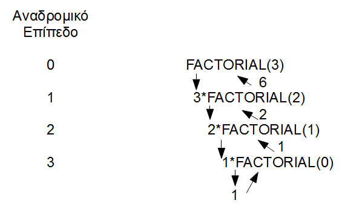
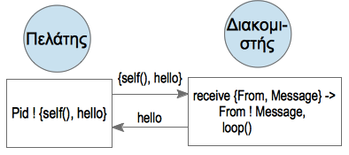
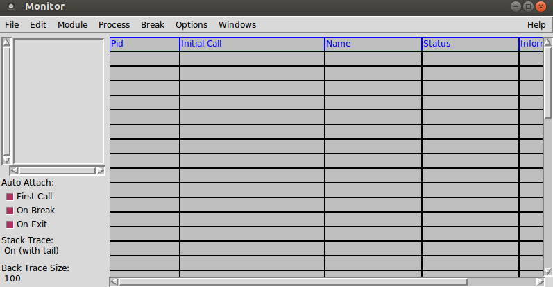
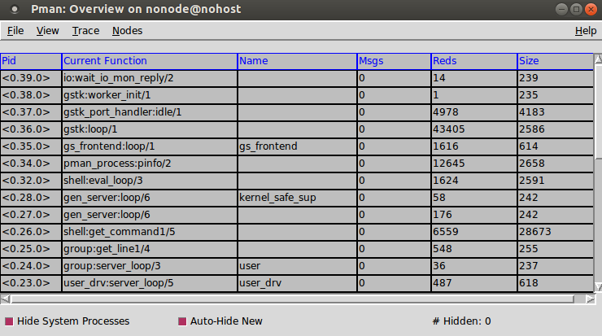

# Εισαγωγή στην Erlang {#Erlang} 
© Γιάννης Κωστάρας

---

Η Erlang, ή Ericsson Language, αναπτύχθηκε από την Ericsson για χρήση στις τηλεπικοινωνίες ήδη από τα μέσα της δεκαετίας του 1980 όταν καμία άλλη γλώσσα δεν κάλυπτε τις ανάγκες τους. Το 1999 δημοσιεύθηκε ως ανοικτού κώδικα και ιδρύθηκε το [http://erlang.org](http://erlang.org).  

Πρόκειται για μια _συναρτησιακή_ γλώσσα προγραμματισμού (βλ. LISP για τους παλαιότερους) όπως π.χ. οι Scala, Clojure, Haskell, OCaml κ.ά. σε αντίθεση με τις _προστακτικές (imperative)_ γλώσσες προγραμματισμού όπως οι C/C++, Pascal, Java, Python, Ruby κλπ. Τι σημαίνει αυτό; 

Στις συναρτησιακές γλώσσες προγραμματισμού, οι συναρτήσεις επιστρέφουν το αποτέλεσμα εφαρμόζοντας πράξεις στα ορίσματά τους _χωρίς_ να αλλάζουν την τιμή τους. Π.χ. στη Java αντικείμενα που η κατάστασή τους δεν αλλάζει μετά τη δημιουργία τους λέγονται _αμετάβλητα (immutable)_. Σε αντίθεση, οι διαδικαστικές (procedural) ή imperative γλώσσες προγραμματισμού εφαρμόζουν πράξεις στα ορίσματά τους αλλάζοντας όμως την κατάστασή τους. Η παραπάνω ιδιότητα των συναρτησιακών γλωσσών προγραμματισμού έχει πολύ μεγάλα πλεονεκτήματα όσoν αφορά τον πολυδιεργασιακό προγραμματισμό (multi-threading) καθώς δεν απαιτούν συγχρονισμό αφού δεν γίνεται διαμοιρασμός δεδομένων και άρα δεν υπάρχουν κρίσιμα τμήματα κώδικα. Επομένως, τμήματα κώδικα μπορούν να εκτελεστούν ταυτόχρονα από πολλά νήματα (threads) ή διεργασίες (processes) χωρίς πρόβλημα.

Στην Erlang εντολές του τύπου ```i++``` ή ```i=i+1``` δεν επιτρέπονται. Με άλλα λόγια, δεν επιτρέπεται η αλλαγή της τιμής μιας μεταβλητής μόλις αυτή οριστεί για πρώτη φορά.

Η Erlang είναι επίσης μια _δηλωτική (declarative)_ γλώσσα προγραμματισμού, όπως θα δούμε στη συνέχεια, δηλ. περιγράφεις _τι_ θέλεις να υπολογίσει κι όχι _πως_ να το υπολογίσει. 

Επίσης, οι συναρτήσεις της (ή closures) είναι κι αυτές τύποι δεδομένων που μπορούν να εκχωρηθούν σε μεταβλητές!

Αν ακόμα αναρωτιέστε γιατί γράφω για αυτήν τη σχετικά άγνωστη γλώσσα, θα αναφερθώ σε μερικές εφαρμογές που είναι γραμμένες σε Erlang:

* [CouchDB](http://couchdb.apache.org/), μια document-based ΒΔ που χρησιμοποιεί το [MapReduce](http://hadoop.apache.org/mapreduce/)
* [SimpleDB](http://aws.amazon.com/simpledb/), μια κατανεμημένη ΒΔ που χρησιμοποιείται από τα Amazon Web Services
* η εφαρμογή συνομιλιών (chat) του facebook καθώς και το πολύ γνωστό [Whatsapp](https://www.whatsapp.com/)!
* [Wings 3D](http://www.wings3d.com/), μια 3Δ εφαρμογή μοντελοποίησης
* [RabbitMQ](http://www.rabbitmq.com/), μια υλοποίηση του [Advanced Message Queuing Protocol (AMQP)](http://www.amqp.org/)

## Εγκατάσταση
Από το Ubuntu Software Center, ψάξτε για _erlang_ και θα βρείτε το πακέτο “Concurrent, real-time, distributed functional language” για εγκατάσταση. 
Αν θέλετε όμως την τελευταία έκδοση, τότε κατεβάστε τον πηγαίο κώδικα από τη διεύθυνση [http://www.erlang.org/download.html](http://www.erlang.org/download.html) και δώστε τις ακόλουθες εντολές μέσα στον κατάλογο που αποσυμπιέσατε τον πηγαίο κώδικα για να τον χτίσετε:
```bash
$ ./configure
$ make
$ sudo make install
```
Αν όλα πήγαν καλά, πρέπει να είστε έτοιμοι να ξεκινήσετε. Διαφορετικά, ελέγξτε το αρχείο ```INSTALL.md``` της διανομής που κατεβάσατε για τυχόν προβλήματα.

## Το περιβάλλον εργασίας
Προσδεθείτε λοιπόν, είμαστε έτοιμοι να ξεκινήσουμε! Ανοίξτε ένα κέλυφος και δώστε την εντολή:
```bash
$ erl
Erlang R13B03 (erts-5.7.4) [source] [rq:1] [async-threads:0] [hipe] [kernel-poll:false]

Eshell V5.7.4  (abort with ^G)
1>q().
ok
2> $
``` 
Αυτό είναι το αλληλεπιδραστικό περιβάλλον εργασίας. Η έκδοσή σας μπορεί να διαφέρει από την παραπάνω.
Κάθε εντολή της Erlang τελειώνει με την τελεία (```.```). Για να βγείτε από το περιβάλλον εργασίας δώστε την εντολή ```q().``` όπως φαίνεται παραπάνω.
Ο συντάκτης του κελύφους βασίζεται στον Emacs, οπότε όσοι έχετε δουλέψει μ' αυτόν θα βρείτε αρκετές [συντομεύσεις](http://sean.wenzel.net/docs/emacs/quick_reference/) χρήσιμες.

## Αριθμοί
Η γλώσσα υποστηρίζει τις βασικές αριθμητικές πράξεις, δηλ. ```+, -, *, /, div``` (ακέραια διαίρεση), ```rem``` (ακέραιο υπόλοιπο) ενώ δεν υπάρχει διαφορά μεταξύ ακεραίων και δεκαδικών. Ισχύουν φυσικά τα γνωστά για την προτεραιότητα των πράξεων.
```erlang
1> 5 + 2 * (15 div 4).
11
2> 2 * 3.14.
6.28
```
Η αναπαράσταση αριθμών σε βάση διαφορετική του δεκαδικού γίνεται με τη σύνταξη ```<βάση>#<αριθμός>```:
```erlang
3> 2#101.
5
4> 16#F. 
15 
```
Πειραματιστείτε με μερικούς πραγματικά μεγάλους αριθμούς για να δείτε πόσο γρήγορα εμφανίζονται τ' αποτελέσματα. Στην Erlang δεν υπάρχει υπερχείλιση. 
Η σύνταξη ```$a``` επιστρέφει τον ASCII κωδικό του ```a``` (δηλ. ```97```). 

## Σχόλια
```erlang
5> % This is a comment
5>
```
## Σταθερές
Οι σταθερές στην Erlang ονομάζονται _Atoms_ και μπορούν να είναι αλφαριθμητικά, αριθμοί κλπ. Ξεκινούν με μικρό γράμμα, ενώ αν θέλετε σώνει και καλά να ορίσετε μια σταθερά που να ξεκινά με κεφαλαίο γράμμα, ορίστε τη μέσα σε απλά ή διπλά εισαγωγικά, π.χ.:
```erlang
5> atom.
atom
6> 'Atom'. 
Atom
7> atom = 'bla'.
** exception error: no match of right hand side value bla
```
Όπως βλέπετε από την εντολή 7, μια σταθερά δεν μπορεί να λάβει άλλη τιμή. Από πλευράς απόδοσης, αποθηκεύονται σ' έναν πίνακα συστήματος ως 2 bytes ανεξάρτητα απ' το μέγεθός τους.
Σημειώστε ότι οι παρακάτω είναι δεσμευμένες λέξεις και επομένως δεν μπορούν να χρησιμοποιηθούν ως σταθερές:
```erlang
after and andalso band begin bnot bor bsl bsr bxor case catch cond div end fun if let not of or orelse query receive rem try when xor.
```
## Μεταβλητές
Οι μεταβλητές στην Erlang δηλώνονται με κεφαλαίο το πρώτο γράμμα:
```erlang
8> Var.
* 1: variable 'Var' is unbound
9> Var = 1.
1
10> Var = 2.
** exception error: no match of right hand side value 2
11> Var = Var + 1.
** exception error: no match of right hand side value 2
```
Οι παραπάνω εντολές μας δείχνουν ότι οι μεταβλητές στην Erlang είναι αμετάβλητες (immutable) δηλ. μπορούμε να εκχωρήσουμε μια τιμή σε μια μεταβλητή μόνο μια φορά. Αν προσπαθήσουμε να εκχωρήσουμε μια διαφορετική τιμή σε μεταβλητή επί της οποίας έχει ήδη εκχωρηθεί τιμή, τότε θα εμφανιστεί λάθος. Η εξήγηση είναι ότι ο τελεστής ```=``` παίζει το ρόλο της ταύτισης προτύπων (pattern matching) κι όχι της εκχώρησης, όπως σε άλλες γλώσσες προγραμματισμού, και άρα παραπονιέται όταν η τιμή αριστερά και δεξιά του δεν είναι ίσες. Έτσι η έκφραση ```X = X + 1``` είναι λάθος όπως ακριβώς μας έμαθε κι ο δάσκαλος των μαθηματικών. Επομένως, ```Pattern = Expression``` εκτιμά την έκφραση ```Expression``` και προσπαθεί να ταιριάξει το αποτέλεσμα με το πρότυπο ```Pattern```. (Άμα θέλετε να χρησιμοποιήσετε την ίδια μεταβλητή στο περιβάλλον εργασίας, δώστε την εντολή ```f().``` ώστε να ξεχάσει τις προηγούμενες εκχωρήσεις).
Το γεγονός ότι οι μεταβλητές στην Erlang είναι αμετάβλητες έχει τεράστια σημασία, όπως θα δούμε παρακάτω, στη συγγραφή πολυδιεργασιακών προγραμμάτων, καθώς δεν υπάρχει διαμοιραζόμενη μνήμη (shared memory) και τα επακόλουθα προβλήματα συγχρονισμού της, όπως σε άλλες γλώσσες (βλ. Java, C++, Ruby κλπ.)
Η Erlang είναι δυναμική γλώσσα, όπως η Ruby, δηλ. δεν χρειάζεται να δηλώσετε τον τύπο δεδομένων της μεταβλητής σας· τον καταλαβαίνει απ' τα συμφραζόμενα. 
Υπάρχουν φυσικά και λογικές σταθερές και λογικοί τελεστές (σημειώστε ότι τα ```true``` και ```false``` είναι atoms):
```erlang
12> true and false.
false
13> false or true.
true
14> true xor false.
true
15> not false.
true
```
Υπάρχουν οι ακόλουθοι τελεστές ισότητας:
```erlang
16> 5 =:= 5.
true
17> 1 =:= 0.
false
18> 1 =/= 0.  % άνισο
true
19> 5 =:= 5.0.
false
20> 5 == 5.0.
true
21> 5 /= 5.0.     % άνισο
false
```
και οι γνωστοί τελεστές σύγκρισης ```<, >, <=, >=```.
```erlang
22> 0 == false.
false
23> 1 < false.
true
```
Μάλλον θα τραβάτε τα μαλλιά σας απ' τις δυο τελευταίες εντολές. Σε πολλές γλώσσες, ```0 == false``` και ```1 == true```, όχι όμως στην Erlang. Η αλήθεια είναι ότι τα ```true``` και ```false``` είναι atoms. Και ισχύει η ακόλουθη σειρά μεταξύ τύπων δεδομένων:
```erlang
number < atom < reference < fun < port < pid < tuple < list < bit string
```
Θα μιλήσουμε για τους τύπους αυτούς στη συνέχεια του άρθρου.

## Πλειάδες (Tuples)
Μια πλειάδα στην Erlang δηλώνεται ως ```{Στοιχείο1, Στοιχείο2, ..., ΣτοιχείοN}``` όπου κάθε στοιχείο μπορεί να είναι διαφορετικού τύπου. Η διαφορά τους από τις λίστες, που θα δούμε στη συνέχεια, είναι ότι οι πλειάδες έχουν σταθερό μήκος, δηλ. δεν μπορούμε να προσθέσουμε ή ν' αφαιρέσουμε στοιχεία απ' αυτές αφότου τις δηλώσουμε.
```erlang
24> Point = {0.0, 5.0}.
{0.0,5.0}
25> {X,Y} = Point.
{0.0,5.0}
26> X.
0.0
```
Θα μπορούσαμε να αντιστοιχίσουμε την πλειάδα με έναν πίνακα κατακερματισμού (HashMap) όπου τα κλειδιά είναι atoms π.χ.
```erlang
27> {points, {p1,{10.0,0.0}}, {p2,
{0.0,5.0}}}.
{points,{p1,{10.0,0.0}},{p2,{0.0,5.0}}}
```
Πώς όμως μπορούμε να προσπελάσουμε τα στοιχεία της πλειάδας; Όπως μόλις είδαμε, χωρίς να το αναφέρουμε, στη γραμμή 25 πιο πάνω, με τη χρήση pattern matching.
```erlang
28> Points={points,{p1,{10.0,0.0}}, {p2,{0.0,5.0}}}.
29> {points, {p1,{P1X,P1Y}}, {p2,
{_,_}}} = Points.
30> P1X.
10.0
```
Καθώς ένα atom (π.χ. ```points```, ```p1```) ταιριάζει με τον εαυτό του, το μόνο που μένει είναι να ταιριάξει τις μεταβλητές ```P1X, P1Y```. Το ```_``` απλά δηλώνει ότι δεν μας ενδιαφέρουν οι αντίστοιχες τιμές.
Όταν το πρώτο στοιχείο μιας πλειάδας είναι ένα atom, λέμε ότι αποτελεί την ετικέτα της πλειάδας, π.χ. ```{person, 'Yiannis', 'Kostaras'}```. 

## Λίστες
Οι λίστες είναι οι πιο χρήσιμες δομές δεδομένων στις συναρτησιακές γλώσσες καθώς χρησιμοποιούνται για να επιλύσουν πολλά είδη προβλημάτων. Οι λίστες μπορούν να περιλαμβάνουν τα πάντα: αριθμούς, σταθερές, πλειάδες κλπ. Η σύνταξή της είναι ```[Στοιχείο1, Στοιχείο2, ..., ΣτοιχείοN]``` και όπως ειπώθηκε, κάθε Στοιχείο μπορεί να ανήκει σε διαφορετικό τύπο δεδομένων:
```erlang
27> [1, 2, 3, {point,[5.0,-6.0]}, 3.14, atom].
[1,2,3,{point,[5.0,-6.0]},3.14,atom]
28> [97, 98, 99].
"abc"
```
Η τελευταία εντολή πρέπει να σας μπέρδεψε τελείως. Όπως βλέπετε, τους διαχειρίζεται ως ASCII κωδικούς αντί για  αριθμούς. Αυτό είναι ένα θέμα με τη γλώσσα. Αν της πείτε να τυπώσει μόνο αριθμούς που αντιστοιχούν σε γράμματα, τότε τυπώνει τα γράμματα γιατί τους μεταφράζει σε κωδικούς ASCII. Κι αυτό γιατί στην πραγματικότητα δεν υπάρχουν αλφαριθμητικά στην Erlang· τα αλφαριθμητικά είναι λίστες ακεραίων αριθμών! Δηλαδή το αλφαριθμητικό ```"abc"``` είναι στην ουσία η λίστα ```[97, 98, 99]```. Με άλλα λόγια, αν θέλετε να κάνετε επεξεργασία αλφαριθμητικών, τότε καλύτερα να απευθυνθείτε σε άλλες γλώσσες προγραμματισμού που τα καταφέρνουν καλύτερα σ' αυτό τον τομέα όπως Perl, Python, Ruby κ.ά.
Υποστηρίζονται οι παρακάτω πράξεις: ```++, --``` οι οποίες εκτελούνται από δεξιά προς τ' αριστερά.
```erlang
29> [1,2,3] ++ [4,5].
[1,2,3,4,5]
30> [1,2,3,4,5] -- [1,2,3].
[4,5]
```
Το πρώτο στοιχείο μιας λίστας ονομάζεται _Κεφαλή (Head)_ και τα υπόλοιπα στοιχεία _Ουρά (Tail)_:
```erlang
31> hd([1,2,3,4,5]).
1
32> tl([1,2,3,4,5]).
[2,3,4,5]
33> [Head|Tail] = [1,2,3,4,5].
[1,2,3,4,5]
34> Head.
1
35> Tail.
[2,3,4,5]
36> [3 | []].
[3]
37> [2 | [3 | []]].
[2,3]
38> [1 | [2 | [3 | []] ] ].
[1,2,3]
39> [1 | [2, 3] ].
[1,2,3]
```
Ο τελεστής ```|``` ονομάζεται ```cons``` (constructor – κατασκευαστής/δημιουργός) και χρησιμοποιείται για να δημιουργεί μια λίστα από κεφαλή και ουρά. 
Το ```module lists``` (θα μιλήσουμε για την έννοια του ```module``` παρακάτω) παρέχει μια πληθώρα από συναρτήσεις πάνω στις λίστες:
```erlang
40> lists:max([1,2,3]).
3
41> lists:reverse([1,2,3]).
[3,2,1]
42> lists:sort([2,1,3]).
[1,2,3]
43> lists:split(2,[1,2,3,4]).
{[1,2],[3,4]}
44> lists:sum([1,2,3]).
6
45> lists:zip([1,2,3],[5,6,7]).
[{1,5},{2,6},{3,7}]
46> lists:delete(2,[1,2,3,2,4,2]).
[1,3,2,4,2]
47> lists:last([1,2,3]).
3
48> lists:member(5,[1,2,3]).
false
49> lists:nth(2,[3,4,10,7,9]).
4
50> length([1,2,3]).
3
```
Παρατηρήστε ότι η ```length``` είναι ενσωματωμένη στις βιβλιοθήκες συναρτήσεων της γλώσσας οι οποίες λέγονται _Build-In Functions_ (ή _BIFs_). Άλλες BIFs είναι οι ```hd``` και ```tl``` που είδαμε πιο πάνω.

## Δομές ελέγχου
Η γλώσσα υποστηρίζει δυο δομές ελέγχου ροής, την ```case``` και την ```if```. 
```erlang
if
  Guard1 ->
    Sequence1 ;
  Guard2 ->
    Sequence2 ;
  ...
end

51> X = 10.
10
52> if 
52>   X > 0 -> 2*X;
52>   X < 0 -> X/2;
52>   true -> 0
52> end.
20.
```
Η τελευταία συνθήκη θα μπορούσε να γραφτεί και ως ```X==0 -> 0```.
Η ```case``` συντάσσεται ως εξής:
```erlang
case Expr of
  Pattern1 [when Guard1] -> Seq1;
  Pattern2 [when Guard2] -> Seq2;
  ...
  PatternN [when GuardN] -> SeqN
end

53> Greeting = "morning".
"morning"
54> case Greeting of 
54>  morning -> "good morning";
54>  afternoon -> "good afternoon";
54>  evening -> "good evening";
54>  _ -> "good day"
54> end.
"good morning"
```
Το underscore (```_```) παίζει το ρόλο του _default_ σε άλλες γλώσσες προγραμματισμού. 

## Συναρτήσεις
Οι συναρτήσεις στην Erlang ορίζονται μέσα σε modules. H Erlang διαθέτει ένα σύστημα τμηματοποίησης που μας επιτρέπει να χωρίζουμε μεγάλα προγράμματα σε μικρότερα για ευκολότερη διαχείριση. Κάθε τέτοιο _τμήμα (module)_ έχει το δικό του _χώρο ονομασίας (name space)_ οπότε μπορούμε να χρησιμοποιούμε τα ίδια ονόματα συναρτήσεων με άλλων τμημάτων χωρίς πρόβλημα. Τα modules επομένως, είναι κάτι αντίστοιχο με τα πακέτα (packages) της Java ή των χώρων ονομασίας (namespaces) της C++, και αποθηκεύονται σε αρχεία με κατάληξη ```.erl```. Ας δούμε ένα παράδειγμα. Αντιγράψτε το ακόλουθο πρόγραμμα στον αγαπημένο σας κειμενογράφο και αποθηκεύστε το σ' ένα αρχείο με όνομα ```myecho.erl```:
```erlang
-module(myecho).
-export([echo/1]).
echo(Message) -> 
  Message.
```
Το παραπάνω module ονομάζεται ```myecho``` και αποθηκεύεται στο αρχείο ```myecho.erl```. Η διεπαφή του με τον έξω κόσμο δηλώνεται με την εντολή ```export``` η οποία δηλώνει μια συνάρτηση που είναι διαθέσιμη στον έξω κόσμο που ονομάζεται ```echo``` και δέχεται μια μόνο παράμετρο (```/1```). Στη συνέχεια ακολουθεί η υλοποίηση της συνάρτησης η οποία δέχεται το όρισμά της στη μεταβλητή ```Message``` (προσέξτε το πρώτο γράμμα να είναι κεφαλαίο) και απλά σαν έξοδο επιστρέφει το περιεχόμενο της ```Message```. Μπορείτε να ορίσετε κι άλλες συναρτήσεις σ' αυτό το module αλλά από τη στιγμή που δεν τις δηλώσετε στην export αυτές είναι εσωτερικές στο module.
Μεταφερθείτε στον κατάλογο που αποθηκεύσατε το αρχείο σας και μεταγλωττίστε το:
```erlang
55> cd("/home/john/erlang/").
/home/john/erlang/
ok
56> c(myecho).
{ok,myecho}
57> myecho:echo(dirlada).
dirlada
```
Το αποτέλεσμα της μεταγλώττισης είναι η δημιουργία ενός αρχείου ```.beam```. Η εκτέλεσή του γίνεται παραθέτοντας ```<το όνομα του module> : <το όνομα της συνάρτησης με τα ορίσματά της>```. 
Ας δούμε και το παρακάτω πρόγραμμα μετατροπής θερμοκρασιών από Fahrenheit σε Celsius και αντίστροφα:
```erlang
-module(temperature).
-export([convert/2]).

convert({fahrenheit, Temp}, celsius) ->
  {celsius, 5 * (Temp - 32) / 9};
convert({celsius, Temp}, fahrenheit) ->
  {fahrenheit, 32 + Temp * 9 / 5};
convert({X, _}, Y) ->
  {cannot,convert,X,to,Y}.
``` 
Μεταγλωττίστε το κατά τα γνωστά:
```erlang
58> c(temperature).
{ok,temperature}
59> temperature:convert({celsius, 23}, fahrenheit).
{fahrenheit,73.4}
```
Παρατηρήστε πως δουλεύει το pattern matching:
```erlang
{celsius, Temp}, fahrenheit = {celsius, 23}, fahrenheit
Temp <-> 23
```
και πως έτσι επιλέγεται το πρώτο μέρος της συνάρτησης ```convert```.

## Αναδρομή
Όπως γνωρίζετε, μια συνάρτηση (υποπρόγραμμα) μπορεί να κληθεί από μια άλλη συνάρτηση αλλά ακόμα και από την ίδια συνάρτηση. Στη δεύτερη περίπτωση η συνάρτηση λέγεται _αναδρομική_ γιατί καλεί το εαυτό της. Η αναδρομή πολλές φορές απλοποιεί την επίλυση δύσκολων προβλημάτων με λίγες μόνο εντολές. Στην Erlang οι αναδρομικές συναρτήσεις προκύπτουν από το συνδυασμό ταιριάσματος προτύπων (pattern matching) και συναρτήσεων. 
Ας δούμε ένα παράδειγμα, τον υπολογισμό του παραγοντικού ενός φυσικού αριθμού ```Ν```: 

* Αν ```Ν=0``` τότε ```Ν! = 1```
* Αν ```Ν>0``` τότε ```Ν! = Ν*(Ν-1)!```

Από τα παραπάνω βλέπουμε ότι για να υπολογίσουμε το παραγοντικό του ```Ν``` θα πρέπει πρώτα να υπολογίσουμε το παραγοντικό του ```Ν-1```. Για να υπολογίσουμε το παραγοντικό του ```Ν-1``` χρειάζεται πρώτα να υπολογίσουμε το παραγοντικό του ```Ν-2``` κ.ο.κ. μέχρις ότου φθάσουμε σε μια συνθήκη όπου μπορούμε να υπολογίσουμε το παραγοντικό, η οποία λέγεται συνθήκη διακοπής, και στο παραπάνω παράδειγμα είναι το ```0!=1```. Σημειώστε ότι χωρίς συνθήκη διακοπής το πρόγραμμα μπαίνει σε ατέρμονα βρόγχο. Ο προσεκτικός αναγνώστης θα παρατηρήσει ότι δε λάβαμε υπόψιν όταν το ```Ν < 0```. Αφήνεται ως άσκηση.
Δημιουργήστε ένα νέο αρχείο ```recursion.erl```:
```erlang
-module(recursion).
-export([factorial/1]).
factorial(0) ->
    1;
factorial(N) ->
    N * factorial(N – 1).
```
Κατ' αρχήν κοιτάξτε πόσο μικρό είναι το πρόγραμμα και πως αντιστοιχίζεται με τη θεωρία. Επίσης παρατηρήστε ότι η συνάρτηση ```factorial``` αποτελείται από δυο μέρη που χωρίζονται με ```;```. Αν το όρισμα που θα την καλέσουμε είναι ```0```, τότε καλείται ο πρώτος ορισμός, διαφορετικά γίνεται ταίριασμα με τον δεύτερο ορισμό και υπολογίζεται το παραγοντικό αναδρομικά.
```erlang
60> cd("/home/john/erlang/").
/home/john/erlang/
ok
61> c(recursion).
{ok,recursion}
62> recursion:factorial(3).
6
```
Ας δούμε πως δουλεύει (βλ. Σχήμα 1).



**Σχήμα 1** _Παρουσίαση της εκτέλεσης της αναδρομής_

Κάθε νέα κλήση της ```factorial``` αυξάνει το αναδρομικό επίπεδο. Ο μεταγλωττιστής αποθηκεύει τις τιμές της παραμέτρου ```Ν``` της συνάρτησης όπως επίσης και οποιασδήποτε τοπικής μεταβλητής πριν από κάθε νέα κλήση. Κατά τη διάρκεια της κλήσης υπολογίζεται η έκφραση ```Ν-1``` και καταχωρείται ως η νέα τιμή της παραμέτρου ```Ν```. Τελικά, η παράμετρος ```Ν``` θα γίνει ```0``` και θα δοθεί η τιμή ```1``` ως αποτέλεσμα της ```factorial``` (προς τα πίσω διαδικασία). Στη συνέχεια, ο μεταγλωττιστής επιστρέφει από κάθε αναδρομικό επίπεδο και υπολογίζει την τρέχουσα τιμή της ```factorial``` πολλαπλασιάζοντας την παράμετρο που έχει αποθηκεύσει σ' αυτό το επίπεδο με την τιμή της ```factorial``` του προηγούμενου επιπέδου. Κατ' αυτόν τον τρόπο επιστρέφουμε στο αρχικό επίπεδο (προς τα εμπρός διαδικασία). Στο σχήμα 1 υπάρχουν 4 αναδρομικά επίπεδα (0-3) και 3 αναδρομικές κλήσεις της ```factorial``` συν την αρχική κλήση.
Αυτό που εντυπωσιάζει ότι το πόσο γρήγορα υπολογίζει η Erlang το παραγοντικό μεγάλων αριθμών. Συγκρίνετέ τη με τον υπολογισμό του παραγοντικού από γλώσσες όπως η Java ή η Ruby.
Οι αριθμοί fibonacci είναι άλλο ένα κλασικό παράδειγμα αναδρομής:

* ```F(0) = 0```
* ```F(1) = 1```
* Αν ```Ν>1``` τότε ```F(Ν) = F(Ν-1) + F(N-2)```

Τροποποιήστε το πρόγραμμα ```recursion``` ως εξής:
```erlang
-module(recursion).
-export([factorial/1]).
-export([fib/1]).

% N!
factorial(0) ->
    1;
factorial(N) ->
    N * factorial(N - 1).

% fib(N) = fib(N-1) + fib(N-2)
fib(0) -> 0;
fib(1) -> 1;
fib(N) -> fib(N-1) + fib(N-2).
```
```erlang
63> c(recursion).
{ok,recursion}
64> recursion:fib(12).
144
```
Για λίγο μεγαλύτερους αριθμούς όμως η αναδρομή δεν αποτελεί τον πιο αποτελεσματικό τρόπο επίλυσης ενός προβλήματος όπως μπορείτε να πειραματιστείτε με το παραπάνω πρόγραμμα. Συνήθως, αλγόριθμοι με χρήση βρόγχων είναι πιο γρήγοροι. Παρόλ' αυτά ο παρακάτω αλγόριθμος υπολογισμού των αριθμών Fibonacci αποδεικνύεται ικανοποιητικά γρήγορος:

* ```F(0) = 0```
* ```F(1) = 1```
* Αν ```Ν>1``` τότε:
  * ```F(2N) = 2F(N-1)*F(N) + F(N)*F(N)```
  * ```F(2N-1) = F(N)*F(N) + F(N-1)*F(N-1)```

Προσθέστε ακόμα μια συνάρτηση στο ```module recursion```, την ```fastfib``` και προσθέστε τον κώδικά της στο τέλος του αρχείου:
```erlang
fastfib(0) -> 0;
fastfib(1) -> 1;
% F(2N) = 2F(N-1)*F(N) + F(N)*F(N)
fastfib(N) when N rem 2 == 0 ->
  FN = fastfib(N div 2),
  2*FN*fastfib(N div 2-1) + FN*FN;
% F(2N+1) = F(N)*F(N) + F(N+1)*F(N+1)
% F(2N-1) = F(N)*F(N) + F(N-1)*F(N-1)
fastfib(N) ->
  FN = fastfib((N-1) div 2),
  FN_1 = fastfib((N+1) div 2),
  FN*FN + FN_1*FN_1.
```
Παρατηρήστε τη συνθήκη φρουρό ```fastfib(N) when N rem 2 == 0``` όταν ο ```Ν``` είναι ζυγός αριθμός για να ξεχωρίσουμε πότε να χρησιμοποιηθεί το ένα σκέλος της συνάρτησης και πότε το άλλο καθώς και τα δυο δέχονται ίδιο αριθμό παραμέτρων. Μπορούμε να έχουμε πολλές συνθήκες σ' έναν φρουρό οι οποίες μπορούν να διαχωρίζονται με κόμμα (```,```) που σημαίνει ότι θα επιστρέψει true αν όλες οι συνθήκες επιστρέψουν ```true``` (σύζευξη), ή με ελληνικό ερωτηματικό (```;```) που θα επιστρέψει ```true``` αν οποιαδήποτε συνθήκη επιστρέψει ```true``` (διάζευξη).
Επίσης, μέσα στο ίδιο μπλοκ οι εντολές χωρίζονται με κόμμα (```,```). 
```erlang
65> c(recursion).
{ok,recursion}
66> recursion:fib(45).
1134903170
```
Μπορούμε να συγκρίνουμε τους δυο αλγορίθμους με τη χρήση της συνάρτησης συστήματος ```timer:tc(Module, Function, Arguments)``` η οποία επιστρέφει μια πλειάδα με το χρόνο σε microseconds και το αποτέλεσμα της συνάρτησης: 
```erlang
67> timer:tc(recursion, fib, [45]).
{208335434,1134903170}
68> timer:tc(recursion, fastfib, [45]).
{21,1134903170}
```
Στο μηχάνημά μου, η ```fib``` πήρε 208 δευτερόλεπτα για να εκτελεστεί ενώ η ```fastfib``` 21 μsecs!!!
Ως άσκηση για τον αναγνώστη αφήνεται η επίλυση του παρακάτω αναδρομικού προβλήματος:

* ```S(1) = 1```
* Αν ```Ν>1``` τότε ```S(Ν) = N + S(Ν-1)```

το οποίο υπολογίζει το άθροισμα: ```1+2+...N```.
Γράψτε τις παραπάνω συναρτήσεις σε C ή Java και συγκρίνετε πόσες παραπάνω γραμμές κώδικα χρειάζεστε (για να μη μιλήσω για απόδοση)!

## Πολυεπεξεργασία
Ίσως το πιο δυνατό σημείο της γλώσσας είναι οι δυνατότητες πολυεπεξεργασίας της. Η διαφορά της εικονικής μηχανής της Erlang από άλλες εικονικές μηχανές είναι ότι η πολυεπεξεργασία παρέχεται από την ίδια την εικονική μηχανή κι όχι από το λειτουργικό σύστημα. Έτσι, μας δίνεται η δυνατότητα να δημιουργήσουμε χιλιάδες ή ακόμα και εκατομμύρια διεργασίες που να εκτελούνται παράλληλα χωρίς πρόβλημα. Οι διεργασίες επικοινωνούν μεταξύ τους μέσω ασύγχρονων μηνυμάτων. 
Η πολυεπεξεργασία γίνεται με τις ακόλουθες εντολές:

* ```spawn```: ξεκινά μια διεργασία 
* ```(!) send```: στέλνει ένα μήνυμα σε μια διεργασία 
* ```receive```: λαμβάνει ένα μήνυμα από μια διεργασία.

Μπορείτε να δημιουργήσετε μια διεργασία με την εντολή ```spawn(Module, Function, Parameters)``` περνώντας της ως ορίσματα το module, τη συνάρτηση και τυχόν ορίσματα της συνάρτησης με τη μορφή λίστας, π.χ.:
```Pid = spawn(recursion, fastfib, [N]).```
και μας επιστρέφει το PID ή Process ID της διεργασίας που δημιούργησε.
Οι διεργασίες επικοινωνούν μεταξύ τους με μηνύματα. Π.χ.
```erlang
69> Pid=self().
<0.33.0>
70> Pid ! hello.
hello
71> Pid ! "hello again".
"hello again"
72> flush().
Shell got hello
Shell got "hello again"
ok
```
Η BIF ```self()``` μας επιστρέφει το pid της τρέχουσας διεργασίας που δεν είναι άλλη από το κέλυφος της Erlang. Σ' αυτήν στέλνουμε το μήνυμα ```hello``` και το ```hello again```. Τα μηνύματα αυτά καταλήγουν στο γραμματοκιβώτιο του κελύφους. Η εντολή ```flush()``` καθαρίζει το γραμματοκιβώτιο.
Η λήψη και επεξεργασία των μηνυμάτων γίνονται με τη μέθοδο ```receive()``` που περιέχει εντολές σε στυλ ```case```:
```erlang
receive
  Pattern1 [when Guard1] -> Seq1;
  Pattern2 [when Guard2] -> Seq2;
  ...
  PatternN [when GuardN] -> SeqN
end
```
Η ```receive``` είναι μια μέθοδος η οποία 'ακούει' για μηνύματα. Κάθε διεργασία έχει τη δική της ουρά λήψης μηνυμάτων. Κάθε νέο μήνυμα εισάγεται στο τέλος της ουράς. Όταν εκτελείται η receive, το πρώτο μήνυμα της ουράς προσπαθεί να ταυτιστεί με κάποιο από τα πρότυπα της ```receive```, κι όταν συμβεί κάτι τέτοιο τότε απομακρύνεται από την ουρά και εκτελείται, διαφορετικά σε περίπτωση μη ταιριάσματος με κανένα πρότυπο παραμένει στην ουρά και το επόμενο μήνυμα ακολουθεί την ίδια διαδικασία.
Ας δούμε ένα παράδειγμα ενός echo server ο οποίος επιστρέφει στον καλούντα το μήνυμα που του απέστειλε.
```erlang
-module(echo).
-export([start/0, loop/0]).
start() ->
  spawn(echo, loop, []).
loop() ->
  receive
   {From, Message} ->
  From ! {reply, Message},
     io:format("Received: ~p, Sent: ~p~n", [Message, Message]),
  loop()
  end.
```  
Η μέθοδος ```start()``` ξεκινά μια νέα διεργασία με την εντολή ```spawn(Module, Function, Parameters)``` και επιστρέφει το process id (ή pid) της όπως φαίνεται παρακάτω. Αυτή η διεργασία-παιδί ξεκινά να εκτελείται στη συνάρτηση ```loop/0``` και πηγαίνει σε αναμονή με το που φθάνει στην εντολή ```receive``` καθώς το γραμματοκιβώτιό της είναι άδειο.
```erlang
73> c(echo).
{ok,echo}
74> Pid = echo:start().
<0.38.0>
75> Pid ! {self(), hello}.
Received: hello, Sent: hello
{<0.31.0>,hello}
```
Για να στείλουμε ένα μήνυμα σ' αυτή τη διεργασία, χρησιμοποιούμε την πιο πάνω εντολή (75). Στη διεργασία με pid Pid (δηλ. την ```<0.38.0>```) στέλνουμε την πλειάδα ```{self(), hello}``` δηλ. το pid της τρέχουσας διεργασίας (που στην περίπτωσή μας είναι το κέλυφος ```erl```) και το μήνυμα ```hello```. 
Η ```receive``` ακούει συνεχώς για μηνύματα. Η παραπάνω πλειάδα ταυτίζεται με τη ```{From, Message} <-> {self(), hello}``` η οποία απλά στέλνει το ```Message (hello)``` πίσω στην τρέχουσα διεργασία (```From <-> self()```) υπό τη μορφή πλειάδας ```{reply, Message}```. Στην περίπτωσή μας, το κέλυφος λαμβάνει το μήνυμα και τυπώνει ```{<0.31.0>,hello}```, όπου ```<0.31.0>``` είναι το pid του κελύφους.
Η ```loop()``` καλεί τη ```receive``` για να ελέγξει αν ήρθε κάποιο μήνυμα η οποία ξανακαλεί τη ```loop()``` αναδρομικά αναμένοντας στη ```receive``` για το επόμενο μήνυμα.



**Σχήμα 2** _Απεικόνιση πολυεπεξεργασίας echo server_ 

Συνήθως καταχωρούμε ψευδώνυμα στα pids με την BIF ```register(Alias, Pid)``` και εργαζόμαστε μ' αυτά. 
```erlang
76> register(echo, echo:start()).
true
77> whereis(echo).
<0.42.0>
78> echo ! {self(), hello}.
Received: hello, Sent: hello
{<0.31.0>,hello}
```
Ας δούμε ακόμα ένα παράδειγμα, το πρόγραμμα fibonacci.
```erlang
-module(concur_fib).
-export([start/0, loop/0]).
-import(recursion, [fastfib/1]).
start() ->
  spawn(concur_fib, loop, []).
loop() ->
  receive
   {From, N} ->
  F = fastfib(N),
  From ! {reply, F},
  io:format("Received: ~p, Replied: ~p~n", [N, F]),
  loop()
  end.
```
Η ```import``` είναι αντίστροφη της ```export``` και εισάγει συναρτήσεις από άλλα modules (στη συγκεκριμένη περίπτωση την ```fastfib``` του module ```recursion```). Από εκεί και πέρα το πρόγραμμα δεν κρύβει εκπλήξεις.
```erlang
79> f().
ok
80> c(concur_fib).
{ok,concur_fib}
81> Pid = concur_fib:start().
<0.94.0>
82> Pid ! {self(), 50}.
Received: 50, Replied: 12586269025
{<0.94.0>,50}
```
Όπως καταλαβαίνετε, μπορείτε να ξεκινήσετε πολλές διεργασίες που θα υπολογίζουν τους αριθμούς fibonacci. Επίσης, η Erlang σας επιτρέπει να διαμοιράσετε τις διεργασίες σας σε διαφορετικούς υπολογιστές (βλ. π.χ. [1-6]).
Μπορείτε να δείτε ποιες διεργασίες τρέχουν στην εικονική μηχανή σας δίνοντας την εντολή ```processes()```. Οι εντολές ```i()``` και ```regs()``` εμφανίζουν ποια συνάρτηση εκτελεί κάθε διεργασία.

# Ολοκληρωμένα Περιβάλλοντα Εργασίας
Δυστυχώς, δεν υπάρχουν. Η γλώσσα υποστηρίζεται αφού κατεβάσετε το κατάλληλο plugin για το [Eclipse](http://www.eclipse.org/) ([erlide](http://erlide.org/)) και το [Intellij IDEA](http://www.jetbrains.com/idea/). Για το [NetBeans](http://www.netbeans.org/), το διαθέσιμο plugin, [ErlyBird](http://sourceforge.net/projects/erlybird/), έχει σταματήσει να αναπτύσσεται από το 2009, οπότε αν κάποιος από εσάς έχει την όρεξη και το χρόνο ας με βοηθήσει να το προχωρήσουμε.
Δεν πρέπει να παραλείψουμε και τον γραφικό αποσφαλματωτή που έρχεται μαζί με το περιβάλλον της γλώσσας:
```erlang
83> debugger:start().
```



**Εικόνα 3** _Erlang debugger_

Το module σας θα πρέπει να μεταγλωττιστεί με την ένδειξη ```debug_info```. Αυτό μπορεί να επιτευχθεί με δυο τρόπους: είτε από ένα κέλυφος με την εντολή:
```erlang
$ erlc +debug_info Module.erl
```
είτε από το περιβάλλον της Erlang:
```erlang
1> c(Module, [debug_info]).
2> compile:file(exception, [debug_info]).
```
Επιλέξτε το μενού ```Module → Interpret``` και φορτώστε το ```erl``` αρχείο. Όταν εκτελέσετε το πρόγραμμά σας αυτό θα εμφανιστεί στον debugger. Κάντε διπλό κλικ πάνω στο Pid του για εμφανιστεί ένα παράθυρο απ' όπου μπορείτε να δείτε τις τιμές των μεταβλητών και να εκτελέσετε το πρόγραμμα γραμμή-γραμμή.
Για την αποσφαλμάτωση των παράλληλων προγραμμάτων, υπάρχει ο _Process Manager_ (βλ. Εικόνα 4). 



**Εικόνα 4** _Process Manager_

Για να τον εκκινήσετε, στο κέλυφος δώστε:
```erlang
3> pman:start().
```
Η έξοδος είναι παρόμοια με αυτή της εντολής ```i()```. Κάντε διπλό κλικ σε μια διεργασία για ν' ανοίξετε το παράθυρο ανίχνευσης όπου μπορείτε να ανιχνεύσετε όλα τα μηνύματα που έστειλε/έλαβε η διεργασία.

## Άσκηση
Γράψτε σε Erlang το παιχνίδι πέτρα-ψαλίδι-χαρτί.  Κάθε παίχτης επιλέγει να παίξει _πέτρα (Ρ), ψαλίδι (S), χαρτί (X)_. Η πέτρα νικάει το ψαλίδι, το ψαλίδι νικάει το χαρτί και το χαρτί νικάει την πέτρα. 

* Είσοδος: ```[["Giannis","S"], ["Kostas","P" ]]```
* Έξοδος: ```["Kostas","P"] wins since P>S```

Δημιουργήστε μια διεργασία που να καλεί τη συνάρτηση αυτή και να της επιστρέφει τ' αποτελέσματα του υπολογισμού της.

## Επίλογος
Σ' αυτό το άρθρο δώσαμε μια εισαγωγή στο συναρτησιακό προγραμματισμό με τη σχετικά άγνωστη συναρτησιακή γλώσσα προγραμματισμού πραγματικού χρόνου Erlang. Γνωρίσαμε το συντακτικό της καθώς και τις δυνατότητές της για πολυεπεξεργασία (concurrency) που είναι και το πιο δυνατό της στοιχείο. Βέβαια, στις λίγες σελίδες αυτού του άρθρου είναι αδύνατο να καλύψουμε όλες τις δυνατότητες τις γλώσσας, όπως π.χ. η διαχείριση λαθών, οι βιβλιοθήκες OTP, κ.ά. αλλά πλέον έχετε τις βάσεις για να ανατρέξετε στη βιβλιογραφία για περαιτέρω μελέτη.  
Αξίζει στο σημείο αυτό να αναφέρουμε το έργο ErLLVM [11] του ΕΜΠ για τη χρήση μιας _Χαμηλού Επιπέδου Εικονικής Μηχανής - Low Level Virtual Machine (LLVM)_ προς μια _Erlang Υψηλής Απόδοσης – High Performance Erlang (HiPE)_.
Είτε χρειάζεστε μια γλώσσα για να  εκτελέσετε επιστημονικούς υπολογισμούς, είτε μια γλώσσα για να εκμεταλλευτείτε όλους τους επεξεργαστές του υπερσύγχρονου συστήματός σας, η Erlang είναι μια πολύ ενδιαφέρουσα και πρωτότυπη γλώσσα που μπορεί να σας λύσει τα χέρια με πολύ λίγες γραμμές κώδικα.

## Πηγές:
1. [Getting started with Erlang User's Guide, v. 5.9](http://www.erlang.org/doc/getting_started/users_guide.html) (2011). 
2. [Erlang Reference Manual User's Guide, v. 5.9](http://www.erlang.org/doc/reference_manual/users_guide.html) (2011).
3. [Learn you some Erlang](http://learnyousomeerlang.com/). 
4. [3 Free E-Books and a Tutorial on Erlang](http://www.readwriteweb.com/hack/2011/05/free-e-books-on-erlang.php).  
5. Armstrong J. (2013), _Programming Erlang_, 2nd Edition, Pragmatic.
6. Cesarini F. & Thompson S. (2009), [Erlang Programming](http://en.wikibooks.org/wiki/Erlang_Programming), O'Reilly.
7. Laurent S. (2013), _Introducing Erlang_, O'Reilly.
8. Tate B. (2010), _Seven languages in seven weeks: A Pragmatic guide to learning programming languages_, Pragmatic. 
9. [Fibonacci calculator](http://www.tools4noobs.com/online_tools/fibonacci/). 
10. [Fast Fibonacci algorithms](http://nayuki.eigenstate.org/page/fast-fibonacci-algorithms). 
11. [ErLVVM](http://erllvm.softlab.ntua.gr/). 

---