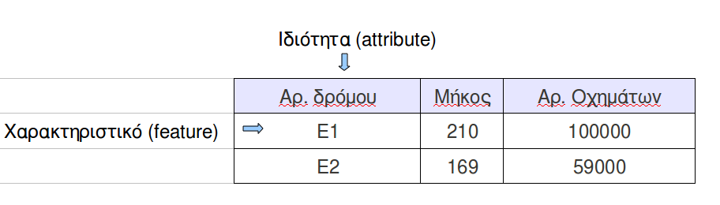

# Γεωγραφικά Συστήματα Πληροφοριών {#GIS}
© Γιάννης Κωστάρας

---
Ο όρος Γεωγραφικά  Συστήματα Πληροφοριών (Geographic Information Systems –  GIS) αναφέρεται σε κάθε σύστημα Η/Υ  που έχει τη
δυνατότητα να χειρίζεται γεωγραφικά  δεδομένα [1]. Δεν περιλαμβάνει μόνο λογισμικό και υλικό,  αλλά και ειδικές συσκευές για
εισαγωγή και δημιουργία  χαρτών, καθώς και τα συστήματα  επικοινωνιών που απαιτούνται για να συνδέσουν  τα διάφορα συστατικά
μεταξύ τους.

Σε σύγκριση με τους  απλούς χάρτες, ένα σύστημα GIS έχει  το πλεονέκτημα ότι η αποθήκευση των  δεδομένων γίνεται χωριστά από
την αναπαράστασή  τους. Αυτό έχει  σαν αποτέλεσμα τα  ίδια δεδομένα να μπορούν  να αναπαρασταθούν με  διαφορετικούς τρόπους.
Π.χ. μπορούμε να μεγεθύνουμε τον (ψηφιακό πλέον) χάρτη,  να εμφανίσουμε συγκεκριμένες μόνο περιοχές, να κάνουμε υπολογισμούς
αποστάσεων μεταξύ τοποθεσιών, να δημιουργήσουμε πίνακες που να  δείχνουν τα διάφορα χαρακτηριστικά του χάρτη, να υπερθέσουμε
επιπλέον πληροφορία  πάνω στο  χάρτη, ακόμα και  να αναζητήσουμε  ποιες είναι  οι καλύτερες τοποθεσίες  για να  ιδρύσουμε τα
επόμενα καταστήματά μας! Επιπλέον, ένα σύστημα GIS έχει όλα  εκείνα τα πλεονεκτήματα της χρήσης Η/Υ, όπως διαχείριση μεγάλων
ποσοτήτων δεδομένων εύκολα και γρήγορα κλπ. Όλα τα δεδομένα  σε ένα σύστημα GIS είναι γεωκαταχωρημένα, δηλαδή συνδεδεμένα με
μια συγκεκριμένη γεωγραφική τοποθεσία της επιφάνειας της γης  μέσω ενός συστήματος συντεταγμένων. Ένα από τα πιο συνηθισμένα
συστήματα  γεωγραφικών  συντεταγμένων είναι  αυτό  του  γεωγραφικού  μήκους και  γεωγραφικού  πλάτους.  Σ' αυτό  το  σύστημα
συντεταγμένων κάθε τοποθεσία  προσδιορίζεται σχετικά με τον ισημερινό  και τη γραμμή μηδενικού γεωγραφικού  μήκους που περνά
από το αστεροσκοπείο Greenwich της Αγγλίας. Υπάρχουν πολλά  άλλα γεωγραφικά συστήματα συντεταγμένων, και κάθε GIS σύστημα θα
πρέπει να  μπορεί να μετατρέπει  τις συντεταγμένες από  το ένα σύστημα  στο άλλο. H  χωρική πληροφορία αναπαρίσταται  με δυο
τρόπους:

* Ως διανυσματικά δεδομένα με τη μορφή σημείων, γραμμών και πολυγώνων, ή
* Ως δικτυωτά (raster) δεδομένα, οργανωμένα συστηματικά σε κελιά (όπως π.χ. μια ψηφιακή εικόνα).

## Ιστορία των γεωγραφικών συστημάτων πληροφοριών
Τα  γεωγραφικά συστήματα  πληροφοριών αναπτύχθηκαν  και εξελίχθηκαν  στη διάρκεια  των αιώνων,  μέσω δημιουργίας  χαρτών και
συλλογής  γεωγραφικών πληροφοριών  και  αποθήκευσής τους  σε  καταχωρητές. Οι  πρώτοι γνωστοί  χάρτες  σχεδιάστηκαν πάνω  σε
περγαμηνές για  να δείξουν τα χρυσωρυχεία  του Κοπτές κατά  τη διάρκεια της βασιλείας  του Ραμσή ΙΙ της  Αιγύπτου (1292-1225
π.Χ.) [1].  Ίσως νωρίτερα, οι  Βαβυλώνιοι περιέγραφαν τον  τότε γνωστό κόσμο με  επιγραφές σφηνοειδούς γραφής.  Αργότερα, οι
Αρχαίοι Έλληνες συνέταξαν τους πρώτους πραγματικούς χάρτες.  Χρησιμοποίησαν ένα ορθογώνιο σύστημα συντεταγμένων γύρω στο 300
π.Χ. Περίπου  100 χρόνια  αργότερα, ο  Έλληνας μαθηματικός,  αστρολόγος και  γεωγράφος Ερατοσθένης  (276-194 π.Χ.)  έβαλε τα
θεμέλια  της επιστημονικής  χαρτογραφίας.  Ένας από  τους  πιο γνωστούς  παγκόσμιους χάρτες  δημιουργήθηκε  από τον  Κλαύδιο
Πτολεμαίο στην Αλεξάνδρεια (90-168  μ.Χ.). 

Οι Ρωμαίοι έριξαν μεγαλύτερο βάρος στην καταγραφή και  την καταχώρηση γεωγραφικών δεδομένων. Οι όροι cadastre (ένας επίσημος
καταχωρητής ιδιοκτησίας) και cadastral (ένας χάρτης ή έρευνα  που δείχνει τα σύνορα ιδιοκτησίας) προέρχονται από το ελληνικό
«κατά στίχον» που σημαίνει «κατά  γραμμή, γραμμικός». Οι Ρωμαίοι ήταν οι πρώτοι που εισήγαγαν  την έννοια της καταγραφής των
ιδιοκτησιών, στο  capitum registra (τον καταχωρητή  γης). Καθώς οι κοινωνίες  οργανώνονταν, π.χ. με την  εισαγωγή συστημάτων
φορολογίας,  η καταχώρηση  των  ιδιοκτησιών  συστηματοποιήθηκε εξ  αρχής  για να  διασφαλίσει  το  ετήσιο κρατικό  εισόδημα.
Αργότερα, χάρτες σχεδιάστηκαν για  να διευκολύνουν τα εμπορικά ακτοπλοϊκά ταξίδια. Οι Άραβες  ήταν οι πρωτοπόροι χαρτογράφοι
του Μεσαίωνα. Η Ευρωπαϊκή χαρτογραφία αναγεννήθηκε με την πτώση  της Βυζαντινής αυτοκρατορίας και τη μετάφραση τον 15ο αιώνα
του έργου Geographia του Κλαύδιου  Πτολεμαίου στα Λατινικά, που έγινε η κυρίαρχη εικόνα του  τότε γνωστού κόσμου. Παρόλο που
η χαρτογραφία  παραμελήθηκε, σε πολλές χώρες  η καταχώρηση ιδιοκτησιών ευδοκίμησε.  Το γνωστότερο παράδειγμα είναι  αυτό του
Μεγάλου Κτηματολογίου  των περιοχών της Αγγλίας  που συντάχθηκε το  1086 από τον  πρώτο Νορμανδό βασιλιά, τον  Γουλιέλμο τον
Κατακτητή.

Οι εξερευνήσεις του Μάρκο Πόλο, του Χριστόφορου Κολόμβου, του  Βάσκο Ντα Γκάμα κ.ά. είχαν ως αποτέλεσμα, πέραν της ανάπτυξης
του εμπορίου, και τη δημιουργία νέων χαρτών. Οι επιτελικοί  χάρτες αποτέλεσαν τις βάσεις τόσο για τοπογραφικούς χάρτες ξηράς
όσο και για χάρτες πλοήγησης.

Μέχρι το 19ο  αιώνα, η γεωγραφική πληροφορία χρησιμοποιούνταν  κυρίως στο εμπόριο, στις εξερευνήσεις, για  συλλογή φόρων και
από  το  στρατό. Καθώς  οι  κοινωνίες  έγιναν  πολυπλοκότερες, νέες  εφαρμογές  αναπτύχθηκαν  για τις  επερχόμενες  υποδομές
(τηλεφωνικές γραμμές,  σιδηροδρόμους κλπ.). Οι  αεροφωτογραφίες επιτάχυναν την πρόοδο  της χαρτογράφησης. Η  φωτογραμμική, η
τεχνική  της μέτρησης  των αεροφωτογραφιών,  αναπτύχθηκε  ταχύτητα στις  δεκαετίες του  1920 και  του  1930 και  κατά το  2ο
Παγκόσμιο πόλεμο. Χρησιμοποιείται κυρίως για χάρτες με κλίμακες  1:1500 και 1:50000. 

Σήμερα, με  τις δυνατότητες που παρέχουν  οι Η/Υ, η χαρτογράφηση  διατρέχει μια νέα εποχή.  Τα δίκτυα Η/Υ, οι  εξομοιωτές, η
εικονική πραγματικότητα αποτελούν τη τελευταία μόδα στην εξέλιξη των γεωγραφικών συστημάτων.

## Περιγραφή Συστήματος GIS
Σε γενικές  γραμμές, ένα σύστημα  GIS περιλαμβάνει: 

* Τεχνικές για εισαγωγή  γεωγραφικής πληροφορίας σε  ηλεκτρονική μορφή, δηλ. μετατροπή της σε ψηφιακή μορφή, 
* Tεχνικές για  αποθήκευση αυτής της (μεγάλης σε όγκο) πληροφορίας σε συμπιεσμένη μορφή σε  ψηφιακά  αποθηκευτικά  μέσα, 
* Μεθόδους  αυτοματοποιημένης  ανάλυσης  των  γεωγραφικών δεδομένων,  αναζήτηση  προτύπων, συνδυασμό διαφορετικών ειδών δεδομένων,  δυνατότητα μετρήσεων, εύρεση των συντομότερων διαδρομών και  πολλά άλλα, 
* Μεθόδους πρόβλεψης  των αποτελεσμάτων  πιθανών  σεναρίων, όπως  της  επίδρασης της  αλλαγής  του κλίματος  στη  βλάστηση
* Τεχνικές αναπαράστασης των δεδομένων  σε μορφή χαρτών, εικόνων  κλπ. 
* Δυνατότητες για  έξοδο των αποτελεσμάτων σε  μορφή αριθμών και πινάκων. 

Ένα σύστημα GIS επιτρέπει πράξεις πάνω σε χωρικά  δεδομένα, δηλαδή χρησιμοποιώντας γεωγραφικά μήκη και πλάτη [2]. Παράδειγμα
μιας τέτοιας  πράξης είναι:  «Ποιες πόλεις βρίσκονται  λιγότερο από  1000 χλμ. η  μία από την  άλλη;». Επιτρέπει  δηλαδή τον
προσδιορισμό των  χωρικών σχέσεων ανάμεσα στα  χαρακτηριστικά 1 (features) του  χάρτη. Επιπλέον, συνδέει χωρικά  δεδομένα με
γεωγραφική πληροφορία  για ένα συγκεκριμένο  χαρακτηριστικό του  χάρτη. Η πληροφορία  αποθηκεύεται ως ιδιότητες  footnote Οι
ιδιότητες (attributes) είναι δεδομένα  που περιγράφουν ένα σημείο, μια γραμμή, ή ένα  πολύγωνο [3]. Οι ιδιότητες αναφέρονται
επομένως  στα διάφορα  χαρακτηριστικά (features)  τα οποία  αναπαριστώνται  στους ψηφιακούς  χάρτες ως  σημεία, γραμμές  και
πολύγωνα. Π.χ.,  οι ιδιότητες  ενός ποταμού  είναι το όνομά  του, το  μήκος του,  το μέσο βάθος  του, ο  ρυθμός ροής  του, η
ποιότητα  του ύδατος,  πόσα φράγματα  ή/και γέφυρες  υπάρχουν σ'  αυτό, κλπ.  [4] (attributes)  του γραφικά  παρουσιαζόμενου
χαρακτηριστικού σε μια Βάση Δεδομένων. Για κάθε χαρακτηριστικό  αποθηκεύονται τρεις βασικές πληροφορίες στη ΒΔ: η γεωγραφική
πληροφορία,  η  προβολή   (projection)  πάνω  στην  οποία   εκφράζεται  η  γεωγραφική  πληροφορία,  και   οι  ιδιότητες  του
χαρακτηριστικού.  Επίσης,  για  κάθε χαρακτηριστικό  του  χάρτη  αποθηκεύονται  στη  ΒΔ  του  GIS οι  εξής  πληροφορίες:  τι
χαρακτηριστικό είναι,  πού βρίσκεται και  πώς σχετίζεται με άλλα  χαρακτηριστικά. 

Πέραν  της δυνατότητας  σχεδίασης/χειρισμού χαρτών,  ένα σύστημα  GIS μπορεί  να συνδέει  εξωτερικές ΒΔ  με αντικείμενα  που
ανήκουν στο χάρτη [4]. Αυτή η σύνδεση μας επιτρέπει να  βλέπουμε αμέσως στο χάρτη όποιες αλλαγές γίνονται στις ΒΔ, καθώς και
να κάνουμε ερωτήσεις στη ΒΔ  απευθείας από το χάρτη. Επίσης, διαθέτει ένα σύνολο από εργαλεία  που μπορούν να διαχωρίσουν τα
διάφορα  δεδομένα που  είναι αποθηκευμένα  στις εξωτερικές  ΒΔ,  εμφανίζοντας π.χ.  αντικείμενα ή  περιοχές που  ικανοποιούν
συγκεκριμένα κριτήρια με διαφορετικά χρώματα ή σχήματα.

Ένα  σύνολο από  χαρακτηριστικά  (π.χ.  όλο το  οδικό  δίκτυο)  θεωρούνται ως  ένα  στρώμα  (layer) [2,  5].  Στην
πραγματικότητα,  οι ψηφιακοί  χάρτες δεν  είναι τίποτε  άλλο  από μια  συλλογή στρωμάτων.  Φανταστείτε αυτά  τα στρώματα  ως
διαφάνειες, όπου κάθε  στρώμα περιέχει ένα διαφορετικό μέρος του  χάρτη. Τα στρώματα τοποθετούνται το ένα  πάνω στο άλλο και
μας επιτρέπουν να δούμε όλες τις όψεις του χάρτη την ίδια  χρονική στιγμή. Π.χ. ένα στρώμα θα μπορούσε να περιέχει τα σύνορα
των χωρών  της γης, ένα  άλλο στρώμα να  περιέχει σύμβολα που να  αναπαριστούν τις πρωτεύουσες,  ένα τρίτο στρώμα  μπορεί να
περιέχει τις εθνικές οδούς, κλπ.  Τοποθετώντας αυτές τις διαφάνειες τη μια πάνω στην άλλη  δημιουργούμε έναν πλήρη χάρτη. Το
GIS σύστημα συνδυάζει διάφορα  στρώματα για να απαντήσει σε συγκεκριμένες χωρικές  ερωτήσεις. Χαρακτηριστικά που σχετίζονται
μεταξύ τους, όπως ποτάμια και κανάλια, μπορούν να εμφανίζονται σε  ένα στρώμα, ενώ όλες οι υποδομές, όπως οι δρόμοι, μπορούν
να εμφανίζονται σε άλλο στρώμα. Όταν κάποια χαρακτηριστικά δεν  ενδιαφέρουν το χρήστη σε κάποια χρονική στιγμή, μπορεί να τα
αποκρύπτει εμφανίζοντας μόνο την πληροφορία που τον ενδιαφέρει [3].  

Όπως είπαμε, οι χάρτες σ' ένα GIS σύστημα αποθηκεύονται σε  ψηφιακή μορφή σε μια βάση δεδομένων. Σ' αυτή τη ΒΔ αποθηκεύονται
δυο είδη  πληροφορίας (ή αλλιώς, η  πληροφορία που αποθηκεύεται  σ' ένα GIS  έχει δυο ιδιότητες, χωρικές  και περιγραφικές):
[2,3]

* Χωρική πληροφορία  που περιγράφει  την τοποθεσία  και το  σχήμα των  γεωγραφικών χαρακτηριστικών,  καθώς και  τις χωρικές σχέσεις τους με άλλα χαρακτηριστικά, και 
* Περιγραφική πληροφορία που αφορά τα χαρακτηριστικά.

Η χωρική πληροφορία  αποθηκεύεται με τη μορφή τριών βασικών  χαρακτηριστικών: του σημείου, της γραμμής και  του πολυγώνου. Η
περιγραφική πληροφορία εμφανίζεται με τη  μορφή συμβόλων και ετικετών πάνω στο χάρτη. Η  δύναμη του συστήματος βασίζεται στη
δυνατότητα που έχει να συνδυάζει αυτά τα δυο είδη πληροφορίας.

Συνοψίζοντας έως εδώ, ένα  χαρακτηριστικό (feature) του χάρτη αποτελείται από ιδιότητες (attributes).  Ένα GIS αποθηκεύει τα
χαρακτηριστικά σε πίνακες  [4], έτσι ώστε κάθε  γραμμή του πίνακα να αποτελεί  ένα χαρακτηριστικό του χάρτη,  και κάθε στήλη
μια ιδιότητα  αυτού του χαρακτηριστικού. Τα  χαρακτηριστικά αυτά έχουν τις  ίδιες ιδιότητες και επομένως  ο πίνακας αποτελεί
ένα στρώμα  (layer) καθώς είναι ένα  σύνολο από ίδια  χαρακτηριστικά. Το σύνολο όλων  αυτών των πινάκων (στρωμάτων),  από τα
οποία αποτελείται ο χάρτης, αποθηκεύεται στην GIS Βάση Δεδομένων.

**Σχήμα 1** _GIS ΒΔ_ 

Όποιος έχει δουλέψει με ΒΔ θα είναι οικείος με την ιδέα  της εγγραφής. Μια εγγραφή είναι ένα σύνολο από στήλες που περιέχουν
σχετική πληροφορία. π.χ., μια  ΒΔ πελατών περιέχει μια εγγραφή για  κάθε πελάτη και επίσης περιέχει στήλες  για το όνομα, τη
διεύθυνση κλπ. του πελάτη. Ένα  χαρακτηριστικό είναι απλά μια εγγραφή που συνδυάζει δεδομένα  σε μορφή πίνακα και γεωγραφική
πληροφορία.  Κάθε εγγραφή  περιλαμβάνει αρκετές  στήλες  με δεδομένα  καθώς και  μια  αναφορά σε  γεωμετρική πληροφορία  που
περιγράφει  το σχήμα  και την  τοποθεσία κάθε  χαρακτηριστικού. Τα  δεδομένα σε  μορφή πίνακα  ονομάζονται ιδιότητες  και τα
γεωμετρικά δεδομένα γεωμετρία. Αυτοί οι δυο τύποι δεδομένων αποτελούν το χαρακτηριστικό.

Μία άλλη σημαντική έννοια είναι αυτή της τοπολογίας.  Τοπολογία ονομάζεται η μαθηματική διαδικασία βάση της οποίας ορίζονται
χωρικές σχέσεις. Προσδιορίζονται δηλαδή  οι σχέσεις μεταξύ των διαφόρων χαρακτηριστικών. Τρεις  τοπολογικές έννοιες είναι: ο
σύνδεσμος (κόμβος), ο  ορισμός της περιοχής (το  πολύγωνο) και η γειτνίαση.  

Τα θέματα  (themes) μας  επιτρέπουν να αλλάξουμε  προγραμματιστικά την  εμφάνιση ορισμένων ή  όλων των  χαρακτηριστικών ενός
στρώματος  βασιζόμενοι σε  συγκεκριμένα κριτήρια.  Πρότυπα και  τάσεις που  είναι σχεδόν  αδύνατο να  ανιχνευθούν σε  λίστες
δεδομένων  αποκαλύπτονται ξεκάθαρα  όταν  χρησιμοποιείται θεματική  σκίαση  για  αναπαράστασή τους  στο  χάρτη. Ένας  χάρτης
σκιάζεται θεματικά χρησιμοποιώντας δεδομένα  από ένα στρώμα. Το πιο κοινό παράδειγμα θεματικού  χάρτη είναι ο χάρτης καιρού.
Οι κόκκινες περιοχές  δηλώνουν ζέστη, οι μπλε κρύο.  Οι θεματικοί χάρτες αναπαριστούν τα δεδομένα  με χρωματικές αποχρώσεις,
πρότυπα, σύμβολα  ή γεμίσματα και  μπορεί κάποιος να  δημιουργήσει διαφορετικούς θεματικούς  χάρτες με αυτά  τα αντικείμενα,
βασιζόμενος στα δεδομένα του.

Η αναζήτηση, τέλος,  είναι μια από τις πιο  σημαντικές δυνατότητες ενός GIS. Επιτρέπει την  ανάκτηση συγκεκριμένων δεδομένων
με βάση τη γεωγραφική πληροφορία.

Ένα GIS σύστημα μπορεί να απαντήσει στους παρακάτω τύπους ερωτήσεων: [2]

* Τοποθεσίας, π.χ.: Τι βρίσκεται σε μια συγκεκριμένη τοποθεσία;
* Συνθηκών, π.χ.: Ποια τοποθεσία ικανοποιεί συγκεκριμένα κριτήρια;
* Τάσεων, π.χ.; Τι θα αλλάξει μετά από κάποιο χρονικό διάστημα;
* Μοτίβων (patterns), π.χ.: Ποια θα είναι η χρονική καθυστέρηση αν κυριαρχούν συγκεκριμένες εδαφικές συνθήκες;
* Μοντελοποίησης, π.χ. ερωτήσεις του τύπου: Τι θα συνέβαινε εάν ... ;

## Συστήματα Συντεταγμένων και Γεωαναφορές
Προτού ανόμοια γεωγραφικά  δεδομένα χρησιμοποιηθούν σε ένα GIS, θα  πρέπει να αναχθούν σε ένα κοινό  σύστημα. Υπάρχουν πολλά
συστήματα  γεωαναφορών που  περιγράφουν  τον πραγματικό  κόσμο  με διαφορετικούς  τρόπους και  με  διαφορετική ακρίβεια.  Ως
γεωαναφορά (georegistration) ορίζεται η τοποθέτηση των αντικειμένων  στον δισδιάστατο ή τρισδιάστατο χώρο [1]. Όπως φαίνεται
και στο σχήμα 2, υπάρχουν δυο βασικές μέθοδοι γεωαναφοράς:

* Τα συνεχή συστήματα γεωαναφοράς και
* Τα διακριτά συστήματα γεωαναφοράς.

Στα συνεχή συστήματα  γεωαναφοράς γίνεται συνεχής μέτρηση της θέσης  των αντικειμένων σε σχέση με ένα  σημείο αναφοράς χωρίς
απότομες  αλλαγές  ή διακοπές.  Τα  δεδομένα  χαρακτηρίζονται  από την  ανάλυσή  τους  (resolution)  και την  ακρίβειά  τους
(precision). Τα συνεχή συστήματα γεωαναφοράς χωρίζονται με τη σειρά τους σε άμεσα και σχετικά. Τα άμεσα περιλαμβάνουν:

* Τα συστήματα συντεταγμένων στην καμπύλη επιφάνεια της γης
* Τις γεωκεντρικές συντεταγμένες και
* Τις ορθογώνιες συντεταγμένες

Τα σχετικά περιλαμβάνουν:

* Πολικές συντεταγμένες,
* Οριζόντιες αποστάσεις, και
* Μετρήσεις κατά μήκος οδικών δικτύων

Βασικές έννοιες των άμεσων συστημάτων γεωαναφοράς είναι:

*  Το χωροσταθμικό  σημείο  (datum).  Όπως γνωρίζουμε,  η  γη  δεν είναι  σφαιρική  αλλά  περισσότερο ελλειψοειδής.  Διάφορα ελλειψοειδή συστήματα  έχουν προταθεί,  με διαφορετική  ακρίβεια περιγραφής του  μεγέθους της  γης. Ένα  χωροσταθμικό σημείο είναι ένα μοντέλο (ελλειψοειδές)  της γης που χρησιμοποιείται για γεωδαιτικούς υπολογισμούς.  Το πιο ευρέως χρησιμοποιούμενο χωροσταθμικό σημείο σήμερα είναι το WGS84 (World Geodetic System 1984).
*  H  προβολή χάρτη  (projection).  Τα  διάφορα γεωαναφορικά  δεδομένα  μπορούν  να αποτυπωθούν  πάνω  στο  χάρτη μόνο  όταν αναφέρονται στο  επίπεδο και όχι  στην καμπύλη επιφάνεια  της γης.  Διάφορες προβολές της  σφαιρικής επιφάνειας της  γης στο επίπεδο έχουν προταθεί, και  χωρίζονται σε τρεις κατηγορίες: κυλινδρικές (π.χ Mercator, UTM  κ.ά.), κωνικές και αζιμουθιακές προβολές. Κάθε προβολικό σύστημα εισάγει λάθη στις αποστάσεις, το σχήμα των περιοχών κλπ.
*  Το σύστημα συντεταγμένων. Οι γεωγραφικές συντεταγμένες της επιφάνειας της  γης είναι  το γεωγραφικό μήκος  και το  γεωγραφικό πλάτος.  Σ' αυτό το  σύστημα συντεταγμένων  οι αποστάσεις υπολογίζονται χρησιμοποιώντας σφαιρική γεωμετρία  και την ακτίνα της γης. Πολλές χώρες  έχουν εθνικά συστήματα συντεταγμένων που  τους επιτρέπουν  να  περιγράφουν τις  περιοχές  με μονάδες  μήκους σε  σχέση  με ένα  σημείο  αναφοράς. Τα  συνηθέστερα χρησιμοποιούν  ορθογώνιες συντεταγμένες  με μειονέκτημα  την αναπόφευκτη  εισαγωγή λάθους.  Για να  περιοριστεί το  λάθος τα συστήματα  αυτά  περιορίζονται  σε  μικρές  περιοχές.  Για μεγαλύτερες  περιοχές  χρησιμοποιούνται  πολλά  τέτοια  συστήματα μετατοπισμένα  το  ένα σε  σχέση  με  τα  άλλα.  Πολλά συστήματα  GIS  προσφέρουν  δυνατότητες  μετατροπής από  ένα  σύστημα συντεταγμένων σε άλλο, με βάση  κοινά σημεία στα δυο συστήματα. Το πιο γνωστό σύστημα  συντεταγμένων είναι το UTM (Universal Transverse Mercator Grid).
* Τέλος,  το γεωειδές, η  επιφάνεια που περνά  από τα  σημεία της γης  με μηδενικό υψόμετρο  (το μέσο επίπεδο  θαλάσσης). Το γεωειδές επηρεάζεται από τη μάζα της γης και επομένως ακολουθεί τις υψομετρικές καμπύλες.

**Σχήμα 2** _Συστήματα γεωαναφοράς και συντεταγμένων_ 

## GPS (Global Positioning System) και ECDIS
Το GPS είναι ένα στρατιωτικό δορυφορικό σύστημα πλοήγησης που  αναπτύχθηκε από το υπουργείο άμυνας των Η.Π.Α. Το GPS ελέγχει
24 δορυφόρους  μεγάλης ακριβείας που  μπορούν να εκπέμπουν  ραδιοσήματα με  μεγάλη ακρίβεια. Η  θέση στην επιφάνεια  της γης
προσδιορίζεται με λήψη και σύγκριση των σημάτων τριών  τέτοιων δορυφόρων, η οποία μεταφράζεται στον υπολογισμό της μοναδικής
τομής τριών  κώνων, των οποίων  οι κορυφές  είναι οι τρεις  δορυφόροι. Η τυπική  ακρίβεια μέτρησης  του GPS είναι  ±100m και
μπορεί να φθάσει τα ±10m με τη βοήθεια διαφορικού GPS. To  GPS επιτρέπει τον προσδιορισμό της θέσης σημείων σ' όλο τον κόσμο
24 ώρες το εικοσιτετράωρο κάτω από οποιεσδήποτε καιρικές συνθήκες.  

Το GPS μπορεί να συνδυαστεί  άμεσα με συστήματα GIS καθώς και με συστήματα  ηλεκτρονικών χαρτών και πληροφοριακών συστημάτων
ECDIS (Electronic Chart  Display and Information System).  Η ακρίβεια που παρέχεται από  το GPS είναι καλύτερη  από αυτή των
ναυτικών χαρτών και άρα χρησιμότερη  και ακριβέστερη για εισαγωγή σε ένα ECDIS. Ένα  ECDIS αποτελείται από τρία πληροφοριακά
υποσυστήματα:

* Έναν ηλεκτρονικό χάρτη πλοήγησης (ENC – Electronic Navigation Chart) που συνδυάζει ναυτική με υδρογραφική πληροφορία για απεικόνιση στον ψηφιακό χάρτη.
* Πληροφορία τοποθεσίας από το ραντάρ του πλοίου και το GPS.
* Πληροφορία κατεύθυνσης από το σύστημα κατεύθυνσης του πλοίου.

Το ECDIS  παρέχει ένα πλήρες σύστημα  πλοήγησης και προειδοποίησης  που απεικονίζει τη  θέση του πλοίου και  άλλη πληροφορία
απαραίτητη για την ασφαλή  πλοήγησή του. Το σύστημα παρέχει ακόμα ακουστικά και  οπτικά σήματα προειδοποίησης στην περίπτωση
που το πλοίο ξεφεύγει  της πορείας του, περνά από αβαθή  νερά, κινδυνεύει να συγκρουστεί, κλπ. Αν  εισαχθούν και εικόνες από
το  ραντάρ, το  σύστημα μπορεί  να απεικονίσει  και  άλλα πλοία  και τις  κινήσεις  τους στην  περιοχή. Το  ECDIS μπορεί  να
ακολουθήσει την  πορεία του  αυτόματου πιλότου.  Τέλος, όπως και  στο GIS,  ο χρήστης του  ECDIS μπορεί  να χτίσει  μια Βάση
Δεδομένων με τα χαρακτηριστικά όλων των αντικειμένων που φαίνονται  στους ψηφιακούς χάρτες. Άλλη εφαρμογή του GPS είναι στις
επίγειες μεταφορές. Τα συστήματα πλοήγησης αυτοκινήτων, που  ήδη χρησιμοποιούνται σε αρκετές Ευρωπαϊκές χώρες, χρησιμοποιούν
απλές GIS λειτουργίες  με ψηφιακούς χάρτες και παρεμφερή  πληροφορία. Σε περιοχές με αυξημένο  κυκλοφοριακό πρόβλημα, τέτοια
συστήματα  παρέχουν στους  οδηγούς  τις απαραίτητες  πληροφορίες  για να  αποφύγουν  τα μποτιλιαρίσματα  και  να οδηγούν  με
ασφάλεια.  Αποτελούν ένα  σύνολο από  ερευνητικά προγράμματα  σε Ευρώπη  και Η.Π.Α.,  γνωστά ως  Έξυπνα Συστήματα  Μεταφοράς
(Intelligent Information Systems - ITSs).

## Συμπερασματικά
Τα συστήματα GIS έχουν μια  ευρεία περιοχή εφαρμογών. Τυπικές εφαρμογές τους είναι στη  διαχείριση του περιβάλλοντος και των
πόρων του, στο  σχεδιασμό και ανάπτυξη νέων υποδομών των  πόλεων (π.χ. δρόμων), στις θαλάσσιες και  επίγειες μεταφορές, στην
ασφάλεια στη  θάλασσα, στις βιομηχανίες τηλεπικοινωνιών,  ύδατος και ηλεκτρισμού, όπου  η έμφαση ρίχνεται στη  συντήρηση και
λειτουργία των δικτύων  τους, ακόμα και σε  στρατιωτικές εφαρμογές. Τα συστήματα  GIS είναι μια ενεργή  περιοχή της ψηφιακής
τεχνολογίας με  ετήσια ανάπτυξη  20% και  πωλήσεις της  τάξης των  $500 εκατομμυρίων.  Η ικανότητα  των συστημάτων  αυτών να
αποθηκεύουν σχέσεις ανάμεσα στα χαρακτηριστικά, πέρα από τα ίδια  τα χαρακτηριστικά και τις ιδιότητές τους, είναι ένα από τα
πιο σημαντικά χαρακτηριστικά  ισχύος και ευελιξίας αυτής της  τεχνολογίας. Τέλος, υπάρχει μια πολύ  δραστήρια κοινότητα στην
Ελλάδα, που μπορείτε να επισκεφθείτε στο http://www.gistech.gr.

## Πηγές:
1. Bernhardsen T., _Geographic Information Systems - An Introduction_, 2nd Edition, John Wiley: 1999.
2. ESRI, _Understanding GIS - The ARC/INFO Method_, Environmental Systems Research Institut Inc.: 1990.
3. Gillings M. et al., _GIS Guide to Good Practice_, http://ahds.ac.uk:1998.
4. Babcock H., _Geographic Information Systems - A Resource Guide For Using GIS as a Tool For Your Data_, Tahoe Center for a Sustainable Future,http://ceres.ca.gov/tcsf/gis.html.
5. MapInfo Corporation, _MapXtreme Guide_, http://www.mapxtreme.com, MapInfo Corporation: 1999.
---