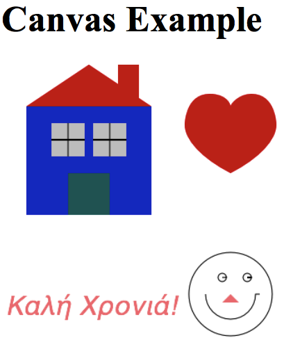
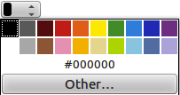
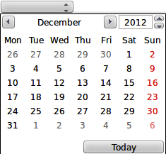
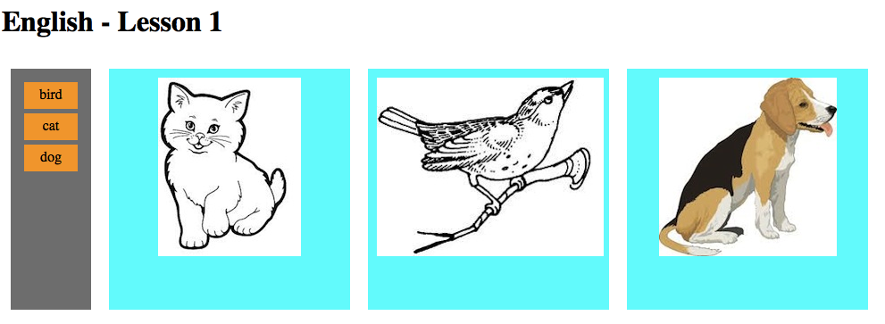
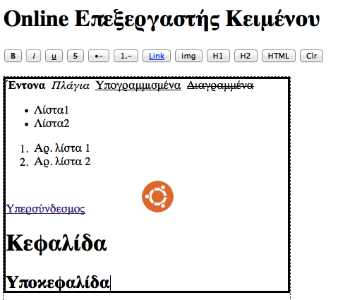
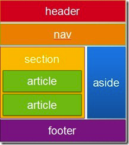
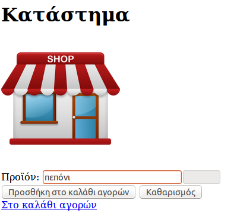
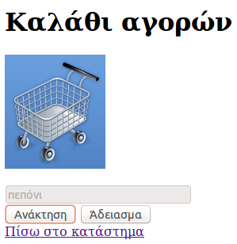
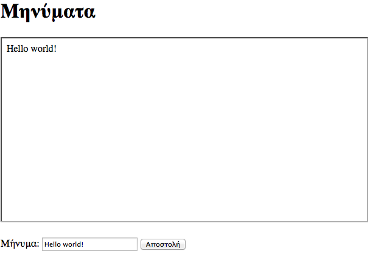
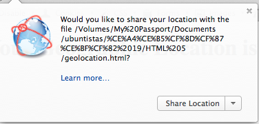

# Εισαγωγή στη HTML 5 {#html5} 
© Γιάννης Κωστάρας

---

Η HTML 5 είναι γεγονός. Περισσότερα από δέκα χρόνια μετά την προηγούμενη έκδοση 4.01 (1999), το W3C consortium προχωρεί στην επόμενη έκδοση της HTML με πλούσια χαρακτηριστικά και πολλή Javascript. Σιγά τα ωά θα μου πείτε. Ναι, αλλά αντί να γράφουμε Javascript για να καλύψουμε τα διαφορετικά τερτίπια κάθε πλοηγού, τώρα θα γράφουμε στη _standard_ Javascript που θα την υποστηρίζουν όλοι οι browsers. Με απλά λόγια:
```
        HTML 5 = HTML5 + JavaScript + CSS3
```
Αυτή τη στιγμή, λίγα χαρακτηριστικά της γλώσσας υποστηρίζονται από τους πιο δημοφιλείς πλοηγούς (Chrome, Firefox, Opera, Safari και Internet Explorer). 

Συνοπτικά, η HTML 5 φέρνει τα εξής νέα στοιχεία (χάρη στην Javascript, που πλέον έχει τυποποιηθεί και μέσω αυτής έχουμε πρόσβαση στα ακόλουθα APIs):

* Καμβάς (canvas) για να ζωγραφίζετε
* Δυνατότητα Σύρε & Ρίξε (Drag & Drop)
* Γεωκαταχώρηση, παίζει με Google maps
* Offline caching, όταν δεν είστε συνδεδεμένοι στο διαδίκτυο
* Web Workers, όπου η πολυεπεξεργασία έρχεται στον πλοηγό
* Web Sockets, μια διπλής κατεύθυνσης σύνδεση με τον διακομιστή
* Νέες εντολές εισαγωγής φορμών (επιλογέας χρώματος, επιλογέας ημερομηνίας, πεδίο κειμένου ηλεκτρονικού ταχυδρομείου, κλπ.)
* Υποστήριξη για ήχο και βίντεο χωρίς την ανάγκη plugins, όπως QuickTime και Flash
* Τοπική αποθήκευση, και πείτε αντίο στα κουλουράκια (cookies)
* Αποστολή μηνυμάτων σε διάφορα μέρη μιας ιστοσελίδας
* νέες ετικέτες (tags), καθώς και ετικέτες που καταργούνται στην έκδοση 5.

Αυτό που πρέπει να υπογραμμίσουμε είναι ότι ακόμα οι προδιαγραφές είναι σε μορφή πρόχειρου (draft) και θα μείνουν έτσι για πολλά χρόνια ακόμα, αλλά αυτό δε σημαίνει ότι οι πιο δημοφιλείς πλοηγοί δεν τις υποστηρίζουν ήδη, σε μικρότερο ή μεγαλύτερο βαθμό. Στη συνέχεια θα περιγράψουμε μερικές από αυτές.
Το μόνο που χρειάζεστε είναι ένας απλός κειμενογράφος και ένας πλοηγός που υποστηρίζει τη νέα έκδοση της HTML. Ελέγξτε [αυτήν την ιστοσελίδα](http://deepbluesky.com/blog/-/browser-support-for- css3-and-html5_72/) για να δείτε την υποστήριξη των πιο δημοφιλών πλοηγών. Επίσης, πλοηγηθείτε στην ιστοσελίδα [http://html5test.com/](http://html5test.com/) για να δείτε το σκορ του πλοηγού σας όσον αφορά την υποστήριξη HTML 5. Για πιο αναλυτικά αποτελέσματα, δείτε την ιστοσελίδα [http://fmbip.com/](http://fmbip.com/) (χρειάζεται να έχετε ενεργοποιημένη την Javascript στον πλοηγό σας). Τέλος, αν ένας απλός κειμενογράφος δεν σας ικανοποιεί, ανατρέξτε στην επόμενη ενότητα, όπου παρέχεται μια λίστα κειμενογράφων για το Ubuntu που υποστηρίζουν την HTML 5.
_Σημείωση!_ Το βιβλίο αυτό υποθέτει ότι γνωρίζετε την HTML 4, ή τουλάχιστον μια παλαιότερη έκδοσή της, και παρουσιάζει μόνο τα νέα χαρακτηριστικά που
φέρνει η έκδοση 5. Επίσης, προαπαιτεί κάποιες γνώσεις Javascript.

## Κειμενογράφοι HTML 5
Υπάρχουν ήδη κειμενογράφοι που υποστηρίζουν τη σύνταξη της HTML 5:

* [Aptana Studio 3](http://www.aptana.com/), ένα δωρεάν ολοκληρωμένο περιβάλλον εργασίας που υποστηρίζει HTML5, JavaScript, CSS3, Python, PHP, Rails και Ruby
* [Bluefish](http://bluefish.openoffice.nl/index.html), ο αγαπημένος σας κειμενογράφος τώρα και με υποστήριξη HTML 5
* [BlueGriffon](http://bluegriffon.org/), ένας δωρεάν WYSIWYG κειμενογράφος από την Gecko 
* [HTML5-editor](https://html5-editor.net/), ένας δωρεάν WYSIWYG κειμενογράφος
* [Maqetta](http://maqetta.org/), άλλος ένας δωρεάν WYSIWYG κειμενογράφος 
* [Mercury](http://jejacks0n.github.io/mercury/), ένας δωρεάν κειμενογράφος που υποστηρίζει HTML5
* [NetBeans](http://netbeans.org), ένα δωρεάν ολοκληρωμένο περιβάλλον εργασίας που υποστηρίζει HTML5 και CSS3
* [SeaMonkey Composer](https://www.seamonkey-project.org), ο παλιός Netscape Navigator περιέχει τον Composer για ανάπτυξη ιστοσελίδων
* [Visual Studio Code](https://code.visualstudio.com), ένα δωρεάν ολοκληρωμένο περιβάλλον εργασίας υποστήριξης πολλών γλωσσών προγραμματισμού από την Microsoft
* [WebStorm](https://www.jetbrains.com/webstorm/download/index.html), ένας εμπορικός κειμενογράφος από την Jetbrains

## Μια απλή ιστοσελίδα στην HTML 4.01 και την HTML 5
Μια ιστοσελίδα στην HTML 4.01 ξεκινούσε με την κεφαλίδα:
```html
<!DOCTYPE html PUBLIC "-//W3C//DTD HTML 4.01//EN"
"http://www.w3.org/TR/html4/strict.dtd">
```
Στην HTML 5 απλά ξεκινάει με:
```html
<!DOCTYPE html>
```
και δεν θα χρειαστεί να ξαναλλάξει!
Επίσης, η μετα-εντολή:
```html
<meta http-equiv="content-type" content="text/html; charset=
UTF-8">
```
απλοποιείται ως:
```html
<meta charset="utf-8">
```
Ο υπερσύνδεσμος:
```html
<link type="text/css" rel="stylesheet" href="mycss.css">
```
απλοποιείται ως εξής:
```html
<link rel="stylesheet" href="mycss.css">
```
γιατί το Cascaded Stylesheet (CSS) είναι το εξ ορισμού πρότυπο στυλ στην HTML 5.
Τέλος, καθώς η Javascript είναι η εξ ορισμού γλώσσα συνόδου της HTML 5, η εντολή:
```html
<script type="text/javascript" src="myscript.js"></script>
```
απλοποιείται ως:
```html
<script src="myscript.js"></script>
```
Το καλύτερο; Η νέα σύνταξη δουλεύει και σε παλαιότερους πλοηγούς!
Αλλά ας δούμε μερικά από τα πιο «καυτά» χαρακτηριστικά της νέας έκδοσης.

## Καμβάς - Ζωγραφική
Επιτέλους, μπορείτε να «βγάλετε» τον ζωγράφο που κρύβετε μέσα σας, χρησιμοποιώντας τη νέα εντολή ```canvas```:
```html
<canvas height="yyy" width="xxx">
</canvas>
```
Μπορείτε να βρείτε το πλήρες API στη διεύθυνση
[http://www.w3.org/TR/html5/the-canvas-element.html](http://www.w3.org/TR/html5/the-canvas-element.html), καθώς και στην [http://dev.w3.org/2006/canvas-api/canvas-2d-api.html](http://dev.w3.org/2006/canvas-api/canvas-2d-api.html). Όπως θα δείτε, μπορείτε να ζωγραφίσετε ένα πλήθος σχημάτων (γραμμές, παραλληλόγραμμα, καμπύλες, τόξα, ελλείψεις, εικόνες, πολύπλοκα σχήματα, κ.ά.), να ορίσετε στυλ γραμμών, να προσθέσετε σκιές, να χρησιμοποιήσετε
μετασχηματισμούς σχημάτων (περιστροφή, μεταφορά, κλπ.), και πολλά άλλα ακόμη.

* Πλοηγοί που τον υποστηρίζουν: Chrome, Firefox, Opera, Safari.

Στη συνέχεια, θα δούμε… το ζωγράφο μέσα μου!



**Εικόνα 1** _Ένα παράδειγμα χρήσης του καμβά_

Ας ξεκινήσουμε με τον ακόλουθο κώδικα, τον οποίο μπορείτε ν' αποθηκεύσετε στο αρχείο ```canvas.html```:
```html
<!DOCTYPE html>
<html>
 <head>
  <title>Canvas Example</title>
  <script type="text/javascript">
    function loader()
    { }
  </script>
 </head>
 <body onload="loader()">
  <h1>Canvas Example</h1>
  <canvas id="canvas" width="600" height="500">
  </canvas>
 </body>
</html>
```
Ο παραπάνω σκελετός κώδικα περιλαμβάνει την ετικέτα ```canvas```, όπως την ορίσαμε πρωτύτερα. Αλλά το τι θα ζωγραφίσουμε στον καμβά το προγραμματίζουμε με javascript. Στο παράδειγμά μας, η ιδιότητα ```onload``` καλεί τη συνάρτηση ```loader()```, που εκτελείται κατά τη φόρτωση της ιστοσελίδας στον πλοηγό και περιέχει τη ζωγραφική μας. Μέσα στη συνάρτηση ```loader()```, προσπελάζουμε τον καμβά με τις εντολές:
```javascript
function loader() {
  var canvas = document.getElementById('canvas');
  var context = canvas.getContext('2d');
}
```
Η πρώτη εντολή μας λέει να βρούμε το αντικείμενο με ```id="canvas"``` και η δεύτερη να προσπελάσουμε το ```context``` αυτού του αντικειμένου. Όπως
ίσως μαντεύετε, μελλοντικά θα μπορούμε να ζωγραφίζουμε και τρισδιάστατα αντικείμενα, απλά αντικαθιστώντας το ```"2d"``` με ```"3d"```. Για την ακρίβεια,
το 3d API ονομάζεται WebGL και καλείται επίσης περνώντας το αλφαριθμητικό ```"webgl"``` (αντί για το ```"3d"```).
Από δω και πέρα, απλά… ζωγραφίζουμε.
```javascript
function loader() {
 var canvas = document.getElementById('canvas');
 var context = canvas.getContext('2d');
 // House \\
 context.fillStyle = "rgba(0, 0, 200, 1)";
 context.fillRect(30, 50, 150, 130);
 // Door \\
 context.fillStyle = "rgba(0, 200, 0, 0.5)";
 context.fillRect(80, 130, 50, 50);
 // Roof \\
 context.fillStyle = "rgba(200, 0, 0, 1)";
 context.beginPath();
 context.moveTo(30, 50);
 context.lineTo(105, 0);
 context.lineTo(180, 50);
 context.closePath();
 context.fill();
 // Chimney
 context.fillStyle = "rgba(200, 0, 0, 1)";
 context.fillRect(140, 0, 25, 50);
 // Windows
 context.fillStyle = "rgba(200, 200, 200, 1)";
 context.fillRect(60, 70, 40, 40);
 context.beginPath();
 context.moveTo(80, 70);
 context.lineTo(80, 110);
 context.moveTo(60, 90);
 context.lineTo(100, 90);
 context.closePath();
 context.stroke();
 context.fillStyle = "rgba(200, 200, 200, 1)";
 context.fillRect(110, 70, 40, 40);
 context.beginPath();
 context.moveTo(130, 70);
 context.lineTo(130, 110);
 context.moveTo(110, 90);
 context.lineTo(150, 90);

 context.closePath();
 context.stroke();
}
```
Ορίζετε το χρώμα γεμίσματος με τη συνάρτηση ```fillStyle```, δίνοντας τις τιμές RBGA (_red [0-255], blue [0-255], green [0-255], alpha [0.0-1.0]_), όπου
```alpha=0.0``` σημαίνει πλήρης διαφάνεια, δηλ. το συγκεκριμένο χρώμα δεν εμφανίζεται. Μπορείτε να σχεδιάσετε πολλά σχήματα πέραν του ```fillRect``` (ή του ```strokeRect```, αν δε θέλετε γέμισμα) που εμφανίζεται παραπάνω, όπως:
* ```arc(float centerx, float centery, float radius, float startAngle, float endAngle, boolean anticlockwise);```
* ```rect(float x, float y, float w, float h);```

Π.χ.:
```javascript
// Face \\
context.beginPath();
context.arc(275, 275, 50, 0, Math.PI * 2, true);
context.moveTo(310, 275);
context.arc(275, 275, 30, 0, 1.0 * Math.PI, false);
context.moveTo(265, 255);
context.arc(265, 255, 5, 0, 2 * Math.PI, false);
context.moveTo(295, 255);
context.arc(295, 255, 5, 0, 2 * Math.PI, false);
context.closePath();
context.stroke();
//nose
context.fillStyle = "rgba(0, 200, 0, 0.5)";
context.beginPath();
context.moveTo(275, 275);
context.lineTo(285, 285);
context.lineTo(265, 285);
context.closePath();
context.fill();
```

Μπορείτε να δημιουργήσετε πολύπλοκα σχήματα με τις εντολές:
```javascript
context.beginPath();
context.moveTo(x, y); // τo πινέλo είναι σηκωμένο
context.lineTo(x, y); // τo πινέλo ζωγραφίζει
context.closePath();
context.fill();
context.stroke();
```
Αλλά μη νομίζετε ότι περιορίζεστε μόνο σε γραμμές:

* ```bezierCurveTo(float cp1x, float cp1y, float cp2x, float cp2y, float x, float y);```
* ```quadraticCurveTo(float cpx, float cpy, float x, float y);```

όπου ```cp``` σημαίνει _control point (σημείο ελέγχου)_· η quadratic καμπύλη χρειάζεται ένα, ενώ η bezier δυο σημεία ελέγχου.
Π.χ.:
```javascript
// Heart
context.fillStyle = "rgba(200, 0, 0, 1)";
context.beginPath();
context.moveTo(275, 50);
context.bezierCurveTo(275, 47, 270, 35, 250, 35);
context.bezierCurveTo(220, 35, 220, 72.5, 220, 72);
context.bezierCurveTo(220, 90, 240, 112, 275, 130);
context.bezierCurveTo(310, 112, 330, 90, 330, 72);
context.bezierCurveTo(330, 72.5, 330, 35, 300, 35);
context.bezierCurveTo(285, 35, 275, 47, 275, 50);
context.closePath();
context.fill();
```
Τέλος, μπορείτε φυσικά να προσθέσετε κείμενο:
```javascript
context.font = 'italic 32px sans-serif';
context.fillText("Καλή Χρονιά!", 5, 400);
```
ή εικόνες:

* ```drawImage(HTMLImageElement image, float dx, float dy, optional float dw, float dh);```

όπου
```javascript
var image = new Image();
image.onload = function() {
  context.drawImage(image, sizeX, sizeY);
};
image.src = '<ImageURL>';
```
Υπάρχουν φυσικά πολλές ακόμα δυνατότητες, τις οποίες δε θα καλύψουμε στον περιορισμένο χώρο αυτού του βιβλίου. Για περισσότερες πληροφορίες, ανατρέξτε στο ΑΡΙ ή στη βιβλιογραφία στο τέλος του βιβλίου.
Εδώ, ο προσεχτικός αναγνώστης θα αναρωτηθεί: Αφού υπάρχει το πρότυπο SVG που προσφέρει πολλές δυνατότητες για διανυσματικά γραφικά, τι τον θέλουμε τον καμβά; Ο καμβάς παρέχει στατικά γραφικά, δηλ. χωρίς αλληλεπίδραση με το χρήστη μέσω π.χ. του ποντικιού. Οπότε η απάντηση είναι απλή: χρησιμοποιήστε τον καμβά για απόδοση και το SVG άμα χρειάζεστε αλληλεπίδραση.
Δυστυχώς, κανένας από τους προαναφερθέντες κειμενογράφους δεν διαθέτει (ακόμα) δυνατότητα ζωγραφικής στον καμβά με το ποντίκι και αυτόματης μετατροπής σε κώδικα HTML 5, κάτι αντίστοιχο δηλ. του [Inkscape](https://inkscape.org/en/) για SVG.

## Βίντεο και ήχος
Συνεχίζοντας με την υποστήριξη πολυμέσων, θα δούμε πώς μπορούμε να αναπαράγουμε βίντεο στον πλοηγό μας με τη βοήθεια της HTML 5:
```html
<video [attributes]></video>
```
Η εντολή για αναπαραγωγή ήχου είναι:
```html
<audio [attributes]></audio>
```
όπου attributes:

| Παράμετρος | audio/video | Περιγραφή |
| ```autoplay``` | audio/video | Αυτόματη εκκίνηση βίντεο / ήχου κατά την φόρτωση της σελίδας |
| ```controls``` | audio/video | Εμφάνιση της μπάρας εργαλείων |
| ```height``` | video | Ύψος πλαισίου βίντεο |
| ```width``` | video | Πλάτος πλαισίου βίντεο |
| ```loop``` | audio/video | Συνεχής επανεκκίνηση του βίντεο / ήχου όποτε φτάνει στο τέλος του |
| ```src``` | audio/video | Διεύθυνση του αρχείου βίντεο/ήχου |
| ```poster``` | video | Διεύθυνση της εικόνας που εμφανίζεται αν το βίντεο δεν είναι διαθέσιμο |
| ```preload``` | audio/video | Επιλογές προφόρτωσης του βίντεο/ήχου στον πλοηγό: |
| | | none: δεν απαιτείται προφόρτωση |
| | | metadata: ανάγνωση των μεταδεδομένων |
| | | auto: ο πλοηγός αποφασίζει |

**Πίνακας 1** _Ιδιότητες εντολών audio/video_

Μπορείτε να βρείτε το πλήρες API για το βίντεο στη [διεύθυνση](http://www.w3.org/TR/html5/the-video-element.html), ενώ το πλήρες ΑΡΙ για τον ήχο βρίσκεται στη [διεύθυνση](http://www.w3.org/TR/html5/the-audio-element.html).

* Πλοηγοί που τα υποστηρίζουν: Chrome, Firefox, Opera, Safari, Internet Explorer 9.

Για την ώρα υποστηρίζεται μόνο η ανοικτού κώδικα μορφή αρχείου ```.ogg```. Αν θέλετε να φορτώσετε μια άλλη μορφή αρχείου (π.χ. ```.wmv```, ```.mpeg```, κλπ.) και ο πλοηγός σας δεν την υποστηρίζει ακόμα, τότε μπορείτε να το μετατρέψετε σε μορφή ```.ogg```, π.χ. μέσω των ιστοσελίδων:
[Media Converter](http://www.mediaconverter.org/) ή [Online convert](http://www.online-convert.com/). Αφού έχετε επιλέξει το αρχείο βίντεο και το αρχείο ήχου που θέλετε ν' αναπαράγετε, αποθηκεύστε τον παρακάτω κώδικα στο αρχείο ```audiovideo.html``` και αντιγράψτε τα αρχεία βίντεο και ήχου στον ίδιο φάκελο:

```html
<!DOCTYPE html>
<html>
  <head><title>Audio/Video Example</title>
    <script type="text/javascript">
      function fail() {
        switch (e.target.error.code) {
          case e.target.error.MEDIA_ERR_ABORTED:
            alert('You aborted the playback.');
            break;
          case e.target.error.MEDIA_ERR_NETWORK:
            alert('Network error.');
            break;
          case e.target.error.MEDIA_ERR_DECODE:
            alert('Corruption problem.');
            break;
          case e.target.error.MEDIA_ERR_SRC_NOT_SUPPORTED:
            alert('Format unsupported or file not found.');
            break;
          default:
            alert('An unknown error occurred.');
            break;
        }
      }
    </script>
  </head>
  <body>
    <h1>Audio/Video Example</h1>
    <video controls src="myvideo.ogg" width="400" height="300" onerror="fail(event)"></video>
    <br/>
    <audio controls src="myaudio.ogg" loop onerror="fail(event)">
    </audio>
  </body>
</html>
```

Όπου ```myvideo.ogg``` είναι το αρχείο βίντεο και ```myaudio.ogg``` το αρχείο ήχου που θέλετε ν' αναπαράγετε (αντικαταστήστε τα με τα δικά σας). Φυσικά, μπορείτε να δοκιμάσετε και τις υπόλοιπες ιδιότητες: ```loop, preload, autoplay,``` κλπ.

## Φόρμες
Παραδοσιακά, η HTML υποστηρίζει τις ακόλουθες εντολές εισαγωγής δεδομένων μέσω φορμών:

| Τύπος | Εντολή HTML | Εμφάνιση |
| Πλαίσιο Κειμένου | ```<input name="text" type="text"/>``` |   |
| Κωδικός | ```<input name="password" type="password"/>``` |  |
| Κουμπί | ```<input type="button" value="Click me!">``` |  |
| Κουμπί υποβολής | ```<input type="submit" value="Submit">``` |  |
| Κουμπί καθαρισμού | ```<input type="reset" value="Clear">``` |  |
| Λίστα | ```<select name="list"> <option>Αχλάδι</option> <option selected>Μήλο</option> <option>Πορτοκάλι</option> </select>``` |  |
| Κουμπί radio | ```<input name="radio" type="radio">Ναι</input>``` |  |
| Κουμπί Επιλογής | ```<input name="checkbox" type="checkbox">Συμφωνώ</input>``` |  |
| Περιοχή Κειμένου  | ```<textarea cols="5" rows="5" name="textarea"></textarea>``` |  |
| Κρυμμένο κείμενο | ```<input name="hidden" type="hidden">``` | |
| Εικόνα | ```<input name="image" alt="email" src="e-mail.gif" type="image" height="60" width="55"> ```|  |
| Ετικέτα | ```<label for="email">Label</label> ```| Label |

**Πίνακας 2** _Εργαλεία εισαγωγής δεδομένων φορμών μέχρι την HTML 4.01_

Η HTML 5 προσθέτει πολλές νέες δυνατότητες εισαγωγής δεδομένων μέσω φορμών. Μόνο ο Opera, και λιγότερο ο Chrome, υποστηρίζουν μέχρι στιγμής τις νέες εντολές κι αυτές όχι πλήρως. Για περισσότερες πληροφορίες, ανατρέξτε στις ιστοσελίδες [http://www.w3.org/TR/html5/forms.html](http://www.w3.org/TR/html5/forms.html) και [http://www.whatwg.org/specs/web-apps/current-work/multipage/the-input-element.html#attr-input-type](http://www.whatwg.org/specs/web-apps/current-work/multipage/the-input-element.html#attr-input-type).

| Τύπος | Εντολή | HTML Εμφάνιση |
| Επιλογή Χρώματος | ```<input name="color" type="color"/>``` |   |
| Ημερομηνία | ```<input name="date" type="date">``` |   |
| Ημερομηνία/ώρα  | ```<input name="datetime" type="datetime">``` |   |
| Τοπική Ημερομηνία/ώρα | ```<input name="datetimelocal" type="datetime-local">``` |   |
| Μήνας | ```<input name="month" type="month">``` |   |
| Εβδομάδα | ```<input name="week" type="week">``` |   |
| Ώρα | ```<input name="time" type="time">``` |   |
| Αριθμός | ```<input name="number" type="number" min="1" max="100" step="5" value="40">``` |   |
| Εύρος Τιμών | ```<input name="range" type="range" min="0" max="100" step="5" value="40">``` |   |
| Διεύθυνση Η/Τ  | ```<input name="email" type="email">``` |   |
| Διεύθυνση ιστοχώρου | ```<input name="url" type="url">``` |   |
| Πλαίσιο αναζήτησης | ```<input name="query" type="search">``` |   |

**Πίνακας 3** _Νέα εργαλεία εισαγωγής δεδομένων φορμών στην HTML 5_

Ο παρακάτω κώδικας ```register.html``` δείχνει τη χρήση κάποιων απ' αυτά σε σε μια χρήσιμη φόρμα εγγραφής:

```html
<!DOCTYPE html>
<html>
  <head><title>Εγγραφή</title></head>
  <body>
    <h1>Εγγραφή</h1>
    <form method="post" action="register.php">
      <table border="0" cellpadding="5">
        <tr>
          <td><label for="name">Όνομα</label></td>
          <td><input name="name" size="30" placeholder="Enter your first name" autofocus></td>
        </tr>
        <tr>
          <td><labelfor="surname">Επώνυμο</label></td>
          <td><input name="surname" size="30" placeholder="Enter your surname"></td>
        </tr>
        <tr>
          <td><label for="email">Email</label></td>
          <td><input name="email" type="email" size="30" placeholder="Enter your email" required></td>
        </tr>
        <tr>
          <td><label for="username">Όνομα λογαριασμού</label></td>
          <td><input name="username" size="16" placeholder="Enter your username" required></td>
        </tr>
        <tr>
          <td><label for="password">Κωδικός</label></td>
          <td><input name="password" size="16" type="password" placeholder="Enter your password" required></td>
        </tr>
        <tr> 
          <td><label for="confirm-password">Επιβεβαίωση Κωδικού</label></td>
          <td><input name="confirm-password" size="16" type="password" placeholder="Confirm password" required></td>
        </tr>
        <tr>
          <td><label for="url">Διεύθυνση ιστοχώρου</label></td>
          <td><input name="url" type="url" placeholder="Enter your url"></td>
        </tr>
        <tr>
          <td><label for="date">Ημερομηνία γέννησης</label></td>
          <td><input name="date" type="date"></td>
        </tr>
        <tr>
          <td><label for="age">Ηλικία</label></td>
          <td><input name="age" type="number" min="1" max="100" step="5" value="40"></td>
        </tr>
        <tr>
          <td><label for="query">Χώρα</label></td>
          <td><input name="query" size="30" type="search" placeholder="Country of residence" list="countries"></td>
        </tr>
        <tr>
          <td><label for="zip">ΤΚ..</label></td>
          <td><input name="zip" size="5" type="text" pattern="" placeholder="Zip code"></td>
        </tr>
        <tr>
          <td><label for="color">Αγαπημένο χρώμα</label></td>
          <td><input name="color" type="color"></td>
        </tr>
        <tr>
          <td><label for="range">Ποσοστό (0-100%)</label></td>
          <td><input name="range" type="range" min="0" max="100" step="5" value="40"></td>
        </tr>
      </table><br/>
      <input type="submit" name="Submit" value="Υποβολή">
      <input type="reset" name="Reset" value="Καθαρισμός">
    </form>
    <datalist id="countries">
      <option value="Belgium"> </option>
      <option value="France"> </option>
      <option value="Italy"> </option>
      <option value="Germany"> </option>
      <option value="Greece"> </option>
      <option value="Spain"> </option>
    </datalist>
  </body>
</html>
```
Φυσικά, θα πρέπει να υπάρχει και κάποιος διακομιστής που θα επεξεργαστεί τα στοιχεία της φόρμας όταν πατήσετε το κουμπί **Υποβολή**. Αυτό γίνεται από τον κώδικα ```register.php```, ο οποίος όμως ξεφεύγει από το σκοπό αυτού του βιβλίου. Σημειώστε ότι, παρόλο που ο Opera έχει την καλύτερη υποστήριξη για φόρμες τη στιγμή που γράφονται αυτές οι γραμμές, και πάλι πολλά πράγματα δεν υποστηρίζονται ακόμα, π.χ. το μέγεθος των πεδίων ή ο έλεγχος εγκυρότητας.

## Σύρε Ρίξε (Drag & Drop)
Η HTML5 υποστηρίζει τη λειτουργία _Σύρε-Ρίξε_, δηλ. ο χρήστης μπορεί να σύρει κείμενο ή εικόνα με το ποντίκι και να την αφήσει σε κάποιο άλλο
τμήμα της ιστοσελίδας όπως π.χ. προσθήκη αντικειμένων σε ένα καλάθι αγορών.
Η λειτουργία αυτή υποστηρίζεται από τις ακόλουθες ιδιότητες:

* ```draggable```
* ```ondragenter```
* ```ondragover```
* ```ondrop```
* ```ondragstart```
* ```ondragend```

Πλοηγοί που το υποστηρίζουν: Chrome, Firefox, Opera, Safari.

Στο επόμενο μάθημα αγγλικών, η δασκάλα σας ζητάει να αντιστοιχίσετε τους μαγνήτες με τη σωστή λέξη, με τη σωστή εικόνα (βλ. Εικόνα 2). Όταν
τοποθετείτε ένα μαγνήτη στη λάθος εικόνα, ο δρομέας αλλάζει δείχνοντάς σας ότι δεν μπορείτε ν' αφήσετε το μαγνήτη εκεί. Αφήνοντας το σωστό μαγνητάκι κάτω από τη σωστή εικόνα (πάνω στην εικόνα δε δουλεύει) θα δείτε το μαγνητάκι να «κολλάει» κάτω από τη σωστή εικόνα αλλά όχι κάτω από τη λάθος.



**Εικόνα 2** _Σύρε και ρίξε_

```html
<!DOCTYPE html>
<html>
  <head>
    <meta content="text/html; charset=UTF-8" http-equiv="content-type">
    <title> Drag and Drop Example </title>
    <style type="text/css">
#magnets
{
  float:left; width:70px; height:250px;
  padding:10px; margin:10px; background-color: grey;
}
#target1, #target2, #target3
{
  float:left; width:250px; height:250px;
  padding:10px; margin:10px; background-color: cyan;
  text-align: center
}
#bird, #cat, #dog
{
  width:50px; height:20px; padding:5px;
  margin:5px; background-color: orange;
  text-align: center
}
</style>
    <script type="text/javascript">
      function start(e) {
        e.dataTransfer.effectAllowed='move';
        e.dataTransfer.setData("Data",
        e.target.getAttribute('id'));
        e.dataTransfer.setDragImage(e.target, 0, 0);
        return true;
      }
      function enter(e) {
        return true;
      }
      function over(e) { 
        var idDragObj = e.dataTransfer.getData("Data");
        var idTarget = e.target.getAttribute('id');
        if (idTarget =='target1' && idDragObj == 'cat') return false;
        else if (idTarget =='target2' && idDragObj == 'bird') return false;
        else if (idTarget =='target3' && idDragObj == 'dog') return false;
        else return true;
      }
      function drop(e) {
        var idDragObj = e.dataTransfer.getData("Data");
        e.target.appendChild(document.getElementById(idDragObj));
        e.stopPropagation();
        return false;
      }
      function end(e) {
        e.dataTransfer.clearData("Data");
        return true
      }
</script>
  </head>
  <body>
    <h1>English - Lesson 1</h1>
    <div id="magnets">
      <div id="bird" draggable="true" ondragstart="return start(event)"
        ondragend="return end(event)">bird</div>
      <div id="cat" draggable="true" ondragstart="return start(event)"
        ondragend="return end(event)">cat</div>
      <div id="dog" draggable="true" ondragstart="return start(event)"
        ondragend="return end(event)">dog</div>
    </div>
    <div id="target1" ondragenter="return enter(event)" ondragover="return over(event)"
      ondrop="return drop(event)">
      
    </div>
    <div id="target2" ondragenter="return enter(event)" ondragover="return over(event)"
      ondrop="return drop(event)">
      
    </div>
    <div id="target3" ondragenter="return enter(event)" ondragover="return over(event)"
      ondrop="return drop(event)">
      
    </div>
  </body>
</html>
```

Υπάρχουν 4 ```<div>``` στον κώδικα, ένα για τους μαγνήτες (```magnets```) και 3 για τις 3 εικόνες (```target1, target2, target3```). Επίσης κάθε μαγνήτης (```bird, cat, dog```) ορίζεται στο δικό του ```<div>```. Επειδή καθένας από τους μαγνήτες θα πρέπει να μπορεί να συρθεί, ορίζουμε την ιδιότητα ```draggable="true"``` για καθέναν απ' αυτούς:
```html
<div id="bird" draggable="true" ondragstart="return start(event)" ondragend="return end(event)">bird</div>
```
Οι ιδιότητες ```“on"``` συνδέουν τα διάφορα γεγονότα με συναρτήσεις JavaScript. Π.χ. η ιδιότητα ```“ondragstart"``` καλεί τη συνάρτηση JavaScript
```“start()"``` όταν ένα στοιχείο αρχίζει να σέρνεται. Διαφορετικά γεγονότα ορίζονται για τα αντικείμενα που σέρνονται και για τα αντικείμενα «στόχους»,
αυτά δηλ. στα οποία θ' αφεθεί το μεταφερόμενο αντικείμενο. 
```html
<div id="target1"
ondragenter="return enter(event)"
ondragover="return over(event)"
ondrop="return drop(event)">
</div>
```
Η μεταφορά του αντικειμένου γίνεται με τη βοήθεια του ```dataTransfer``` το οποίο προσπελάζεται μέσω του event: ```e.dataTransfer```. Το αντικείμενο ```dataTransfer``` διαθέτει:

* την ιδιότητα ```effectAllowed```, που αποθηκεύει ποια λειτουργία επιτρέπεται
* τις συναρτήσεις ```setData()``` και ```getData()``` που σας επιτρέπει να αποθηκεύσετε τα δεδομένα που θέλετε να μεταφέρετε, και
* τη συνάρτηση ```setDragImage()``` με την οποία ορίζετε την εικόνα του αντικειμένου κατά τη μεταφορά.

```javascript
e.dataTransfer.effectAllowed = 'move';
e.dataTransfer.setData("Data",
e.target.getAttribute('id'));
e.dataTransfer.setDragImage(e.target, 0, 0);
```
Η συνάρτηση ```"over()"``` καλείται για να αποφασίσει αν το αντικείμενο μπορεί να αφεθεί στο αντικείμενο στόχο ή όχι. Αν επιστρέψει ```true``` το αντικείμενο δεν μπορεί ν' αφεθεί, διαφορετικά μπορεί.

```javascript
function over(e) {
  var idDragObj = e.dataTransfer.getData("Data");
  var idTarget = e.target.getAttribute('id');
  if (idTarget =='target1' && idDragObj == 'cat') return false;
  else if (idTarget =='target2' && idDragObj == 'bird') return false;
  else if (idTarget =='target3' && idDragObj == 'dog') return false;
  else return true;
}
```

Μπορείτε να βρείτε περισσότερες πληροφορίες [εδώ](http://w3c.github.io/html/editing.html#dnd).

## Ιστορικό
Η HTML5 σας δίνει τον έλεγχο του ιστορικού του πλοηγού σας. Με τη βοήθεια του αντικειμένου History, σας επιτρέπει να μεταφέρεστε μπροστά/πίσω στο ιστορικό και από ιστοσελίδα σε ιστοσελίδα. Μπορείτε ακόμα ν' αποθηκεύσετε δεδομένα στο αντικείμενο ιστορικού κατάστασης της τρέχουσας ιστοσελίδας και να τα ανακτήσετε αργότερα. Με αυτόν τον τρόπο, μπορείτε να μεταφέρετε δεδομένα από ιστοσελίδα σε ιστοσελίδα, οπότε ξεχάστε τα κουλουράκια (cookies) ή τις συνοδείες (sessions). 

Το παρακάτω πρόγραμμα επιδεικνύει τα παραπάνω. Ο χρήστης μπορεί να πατήσει τα κουμπιά **Πίσω/Εμπρός** για να πλοηγηθεί πίσω ή μπροστά μια ιστοσελίδα. Ή να εισάγει ένα θετικό (αρνητικό) αριθμό στο πλαίσιο κειμένου **Μετακίνηση ... σελ.** για να μετακινηθεί τόσες σελίδες προς τα εμπρός (πίσω). Ακόμα, μπορεί να προσθέσει δεδομένα στην ιστοσελίδα ιστορικού που βρίσκεται. Τέλος, εμφανίζει το μέγεθος του ιστορικού.


**Εικόνα 3** _Ιστορικό_

Πλοηγοί που υποστηρίζουν την προσθήκη δεδομένων: ουδείς. 

Τα υπόλοιπα όμως χαρακτηριστικά του ιστορικού υποστηρίζονται απ' όλες τις τελευταίες εκδόσεις των πιο δημοφιλών πλοηγών.
Το αντικείμενο ```history``` είναι μέρος του αντικειμένου ```window```. Οι ιδιότητες και συναρτήσεις του είναι οι παρακάτω:

* ```window.history.length;```
* ```window.history.go();```
* ```window.history.back();```
* ```window.history.forward();```
* ```window.history.pushState();```
* ```window.history.replaceState();```
* ```window.onpopstate```

Το παρακάτω πρόγραμμα περιγράφει τη λειτουργία τους:
```html
<html>
  <head>
    <meta content="text/html; charset=UTF-8" http-equiv="content-type">
    <title> Ιστορικό </title>
    <script type="text/javascript">
      function go() {
        var numPages =document.getElementById("numPages").value;
        window.history.go(numPages);
      }
      function back() {
        window.history.back();
      }
      function forward() {
        window.history.forward();
      }
      function loader() {
        var length = window.history.length; document.
        getElementById("length").innerHTML = "<h1>" + "Μέγεθος ιστορικού: " + length + "</h1>";
      }
      function pushData() {
        var data = document.getElementById("data").value;
        var containerObject = { container : data };
        window.history.pushState(containerObject, "item", "history.html");
      }
      function popData(event) {
        var state = "Ιστοσελίδα: " + document.location + " Δεδομένα: " + event.state.container;
        document.getElementById("state").innerHTML = "<h1>" + state + "</h1>";
      };
      window.addEventListener("popstate", popData, false);
    </script>
  </head>
  <body onload="loader()">
    <h1>Ιστορικό</h1>
    <input value="Πίσω" onclick="back();" type="button">
    <input value="Εμπρός" onclick="forward();" type="button">
    <br/>
    Μετακίνηση: <input id="numPages" type="text"> σελ. <input value="Εκτέλεση" onclick="go();" type="button">
    <br/>
    <br/>
    <br/>
    Δεδομένα: <input id="data" type="text"> <input value="Προσθήκη" onclick="pushdata();" type="button">
    <br/>
    <div id="length"></div>
    <br/>
    <div id="state"></div>
    <br/>
  </body>
</html>
```
Όταν φορτώνεται η ιστοσελίδα: 
```html
<body onload="loader()">
...
</body>
```
καλείται η συνάρτηση ```loader()```:
```javascript
function loader() {
  var length = window.history.length;
  document.getElementById("length").innerHTML = "<h1>" + "Μέγεθος ιστορικού: " + length + "</h1>";
}
```
η οποία εμφανίζει το μέγεθος του ιστορικού στο κάτω μέρος της σελίδας.
Τα κουμπιά **Πίσω** και **Εμπρός**:
```html
<input value="Πίσω" onclick="back();" type="button">
<input value="Εμπρός" onclick="forward();" type="button">
```
καλούν τις αντίστοιχες συναρτήσεις:
```javascript
function back() {
  window.history.back();
}
function forward() {
  window.history.forward();
}
```
Η μετάβαση σε **X** σελίδες στο ιστορικό παρέχεται με τον κώδικα:
```html
Μετακίνηση: <input id="numPages" type="text"> σελ. <input value="Εκτέλεση" onclick="go();" type="button">
```
ο οποίος καλεί τη συνάρτηση:
```javascript
function go() {
  var numPages = document.getElementById("numPages").value;
  window.history.go(numPages);
}
```
Σημειώστε ότι η μεταβλητή ```numPages``` μπορεί να είναι και αρνητικός ακέραιος αριθμός.

Τέλος, η προσθήκη δεδομένων στην τρέχουσα σελίδα παρέχεται από:
```html
Δεδομένα: <input id="data" type="text"> <input value="Προσθήκη" onclick="pushdata();" type="button">
```
ο οποίος καλεί τη συνάρτηση:
```javascript
function pushData() {
  var data = document.getElementById("data").value;
  var containerObject = { container : data };
  window.history.pushState(containerObject, "item","history.html");
}
```
Η συνάρτηση ```pushState(data, title [, url ])``` δέχεται ως ορίσματα ένα αντικείμενο που περιέχει τα δεδομένα, ένα κλειδί με το οποίο μπορείτε να προσπελάσετε τα δεδομένα και την ιστοσελίδα με την οποία συσχετίζετε τα δεδομένα (το παραπάνω πρόγραμμα έχει αποθηκευτεί ως ```history.html```).
Η συνάρτηση ```replaceState(data, title [, url ])``` δέχεται τα ίδια ορίσματα όπως και η pushState και αντικαθιστά τα παλιά δεδομένα με νέα.
Τέλος, προσθέτουμε έναν «ακροατή» (listener) ο οποίος όταν λάβει το γεγονός onpopstate καλεί τη συνάρτηση ```popData()```.
```javascript
function popData(event) {
  var state = "Ιστοσελίδα: " + document.location + " Δεδομένα: " + event.state.container;
  document.getElementById("state").innerHTML = "<h1>" + state + "</h1>";
};
window.addEventListener("popstate", popData, false);
```
Όπως προαναφέραμε, αυτή η τελευταία δυνατότητα δεν προσφέρεται από κανέναν πλοηγό μέχρι στιγμής.

## Απευθείας επεξεργασία κειμένου (Inline editing) 
Η HTML 5 σας επιτρέπει να επεξεργαστείτε οποιοδήποτε στοιχείο της, δηλ. να αλλάξετε τα περιεχόμενά του! Και δεν μιλάμε μόνο για πλαίσια κειμένου, αλλά για ολόκληρα ```<div>``` ή ακόμα και ```<iframe>``` (inline frame). Για του λόγου το αληθές, διαθέτει τρεις ιδιότητες:

* ```contenteditable``` — μετατρέπει στοιχεία HTML ώστε να μπορούν να επεξεργαστούν
* ```designmode``` — μετατρέπει ένα ολόκληρο έγγραφο ώστε να μπορεί να επεξεργαστεί
* ```spellcheck``` — ενεργοποιεί τον ορθογράφο 

Πλοηγοί που το υποστηρίζουν: Chrome, Firefox, IE, Safari, Opera. Ο ορθογράφος υποστηρίζεται μόνο από τον firefox.

Το παρακάτω πρόγραμμα είναι ένας online κειμενογράφος.
```html
<!DOCTYPE html>
<html>
  <head>
    <meta content="text/html; charset=UTF-8" http-equiv="content-type">
    <title> Online ΕπεξεργαστήςΚειμένου </title>
    <script type="text/javascript">
      function showSource() {
        var content = document.getElementById("div").innerHTML;
        content.replace(/</g, '&lt;');
        content.replace(/>/g, '&gt;');
        alert(content);
      }
      function createLink() {
        var url = prompt("Enter URL:", "http://");
        if (url) document.execCommand("createlink", false, url);
      }
      function insertImage() {
        var url = prompt("Enter URL:", "http://");
        if (url) document.execCommand("insertImage", false, url);
      }
    </script>
  </head>
  <body>
    <h1>Online ΕπεξεργαστήςΚειμένου </h1>
    <div>
      <button onclick="document.execCommand('bold', false, null);"><b>B</b></button>
      <button onclick="document.execCommand('italic', false, null);"><em>i</em></button>
      <button onclick="document.execCommand('underline', false, null);"><ins>u</ins></button>
      <button onclick="document.execCommand('strikeThrough', false, null);"><del>S</del></button>
      <button onclick="document.execCommand('insertUnorderedList', false, null);">•-</button>
      <button onclick="document.execCommand('insertOrderedList',false, null);">1.-</button>
      <button onclick="createLink();"><ins style="color: blue;">Link</ins></button>
      <button onclick="insertImage();">img</button><button onclick="document.execCommand('heading', false, 'h1');">H1</button>
      <button onclick="document.execCommand('heading', false, 'h2');">H2</button>
      <button onclick="showSource();">HTML</button>
      <button onclick="document.execCommand('removeFormat', false, null);">Clr</button>
    </div>
    <br/>
    <div id="div" style='border:solid black; height: 300px; width: 400px; resize: both; overflow: auto' contenteditable="true"></div>
  </body>
</html>
```



**Εικόνα 4** _Online κειμενογράφος_

Η τελευταία γραμμή κώδικα ορίζει την ιδιότητα ```contenteditable="true"``` του ```<div id="div">```:
```html
<div id="div" style='border:solid black; height: 300px; width:400px; resize: both; overflow: auto' contenteditable="true"></div>
```
Η ιδιότητα ```contenteditable``` μπορεί να πάρει τις τιμές: ```true, false, inherit``` (δηλ. ίδια με του στοιχείου γονέα στο οποίο ανήκει). Πλέον μπορείτε να γράψετε μέσα στο ```div```. Από εκεί και πέρα, ορίζουμε κάποια κουμπιά για να επεξεργαστούμε το κείμενο του ```div```. Αντί για την εντολή:
```html
<input type="button" value="Bold" onclick="document.execCommand('bold', false, null);">
```
χρησιμοποιήσαμε την πιο πρακτική:
```html
<button onclick="document.execCommand('bold', false, null);"><b>B</b></button>
```
για να μπορούμε να μορφοποιήσουμε το κουμπί (π.χ. ```<b>B</b>```).
Η μορφοποίηση του κειμένου γίνεται με την εντολή:
```javascript
object.execCommand(sCommand [, bUserInterface] [, vValue])
```
όπου:

* ```sCommand``` είναι η εντολή που θα εκτελεστεί, π.χ. ```'bold'```
* ```bUserInterface``` αν είναι ```true``` θα εμφανίσει κάποιο γραφικό
* ```vValue```, ορίζει μια τιμή που εκχωρείται

Από εκεί και πέρα είναι εύκολο να καταλάβετε τι κάνει ο κώδικας.
Επίσης, εξ' ορισμού η ιδιότητα ```spellcheck="true"``` για όλα τα αντικείμενα για τα οποία έχετε ορίσει ```contenteditable="true"``` στον firefox,
οπότε δε χρειάζεται να κάνετε τίποτα άλλο παρά δεξί κλικ σε μια λάθος λέξη για να εμφανιστεί το μενού με τις προτεινόμενες διορθώσεις. Δυστυχώς,
δουλεύει μόνο για αγγλικό κείμενο.

Αντί για ```<div>``` θα μπορούσαμε να επεξεργαστούμε ολόκληρο ```iframe```:
```html
<iframe id="content" style='border:solid black; height: 300px; width: 400px' src="about:blank"></iframe>
```
Σ' αυτήν την περίπτωση, θα πρέπει να θέσουμε ```designMode="on"```:
```html
<script type="text/javascript">
  var iframe;
  function loader() {
    iframe = document.getElementById("content")
    iframe.contentDocument.designMode = "on";
  }
  ...
  window.addEventListener("loader", onload, false);
</script>
```
και φυσικά:
```html
<body onload="loader()">
```
Οι υπόλοιπες διαφορές έχουν να κάνουν με την αντικατάσταση του ```document.execCommand``` με ```iframe.contentDocument.execCommand``` π.χ.
```html
<button onclick="document.execCommand('bold', false, null);"><b>B</b></button>
```
θα γίνει:
```html
<button onclick="iframe.contentDocument.execCommand('bold', false, null);"><b>B</b></button>
```

## Νέες ετικέτες
Η HTML5 διαθέτει μια πληθώρα νέων ετικετών που προσθέτουν... σημασία και δομή στις ιστοσελίδες σας (βλ. Εικόνα 5):

* ```article```
* ```aside```
* ```figcaption```
* ```figure```
* ```footer```
* ```header```
* ```hgroup```
* ```mark```
* ```nav```
* ```section```
* ```time```



**Εικόνα 5** _Διάταξη μιας ιστοσελίδας_

Ας δούμε ένα παράδειγμα:
```html
<!DOCTYPE html>
<html>
  <head>
    <meta charset="utf-8" />
    <title>Ιστολόγιο</title>
    <link href="style.css" rel="stylesheet" />
  </head>
  <body>
    <header>
    <hgroup>
      <h1>Ιστολόγιο</h1>
      <h2>του hawk</h2>
    </hgroup>
    </header>
    <nav>
      <ul style="list-style-type: none; margin: 0; padding: 0;">
        <li class="inline"><a href="#">Νέα</a></li>
        <li class="inline"><a href="#">Άρθρα</a></li>
        <li class="inline"><a href="#">Επικοινωνία</a></li>
      </ul>
    </nav>
    <section contextmenu="mnu-comments">
      <article>
        <header>
          <h1>Άρθρο: Εισαγωγή στη CSS3</h1>
        </header>
        <section>
          <mark>HTML 5 = HTML5 + JavaScript + CSS3.</mark> Ποια η διαφορά όμως της CSS (Cascaded Style Sheets) και της
            HTML; (<a href="#">Περισσότερα...</a>)
        </section>
      </article>
      <article>
        <header>
          <h1>Άρθρο: Εισαγωγή στην HTML5</h1>
        </header>
        <section>
          Η HTML 5 είναι γεγονός. Περισσότερα από δέκα χρόνια μετά την προηγούμενη έκδοση 4.01
          (1999), (<a href="#">Περισσότερα...</a>)
        </section>
      </article>
    </section>
    <menu type="context" id="mnu-comments">
        <menuitem label="Παρακαλώ μην αντιγράφετε τα κείμενα" icon="forbidden.png"></menuitem>
        <menu label="Αναφορές">
          <menuitem label="W3Schools" onclick="window.location.href = 'http://www.w3schools.com/css3/'"></menuitem>
        </menu>
    </menu>
    <aside>
      <section>
        <h1>Δεσμοί</h1>
        <ul>
          <li><a href="http://ubuntu.gr/">Ubuntu</a></li>
          <li><a href="http://ubuntistas.ubuntu-gr.org/">Ubuntistas</a></li>
          <li><a href="http://ubuntuforums.org/">Ubuntu forums</a></li>
        </ul>
      </section>
      <figure>
        
        <figcaption>Hawk</figcaption>
      </figure>
    </aside>
    <hr/>
    <footer>Hawk - ©2013</footer>
  </body>
</html>
```
Με ένα κατάλληλο CSS (Cascaded Style Sheet) παίρνετε το αποτέλεσμα της παρακάτω εικόνας.
Με τις προηγούμενες εκδόσεις της HTML, έπρεπε να ορίσετε π.χ. ```<div id="article">``` για να μπορέσει να δουλέψει το CSS σας.


**Εικόνα 6** _Ένα ιστολόγιο_

Το ιστολόγιο αποτελείται από μια κεφαλίδα:
```html
<header>
  <hgroup>
    <h1>Ιστολόγιο</h1>
    <h2>του hawk</h2>
  </hgroup>
</header>
```
που αποτελείται από δυο επικεφαλίδες οργανωμένες ως hgroup, από ένα μενού πλοήγησης:
```html
<nav>
  <ul style="list-style-type: none; margin: 0; padding: 0;">
    <li class="inline"><a href="#">Νέα</a></li>
    <li class="inline"><a href="#">Άρθρα</a></li>
    <li class="inline"><a href="#">Επικοινωνία</a></li>
  </ul>
</nav>
```
ένα section που αποτελείται από δυο άρθρα:
```html
<section contextmenu="mnu-comments">
  <article> ... </article>
  <article> ... </article>
</section>
ένα aside που εμφανίζεται στα δεξιά:
<aside>
  <figure>
    
    <figcaption>Hawk</figcaption>
  </figure>
</aside>
```
και ένα υποσέλιδο:
```html
<footer>Hawk - ©2013</footer>
```
Επίσης, αν κάνετε δεξί κλικ σε κάποιο από τα άρθρα θα εμφανιστεί ένα μενού (βλ. Εικόνα 7):


**Εικόνα 7** _Μενού_

```html
<menu type="context" id="mnu-comments">
  <menuitem label="Παρακαλώ μην αντιγράφετε τα κείμενα" icon="forbidden.png"></menuitem>
  <menu label="Αναφορές">
    <menuitem label="W3Schools" onclick="window.location.href = 'http://www.w3schools.com/css3/'"></menuitem>
  </menu>
</menu>
```
Ο παρακάτω πίνακας δείχνει τις νέες ετικέτες της HTML5:

| Ετικέτα | Περιγραφή |
| ```<article>``` | Άρθρο |
| ```<aside>``` | Παράπλευρο περιεχόμενο |
| ```<bdi>``` | Απομονώνει ένα τμήμα του κειμένου που μπορεί να μορφοποιηθεί σε μια διαφορετική κατεύθυνση από το υπόλοιπο κείμενο |
| ```<command>``` | Κουμπί εντολής |
| ```<details>``` | Λεπτομέρειες που ο χρήστης μπορεί να εμφανίσει/αποκρύψει |
| ```<summary>``` | Σύνοψη ως κεφαλίδα της ετικέτας ```<details>``` |
| ```<figure>``` | Εικόνα, διάγραμμα, φωτογραφία κλπ. |
| ```<figcaption>``` | Λεζάντα για ετικέτα ```<figure>``` |
| ```<footer>``` | Υποσέλιδο για κείμενο ή τμήμα κειμένου (section) |
| ```<header>``` | Κεφαλίδα για κείμενο ή τμήμα κειμένου (section) |
| ```<hgroup>``` | Ομαδοποίηση δυο ή περισσοτέρων ετικετών ```<h1> - <h6>``` |
| ```<mark>``` | Κείμενο επισήμανσης |
| ```<meter>``` | Μετρητής |
| ```<nav>``` | Σύνδεσμοι πλοήγησης |
| ```<progress>``` | Πρόοδος ενός έργου |
| ```<ruby>``` | Ruby annotation (για κινέζικη κλπ. γραφή) |
| ```<rt>``` | Επεξήγηση/προφορά (για κινέζικη κλπ. γραφή) |
| ```<rp>``` | Για πλοηγούς που δεν υποστηρίζουν ruby annotations |
| ```<section>``` | Τμήμα κειμένου |
| ```<time>``` | Ημερομηνία/ώρα |
| ```<wbr>``` | Αλλαγή γραμμής |
| ```<audio>``` | Ήχος |
| ```<video>``` | Βίντεο |
| ```<source>``` | Πόροι για ```<video>``` και ```<audio>``` |
| ```<embed>``` | Υποδοχέας εξωτερικής εφαρμογής (π.χ. ένθετου plug-in) |
| ```<track>``` | Κομμάτια (tracks) για ```<video>``` και ```<audio>``` |
| ```<canvas>``` | Καμβάς |
| ```<datalist>``` | Λίστα επιλογών |
| ```<keygen>``` | Ζεύγος κλειδιών κρυπτογράφησης (για φόρμες) |
| ```<output>``` | Αποτέλεσμα ενός υπολογισμού |

**Πίνακας 3** _Νέες ετικέτες_

Πάντα υπάρχει το πρόβλημα ότι υπάρχουν παλιοί πλοηγοί εκεί έξω που δεν υποστηρίζουν τις παραπάνω ετικέτες. Τι κάνουμε σ' αυτήν την περίπτωση; Μια εύκολη λύση είναι η εξής:
1. Κατεβάστε το αρχείο [modernizr](www.modernizr.com/download/).
2. Φορτώστε το στο αρχείο σας HTML ως εξής:

```html
<html>
  <head>
    <script src="script/modernizr-2.6.2.js" type="text/javascript"></script>
  </head>
```

Από δω και στο εξής δε χρειάζεται ν' ανησυχείτε για προς τα πίσω συμβατότητα.

## Αποθήκευση στον Ιστό (Web Storage)
Το πρωτόκολλο HTTP δε θυμάται καταστάσεις (είναι εξ' ορισμού stateless). Δηλ. ο πλοηγός κάνει μια αίτηση στο διακομιστή και ο διακομιστής στέλνει μια απάντηση. Από εκεί και πέρα, ο διακομιστής δε θυμάται τίποτ' άλλο για τον πελάτη-πλοηγό. Αλλά τότε, πώς μπορούμε π.χ. να κάνουμε ηλεκτρονικές αγορές; Στις ηλεκτρονικές αγορές, πλοηγούμαστε σε πολλές σελίδες και γεμίζουμε το ηλεκτρονικό καλάθι μας με προϊόντα. Αφού ο διακομιστής μας “ξεχνάει" μετά από κάθε ιστοσελίδα, πώς μπορεί να θυμάται τι έχουμε στο καλάθι μας; 
Μέχρι την HTML 4 αυτό επιτυγχανόταν με τις συνεδρίες (sessions) και τα κουλουράκια (cookies). Χρειαζόταν δηλ. να χρησιμοποιήσουμε κάποια γλώσσα προγραμματισμού διακομιστή (server-side code) για να το επιτύχουμε.  Η HTML 5 μαζί με τη Javascript φέρνουν νέες τεχνολογίες για ν' αποθηκεύετε δεδομένα από μια ιστοσελίδα σε μια άλλη χωρίς την ανάγκη να καταφύγετε σε server-side λύσεις. Μπορείτε ν' αποθηκεύσετε δεδομένα του χρήστη είτε σε κάποιο διακομιστή (Session Storage) είτε στον πλοηγό (Local Storage).
Μπορείτε να διαβάσετε περισσότερα [εδώ](http://dev.w3.org/html5/webstorage).

Πλοηγοί που το υποστηρίζουν: Chrome, Firefox, Safari.

Στην ακόλουθη εφαρμογή, μπορείτε να προσθέσετε προϊόντα στο καλάθι αγορών και μετά να δείτε τι περιέχει το καλάθι.



**Εικόνα 8** _Αποθήκευση στον Ιστό - κατάστημα_

Εισάγετε κάτι στο πλαίσιο κειμένου και πατήστε το κουμπί **Προσθήκη στο καλάθι αγορών**. Ακολουθήστε τον υπερσύνδεσμο **Στο καλάθι αγορών** και πατήστε στο κουμπί **Ανάκτηση** για να επαναφέρετε αυτό που προσθέσατε στο καλάθι αγορών. Το κουμπί **Άδειασμα** αδειάζει το καλάθι αγορών. Ο υπερσύνδεσμος **Πίσω στο κατάστημα** σας επιστρέφει στην ιστοσελίδα ```store.html```.  



**Εικόνα 9** _Αποθήκευση στον Ιστό – καλάθι αγορών_

Η εφαρμογή κάνει χρήση του αντικειμένου Javascript ```localStorage```:

| LocalStorage | 
| length |
| key(index) | 
| getItem(key) | 
| setItem(key, data) | 
| removeItem(key)  |
| clear() |

Για ν' αποθηκεύσετε τα δεδομένα σε κάποιο διακομιστή, χρησιμοποιήστε το αντικείμενο Javascript ```sessionStorage```:

| SessionStorage |
| length |
| key(index)  |
| getItem(key)  |
| setItem(key, data) | 
| removeItem(key)  |
| clear() |

Εφόσον ο χρήστης δεν έχει κλείσει τον πλοηγό μπορεί να επαναφέρει τα δεδομένα που αποθήκευσε στον πλοηγό.
Το παράδειγμά μας αποτελείται από δυο αρχεία:
```htmlhtml
store.html
<!DOCTYPE html>
<html>
<head>
  <meta charset="utf-8">
  <title>Κατάστημα</title>
  <script>
  function sessionStore() {
       var text = document.getElementById("basket").value;
    localStorage.setItem("Data", text);
    document.getElementById("basket").value = "";
        document.getElementById("ok").value = "OK";
    // sessionStorage.setItem("Data", text);
  }
  
  function clear() {
    document.getElementById("basket").value = "";
    document.getElementById("ok").value = "";
  }
   </script>
</head>
<body>
  <h1>Κατάστημα</h1>
  
  </table>
  <p>
    Προϊόν: <input id="basket" type="text">
       <input id="ok" type="text" disabled size="1"><br/>
    <input type="button" value="Προσθήκη στο καλάθι αγορών" onclick="sessionStore();">
    <input type="button" value="Καθαρισμός" onclick="clear();"><br/>
    <a href="basket.html">Στο καλάθι αγορών</a>
  </p>
</body>
</html>
```
```html
basket.html
<!DOCTYPE html>
<html>
<head>
  <meta charset="utf-8">
  <title>Καλάθι αγορών</title>
  <script>
    function sessionGet() {
      document.getElementById("basket").value = localStorage.getItem("Data");
    // document.getElementById("basket").value = sessionStorage.getItem("Data");
  }
  function sessionClear() {
    localStorage.removeItem("Data");
    // sessionStorage.removeItem("Data");
    document.getElementById("basket").value="";
  }
  </script>
</head>
<body>
  <h1>Καλάθι αγορών</h1>
  
  <p>
    <input id="basket" type="text" disabled><br/>
    <input type="button" value="Ανάκτηση" onclick="sessionGet();">
       <input type="button" value="Άδειασμα" onclick="sessionClear();"><br/>
    <a href="session-storage.html">Πίσω στο κατάστημα</a>
  </p>
</body>
</html>
```
Η μέθοδος ```sessionStore()``` αποθηκεύει τα δεδομένα που πρόσθεσε ο χρήστης στο πλαίσιο κειμένου ```basket``` στον πλοηγό χρησιμοποιώντας την εντολή με κλειδί ```"Data"```:
```javascript
localStorage.setItem("Data", text);
```
Η διαγραφή των δεδομένων από τον ιστό γίνεται με την εντολή (βλ. συνάρτηση ```sessionClear()```):
```javascript
localStorage.removeItem("Data");
```
ενώ η ανάκτηση των δεδομένων με την εντολή (βλ. συνάρτηση ```sessionGet()```):
```javascript
localStorage.getItem("Data");
```
Αν υπήρχε διακομιστής και επιθυμούμε να αποθηκεύσουμε τα δεδομένα στο διακομιστή κι όχι στον πλοηγό, αντικαθιστούμε τη ```localStorage``` με ```sessionStorage``` ενώ η υπόλοιπη εφαρμογή παραμένει η ίδια.

## Επικοινωνία με μηνύματα (Cross-Window Messaging)
Η HTML 5 σας επιτρέπει να στέλνετε μηνύματα σε κάποιο (inline) παράθυρο (cross-window messaging). 

Συναρτήσεις (functions):

* ```window.postMessage(message, origin)```

Γεγονότα (events):

* ```onMessage```

Ιδιότητες (attributes) γεγονότος:

* ```event.data``` 
* ```event.origin```
* ```event.source```

Περισσότερα [εδώ](http://www.whatwg.org/specs/web-apps/current-work/multipage/comms.html).

Πλοηγοί που το υποστηρίζουν: Opera, Safari.

Στο παράδειγμα που θα δούμε, ο χρήστης μπορεί να στείλει ένα μήνυμα σε μια inline ιστοσελίδα (βλ. Εικόνα 10).



**Εικόνα 10** _Αποστολή μηνύματος_

Η inline ιστοσελίδα ```messages.html``` περιέχει ένα ```div``` (```messages```) και όταν φορτώνεται για πρώτη φορά προσθέτουμε έναν ```EventListener``` στο γεγονός ```onMessage```. Όταν ληφθεί το γεγονός αυτό καλείται η συνάρτηση ```onLoad()``` η οποία δέχεται το γεγονός στη μεταβλητή ```e```. Η μεταβλητή αυτή περιέχει τα δεδομένα του μηνύματος (```e.data```) τα οποία εμφανίζονται στο ```div```. 
```html
messages.html
<!DOCTYPE html>
<html>
  <head>
  <meta charset="utf-8">
  <title>Μηνύματα</title>
  <script>
      window.addEventListener("message", onLoad, false);
    function onLoad(e) {              document.getElementById("messages").innerHTML=           
          e.data;
    }
  </script>
  </head>
  <body>
  <div id="messages" style="width:400px; height:250px"></div>
  </body>
</html> 
```
Η ιστοσελίδα ```sender.html``` περιέχει την ιστοσελίδα ```messages.html``` σ' ένα ```iframe``` και όταν ο χρήστης πατήσει το κουμπί **Αποστολή** καλείται η συνάρτηση ```send()``` η οποία στέλνει το μήνυμα στην inline ιστοσελίδα ```messages``` με την εντολή ```postMessage(message, "*")```. Το ```*``` είναι επικίνδυνο από πλευράς ασφαλείας καθώς σημαίνει ότι οποιαδήποτε ιστοσελίδα μπορεί να στείλει μηνύματα στην ιστοσελίδα μας ```messages.html```. Αν θέλουμε μόνο μια συγκεκριμένη ιστοσελίδα να στέλνει, τότε μπορούμε να δώσουμε το URL της, όπως π.χ.: ```postMessage(message, window.location.protocol + '//' + window.location.hostname)```. Θα πρέπει να προσέξουμε η διεύθυνση ιστοσελίδας που περνάμε ως 2η παράμετρο στην ```postMessage()``` να προέρχεται από το ίδιο domain (origin) του ```contentWindow``` αλλιώς θα εμφανιστεί ```SecurityError```, π.χ.:
```html
<iframe id="iframe" src="http://www.domain.gr/messages.html" height="300" width="600"></iframe>
```
Στην περίπτωση αυτή καλούμε ```postMessage(message, 'http://www.domain.gr')```. 
```html
sender.html
<!DOCTYPE html>
<html>
  <head>
  <meta charset="utf-8">
  <title>Cross-Domain Messaging</title>
  <script>
      function send() {
    var message = 
      document.getElementById("message").value;
      document.getElementById("iframe").contentWindow.postMessage(message, "*");
    }
  </script>
  </head>
  <body>
  <h1>Μηνύματα</h1>
  <iframe id="iframe" src="messages.html" height="300" width="600"></iframe>
  <br/>
  <br/>
  Μήνυμα:
  <input id="message" type="text">
  <input type="button" onclick="send();" value="Αποστολή">
  </body>
</html>
```

## Γεωκαταχώρηση (Geolocation)
Η γεωκαταχώρηση σας δίνει τη δυνατότητα να βρείτε την ακριβή γεωγραφική τοποθεσία ενός χρήστη. Χρησιμοποιείται από πολλές εφαρμογές όπως π.χ. [Google maps](http://maps.google.com/). Μπορείτε να διαβάσετε περισσότερα [εδώ](http://www.w3.org/TR/geolocation-API/).

Πλοηγοί που την υποστηρίζουν: Chrome, Firefox, IE 9, Opera, Safari. 

Το αντικείμενο ```window.navigator.geolocation``` προσφέρει τις ακόλουθες μεθόδους:

* ```getCurrentPosition(successCallback, [errorCallback, [options]])``` η οποία επιστρέφει τη γεωγραφική τοποθεσία του χρήστη· καλεί την ```successCallback``` σε περίπτωση επιτυχίας ή την ```errorCallback``` σε περίπτωση αποτυχίας
* ```watchPosition(successCallback, [errorCallback, [options]])``` παρακολουθεί τη γεωγραφική θέση του χρήστη για τυχόν αλλαγές και επιστρέφει ένα ```id``` που μπορεί να χρησιμοποιηθεί από την ```clearWatch()```
* ```clearWatch(id)``` τερματίζει την παρακολούθηση

Και αν τα παραπάνω σας τρομάζουν όσον αφορά την ιδιωτικότητα των χρηστών, κάθε φορά που οι χρήστες θα προσπελάσουν την ιστοσελίδα, ο πλοηγός τους θα τους ρωτήσει αν αποδέχονται η εφαρμογή να λάβει πληροφορίες σχετικά με τη γεωγραφική τους θέση.



**Εικόνα 11** _Προειδοποίηση αν ο χρήστης επιθυμεί να μοιραστεί τη γεωγραφική του θέση ή όχι_

Το παρακάτω παράδειγμα υπολογίζει και εμφανίζει τη γεωγραφική σας θέση (αν του το επιτρέψετε).

# Your Geographic Location is
|Latitude/Longitude: 50°39′48″N/005°35′45″E - accuracy: 32 meters.|

**Εικόνα 12** _Εμφάνιση γεωγραφικής θέσης χρήστη_
```html
geolocation.html
<!DOCTYPE html>
<html>
  <head>
  <meta charset="utf-8">
  <title> Geolocation </title>
  <script>
    var options = {
    enableHighAccuracy: true,
    maximumAge: 60000,
    timeout: 45000
    };
    function loader() {
    if (window.navigator.geolocation) {  
            navigator.geolocation.getCurrentPosition(
             successCallback, errorCallback, options);
    } else {
      alert('Your browser does not natively support geolocation.');
    } 
    }

    function successCallback(position) {
    latitude = Geo.toLat(position.coords.latitude,'dms',0);
    longitude = Geo.toLon(position.coords.longitude,'dms',0);   
  document.getElementById("position").innerHTML = 'Latitude/Longitude: ' + latitude + '/' + longitude + ' - accuracy: ' + position.coords.accuracy + ' meters.';
    }

    function errorCallback(error) {
    var errorTypes = {
      1: 'Permission denied',
      2: 'Position is not available',
      3: 'Request timeout'
    };    document.getElementById("position").innerHTML = 'Your position cannot be determined because ' + errorTypes[error.code]
    }
  </script>
  <script src="http://www.movable-type.co.uk/scripts/js/geodesy/geo.js"></script>
  </head>
  <body onload="loader();">
  <h1>Your Geographic Location is</h1>
  <div id="position"></div>
  </body>
</html>
```
Κατά τη φόρτωση της ιστοσελίδας καλείται η συνάρτηση ```loader()``` η οποία ελέγχει αν ο πλοηγός σας διαθέτει δυνατότητες γεωκαταχώρησης, κι αν ναι, τότε καλεί τη συνάρτηση  ```window.navigator.geolocation.getCurrentPosition()``` η οποία δέχεται ως παραμέτρους μια συνάρτηση ```successCallback```, αν όλα πήγαν κατ' ευχήν, μια συνάρτηση ```errorCallback``` αν συνέβηκε κάποιο λάθος, και μια παράμετρο ```options``` η οποία διαθέτει τις εξής ιδιότητες:

* ```enableHighAccuracy``` με την οποία μπορείτε να ενεργοποιήσετε την υψηλή ακρίβεια δεδομένων αν αυτή είναι διαθέσιμη
* ```timeOut``` όπου ορίζετε το χρόνο σε ms που ο πλοηγός θα περιμένει μια απάντηση προτού καλέσει την ```errorCallback```
* ```maximumAge``` όπου ορίζετε πόσο παλιά (σε ms) αποθηκευμένα γεωδεδομένα μπορείτε να επαναχρησιμοποιήσετε.

Αν δεν υπήρξε κάποιο λάθος, τότε καλείται η ```successCallback``` με παράμετρο ```position``` η οποία περιέχει τις γεωγραφικές συντεταγμένες του χρήστη που προσπέλασε την ιστοσελίδα μας. Για να εμφανίσουμε το γεωγραφικό μήκος και πλάτος σε μορφή μοιρών (°), λεπτών (') και δευτερολέπτων ('') χρησιμοποιήσαμε την πολύ χρήσιμη βιβλιοθήκη javascript [Geo](http://www.movable-type.co.uk/scripts/latlong.html) (```geo.js```).
Αν αναρωτιέστε πως δουλεύει, τότε, αν η συσκευή στην οποία φορτώνεται η ιστοσελίδα διαθέτει GPS, είναι φανερό πώς λαμβάνεται η πληροφορία. Αν η συσκευή σας δε διαθέτει GPS, τότε η πληροφορία ανακτάται από τριγωνοποίηση με τις κεραίες κινητής τηλεφωνίας. Αν η ιστοσελίδα φορτώνεται από κάποιο laptop ή desktop τότε η πληροφορία ανακτάται από τριγωνοποίηση WiFi ή αντιστοίχηση της διεύθυνσης ΙΡ με τις γεωγραφικές συντεταγμένες του παρόχου και πιθανώς κλήση σε κάποιον πάροχο που μπορεί να παρέχει γεωγραφικές συντεταγμένες όπως η Google.

## WebSockets
Αν έχετε βαρεθεί τους περιορισμούς του HTTP, τότε καλωσορίστε τα WebSockets. Πρόκειται για ένα πρωτόκολλο αμφίδρομης επικοινωνίας (bi-directional full-duplex) με πλαίσια (frame-based).  Σε σύγκριση με το HTTP δεν ακολουθεί το μοντέλο αίτησης-απόκρισης (request-response model) και χρησιμοποιεί sockets. Διαθέτει το δικό του URI: ```ws``` και ```wss``` για ασφαλή επικοινωνία (αντίστοιχο δηλ. του HTTPS). 
Κάθε επικοινωνία που ακολουθεί το πρωτόκολλο WebSocket ξεκινά με μια _χειραψία (handshake)_, η οποία αναβαθμίζει τη σύνδεση από HTTP σε WebSocket, δηλ. από επικοινωνία μοντέλου αίτησης-απόκρισης σε μοντέλο επικοινωνίας βασισμένο στα μηνύματα (message-based ή frame-based). Ο λόγος είναι ότι το πρωτόκολλο WebSockets χρησιμοποιεί τις ίδιες θύρες με το HTTP (δηλ. ```80``` και ```443```).
Τα WebSockets επιταχύνουν δραματικά την επικοινωνία μεταξύ πελάτη-διακομιστή σε σχέση με το HTTP παρέχοντας βελτίωση 500:1 όσων αφορά το μέγεθος των επικεφαλίδων (headers), 1000:1 όσων αφορά την επικοινωνία επικεφαλίδων (σε σχέση με το HTTP η επικεφαλίδα στέλνεται μόνο στην αρχή κι όχι σε κάθε συναλλαγή με το διακομιστή) και 3:1 όσον αφορά την μείωση της καθυστέρησης.

Πλοηγοί που το υποστηρίζουν: [http://caniuse.com/websockets](http://caniuse.com/websockets). Μπορείτε να ελέγξετε αν ο πλοηγός σας υποστηρίζει Web sockets φορτώνοντας την [ιστοσελίδα](http://www.websocket.org/echo.html).

Για να δείξουμε ένα παράδειγμα θα χρειαζόμασταν ένα διακομιστή που να υποστηρίζει WebSockets. Καθώς κάτι τέτοιο ξεφεύγει από τα όρια αυτού του βιβλίου, θα χρησιμοποιήσουμε το διακομιστή της [ιστοσελίδας](http://www.websocket.org/echo.html).
```html
websockets.html
<!DOCTYPE html>
<html>
  <head>
    <meta charset="utf-8">
    <title>Web Sockets</title>
    <script>
  window.addEventListener("load", loader, false);
  var output;
  function loader() { 
    output = document.getElementById("output"); 
    testWebSocket(); 
  }
      
  function testWebSocket() {
    "use strict";
    var websocket;
    if (window.WebSocket) {    
      console.log("WebSocket object is supported in your browser");
       websocket = new WebSocket("ws://echo.websocket.org"); 
       websocket.onopen = function(e) {
        console.log("onopen");
        writeToScreen("CONNECTED"); 
        var message = "Hello WebSocket";
        writeToScreen("SENT: " + message);  
        websocket.send(message);
       };  
       websocket.onmessage = function(e) {
      console.log("echo from server : "+e.data); 
      writeToScreen('<span style="color: blue;">RESPONSE: ' + e.data+'</span>'); 
      websocket.close();
       };
       websocket.onclose = function(e) { 
      console.log("onclose");
      writeToScreen("DISCONNECTED");
       };
          websocket.onerror = function(e) {
          console.log("onerror");  
          writeToScreen('<span style="color: red;">ERROR:</span> ' + e.data);
          };
       } else {
    console.log("WebSocket object is not supported in your browser");
       }
  }
  function writeToScreen(message) { 
    var pre = document.createElement("p"); 
    pre.style.wordWrap = "break-word"; 
    pre.innerHTML = message; 
    output.appendChild(pre); 
  }
</script>
</head>
<body>
  <h1>WebSockets</h1>
  <div id="output"></div>
</body>
</html>
```

Το σώμα της ιστοσελίδας αποτελείται από ένα ```div output``` το οποίο θα εμφανίσει το αποτέλεσμα της επικοινωνίας. Προσθέτουμε έναν ακροατή (listener) στο παράθυρο (window) το οποίο ακούει όταν φορτώνεται η ιστοσελίδα, κι όταν συμβεί το συμβάν τότε καλείται η συνάρτηση javascript ```loader()``` η οποία αρχικοποιεί τη μεταβλητή ```output``` να δείχνει στο ομώνυμο ```div``` και καλεί τη συνάρτηση ```testWebSocket()```.
Το πρώτο πράγμα που κάνει η συνάρτηση αυτή είναι να ελέγξει αν ο πλοηγός υποστηρίζει web sockets κι αν ναι τότε ανοίγει μια σύνδεση ```ws``` με τον διακομιστή ```echo.websocket.org```. Από εκεί και πέρα ορίζονται οι 4 συναρτήσεις που καλούνται όταν θα συμβεί ένα από τα αντίστοιχα γεγονότα ```onopen, onmessage, onclose``` και ```onerror```:
* η ```open()``` εμφανίζει το μήνυμα ```CONNECTED``` και στέλνει το μήνυμα ```“Hello WebSocket"``` στο διακομιστή ```echo.websocket.org```
* η ```message()``` περιμένει την απάντηση του διακομιστή, την εμφανίζει στον πλοηγό (```div output```) και κλείνει τη σύνδεση (αν και θα μπορούσαμε να την αφήσουμε ανοιχτή και να στείλουμε περισσότερα δεδομένα· πέρα από κείμενο UTF-8 το πρωτόκολλο υποστηρίζει και την αποστολή δυαδικών δεδομένων: ```Blob``` and ```ArrayBuffer```)
* η ```close()``` απλά εμφανίζει το μήνυμα ```DISCONNECTED```
* η ```error()``` εμφανίζει τυχόν λάθος μήνυμα
Οι παραπάνω συναρτήσεις κάνουν χρήση της συνάρτησης ```writeToScreen()``` η οποία απλά προσθέτει τα διάφορα μηνύματα σε διαφορετικές γραμμές.
Το αποτέλεσμα φαίνεται στην παρακάτω εικόνα.

# WebSockets
|CONNECTED|
|SENT: Hello WebSocket |
|RESPONSE: Hello WebSocket| 
|DISCONNECTED|

**Εικόνα 13** _Παράδειγμα WebSockets_ 

Υπάρχουν και διάφορες βιβλιοθήκες που απλοποιούν τον προγραμματισμό με WebSockets όπως τα [Portal](https://github.com/flowersinthesand/portal) και [Atmosphere](https://github.com/Atmosphere/atmosphere) [7].

## WebWorkers
Οι πλοηγοί είναι κατά κόρον μονο-νηματικοί (single-threaded) όσον αφορά την εκτέλεση κώδικα Javascript, πράγμα που σημαίνει ότι όταν εκτελείται κώδικας Javascript η εμφάνιση της ιστοσελίδας αναβάλλεται  μέχρις ότου τελειώσει η εκτέλεση του script. Οι Web Workers εισάγουν την έννοια του πολυνηματισμού στους πλοηγούς, δηλ. επιτρέπουν σε κώδικα Javascript να εκτελείται παράλληλα με την εμφάνιση της ιστοσελίδας.

Πλοηγοί που τους υποστηρίζουν: Chrome, Firefox, IE 10, Opera, Safari. 

Μπορείτε να διαβάσετε περισσότερα [εδώ](http://www.whatwg.org/specs/web-apps/current-work/multipage/workers.html). Υπάρχουν δυο ειδών “εργάτες ιστού", οι _Αφιερωμένοι (Dedicated)_ και οι _Διαμοιρασμένοι (Shared)_. Όταν μια ιστοσελίδα ξεκινάει έναν εργάτη ιστού και διαχειρίζεται τα αποτελέσματα επεξεργασίας του, τότε μιλάμε για έναν αφιερωμένο εργάτη. Αν τ' αποτελέσματα επεξεργασίας τους χρησιμοποιούνται από πολλές ιστοσελίδες, που όμως προέρχονται από την ίδια αρχή (origin), τότε μιλάμε για διαμοιρασμένους εργάτες. 
Οι εργάτες ιστού έχουν πρόσβαση στα αντικείμενα ```navigator``` και ```location``` (read-only), στα ```XMLHttpRequest```, ```setTimeout()/clearTimeout()``` και ```setInterval()/clearInterval()``` και στην Application Cache. Μπορείτε να εισάγετε άλλα script με τη μέθοδο ```importScripts()``` και να εκκινήσετε νέους εργάτες ιστού.
Οι εργάτες ιστού έχουν όμως και περιορισμούς: δεν έχουν πρόσβαση στο DOM της “πατρικής" σελίδας καθώς και στα αντικείμενα window, document και parent. Μπορείτε από έναν Web Worker να ξεκινήσετε άλλον Web Worker αλλά με τους εξής περιορισμούς:

* Οι Subworkers πρέπει να φιλοξενούνται από τον ίδιο host όπως και η πατρική ιστοσελίδα
* URIs στους subworkers είναι πάντα σχετικά με την θέση του πατρικού webworker

Επιπλέον, ο Chrome επιβάλει επιπλέον περιορισμούς ασφαλείας που αποτρέπει τους εργάτες ιστού να εκτελούνται τοπικά (π.χ. ```file://```). Θα πρέπει να εκτελέσετε τον Chrome με την παράμετρο ```--allow-file-access-from-files``` ενεργοποιημένη αλλά αποφύγετε να την αφήσετε εξ' ορισμού ενεργοποιημένη όταν πλοηγήστε στον παγκόσμιο ιστό.
Ο παρακάτω κώδικας χρησιμοποιεί έναν WebWorker για να φορτώσει ένα χρονοβόρο κώδικα Javascript.


**Εικόνα 14** _Παράδειγμα WebWorker_ 
```html
<!DOCTYPE html>
<html>
  <head>
    <meta charset="utf-8">
    <title>Web Workers</title>
    <script>
  var worker;
  worker = new Worker('fib.js');
  worker.addEventListener('message', function(e) {
    document.getElementById('fib').textContent = e.data;
      }, false);
  function calculate() { 
worker.postMessage(document.getElementById('n').value); 
    }
    </script>
    </head>
    <body>
  <h1>WebWorkers</h1>
  F(<input id="n" type="text" size="10"></input>)=
  <output id="fib"></output> 
  <button onclick="calculate();">Calculate!</button>
    </body>
</html>
```
με τη εντολή:
```javascript
var worker = new Worker('fib.js');
```
ή αν πρόκειται για διαμοιρασμένο εργάτη ιστού:
```javascript
var worker = new SharedWorker('fib.js');
```
Ο κώδικας Javascript θα εκτελεστεί ασύγχρονα στο δικό του νήμα εκτέλεσης (thread) όταν του σταλεί ένα μήνυμα με τη μέθοδο:
```javascript
worker.postMessage(document.getElementById('n').value); 
```
όπου του περνάμε έναν θετικό ακέραιο αριθμό.
Το script που ξεκίνησε τον εργάτη ιστού μπορεί να ακούει για το γεγονός  αυτό (```e```) και όταν το λάβει να επεξεργαστεί τα δεδομένα (```e.data```) που του στέλνει ο εργάτης στον διαχειριστή του γεγονότος (event handler) ```onMessage```:
```javascript
worker.addEventListener('message', function(e) {
  document.getElementById('fib').textContent = e.data;
}, false);
```
Αντίστοιχα ο εργάτης θα πρέπει να έχει επίσης κάποιον διαχειριστή γεγονότων για να τα διαχειριστεί και να αποστείλει την απάντηση:
```javascript
self.addEventListener('message', function(e) {
  self.postMessage(fibonacci(e.data));
}, false);
```
Αν συμβεί κάποιο λάθος τότε θα πρέπει να διαχειριστεί ως εξής:
```javascript
worker.addEventListener('error', function(e) {
  // error handling code
});
```

Με την ```postMessage()``` μπορούμε να στείλουμε αντικείμενα JSON, ή πιο πολύπλοκα αντικείμενα όπως ```File, Blob, ArrayBuffer```. 
Τα δεδομένα που στέλνονται μέσω μηνυμάτων αντιγράφονται στους εργάτες, δεν διαμοιράζονται. Αυτό από τη μια είναι καλό καθώς ένας εργάτης δεν πειράζει τα δεδομένα του 'πατέρα' του, από την άλλη όταν πρόκειται για μεγάλα αντικείμενα (π.χ. κάποια MB) η αντιγραφή δεν είναι η καλύτερη λύση από πλευράς απόδοσης. Γι' αυτό το σκοπό υπάρχουν τα _Μεταφερόμενα Αντικείμενα (Transferable Objects)_. Σ' αυτήν την περίπτωση δεν δημιουργείται κάποιο αντίγραφο αλλά τα δεδομένα μεταφέρονται στον εργάτη. Τα αρχικά δεδομένα όμως, σβήνονται από τον πατρικό εργάτη, είναι σα να κάνουμε **Αποκοπή** και **Επικόλληση*.
Το θέμα είναι αρκετά ευρύ και ο ενδιαφερόμενος αναγνώστης καλείται να αναφερθεί στη βιβλιογραφία που ακολουθεί. 

## Λανθάνουσα μνήμη εκτός σύνδεσης (Offline caching)
Μέχρι σήμερα ήταν δυνατό να αποθηκεύσετε μια ιστοσελίδα και να τη διαβάσετε όταν είστε εκτός σύνδεσης (offline), απλά επιλέγοντας το μενού **File → Save Page As**. Τι γίνεται όμως με ολόκληρες εφαρμογές ιστού όπως π.χ. τα Google Docs ή ιστοσελίδες που περιέχουν ήχο ή βίντεο (βλ. [youtube](https://www.youtube.com/)); 
Πλέον οι πλοηγοί μπορούν να αποθηκεύουν ολόκληρους ιστοτόπους που περιέχουν Javascript, video, audio κ.ά. στους οποίους μπορείτε να πλοηγήστε ακόμα κι όταν δεν είστε συνδεδεμένοι στο διαδίκτυο χωρίς να χάνουν σε λειτουργικότητα. Η διεπαφή Application Cache σας επιτρέπει να δηλώσετε ποια αρχεία απαιτούνται ώστε να μπορεί ο ιστοτόπος σας να πλοηγηθεί ακόμα κι όταν δεν είστε συνδεδεμένοι στο διαδίκτυο.

Πλοηγοί που το υποστηρίζουν: Chrome, Firefox, IE 11, Opera, Safari. 

Η υλοποίηση είναι απλή. Χρειάζεται απλά να δηλώσετε το αρχείο κειμένου cache manifest που περιέχει όλους τους πόρους που χρειάζεται ο  πλοηγός σας  για να προσπελάσει τους πόρους offline π.χ.
```html
<html manifest="appcache.mf">
  ...
</html>
```
Για να προστεθεί μια ιστοσελίδα στη λανθάνουσα μνήμη θα πρέπει να δηλωθεί η ιδιότητα manifest γι' αυτήν. Μπορείτε να δηλώσετε τις ιστοσελίδες του ιστοτόπου σας να δείχνουν στο ίδιο αρχείο ```cache manifest``` με την παραπάνω εντολή (ή να περιέχονται στο αρχείο ```cache manifest```). 

Μπορείτε να δείτε την application cache στον Chrome από τη δ/νση [chrome://appcache-internals/](chrome://appcache-internals/). Υπάρχουν διάφορα εργαλεία για τον Firefox.
Ας δούμε πως μπορούμε να μετατρέψουμε το αρχείο ```dragdrop.html``` που είδαμε προηγούμενα ώστε να είναι διαθέσιμο offline. Κατ' αρχήν, θα πρέπει να δημιουργήσετε το αρχείο ```appcache.mf``` (ή ότι άλλο όνομα θέλετε να του δώσετε) που να περιλαμβάνει τους πόρους που θα πρέπει να είναι διαθέσιμοι εκτός σύνδεσης:
```html
CACHE MANIFEST
# This is a comment
CACHE:
images/bird.jpg
images/cat.jpg
images/dog.jpg
images/offline.jpg
css/dragdrop.css
NETWORK:
*
FALLBACK:
images/ images/offline.jpg
```
Η 1η γραμμή ```CACHE MANIFEST``` είναι η μόνη που είναι υποχρεωτική. ```#``` είναι σχόλιο. Τα αρχεία που αποθηκεύονται στην λανθάνουσα μνήμη αναγράφονται κάτω από το τμήμα ```CACHE:``` (που είναι προαιρετικό). Το (προαιρετικό) τμήμα ```NETWORK:``` αναγράφει τα αρχεία για τα οποία ο χρήστης πρέπει να είναι συνδεδεμένος στο διαδίκτυο. Το (προαιρετικό) τμήμα ```FALLBACK:```, τέλος, δηλώνει τι να φορτωθεί αν κάποιος πόρος δεν είναι διαθέσιμος.
Στη συνέχεια πρέπει να τροποποιήσετε την ετικέτα ```html``` του αρχείου ```dragdrop.html``` προσθέτοντας το αρχείο ```manifest``` όπως είδαμε προηγουμένως. 
Για να δουλέψει το παράδειγμα, θα πρέπει να 'σερβίρετε' τα αρχεία μέσω ενός διακομιστή ιστού, π.χ. τον Apache. Ακολουθήστε αυτή τη διαδικασία για να εγκαταστήσετε τον Apache στο Ubuntu σας αν δεν το 'χετε κάνει ήδη. Επίσης, εγκαταστήστε και τον Chrome όπως περιγράφεται εδώ. Αντιγράψτε τα παραπάνω αρχεία μαζί με το ```dragdrop.html``` στο φάκελο ```/var/www/html/dragdrop```. Εκκινήστε τον ```apache``` δίνοντας την εντολή αν δεν τρέχει ήδη:
```bash
$ sudo /etc/init.d/apache2 start
```
Ανοίξτε τον Firefox ή/και τον Chrome και πλοηγηθείτε στην ιστοσελίδα:
[http://localhost/dragdrop/dragdrop.html](http://localhost/dragdrop/dragdrop.html). Ανοίξτε ένα ακόμα tab στον Chrome και δώστε τη διεύθυνση: [chrome://appcache-internals/](chrome://appcache-internals/):
```html
Manifest: http://localhost/dragdrop/appcache.mf
Remove  View Entries 
    • Size: 47.6 kB
    • Creation Time: Saturday, September 6, 2014 7:08:41 PM
    • Last Update Time: Saturday, September 6, 2014 7:08:41 PM
    • Last Access Time: Saturday, September 6, 2014 7:08:41 PM
```

Η λανθάνουσα μνήμη μπορεί να ενημερωθεί με έναν από τους δυο παρακάτω τρόπους:

1. Ο χρήστης καθαρίζει το περιεχόμενο της λανθάνουσας μνήμης του πλοηγού του.
2. Το αρχείο manifest τροποποιείται.

Π.χ. θα μπορούσαμε να προσθέσουμε τον παρακάτω κώδικα στο αρχείο ```dragdrop.html``` για να εμφανίσουμε την κατάσταση της λανθάνουσας μνήμης:
```javascript
function appCache() {
      if (supports_offline()) {
          // window.applicationCache is available!
          document.getElementById('output').textContent = 'ApplicationCache is available! Status: ' + appcache_status();
      } else {
          // no native support for offline :(
          // try a fallback or another third-party solution
          document.getElementById('output').textContent = 'ApplicationCache is not available!';
      }
}
function appcache_status() {
        var appCache = window.applicationCache;
        switch (appCache.status) {
          case appCache.UNCACHED: // UNCACHED == 0
            return 'UNCACHED';
            break;
          case appCache.IDLE: // IDLE == 1
            return 'IDLE';
            break;
          case appCache.CHECKING: // CHECKING == 2
            return 'CHECKING';
            break;
          case appCache.DOWNLOADING: // DOWNLOADING == 3
            return 'DOWNLOADING';
            break;
          case appCache.UPDATEREADY:  // UPDATEREADY == 4
            return 'UPDATEREADY';
            break;
          case appCache.OBSOLETE: // OBSOLETE == 5
            return 'OBSOLETE';
            break;
          default:
            return 'UKNOWN CACHE STATUS';
            break;
        };
}
function supports_offline() {
      return !!window.applicationCache;
}
...
<body onload="appCache();">
<output id="output"></output> <br/>
...
```
Μπορείτε να προσπελάσετε την λανθάνουσα μνήμη με το αντικείμενο ```window.applicationCache```. Η ιδιότητα ```status``` σας επιτρέπει να ενημερωθείτε για την κατάσταση της ```cache```. Η έξοδος του παραπάνω σας δίνει π.χ.

| ApplicationCache is available! Status: CHECKING |

**Εικόνα 13** _Παράδειγμα Application Cache_ 

Μπορείτε να ενημερώσετε τη λανθάνουσα μνήμη ως εξής:
```javascript
var appCache = window.applicationCache;
appCache.update(); // Attempt to update the user's cache
...
if (appCache.status == window.applicationCache.UPDATEREADY) {
  appCache.swapCache();  // swap in the new cache
}
```

Αν η ενημέρωση ήταν επιτυχής, τότε μπορείτε να ανταλλάξετε το παλιό αρχείο ```manifest``` με το νέο. Υπάρχουν και πολλά γεγονότα στα οποία μπορεί να εγγραφεί το αντικείμενο ```appCache```, π.χ. 
```javascript
// Fired after the first cache of the manifest.
appCache.addEventListener('cached', handleCacheEvent, false);
```
Για περισσότερα μπορείτε να διαβάσετε [εδώ](http://www.whatwg.org/specs/web-apps/current-work/#applicationcache) και στη βιβλιογραφία που ακολουθεί.

## Επίλογος
Σ' αυτό το βιβλίο δώσαμε μια σύντομη εισαγωγή στην HTML 5 και πιο συγκεκριμένα μιλήσαμε για τις νέες ευκολίες στη διαχείριση φορμών, ζωγραφικής, ήχου και βίντεο. Δυστυχώς, οι πλοηγοί δεν υποστηρίζουν ακόμα πλήρως την HTML 5, αλλά αυτό δε σημαίνει ότι δεν μπορείτε να ξεκινήσετε από τώρα να μαθαίνετε τις δυνατότητες της νέας αυτής έκδοσης της γλώσσας που θ' αλλάξει τον παγκόσμιο ιστό όπως τον ξέρουμε. 
Στη συνέχεια μιλήσαμε για τα διαφόρα APIs της HTML 5 όπως:

* Σύρε & Ρίξε (Drag & Drop)
* Ιστορικό
* Inline editing
* νέες ετικέτες (tags)
* Αποθήκευση στον Ιστό (Web Storage)
* Επικοινωνία με μηνύματα (Messaging)
* Γεωκαταχώρηση
* Offline caching
* WebSockets
* WebWorkers

παρέχοντας λειτουργικά παραδείγματα χρήσης τους.
Θα πρέπει να έχετε αποκτήσει μια καλή γνώση της HTML 5 που θα σας βοηθήσει στην κατασκευή χρήσιμων ιστοσελίδων. Επίσης, τα απλά παραδείγματα αυτού του βιβλίου μπορούν να αποτελέσουν τη βάση ώστε να χτίσετε τα δικά σας προγράμματα. 

## Πηγές

1. Fain Y., Rasputnis V., Gamov V., Tartakovsky A. (2014), [Enterprise Web Development](http://enterprisewebbook.com/), O' Reilly.
1. Flanagan D. (2010), _Canvas Pocket Reference_, O'Reilly.
2. Freeman E. & Robson E. (2011), _Head First HTML5 Programming_, O'Reilly.
3. Geary D. (2012), _Core HTML 5 Canvas_, Prentice Hall.
10. Green I. (2012), _Web Workers_, O'Reilly.
4. Lawson B. & Sharp R. (2012), _Introducing HTML 5_, 2nd Ed., New Riders.
9. Lubbers P. (2012), [HTML 5 WebSocket](http://refcardz.dzone.com/refcardz/html5-websocket), refcard, DZone. 
4. Hawkes, R. (2011), _HTML5 Canvas_, Apress.
5. Holzner, P. (2011), _Sams Teach Yourself HTML 5 in 10 minutes_, Sams.
6. Holdener A. (2012), _HTML5 Geolocation_, O'Reilly.
7. Mahemoff, M. (2010), [“A Simple Trip Meter using the Geolocation API"](file:///Volumes/jkost/Books/Magazines/Ubuntistas/Issue19/1.%20Άρθρα/HTML_5_part3/7.%20http://www.html5rocks.com/en/tutorials/geolocation/trip_meter/).
6. Marsman J. (2011), [«Learn HTML 5 in 5 minutes»](https://dzone.com/articles/learn-html5-5-minutes), DZone
7. Osborn J. & AGI Training Team (2011), _HTML5 Digital Classroom_, Wiley.
5. Pilgrim M. [Dive into HTML 5](http://diveintohtml5.info/).
8. Ιστολόγια: [Robert Nyman](https://robertnyman.com/), [Christian Heilmann](christianheilmann.com).
9. [HTML 5 Intro](http://www.w3schools.com/html/html5_intro.asp)
10. ZK (2012), [7 Useful HTML5 Editors for Web Development](http://www.webtrafficroi.com/7-useful-html5-editors-for-web-develop
ment/).
11. [Comparison of HTML editors](http://en.wikipedia.org/wiki/Comparison_of_HTML_editors).
12. [Game engines](https://github.com/bebraw/jswiki/wiki/Game-Engines).
13. [HTML 5 Canvas Tutorials Introduction](http://www.html5canvastutorials.com/tutorials/html5-canvas-tutorials-introduction/)
14. [HTML5 Code snippets](http://css.dzone.com/articles/html5-code-snippets-take-your?mz=46483-html5).
15. Jung, J-B. (2013), [«HTML5 code snippets to take your website to the next level»](https://dzone.com/articles/html5-code-snippets-take-your?mz=46483-html5), DZone
16. Gueret A. (2012), [«HTML5 : Drag & Drop API Tutorial.»](http://marakana.com/s/post/1071/html5_drag_n_drop_api)
17. Gueret A. (2012), [«Using the HTML5 attribute "contenteditable" to create a WYSIWYG»](http://marakana.com/s/post/1096/using_the_html5_attribute_contenteditable_to_create_a_wysiwyg).
11. Bidelman, E. (2010), [“The Problem: Javascript Concurrency"](http://www.html5rocks.com/en/tutorials/workers/basics/). 
12. [HTML5 WebWorkers](http://www.w3schools.com/html/html5_webworkers.asp) 
13. Bidelman, E. (2010), [“A Beginner's Guide to Using the Application Cache"](http://www.html5rocks.com/en/tutorials/appcache/beginner/).
14. Archibald, J (2012), “Application Cache is a Douchebag".
16. [Calculate distance, bearing and more between Latitude/Longitude points](http://www.movable-type.co.uk/scripts/latlong.html)

---