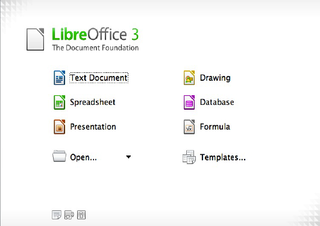

# Εισαγωγή στο  {#libreoffice} 
© Γιάννης Κωστάρας

---

Σ' αυτό το βιβλίο θα αναφερθούμε στη σουΐτα γραφείου LibreOffice. Δεν θα επεκταθούμε σε μια αναλυτική παρουσίαση, αλλά θα δούμε μερικά χρήσιμα εργαλεία που κάνουν τη ζωή μας πιο εύκολη.

Με τον όρο "σουΐτα γραφείου" εννοούμε μια ομάδα προγραμμάτων που εξομοιώνουν απαραίτητες λειτουργίες στον χώρο του γραφείου, όπως π.χ. συγγραφή επιστολών, λογιστικές πράξεις, παρουσιάσεις σε διαφάνειες κλπ., οι οποίες παλαιότερα γίνονταν με άλλα μέσα.

Μια τυπική σουΐτα γραφείου περιλαμβάνει τουλάχιστον τα εξής προγράμματα:

* επεξεργαστή κειμένου
* πρόγραμμα επεξεργασίας λογιστικών φύλλων
* πρόγραμμα δημιουργίας παρουσιάσεων

Επιπλέον, μια σουΐτα γραφείου μπορεί να περιλαμβάνει κι άλλα προγράμματα, όπως:

* πρόγραμμα διαχείρισης βάσεων δεδομένων
* πρόγραμμα επεξεργασίας γραφικών
* πρόγραμμα αποστολής και λήψης ηλεκτρονικού ταχυδρομείου
* ηλεκτρονικό ημερολόγιο
* πρόγραμμα δημιουργίας δημοσιεύσεων
* πρόγραμμα δημιουργίας διαγραμμάτων
* πρόγραμμα διαχείρισης έργων

κ.ά.

Υπήρξαν και υπάρχουν πολλές σουΐτες γραφείου \[1\] με τις πιο γνωστές να είναι οι παρακάτω:

* [Microsoft Office](http://office.microsoft.com/el-gr/)
* [OpenOffice/LibreOffice](http://www.libreoffice.org/)
* [KOffice](http://www.koffice.org/)
* [Apple iWork](http://www.apple.com/iwork/)
* [IBM Lotus Symphony](http://www-03.ibm.com/software/lotus/symphony/home.nsf/home)
* [WordPerfect Office](http://www.corel.com/corel/category.jsp?cat=cat20148&storeKey=us)
* [Google Docs](https://docs.google.com/)
* [Microsoft Office 365](http://www.microsoft.com/office/)
* [Zoho](http://www.zoho.com/)

Η ιστορία του LibreOffice ξεκινάει πριν από το 1999. Τότε ονομαζόταν **StarOffice** και αναπτύχθηκε από τη Γερμανική εταιρία StarDivision, προτού αγοραστεί από τη Sun Microsystems η οποία και θα διαθέσει την έκδοση 5.2 για πρώτη φορά δωρεάν. Το 2002 εμφανίζεται η πρώτη έκδοση ανοικτού κώδικα του StarOffice, με την ονομασία **OpenOffice** \[2\]. Μετά την εξαγορά της Sun από την Oracle, μια ομάδα προγραμματιστών του OpenOffice, με αφορμή την πιθανότητα διακοπής του έργου ή της επιβολής περιορισμών σε αυτό από την Oracle, δημιούργησε στις 28 Σεπτεμβρίου 2010, το **LibreOffice** \[3\].

Η σουΐτα αυτή αποτέλεσε και αποτελεί εδώ και χρόνια το αντίπαλο δέος του Microsoft Office, καθώς διατίθεται δωρεάν και έχει την δυνατότητα να διαχειρίζεται τα αρχεία της σουΐτας MS Office. Επιπλέον είναι διαθέσιμη για όλες τις πλατφόρμες, Windows, Mac και Unix/Linux. Τη στιγμή που γράφονται αυτές οι γραμμές βρίσκεται στην έκδοση 6.

Η σουΐτα LibreOffice αποτελείται από τα παρακάτω προγράμματα:

**Εικόνα 1** _Η σουΐτα LibreOffice_

**Πίνακας 1** _Σύγκριση MS-Office & LibreOffice_

| **MS Office** | **LibreOffice** |
| :--- | :--- |
| Word | Writer |
| Excel | Calc |
| Powerpoint | Impress |
| Access | Base |
| - | Draw |
| - | Math |
| OneNote | - |
| Outlook | - |
| Publisher | - |
| Project | - |
| Visio | - |

Μια λεπτομερής παρουσίαση όλων των προγραμμάτων της σουΐτας θα απαιτούσε πολλά κεφάλαια. Αντί αυτού, ο συγγραφέας θεωρεί ότι έχετε ήδη μια γνωριμία με το LibreOffice και θα προσπαθήσει να παρουσιάσει κάποια πιο προχωρημένα και χρήσιμα χαρακτηριστικά. Στο επόμενο κεφάλαιο θα ξεκινήσουμε με τον επεξεργαστή κειμένου, το Writer.

## Πίνακας περιεχομένων

### LibreOffice Writer
1. [Κεφάλαιο 1 - Εισαγωγή στο LibreOffice Writer](Writer/LibreOfficeWriter_chap1.md)
2. [Κεφάλαιο 2 - Εργαλεία Συνεργασίας](Writer/LibreOfficeWriter_chap2.md)
3. [Κεφάλαιο 3 - Γράψτε με Στυλ](Writer/LibreOfficeWriter_chap3.md)
4. [Κεφάλαιο 4 - Μορφοποίηση](Writer/LibreOfficeWriter_chap4.md)
5. [Κεφάλαιο 5 - Πίνακες](Writer/LibreOfficeWriter_chap5.md)
6. [Κεφάλαιο 6 - Δημιουργία Ιστοσελίδων](Writer/LibreOfficeWriter_chap6.md)
7. [Κεφάλαιο 7 - Συγχώνευση Αλληλογραφίας](Writer/LibreOfficeWriter_chap7.md)

### LibreOffice Calc

### LibreOffice Impress

### LibreOffice Draw

### LibreOffice Math

### LibreOffice Base

---

[->](Writer/LibreOfficeWriter_chap1.md)

---