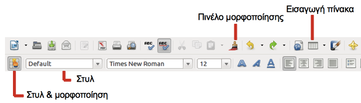
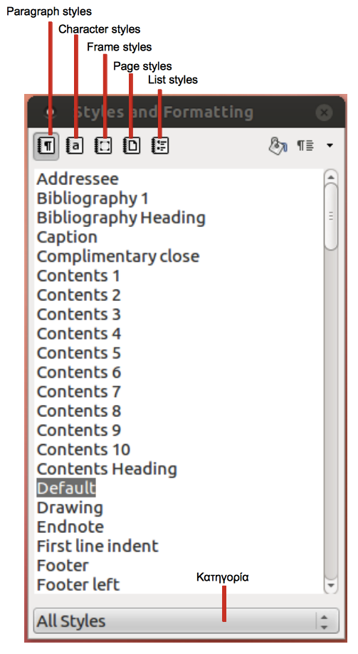
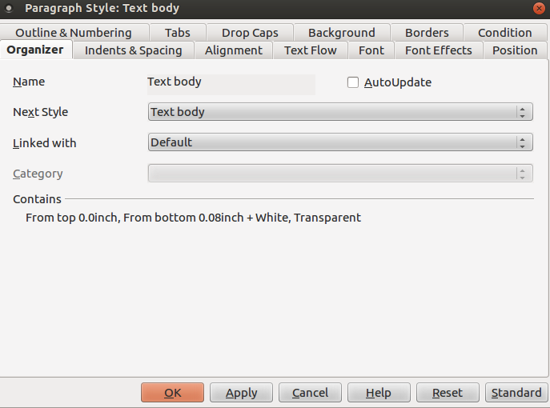
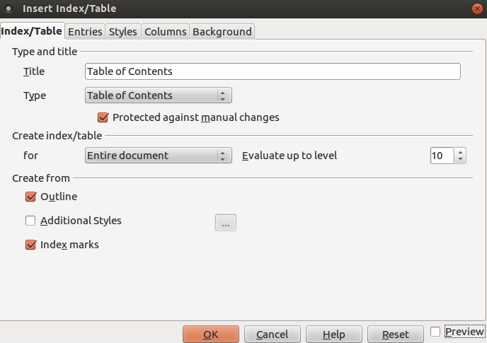
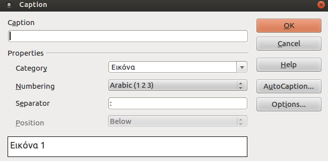
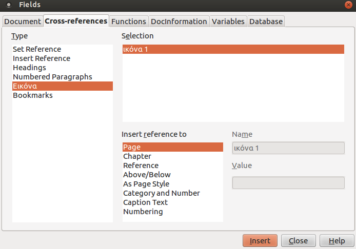
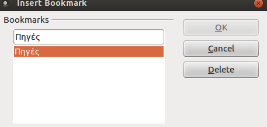

# LibreOffice Writer  
© Γιάννης Κωστάρας

[<-](LibreOfficeWriter_chap2.md) | [->](LibreOfficeWriter_chap4.md)

## Κεφάλαιο 3 - Γράψτε με Στυλ

Το πρόβλημα με τους κειμενογράφους WYSIWYG \(What You See Is What You Get\) είναι ότι μας απασχολεί από πολύ νωρίς η τελική μορφή του εγγράφου αντί να επικεντρωνόμαστε στο περιεχόμενό του. Με άλλα λόγια, ενδιαφερόμαστε προτού καν τελειώσουμε το άρθρο μας για το πώς θα μορφοποιήσουμε τις παραγράφους και τις επικεφαλίδες, αν θα χρησιμοποιήσουμε πλάγια ή έντονη γραφή, διαφορετική γραμματοσειρά \(π.χ. για τμήματα κώδικα—αν γράφετε σχετικά άρθρα όπως ο γράφων\), κλπ. Το πρόβλημα είναι ότι, αν αργότερα αποφασίσετε \(εσείς ή κάποιος άλλος\) να αλλάξετε π.χ. τη γραμματοσειρά Free Mono που χρησιμοποιήσατε για τη συγγραφή κώδικα σε Ubuntu Mono, θα πρέπει να κάνετε χειροκίνητα την αλλαγή σε ολόκληρο το κείμενο. Ή φανταστείτε ότι δίνετε το άρθρο στο αφεντικό σας, ο οποίος σας το επιστρέφει ζητώντας σας να αντικαταστήσετε παντού την έντονη γραφή με πλάγια, γιατί έτσι του αρέσει καλύτερα!

Σε αυτό το κεφάλαιο θα δούμε πώς να γράφουμε πιο... συνετά, δηλ. αφνοντας τη μορφοποίηση του κειμένου μας για το τέλος, χρησιμοποιώντας στυλ.

### 3.1 Στυλ

Αφού τελειώσατε με το περιεχόμενο του άρθρου σας, ξεκινήστε με τη μορφοποίησή του. Από το μενού Format!Styles and Formatting ή το αντίστοιχο κουμπί της γραμμής εργαλείων μορφοποίησης \(βλ. Εικόνα 1\) εμφανίστε το ανάλογο παράθυρο. Το LibreOffice Writer διαθέτει πέντε κατηγορίες στυλ \(βλ. Εικόνα 2\): παραγράφου, χαρακτήρα, πλαισίου, σελίδας και λίστας.

**Εικόνα 3.1** _Γραμμές Εργαλείων_
                      

**Εικόνα 3.2** _Στυλ και μορφοποίηση_

Ας υποθέσουμε ότι θέλετε να αλλάξετε την εξ ορισμού γραμματοσειρά του εγγράφου σας, δηλ. τη γραμματοσειρά όλου του κειμένου. Επιλέξτε Text Body από το παραπάνω παράθυρο, δεξί κλικ και **Modify**. Από το παράθυρο Paragraph Style: Text Body που εμφανίζεται, επιλέξτε την καρτέλα Font, επιλέξτε τη γραμματοσειρά της αρεσκείας σας και **OK**. Η γραμματοσειρά ολόκληρου του κειμένου σας άλλαξε.

**Εικόνα 3.3** _Διαλογικό παράθυρο αλλαγής στυλ παραγράφου_

Με τον ίδιο τρόπο επιλέξτε π.χ. μια επικεφαλίδα \(heading\) \(το στυλ της επιλέγεται αυτόματα στο παραπάνω παράθυρο\) και επιλέξτε δεξί κλικ → **Modify** για να το αλλάξετε. Όπως βλέπετε, υπάρχουν πολλά πράγματα που μπορείτε να αλλάξετε, όπως η γραμματοσειρά, το μέγεθος και το χρώμα της, η στοίχιση, το περίγραμμα, το διάκενο μεταξύ των γραμμών και πολλά άλλα. Αφιερώστε λίγο χρόνο να δείτε τις διαθέσιμες κατηγορίες στυλ από την πτυσσόμενη λίστα στο κάτω μέρος του παραθύρου της εικόνας 2.

Για να ορίσετε επικεφαλίδες επιλέξτε το κείμενο που θα περιέχει η επικεφαλίδα και επιλέξτε Heading 1 από την πτυσσόμενη λίστα Apply Styles που βρίσκεται αριστερά της πτυσσόμενης λίστας με τις γραμματοσειρές στη γραμμή εργαλείων μορφοποίησης \(βλ. Εικόνα 1\). Οι υποκεφαλίδες θα έχουν στυλ Heading 2, οι υπο-υποκεφαλίδες Heading 3 κ.ο.κ.

Ένας πιο εύκολος τρόπος για να αλλάξετε ένα υπάρχον στυλ είναι ο εξής: τροποποιήστε το κείμενό σας \(π.χ. με τη γραμματοσειρά που επιθυμείτε, έντονη γραφή κλπ.\), στη συνέχεια επιλέξτε το στυλ από το παράθυρο της εικόνας 2 και τέλος επιλέξτε το πάνω δεξιά κουμπί του παραθύρου και την επιλογή Update Style.

### 3.2 Πρότυπα Εγγράφων

Μπορείτε να δημιουργήσετε ένα πρότυπο εγγράφου \(template\), το οποίο θα περιέχει τις μορφοποιήσεις και τα στυλ της αρεσκείας σας, και κάθε φορά να δημιουργείτε τα κείμενα σας με βάση αυτό το πρότυπο.

Δημιουργήστε ένα κενό έγγραφο και προσθέστε τις μορφοποιήσεις και τα στυλ σας σε δείγματα κειμένου, όπως λεζάντες, παραπομπές, επικεφαλίδες \(headings\), κεφαλίδες \(headers\) και υποσέλιδα.

Έστω ότι θέλετε να δημιουργήσετε ένα βιβλίο. Αφού ορίσετε τα παραπάνω στυλ, κάντε κλικ στο κουμπί στυλ σελίδων \(βλ. Εικόνα 2\) και τροποποιήστε τα διαθέσιμα στυλ σελίδων \(π.χ. μπορείτε να ορίσετε διαφορετικά στυλ σελίδων για εξώφυλλο, copyright, πίνακα περιεχομένων, πρόλογο, κεφάλαια και αλφαβητικό ευρετήριο\). Το στυλ μπορεί να είναι διαφορετικό για την πρώτη σελίδα κάθε κεφαλαίου, καθώς και για τις αριστερές και τις δεξιές σελίδες \(π.χ. για να μείνει χώρος για τη βιβλιοδεσία, εφόσον το βιβλίο θα εκτυπωθεί μπρος-πίσω\). Έτσι, αν θέλετε κάθε νέο κεφάλαιο να ξεκινάει σε δεξιά σελίδα, επιλέξτε **First Page → Modify → καρτέλα Page → Page Layout: Only Right**. Στην καρτέλα Organizer ορίστε το Next Style: Left Page.

Στη συνέχεια, ανοίξτε το στυλ της αριστερής σελίδας, κάντε όποιες αλλαγές θέλετε, και μην ξεχάσετε να ορίσετε το Next Style: Right Page. Αντίστοιχα, στο στυλ της δεξιάς σελίδας επιλέξτε Next Style: Left Page.

Τώρα μπορείτε να αποθηκεύσετε το έγγραφό σας ως πρότυπο: μενού **File → Templates → Save → MyTemplates**, δίνοντας ένα όνομα και OK. Την επόμενη φορά που θα θελήσετε να δημιουργήσετε ένα έγγραφο με τα αγαπημένα σας στυλ και μορφοποιήσεις πηγαίνετε μενού **File → New → Templates and Documents → MyTemplates**, επιλέγετε το πρότυπό σας και Open, και ξεκινάτε τη συγγραφή του άρθρου σας με βάση αυτό το πρότυπο.

### 3.3 Πίνακας περιεχομένων και ευρετήρια

Αν ορίσατε τις επικεφαλίδες του εγγράφου σας χρησιμοποιώντας τα στυλ Heading 1, Heading 2, κ.ο.κ., όπως περιγράψαμε παραπάνω, τότε μπορείτε να δημιουργήσετε έναν πίνακα περιεχομένων. Κάντε κλικ στην αρχή του εγγράφου σας \(ή όπου επιθυμείτε να προσθέσετε τον πίνακα περιεχομένων\) και επιλέξτε **Insert → Indexes and Tables → Indexes and Tables**. Εμφανίζεται το παράθυρο της εικόνας 3.4. Επιλέξτε την καρτέλα **Index/Table**, τύπο **Table of Contents**, δώστε έναν τίτλο για τον πίνακα περιεχομένων σας \(π.χ. “Πίνακας Περιεχομένων”\) και πατήστε **OK**. Μπορείτε να ενημερώνετε τον πίνακα περιεχομένων με τις αλλαγές του εγγράφου σας κάνοντας δεξί κλικ πάνω του και επιλέγοντας **Update Index/Table**. Άλλες διαθέσιμες επιλογές είναι οι **Edit Index/Table** \(εμφάνιση του παραθύρου της εικόνας 3.4\) και **Delete Index/Table**.

**Εικόνα 3.4** _Πίνακας περιεχομένων_

Από το ίδιο μενού μπορείτε να προσθέσετε λίστα εικόνων, πινάκων, κλπ. Απλά, επιλέξτε τον κατάλληλο τύπο από την πτυσσόμενη λίστα **Type**. Θα πρέπει όμως πρωτύτερα να έχετε δηλώσει λεζάντες για τις εικόνες, τους πίνακες, κλπ.

Αλλά ας πάρουμε τα πράγματα με τη σειρά. Για να εισάγετε μια εικόνα στο έγγραφό σας επιλέξτε **Insert → Picture → From File**, επιλέξτε την εικόνα σας και **OK**. Στη συνέχεια κάντε δεξί κλικ στην εικόνα και επιλέξτε **Caption**. Εμφανίζεται διαλογικό παράθυρο της παρακάτω εικόνας.

**Εικόνα 3.5** _Εισαγωγή Λεζάντας_

Εισάγετε το περιεχόμενο της λεζάντας στο πρώτο πλαίσιο κειμένου. Επίσης, μπορείτε να ορίσετε την ίδια τη λεζάντα, γράφοντας στο πλαίσιο Category \(όπως φαίνεται στην εικόνα 3.5\). Μπορείτε ακόμα να ορίσετε τη θέση \(δηλ. πάνω ή κάτω από την εικόνα\), κλπ.

Αφού δημιουργήσετε λεζάντες για όλες τις εικόνες σας, μπορείτε να δημιουργήσετε ένα ευρετήριο εικόνων όπως περιγράψαμε στην αρχή αυτής της ενότητας \(επιλέγοντας τον τύπο **Illustration Index**\).

Παρομοίως, μπορείτε να εισάγετε έναν πίνακα είτε από το μενού **Table → Insert Table**, είτε από το κουμπί **Table** της βασικής γραμμής εργαλείων \(βλ. Εικόνα 3.1\) – θα αφιερώσουμε ολόκληρο κεφάλαιο για τους πίνακες. Και στις δυο περιπτώσεις ορίστε τον αριθμό γραμμών και στηλών του πίνακα. Στη συνέχεια, όπως και με τις εικόνες, κάντε δεξί κλικ πάνω στον πίνακα και επιλέξτε **Caption**. Τροποποιήστε τη λεζάντα του πίνακα κατά τον ίδιο τρόπο όπως περιγράψαμε και πιο πάνω για τις εικόνες. Τέλος, δημιουργήστε ένα ευρετήριο πινάκων όπως περιγράψαμε στην αρχή αυτής της ενότητας \(επιλέγοντας τον τύπο **Index of Table**\).

Το LibreOffice Writer σας δίνει τη δυνατότητα να δημιουργήσετε ακόμα και αλφαβητικό ευρετήριο \(κάτι που λείπει παρεμπιπτόντως από πολλά ελληνικά βιβλία του εμπορίου\). Επιλέξτε τη λέξη που θέλετε να εμφανιστεί στο ευρετήριο και κάντε κλικ στο μενού **Insert → Indexes and Tables → Entry → Insert**. Αφού ολοκληρώσετε την επιλογή των λέξεων του ευρετηρίου, το αλφαβητικό ευρετήριο δημιουργείται όπως και προηγουμένως \(επιλέγοντας τον τύπο **Alphabetical Index**.\)

### 3.4 Παραπομπές

Μερικές φορές ενδέχεται να χρειαστεί να παραπέμψετε τον αναγνώστη σας σε κάποια εικόνα, κάποιο πίνακα ή κάποιο άλλο μέρος του κειμένου, π.χ. επικεφαλίδα, σελιδοδείκτη, κλπ. Π.χ. «όπως φαίνεται στην εικόνα 2...». Για να παραπέμψετε στην εικόνα 2 επιλέξτε το μενού **Insert →  Cross Reference** και από το διαλογικό παράθυρο που εμφανίζεται \(βλ. Εικόνα 3.6\) επιλέξτε **Type: Εικόνα, Insert reference to: Category and Number**, την παραπομπή που επιθυμείτε \(δηλ. Εικόνα 3.1 από το πλαίσιο **Selection**\), και τέλος **Insert**. Όπως βλέπετε, μπορείτε να δημιουργήσετε παραπομπές σε επικεφαλίδες, αναφορές, σελιδοδείκτες, εικόνες, πίνακες, κλπ.

**Εικόνα 3.6** _Εισαγωγή παραπομπής_

Καθώς προσθαφαιρείτε εικόνες, πίνακες, κλπ. στο κείμενό σας, οι αύξοντες αριθμοί των λεζάντων, παραπομπών, κλπ. ενημερώνονται αυτόματα.

### 3.5 Σελιδοδείκτες

Μιας και αναφέρθηκε, και για να είναι πλήρες το κεφάλαιο, μπορείτε να δημιουργήσετε σελιδοδείκτες από το μενού** Insert → Bookmark**. Γενικά, χρησιμοποιήστε τους σελιδοδείκτες για κείμενο που δεν καλύπτεται από τις άλλες κατηγορίες \(επικεφαλίδες, λεζάντες κλπ.\), αλλά προς το οποίο θέλετε να παραπέμψετε. Για να παραπέμψετε σε έναν σελιδοδείκτη επιλέξτε και πάλι **Insert → Cross Reference** \(βλ. Εικόνα 3.6\). Τέλος, μπορείτε να επεξεργαστείτε ή/και να διαγράψετε τους σελιδοδείκτες από το ίδιο διαλογικό παράθυρο από όπου τους προσθέσατε \(βλ. Εικόνα 3.7\).

**Εικόνα 3.7** _Διαχείριση σελιδοδεικτών_

**Πηγές:**

1. Marongiu Μ. \(2006\), “Writing documents with OpenOffice.org Writer”, [_Free Software Magazine_](http://www.freesoftwaremagazine.com), τεύχος 14, Σεπτέμβριος/Οκτώβριος, σελ. 21-26.
2. Popov D. \(2009\), “Creating a Book Template with Writer”, [_Free Software Magazine_](http://www.freesoftwaremagazine.com), τεύχος 20, σελ. 41-45.
3. Perry E. \(2011\), “How To – Libre Office Part 3”, [Full Circle Magazine](http://fullcirclemagazine.org/issue-48), τεύχος 48, σελ. 16-18.
1. Perry E. \(2014\), “How To – Libre Office Part 38 - Contents and Indexes”, [Full Circle Magazine](http://fullcirclemagazine.org/issue-86), τεύχος 86, σελ. 17-20.
4. LibreOffice \(2011\), [Getting Started with LibreOffice 3.3](http://wiki.documentfoundation.org/images/c/c4/0100GS3-GettingStartedLibO.pdf).
5. LibreOffice \(2011\), [LibreOffice Writer Guide – Word Processing with LibreOffice 3.3](http://wiki.documentfoundation.org/images/b/ba/0200WG3-WriterGuide.pdf).
6. Chanelle A. \(2009\), _Beginning OpenOffice 3 From Novice to Professional_, Apress.
7. Miller R. \(2005\), _Point & Click OpenOffice.org!_, Prentice Hall.

---

[<-](LibreOfficeWriter_chap2.md) | [->](LibreOfficeWriter_chap4.md)

---