# LibreOffice Writer  
© Γιάννης Κωστάρας

---

[🏠](https://jkost.github.io) | [⬆️](../README.md) | [◀️](LibreOfficeWriter_chap3.md) | [▶️](LibreOfficeWriter_chap5.md)

## Κεφάλαιο 4 - Μορφοποίηση

Σ’ αυτό το κεφάλαιο θα δούμε τις δυνατότητες μορφοποίησης που προσφέρει το LibreOffice.

### 4.1 Διαμόρφωση κειμένου

Επιλέξτε το κείμενο που θέλετε να μορφοποιήσετε. Από το μενού **Format → Character**, ή με δεξί κλικ και επιλογή του μενού **Character**, εμφανίζεται το διαλογικό παράθυρο _Character_ (βλ. Εικόνα 4.1).

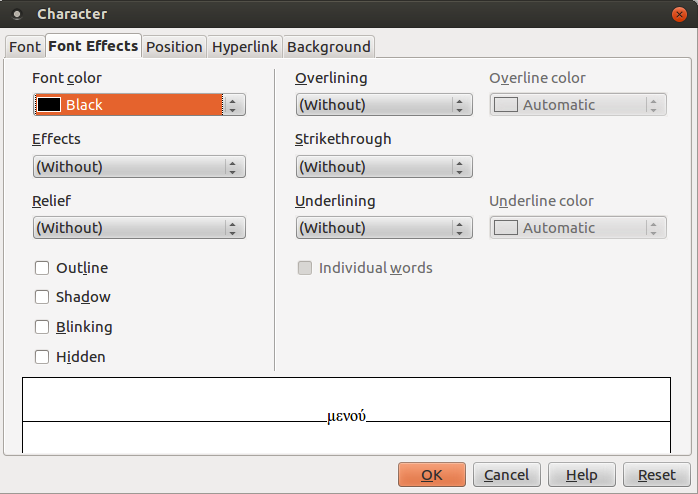

**Εικόνα 4.1** _Διαλογικό παράθυρο Character, καρτέλα Font Effects_	

Η καρτέλα _Εφέ κειμένου_ προσφέρει πολλές επιλογές όπως:

* Χρώμα γραμματοσειράς (μπορείτε να το βρείτε και σαν κουμπί της εργαλειοθήκης Μορφοποίηση)
* Εφέ (κεφαλαία, πεζά, τίτλος, μικρά κεφαλαία)
* Ανάγλυφο (ανάγλυφο, χαραγμένο)
* Διάρθρωση, σκιά, φλας, κρυφό (άμα θέλετε το κείμενο να μη φαίνεται). Βέβαια, από το μενού **Tools → Options → LibreOffice Writer → Formating Aids** μπορείτε να επιλέξετε να φαίνεται το κρυφό κείμενο τσεκάροντας το αντίστοιχο κουμπί επιλογής. Τότε, αν έχετε επιλεγμένο το **View → Nonprinting** characters, το κρυφό κείμενο φαίνεται με εστιγμένη διαγράμμιση. Αν και μπορεί να σας φαίνεται περίεργο να ορίσετε κείμενο ως κρυφό, έχει συμβεί στο παρελθόν να έχει δημοσιευθεί έγγραφο του οποίου τμήματα είχαν μορφοποιηθεί ως κρυφά επειδή είχαν λογοκριθεί. Χάκερς όμως πολύ εύκολα δημοσίευσαν ολόκληρο το έγγραφο εμφανίζοντας και τα λογοκριμένα (κρυφά) τμήματα χρησιμοποιώντας την παραπάνω τεχνική.
* Διαγράμμιση (και χρώμα διαγράμμισης)
* Διακριτή γραφή
* Υπογράμμιση (και χρώμα υπογράμμισης)

Στο κάτω μέρος του παραθύρου υπάρχει η προεπισκόπιση όπου μπορείτε να δείτε το αποτέλεσμα των επιλογών σας προτού πατήσετε **OK** για να τις εφαρμόσετε.

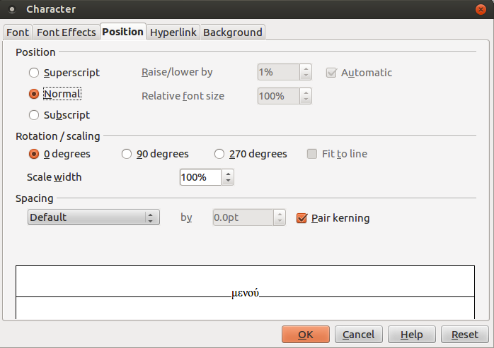

**Εικόνα 4.2** _Διαλογικό παράθυρο Character, καρτέλα Position_

Η καρτέλα _Θέση_ σας δίνει τις εξής δυνατότητες:
* να ρυθμίσετε τον εκθέτη/δείκτη (την κατακόρυφη απόστασή του και το μέγεθός του σχετικά με το κείμενο)
* να περιστρέψετε το κείμενο (90° ή 270°)
* να αυξήσετε / μειώσετε το πλάτος του κειμένου (διεύρυνση / σύμπτυξη)

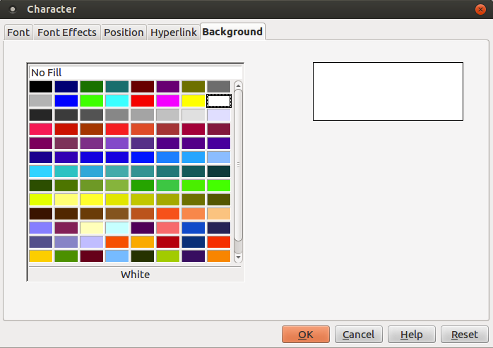

**Εικόνα 4.3** _Διαλογικό παράθυρο Character, καρτέλα Background_

Η καρτέλα _Παρασκήνιο (Background)_ τέλος, σας επιτρέπει να αλλάξετε το χρώμα φόντου του κειμένου.

### 4.2 Διαμόρφωση παραγράφου

Κάντε κλικ στην παράγραφο που θέλετε να μορφοποιήσετε και στη συνέχεια δεξί κλικ και μενού **Paragraph** ή από το μενού **Format → Paragraph**. Εμφανίζεται το διαλογικό παράθυρο _Paragraph_ (βλ. Εικόνα 4.4).


**Εικόνα 4.4** _Διαλογικό παράθυρο Paragraph, καρτέλα Indents & Spacing_

Από την καρτέλα **Παρασκήνιο (Background)** μπορείτε ν’ αλλάξετε το χρώμα φόντου της παραγράφου.
H καρτέλα **Εσοχές & διάστιχο (Indents & Spacing)** σας επιτρέπει να (βλ. Εικόνα 4.4):
* αλλάξετε τις εσοχές της παραγράφου ή μόνο της 1ης γραμμής της παραγράφου
* το κενό μεταξύ της παραγράφου και των παραγράφων πριν και μετά 
* το διάστιχο μεταξύ των γραμμών της παραγράφου.
Η καρτέλα **Στοίχιση (Alignment)** σας επιτρέπει να αλλάξετε τη στοίχιση του κειμένου (αριστερή, κέντρο, δεξιά ή πλήρη).
Η καρτέλα **Ροή κειμένου (Text Flow)** (βλ. Εικόνα 4.5) σας επιτρέπει να:
* ορίσετε που να χωρίζεται μια λέξη όταν φθάνει στο τέλος της γραμμής (συλλαβισμός) δηλ. που θα μπει το ενωτικό (-). Δηλώνετε πόσους χαρακτήρες θα πρέπει να αφήνετε στο τέλος/στην αρχή της γραμμής και το μέγιστο αριθμό διαδοχικών ενωτικών. Αν δεν ορίσετε συλλαβισμό, τότε αν μια λέξη δε χωράει στην τρέχουσα γραμμή πηγαίνει ολόκληρη στην επόμενη γραμμή.
* εισάγετε αλλαγές σελίδας/στήλης κλπ. (βλ. και Insert → Manual Break)
* ρυθμίσετε τη συμπεριφορά της παραγράφου όπως:
  * να μη χωριστεί η παράγραφος αν αλλάξει σελίδα, δηλ. μετακινείται ολόκληρη η παράγραφος στην επόμενη σελίδα
  * διατηρεί την τρέχουσα και την επόμενη παράγραφο μαζί
  * ορίζει τον ελάχιστο αριθμό γραμμών της παραγράφου πριν την αλλαγή σελίδας, δηλ. αν ο αριθμός γραμμών της παραγράφου στο τέλος της σελίδας είναι μικρότερος από τον αριθμό που ορίσατε, τότε η παράγραφος μετακινείται στην επόμενη σελίδα
  * ορίζει τον ελάχιστο αριθμό γραμμών της παραγράφου της επόμενης σελίδας, αν αυτός είναι μικρότερος από τον αριθμό γραμμών που ορίσατε, τότε προσαρμόζεται ανάλογα η θέση της αλλαγής σελίδας.

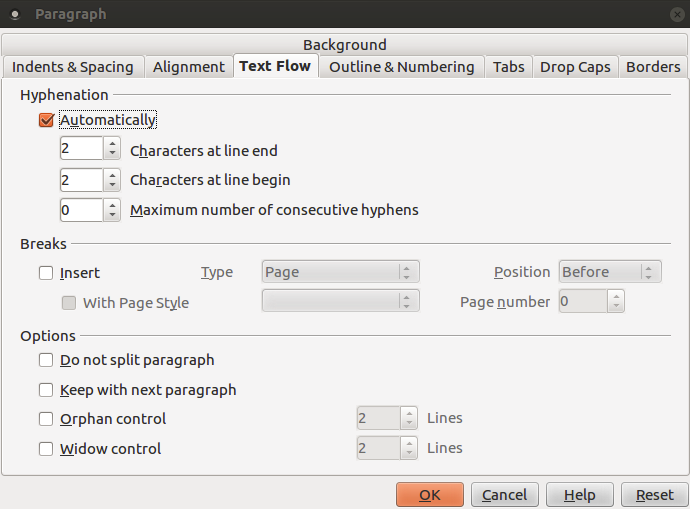

**Εικόνα 4.5** _Διαλογικό παράθυρο Paragraph, καρτέλα Text Flow_

Η καρτέλα _Στηλοθέτες (Tabs)_ σας επιτρέπει να ορίσετε στηλοθέτες ώστε να στοιχίσετε κατακόρυφα το κείμενό σας.

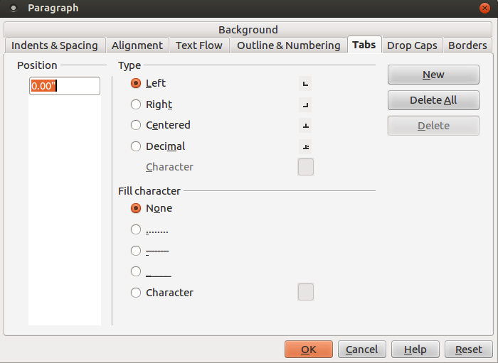

**Εικόνα 4.6** _Διαλογικό παράθυρο Paragraph, καρτέλα Tabs_

Όπως βλέπετε στην εικόνα 4.6, μπορείτε να ορίσετε 4 κατηγορίες στηλοθετών:
* Αριστερός └
* Δεξιός ┘
* Κεντρώος ┴
* Δεκαδικός ┴ֺ
Για να ορίσετε π.χ. έναν αριστερό στηλοθέτη πρέπει να εισάγετε πόσες ίντσες από την αριστερή άκρη της σελίδας θέλετε να τοποθετηθεί ο στηλοθέτης και πατάτε το κουμπί **New**.

Πιο εύκολος τρόπος ορισμού στηλοθετών είναι από τον χάρακα (μενού **View → Ruler**). Θα παρατηρήσετε ότι στην αριστερή άκρη του χάρακα υπάρχει το σύμβολο το αριστερού στηλοθέτη (└). Κάντε δεξί κλικ πάνω του και αλλάξτε τη μονάδα μέτρησης αν επιθυμείτε (π.χ. από ίντσες σε εκατοστά). Στη συνέχεια κάντε κλικ σε κάποιο σημείο του χάρακα (π.χ. στα 3 εκατοστά). Θα δείτε ότι εμφανίστηκε ο αριστερός στηλοθέτης κάτω από το 3. Πατώντας το TAB θα παρατηρήσετε ότι ο δρομέας πλέον κάνει μια εσοχή 3 εκατοστών, δηλ. βρίσκεται ακριβώς κάτω από τον στηλοθέτη. Με τον τρόπο αυτό μπορείτε να γράψετε κείμενο που να είναι αριστερά στοιχισμένο στον αριστερό στηλοθέτη.

Για να ορίσετε έναν δεξιό στηλοθέτη, κάντε κλικ πάνω στο σύμβολο του στηλοθέτη στο αριστερό μέρος του χάρακα μέχρι να εμφανιστεί το σύμβολό του ┘. Από εκεί και πέρα ορίζετε τον δεξιό στηλοθέτη όπως προηγουμένως. Παρατηρήστε ότι το κείμενο που γράφετε στοιχίζεται δεξιά στον δεξιό στηλοθέτη (μην ξεχάσετε να πατήσετε το ΤΑΒ τόσες φορές μέχρις ότου ο δρομέας φτάσει κάτω από τον στηλοθέτη). Όμοια ισχύουν για τον κεντρώο στηλοθέτη ┴. Το κείμενο στοιχίζεται στο κέντρο γύρω από το στηλοθέτη.

Ας δούμε ένα παράδειγμα.

Ορίστε έναν αριστερό στηλοθέτη στα 2 εκ. και πατήστε ΤΑΒ. Γράψτε την 1η γραμμή του παρακάτω κειμένου. Πατήστε ENTER και ΤΑΒ και γράψτε τη 2η γραμμή και πατήστε ENTER. Ορίστε έναν δεξιό στηλοθέτη στα 11 εκ. Πατήστε δυο φορές ΤΑΒ και γράψτε την 3η γραμμή. Πατήστε ENTER, δυο φορές TAB και γράψτε την 4η
γραμμή και πατήστε ENTER.

Ορίστε τον κεντρώο στηλοθέτη στα 6 εκ. Πατήστε δυο φορές ΤΑΒ και γράψτε την 5η γραμμή. Πατήστε ENTER, δυο φορές TAB και γράψτε την 6η γραμμή.

```
 └ 				┴   						┘
 Νίκος Παπαδόπουλος
 Ιερού Λόχου 33
											 Προς
					Περιοδικό Ubuntistas
			   Κυριακή, 24 Φεβρουαρίου 2013
				  Θέμα: Δημοσίευση άρθρου
```
Ο δεκαδικός στηλοθέτης χρησιμοποιείται για στοίχιση δεκαδικών αριθμών ως προς την υποδιαστολή. Ορίστε έναν δεκαδικό στηλοθέτη, στη συνέχεια πατήστε ΤΑΒ ώστε ο δρομέας να βρεθεί από κάτω του και γράψτε τα παρακάτω:
```
    ┴ֺ
  23,769
 599,33
   0,1234
  12,2
```
Μπορείτε φυσικά να μετακινήσετε τους στηλοθέτες είτε επιλέγοντάς τους στο χάρακα και σέρνοντάς τους σε μια νέα θέση είτε από το παράθυρο της εικόνας 4.6 ορίζοντας μια νέα τιμή Position. Μπορείτε επίσης και να τους διαγράψετε, είτε επιλέγοντάς τους στο χάρακα και σέρνοντάς τους έξω (π.χ. κάτω) από αυτόν είτε από το παράθυρο της εικόνας 4.6. Τέλος, μπορείτε αντί για το κενό να ορίσετε κάποιον άλλο χαρακτήρα για το στηλοθέτη (ΤΑΒ) όπως π.χ. την τελεία (.), την κάτω παύλα (_) κλπ. όπως φαίνεται στο κάτω μέρος του παραθύρου της εικόνας 4.6. Η καρτέλα _Αρχιγράμματα (Drop Caps)_ σας επιτρέπει να ορίσετε αρχιγράμματα (Μια φορά κι έναν καιρό...).

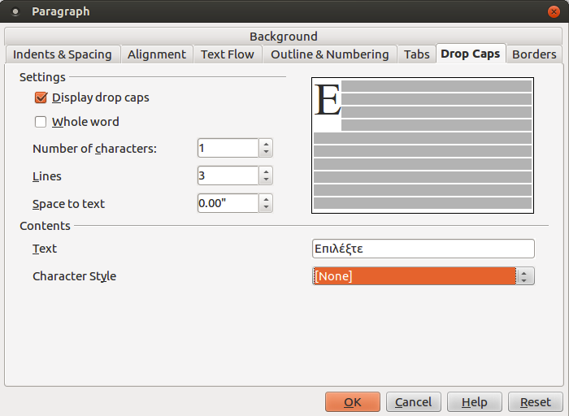

**Εικόνα 4.7** _Διαλογικό παράθυρο Paragraph, καρτέλα Drop Caps_

Τέλος η καρτέλα _Περιγράμματα (Borders)_, σας επιτρέπει να ορίσετε περιγράμματα παραγράφου όπως οι δυο πιο πάνω περιγεγραμμένοι παράγραφοι που περικλείουν τα παραδείγματα με τους στηλοθέτες.

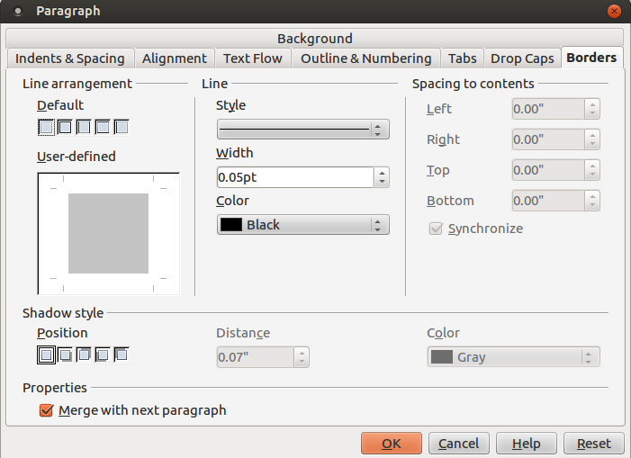

**Εικόνα 4.8** _Διαλογικό παράθυρο Paragraph, καρτέλα Borders_

Μπορείτε να επιλέξετε το στυλ/πάχος/χρώμα γραμμής, σκίαση καθώς και την απόσταση που θα ’χει το κείμενο από το περίγραμμα.


### 4.3 Διαμόρφωση σελίδας

Όπως μπορείτε να διαμορφώσετε ένα χαρακτήρα ή μια παράγραφο, μπορείτε να διαμορφώσετε και ολόκληρη τη σελίδα (δεξί κλικ και μενού **Page** ή από το μενού **Format → Page**). Την πρώτη καρτέλα (Organizer) την είδαμε στο προηγούμενο κεφάλαιο. Η καρτέλα _Page_ (βλ. Εικόνα 4.9) σας επιτρέπει να ορίσετε το μέγεθος του χαρτιού (π.χ. Α4, Letter), τον προσανατολισμό της σελίδας και τα περιθώρια που θ’ αφήσετε γύρω από το κείμενο.

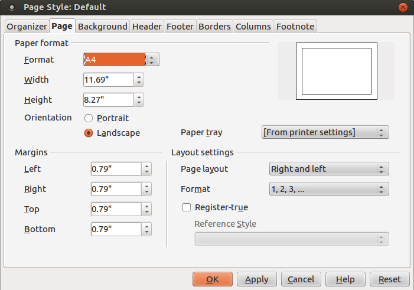

**Εικόνα 4.9** _Διαλογικό παράθυρο Page, καρτέλα Page_

Μπορείτε να ρυθμίσετε ξεχωριστά τη δεξιά ή την αριστερή σελίδα ή να επιλέξετε «Mirroring» από την πτυσσόμενη λίστα Page Layout στην περίπτωση που γράφετε ένα βιβλίο. Έτσι, αν π.χ. χρειάζεται να «δέσετε» το βιβλίο σας στο αριστερό μέρος, αυξήστε το αριστερό περιθώριο. Η επιλογή Mirrored (Κατροπτισμός) θα εμφανίσει το περιθώριο δεσίματος στα αριστερά για τις δεξιές σελίδες και στα δεξιά για τις αριστερές. Οι καρτέλες Κεφαλίδα (Header)/Υποσέλιδο (Footer) σας επιτρέπουν να ορίσετε κεφαλίδα/υποσέλιδο αντίστοιχα.

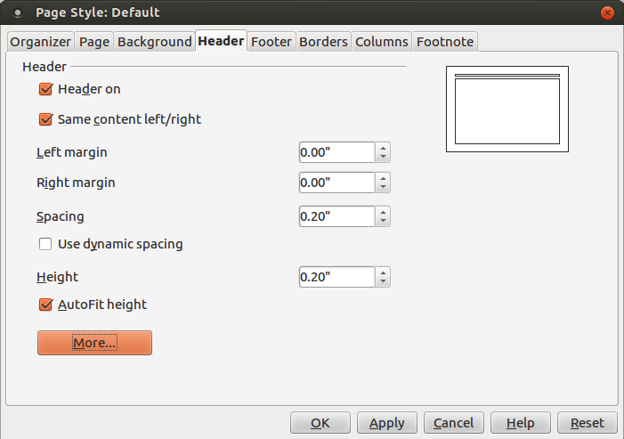

**Εικόνα 4.10** _Διαλογικό παράθυρο Page, καρτέλα Header_

Μπορείτε να ορίσετε διαφορετική(-ό) κεφαλίδα (υποσέλιδο) στις ζυγές και μονές σελίδες καθώς και διαφορετική(-ό) κεφαλίδα (υποσέλιδο) στην 1η σελίδα ή καθόλου. Επιλέγοντας την **Αυτόματη Προσαρμογή Ύψους (AutoFit Height)** και το κουμπί **More** μπορείτε να διαμορφώσετε κατάλληλα την κεφαλίδα (υποσέλιδο) ορίζοντας περιγράμματα ή/και χρώμα φόντου. Μπορείτε να χωρίσετε μια σελίδα σε στήλες από την καρτέλα Columns (βλ. Εικόνα 4.11) ή από το μενού **Format → Columns**.

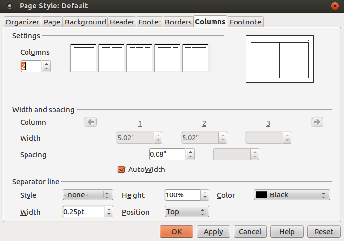

**Εικόνα 4.11** _Διαλογικό παράθυρο Page, καρτέλα Columns_

Μπορείτε να ορίσετε το πλάτος και την απόσταση μεταξύ των στηλών καθώς και να εμφανίσετε μια διαχωριστική γραμμή. Τέλος, από την καρτέλα Footnote μπορείτε να ρυθμίσετε τις υποσημειώσεις (π.χ. αν υπάρχει διαχωριστική γραμμή, το μήκος της κλπ.)

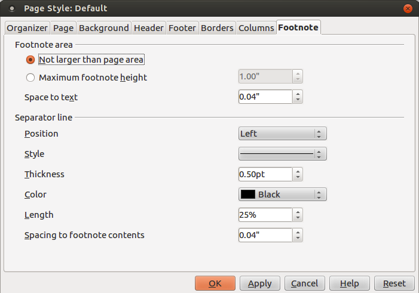

**Εικόνα 4.12** _Διαλογικό παράθυρο Page, καρτέλα Footnote_

### 4.4 Αυτόματη διόρθωση
Ίσως θα έχετε παρατηρήσει ότι καθώς πληκτρολογείτε, το LibreOffice διορθώνει αυτόματα κάποια τυπογραφικά σας λάθη. Αν όχι, τότε για να
ενεργοποιήσετε την αυτόματη διόρθωση επιλέξτε **Format → AutoCorrect → While Typing**. Το τι διορθώνεται το ορίζετε από το παράθυρο **Format
 → AutoCorrect → AutoCorrect Options** ή **Tools → AutoCorrect Options** (βλ. Εικόνα 4.13).

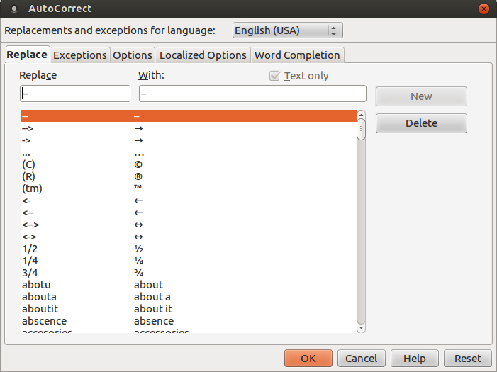

**Εικόνα 4.13** _Διαλογικό παράθυρο AutoCorrect, καρτέλα Replace_

Από τη λίστα αυτή καταλαβαίνετε γιατί όταν πληκτρολογείτε π.χ. –> και κενό εμφανίζεται → ή γιατί το (C) αντικαθίσταται με το ©. Επίσης, βλέπετε
μια μεγάλη λίστα από λέξεις με ένα ή περισσότερα τυπογραφικά λάθη στα αριστερά και την αντικατάστασή τους με τη σωστή λέξη στα δεξιά. Μπορείτε να ορίσετε τις δικές σας διορθώσεις στα δυο πλαίσια κειμένου Replace With στην κορυφή και πατώντας New. Αν επιλέξετε τη γλώσσα Greek αντί για English (USA) θα δείτε δυστυχώς ότι δεν υπάρχουν αντίστοιχες διορθώσεις για τα ελληνικά. Μπορείτε όμως να προσθέσετε μερικές όπως π.χ. το “ με « και το ” με το » (τα ελληνικά εισαγωγικά θα τα βρείτε από το μενού **Insert → Special Character**) και πατώντας το κουμπί **New*.

Η καρτέλα _Εξαιρέσεις (Exceptions)_ εμφανίζει δυο λίστες:
* μία με τις λέξεις ή τις συντομεύσεις που τελειώνουν σε τελεία και που δε θέλετε η επόμενη λέξη να ξεκινήσει με κεφαλαίο γράμμα (π.χ. μετά τη λέξη e.g.) και
* μια λίστα με τις λέξεις ή συντομεύσεις που ξεκινούν με δύο κεφαλαία γράμματα που δε θέλετε το LibreOffice να αλλάξει σε ένα κεφαλαίο αρχικό γράμμα (π.χ. το PC δε θέλετε να γίνει Pc). 

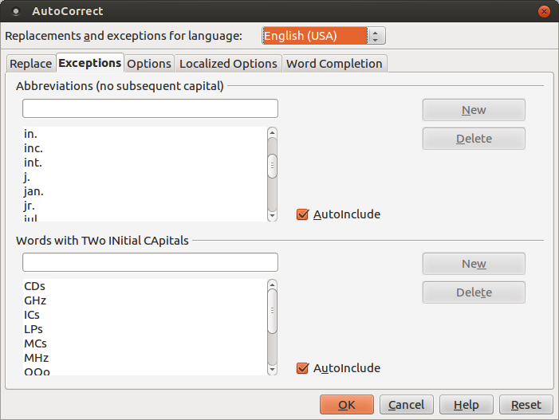

**Εικόνα 4.14** _Διαλογικό παράθυρο AutoCorrect, καρτέλα Exceptions_

Οι διάφοροι κανόνες που εφαρμόζονται καθώς πληκτρολογείτε φαίνονται στην καρτέλα _Options_ (βλ. Εικόνα 4.15):

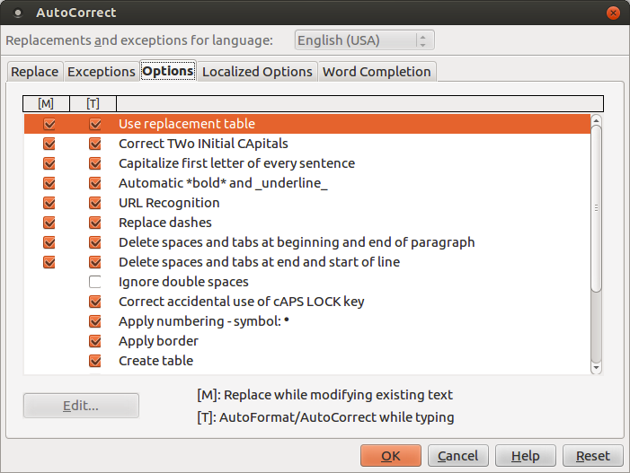

**Εικόνα 4.15** _Διαλογικό παράθυρο AutoCorrect, καρτέλα Options_

Στην καρτέλα αυτή βλέπετε π.χ. γιατί όταν πληκτρολογείτε μια λέξη με δυο κεφαλαία γράμματα, το δεύτερο κεφαλαίο μετατρέπεται σε μικρό. Η επόμενη καρτέλα περιλαμβάνει τοπικούς κανόνες ανάλογα με την τοποθεσία/γλώσσα. Εδώ π.χ. μπορείτε επίσης να ορίσετε την αντικατάσταση του “ με « και του ” με το ».

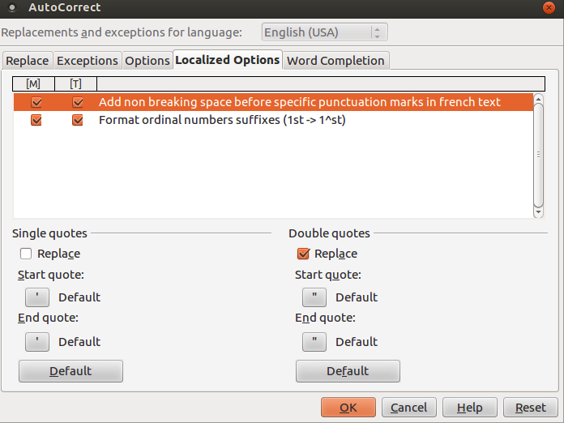

**Εικόνα 4.16** _Διαλογικό παράθυρο AutoCorrect, καρτέλα Localized Options_

Τέλος, η καρτέλα Word Completion εμφανίζει μια λίστα από λέξεις που εμφανίζονται ως αναδυόμενες συμβουλές (tooltips) καθώς αρχίζετε να πληκτρολογείτε τα πρώτα γράμματα της λέξης. Πατώντας ENTER όταν εμφανίζεται το tooltip αντικαθίστανται τα γράμματα με ολόκληρη τη λέξη χωρίς να χρειάζεται να πληκτρολογήσετε όλα τα γράμματα της λέξης. Π.χ. αρχίζοντας να πληκτρολογείτε τη λέξη _χαρα_ βλέπετε να εμφανίζεται η λέξη _χαρακτήρας_ ως tooltip και πατώντας ENTER αντικαθίσταται το _χαρα_ με τη λέξη _χαρακτήρας_.

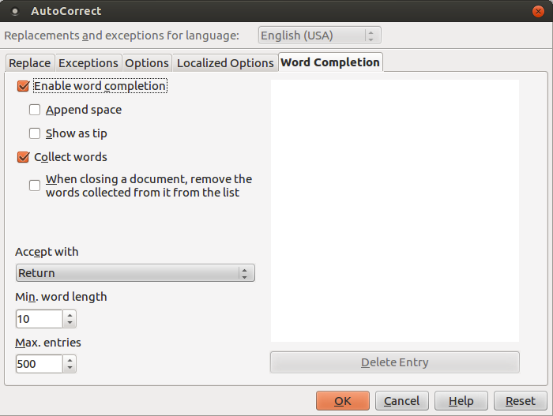

**Εικόνα 4.16** _Διαλογικό παράθυρο AutoCorrect, καρτέλα Word Completion_

### Επίλογος

Σ’ αυτό το άρθρο μιλήσαμε για τις δυνατότητες μορφοποίησης κειμένου, παραγράφου και σελίδας του LibreOffice Writer και για την αυτόματη διόρθωση. Στο επόμενο κεφάλαιο θα μιλήσουμε για τις δυνατότητες που μας προσφέρει το LibreOffice Writer για τη συγγραφή ιστοσελίδων.

## Πηγές:

1. Perry E. (2011), “How To – Libre Office Part 3”, [Full Circle Magazine](http://fullcirclemagazine.org/issue-48), τεύχος 48, σελ. 16-18.
2. Perry E. (2011), “How To – Libre Office Part 6”, [Full Circle Magazine](http://fullcirclemagazine.org/issue-51), τεύχος 51, σελ. 15-16.
3. LibreOffice (2011), [Getting Started with LibreOffice 3.3](http://wiki.documentfoundation.org/images/c/c4/0100GS3-GettingStartedLibO.pdf) .
4. LibreOffice (2011), [LibreOffice Writer Guide – Word Processing with LibreOffice 3.3](http://wiki.documentfoundation.org/images/b/ba/0200WG3-WriterGuide.pdf).
5. Chanelle A. (2009), _Beginning OpenOffice 3 From Novice to Professional_, Apress.
6. Miller R. (2005), _Point & Click OpenOffice.org!_, Prentice Hall.

---

[🏠](https://jkost.github.io) | [⬆️](../README.md) | [◀️](LibreOfficeWriter_chap3.md) | [▶️](LibreOfficeWriter_chap5.md)

---