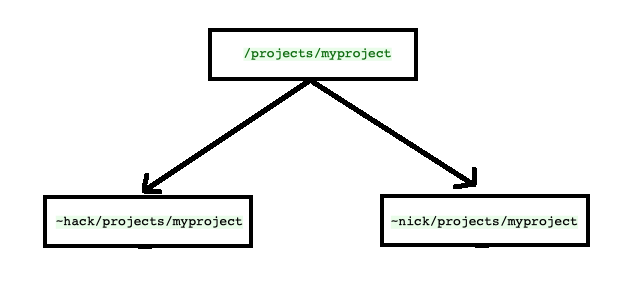

# Εισαγωγή στο Git
Σας έχει τύχει να δημιουργήσετε εκδόσεις αρχείων ή φακέλων για κάτι στο οποίο δουλεύετε, π.χ. ```MyProject_v1```, 
```MyProject_v2``` ή ```Document_v1.txt```, ```Document_v2.txt```, κλπ.; Πόσο εύκολο ήταν; Ανάλογα με το μέγεθος του έργου σας, ξοδεύετε χώρο στο δίσκο αντιγράφοντας όλα τα αρχεία ενώ μεταξύ δύο εκδόσεων μπορεί να έχετε τροποποιήσει μόνο λίγα αρχεία. Επίσης, πόσο εύκολο είναι να εργαστείτε με άλλους στην ίδια έκδοση του έργου σας; Εδώ είναι που τα _Συστήματα Διαχείρισης Εκδόσεων (ΣΔΕ)_ ή _version control systems (VCS)_ έρχονται να κάνουν τη ζωή μας πιο εύκολη.

Σε αυτό το εισαγωγικό άρθρο θα μάθουμε για την ιστορία των ΣΔΕ, τις διάφορες κατηγορίες τους και θα επικεντρωθούμε 
στις βασικές εντολές του πιο διαδεδομένου ΣΔΕ σήμερα, το Git. Αφού μάθετε τις βασικές εντολές του Git, τότε μπορείτε 
να συνεχίσετε με το επόμενο άρθρο [Git για προχωρημένους](https://jkost.github.io/VersionControl/Git/) για να 
εντρυφήσετε στις δυνατότητές του.  

## Ιστορία

Υπάρχουν τρεις κατηγορίες ΣΔΕ: _τοπικά_ (local), _κεντροποιημένα_ (centralized) και _κατανεμμημένα_ (distributed). 

Τα τοπικά ΣΔΕ δεν επέτρεπαν συνεργασία με άλλους χρήστες, κάθε χρήστης είχε δηλ. το δικό του αποθετήριο (repository) τοπικά όπου μπορούσε μόνο να διαχειρίζεται εκδόσεις των αρχείων του. Τα πιο γνωστά τοπικά ΣΔΕ ήταν:

* SCCS (Source Code Control System) 1970
* RCS (Revision Control System) 1982

Τα κεντροποιημένα ΣΔΕ ακολουθούν το μοντέλο _πελάτη-διακομιστή (client-server)_ όπου υπάρχει ένας κεντρικός 
διακομιστής (server) στον οποίο έχει εγκατασταθεί το server πρόγραμμα του ΣΔΕ και σ' αυτόν έχει δημιουργηθεί το 
κεντρικό αποθετήριο (repository). Οι διάφοροι χρήστες συνδέονται στον διακομιστή, και κάνουν αλλαγές στο 
κεντρικό αποθετήριο. Αν ο διακομιστής βγει εκτός λειτουργίας, τότε η διαδικασία αποτυγχάνει. Τα πιο γνωστά 
κεντροποιημένα ΣΔΕ είναι:

* CVS (Concurrent Version Control) 
* Subversion
* Perforce
* Merant PVCS
* StarTeam
* IBM Rational ClearCase
* IBM Team Concert
* IBM Rational Synergy
* MS Visual SourceSafe

Στην τελευταία κατηγορία ανήκουν ΣΔΕ όπως το [Mercurial](https://jkost.github.io/VersionControl/Mercurial/) και το _Git_, παιδί του Linux, το τελευταίο, που δημιουργήθηκε για την ανάπτυξη του πυρήνα του Linux από τους ανά τον κόσμο προγραμματιστές. Αυτά τα συστήματα δεν περιορίζονται σ' έναν διακομιστή, ο οποίος μπορεί να εξυπηρετεί μόνο μέχρι έναν ορισμένο αριθμό από χρήστες, ενώ όταν αυτός 'κρασάρει', τότε σταματούν και οι ενημερώσεις των εκδόσεων. Αντίθετα, στα κατανεμημένα συστήματα εκδόσεων, κάθε χρήστης έχει το δικό του τοπικό αποθετήριο (repository) των εκδόσεων, κι όταν χρειαστεί να συνεργαστεί με άλλους χρήστες, τότε γίνεται συγχώνευση των αποθετηρίων τους. Με άλλα λόγια, κάθε χρήστης έχει το δικό του backup και δεν απαιτείται συνεχής σύνδεση στο δίκτυο για να υποβληθούν οι αλλαγές (commit). Επιπλέον, το Git έπρεπε να είναι αξιόπιστο, γρήγορο και να μπορεί να διαχειρίζεται μεγάλα έργα (όπως π.χ. τον κώδικα του Linux). Τα πιο γνωστά κατανεμημένα ΣΔΕ είναι:

* Git
* Mercurial
* SVK
* Veracity

Οι λόγοι χρήσης συστημάτων διαχείρισης εκδόσεων είναι πολλοί:

* Διαχειρίζονται το ιστορικό και την εξέλιξη του έργου μας. Καταγράφουν ποιός έκανε την αλλαγή, τι αλλαγή έκανε, πότε την έκανε και γιατί την έκανε.
* Βοηθάνε στη συνεργασία με άλλους (απομακρυσμένους) προγραμματιστές.
* Επιτρέπουν την παράλληλη ανάπτυξη διαφορετικών εκδόσεων του ίδιου αρχείου.
* Μας βοηθάνε να επανέλθουμε από μια λάθος εξέλιξη του έργου μας πίσω στην τελευταία έκδοση που δούλευε.

Με λίγα λόγια τα βασικά χαρακτηριστικά ενός ΣΔΕ είναι:

* Αντιστρεψιμότητα (Reversibility), δηλ. να μπορούμε να γυρίσουμε πίσω στο ιστορικό αν έχουμε κάνει κάποιο λάθος 
* Ταυτόχρονη χρήση (Concurrency)
* Χρήση επισημειώσεων (Annotations) για τις διάφορες εκδόσεις 

Παράλληλα, τo Git προσφέρει πολλά πλεονεκτήματα συγκριτικά με άλλα συστήματα διαχείρισης εκδόσεων:

* Είναι εύκολο στην εκμάθηση.
* Είναι 'ελαφρύ', δηλ. δεν απαιτεί πολλούς πόρους.
* Είναι γρήγορο και αξιόπιστο.
* Τροποποιείται εύκολα, ανάλογα με τις ανάγκες μας.
* Δεν μειώνεται η απόδοσή του όσο κι αν αυξηθούν οι χρήστες ή ο όγκος των αρχείων.
* Είναι ανοικτού κώδικα και φυσικά δωρεάν.

Το Git είναι πιο πολύπλοκο από το Mercurial, όπως θα δούμε στη συνέχεια, αλλά είναι το πιο δημοφιλές σύστημα διαχείρισης εκδόσεων σήμερα.

## Εγκατάσταση
Η εγκατάσταση του Git στο Ubuntu ακολουθεί την πεπατημένη:
```bash
$ sudo apt-get install git
```   

## Εργαλεία
Πέραν από τις εντολές της γραμμής εντολών που θα μάθουμε στη συνέχεια, υπάρχουν και πολλά [γραφικά εργαλεία](https://git-scm.com/downloads/guis) ανάλογα με το λειτουργικό σας σύστημα, με μερικά από τα πιο γνωστά:

* [GitButler](https://gitbutler.com)
* [GitHub Desktop](https://github.com/apps/desktop)
* [GitKraken](https://www.gitkraken.com)
* [SourceGit](https://sourcegit-scm.github.io)
* [SourceTree](https://www.sourcetreeapp.com) 
* [TortoiseGit](https://tortoisegit.org)

## Βασικές εντολές
Ας δούμε τι μπορούμε να κάνουμε με το Git:
```bash
$ git version
git version 2.23.0
```
Η δικιά σας έκδοση μπορεί να διαφέρει.

```bash
$ git        
usage: git [--version] [--help] [-C <path>] [-c <name>=<value>]
           [--exec-path[=<path>]] [--html-path] [--man-path] [--info-path]
           [-p | --paginate | -P | --no-pager] [--no-replace-objects] [--bare]
           [--git-dir=<path>] [--work-tree=<path>] [--namespace=<name>]
           <command> [<args>]

These are common Git commands used in various situations:

start a working area (see also: git help tutorial)
   clone     Clone a repository into a new directory
   init      Create an empty Git repository or reinitialize an existing one

work on the current change (see also: git help everyday)
   add       Add file contents to the index
   mv        Move or rename a file, a directory, or a symlink
   restore   Restore working tree files
   rm        Remove files from the working tree and from the index

examine the history and state (see also: git help revisions)
   bisect    Use binary search to find the commit that introduced a bug
   diff      Show changes between commits, commit and working tree, etc
   grep      Print lines matching a pattern
   log       Show commit logs
   show      Show various types of objects
   status    Show the working tree status

grow, mark and tweak your common history
   branch    List, create, or delete branches
   commit    Record changes to the repository
   merge     Join two or more development histories together
   rebase    Reapply commits on top of another base tip
   reset     Reset current HEAD to the specified state
   switch    Switch branches
   tag       Create, list, delete or verify a tag object signed with GPG

collaborate (see also: git help workflows)
   fetch     Download objects and refs from another repository
   pull      Fetch from and integrate with another repository or a local branch
   push      Update remote refs along with associated objects

'git help -a' and 'git help -g' list available subcommands and some
concept guides. See 'git help <command>' or 'git help <concept>'
to read about a specific subcommand or concept.
See 'git help git' for an overview of the system.

$ git help
usage: git [--version] [--help] [-C <path>] [-c name=value]
           [--exec-path[=<path>]] [--html-path] [--man-path] [--info-path]
           [-p|--paginate|--no-pager] [--no-replace-objects] [--bare]
           [--git-dir=<path>] [--work-tree=<path>] [--namespace=<name>]
           <command> [<args>]

```
Οι παρακάτω εντολές παρέχουν λεπτομερή βοήθεια για τις εντολές του Git:
```bash
$ git help
$ git help <εντολή>
$ man git
$ man gitignore
```

## Ρυθμίζοντας το Git
Προτού όμως μπορέσουμε να υποβάλλουμε τις αλλαγές μας σε ένα αποθετήριο, θα πρέπει το Git να γνωρίζει το email μας 
και ένα όνομα χρήστη, π.χ. (δώστε τα δικά σας):

```bash
$ git config --global user.name "hawk"
$ git config --global user.email "nobody@nowhere.gr"
```
Οι πληροφορίες αυτές αποθηκεύονται στο αρχείο ```~/.gitconfig``` το οποίο επηρεάζει όλους τους χρήστες του μηχανήματος στο οποίο δουλεύετε:

```bash
$ vi ~/.gitconfig
[user]
        name = hawk
        email = nobody@nowhere.gr
```
**Σημείωση**. _Πέραν από τις καθολικές ρυθμίσεις, μπορείτε να κάνετε και ρυθμίσεις ανά αποθετήριο. Κάθε αποθετήριο βρίσκεται σ' έναν κρυφό υποφάκελο ```.git``` μέσα στον οποίο υπάρχει ένας υποφάκελος ```config```._

Άλλες ρυθμίσεις που θα μπορούσατε να ορίσετε είναι π.χ. ο επεξεργαστής κειμένου. Εξ' ορισμού το git χρησιμοποιεί τον 
vi. Αν δε σας αρέσει ο vi μπορείτε να χρησιμοποιήσετε π.χ. τον nano ή τον emacs ή τον gedit ή το TextMate ή το 
Visual Studio Code (ή στα 
windows π.χ. 
το notepad++):

```bash
$ git config --global core.editor gedit
```

Άλλες ρυθμίσεις:

```bash
$ git config --global color.ui true
$ git config --global merge.tool opendiff
```
Για να δείτε όλες τις ρυθμίσεις git του συστήματός σας δώστε την εντολή:

```bash
$ git config –-list --global 
```
## Δουλεύοντας με αποθετήρια git
Υπάρχουν 2 τρόποι για να δουλέψετε με ένα αποθετήριο git:

* να δημιουργήσετε ένα νέο αποθετήριο
* να κλωνοποιήσετε ένα υπάρχον αποθετήριο

### Δημιουργία αποθετηρίου

Για να δημιουργήσετε ένα νέο αποθετήριο ```myproject```, χρησιμοποιείστε την εντολή ```init``` στο φάκελο που θέλετε 
να δημιουργήσετε το αποθετήριό σας:

```bash
$ mkdir -p ~hawk/projects/
$ cd ~hawk/projects
$ git init myproject
Initialized empty Git repository in ~hawk/projects/myproject/.git/
$ cd myproject
$ git status
On branch master

No commits yet

nothing to commit (create/copy files and use "git add" to track)
```
Μόλις δημιουργήσαμε ένα νέο αποθετήριο (είναι ο κρυφός φάκελος ```.git```). 

Η εντολή ```status``` εμφανίζει σε τι κατάσταση βρίσκεται το αποθετήριό σας, π.χ. αν υπάρχουν αλλαγές σε υπάρχοντα αρχεία, νέα αρχεία ή αρχεία που διαγράφηκαν κλπ.

Στη συνέχεια, μπορείτε να αντιγράψετε ή να δημιουργήσετε κάποια αρχεία στο νέο αποθετήριο, και να ενημερώσετε το Git 
για τις ενέργειές σας, δίνοντας π.χ.:
```bash
$ touch hello.c
$ touch goodbye.c
$ git status
On branch master

No commits yet

Untracked files:
  (use "git add <file>..." to include in what will be committed)
	goodbye.c
	hello.c

nothing added to commit but untracked files present (use "git add" to track)
```
Παραπάνω βλέπουμε ότι υπάρχουν δυο νέα αρχεία C τα οποία δεν έχουν υποβληθεί στο τοπικό αποθετήριο (untracked). Εμφανίζει επίσης τον κλάδο (branch) στο οποίο βρισκόμαστε και ο οποίος ονομάζεται ```master```. Θα μιλήσουμε για κλάδους παρακάτω.

**Σημείωση.** _Σ΄αυτό το άρθρο θα χρησιμοποιήσουμε ως παραδείγματα αρχεία ```.c``` αλλά το git δουλεύει με οποιονδήποτε 
τύπο αρχείων κειμένου, π.χ. ```.txt```, ```.md```, ```.java``` κλπ. Αποφύγετε να 
αποθηκεύετε δυαδικά αρχεία (π.χ. ```docx, .exe, .png```) στο αποθετήριο του git_.

**Σημείωση.** _Αν γνωρίζετε το mercurial τότε οι αντίστοιχες εντολές στο mercurial είναι:_
```bash
$ hg init
$ hg status
```

#### Υποβολή των αλλαγών
Η διαδικασία υποβολής αλλαγών στο git αποτελείται από 2 στάδια:

1. Προσθήκη των αλλαγών στην _πρόχειρη εξέδρα (stage)_. Αυτό μας επιτρέπει από τα αλλαγμένα αρχεία να επιλέξουμε μόνο 
   εκείνα που θέλουμε να υποβάλλουμε (commit).

```bash
$ git add <files>
```
ή για να προσθέσουμε για υποβολή και αρχεία που διαγράψαμε:
```bash
$ git add –A <files>
```
ή αν θέλουμε να προσθέσουμε όλα τα αρχεία για υποβολή:
```bash
$ git add --all
```
ή
```bash
$ git add .
```
ή αν θέλουμε να προσθέσουμε για υποβολή μόνο συγκεκριμένα αρχεία μπορούμε να χρησιμοποιήσουμε και χαρακτήρες μπαλαντέρ:
```bash
$ git add *.c
```

Για να επιβεβαιώσετε ότι όντως υπάρχουν αρχεία στην περιοχή stage, δώστε:

```bash
$ git status
```
ή

```bash
$ git status -s
```
όπου ```-s``` σημαίνει short.

Έτσι, για να προσθέσουμε στην πρόχειρη εξέδρα τις αλλαγές του ```myproject```:

```bash
$ git add .
$ git status
On branch master

No commits yet

Changes to be committed:
  (use "git rm --cached <file>..." to unstage)
	new file:   goodbye.c
	new file:   hello.c
```
Με την εντολή ```add .``` προσθέσαμε όλα τα νέα αρχεία του τρέχοντος καταλόγου στην πρόχειρη περιοχή (staging 
area). 

**Σημείωση.** _Στο Mercurial δεν υπάρχει αυτό το βήμα, δηλ. το stage._

2. Υποβολή των αλλαγών (commit)

Όταν έχετε κατασταλάξει για το ποιές αλλαγές θα υποβάλλετε στο αποθετήριό σας, μπορείτε να τις υποβάλλετε με την εντολή ```commit```:

```bash
$ git commit –m "message"
```

**Σημείωση.** _Η αντίστοιχη εντολή στο mercurial είναι:_
```bash
$ hg commit –m "message"
```

Αφού λοιπόν προσθέσαμε όλα τα αρχεία του ```myproject``` στην πρόχειρη εξέδρα και είμαστε ικανοποιημένοι με τις 
αλλαγές, καιρός να υποβάλλουμε τις αλλαγές μας στο αποθετήριό μας:

```bash
$ git commit -m 'Initial commit'
[master (root-commit) 488273f] Initial commit
 2 files changed, 0 insertions(+), 0 deletions(-)
 create mode 100644 goodbye.c
 create mode 100644 hello.c
 
$ git status
On branch master
nothing to commit, working tree clean

$ git log
git log
commit 488273f6a5ab8162629e105c7c175094819151ed (HEAD -> master)
Author: hawk <nobody@nowhere.gr>
Date:   Sun Jul 7 13:56:51 2024 +0200

    Initial commit
    
$ git log --pretty=oneline
488273f6a5ab8162629e105c7c175094819151ed Initial commit
```
Με την εντολή ```commit``` καταχωρούμε πλέον τις αλλαγές μας στο τοπικό αποθετήριο (```.git```). Η εντολή ```log``` μας δείχνει το ιστορικό. Ακολουθούμε την ίδια σειρά για κάθε αλλαγή που κάνουμε στα αρχεία μας, δηλ. ```git add```, ```git commit -m "Message"```.

**Σημείωση.** _Η αντίστοιχη εντολή του mercurial είναι:_
```bash
$ hg log
```

Αλλά τι ακριβώς συμβαίνει εσωτερικά στο git με κάθε υποβολή; Παρατηρήστε τη γραμμή:

```
commit 488273f6a5ab8162629e105c7c175094819151ed (HEAD -> master)
```
Ο δεκαεξαδικός αριθμός 40 ψηφίων ```488273f6a5ab8162629e105c7c175094819151ed``` είναι ένα SHA-1 hash που είναι μοναδικό για κάθε υποβολή.
Με κάθε υποβολή (commit), το git δημιουργεί ένα νέο στιγμιότυπο (snapshot) του αποθετηρίου που μπορεί να 
ταυτοποιηθεί με αυτό το hash.

Ο ```HEAD``` είναι ένας δείκτης που δείχνει κάθε φορά στην τελευταία υποβολή στον κλάδο που βρισκόμαστε.

Ας αλλάξουμε τα περιεχόμενα του αρχείου ```hello.c```:

```c
#include <stdio.h>

int main(void) {
    puts("Hello, World");
    return 0;
}
```
```bash
$ git diff hello.c
diff --git a/hello.c b/hello.c
index e69de29..6001b67 100644
--- a/hello.c
+++ b/hello.c
@@ -0,0 +1,6 @@
+#include <stdio.h>
+
+int main(void) {
+    puts("Hello, World");
+    return 0;
+}
```
Η εντολή ```diff``` μας επιτρέπει να δούμε τις αλλαγές μας σε σχέση με την staging area. Παραπάνω, το ```a``` 
αναφέρεται στο αρχείο ```hello.c``` που βρίσκεται στην προσωρινή περιοχή (staging area) και ```b``` στο αρχείο ```hello.c``` που μόλις 
αλλάξαμε. Όπως βλέπουμε, στην προσωρινή περιοχή το ```hello.c``` είναι κενό, ενώ τα ```+``` δηλώνουν τις 
γραμμές 
που 
προστέθηκαν στο αρχείο.

```bash
$ git add hello.c
$ git diff hello.c
$ git diff --staged        
diff --git a/hello.c b/hello.c
index e69de29..6001b67 100644
--- a/hello.c
+++ b/hello.c
@@ -0,0 +1,6 @@
+#include <stdio.h>
+
+int main(void) {
+    puts("Hello, World");
+    return 0;
+}
```
Παρατηρούμε ότι όταν προσθέσουμε το αρχείο μας στην staging area, θα πρέπει να δώσουμε την εντολή ```git diff 
--staged``` η οποία τώρα συγκρίνει το αρχείο ```hello.c``` στο αποθετήριο .git (```a```) με το αρχείο ```hello.c``` 
στην περιοχή στάσης (```b```). 

Γενικά η εντολή ```diff``` συγκρίνει δυο αρχεία ή ακόμα και φακέλους ή ακόμα και υποβολές (commits), ανάλογα τι θα 
της περάσετε ως παραμέτρους.

Μπορούμε φυσικά να αλλάξουμε το αρχείο ενώ αυτό είναι ήδη στην περιοχή στάσης.

```c
#include <stdio.h>

int main(void) {
    puts("Γειά σου κόσμε!");
    return 0;
}
```
```bash
$ git diff
diff --git a/hello.c b/hello.c
index 6001b67..b61ef6d 100644
--- a/hello.c
+++ b/hello.c
@@ -1,6 +1,6 @@
 #include <stdio.h>
 
 int main(void) {
-    puts("Hello, World");
+    puts("Γειά σου κόσμε!");
     return 0;
 }
```
Η παραπάνω εντολή μας δείχνει τι άλλαξε στο αρχείο ```hello.c``` μεταξύ της  περιοχής στάσης και του φακέλου μας.
```bash
$ git diff --staged
diff --git a/hello.c b/hello.c
index e69de29..6001b67 100644
--- a/hello.c
+++ b/hello.c
@@ -0,0 +1,6 @@
+#include <stdio.h>
+
+int main(void) {
+    puts("Hello, World");
+    return 0;
+}
```
Η παραπάνω εντολή μας δείχνει τι άλλαξε στο αρχείο ```hello.c``` μεταξύ του αποθετηρίου μας (.git) και της πρόχειρης περιοχής (staging area).
```bash
$ git add .
$ git diff --staged
diff --git a/hello.c b/hello.c
index e69de29..b61ef6d 100644
--- a/hello.c
+++ b/hello.c
@@ -0,0 +1,6 @@
+#include <stdio.h>
+
+int main(void) {
+    puts("Γειά σου κόσμε!");
+    return 0;
+}
$ git commit -m "Updated hello.c"
git commit -m 'Updated hello.c'
[master 245fa8f] Updated hello.c
 1 file changed, 6 insertions(+)

$ git log --pretty=oneline
245fa8fc3dfa2c8c308a07bdcb9b152329006d84 (HEAD -> master) Updated hello.c
488273f6a5ab8162629e105c7c175094819151ed Initial commit

$ git log --graph --oneline --all
* 245fa8f (HEAD -> master) Updated hello.c
* 488273f Initial commit
```
Η τελευταία εντολή μας επιτρέπει να δούμε τις αλλαγές σε γραφική (δενδρική μορφή). Αν εγκαταστήσατε κάποιο γραφικό 
εργαλείο όπως π.χ. το [SourceTree](https://www.sourcetreeapp.com) ή το [GitKraken](https://www.gitkraken.com) θα μπορείτε να δείτε το ιστορικό σε γραφική μορφή:


**Εικόνα 1** _Ιστορικό του αποθετηρίου μας όπως φαίνεται στο SourceTree_

#### .gitignore
Υπάρχουν αρχεία που δε θα θέλατε να προσθέσετε στο αποθετήριό σας. Τέτοια αρχεία είναι π.χ. εκτελέσιμα ή δυαδικά αρχεία, αρχεία που παράγονται από διάφορα εργαλεία, προσωρινά αρχεία κλπ. γενικά αρχεία που μπορείτε εύκολα να παράγετε ή δεν έχει νόημα να υποβάλλετε στο αποθετήριό σας. 
```bash
$ gcc -o hello.exe hello.c
$ git status
On branch master
Untracked files:
  (use "git add <file>..." to include in what will be committed)
	hello.exe

nothing added to commit but untracked files present (use "git add" to track)
```
Για να μην τα προσθέσετε κατά λάθος στο αποθετήριο, μπορείτε να προσθέσετε τα ονόματά τους στο αρχείο ```.gitignore``` που μπορείτε να δημιουργήσετε στον αρχικό κατάλογο του έργου σας και στο οποίο μπορείτε να προσθέσετε π.χ. περιεχόμενα όπως τα παρακάτω:

```
# Ignore all *.txt files
*.txt

# do not ignore readme.txt
!readme.txt

# Ignore .md files only in the root folder
/*.md

#Ignore all .java files in folders and subfolders of gen folder
gen/**/.java

# Ignore java binary files
*.class
*.jar

# Ignore C/C++ binary files
*.exe
*.[oa]
a.out

#Ignore folders
tmp/
bin/
lib/

``` 
Οι γραμμές που ξεκινούν με τη δίεση (```#```) είναι σχόλια. 

```bash
$ ls -a
.		..		.git		.gitignore	goodbye.c	hello.exe		hello.c
$ git status
On branch master
Untracked files:
  (use "git add <file>..." to include in what will be committed)
	.gitignore

nothing added to commit but untracked files present (use "git add" to track)
$ git add .
$ git status
On branch master
Changes to be committed:
  (use "git restore --staged <file>..." to unstage)
	new file:   .gitignore
$ git commit -m "Added .gitignore"	
[master bd054a7] Added .gitignore
 1 file changed, 26 insertions(+)
 create mode 100644 .gitignore
```
Μπορείτε να βρείτε έτοιμα αρχεία ```.gitignore``` για διάφορες γλώσσες προγραμματισμού [εδώ](https://github.com/github/gitignore).

### Κλωνοποίηση αποθετηρίου
Για να μπορέσουν να δουλέψουν κι άλλοι πάνω σ' ένα αποθετήριο θα πρέπει να 'ναι προσβάσιμο από κάποια κοινή (και 
ασφαλή) τοποθεσία. Θα δημιουργήσουμε ένα κεντρικό αποθετήριο όπου θα 
μπορούν οι προγραμματιστές να συγχρονίζουν τις αλλαγές τους. 

```bash
$ cd ..
$ cp -R myproject /projects/
```
όπου υποθέστε ότι ο φάκελος ```/projects``` βρίσκεται σε έναν κοινόχρηστο φάκελο. Θα μπορούσε να είναι ένα αποθετήριο 
στο 
[github](https://github.com) ή στο [heroku](https://www.heroku.com/) ή στο [gitlab](https://www.gitlab.com/) ή σε 
κάποιον φάκελο NFS.

Ένας άλλος προγραμματιστής μπορεί τώρα να κλωνοποιήσει αυτόν τον φάκελο και να συνεχίσει να δουλεύει σ' αυτό το έργο.

```bash
$ cd ~nick/projects
$ git clone /projects/myproject
Cloning into 'myproject'...
done.
$ cd myproject
$ git log --oneline --graph --all
* 245fa8f (HEAD -> master) Updated hello.c
* 488273f Initial commit
```

**Σημείωση.** _Η αντίστοιχη εντολή του mercurial είναι:_
```bash
$ hg clone <αποθετήριο>
```
Αν τώρα ο Νίκος κάνει κάποια αλλαγή στο τοπικό αποθετήριό του, θα πρέπει να ενημερώσει και το απομακρυσμένο 
αποθετήριο. Θα δούμε πώς αργότερα.



**Εικόνα 2** _Κλωνοποίηση του κεντρικού αποθετηρίου ```/projects/myproject```._

## Κλάδοι (branches)
Μερικές φορές θέλετε να δοκιμάσετε νέα πράγματα χωρίς να ρισκάρετε να πειράξετε την τρέχουσα κατάσταση των αρχείων σας. Μπορείτε να δημιουργήσετε ένα νέο κλαδί (branch) για να δοκιμάσετε τις αλλαγές σας, κι αν όλα πάνε καλά να συγχωνεύσετε (merge) τις αλλαγές σας στο κύριο κλάδο.

```bash
$ git status
On branch master
nothing to commit, working tree clean

$ git branch
* master
```
μας λέει ότι είμαστε τον κλάδο ```master``` (ή ```main``` σε άλλα αποθετήρια). 

**Σημείωση.** _Μπορείτε να αλλάξετε τον όνομα του κύριου κλάδου από ```master``` π.χ. σε ```main``` με την εντολή ```git branch -M main```._

Μπορούμε να δημιουργήσουμε ένα νέο κλάδο με την εντολή ```git branch <όνομα>```, π.χ.

```bash
$ git branch newbranch
$ git branch          
* master
  newbranch
```
Για να μεταβούμε στο νέο κλάδο που δημιουργήσαμε:
```bash
$ git switch newbranch
Switched to branch 'newbranch'
$ git branch            
  master
* newbranch
```
**Σημείωση!** _Πριν την έκδοση 2.23.0 η εντολή μετάβασης σε άλλο κλάδο ήταν η ``git checkout newbranch``._

**Σημείωση!** _Οι παραπάνω δυο εντολές_ 
```bash
$ git branch newbranch
$ git switch newbranch
```
_μπορούν να συνδυαστούν σε μία_
```bash
$ git switch -c newbranch
```
Ας κάνουμε κάποιες αλλαγές σε αυτόν τον κλάδο. Ας αλλάξουμε τα περιεχόμενα του αρχείου ```goodbye.c```:
```c
#include <stdio.h>

int main(void) {
    puts("Αντίο κόσμε!");
    return 0;
}
```
```bash
$ git status
On branch newbranch
Changes not staged for commit:
  (use "git add <file>..." to update what will be committed)
  (use "git restore <file>..." to discard changes in working directory)
	modified:   goodbye.c

no changes added to commit (use "git add" and/or "git commit -a")
$ git add .
$ git commit -m "Updated goodbye.c"
[newbranch df85b3f] Updated goodbye.c
 1 file changed, 7 insertions(+)
$ git log --oneline --graph --all
* df85b3f (HEAD -> newbranch, master) Updated goodbye.c
* bd054a7 Added .gitignore
* 245fa8f Updated hello.c
* 488273f Initial commit
$ git switch master
Switched to branch 'master'
$ more goodbye.c

$ git log --oneline --graph --all
* bd054a7 (HEAD -> master, newbranch) Added .gitignore
* 245fa8f Updated hello.c
* 488273f Initial commit
```
Παρατηρούμε ότι οι αλλαγές μας δεν υπάρχουν στο master branch (το αρχείο ```goodbye.c``` είναι κενό). Για να 
μεταφέρουμε τις αλλαγές μας από τον κλάδο ```newbranch``` στον ```master```, δίνουμε:

```bash
$ git merge newbranch
Updating bd054a7..df85b3f
Fast-forward
 goodbye.c | 7 +++++++
 1 file changed, 7 insertions(+)
$ more goodbye.c     
#include <stdio.h>

int main(void) {
    puts("Αντίο κόσμε!");
    return 0;
}

goodbye.c (END)
$ git log --oneline --graph --all
* df85b3f (HEAD -> master, newbranch) Updated goodbye.c
* bd054a7 Added .gitignore
* 245fa8f Updated hello.c
* 488273f Initial commit
```
Η εντολή ```merge``` συγχωνεύει τον κλάδο ```newbranch``` στον τρέχοντα κλάδο, δηλ. τον ```master```. Πλέον η αλλαγή 
```df85b3fe814...``` υπάρχει και στο master branch. Παρατηρήστε ότι αυτή η συγχώνευση είναι ```fast-forward``` καθώς 
δεν υπήρξαν προβλήματα συγχώνευσης. Παρακάτω θα δούμε και μια άλλη περίπτωση συγχώνευσης. 

Μπορούμε πλέον να διαγράψουμε τον κλάδο ```newbranch``` αν δεν τον χρειαζόμαστε πλέον:

```bash
$ git branch -d newbranch
$ git branch
* master
```

**Σημείωση** _Μπορείτε να χρησιμοποιήσετε μια σύμβαση για την ονομασία των κλάδων (την οποία δεν χρησιμοποιούμε σ' 
αυτό το άρθρο) που θα μπορούσε να σας φανεί χρήσιμη. Π.χ. για νέα χαρακτηριστικά της εφαρμογής χρησιμοποιείτε 
```feature/```, για διόρθωση σφαλμάτων ```bug/``` κλπ. Έτσι αν δουλεύετε π.χ. στο χαρακτηριστικό δημιουργία νέα 
παραγγελίας θα μπορούσατε να ονομάσετε τον αντίστοιχο κλάδο ως ```feature/neworder```. Με αυτόν τον τρόπο μπορείτε 
να ξεχωρίζετε πολύ εύκολα ποιοί κλάδοι είναι για νέα χαρακτηριστικά, ποιοί είναι για διόρθωση σφαλμάτων κλπ. Άλλη 
σύμβαση είναι να ονομάζετε τον κλάδο σας προσθέτοντας το JIRA id αν χρησιμοποιείτε [JIRA](https://www.atlassian.com/software/jira) (ή κάποιο άλλο σύστημα 
διαχείρισης σφαλμάτων/χαρακτηριστικών)._

### Προβλήματα Συγχώνευσης
Ας υποθέσουμε ότι δουλεύετε σε ένα νέο χαρακτηριστικό σε έναν κλάδο (```feature1branch```) κι ένας άλλος συνάδελφος προσπαθεί να διορθώσει ένα σφάλμα και δουλεύει σε έναν άλλο κλάδο (```bug1branch```):
```bash
$ cd ~hawk/projects/myproject
$ git branch feature1branch
$ git branch
  feature1branch
* master
```
Εσείς αλλάζετε το μήνυμα που εμφανίζεται στο χρήστη στο αρχείο ```hello.c```:
```bash
$ git switch feature1branch
Switched to branch 'feature1branch'
$ vi hello.c
#include <stdio.h>

int main(void) {
    puts("Γειά χαρά σου κόσμε!");
    return 0;
}
$ git diff
diff --git a/hello.c b/hello.c
index b61ef6d..03cae4e 100644
--- a/hello.c
+++ b/hello.c
@@ -1,6 +1,6 @@
 #include <stdio.h>
 
 int main(void) {
-    puts("Γειά σου κόσμε!");
+    puts("Γειά χαρά σου κόσμε!");
     return 0;
 }
$ git add .
$ git commit -m "Modified hello.c"
[feature1branch 2946b52] Modified hello.c
 1 file changed, 1 insertion(+), 1 deletion(-)
$ git log --oneline --graph --all
* | 2946b52 (HEAD -> feature1branch, master) Modified hello.c
|/ 
* df85b3f (master) Updated goodbye.c
* bd054a7 Added .gitignore
* 245fa8f Updated hello.c
* 488273f Initial commit
$ git switch master
Switched to branch 'master'
$ git log --oneline --graph --all
* df85b3f (HEAD -> master) Updated goodbye.c
* bd054a7 Added .gitignore
* 245fa8f Updated hello.c
* 488273f Initial commit
$ git merge feature1branch
Updating df85b3f..2946b52
Fast-forward
 hello.c | 2 +-
 1 file changed, 1 insertion(+), 1 deletion(-)
$ git log --oneline --graph --all
* | 2946b52 (HEAD -> master, feature1branch) Modified hello.c
|/ 
* df85b3f Updated goodbye.c
* bd054a7 Added .gitignore
* 245fa8f Updated hello.c
* 488273f Initial commit
```
Ο άλλος συνάδελφος που δουλεύει στον κλάδο ```bug1branch``` τροποποιεί το ίδιο αρχείο:
```bash
$ cd ~nick/projects/myproject
$ git branch bug1branch
$ git switch bug1branch
Switched to branch 'bug1branch'
vi hello.c
#include <stdio.h>

int main(void) {
    puts("Γειά σου git!");
    return 0;
}
$ git diff
diff --git a/hello.c b/hello.c
index b61ef6d..e99c37a 100644
--- a/hello.c
+++ b/hello.c
@@ -1,6 +1,6 @@
 #include <stdio.h>
 
 int main(void) {
-    puts("Γειά σου κόσμε!");
+    puts("Γειά σου git!");
     return 0;
 }
$ git add .
$ git commit -m "Fixed hello.c"
[bug1branch 00937c5] Fixed hello.c
 1 file changed, 1 insertion(+), 1 deletion(-)
$ git log --oneline --graph --all
* | 00937c5 (HEAD -> bug1branch, master) Fixed hello.c
|/ 
* df85b3f Updated goodbye.c
* bd054a7 Added .gitignore
* 245fa8f Updated hello.c
* 488273f Initial commit
$ git switch master
Switched to branch 'master'
$ git log --oneline --graph --all
* | 2946b52 (HEAD -> master, feature1branch) Modified hello.c
|/ 
* df85b3f Updated goodbye.c
* bd054a7 Added .gitignore
* 245fa8f Updated hello.c
* 488273f Initial commit
$ git merge bug1branch
Auto-merging hello.c
CONFLICT (content): Merge conflict in hello.c
Automatic merge failed; fix conflicts and then commit the result.
```
Αυτή είναι η δεύτερη περίπτωση συγχώνευσης, όπου υπάρχει σύγκρουση (conflict).

Ας ανοίξουμε το αρχείο ```hello.c``` στον αγαπημένο μας επεξεργαστή κειμένου:
```bash
$ vi hello.c
#include <stdio.h>

int main(void) {
<<<<<<< HEAD
    puts("Γειά χαρά σου κόσμε!");
=======
    puts("Γειά σου git!");
>>>>>>> bug1branch
    return 0;
}
```
Στο πάνω μέρος από το ```=======``` βλέπουμε τι περιέχει το ```master``` branch ενώ στο κάτω μέρος τις αλλαγές του κλάδου ```bug1branch```. Θα πρέπει να αποφασίσετε ποιές αλλαγές να κρατήσετε και να αποθηκεύσετε το αρχείο με τα σωστά περιεχόμενα.

```bash
#include <stdio.h>

int main(void) {
    puts("Γειά σου git!");
    return 0;
}
```
Στην περίπτωσή μας αποφασίσαμε να κρατήσουμε τα περιεχόμενα του κλάδου ```bug1branch```.

```bash
$ git status
On branch master
You have unmerged paths.
  (fix conflicts and run "git commit")
  (use "git merge --abort" to abort the merge)

Unmerged paths:
  (use "git add <file>..." to mark resolution)
	both modified:   hello.c

no changes added to commit (use "git add" and/or "git commit -a")

$ git add .

$ git status          
On branch master
All conflicts fixed but you are still merging.
  (use "git commit" to conclude merge)

Changes to be committed:
        modified:   hello.c
		
$ git commit -m "Merge branch bug1branch"  
[master 285480f] Merge branch bug1branch

$ git branch -d bug1branch
Deleted branch bug1branch (was 00937c5). 

$ git log --oneline --graph --all
*   285480f (HEAD -> master) Merge branch bug1branch
|\  
| * 00937c5 Fixed hello.c
* | 2946b52 (feature1branch) Modified hello.c
|/  
* df85b3f Updated goodbye.c
* bd054a7 Added .gitignore
* 245fa8f Updated hello.c
* 488273f Initial commit
```
Με τον παραπάνω γραφικό τρόπο βλέπουμε ότι δημιουργήσαμε έναν άλλο κλάδο τον οποίο συγχωνεύσαμε στον ```master``` branch.


**Εικόνα 3** _Ιστορικό του αποθετηρίου μας όπως φαίνεται στο SourceTree_

Μπορούμε να μεταβούμε σε παλιότερες υποβολές στο ιστορικό με την εντολή ```checkout```. Π.χ. για να μεταβούμε σε μια προηγούμενη υποβολή δίνουμε:

```bash
$ git checkout df85b3f
Previous HEAD position was 00937c5 Fixed hello.c
HEAD is now at df85b3f Updated goodbye.c
$ git log --oneline --all --graph
* 5baedbf (feature1branch) Added readme.txt
*   285480f (master) Merge branch bug1branch
|\  
| * 00937c5 Fixed hello.c
* | 2946b52 Modified hello.c
|/  
* df85b3f (HEAD) Updated goodbye.c
* bd054a7 Added .gitignore
* 245fa8f Updated hello.c
* 488273f Initial commit
```
Παρατηρήστε ότι ο δείκτης ```HEAD``` τώρα δείχνει στην υποβολή ```df85b3f``` και τα αρχεία της περιοχής εργασίας 
έχουν αλλάξει και είναι όπως ήταν στην υποβολή ```df85b3f```. Το αρχείο ```readme.txt``` έχει εξαφανιστεί, ενώ τα 
περιεχόμενα των αρχείων ```hello.c, goodbye.c``` δεν περιέχουν τις αλλαγές που έγιναν στις υποβολές ```285480f, 
5baedbf```. Βρίσκεστε πίσω στην ιστορία! 

Ένας άλλος τρόπος για να μετακινούμαστε στο ιστορικό είναι σχετικά με τον δείκτη ```HEAD```. Αν επιστρέψουμε στο παρών:

```bash
$ git checkout 5baedbf
Previous HEAD position was df85b3f Updated goodbye.c
HEAD is now at 5baedbf Added readme.txt
$ git log --oneline --all --graph
* 5baedbf (HEAD, feature1branch) Added readme.txt
*   285480f (master) Merge branch bug1branch
|\  
| * 00937c5 Fixed hello.c
* | 2946b52 Modified hello.c
|/  
* df85b3f Updated goodbye.c
* bd054a7 Added .gitignore
* 245fa8f Updated hello.c
* 488273f Initial commit
```
τότε η προηγούμενη υποβολή ```285480f``` είναι το ```HEAD~1``` κ.ο.κ. Αν υπάρχουν περισσότεροι του ενός πρόγονοι, 
όπως στην περίπτωση που υπάρχουν κλάδοι, όπως στο παράδειγμά μας, τότε ```HEAD^1``` δηλώνει τον 1ο κλάδο, 
```HEAD^2``` τον 2ο κ.ο.κ. Π.χ.

```bash
$ git checkout HEAD^1~2
Previous HEAD position was 5baedbf Added readme.txt
HEAD is now at df85b3f Updated goodbye.c
```
Εξήγηση: ```HEAD^1 == 285480f``` δηλ. η προηγούμενη υποβολή στον 1ο κλάδο και ```HEAD^1~2 == df85b3f``` δηλ. η 
προ-προηγούμενη υποβολή στον 1ο κλάδο.

Ας δούμε άλλο ένα παράδειγμα:
```bash
$ git checkout 285480f           
Previous HEAD position was df85b3f Updated goodbye.c
HEAD is now at 285480f Merge branch bug1branch
$ git log --oneline --all --graph
* 5baedbf (feature1branch) Added readme.txt
*   285480f (HEAD, master) Merge branch bug1branch
|\  
| * 00937c5 Fixed hello.c
* | 2946b52 Modified hello.c
|/  
* df85b3f Updated goodbye.c
* bd054a7 Added .gitignore
* 245fa8f Updated hello.c
* 488273f Initial commit
$ git checkout HEAD^2          
Previous HEAD position was 285480f Merge branch bug1branch
HEAD is now at 00937c5 Fixed hello.c
$ git log --oneline --all --graph
* 5baedbf (feature1branch) Added readme.txt
*   285480f (master) Merge branch bug1branch
|\  
| * 00937c5 (HEAD) Fixed hello.c
* | 2946b52 Modified hello.c
|/  
* df85b3f Updated goodbye.c
* bd054a7 Added .gitignore
* 245fa8f Updated hello.c
* 488273f Initial commit
$ git checkout 5baedbf           
Previous HEAD position was 00937c5 Fixed hello.c
HEAD is now at 5baedbf Added readme.txt
```
Μπορούν να χρησιμοποιηθούν και με την εντολή ```diff```:

```bash
$ git diff HEAD~2 HEAD
diff --git a/hello.c b/hello.c
index 03cae4e..e99c37a 100644
--- a/hello.c
+++ b/hello.c
@@ -1,6 +1,6 @@
 #include <stdio.h>
 
 int main(void) {
-    puts("Γειά χαρά σου κόσμε!");
+    puts("Γειά σου git!");
     return 0;
 }
diff --git a/readme.txt b/readme.txt
new file mode 100644
index 0000000..e69de29
```

## Αναιρέσεις (undos)
"Λάθη είμαστε ανθρώπους κάνουμε" όπως λέει και το ανέκδοτο, οπότε καθώς είναι ανθρώπινο να κάνουμε λάθη θα πρέπει να 
υπάρχει και τρόπος να τα διορθώνουμε. Και το git διαθέτει πολλές εντολές για κάτι τέτοιο.

Αν δούμε λοιπόν τι μπορούμε να κάνουμε αν μετανιώσαμε με κάποια αλλαγή.

Έστω ότι τροποποιήσαμε το αρχείο ```goodbye.c``` όπως παρακάτω:

```bash
$ git diff 
diff --git a/goodbye.c b/goodbye.c
index 885c106..a71fe45 100644
--- a/goodbye.c
+++ b/goodbye.c
@@ -1,7 +1,7 @@
 #include <stdio.h>
 
 int main(void) {
-    puts("Αντίο κόσμε!");
+    puts("Αντίο git!")
     return 0;
 }
 
$ git status
On branch master
Your branch is up to date with 'origin/master'.

Changes not staged for commit:
  (use "git add <file>..." to update what will be committed)
  (use "git restore <file>..." to discard changes in working directory)
	modified:   goodbye.c

no changes added to commit (use "git add" and/or "git commit -a")
$ git add .
```
Το git μας λέει ότι μπορούμε να χρησιμοποιήσουμε την εντολή ```git restore``` για να αναιρέσουμε τις αλλαγές μας. Η 
εντολή αυτή είναι η αντίστροφη της ```git commit```.

Παρατηρήστε ότι το αρχείο ```goodbye.c``` έχει ένα συντακτικό λάθος στη γραμμή που προσθέσαμε. Κανονικά, θα 'πρεπε 
να το μεταγλωττίσουμε και να το τεστάρουμε προτού το υποβάλλουμε στο αποθετήριο.

Ευτυχώς το πήραμε χαμπάρι αρκετά νωρίς, προτού το υποβάλουμε στο αποθετήριο οπότε μπορούμε να αναιρέσουμε τις 
αλλαγές μας με την εντολή:
```bash
$ git restore goodbye.c --staged
$ git status
On branch master
Your branch is up to date with 'origin/master'.

Changes not staged for commit:
  (use "git add <file>..." to update what will be committed)
  (use "git restore <file>..." to discard changes in working directory)
	modified:   goodbye.c

no changes added to commit (use "git add" and/or "git commit -a")
```
η οποία αναιρεί τις αλλαγές μας στην προσωρινή περιοχή και στη συνέχεια
```bash
$ git restore goodbye.c
$ git status
On branch master
Your branch is up to date with 'origin/master'.

nothing to commit, working tree clean
```
για να αναιρέσουμε τις αλλαγές μας και από τον φάκελο εργασίας μας.

Τι γίνεται όμως αν κατά λάθος υποβάλλαμε το αρχείο στο αποθετήριο; Ας υποθέσουμε ότι υποβάλλαμε κατά λάθος ένα νέο αρχείο.

```bash
$ touch readme.txt
$ git add .
$ git commit -m "Added readme.txt"
[feature1branch b22bda1] Added readme.txt
 1 file changed, 0 insertions(+), 0 deletions(-)
 create mode 100644 readme.txt
$ git log --oneline --all --graph 
* b22bda1 (HEAD -> feature1branch) Added readme.txt
| *   285480f (master) Merge branch bug1branch
| |\  
|/ /  
| * 00937c5 Fixed hello.c
* | 2946b52 Modified hello.c
|/  
* df85b3f Updated goodbye.c
* bd054a7 Added .gitignore
* 245fa8f Updated hello.c
* 488273f Initial commit
```
τότε μπορούμε να χρησιμοποιήσουμε την εντολή ```git reset```. Υπάρχουν 3 παράμετροι που μπορούμε να περάσουμε σ' 
αυτήν την εντολή:

  * ```git reset --soft <previous_commit>``` αναιρεί τις αλλαγές στο αποθετήριο και τις μεταφέρει στην πρόχειρη περιοχή 
    και στην 
    περιοχή 
    εργασίας. Αυτό συνεπάγεται ότι οι αλλαγές της τελευταίας υποβολής στο αποθετήριο εμφανίζονται πλέον σα να μην 
    έχουν υποβληθεί, τόσο η πρόχειρη περιοχή όσο και η περιοχή εργασίας εμφανίζουν τα ίδια περιεχόμενα.
  * ```git reset --mixed <previous_commit>``` ή ```git reset  <previous_commit>```, κάνει ότι και η ```--soft```, 
    αλλά επιπλέον μεταφέρει τις αλλαγές της προηγούμενης υποβολής από αυτή που αναιρείτε στην πρόχειρη περιοχή. Έτσι, η περιοχή εργασίας 
    περιέχει της αλλαγές της υποβολής που αναιρείτε ενώ η πρόχειρη περιοχή και το αποθετήριο έχουν τις αλλαγές της 
    προηγούμενης υποβολής απ' αυτή που αναιρείτε
  * ```git reset --hard <previous_commit>``` εξαφανίζει τις αλλαγές της υποβολής που δηλώνετε. Τόσο η περιοχή 
    εργασίας, όσο και η πρόχειρη περιοχή, όσο και το αποθετήριο περιέχουν πλέον μόνο τις αλλαγές τις προηγούμενης 
    υποβολής απ' αυτήν που αναιρέσατε. Οι αλλαγές της τελευταίας υποβολής έχουν πλέον διαγραφεί. Χρησιμοποιήστε 
    αυτήν την επιλογή με μεγάλη προσοχή, αν το μετανιώσατε δεν υπάρχει τρόπος να επαναφέρετε τις αλλαγές της 
    τελευταίας υποβολής σας.

Ας δούμε από ένα παράδειγμα. Για να αναιρέσουμε την τελευταία υποβολή ```b22bda1```, θα πρέπει να δώσουμε στην 
```git reset``` το hash της προηγούμενης υποβολής, δηλ. ```285480f``` ή ```HEAD~1```:

```bash
$ git reset --soft 285480f
$ git log --oneline --all --graph
*   285480f (HEAD -> feature1branch, master) Merge branch bug1branch
|\  
| * 00937c5 Fixed hello.c
* | 2946b52 Modified hello.c
|/  
* df85b3f Updated goodbye.c
* bd054a7 Added .gitignore
* 245fa8f Updated hello.c
* 488273f Initial commit
$ git status
On branch feature1branch
Changes to be committed:
  (use "git restore --staged <file>..." to unstage)
	modified:   hello.c
	new file:   readme.txt
$ git diff --staged
diff --git a/hello.c b/hello.c
index e99c37a..03cae4e 100644
--- a/hello.c
+++ b/hello.c
@@ -1,6 +1,6 @@
 #include <stdio.h>
 
 int main(void) {
-    puts("Γειά σου git!");
+    puts("Γειά χαρά σου κόσμε!");
     return 0;
 }
diff --git a/readme.txt b/readme.txt
new file mode 100644
index 0000000..e69de29
$ git diff
```
Βλέπουμε ότι η παράμετρος ```--soft``` έκανε ότι είδαμε στη θεωρία, δηλ. αναίρεσε την τελευταία υποβολή 
```b22bda1``` από το αποθετήριο, και μετέφερε τις αλλαγές της προηγούμενης υποβολής ```285480f``` τόσο στην πρόχειρη 
περιοχή όσο και στην περιοχή εργασίας (γι' αυτό κι η εντολή ```git diff``` δεν επιστρέφει τίποτα.)

Ας δοκιμάσουμε τώρα την παράμετρο ```mixed```. Αλλά πριν, ας επιστρέψουμε πάλι εκεί που είμασταν, δηλ. πρέπει πρώτα 
να αναιρέσουμε τις αλλαγές στο ```hello.c``` από την περιοχή στάσης και την περιοχή εργασίας καθώς αυτές είναι ήδη 
στο αποθετήριο:

```bash
$ git restore --staged hello.c
$ git status                  
On branch feature1branch
Changes to be committed:
  (use "git restore --staged <file>..." to unstage)
	new file:   readme.txt

Changes not staged for commit:
  (use "git add <file>..." to update what will be committed)
  (use "git restore <file>..." to discard changes in working directory)
	modified:   hello.c

$ git restore hello.c         
$ git status         
On branch feature1branch
Changes to be committed:
  (use "git restore --staged <file>..." to unstage)
	new file:   readme.txt
$ git add readme.txt
$ git status
On branch feature1branch
Changes to be committed:
  (use "git restore --staged <file>..." to unstage)
	new file:   readme.txt
$ git diff --staged
diff --git a/readme.txt b/readme.txt
new file mode 100644
index 0000000..e69de29
$ git commit -m "Added readme.txt"
[feature1branch 45d5a02] Added readme.txt
 1 file changed, 0 insertions(+), 0 deletions(-)
 create mode 100644 readme.txt
$ git log --oneline --all --graph 
* 45d5a02 (HEAD -> feature1branch) Added readme.txt
*   285480f (master) Merge branch bug1branch
|\  
| * 00937c5 Fixed hello.c
* | 2946b52 Modified hello.c
|/  
* df85b3f Updated goodbye.c
* bd054a7 Added .gitignore
* 245fa8f Updated hello.c
* 488273f Initial commit
$ git reset 285480f
$ git log --oneline --all --graph
*   285480f (HEAD -> feature1branch, master) Merge branch bug1branch
|\  
| * 00937c5 Fixed hello.c
* | 2946b52 Modified hello.c
|/  
* df85b3f Updated goodbye.c
* bd054a7 Added .gitignore
* 245fa8f Updated hello.c
* 488273f Initial commit
```
Όπως βλέπουμε, η τελευταία υποβολή εξαφανίστηκε από το αποθετήριό μας. Ας δούμε λοιπόν σε τι κατάσταση βρίσκονται η περιοχή 
στάσης και η περιοχή εργασίας μας:
```bash
$ git status
On branch feature1branch
Untracked files:
  (use "git add <file>..." to include in what will be committed)
	readme.txt

nothing added to commit but untracked files present (use "git add" to track)
$ git diff --staged
$ git diff
```
Όπως βλέπουμε, το αρχείο εμφανίζεται ως νέο αρχείο στην περιοχή εργασίας, ενώ η περιοχή στάσης είναι καθαρή.

Ας δούμε τώρα και την τρίτη επιλογή:

```bash
$ git add .
$ git commit -m "Added readme.txt"
[feature1branch a44880c] Added readme.txt
 1 file changed, 0 insertions(+), 0 deletions(-)
 create mode 100644 readme.txt
$ git log --oneline --all --graph
* a44880c (HEAD -> feature1branch) Added readme.txt
*   285480f (master) Merge branch bug1branch
|\  
| * 00937c5 Fixed hello.c
* | 2946b52 Modified hello.c
|/  
* df85b3f Updated goodbye.c
* bd054a7 Added .gitignore
* 245fa8f Updated hello.c
* 488273f Initial commit
$ git reset --hard 285480f
HEAD is now at 285480f Merge branch bug1branch
$ git log --oneline --all --graph
*   285480f (HEAD -> feature1branch, master) Merge branch bug1branch
|\  
| * 00937c5 Fixed hello.c
* | 2946b52 Modified hello.c
|/  
* df85b3f Updated goodbye.c
* bd054a7 Added .gitignore
* 245fa8f Updated hello.c
* 488273f Initial commit
$ git status
On branch feature1branch
nothing to commit, working tree clean
```
Οι αλλαγές μας εξαφανίστηκαν, σαν να μην είχαν συμβεί ποτέ. Η παράμετρος ```--hard``` θέλει πολύ προσοχή. Αντί για την ```git reset --hard ...``` καλύτερα να δώσετε ```git reset``` και αφού είστε σίγουροι ```git 
restore```.

Ο παρακάτω πίνακας συγκρίνει τις δυο εντολές:

| ```git restore```	                                            | ```git reset```                                       |
|---------------------------------------------------------------|-------------------------------------------------------| 
| Δουλεύει στο επίπεδο αρχείων                                  | Δουλεύει στο επίπεδο υποβολής                         |
| Δεν αλλάζει το ιστορικό (δεν μετακινεί τον δείκτη ```HEAD```) | Αλλάζει το ιστορικό (μετακινεί τον δείκτη ```HEAD```) |

Η εντολή ```reset``` μπορεί να χρησιμοποιηθεί και για να αναιρέσουμε τις αλλαγές μας από την περιοχή στάσης ή 
πρόχειρη περιοχή, προτού δηλ. τις υποβάλλουμε στο αποθετήριο:

```bash
$ touch readme.txt
$ git status
On branch feature1branch
Untracked files:
  (use "git add <file>..." to include in what will be committed)
	readme.txt

nothing added to commit but untracked files present (use "git add" to track)
$ git reset readme.txt
$ git status          
On branch feature1branch
Untracked files:
  (use "git add <file>..." to include in what will be committed)
	readme.txt

nothing added to commit but untracked files present (use "git add" to track)
```
Με λίγα λόγια, με την εντολή ```git reset``` μπορείτε στην ουσία να αναιρέσετε τις αλλαγές σας από παντού.

Τέλος, υπάρχει και η εντολή ```git reverse <commit_id>``` η οποία αναιρεί την υποβολή που του δίνουμε αλλά προσθέτει 
μια νέα υποβολή που δηλώνει ότι η τελευταία υποβολή αναιρέθηκε.

```bash
$ git add .
$ git commit -m "Added readme.txt"
$ git log --oneline --all --graph
* 5baedbf (HEAD -> feature1branch) Added readme.txt
*   285480f (master) Merge branch bug1branch
|\  
| * 00937c5 Fixed hello.c
* | 2946b52 Modified hello.c
|/  
* df85b3f Updated goodbye.c
* bd054a7 Added .gitignore
* 245fa8f Updated hello.c
* 488273f Initial commit
$ git revert 5baedbf
```
Παρατηρήστε ότι δεν δίνουμε το hash της προηγούμενης υποβολής αλλά της ίδιας της υποβολής (```HEAD```) που θέλουμε να αναιρέσουμε.
Ανάλογα με τον ποιο επεξεργαστή κειμένου έχετε ορίσει στο git εμφανίζεται το παρακάτω:

```bash
Revert "Added readme.txt"

This reverts commit 5baedbfabf8bbc0e94c9384e734a7b65ca5976cd.

# Please enter the commit message for your changes. Lines starting
# with '#' will be ignored, and an empty message aborts the commit.
#
# On branch feature1branch
# Changes to be committed:
#       deleted:    readme.txt
```
Απλά αποθηκεύστε το και θα δείτε:

```bash
[feature1branch a0ec9d0] Revert "Added readme.txt"
 1 file changed, 0 insertions(+), 0 deletions(-)
 delete mode 100644 readme.txt
$ git log --oneline --all --graph
* a0ec9d0 (HEAD -> feature1branch) Revert "Added readme.txt"
* 5baedbf Added readme.txt
*   285480f (master) Merge branch bug1branch
|\  
| * 00937c5 Fixed hello.c
* | 2946b52 Modified hello.c
|/  
* df85b3f Updated goodbye.c
* bd054a7 Added .gitignore
* 245fa8f Updated hello.c
* 488273f Initial commit 
```
Παρατηρήστε ότι έχετε πλέον δυο υποβολές (```5baedbf``` και ```a0ec9d0```) στο ιστορικό σας. 

Προσωπικά, δεν μου αρέσει να βλέπω κάτι τέτοιο στο αποθετήριό μου, οπότε θα αναιρέσω την τελευταία υποβολή 
```a0ec9d0``` αφήνοντας την ```5baedbf```:

```bash
$ git reset --hard 5baedbf
$ git log --oneline --all --graph
* 5baedbf (HEAD -> feature1branch) Added readme.txt
*   285480f (master) Merge branch bug1branch
|\  
| * 00937c5 Fixed hello.c
* | 2946b52 Modified hello.c
|/  
* df85b3f Updated goodbye.c
* bd054a7 Added .gitignore
* 245fa8f Updated hello.c
* 488273f Initial commit
```

**Σημείωση.** _Σημειώστε ότι το mercurial δεν έχει εντολές αναίρεσης. Από τη στιγμή που υποβάλλατε κάτι στο 
αποθετήριο, το παρελθόν δεν μπορεί ν' αλλάξει._
 
## Απομακρυσμένα αποθετήρια
Η δημιουργία και συντήρηση του κώδικα του Linux αλλά και πολλών άλλων έργων ανοικτού κώδικα γίνεται από 
προγραμματιστές που βρίσκονται σε κάθε μεριά της γης. Για να συνεργαστούν, χρειάζεται ο κώδικας να βρίσκεται σε ένα 
ασφαλές αποθετήριο στον παγκόσμιο ιστό όπου θα μπορούν να υποβάλλουν τις αλλαγές τους. Παραδείγματα τέτοιων είναι το 
[github](https://github.com), το [bitbucket](https://bitbucket.org/product/), το [heroku](https://www.heroku.com/) και το 
[gitlab](https://www.gitlab.com/). Στη συνέχεια θα χρησιμοποιήσουμε το github.

### Github
Το [Github](https://github.com) είναι το μεγαλύτερο αποθετήριο πηγαίου κώδικα παγκοσμίως. Μας επιτρέπει να 
μοιραζόμαστε τα αποθετήριά μας με άλλους και μάλιστα δωρεάν! Προγραμματιστές απ' όλον τον κόσμο δουλεύουν ατέλειωτες 
ώρες και συνεισφέρουν σε προγράμματα ανοιχτού κώδικα που είναι αποθηκευμένα στο github (όπως π.χ. [ο πυρήνας του 
Linux](https://github.com/torvalds/linux), το [Apache NetBeans](https://github.com/apache/netbeans) κλπ). Ίσως είναι 
και ο λόγος που το git επιβλήθηκε 
ως το πιο δημοφιλές ΣΔΕ.

#### Δημιουργία Λογαριασμού και Σύνδεση
Αν δεν έχετε ήδη λογαριασμό στο Github, μπορείτε να δημιουργήσετε έναν. Πλοηγηθείτε στον ιστοτόπο [https://github.com](https://github.com),
πατήστε το κουμπί **Sign up** και ακολουθήστε τα βήματα. Αφού λύσετε κι ένα κουίζ για να επιβεβαιώσει ότι είστε 
άνθρωπος, εισάγετε τον κωδικό που λάβατε στο email σας και είστε έτοιμος. Πλέον μπορείτε να συνδεθείτε στο λογαριασμό σας πατώντας στο **Sign In**.

Όταν συνδεθείτε στο λογαριασμό σας θα σας εμφανιστεί το ταμπλώ (dashboard) με ενέργειες που 
μπορείτε να κάνετε, όπως να δημιουργήσετε ένα νέο αποθετήριο ή να εισάγετε ένα τοπικό αποθετήριο κλπ. Συνίσταται να 
εγκαταστήσετε το [GitHub Desktop](https://desktop.github.com/) για πιο εύκολη διαχείριση των αποθετηρίων σας στο GitHub.


**Εικόνα 4** _Το ταμπλώ του Github._

#### Δημιουργία απομακρυσμένου αποθετηρίου

Θα ακολουθήσουμε τις [οδηγίες](https://docs.github.com/en/migrations/importing-source-code/using-the-command-line-to-import-source-code/adding-locally-hosted-code-to-github) για να δημιουργήσουμε ένα αποθετήριο στο github και να "ωθήσουμε" (push) το τοπικό μας αποθετήριο ```myproject``` στο απομακρυσμένο.

1. Δημιουργήστε ένα νέο αποθετήριο στο github (είτε πατώντας το πράσινο κουμπί **New** πάνω αριστερά είτε το **+** 
   και επιλέγοντας **New Repository** από το πτυσσόμενο μενού) και δώστε 
   του το ίδιο 
   όνομα 
   με το 
   τοπικό 
   αποθετήριο (δηλ. ```myproject```). _Public_ σημαίνει ότι όλοι μπορούν να το δουν αλλά εσείς αποφασίζετε ποιός(-οί)
   μπορεί(-ούν) να συνεισφέρει(-ουν) σ' αυτό. _Private_ σημαίνει ότι εσείς αποφασίζετε ποιός(-οί) μπορεί(-ούν) να το 
   δει(-ουν). Μπορείτε ακόμα να προσθέσετε ένα ```README.md``` με πληροφορίες για το έργο σας, ```.gitignore``` 
   ακόμα και άδεια χρήσης. Επειδή θέλουμε να ανεβάσουμε το τοπικό μας αποθετήριο στο github, δεν επιλέγουμε τίποτα 
   απ' αυτά και πατάμε απλώς το κουμπί **Create repository...**. Το νέο σας αποθετήριο δημιουργήθηκε στη διεύθυνση 
   URL: https://github.com/your-username/your-repository-name, π.χ. https://github.com/jkosta-test/my-project. 
   Μάλιστα το github σας δίνει οδηγίες πώς να καταχωρήσετε το τοπικό σας αποθετήριο στο νέο αποθετήριο.
2. Στο τοπικό αποθετήριο, ορίστε μια απομακρυσμένη διεύθυνση με την παρακάτω εντολή:

```bash
$ git remote add origin  https://github.com/jkosta-test/myproject.git
$ git remote -v
origin	https://github.com/jkosta-test/myproject.git (fetch)
origin	https://github.com/jkosta-test/myproject.git (push)
$  git remote show origin
* remote origin
  Fetch URL: https://github.com/jkosta-test/myproject.git
  Push  URL: https://github.com/jkosta-test/myproject.git
  HEAD branch: master
  Remote branch:
    master tracked
  Local branch configured for 'git pull':
    master merges with remote master
  Local ref configured for 'git push':
    master pushes to master (up to date)
```
Αντί για το ```jkosta-test``` θα πρέπει να δείτε το δικό σας username. Μόλις "συνδέσαμε" το τοπικό 
μας αποθετήριο με το απομακρυσμένο αποθετήριο του github και μπορούμε να αναφερόμαστε σ' αυτό με το όνομα ```origin```.

Εδώ θα πρέπει να ξεκαθαρίσουμε κάποια πράγματα:

* ```master``` είναι ο κύριος κλάδος στο τοπικό σας αποθετήριο
* ```remote/master``` είναι ο αντίστοιχος κλάδος στο απομακρυσμένο αποθετήριο στο github
* ```origin/master``` βρίσκεται στο τοπικό σας αποθετήριο και είναι ο "σύνδεσμος" του κύριου κλάδου του τοπικού σας 
  αποθετηρίου με τον κύριο κλάδο του απομακρυσμένου αποθετηρίου
  ```remote/master```.

#### Ώθηση (push) των αλλαγών

Αν δεν είσαστε ήδη:
```bash
$ git switch master
Previous HEAD position was 5baedbf Added readme.txt
Switched to branch 'master'
```
και στη συνέχεια δώστε την παρακάτω εντολή για να "ωθήσετε" τις αλλαγές σας στο απομακρυσμένο αποθετήριο:
```bash
$ git push
fatal: The current branch master has no upstream branch.
To push the current branch and set the remote as upstream, use

    git push --set-upstream origin master
```
Η εντολή ```git push --set-upstream origin master``` ή ```git push -u origin master``` λέει στο git να αντιστοιχήσει
τον τοπικό κλάδο ```master``` με τον κλάδο ```origin/master``` που αντικατοπτρίζει τον απομακρυσμένο κλάδο 
```remote/master```. Αυτό 
γίνεται 
μόνο 
την 
πρώτη φορά. 
Μετά την πρώτη φορά 
μπορείτε 
απλά να 
δώσετε ```git push``` για να ωθείτε τις αλλαγές σας.
```bash
$ git push --set-upstream origin master
Username for 'https://github.com': jkosta-test
Password for 'https://jkosta-test@github.com': 
remote: Support for password authentication was removed on August 13, 2021.
remote: Please see https://docs.github.com/get-started/getting-started-with-git/about-remote-repositories#cloning-with-https-urls for information on currently recommended modes of authentication.
fatal: Authentication failed for 'https://github.com/jkosta-test/myproject.git/'
```
Γι' αυτό το λόγο πρέπει να χρησιμοποιήσετε το [GitHub Desktop](https://desktop.github.com/) ή κάποιο άλλο γραφικό 
εργαλείο. Επιλέγοντας το κουμπί **Push** στο GitHub Desktop (βλ. Εικόνα 5) ωθείτε τις αλλαγές 
σας στο 
απομακρυσμένο 
αποθετήριο 
github. Επίσης, όλα τα IDEs (π.χ. IntelliJ IDEA, Eclipse, NetBeans, Visual Studio Code) προσφέρουν δυνατότητες ώθησης των αλλαγών σας σε απομακρυσμένα αποθετήρια.

**Σημείωση**. _Η αντίστοιχη εντολή του Mercurial είναι ```hg push <repository>```. Στο mercurial έχετε τη δυνατότητα 
να δείτε τις εξερχόμενες αλλαγές χωρίς να ενημερώσετε το απομακρυσμένο
αποθετήριο με την εντολή ```hg outgoing``` που δεν υπάρχει στο git._

Μεταβείτε 
στο [github.com](https://github.com) 
για να δείτε πλέον τις αλλαγές να βρίσκονται εκεί. Πλέον οι αλλαγές σας είναι δημόσιες (public), εκτός κι αν 
επιλέξατε να δημιουργήσετε ένα ιδιωτικό (private) αποθετήριο.

Η εντολή
```bash 
$  git branch -vv
  feature1branch 5baedbf Added readme.txt
* master         285480f [origin/master] Merge branch bug1branch
```
μας δηλώνει ότι ο τοπικός κλάδος ```master``` "συνδέεται" με τον ```origing/master``` (ο οποίος αντιστοιχεί στον ```remote/master```) και 
πλέον θα μπορούμε να ωθούμε τις αλλαγές που κάναμε στον τοπικό κλάδο ```master``` στον απομακρυσμένο κλάδο 
```remote/master``` απλά δίνοντας την εντολή ```git push```.
Αντιθέτως, ο τοπικός κλάδος ```feature1branch``` δεν έχει αντίστοιχο στο απομακρυσμένο αποθετήριο όπως βλέπετε στην 
έξοδο της
παραπάνω εντολής.

Για να μπορέσει να δουλέψει κάποιος άλλος στο αποθετήριό σας και να υποβάλλει αλλαγές, υπάρχουν δυο τρόποι:

1. να του/της επιτρέψετε να μπορεί να ωθήσει τις αλλαγές του/της στο απομακρυσμένο αποθετήριό σας.
2. να το κάνει fork (διχαλώσει).

##### Προσθήκη χρήστη σε απομακρυσμένο αποθετήριο του github
Έχοντας μεταβεί στο απομακρυσμένο αποθετήριό σας (https://github.com/jkosta-test/myproject), (όπου αντί για 
```jkosta-test``` βλέπετε το δικό σας όνομα χρήστη), ακολουθήστε τα ακόλουθα βήματα:

1. Κάντε κλικ στα **Settings**
2. Επιλέξτε **Collaborators** από τη λίστα αριστερά
3. Κλικ στο **Add people**
4. Αναζητήστε τον συνεργάτη σας με όνομα, email ή όνομα χρήστη github 
5. Κλικ στο **Add to repository**

Όπως καταλαβαίνετε, σε δημόσια αποθετήρια είναι πολύ δύσκολο να προσθέτει κανείς κάθε φορά συνεργάτες. Γι' αυτό το 
λόγο, υπάρχει κι ο δεύτερος τρόπος συνεργασίας, χωρίς να απαιτείται να προστεθεί ως συνεργάτης.

Προτού όμως αναφερθούμε στο δεύτερο τρόπο, πώς μπορεί τώρα ο συνεργάτης να συνεισφέρει στο απομακρυσμένο αποθετήριο; 
Ας δούμε τα βήματα που εκτελεί ο συνεργάτης σας ο Νίκος στον Η/Υ του:

```bash
$ cd projects
$ git clone https://github.com/jkosta-test/myproject
Cloning into 'myproject'...
remote: Enumerating objects: 19, done.
remote: Counting objects: 100% (19/19), done.
remote: Compressing objects: 100% (14/14), done.
remote: Total 19 (delta 4), reused 19 (delta 4), pack-reused 0 (from 0)
Unpacking objects: 100% (19/19), done.
```
Στη συνέχεια ο Νίκος δημιουργεί ένα νέο αρχείο ```README.md``` με τα περιεχόμενα που φαίνονται παρακάτω και 
ενημερώνει και 
το ```.gitignore``` για να μπορέσει να δει τις αλλαγές:

```bash
$ git status
On branch master
Your branch is up to date with 'origin/master'.

Changes not staged for commit:
  (use "git add <file>..." to update what will be committed)
  (use "git restore <file>..." to discard changes in working directory)
	modified:   .gitignore

Untracked files:
  (use "git add <file>..." to include in what will be committed)
	README.md

no changes added to commit (use "git add" and/or "git commit -a")

$ git diff .gitignore
diff --git a/.gitignore b/.gitignore
index d847794..16dfc3d 100644
--- a/.gitignore
+++ b/.gitignore
@@ -5,7 +5,7 @@
 !readme.txt
 
 # Ignore .md files only in the root folder
-/*.md
+
 
 #Ignore all .java files in folders and subfolders of gen folder
 gen/**/.java

$ more README.md              
# Παράδειγμα αποθετηρίου για το άρθρο https://jkost.github.io/IT/VersionControl/GitIntro/

$ git add .
$ git status
On branch master
Your branch is up to date with 'origin/master'.

Changes to be committed:
  (use "git restore --staged <file>..." to unstage)
	modified:   .gitignore
	new file:   README.md

$ git commit -m "Added README.md"
[master c8e249d] Added README.md
 2 files changed, 2 insertions(+), 1 deletion(-)
 create mode 100644 README.md
```
και στη συνέχεια ωθεί (**push**) τις αλλαγές στο απομακρυσμένο αποθετήριο με τη βοήθεια του Github Desktop. 


**Εικόνα 5** _Το Github Desktop._

Πώς όμως μπορείτε να ενημερωθείτε ότι έγινε κάποια αλλαγή στο απομακρυσμένο αποθετήριό σας; Η απάντηση είναι ότι δεν 
μπορείτε. Το τοπικό και το απομακρυσμένο αποθετήριό σας είναι τελείως ανεξάρτητα. Θα πρέπει μόνοι σας να δώσετε την 
παρακάτω εντολή από το τοπικό σας αποθετήριο για να ενημερωθεί με τις αλλαγές του Νίκου:

```bash
$ git pull
remote: Enumerating objects: 6, done.
remote: Counting objects: 100% (6/6), done.
remote: Compressing objects: 100% (3/3), done.
remote: Total 4 (delta 1), reused 4 (delta 1), pack-reused 0 (from 0)
Unpacking objects: 100% (4/4), done.
From https://github.com/jkosta-test/myproject
   285480f..c8e249d  master     -> origin/master
Updating 285480f..c8e249d
Fast-forward
 .gitignore | 2 +-
 README.md  | 1 +
 2 files changed, 2 insertions(+), 1 deletion(-)
 create mode 100644 README.md
```
Υπάρχει και η εντολή ```git fetch```. Η διαφορά της από την ```git pull``` είναι ότι η πρώτη ενημερώνει μόνο το 
τοπικό αποθετήριο ```.git``` αλλά δεν τροποποιεί τα αρχεία σας μέσα στο ```myproject``` (δηλ. δεν θα δείτε π.χ. το 
νέο αρχείο ```README.md```). Η ```git pull``` ενημερώνει και το αποθετήριο ```.git``` αλλά και τ' αρχεία σας στο 
φάκελο ```myproject```. Υπάρχει και μια ακόμα διαφορά: η εντολή ```git fetch``` ανακτά όλους τους κλάδους από το 
απομακρυσμένο αποθετήριο, δηλ. και τυχόν νέους κλάδους, ενώ η ```git pull``` ανακτά μόνο τις αλλαγές στον τρέχοντα 
κλάδο. Ακόμα πιο χρήσιμη είναι η παράμετρος ```-p``` ή ```--prune``` της ```git fetch```) η οποία διαγράφει τοπικά 
όποιους 
κλάδους 
διαγράφηκαν στο απομακρυσμένο αποθετήριο (```git fetch -p```).

Ο λόγος που υπάρχει και η ```pull``` και η ```fetch``` είναι ότι αν για κάποιο λόγο δεν είστε ευχαριστημένοι με τις 
αλλαγές, μπορείτε πάντα να γυρίσετε σε μια προηγούμενη έκδοση χωρίς να έχετε ενημερώσει τα αρχεία σας στον τοπικό 
φάκελο.

**Σημείωση**. _Οι αντίστοιχες εντολές του Mercurial είναι ```hg fetch <repository>``` και ```hg pull <repository>```.
Ισχύει: 
```hg pull = hg fetch + hg update``` ενώ στο git ```git pull = git fetch + git merge```, δηλ. συγχωνεύει τον 
απομακρυσμένο κλάδο (π.χ. ```origin/master```) με τον τοπικό κλάδο (π.χ. ```master```). 
Υπάρχει και η εντολή 
```hg pull -u``` που ενημερώνει αυτόματα τον 
τοπικό σας φάκελο. Στο mercurial έχετε τη δυνατότητα να δείτε τις εισερχόμενες αλλαγές χωρίς να ενημερώσετε το 
αποθετήριό σας ```.hg``` με την εντολή ```hg incoming``` που αντίστοιχή της δεν υπάρχει στο git._

Η παράμετρος ```-a``` ή ```--all``` της ```git branch``` εμφανίζει όλους τους κλάδους, και τοπικούς και 
απομακρυσμένους, ενός
αποθετηρίου.

```bash
$ git branch -a
  feature1branch
* master
  remotes/origin/HEAD -> origin/master
  remotes/origin/master
```
Όπως βλέπουμε παραπάνω, υπάρχουν δυο τοπικοί κλάδοι, ```master, feature1branch``` και ένας απομακρυσμένος κλάδος
```remotes/origin/master``` ο οποίος αντιστοιχεί τοπικά στον ```origin/master```.

##### Διχάλωση (forking) απομακρυσμένου αποθετηρίου

Με αυτόν τον τρόπο μπορεί ο καθένας να συνεισφέρει στο απομακρυσμένο αποθετήριο χωρίς να είναι συνεργάτης 
(collaborator) του 
απομακρυσμένου αποθετηρίου σας. 

1. Ο συνεργάτης (Νίκος) πρέπει από το λογαριασμό του στο github να μεταβεί στην ιστοσελίδα https://github.com/jkosta-test/myproject και να πατήσει στο κουμπί **Fork** (δίνοντας το ίδιο όνομα έργου). Με αυτόν τον τρόπο έχει 
κλωνοποιηθεί το απομακρυσμένο αποθετήριο στο δικό του λογαριασμό github. Πλέον μπορεί να κλωνοποιήσει το διχαλωμένο 
   απομακρυσμένο αποθετήριο τοπικά:

```bash
$ git clone https://github.com/nikos/myproject
Cloning into 'myproject'...
remote: Enumerating objects: 23, done.
remote: Counting objects: 100% (23/23), done.
remote: Compressing objects: 100% (17/17), done.
remote: Total 23 (delta 5), reused 23 (delta 5), pack-reused 0 (from 0)
Unpacking objects: 100% (23/23), done.
$ git log --oneline --all --graph             
* c8e249d (HEAD -> master, origin/master, origin/HEAD) Added README.md
| * 5baedbf (feature1branch) Added readme.txt
|/  
*   285480f Merge branch bug1branch
|\  
| * 00937c5 Fixed hello.c
* | 2946b52 Modified hello.c
|/  
* df85b3f Updated goodbye.c
* bd054a7 Added .gitignore
* 245fa8f Updated hello.c
* 488273f Initial commit
```
Στη συνέχεια κάνει τις αλλαγές του τοπικά και τις ωθεί στο απομακρυσμένο αποθετήριό του. 
```bash
$ git diff 
diff --git a/README.md b/README.md
index ac52871..a1b464d 100644
--- a/README.md
+++ b/README.md
@@ -1 +1 @@
-# Παράδειγμα αποθετηρίου για το άρθρο https://jkost.github.io/IT/VersionControl/GitIntro/
+# Παράδειγμα αποθετηρίου για το άρθρο [Εισαγωγή στο Git](https://jkost.github.io/IT/VersionControl/GitIntro/).
$ git add .
$ git commit -m "Updated README.md"
[master 9710ef2] Updated README.md
 1 file changed, 1 insertion(+), 1 deletion(-)
```
Στη συνέχεια **Push** στο διχαλωμένο απομακρυσμένο αποθετήριο μέσω του Github Desktop. 
Πώς όμως θα ενημερώσει το αρχικό απομακρυσμένο αποθετήριο το οποίο διχάλωσε (fork); 

Όταν ανανεώσει τη σελίδα του έργου του στο github θα δει:

```This branch is 1 commit ahead of jkosta-test/myproject:master.```

Το github παρέχει την _αίτηση συγχώνευσης_ (_pull request_ ή αλλιώς _merge request_ όπως αναφέρεται σε άλλα 
απομακρυσμένα αποθετήρια). Κάντε κλικ στο κουμπί **Contribute** και στη συνέχεια στο **Open pull request**. 


**Εικόνα 6** _Pull request στο Github._

Παρατηρήστε ότι το αίτημα συγχώνευσης είναι από το δικό σας απομακρυσμένο αποθετήριο (```<your_username>/myproject```) 
στο αρχικό 
(```jkosta-test/myproject```). Πατήστε **Create pull request**.

Στο αρχικό πλέον αποθετήριο (https://github.com/jkosta-test/myproject) θα δείτε ότι υπάρχει ένα νέο Pull request. 
Επιλέγοντας το **Pull requests** θα δείτε μια λίστα με τα ανοιχτά αιτήματα συγχώνευσης. Επιλέξτε το **Updated README.
md** pull request και πατήστε στο **Merge pull request** και **Confirm merge**. Πλέον οι αλλαγές του συνεργάτη σας 
Νίκου έχουν συγχωνευθεί στο απομακρυσμένο αποθετήριό σας. Μένει να κάνετε ```git pull``` για να τις μεταφέρετε στο 
τοπικό σας αποθετήριο.

```bash
$ git pull
remote: Enumerating objects: 6, done.
remote: Counting objects: 100% (6/6), done.
remote: Compressing objects: 100% (3/3), done.
remote: Total 4 (delta 1), reused 3 (delta 1), pack-reused 0 (from 0)
Unpacking objects: 100% (4/4), done.
From https://github.com/jkosta-test/myproject
   c8e249d..909ba00  master     -> origin/master
Updating c8e249d..909ba00
Fast-forward
 README.md | 2 +-
 1 file changed, 1 insertion(+), 1 deletion(-)
$ git log --oneline --all --graph
*   909ba00 (HEAD -> master, origin/master, origin/HEAD) Merge pull request #1 from jkost/master
|\  
| * 9710ef2 Updated README.md
|/  
* c8e249d Added README.md
| * 5baedbf (feature1branch) Added readme.txt
|/  
*   285480f Merge branch bug1branch
|\  
| * 00937c5 Fixed hello.c
* | 2946b52 Modified hello.c
|/  
* df85b3f Updated goodbye.c
* bd054a7 Added .gitignore
* 245fa8f Updated hello.c
* 488273f Initial commit
```
### Αναζήτηση αλλαγών

## Επίλογος
Σε αυτό το άρθρο δώσαμε μια εισαγωγή στο Git και στο Github. Μάθαμε για την ιστορία των ΣΔΕ και του ίδιου του Git, τις βασικές εντολές για να δημιουργήσουμε αποθετήρια, να κλωνοποιήσουμε απομακρυσμένα αποθετήρια (π.χ. από το Github), να υποβάλλουμε τις αλλαγές μας τοπικά (```commit```), αλλά και στα απομακρυσμένα αποθετήρια (```push```), για το πόσο εύκολο είναι να δημιουργήσουμε κλάδους (branches) και να τους συγχωνεύσουμε με τον κύριο (master branch), πώς να αναιρέσουμε τις αλλαγές μας, κλπ.

Συμπερασματικά, το Git διακρίνεται για την αμεσότητα και την ευκολία χρήσης και υπερτερεί σε σχέση με άλλα συστήματα διαχείρισης εκδόσεων τόσο σε απόδοση όσο και σε επεκτασιμότητα. Δεν χρειάζεται συντήρηση, ούτε διαχειριστή, και δουλεύει καλά με κάθε είδους προγραμματιστές και κάθε είδους έργα. 

## Πηγές
1. https://git-scm.com
1. [List of version control software](https://en.wikipedia.org/wiki/List_of_version_control_software)
1. Atlassian, [Become a Git Guru](https://www.atlassian.com/git/tutorials).
1. Chacon S. & Straub B. (2014), [Pro Git](https://git-scm.com/book/en/v2), 2nd Ed., Apress.
1. Gandhi R. (2022), _Head First Git_, O'Reilly.
1. Hodson R. (2012), [Git Succintly](https://www.syncfusion.com/ebooks/git), Syncfusion.
1. Pardo J. (2016), _Git Tutorial_, JavaCodeGeeks.
1. Raymond R., [Understanding Version-Control Systems](http://www.catb.org/esr/writings/version-control/version-control.html).
1. Rosenbaum O.(2023), [The Git Merge Handbook – Definitive Guide to Merging in Git](https://www.freecodecamp.org/news/the-definitive-guide-to-git-merge/).
1. Tsitoara M. (2020), _Beginning Git and GitHub_, APress.
1. Codecademy, [Learn Git](https://www.codecademy.com/learn/learn-git).
1. Codeschool, [Git Real](https://www.codeschool.com/learn/git).
1. Codeschool, [Git Real 2](http://courseware.codeschool.com/git_real2/git_real_2_full_deck.pdf).
1. Codeschool, [Mastering Github](https://www.codeschool.com/courses/mastering-github).
1. [Git® Notes for Professionals](http://goalkicker.com/GitBook/), GoalKicker
1. [15 Git Branch Command Examples to Create and Manage Branches](https://www.thegeekstuff.com/2017/06/git-branch/?utm_source=feedburner&utm_medium=email&utm_campaign=Feed:+TheGeekStuff+(The+Geek+Stuff))
1. [Git Branching - Basic Branching and Merging](https://git-scm.com/book/en/v1/Git-Branching-Basic-Branching-and-Merging)
1. [Git Complete: The definitive, step-by-step guide to Git](https://www.udemy.com/git-complete/?siteID=JVFxdTr9V80-OT0S9n3Zy5VTXux81YMbPA&LSNPUBID=JVFxdTr9V80), Udemy
1. [The Ultimate GIT 5-day Challenge](https://www.udemy.com/the-ultimate-git-5-day-challenge/learn/v4/overview), Udemy
1. [Git Fundamentals](https://www.pluralsight.com/courses/git-fundamentals?aid=7010a000001xAGNAA2&utm_medium=digital_affiliate&utm_source=ShareASale&utm_campaign=880419), Pluralsight
1. [Git Started with GitHub](https://www.udemy.com/git-started-with-github/learn/v4/overview), Udemy
1. [Getting Started With Git: Key Concepts for Beginners](https://www.udemy.com/git-quick-start/?siteID=JVFxdTr9V80-6qme.Du10XewoiYuTnHucg&LSNPUBID=JVFxdTr9V80), Udemy
1. [Command Line Essentials: Git Bash for Windows](https://www.udemy.com/git-bash/?siteID=JVFxdTr9V80-CDBGmxujJpgDlEsBJORLxg&LSNPUBID=JVFxdTr9V80), Udemy
1. [Short and Sweet: Get Started with Git and GitHub Right Now](https://www.udemy.com/short-and-sweet-get-started-with-git-and-github-right-now/?siteID=JVFxdTr9V80-osU7r0SMXxIJutmL5Yx7Vw&LSNPUBID=JVFxdTr9V80), Udemy