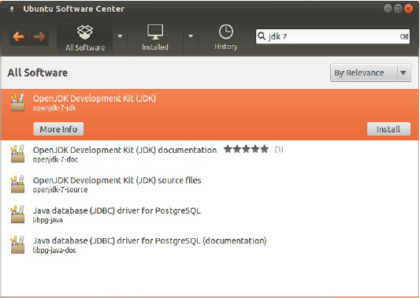
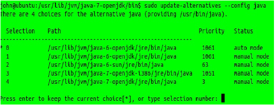
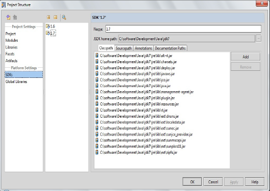

# Επισκόπιση της Java 7 {#Java7}
© Γιάννης Κωστάρας

---

Η πολυαναμενόμενη νέα έκδοση της Java, μετά από αναμονή μιας πενταετίας, είναι γεγονός. Σ' αυτό το άρθρο θα δούμε τι καινούρια χαρακτηριστικά φέρνει.

## Εγκατάσταση 
Για να δείτε τι έκδοση της Java τρέχετε δώστε σ' ένα κέλυφος την εντολή:
```
$ java -version
java version "1.6.0_23"
```
Αν λάβατε κάτι παρόμοιο με το παραπάνω, τότε ανοίξτε το Ubuntu Software Center και αναζητήστε τη φράση “jdk 7” (βλ. Εικόνα 1). Εγκαταστήστε τα τρία πρώτα πακέτα.



**Εικόνα 1** _Ubuntu Software Center_

```
$ java -version
java version "1.7.0_147-icedtea" 
OpenJDK Runtime Environment (IcedTea7 2.0) (7~b147-2.0-0ubuntu0.11.10.1) 
OpenJDK Client VM (build 21.0-b17, mixed mode, sharing) 
```
Η γλώσσα εγκαταστάθηκε στον κατάλογο ```/usr/lib/jvm```.

Αν δεν άλλαξε η έκδοση σε 1.7.0, τότε ακολουθήστε τα βήματα της αναφοράς [1] (βλ. Εικόνα 2):
```
$ sudo update-alternatives –-config java
```


**Εικόνα 2** _Εγκατεστημένες εκδόσεις Java στο σύστημά μου_

και επιλέξτε την έκδοση 7 (επιλογή 3 στην πιο πάνω εικόνα). Αν από την άλλη, το σύστημά σας έθεσε ως εξ ορισμού την έκδοση 7 αλλά εσείς θέλετε να συνεχίζετε να δουλεύετε με την έκδοση 6, πάλι τη θέτετε με την παραπάνω εντολή. Επαναλάβετε τα παραπάνω για τη ```javac```:
```
$ sudo update-alternatives –-config javac
```
Η έκδοση αυτή διακρίνεται από τα ακόλουθα τέσσερα έργα: 
* _Project Coin (JSR-334)_ που αποτελεί μερικές χρήσιμες προσθήκες στη γλώσσα, 
* τη νέα εντολή bytecode ```invokedynamic``` (JSR-292),
* New I/O Part 2 (JSR-203), 
* και το framework ```fork/join```.
      
## Project Coin
Πρόκειται για μικρές (συντακτικές) βελτιώσεις/προσθήκες στη γλώσσα που αποστολή τους είναι να κάνουν τη δουλειά των προγραμματιστών πιο εύκολη. Ας δούμε μερικές από αυτές:

* Ο τελεστής διαμάντι ```<>``` επιτρέπει να μη χρειάζεται να γράφουμε τον τύπο της κλάσης και στα δυο μέρη της εντολής δήλωσης ενός generic τύπου. Με άλλα λόγια, αντί να γράφουμε:
```
Map<String, List<String>> aMap =
new HashMap<String, List<String>>();
```
μπορούμε πλέον να γράφουμε:
```
Map<String, List<String>> aMap = new HashMap<>();
``` 
* Βελτιωμένη διαχείριση εξαιρέσεων. Η εντολή ```try-with-resources``` κλείνει αυτόματα κάποιον πόρο που ανοίξαμε για επεξεργασία (π.χ. αρχείο, socket κλπ). Προηγούμενα, όταν χρησιμοποιούσαμε στον κώδικά μας εξωτερικούς πόρους, έπρεπε να φροντίσουμε να τους κλείσουμε ώστε να μπορούν να ξαναχρησιμοποιηθούν. Πλέον, αυτό γίνεται αυτόματα μ' αυτή την εντολή την  οποία θα εκτιμήσουν ιδιαίτερα ξεχασιάρηδες προγραμματιστές κι όχι μόνο.

Ας δούμε τον παρακάτω κώδικα σε Java 6 που δημιουργεί ένα αντίγραφο ενός αρχείου ```test.txt```:
```
InputStream in = null;
try {
  final File input = 
       new File("test.txt");
  in = new FileInputStream(input);
  final File output = 
       new File("backup.txt");
  final OutputStream out = 
       new FileOutputStream(output);
  try {
   byte[] buf = new byte[4096];
   int n;
   while ((n = in.read(buf)) >= 0)
    out.write(buf, 0, n);
  } catch (IOException ioEx) {
   // Handle this exception 
  } finally  {
     try {
       out.close();
     } catch (
         IOException closeOutEx) {
     // Suppress this exception
     }
  }
} catch (FileNotFoundException fnfEx) {
     // Handle this exception
} catch (IOException openEx) {
     // Handle this exception
} finally  {
    try {
      if (in != null) in.close();
    } catch (IOException closeInx) {
     // Suppress this exception
    }
}
Σύμφωνα με το Νόμο του Μέρφυ, μπορεί να συμβεί κάτι απ' τα ακόλουθα:
1.  Ν' αποτύχει το InputStream: 
    • το άνοιγμα του αρχείου test.txt	
    • η ανάγνωσή του
    • το χωρίς λάθη κλείσιμό του
      2. Ν' αποτύχει το OutputStream: 
    • το άνοιγμα του αρχείου backup.txt	
    • η εγγραφή σ' αυτό
    • το χωρίς λάθη κλείσιμό του	
      3. Κάποιος συνδυασμός των παραπάνω.
       
Ας δούμε πώς μεταφράζεται ο παραπάνω κώδικας σε Java 7: 
final File input = 
      new File("test.txt");
final File output = 
      new File("backup.txt");
try (
  FileOutputStream out = 
     new FileOutputStream(output);
  InputStream in = 
     new FileInputStream(input);) {
     byte[] buf = new byte[4096];
     int len;
     while ((len=in.read(buf))>0) {
       out.write(buf, 0, len);
   }
} catch (IOException e) {
   // If file is not found
}
```

Όπως βλέπετε στον παραπάνω κώδικα, η εντολή
```
try (statements) { } 
```
δεν απαιτεί μπλοκ ```finally { }``` για να κλείσετε τους πόρους που ανοίξατε. Ο κώδικας αυτός κλείνει τον πόρο ακόμα και στην περίπτωση που συνέβη κάποια εξαίρεση.

Τα statements πρέπει να υλοποιούν το νέο interface ```AutoCloseable```. Το interface αυτό επεκτείνει το interface ```Closeable``` και περιέχει μια μέθοδο ```close()``` η οποία αναλαμβάνει να κλείσει τους ανοικτούς πόρους. Τσεκάρετε τις πηγές [4,5] για κάποιες ενδιαφέρουσες σκέψεις γύρω απ' τη χρήση αυτού του interface. 

Ας δούμε και το παρακάτω παράδειγμα:
```
try (
 BufferedReader br = 
  new BufferedReader(
   new InputStreamReader(
    new FileInputStream(
               "nofile.txt")))) {
  String strLine;
  while ((strLine = br.readLine()) != null) {
    System.out.println(strLine);
   }
} catch (IOException e) { 
   // If file is not found
   e.printStackTrace();
}
```
Αν το αρχείο ```nofile.txt``` δεν υπάρχει, τότε ο παραπάνω κώδικας θα πετάξει μια εξαίρεση ```java.io.FileNotFoundException``` και θα κλείσει αυτόματα τον πόρο που αναφέρεται από τη μεταβλητή ```br```. Τι γίνεται όμως με τους πόρους που άνοιξαν οι ```InputStreamReader``` και ```FileInputStream```; Καθώς δεν αποθηκεύτηκαν σε κάποια μεταβλητή θα παραμείνουν ανοικτοί! Γι' αυτό το λόγο, ο παραπάνω κώδικας θα πρέπει να γραφτεί ως εξής για να κλείσουν σωστά οι πόροι σε περίπτωση εξαίρεσης:
```
try (
 FileInputStream fis = 
   new FileInputStream(
               "nofile.txt");
 InputStreamReader isr = 
   new InputStreamReader(fis);
 BufferedReader br = 
  new BufferedReader(isr);) {
  String strLine;
  while ((strLine = br.readLine()) != null) {
    System.out.println(strLine);
   }
} catch (IOException e) { 
   // If file is not found
   e.printStackTrace();
}
```
Η Java 7 επιτρέπει επίσης την ομαδοποίηση διαφορετικών τύπων εξαιρέσεων ενός μπλοκ κώδικα, όπως π.χ.
```
try {
} catch (IOException | SQLException e) {
}
```
* Η εντολή ```switch``` έχει πλέον βελτιωθεί ώστε να μπορεί να συγκρίνει και αλφαριθμητικά:
```
final String dayOfWeek = "Saturday";
String result = ""; 
switch (dayOfWeek) {
  case "Sunday":                 
    result = "Κυριακή"; 
    break; 
  case "Monday": 
    result = "Δευτέρα"; 
    break; 
  case "Tuesday": 
    result = "Τρίτη"; 
    break; 
  case "Wednesday": 
    result = "Τετάρτη"; 
    break; 
  case "Thursday": 
    result = "Πέμπτη"; 
    break; 
  case "Friday": 
    result = "Παρασκευή"; 
    break; 
  case "Saturday": 
    result = "Σάββατο"; 
    break; 
  default: 
    result = "Error: " + dayOfWeek + 
             " is not a day of the week"; 
    break; 
} 
System.out.println(result);
``` 
Έξοδος:
```
> Σάββατο
```
* Ευκολότερη αναπαράσταση ακέραιων αριθμών. Η Java 6 υποστηρίζει ξεχωριστή σύνταξη για την αναπαράσταση των ακόλουθων αριθμητικών βάσεων
  * δεκαδικός, π.χ ```15```
  * οκταδικός, π.χ. ```023```
  * δεκαεξαδικός, π.χ. ```0xAB```
      
δεν υπάρχει όμως τρόπος αναπαράστασης ενός δυαδικού αριθμού, παρά μόνον:
```
int x = Integer.parseInt("111", 2);
```
Η Java 7 επιτρέπει την εξής σύνταξη:
```
int x = 0b111;  // για δυαδικούς
System.out.println(x);
```
Έξοδος:
```
> 7
```
Επίσης, ένα χαρακτηριστικό που το δανείστηκε από τη Ruby είναι η αναπαράσταση μεγάλων ακέραιων αριθμών ως εξής:
```
x = 123_456_789;
x = 0b001_111_000_010;
```

## Εντολή bytecode ```invokedynamic```
Διευκολύνει τη μεταγλώττιση δυναμικών γλωσσών προγραμματισμού σε Java bytecodes. Επιτρέπει μ' αυτόν τον τρόπο την εκτέλεση γλωσσών όπως Ruby, Python ή Javascript από τη JVM. Λύνει το πρόβλημα δυναμικής διανομής μεθόδων (dynamic method dispatch) των γλωσσών αυτών. Επιτρέπει δηλ. αυτή η διανομή να γίνει σε επίπεδο bytecode με δραματική βελτίωση της απόδοσης εφαρμογών γραμμένων στις γλώσσες αυτές όταν εκτελούνται από τη JVM, αφού πλέον μεταγλωττίζονται στη γλώσσα μηχανής (bytecode) της εικονικής μηχανής (JVM).

Όπως, επομένως, η Microsoft με την πλατφόρμα .NET επιτρέπει διαφορετικά τμήματα της ίδιας εφαρμογής να γράφονται σε διαφορετικές γλώσσες προγραμματισμού (π.χ. Visual Basic, C# κλπ.) και να μεταγλωττίζονται στην ίδια χαμηλού επιπέδου γλώσσα στο .NET, έτσι και η JVM υποστηρίζει (υποστήριζε και παλαιότερα) πολυγλωσσικό προγραμματισμό (polyglot programming) επιτρέποντάς σας να μπορείτε π.χ. να γράψετε το front-end μιας εφαρμογής σε Ruby και το back-end σε Java παντρεύοντας τις δυο γλώσσες στην ίδια εφαρμογή η οποία θα τρέχει στην JVM.

## New I/O Part 2 (ή “NIO.2”)
Το νέο ασύγχρονο Ι/Ο API ενδέχεται ν' αποβεί ιδιαίτερα χρήσιμο σε εφαρμογές που χρειάζονται μαζική επικοινωνία Ι/Ο. Η γλώσσα υποστηρίζει πλέον συμβολικούς συνδέσμους (symbolic links), έλεγχο δικαιωμάτων αρχείου, callbacks όταν ενημερώνεται ένα αρχείο ανεξάρτητα από το πρόγραμμα, κλπ. 

Ας δούμε μερικά παραδείγματα. Ο παρακάτω κώδικας σε Java 6:
```
File file = new File("test.txt");
System.out.println("File exists() == " + file.exists());
```
στη Java 7 μπορεί να γραφτεί ως:
```
import java.nio.file.*;
//...
Path path = FileSystems.getDefault().getPath("test.txt");
System.out.println("Path exists() == " + Files.exists(path));
```
Η κλάση ```java.nio.file.Files``` περιέχει γύρω στις 50 χρήσιμες μεθόδους επεξεργασίας αρχείων που περιλαμβάνουν από αντιγραφή/μετακίνηση αρχείων μέχρι δημιουργία συμβολικών συνδέσμων. Επίσης, έχουμε πλέον τη δυνατότητα ν' “ακούμε” το σύστημα αρχείων για εξωτερικές αλλαγές μέσω γεγονότων του συστήματος αρχείων. Ας δούμε ένα παράδειγμα:
```
// listen to a directory
Path path = FileSystems.getDefault().getPath("dir");
WatchService watcher = null;
WatchKey watchKey = null;
try {
// Create a watch service from the file system
  watcher = FileSystems.getDefault().newWatchService();
  // Tell me when a new entry is created in the directory
  watchKey = path.register(watcher, StandardWatchEventKinds.ENTRY_CREATE);
} catch (IOException e) {
   e.printStackTrace();
}
// wait to be called back
for (; ; ) {
  // take() blocks until something happens
  WatchKey key = null;
  try {
    key = watcher.take();
  } catch (InterruptedException e) {
    e.printStackTrace();
  }
  // see if this is what you were looking for
  if (key.equals(watchKey)) {
    // process each event
    for (WatchEvent event : key.pollEvents()) {
      // print the path created
      System.out.println(path + ": new file created " + event.context());
    }
  }
  // reset the key to continue receiving events
  key.reset();
}
```
Αν τρέξετε το πρόγραμμα και δημιουργήσετε ένα αρχείο στον κατάλογο dir τότε θα δείτε το μήνυμα:
```
dir: new file created bla.txt
```
Φυσικά, μπορείτε να ακούσετε και γι' άλλα γεγονότα πέραν του ```StandardWatchEventKinds.ENTRY_CREATE``` όπως ```StandardWatchEventKinds.ENTRY_MODIFY``` και ```StandardWatchEventKinds.ENTRY_DELETE```.

Τέλος, αφήνεται ως άσκηση για τον τολμηρό αναγνώστη να τροποποιήσει το πρόγραμμα ώστε να εκτελείται ο ατέρμων βρόγχος σε διαφορετικό νήμα.

## Εντολή fork/join
Η νέα αυτή εντολή επιτρέπει τη βέλτιστη χρησιμοποίηση των σύγχρονων πολυπύρηνων επεξεργαστών. Σας επιτρέπει να “σπάτε” ένα πρόβλημα σε μικρά αναδρομικά τμήματα προς επεξεργασία από διαφορετικούς επεξεργαστές αναλαμβάνοντας όλες τις λεπτομέρειες πολυεπεξεργασίας (concurrency) για πάρτη σας. Είναι ιδανική για προβλήματα που μπορούν να διασπαστούν σε μικρότερα, δηλ. τύπου divide and conquer. Ας δούμε ένα παράδειγμα πολυπρογραμματισμού με τη Java 7, το γνωστό πρόβλημα υπολογισμού των αριθμών Fibonacci:
```
private static long fibonacci(int n) {
  long fib = 0;
  if (n < 0)
    System.err.println("error! -- input must be a positive integer");
  else if (n < 2)
    f = n;
  else
    f = fibonacci(n-1) + fibonacci(n-2);
  return fib;
}

public static void main(String[] args) {
  final int n = 45;
  long startTime = System.currentTimeMillis();
  long fibo = fibonacci(n);
  long endTime = System.currentTimeMillis();
  System.out.println("F(" + n +")=" + fibo);
  System.out.println("Processing took " + (endTime - startTime) + " milliseconds.");
}
```
Φυσικά υπάρχει μια πιο γρήγορη μη αναδρομική λύση του προβλήματος, αλλά μπορούμε να δούμε πώς μπορούμε να σπάσουμε το παραπάνω πρόβλημα με τη ```fork/join```.
Κατ' αρχήν πρέπει να δημιουργήσουμε ένα ```RecursiveTask``` ή ```RecursiveAction``` (και τα δυο επεκτείνουν μια νέα κλάση ```ForkJoinTask```) που να περιγράφουν το πρόβλημα που έχουμε να επιλύσουμε. Επειδή θέλουμε να επιστρέψουμε κάποιο αποτέλεσμα, επιλέγουμε την ```RecursiveTask```:
```
class Fibonacci extends RecursiveTask<Long> {
  private final int n;
  private long fib;
  private static final int THRESHOLD = 10;

  Fibonacci(final int n) {
    this.n = n;
  }

  @Override
  public Long compute() {
// easy problem, don't bother with parallelism
    if (n <= THRESHOLD)          
      return fibonacci(n);
    Fibonacci f1 = 
             new Fibonacci(n - 1);
    f1.fork();
    Fibonacci f2 = 
             new Fibonacci(n – 2);
    fib = f2.compute() + f1.join();
    return fib;
  }

  private long fibonacci(int n) {
    long f = 0;
    if (n < 0)
      System.err.println("error! -- input must be a positive integer");
    else if (n < 2)
      f = n;
    else
      f = 
    fibonacci(n-1) + fibonacci(n-2);
    return f;
  }

  long getFib() {
    return fib;
  }
}
```
Στην ```compute()```, αν το πρόβλημα είναι τετριμμένο, κάνουμε τον υπολογισμό απευθείας (θα 'ναι γρηγορότερος έτσι), διαφορετικά σπάμε το πρόβλημα σε δυο προβλήματα (υπολογισμό των ```n-1``` και ```n-2```) και καλούμε τη ```fork()``` για το ένα και στη συνέχεια κάνουμε το αποτέλεσμα ```join()``` με το άλλο.

Καλούμε τα παραπάνω με χρήση της ```ForkJoinPool```:
```
ForkJoinPool pool = new ForkJoinPool(processors);
pool.invoke(new Fibonacci(n));
```
όπως φαίνεται παρακάτω:
```
public static void main(String[] args) {
  final int n = 46;
  // Check the number of available processors
  int processors = Runtime.getRuntime().availableProcessors();
  System.out.println("No of processors: " + processors);
   ForkJoinPool pool = new ForkJoinPool(processors);
   Fibonacci fibonacci = new Fibonacci(n);
   long startTime = System.currentTimeMillis();
   pool.invoke(fibonacci);
   long endTime = System.currentTimeMillis();
   System.out.println("F(" + n +")=" +fibonacci.getFib());
   System.out.println("Processing took " + (endTime - startTime) + " milliseconds.");
}
```
Ας δούμε μερικά αποτελέσματα:
```
Single threaded output:
F(46)=1836311903
Processing took 38128 milliseconds.

Fork/join output:
No of processors: 2
F(46)=1836311903
Processing took 31436 milliseconds.
```
Υπάρχει κι ένας γρήγορος αλγόριθμος fibonacci:
* ```f2n=2fn-1fn + f2n```, αν ο ```n``` είναι ζυγός
* ```f2n-1=f2n-1 + f2n```, αν ο ```n``` είναι μονός
```
private static long fibonacci(int n) {
  long fib = 0;
  if (n < 0)
   System.err.println("error! -- input must be a positive integer");
  else if (n < 2)
   fib = n;
  else if (n % 2 == 0) { 
 // F(2N) = 2F(N-1)*F(N) + F(N)*F(N)
   long fn = fibonacci(n / 2);
   fib=2*fn*fibonacci(n/2-1)+fn*fn;
  } else {	
// F(2N-1) = F(N)*F(N) + F(N-1)*F(N-1)
   long fn = fibonacci((n-1)/2);
   long fn_1 = fibonacci((n+1)/2);
   fib = fn*fn + fn_1*fn_1;
  }
}
```
Το αποτέλεσμα εντυπωσιακό:
```
F(46)=1836311903
Processing took 0 milliseconds.
```
Αντικαταστήστε τη στην έκδοση με fork/join και θα πάρετε το αποτέλεσμα:
```
Fork/join output (fast fibonacci):
No of processors: 2
F(46)=1836311903
Processing took 7197 milliseconds.
```
Αν και αργότερη από την απλή αναδρομική έκδοση (γιατί;), είναι σημαντικά πιο γρήγορη από την έκδοση ```fork/join``` με τον παραδοσιακό αλγόριθμο.
Καθώς πλέον θα μπείτε στον πειρασμό να λάβετε αποτελέσματα για μεγάλους ακεραίους, θα δείτε ότι ο τύπος δεδομένων ```long``` δεν είναι αρκετά μεγάλος και θα πέσετε σε υπερχείλιση. Σ' αυτήν την περίπτωση θα πρέπει ν' αλλάξετε τα προγράμματα ώστε να δουλεύουν με ```BigInteger``` αντί για ```long```, αλλά αυτό αφήνεται σαν άσκηση στον αναγνώστη.

## Java 8
Πολλά από τα νέα χαρακτηριστικά που προορίζονταν για την έκδοση 7 τελικά θα πρέπει να περιμένουμε μέχρι την έκδοση 8 για να τα δούμε:

* λ-λογισμό (δηλ. closures) για πιο συνοπτικό κώδικα και καλύτερη χρήση των σύγχρονων πολυ-πύρηνων επεξεργαστών
* Μικρές βελτιώσεις (ό,τι δεν υλοποιήθηκε στην έκδοση 7 από το “Project Coin”). Π.χ. θα μπορείτε να γράψετε: ```list.sort()```. 
* Ένα νέο σύστημα πακεταρίσματος  (“Project Jigsaw”) που θ' απλοποιήσει τη δημιουργία, πακετάρισμα και εγκατάσταση των εφαρμογών (δηλ. δε θα βασίζεται πλέον στους φακέλους του Λ.Σ. όπως είναι σήμερα τα packages με τους γνωστούς περιορισμούς)
* Βελτιώσεις στο χρόνο εκκίνησης της JVM και άλλες εργονομικές βελτιώσεις

Σίγουρα, η νέα έκδοση θα 'ρθει πολύ πιο σύντομα απ' ότι η έκδοση 7, καθώς δεν προβλέπεται άλλη συγχώνευση εταιριών!

## ΟΠΕ
Ήδη οι τελευταίες εκδόσεις των πιο γνωστών Ολοκληρωμένων Περιβαλλόντων Εργασίας (Integrated Development Environments) υποστηρίζουν τα νέα χαρακτηριστικά της γλώσσας. Σ' αυτά περιλαμβάνονται το NetBeans 7, το Intellij Idea 10.5 και το Eclipse Indigo 3.7. Αν επομένως επιθυμείτε να δοκιμάσετε τα παραπάνω, κατεβάστε κάποιο από τα προαναφερθέντα ΟΠΕ και δοκιμάστε τα! Στη συνέχεια περιγράφουμε την υποστήριξη της Java 7 από το Intellij Idea 11.

Το Intellij Idea ήταν ίσως το πρώτο ΟΠΕ που υποστήριξε Refactorings. Μπροστά από την εποχή του, ακόμα και σήμερα προσφέρει πολλές καινοτομίες που το βοηθούν να ξεχωρίζει από το δύσκολο ανταγωνισμό. Ευρωπαϊκό προϊόν, κατασκευασμένο στην Τσεχία, προσφέρεται πλέον σε δυο εκδόσεις, την Community, που είναι  δωρεάν και ανοικτού κώδικα, και την εμπορική Ultimate. Η CE αρκεί για τις περιπέτειές μας με τη Java 7 σ' αυτό το άρθρο, αλλά αν θέλετε να πειραματιστείτε με πολυγλωσσικό προγραμματισμό (polyglot programming) θα χρειαστείτε την Ultimate Edition (UE).
Κατεβάστε την CE για Linux από [εδώ](http://www.jetbrains.com/idea/download/index.html) και αποσυμπιέστε το αρχείο 
```
idea-11.0.tar.gz: 
$ tar xfz idea-11.0.tar.gz
$ cd bin
$ ./idea.sh
```
Αφού ανοίξετε το πρόγραμμα, σετάρετε το JDK 7 από το μενού **File → Project Structure → SDKs** πατώντας στο κουμπί **+ (Add New SDK) → JSDK** και ορίζοντας τη διαδρομή του JDK 7. Στη συνέχεια, κάντε κλικ στο **Project** και επιλέξτε JDK 7 για τα έργα που δημιουργείτε. Επίσης, ορίστε **Project Language Level: 7.0**.

Είστε έτοιμοι. Δημιουργήστε ένα νέο έργο, αν δεν το 'χετε κάνει ήδη, ελέγξτε ή ορίστε το επίπεδο γλώσσας να είναι 7 και δοκιμάστε τα κομμάτια κώδικα του άρθρου. Happy coding!



**Εικόνα 3** _Ρύθμιση JDK 7 στο Intellij IDEA 11_

## Επίλογος
Σ' αυτό το άρθρο μιλήσαμε για μερικές απ' τις κυριότερες αλλαγές που εισήλθαν στη Java 7. Καίτοι πολλές απ' αυτές δεν είναι συναρπαστικές, θα σας βοηθήσουν να γράψετε πιο συνοπτικό και χωρίς λάθη κώδικα. Επίσης, είδαμε ποια χαρακτηριστικά να περιμένουμε από την έκδοση 8. Αφήσαμε κάποια χαρακτηριστικά όπως το νέο Sockets Direct Protocol για streaming μέσω InfiniBand στο Solaris.

Μην καθυστερείτε. Αν δεν έχετε λόγους να μείνετε στην έκδοση 6 ή σε κάποια άλλη προηγούμενη έκδοση, κατεβάστε την έκδοση 7 και δοκιμάστε τη με το Idea ή κάποιο άλλο ΟΠΕ. 

## Πηγές:
1. [Install JDK 7 on  Ubuntu](http://www.shinephp.com/install-jdk-7-on-ubuntu/). 
2. Meloan M. (2011), “Showtime! Java 7 is here”, [Java Magazine](http://www.oracle.com/technetwork/java/javamagazine/index.html), τεύχος 1, σελ.21-24.
3. [Java Tech Journal #9](http://www.jaxenter.com), Java 7, Issue June 2011.
4. Kabutz, H. “Automatically Unlocking with Java 7”, [Java Specialists Newsletter Issue 190](http://www.javaspecialists.eu/archive/Issue190.html).
5. Kabutz, H. “Automatically Unlocking with Java 7 – Follow up”, [Java Specialists Newsletter Issue 190b](http://www.javaspecialists.eu/archive/Issue190b.html).
6. Harned, Ed. (2010), [“Fork-Join Development in Java SE”](http://www.coopsoft.com/ar/ForkJoinArticle.html).
7. [Java Tutorial](http://docs.oracle.com/javase/tutorial/essential/concurrency/forkjoin.html).
8. Horstmann, C. (2009), _Big Java_, 4th Edition, Wiley.
9. [Fibonacci calculator](http://www.tools4noobs.com/online_tools/fibonacci/). 

---