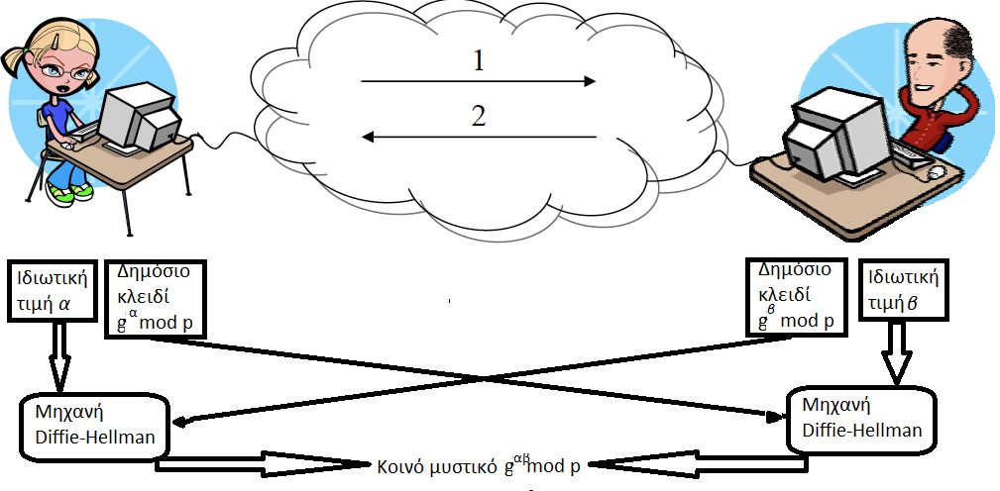
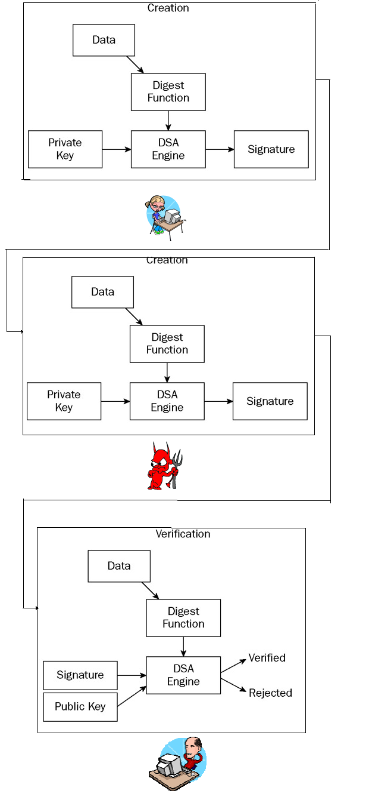

# Εισαγωγή στην Κρυπτογραφία με τη γλώσσα Java {#JavaCryptography}
© Γιάννης Κωστάρας

---

## Εισαγωγή
Σε αυτό το άρθρο θα εξετάσουμε τις δυο κατηγορίες Κρυπτογραφίας που υπάρχουν (_Συμμετρική_ και _Δημοσίου κλειδιού_), και θα δούμε πρακτικά προγράμματα σε Java που χρησιμοποιούν τις βιβλιοθήκες Java Cryptography Extension (JCE). 

Μια άλλη κατηγοριοποίηση των κρυπτοσυστημάτων φαίνεται στο σχήμα 1.


**Σχήμα 1** _Κρυπτοσυστήματα_ [1]

Επιπροσθέτως, οι κρυπτογραφικοί αλγόριθμοι μπορούν να χωριστούν σε δύο διαφορετικές κατηγορίες με βάση τον τρόπο κρυπτογράφησης των μηνυμάτων:

* _Δέσμης (Block Ciphers)_, οι οποίοι χωρίζουν το μήνυμα σε κομμάτια και κρυπτογραφούν κάθε ένα από τα κομμάτια αυτά χωριστά.
* _Ροής (Stream Ciphers)_, οι οποίοι κρυπτογραφούν μία ροή μηνύματος (stream) χωρίς να την διαχωρίζουν σε τμήματα.

## Συμμετρική κρυπτογραφία
Ιστορικά, η πρώτη μορφή κρυπτογραφίας που χρησιμοποιήθηκε ήταν η συμμετρική κρυπτογραφία. Στη συμμετρική κρυπτογραφία χρησιμοποιείται μόνο ένα κλειδί, το μυστικό ή _ιδιωτικό κλειδί_, το οποίο διανέμεται τόσο στον αποστολέα όσο και στον παραλήπτη του μηνύματος.

Η πιο γνωστή περίπτωση ήταν _ο αλγόριθμος κρυπτογράφησης του Καίσαρα_ [1,2,11]. Ο Ιούλιος Καίσαρας έγραφε στον Κικέρωνα και σε άλλους φίλους του, αντικαθιστώντας κάθε γράμμα του κειμένου με το γράμμα που βρισκόταν 3 θέσεις μετά στο λατινικό αλφάβητο. Έτσι, σήμερα, το σύστημα κρυπτογράφησης που στηρίζεται στην αντικατάσταση των γραμμάτων του αλφαβήτου με άλλα που βρίσκονται σε καθορισμένο αριθμό θέσης, πριν ή μετά, λέγεται _κρυπτοσύστημα αντικατάστασης του Καίσαρα_. Κάθε γράμμα αντιστοιχίζεται σε έναν αριθμό, π.χ.
```
A = 0, B = 1, C = 2, …, Z = 25
```
Το _κλειδί_ (ή _μετατόπιση_), είναι ένας αριθμός μεταξύ 0 και 25. Ο Καίσαρας χρησιμοποιούσε το 3, π.χ.

* Αρχικό κείμενο:			```CRYPTOGRAPHY```
* Κρυπτογραφημένο κείμενο:  	```FUBSWRJUDSKB```
* Μετατόπιση: 3, δηλ. ```Α→D, B→E, C→F``` κλπ.

Ο παραλήπτης πρέπει να μοιράζεται το ίδιο κλειδί με τον αποστολέα για να μπορέσει να αποκρυπτογραφήσει το μήνυμα. Φυσικά, το πρόβλημα ήταν η ασφαλής μεταφορά του κλειδιού στον παραλήπτη. Παρόμοια τεχνική χρησιμοποιούσαν κι οι Σπαρτιάτες με τη _σπαρτιατική σκυτάλη_ [1]. Το μήκος της σκυτάλης αποτελούσε το κλειδί.

Οι παραπάνω αλγόριθμοι 'σπάνε' εύκολα (ακόμα κι αν δεν γνωρίζουμε το κλειδί) αν βασιστούμε στη συχνότητα εμφάνισης των γραμμάτων της αλφαβήτου. 


**Σχήμα 2** _Συχνότητες γραμμάτων Αγγλικού αλφαβήτου_

Αν έχουμε ένα αρκετά μεγάλο κρυπτογραφημένο κείμενο, μπορούμε να υπολογίσουμε τη συχνότητα εμφάνισης κάθε γράμματος και να το αντιστοιχίσουμε στο αρχικό κάνοντας χρήση του ιστογράμματος συχνοτήτων του παραπάνω σχήματος.

Οι πιο γνωστοί συμμετρικοί αλγόριθμοι είναι οι [1,3,4]: 

* DES
* Triple DES
* AES
* Blowfish 
* RC2
* RC4 
* IDEA.

Οι αλγόριθμοι αυτοί ανήκουν στην κατηγορία των κωδίκων τύπου _δέσμης (block)_. Ένας  κώδικας δέσμης δέχεται δυο εισόδους, ένα κλειδί ```Κ``` μεγέθους k-bit κι ένα κείμενο ```M``` μεγέθους L-bit κι επιστρέφει ένα κρυπτογραφημένο κώδικα ```C``` μεγέθους L-bit.

Ο αλγόριθμος κρυπτογράφησης είναι δημόσιος και πλήρως καθορισμένος. Η ασφάλειά του έγκειται στη μυστικότητα του κλειδιού. Επίσης, για κάθε συνάρτηση κρυπτογράφησης, υπάρχει μια αντίστροφη συνάρτηση αποκρυπτογράφησης. Στη συνέχεια περιγράφουμε τον πιο γνωστό αλγόριθμο συμμετρικής κρυπτογράφησης τύπου δέσμης, τον DES.

## DES
Είναι ο πιο γνωστός κρυπτοαλγόριθμος τύπου δέσμης, αν και πλέον δε θεωρείται ασφαλής [1,3-7]. Πρόκειται για έναν αξιοσημείωτα καλοσχεδιασμένο αλγόριθμο, ευρεία διαδεδομένο. Κάθε φορά που χρησιμοποιείτε ένα ATM χρησιμοποιείτε τον DES. Μήκος κλειδιού k = 56 bits και μήκος δέσμης L = 8 bytes = 8x8 = 64 bits. Το 1977 υιοθετήθηκε από την NBS (πλέον NIST) ως FIPS PUB 46 και αποδείχθηκε αξιοσημείωτα ασφαλής. Σήμερα μπορεί να σπάσει σε λιγότερο από 24 ώρες.

Η λειτουργία του φαίνεται στο παρακάτω σχήμα. Το μήνυμα μαζί με το κρυφό κλειδί περνούν ως είσοδοι στον αλγόριθμο κρυπτογράφησης (DES) για να παραχθεί το κρυπτομήνυμα, το οποίο φθάνει στον παραλήπτη. Ακολουθεί η αντίστροφη διαδικασία της αποκρυπτογράφησης, χρησιμοποιώντας ως εισόδους το ίδιο κρυφό κλειδί, που είναι γνωστό και στον παραλήπτη, και το κρυπτομήνυμα, για να παραχθεί εκ νέου το αρχικό μήνυμα. 


**Σχήμα 3** _Λειτουργία της συμμετρικής κρυπτογραφίας (DES)_

Ισχύς του DES: 56-bit κλειδιά παράγουν 2<sup>56</sup> = 7,2 x 10<sup>16</sup> δυνατές τιμές, πράγμα που σημαίνει ότι η αναζήτηση με δοκιμή όλων των πιθανών συνδυασμών (brute force) είναι δύσκολη, αλλά πιθανή. Π.χ., τον Ιούλιο του 1998, το Electronic Frontier Foundation (EFF) ανακοίνωσε ότι έσπασε μια κρυπτογράφηση DES με μια μηχανή ειδικά φτιαγμένη για να σπάσει τον αλγόριθμο, η οποία κόστισε $250,000 και χρειάστηκε 22 ώρες και 15 λεπτά. Φυσικά, σήμερα είναι ζήτημα ωρών για να σπάσει ο DES και γι' αυτό το λόγο έχουν αναπτυχθεί νέοι αλγόριθμοι όπως ο Triple DES και ο AES.

Σύμφωνα με το νόμο του Μoore που μας λέει ότι η υπολογιστική ισχύς διπλασιάζεται κάθε 18 μήνες, για να παραμείνει ο αλγόριθμος αποτελεσματικός, το μέγεθος κλειδιού πρέπει να είναι τουλάχιστο 128 bits. Το μέγεθος δέσμης του AES είναι 16 bytes = 16x8 = 128 bits. 

Το πρόβλημα με τους κώδικες δέσμης είναι ότι το κείμενο που θέλουμε να κρυπτογραφήσουμε θα πρέπει να έχει μέγεθος ακέραιο πολλαπλάσιο του μεγέθους του μπλοκ του κώδικα, π.χ. πολλαπλάσιο των 56 bits για τον DES. Αν αυτό δεν ισχύει, τότε καταφεύγουμε στην τεχνική padding, όπου γεμίζουμε κατάλληλα τα υπόλοιπα bits, ώστε να φθάσουμε στο επιθυμητό μέγεθος. Υπάρχουν διάφοροι αλγόριθμοι padding, όπως PKCS #5/PKCS #7, ISO10126-2, ISO7816-4, X9.23, Trailing Bit Complement κ.ά. [8].

Στον αντίποδα υπάρχουν οι κώδικες ροής, που επιτρέπουν την κρυπτογράφηση κειμένου οποιουδήποτε μεγέθους. Αυτό το επιτυγχάνουν με το να εφαρμόζουν την πράξη XOR μεταξύ του κειμένου προς κρυπτογράφηση και μιας ακολουθίας από bits, όπως φαίνεται στο ακόλουθο σχήμα:


**Σχήμα 4** _Σύγκριση αλγορίθμων κρυπτογράφησης δέσμης (block) και ροής (stream)_

Αρκετά όμως με τη θεωρία. Ας δούμε ένα πρόγραμμα σε Java το οποίο υλοποιεί τα παραπάνω.
```java
package gr.ubuntistas.issue9;

import java.io.UnsupportedEncodingException;
import java.security.InvalidKeyException;
import java.security.NoSuchAlgorithmException;
import java.security.SecureRandom;

import javax.crypto.BadPaddingException;
import javax.crypto.Cipher;
import javax.crypto.IllegalBlockSizeException;
import javax.crypto.KeyGenerator;
import javax.crypto.NoSuchPaddingException;
import javax.crypto.SecretKey;

import org.apache.commons.codec.binary.Base64;
/**
 * Encrypts and then decrypts a message from the standard input.
 * @author hawk
 *
 */
public class SimpleSymmetricExample {
	private SecretKey key;  // secret key
	private Cipher cipher;	// cipher being used
	
	/**
	 * Initializes the symmetric encryption algorithm
	 * @param algorithm to use, e.g. 'AES', 'DES' etc.
	 * @throws NoSuchAlgorithmException if algorithm does not exist
	 * @throws NoSuchPaddingException
	 */
	SimpleSymmetricExample(final String algorithm) throws 
		NoSuchAlgorithmException, NoSuchPaddingException {
		key = generateKey(algorithm);
		cipher = Cipher.getInstance(algorithm);		
	}

	/**
	 * Generates a random secret key.
	 * @param algorithm to use, e.g. HmacSHA1, SHA etc.
	 * @throws NoSuchAlgorithmException if the algorithm string passed as a parameter is not recognized
	 */
	private SecretKey generateKey(final String algorithm) throws NoSuchAlgorithmException {
		KeyGenerator keygen = KeyGenerator.getInstance(algorithm);
		keygen.init(new SecureRandom());
		return keygen.generateKey();
	}
	
	/**
	 * Encrypts the <code>message</code>
	 * @param message plain text message to be encrypted
	 * @return a base64 encoded representation of the encrypted message
	 * @throws UnsupportedEncodingException if encoding is not UTF-8 
	 * @throws InvalidKeyException 
	 * @throws BadPaddingException 
	 * @throws IllegalBlockSizeException 
	 */
	String encrypt(final String message) throws 
		UnsupportedEncodingException, InvalidKeyException, 
		IllegalBlockSizeException, BadPaddingException {
		byte[] plainText = message.getBytes("UTF-8");
		byte[] cipherText = new byte[plainText.length];
		cipher.init(Cipher.ENCRYPT_MODE, key);
		cipherText = cipher.doFinal(plainText);
		Base64 encoder = new Base64();
		return encoder.encodeToString(cipherText);
	}
	/**
	 * Decrypts the <code>encryptedMessage</code>
	 * @param encryptedMessage cipher text 
	 * @return the decrypted message
	 * @throws UnsupportedEncodingException if encoding is not UTF-8
	 * @throws InvalidKeyException 
	 * @throws IllegalBlockSizeException
	 * @throws BadPaddingException
	 */
	String decrypt(final String encryptedMessage) throws 
		UnsupportedEncodingException, InvalidKeyException, 
		IllegalBlockSizeException, BadPaddingException {
		Base64 decoder = new Base64();
		byte[] cipherText = decoder.decode(encryptedMessage);
		byte[] plainText = new byte[cipherText.length];
		cipher.init(Cipher.DECRYPT_MODE, key);
		plainText = cipher.doFinal(cipherText);
		return new String(plainText, "UTF-8");
	}

	/**
	 * @param args
	 */
	public static void main(String[] args) throws Exception {
		String message = "";
		if (args.length > 0) {
			for (int i=0; i<args.length; i++)
				message += args[i]+" ";
		} else {
			System.out.println("Usage: java -cp .:lib/commons-codec-1.4.jar gr.ubuntistas.issue9.SimpleSymmetricExample <plain text>");
			System.exit(1);
		}

		System.out.println("input text : " + message);
		
		SimpleSymmetricExample symmetric = new SimpleSymmetricExample("AES");
		
		// encryption pass
		String cipherText = symmetric.encrypt(message);
		System.out.println("Cipher text:" + cipherText);

		// decryption pass
		System.out.println("Plain text: " + symmetric.decrypt(cipherText));
	}
}
```
Για να μεταγλωτίσετε το πρόγραμμα απαιτείται να προσθέσετε τη βιβλιοθήκη ```commons-codec.jar``` στο classpath, την οποία μπορείτε να κατεβάσετε από αυτήν την [ιστοσελίδα](http://commons.apache.org/codec/). Η βιβλιοθήκη αυτή περιέχει την κλάση ```Base64```, η οποία μας επιτρέπει να αναπαριστούμε τους κώδικες σε μια πιο φιλική μορφή (την Base64).

Μεταγλωττίστε και εκτελέστε το πρόγραμμα. Ένα παράδειγμα εκτέλεσης φαίνεται παρακάτω:
```bash
$ java -cp .:lib/commons-codec-1.4.jar gr.ubuntistas.issue9.SimpleSymmetricExample    This is a long message!
Plain text input: This is a long message! 
Cipher text:4DQ+eTUCb4UcVClHSLwzfIXOV/F7t1bB2OosIAIkL+4=

Plain text output: This is a long message! 
```
Ας δούμε πως δουλεύει. Ξεκινάμε με τη ```main()```. Το πρόγραμμα δέχεται από την είσοδο (πληκτρολόγιο) μια ακολουθία από λέξεις χωρισμένες με κενά ή άλλους χαρακτήρες και τους αποθηκεύει στη μεταβλητή message. Στη συνέχεια δημιουργεί ένα αντικείμενο της ```SimpleSymmetricExample```, περνώντας τον αλγόριθμο που θέλουμε να χρησιμοποιήσουμε. Στο συγκεκριμένο παράδειγμα περάσαμε τον AES, αλλά οποιοσδήποτε άλλος συμμετρικός αλγόριθμος, όπως π.χ. ο DES θα δούλευε το ίδιο καλά. Η λίστα των αλγορίθμων που μπορείτε να χρησιμοποιήσετε εξαρτάται από τον πάροχο (provider) που θα χρησιμοποιήσετε (βλ. [8]). Τέτοιοι πάροχοι, πέραν της [SunJCE](http://java.sun.com/j2se/1.4.2/docs/guide/security/jce/JCERefGuide.html#AppA) φυσικά, είναι π.χ. η [BouncyCastle](http://www.bouncycastle.org/java.html) και το [Cryptix](http://www.cryptix.org/) project. Οι αλγόριθμοι είναι της μορφής αλγόριθμος/τρόπος/padding, π.χ. DES/CBC/PKCS5Padding ή AES/ECB/NoPadding, όπου το τρόπος και το padding μπορούν να παραλειφθούν. 

Στη συνέχεια καλείται η μέθοδος ```encrypt(message)```, η οποία επιστρέφει το κρυπτογραφημένο μήνυμα σε μορφή Base64 και το εμφανίζει στην έξοδο, ενώ τέλος καλείται η ```decrypt(cipherText)```, η οποία επιστρέφει το αρχικό μήνυμα.

Όπως είδαμε, η ```SimpleSymmetricExample``` περιλαμβάνει τρεις μεθόδους: τη μέθοδο κατασκευής (constructor), την ```encrypt()``` και την ```decrypt()```.

Η μέθοδος κατασκευής αρχικοποιεί τη μεταβλητή ```key``` (το μυστικό κλειδί), καθώς και τον αλγόριθμο ```cipher```, τον οποίο περνάμε ως παράμετρο στη μέθοδο (βλ. και σχήμα 3). Η αρχικοποίηση του ```cipher``` είναι εύκολη: ```Cipher.getInstance(algorithm)```, όπου ```algorithm = "AES"``` στο παράδειγμά μας. Για το μυστικό κλειδί, ο πιο εύκολος τρόπος είναι να αφήσουμε τη Java να δημιουργήσει ένα κλειδί, χρησιμοποιώντας την κλάση ```KeyGenerator``` και αρχικοποιώντας τη με έναν τυχαίο αριθμό (βλ. [9]). Η ```SecureRandom()``` έχει δημιουργηθεί από τη Sun γι' αυτόν ακριβώς το σκοπό. Η δημιουργία του κλειδιού περιλαμβάνει τρία βήματα, τη δημιουργία ενός αντικειμένου τύπου ```KeyGenerator```, την αρχικοποίησή του με έναν τυχαίο αριθμό και, τέλος, τη δημιουργία του κρυφού συμμετρικού κλειδιού (βλ. τη μέθοδο ```generateKey()```).
H ```encrypt()``` μετατρέπει το κείμενο σε έναν πίνακα από bytes, καλεί την ```cipher.init()``` σε ```ENCRYPT_MODE```, περνώντας της και το μυστικό κλειδί, και στη συνέχεια καλεί τη ```cipher.doFinal()```, περνώντας της το κείμενο που θέλουμε να κρυπτογραφήσουμε. Τέλος, η μέθοδος κωδικοποιεί και επιστρέφει το κρυπτογραφημένο μήνυμα σε μορφή Base64. 

Η ```decrypt()``` επιτελεί την ακριβώς αντίστροφη διαδικασία. Αποκωδικοποιεί το μήνυμα από Base64 μορφή και στη συνέχεια καλεί πάλι την ```cipher.init()``` σε ```DECRYPT_MODE```, περνώντας της το ίδιο μυστικό κλειδί, και τη ```cipher.doFinal()```, περνώντας της το κρυπτογραφημένο κείμενο και επιστρέφοντας το αρχικό κείμενο σε μορφή UTF-8.

Δυστυχώς, το παραπάνω πρόγραμμα δεν δουλεύει για όλες τις περιπτώσεις. Αν βιαστήκατε να χρησιμοποιήσετε άλλους αλγόριθμους πέραν των DES, AES, π.χ. DES/CBC/PKCS5Padding ή AES/ECB/NoPadding ή οποιονδήποτε άλλον συνδυασμό του SunJCE, θα δείτε ότι το πρόγραμμα αποτυγχάνει. Ορισμένοι τρόποι (modes), όπως ο CTR και ο CBC, χρειάζονται μια ακολουθία αρχικοποίησης (IV) τύπου ```IvParameterSpec``` για να δουλέψουν. Επίσης, η ```generateKey()``` δεν καταλαβαίνει π.χ. το DES/CBC/PKCS5Padding και θα πρέπει να της περάσετε μόνο το DES, π.χ. με την παρακάτω γραμμή κώδικα:
```
key = generateKey(algorithm.indexOf('/') == -1 ? 
algorithm : algorithm.substring(0, algorithm.indexOf('/')));
```
Το πρόγραμμα δεν είναι καθολικό όπως θα ήθελα και για να το κάνω θα χρειαστεί πολλές ακόμα γραμμές κώδικα, κάτι που ξεφεύγει από το σκοπό αυτού του άρθρου. Παραδείγματα υλοποίησης του κάθε αλγόριθμου θα βρείτε στην αναφορά [8] και σε [τούτη](http://www.java2s.com/Tutorial/Java/0490__Security/Catalog0490__Security.htm) την ιστοσελίδα.

Κάνοντας χρήση του παραπάνω προγράμματος, μπορείτε πλέον να στέλνετε κρυπτογραφημένα μηνύματα στους φίλους σας. Βέβαια, το πρόβλημα είναι ότι θα πρέπει να τους στέλνετε και το κλειδί για να μπορέσουν να αποκρυπτογραφήσουν το μήνυμα, και αυτό είναι σημαντικό μειονέκτημα. Στο επόμενο κεφάλαιο θα δούμε πώς μπορούμε να στέλνουμε με ασφάλεια το μυστικό κλειδί στον παραλήπτη.

## Κρυπτογραφία δημόσιου κλειδιού 
Το πρόβλημα που έχουμε με την κρυπτογραφία δημόσιου κλειδιού είναι πώς να διανείμουμε το μυστικό κλειδί χωρίς να υποπέσει σε άσχετα χέρια. Θα μπορούσαμε φυσικά να δώσουμε το μυστικό κλειδί στον παραλήπτη χέρι με χέρι, μέσω ασφαλούς τηλεφωνικής επικοινωνίας, μέσω ασφαλούς αλληλογραφίας κλπ. Aλλά, τέτοιες μέθοδοι δεν είναι ούτε πρακτικές ούτε πολλές φορές εφικτές. Γι' αυτό το σκοπό χρησιμοποιούμε την κρυπτογραφία δημόσιου κλειδιού.

Οι πιο γνωστοί αλγόριθμοι δημόσιου κλειδιού είναι οι [3,4,6]: 
* Diffie-Hellman
* RSA
* El Gamal
      
Το 1976, μια επαναστατική μελέτη άνοιξε νέους ορίζοντες στην κρυπτογραφία, ορίζοντας την ασύμμετρη κρυπτογραφία ή κρυπτογραφία δημόσιου κλειδιού. Ο αλγόριθμος Diffie-Hellman παίρνει τ' όνομά του από τους Whitfield Diffie και Martin Hellman, και βασίζεται στη δυσκολία επίλυσης του διακριτού λογαριθμικού προβλήματος. 

Ο αλγόριθμος RSA δημοσιεύθηκε το 1977 από τους Ronald Rivest, Adi Shamir, και Leonard Adleman. Η ασφάλεια του αλγορίθμου έγκειται στη δυσκολία παραγοντοποίησης μεγάλων πρώτων αριθμών. (Ένας αριθμός είναι πρώτος αν διαιρείται μόνο από το 1 και τον εαυτό του).
Ο αλγόριθμος El Gamal (1985), τέλος, είναι μια παραλλαγή του Diffie Hellman. 

Η λειτουργία των αλγορίθμων δημοσίου κλειδιού φαίνεται στο ακόλουθο σχήμα.


**Σχήμα 5** _Λειτουργία του αλγορίθμου δημοσίου κλειδιού_ 

Ο αποστολέας χρησιμοποιεί το δημόσιο κλειδί του παραλήπτη για να κρυπτογραφήσει το μήνυμα και το στέλνει στον παραλήπτη. Ο παραλήπτης χρησιμοποιεί το ιδιωτικό του κλειδί για να αποκρυπτογραφήσει το μήνυμα. Μόνο ο παραλήπτης (ο κάτοχος του ιδιωτικού κλειδιού) μπορεί να αποκρυπτογραφήσει το κρυπτομήνυμα. Γνωρίζοντας κάποιος το δημόσιο κλειδί δεν μπορεί να συνάγει καμία πληροφορία όσον αφορά το ιδιωτικό κλειδί.

Το πιο γνωστό παράδειγμα κρυπτογραφίας δημόσιου κλειδιού είναι το _PGP (Pretty Good Privacy)_. Οι χρήστες PGP παράγουν ένα ζεύγος κλειδιών και μεταφορτώνουν το δημόσιο κλειδί σ' ένα διακομιστή για να μπορεί να το χρησιμοποιήσει ο καθένας. Όποιος θέλει να στείλει ένα κρυπτογραφημένο μήνυμα στον χρήστη του δημόσιου κλειδιού, το χρησιμοποιεί για να κρυπτογραφήσει το μήνυμά του με αυτό και στη συνέχεια στέλνει το κρυπτογραφημένο μήνυμα στον παραλήπτη μέσω ηλεκτρονικού ταχυδρομείου. Ο παραλήπτης είναι ο μόνος που μπορεί να αποκρυπτογραφήσει το κρυπτομήνυμα με το ιδιωτικό του κλειδί.
Φυσικά το ερώτημα παραμένει. Πώς μπορείς να είσαι σίγουρος ότι το δημόσιο κλειδί που θα βρεις στον διακομιστή είναι όντως του ισχυριζόμενου παραλήπτη; 

Το πρόγραμμα ```SimpleASymmetricExample```, επιδεικνύει ένα παράδειγμα κρυπτογραφίας δημόσιου κλειδιού. Το πρόγραμμα μοιάζει πολύ με αυτό της συμμετρικής κρυπτογραφίας ```SimpleSymmetricExample``` του προηγούμενου τεύχους, το οποίο μπορείτε επίσης να κατεβάσετε από [εδώ](assets/java_cryptography.zip).

Για να μεταγλωτίσετε το πρόγραμμα απαιτείται να προσθέσετε τη βιβλιοθήκη ```commons-codec.jar``` στο ```classpath```, αν δεν το έχετε κάνει ήδη, την οποία μπορείτε να κατεβάσετε από αυτήν την [ιστοσελίδα](http://commons.apache.org/codec/). Η βιβλιοθήκη αυτή περιέχει την κλάση ```Base64```, η οποία μας επιτρέπει να αναπαριστούμε τους κώδικες σε μια πιο φιλική μορφή (την Base64). Παρόλ' αυτά, το πρόγραμμα δουλεύει μια χαρά και χωρίς αυτήν την κλάση, την οποία μπορείτε να 'βγάλετε' εύκολα.

Μεταγλωττίστε και εκτελέστε το πρόγραμμα (απαιτείται JDK 1.6 ή νεώτερο). Ένα παράδειγμα εκτέλεσης φαίνεται παρακάτω:
```bash
$ java -cp .:lib/commons-codec-1.4.jar gr.ubuntistas.issue10.SimpleASymmetricExample    This is a long message!
Plain text input: This is a long message! 
Cipher text: a7NuxHv+FVrHTgRTNGP8dwfwR47h7Y7Hfllzx80rp+/mR/aWDPZr0DZ/AFVI0AjRVJqvsEd1taTo
mjXIjUv62RE5YAhlGkm9WeZlJUFL56UJ5uQErnkvMBQs0cRf4hFxZjExsG7Htilnc84oqhYOJNIy
IpQVWmRPhSnZCDbXBNU=

Plain text output: This is a long message!  
```
Παρατηρήστε ότι το μέγεθος του κρυπτοκειμένου είναι κατά πολύ μεγαλύτερο απ' αυτό της συμμετρικής κρυπτογραφίας. 

Το πρόγραμμα είναι σχεδόν πανομοιότυπο με το πρόγραμμα συμμετρικής κρυπτογραφίας που παρουσιάσαμε στο προηγούμενο κεφάλαιο, με τις ακόλουθες αλλαγές:
* αντί για ```SecretKey```, η ```SimpleASymmetricExample``` χρησιμοποιεί ```KeyPair```, μια κλάση που αποθηκεύει το δημόσιο και το ιδιωτικό κλειδί. Ως επί των πλείστων, η ```generateKey()``` έχει αλλάξει στην ```generateKeyPair()```
* στην ```ecrypt()``` η ```cipher.init(Cipher.ENCRYPT_MODE, keypair.getPublic())``` χρησιμοποιεί το δημόσιο κλειδί για να κρυπτογραφήσει το μήνυμα, ενώ 
* στην ```decrypt()```  η ```cipher.init(Cipher.DECRYPT_MODE, keypair.getPrivate())``` χρησιμοποιεί το ιδιωτικό κλειδί για να μπορέσει να αποκρυπτογραφήσει το μήνυμα.

Κατά τ' άλλα, το πρόγραμμα είναι όμοιο μ' αυτό του προηγούμενου κεφαλαίου!

Δυστυχώς, ο πάροχος [SunJCE](http://java.sun.com/j2se/1.4.2/docs/guide/security/jce/JCERefGuide.html#AppA) δεν έχει υλοποιήσει άλλους αλγορίθμους πέραν του RSA. Αν θέλετε να χρησιμοποιήσετε padding, όπως π.χ. RSA/None/PKCS1Padding ή RSA/None/OAEPWithSHA1AndMGF1Padding, τότε θα πρέπει να χρησιμοποιήσετε άλλον πάροχο, όπως π.χ. τον [BouncyCastle](http://www.bouncycastle.org/java.html). 
Θα χρειαστεί να κάνετε τις ακόλουθες αλλαγές. Καταρχάς, κατεβάστε και προσθέστε στο φάκελο ```lib``` τη βιβλιοθήκη ```bcprov-jdk16-xxx.jar``` από την ιστοσελίδα της [BouncyCastle](http://www.bouncycastle.org/java.html). Στην αρχή της ```main()```, προσθέστε τη γραμμή:
```java
Security.addProvider(new BouncyCastleProvider());
```
Θα πρέπει να προστεθεί ο πάροχος ```«BC»``` στις παρακάτω γραμμές:
```java
cipher = Cipher.getInstance(algorithm,"BC");
keypairgenerator = KeyPairGenerator.getInstance(algorithm,"BC");
```
Επίσης, η ```generateKeyPair()``` δεν καταλαβαίνει π.χ. το ```RSA/None/PKCS1Padding```, οπότε της περνάτε μόνο το RSA με την παρακάτω γραμμή κώδικα:
```java
keypair = generateKeyPair(algorithm.indexOf('/') == -1 ? algorithm : algorithm.substring(0, algorithm.indexOf('/')));
```
Μπορείτε να κατεβάσετε την κλάση ```SimpleASymmetricExampleBC``` από [εδώ](assets/java_cryptography.zip). Μεταγλωττίστε και εκτελέστε το πρόγραμμα. Ένα παράδειγμα εκτέλεσης φαίνεται παρακάτω:
```bash
$ java -cp .:lib/commons-codec-1.4.jar:lib/bcprov-jdk16-145.jar gr.ubuntistas.issue10.SimpleASymmetricExampleBC    This is a long message!
Plain text input: This is a long message! 
Cipher text: Qk0xXw+DFxOeIccZQYza5xH3kp9AvKA9GYxIGP21JzTuW0saagv+0oKRoJy60ScHzC4faRAGGvQr
y/VVACGZnqVucxkJgAuW+SFbjumd3+EwCk84ivl5Y3ZPVB/TdHat5noiN65EO/iIggdc7gXIc+rZ
1Q8oWMFFYPCrQSZCtgg=

Plain text output: This is a long message! 
```
Κι ένα παράδειγμα χρήσης του αλγορίθμου ```El Gamal``` (αλλάζοντας μόνο το ```«RSA»``` σε ```«El Gamal»``` στη μέθοδο ```main()```!):
```bash
Plain text input: This is a long message! 
Cipher text: XMXaHtlbDJ72N4nocHLNbkFhPB7fKheMt3pjooxGEPg8CrZgMfyvC4uj/djJavkIJ/Lnt4UxiNrl
sO3WHkwt0wsqbys5k9Xo8J7BmEHbSNSuzvdqdSCZNLqqTpXLAJ98wJ0WgZnG6UvZmddQTSDWKDHq
Rh3bZSKxG8oQtwVc7GXIVgm/stwj8E2e7IaYr9iVjXlVTiDxkxQOfvnMeA0of2l2WXg8Q/x4SAtj
Asbjip2qIhq2Dw48uHGP1ZoYalFEzTXwmO8ompUiWf5YB/Gt624XA+iAcUiUZARWGSIR4lBaQGDi
GwGGqY5Ud/oB686Q/4y0hBvbUzfY5DKdBn/YlA==

Plain text output: This is a long message! 
```
Παρατηρήστε ότι στην περίπτωση του αλγορίθμου ```El Gamal``` το μέγεθος του παραγόμενου κρυπτοκειμένου είναι διπλάσιο του μεγέθους του κλειδιού (1024).

## Ο αλγόριθμος Diffie-Hellman 
Ο αλγόριθμος Diffie-Hellman δουλεύει λίγο διαφορετικά. Δημιουργήθηκε για να επιλύσει το πρόβλημα που αναφέραμε αρχικά, δηλ. της συμφωνίας ενός κοινού κλειδιού μεταξύ δυο οντοτήτων. 

Έστω ```p``` ένας μεγάλος πρώτος ακέραιος αριθμός και ```g``` μια γεννήτρια του ```p```.
1. Η Αλίκη επιλέγει ένα τυχαίο μεγάλο ακέραιο ```α∈[1, p-1)```, υπολογίζει το ```g<sup>α</sup> mod p``` (το δημόσιο κλειδί της) και στέλνει το αποτέλεσμα στο Βασίλη.
2. Ο Βασίλης επιλέγει ένα τυχαίο μεγάλο ακέραιο ```β∈[1, p-1)```, υπολογίζει το ```g<sup>β</sup> mod p``` (το δημόσιο κλειδί του) και στέλνει το αποτέλεσμα στην Αλίκη.
3. Η Αλίκη υπολογίζει το ```k ← (g<sup>β</sup>)<sup>α</sup> mod p```
4. Ο Βασίλης υπολογίζει το ```k ← (g<sup>α</sup>)<sup>β</sup> mod p```

Το ```k``` είναι πλέον το κοινό μυστικό μεταξύ της Αλίκης και του Βασίλη. Π.χ., εφαρμόστε τον παραπάνω αλγόριθμο για ```α = 8,  β = 37, p = 43, g = 3```. Θα πρέπει να καταλήξετε στο ```k = 9```.



**Σχήμα 6** _Λειτουργία του αλγορίθμου Diffie-Hellman_

Ένα παράδειγμα χρήσης του αλγορίθμου Diffie-Hellman φαίνεται τόσο στο πρόγραμμα ```SimpleASymmetricExample``` όσο και στο ```SimpleASymmetricExampleBC``` που κατεβάσατε προηγουμένως, αν διώξετε το σχόλιο από την τελευταία γραμμή:
```java
System.out.println("\nDiffie-Hellman shared key: " + asymmetric.keyAgreement("DH", "BC", asymmetric.generateKeyPair("DH", "BC"), asymmetric.generateKeyPair("DH", "BC")));
```
Η έξοδος του προγράμματος γίνεται πλέον:
```bash
Plain text input: This is a long message! 
Cipher text: CG/k4i/KJjArBfmWlbSt6TeLv1jjDxOj6YqipMZGmxx1JtAFREVLHdy4kQJA1zfKMS+5UZzKhM3K
z+QOEax96hVYNw121V1cdVWTH5CX8zMhYqZ2TjkH5JQ4oqIvmJfQ37tiK/nPx6iPRaecsF2iX50Z
HToxADyVgEU3jn72kT0=

Plain text output: This is a long message! 

Diffie-Hellman shared key: WnUwvuovvDgmP2ClgtYSjiJ6G6wqQt68tPerDw72sEWLQ1l0fJ0BlWFr4cSNKYWPIUWH6m64GIXX
zZm9qu4UOVIOAH0uZG61TzrWXTPVrrVharL8wYzysiQWewhrcCOgLK+DMH2UYHPvvqVVCv3qfa78
Dpui5Cpfl6F5SGXHoJU=
```
Παρατηρήστε ότι η μέθοδος ```keyAgreement()``` ακολουθεί το σχήμα 5, δηλ. 
```java
aKeyAgreement.doPhase(bKeyPair.getPublic(), true);
bKeyAgreement.doPhase(aKeyPair.getPublic(), true);
```
Παρόλ' αυτά, ο αλγόριθμος DH είναι ευάλωτος σε επιθέσεις ενδιάμεσων (man-in-the-middle attacks):
       
1) Η Αλίκη επιλέγει ένα τυχαίο μεγάλο ακέραιο ```α∈R[1, p-1)```, υπολογίζει το ```g<sup>α</sup> mod p``` (το δημόσιο κλειδί της) και στέλνει το αποτέλεσμα στην Εύα («Βασίλη»).   

1') Η Εύα («Αλίκη») υπολογίζει το ```g<sup>ε</sup> = g<sup>ε</sup> mod p``` για κάποιο ```ε∈R[1, p-1)``` και το στέλνει στο Βασίλη.

2) Ο Βασίλης επιλέγει ένα τυχαίο μεγάλο ακέραιο ```β∈[1, p-1)```, υπολογίζει το ```g<sup>β</sup> mod p``` (το δημόσιο κλειδί του) και στέλνει το αποτέλεσμα στην Εύα («Αλίκη»).

2’)  Η Εύα («Βασίλης») στέλνει το ```g<sup>ε</sup>``` στην Αλίκη

3) Η Αλίκη υπολογίζει το ```k1 ← (g<sup>ε</sup>)<sup>α</sup> mod p``` (κοινό μυστικό μεταξύ αυτής και της Εύας)

4) Ο Βασίλης υπολογίζει το ```k2 ← (g<sup>ε</sup>)<sup>β</sup> mod p``` (κοινό μυστικό μεταξύ του και της Εύας)


**Σχήμα 7** _Man-in-the-middle attack στον αλγορίθμο Diffie-Hellman_

Στο επόμενο κεφάλαιο θα δούμε πως μπορούμε ν' αντιμετωπίσουμε τέτοιου είδους επιθέσεις.

Αφού λοιπόν η κρυπτογραφία δημόσιου κλειδιού έχει όλα αυτά τα πλεονεκτήματα, γιατί δεν αντικατέστησε τη συμμετρική κρυπτογραφία; Ο λόγος είναι ότι οι αλγόριθμοι ασύμμετρης κρυπτογραφίας είναι πολύ πιο αργοί απ' της συμμετρικής κρυπτογραφίας. Έτσι, οι δυο αυτές κατηγορίες αλγορίθμων συνήθως χρησιμοποιούνται συμπληρωματικά. 

Ένα παράδειγμα προγράμματος που χρησιμοποιεί την κρυπτογραφία δημόσιου κλειδιού για να κρυπτογραφήσει το συμμετρικό κλειδί που θα αποσταλεί στον παραλήπτη ώστε να χρησιμοποιηθεί για τη μετέπειτα κρυπτογράφηση του κατεξοχήν κειμένου είναι το ```CombinedSymmetricASymmetricExample``` το οποίο μπορείτε να κατεβάσετε από [εδώ](assets/java_cryptography.zip).

Το πρόγραμμα δημιουργεί ένα συμμετρικό κλειδί και ένα ζεύγος δημόσιου/ιδιωτικού κλειδιού. Στη συνέχεια κρυπτογραφεί το συμμετρικό κλειδί χρησιμοποιώντας το δημόσιο κλειδί στην ```byte[] encrypt(final byte[] message, final Cipher cipher, final Key key)```, η οποία έχει τροποποιηθεί κατάλληλα ώστε να παράγει και συμμετρικά και ασύμμετρα κρυπτογραφημένο κείμενο, ενώ για απλότητα δεν χρησιμοποιείται η Base64. Στη συνέχεια, το κείμενό μας κρυπτογραφείται με χρήση του συμμετρικού κλειδιού, πάλι με την ```encrypt()```.

Κατά την αποκρυπτογράφηση, ανακτούμε πρώτα το συμμετρικό κλειδί, χρησιμοποιώντας το ιδιωτικό κλειδί στην ```byte[] decrypt(final byte[] cipherText, final Cipher cipher, final Key key)``` και περνώντας το αποτέλεσμα στην ```SecretKeySpec```, καθώς και τον αλγόριθμο που χρησιμοποιήσαμε για ν' ανακτήσουμε το συμμετρικό κλειδί. Τέλος, αποκρυπτογραφούμε το μήνυμα χρησιμοποιώντας το ανακτημένο συμμετρικό κλειδί.

Ένα παράδειγμα εκτέλεσης τους προγράμματος φαίνεται παρακάτω:
```bash
$ java -cp .:lib/bcprov-jdk16-145.jar gr.ubuntistas.issue10.CombinedSymmetricASymmetricExample   This is a long message!
Plain text input: This is a long message! 
Encrypted secret key: [B@2d58f9d3
Cipher text: [B@175093f1
Recovered secret key: [B@72e6f7d2
Plain text output: This is a long message! 
```
Ο παρακάτω πίνακας παρουσιάζει το ελάχιστο μέγεθος του κλειδιού που θα πρέπει να χρησιμοποιείται στο μέλλον, σύμφωνα με το  νόμο του Moore για την πρόοδο της κρυπτανάλυσης.

Έτος | AES | RSA, DH, ElGamal |
2010 | 78  | 1369  |
2020 | 86  | 1881 |
2030 | 93  | 2493 |
2040 | 101 | 3214 |

## Αυθεντικοποίηση
Κάθε φορά που πηγαίνετε σε μια αυτόματη μηχανή τράπεζας (ATM) για να πραγματοποιήσετε μια συναλλαγή, απαιτείται ν' αποδείξετε ότι είσαστε όντως εσείς για να σας δωθεί πρόσβαση στο λογαριασμό σας. Με την τραπεζική κάρτα σας γίνεται η ταυτοποίησή σας (identification) με την τράπεζα ενώ με τον προσωπικό αριθμό αναγνώρισης (PIN) γίνεται η αυθεντικοποίησή σας (authentication) ότι όντως η κάρτα είναι δική σας. Το PIN είναι ένα κοινό μυστικό, κάτι το οποίο μόνο εσείς και η τράπεζα γνωρίζουν.

Άλλο παράδειγμα αυθεντικοποίησης είναι η σύνδεση σ' ένα σύστημα πελάτη/διακομιστή (client/server). Ο διακομιστής ζητά ένα όνομα χρήστη κι ένα συνθηματικό από τον πελάτη για να μπορέσει να συνδεθεί με το σύστημα. Στέλνοντας τα χωρίς κρυπτογράφηση, υπάρχει ο κίνδυνος κάποιος που “κρυφακούει” τη γραμμή να αποκτήσει την παραπάνω πληροφορία. Ένας τρόπος αντιμετώπισης είναι αντί να στείλουμε το συνθηματικό να στείλουμε ένα ψηφιακό αποτύπωμά του. Ο διακομιστής με τη σειρά του, παράγει κι αυτός το ψηφιακό αποτύπωμα του κωδικού του χρήστη που 'χει αποθηκευμένο και στη συνέχεια συγκρίνει τα δυο αποτυπώματα. Αν αυτά είναι ίδια τότε ο χρήστης έχει αυθεντικοποιηθεί.

Παρόλ' αυτά, η παραπάνω μέθοδος δεν είναι ασφαλής καθώς είναι ευάλωτη στις επιθέσεις επανεκτέλεσης (replay attacks) ή ενδιαμέσου (man-in-the-middle attacks). Ο ενδιάμεσος που “κρυφακούει” χρησιμοποιεί ο ίδιος το κρυπτογραφημένο ψηφιακό αποτύπωμα για να συνδεθεί στο διακομιστή ως ο πελάτης. Για να αποφευχθεί κι αυτό το πρόβλημα, απαιτείται να προστεθεί στο αποτύπωμα κάποια πληροφορία που είναι μοναδική για τη διάρκεια της συνόδου, π.χ. ένα χρονικό αποτύπωμα κι ένας μοναδικός (τυχαίος) αριθμός όπως κάνουν οι τράπεζες με τη συσκευή που μας δίνουν για ηλεκτρονικές τραπεζικές συναλλαγές. Κάθε φορά που ο πελάτης στέλνει το ψηφιακό αποτύπωμα του συνθηματικού του, στέλνει μαζί κι ένα μοναδικό ψευδοτυχαίο αριθμό ο οποίος χρησιμοποιείται για τη συγκεκριμένη μόνο συναλλαγή και δεν μπορεί να ξαναχρησιμοποιηθεί. Το χρονικό αποτύπωμα και ο τυχαίος αριθμός στέλνονται χωρίς κρυπτογράφηση στο διακομιστή για να μπορέσει να παράγει το ψηφιακό αποτύπωμα.

Στη συνέχεια θα μιλήσουμε για τους τρεις τρόπους αυθεντικοποίησης που μπορείτε να χρησιμοποιήσετε στις ηλεκτρονικές συναλλαγές σας:

* Ψηφιακό αποτύπωμα μηνύματος (message digest) 
* Ψηφιακές υπογραφές για ν' αποδείξουν την εγκυρότητα των δεδομένων
* Πιστοποιητικά (certificates) ως ένα θησαυροφυλάκιο δημοσίων κλειδιών 

Αλγόριθμοι παραγωγής ψηφιακών αποτυπωμάτων:

* MD5
* SHA

Το Java Security API διαθέτει την κλάση ```java.security.MessageDigest``` για τη δημιουργία ψηφιακών αποτυπωμάτων. Μπορείτε να κατεβάσετε τον κώδικα από [εδώ](assets/java_cryptography.zip).
```java
	/**
	 * Returns the digest of <code>message</code>.
	 * @param message a string to generate its digest
	 * @param algorithm algorithm to use, e.g. SHA or MD5
	 * @return digest of the message
	 * @throws NoSuchAlgorithmException if an unrecognized algorithm string is passed
	 */
	String messageDigest(final String message, final String algorithm) throws NoSuchAlgorithmException {
		MessageDigest md = MessageDigest.getInstance(algorithm);
		byte[] digest = md.digest(message.getBytes());
		Base64 encoder = new Base64();
		return encoder.encodeToString(digest);
	}
```
Η έξοδος της παραπάνω μεθόδου:
```bash
Plain text input: This is a long message! 
Message digest: neWNgutfQkbyB/5Hlfk1TEii6w0=
```

## MAC
Ίδια δουλειά με το ψηφιακό αποτύπωμα κάνει και ο _Κώδικας Αυθεντικοποίησης Μηνύματος (ΚΑΜ)_ ή _Message Authentication Code (MAC)_. Ο MAC παράγεται όπως και το ψηφιακό αποτύπωμα με τη διαφορά ότι χρησιμοποιείται κι ένα κλειδί για την παραγωγή του αποτυπώματος ώστε να προστατεύεται η ακεραιότητα των δεδομένων. 

Το Java Security API διαθέτει την κλάση ```java.security.Mac``` για τη δημιουργία ΚΑΜ.
```java
	/**
	 * Generates a random secret key.
	 * @param algorithm to use, e.g. HmacSHA1, SHA etc.
	 * @throws NoSuchAlgorithmException if the algorithm string passed as a parameter is not recognized
	 */
	private SecretKey generateKey(final String algorithm) throws NoSuchAlgorithmException {
		KeyGenerator keygen = KeyGenerator.getInstance(algorithm);
		keygen.init(new SecureRandom());
		return keygen.generateKey();
	}

	/**
	 * Returns the MAC of <code>message</code>.
	 * @param message a string to generate its MAC
	 * @param algorithm algorithm to use, e.g. HmacSHA1
	 * @return MAC of the message
	 * @throws NoSuchAlgorithmException if an unrecognized algorithm string is passed
	 * @throws InvalidKeyException if an invalid key is used
	 */
	String Mac(final String message, final String algorithm) throws NoSuchAlgorithmException, InvalidKeyException {
		SecretKey key = generateKey(algorithm);
		Mac mac = Mac.getInstance(algorithm);
		mac.init(key);
		byte[] digest = mac.doFinal(message.getBytes());
		Base64 encoder = new Base64();
		return encoder.encodeToString(digest);
	}
```	
Θα πάρετε κάτι παρόμοιο με το παρακάτω:
```bash
Plain text input: This is a long message! 
MAC: xvyCTHc4IIdxng6z72TQEKpJBL0=
```
Ένας άλλος τρόπος παραγωγής του κλειδιού φαίνεται παρακάτω:
```java
		SecureRandom sr = new SecureRandom();
		byte[] keyBytes = new byte[20];
		sr.nextBytes(keyBytes);
		SecretKey key = new SecretKeySpec(keyBytes, algorithm);
```
Εδώ χρησιμοποιείται η ```SecretKeySpec``` αντί της ```KeyGenerator```. Η ```SecureRandom``` γεμίζει έναν πίνακα από τυχαία bytes και αυτός περνιέται στην ```SecretKeySpec``` για την παραγωγή του κλειδιού.

## Ψηφιακές υπογραφές
Ας υποθέσουμε ότι θέλετε να στείλετε μια επιστολή στην τράπεζά σας στην Ελβετία ζητώντας τους να κάνουν μια μεταφορά χρημάτων για την αγορά του νέου κότερου που αγοράσατε. Πώς μπορεί η τράπεζα να επιβεβαιώσει ότι όντως είστε εσείς αυτός που έστειλε την επιστολή κι όχι κάποιος επιτήδειος που θέλει να τραβήξει χρήματα απ' το λογαριασμό σας; Με τη 'χάρτινη' επιστολή, ο τραπεζίτης συγκρίνει την υπογραφή που βρίσκει στην επιστολή με μια γνήσια υπογραφή που έχει στη διάθεσή του όταν ανοίξατε το λογαριασμό. 

Πώς μπορούμε να προσομοιώσουμε την παραπάνω λειτουργία ηλεκτρονικά, με το ηλεκτρονικό ταχυδρομείο; Μα με τη χρήση ψηφιακών υπογραφών. 'Υπογράφοντας' ψηφιακά ένα κείμενο, επιβεβαιώνουμε ότι είμαστε εμείς αυτός που έστειλε την επιστολή κι όχι κάποιος τρίτος. Επίσης, απ' τη στιγμή που στείλαμε μια ψηφιακά υπογεγραμένη επιστολή δεν μπορούμε μετά ν' αρνηθούμε την αποστολή της καθώς έχει τη δική μας ψηφιακή υπογραφή.  

Πώς δουλεύουν οι ψηφιακές υπογραφές; Πολύ εύκολα. Είναι το ακριβώς ανάποδο της κρυπτογραφίας δημοσίου κλειδιού που περιγράψαμε παραπάνω. Αντί να κρυπτογραφήσουμε το μήνυμα με το δημόσιο κλειδί, το κρυπτογραφούμε με το ιδιωτικό μας κλειδί. Έτσι, όποιος έχει στη διάθεσή του το δημόσιο κλειδί μας, μπορεί να επιβεβαιώσει ότι το μήνυμα προήλθε από εμάς και μόνο.

Μια ψηφιακή υπογραφή παρέχει δυο υπηρεσίες ασφαλείας: αυθεντικοποίηση και ακεραιότητα (integrity). Έτσι, όχι μόνο επιβεβαιώνει ότι ένα μήνυμα δεν έχει αλλάξει αλλά και ότι ο αποστολέας είναι αυτός που λέει ότι είναι. Μια ψηφιακή υπογραφή δεν είναι τίποτ' άλλο από ένα ψηφιακό αποτύπωμα το οποίο κρυπτογραφείται με το ιδιωτικό κλειδί του αποστολέα. Μόνο όποιος διαθέτει το δημόσιο κλειδί του αποστολέα μπορεί να αποκρυπτογραφήσει την ψηφιακή υπογραφή (αυθεντικοποίηση του αποστολέα). Αν το ψηφιακό αποτύπωμα του μηνύματος είναι το ίδιο με την αποκρυπτογραφημένη ψηφιακή υπογραφή τότε έχουμε και ακεραιότητα δεδομένων. Οι ψηφιακές υπογραφές δεν παράγουν όμως εμπιστευτικότητα (confidentiality) – ο οποιοσδήποτε μπορεί να διαβάσει το μήνυμα που συνοδεύει την ψηφιακή υπογραφή, αν αυτό δεν είναι κρυπτογραφημένο.

Το Java Security API διαθέτει την κλάση ```java.security.Signature``` για τη δημιουργία και την επαλήθευση ψηφιακών υπογραφών. Μπορείτε να κατεβάσετε το πρόγραμμα ```DigitalSignatureExample``` από [εδώ](assets/java_cryptography.zip). Μια έξοδος του προγράμματος φαίνεται παρακάτω:
```bash
Plain text input: This is a long message! 
Signature: MCwCFHA49354heCfHhDmRINN2MR49UjIAhRsFuQOX53Eb0ajlPuJtASWEHWrCQ==

Verified: true
```
Το πρόγραμμα διαθέτει δυο βασικές μεθόδους, την ```createSignature(message, privateKey, algorithm)``` και τη ```verifySignature(message, signature, publicKey, algorithm)```. Η πρώτη δημιουργεί την ψηφιακή υπογραφή χρησιμοποιώντας το ιδιωτικό κλειδί που παράχθηκε από την ```generatePKI(algorithm)``` ενώ η δεύτερη ελέγχει τη γνησιότητα της ψηφιακής υπογραφής χρησιμοποιώντας το δημόσιο κλειδί. 

Η λειτουργία του αλγορίθμου φαίνεται στο ακόλουθο σχήμα:


**Σχήμα 8** _Λειτουργία της ψηφιακής υπογραφής_

Οι πιο γνωστοί αλγόριθμοι ψηφιακής υπογραφής είναι οι: 

* DSA – Digital Signature Algorithm
* SHA with RSA
* PSS

οι οποίοι βασίζονται στον RSA. 

Χάρις στις βιβλιοθήκες JCE, οι αλλαγές που χρειάζεται να κάνετε στο παραπάνω πρόγραμμα είναι ελάχιστες. Κάντε τις εξής αλλαγές:
```java
final String algorithm = "SHA1withRSA"; // ή SHA224withRSA ή SHA256withRSA 								  // ή SHA1withRSAandMGF1 ή SHA256withRSAandMGF1
KeyPair keypair = digitalSignature.generatePKI("RSA");
```
και προσθέστε τον πάροχο [BouncyCastle](http://www.bouncycastle.org/java.html) όπως περιγράψαμε στο προηγούμενο κεφάλαιο (αφήνεται ως άσκηση για τον αναγνώστη) για να δείτε τη χρήση των υπόλοιπων αλγορίθμων.

Πώς μπορούμε όμως να είμαστε σίγουροι ότι το δημόσιο και το ιδιωτικό κλειδί είναι όντως από το πρόσωπο που ισχυρίζονται ότι είναι κι όχι από κάποιον επιτήδειο; Ας δούμε την περίπτωση που φαίνεται στο παρακάτω σχήμα. Η Αλίκη υπογράφει τα δεδομένα της με το ιδιωτικό κλειδί της και τα στέλνει στο Βασίλη. Ο Βασίλης χρειάζεται το δημόσιο κλειδί της Αλίκης για να ελέγξει τη γνησιότητα της υπογραφής της Αλίκης. Η κακιά Εύα όμως, διανέμει το δημόσιο κλειδί της κάνοντας τον Βασίλη να νομίζει ότι είναι το κλειδί της Αλίκης. Όταν η Αλίκη στέλνει το υπογεγραμένο μήνυμά της, η Εύα το αντιγράφει, το τροποποιεί όπως αυτή θέλει, το υπογράφει με το δικό της ιδιωτικό κλειδί και το στέλνει στο Βασίλη. Ο Βασίλης επιβεβαιώνει τη γνησιότητα της ψηφιακής υπογραφής της Εύας, νομίζοντας ότι πρόκειται για την ψηφιακή υπογραφή της Αλίκης και νομίζει ότι το μήνυμα είναι ένα γνήσιο μήνυμα που προέρχεται από την Αλίκη. 



**Σχήμα 9** _Man-in-the-middle (ενδιάμεσος)_

Άλλο παράδειγμα ενδιάμεσου φαίνεται στο ακόλουθο σχήμα. Η χώρα Α επιτίθεται στη χώρα Β. Η χώρα Β διαθέτει ένα σύχρονο αντιαεροπορικό σύστημα το οποίο στέλνει μια ερώτηση-πρόκληση r σε κάθε αεροσκάφος που στοχεύει. Αν το IFF του αεροσκάφους απαντήσει σε εύλογο χρονικό διάστημα με τη σωστή απάντηση F(K, r) τότε το αντιαεροπορικό αντιλαμβάνεται ότι πρόκειται για φίλιο αεροσκάφος και δεν το καταρρίπτει, διαφορετικά βάλει κατ' αυτού. Χωρίς όμως η χώρα Β να το γνωρίζει, η χώρα Α έχει εξοπλιστεί κι αυτή με το ίδιο σύστημα ανταπόκρισης στις προκλήσεις r. Ένα αεροσκάφος της χώρας Α, παρόλο που δεν γνωρίζει τι ν' απαντήσει στις προκλήσεις της χώρας Β, στέλνει την ερώτηση πρόκληση σ' ένα αεροσκάφος της χώρας Β, το οποίο νομίζοντας ότι είναι ερώτηση του αντιαεροπορικού, στέλνει ευχαρίστως τη σωστή απάντηση την οποία το αεροσκάφος της χώρας Α αναμεταδίδει στο αντιαεροπορικό κι έτσι αποφεύγει την κατάρριψη. Έτσι, στην ουσία αχρηστεύεται το αντιαεροπορικό σύστημα της χώρας Β.
 


**Σχήμα 10** _Man-in-the-middle_

## Πιστοποιητικά και Αρχές Πιστοποίησης
Πώς λοιπόν μπορούμε να αντιμετωπίσουμε το πρόβλημα του ενδιάμεσου; Το πρόβλημα που είχαμε με τη συμμετρική κρυπτογραφία ήταν αυτό της ασφαλούς διανομής του μυστικού κλειδιού. Με την κρυπτογραφία δημόσιου κλειδιού το παραπάνω πρόβλημα μετατράπηκε σε πρόβλημα αυθεντικοποίησης, δηλ. αν το δημόσιο κλειδί που διαθέτουμε ανήκει όντως στην οντότητα που ισχυρίζεται ότι ανήκει. 

Όπως είπαμε, για να αποκρυπτογραφήσουμε μια ψηφιακή υπογραφή χρειαζόμαστε το δημόσιο κλειδί του αποστολέα. Πώς μπορούμε όμως να διανείμουμε δημόσια κλειδιά με ασφαλή τρόπο; Ακόμα κι αν είχες τη δυνατότητα να κατεβάσεις το κλειδί από την ιστοσελίδα του αποστολέα, πώς μπορείς να 'σαι σίγουρος ότι δεν είναι πλαστό; Η απάντηση είναι η χρήση πιστοποιητικών. Ένα πιστοποιητικό είναι μια επιβεβαίωση ενός προσώπου ότι το δημόσιο κλειδί ενός άλλου προσώπου είναι έγκυρο. Για να συμβεί αυτό, θα πρέπει το πρόσωπο που υπογράφει την επιβεβαίωση να εμπιστεύεται το άλλο πρόσωπο. 

Στην κρυπτογραφία, ένα πιστοποιητικό συσχετίζει μια ταυτότητα μ' ένα δημόσιο κλειδί. Η ταυτότητα ονομάζεται και υποκείμενο. Η ταυτότητα που υπογράφει το πιστοποιητικό είναι ο υπογράφων. Το πιστοποιητικό περιέχει πληροφορίες για τον υπογράφοντα, το υποκείμενο και το δημόσιο κλειδί του υποκειμένου. Υπογράφεται κρυπτογραφικά και η υπογραφή αυτή συμπεριλαμβάνεται επίσης στο πιστοποιητικό. Με άλλα λόγια, σ' ένα πιστοποιητικό περιλαμβάνονται:

* πληροφορίες για το υποκείμενο (το πρόσωπο)
* το δημόσιο κλειδί του υποκειμένου
* πληροφορίες για τον εκδότη
* η ψηφιακή υπογραφή του εκδότη

Αυτό επιτυγχάνεται με τη χρήση των _Αρχών Πιστοποίησης_ ή _Certification Authorities (CA)_. Πρόκειται για έμπιστους οργανισμούς που αναλαμβάνουν τη διαχείριση των δημόσιων κλειδιών. Η πιο γνωστή τέτοια αρχή είναι η [Verisign](http://www.verisign.com/). Η Αρχή Πιστοποίησης εκδίδει ένα πιστοποιητικό για το δημόσιο κλειδί κάθε πιστοποιημένου χρήστη της. Πώς ακριβώς δουλεύει αυτό;

Κάθε χρήστης που θέλει να πιστοποιηθεί, στέλνει το δημόσιο κλειδί του στην CA μαζί με ιδιωτικές πληροφορίες όπως π.χ. το όνομά του, ημερομηνία λήξης του πιστοποιητικού κλπ. Η CA χρησιμοποιεί όλες αυτές τις πληροφορίες για να εκδόσει το πιστοποιητικό το οποίο και στέλνει στο χρήστη. Παλιότερα η υπηρεσία αυτή ήταν δωρεάν, σήμερα δεν νομίζω ότι υπάρχει οργανισμός πιστοποίησης που παράγει πιστοποιητικά χωρίς κάποια χρέωση.

Αν λοιπόν θέλετε να μάθετε αν το δημόσιο κλειδί του χρήστη Χ είναι γνήσιο, αρκεί να λάβετε το δημόσιο κλειδί της CA η οποία έχει παράγει το πιστοποιητικό του δημόσιου αυτού κλειδιού και να επιβεβαιώσετε ότι το δημόσιο κλειδί του χρήστη Χ ανήκει όντως σ' αυτόν. Η όλη φιλοσοφία δουλεύει ως εξής: αν εμπιστεύεστε το κλειδί της CA τότε εμπιστεύεστε κι όλα τα κλειδιά που έχουν εκδωθεί από τη CA. 

Βέβαια ο προσεκτικός αναγνώστης θα διερωτηθεί, τι ελέγχους κάνει η CA για να ελέγξει ότι όντως είναι ο χρήστης Χ αυτός που ζητάει το πιστοποιητικό του δημόσιου κλειδιού του χρήστη Χ κι όχι κάποιος επιτήδειος; Απ' όσο γνωρίζω, για μεγάλες εταιρίες και οργανισμούς, γίνεται όντως έλεγχος κι άρα το παραγόμενο πιστοποιητικό έχει αξία. Για ιδιώτες όμως, όπως εγώ κι εσείς, δεν γίνεται κάποιος έλεγχος απ' όσο γνωρίζω. Οπότε εν τέλει ούτε αυτό το δίκτυο από αρχές πιστοποίησης είναι εντελώς ασφαλές. Π.χ. η Verisign διαθέτει πιστοποιητικά κλάσεων 1, 2 και 3, όπου μόνο στο 3 γίνεται εξονυχιστικός έλεγχος του αιτούντος του πιστοποιητικού.

Οι φυλλομετρητές διαθέτουν πιστοποιητικά από πολλές αρχές πιστοποίησης. Π.χ. στον Firefox πηγαίντε στο μενού **Tools > Options > Advanced > καρτέλα Encryption** και πατήστε στο κουμπί **View Certificates** για να δείτε μια λίστα από CAs. 

Τελευταία έχει δημιουργηθεί μια ανεξάρτητη αρχή, η [CACert](http://www.cacert.org/), η οποία παράγει πιστοποιητικά για ιδιώτες. Βασίζεται σ' ένα δίκτυο εμπιστοσύνης που χτίζετε γύρω σας. 

Η Java, απ' το JDK 1.2 και μετά υποστηρίζει την εισαγωγή και πιστοποίηση πιστοποιητικών ```X.509v3``` αλλά όχι τη δημιουργία τους. Ήδη μιλήσαμε για τις αρχές πιστοποίησης που σκοπός τους είναι η διαχείριση των πιστοποιητικών των χρηστών.

Άλλοι τρόποι παραγωγής πιστοποιητικών είναι οι παρακάτω:

* SSL – Secure Socket Layer
* PGP – Pretty Good Privacy
* SPKI – Simple Public Key Infrastructure
* IBC – Identity Based Cryptography

## Επίλογος
Σε αυτό το άρθρο μιλήσαμε για τις δυο μεγάλες κατηγορίες κρυπτογράφησης (συμμετρική και ασύμμετρη) για τους τρόπους αυθεντικοποίησης, τις ψηφιακές υπογραφές και τις Αρχές Πιστοποίησης. Ελπίζω ότι πέρα από τις έννοιες, τα προγράμματα θα σας φανούν χρήσιμα στις δικές σας εφαρμογές. 

## Πηγές:
1. [Κρυπτογραφία](http://el.wikipedia.org/wiki/Κρυπτογραφία) 
2. [Caesar's cipher](http://www.secretcodebreaker.com/caesar-cipher.html) 
3. Menezes A., van Oorschot P., Vanstone S. (1997), _Handbook of Applied Cryptography_, CRC Press.
4. Schneier B. (1996), _Applied Cryptography_, John Wiley & Sons.
5. Anderson R. (2001), _Security Engineering_, John Wiley & Sons.
6. Stallings W. (2005), _Cryptography and Network Security_, Prentice Hall.
7. [DES](http://en.wikipedia.org/wiki/Data_Encryption_Standard) 
8. Hook D. (2005), _Beginning Cryptography with Java_, Wrox.
9. Knudsen J. (1998), _Java Cryptography_, O' Reilly. 
10. Schratt M. (2009), “RSA & AES in JAVA”, [Hakin9](https://hakin9.org/magazines/), τεύχος 5, σελ. 52-57.
11. Hanna T. (2010), “Methods of Secrecy”, [Hakin9](https://hakin9.org/magazines/), τεύχος 2, σελ. 54-57.
12. Hanna T. (2010), “Symmetric Secrets”, [Hakin9](https://hakin9.org/magazines/), τεύχος 3, σελ. 50-54.
13. [Java Tutorial, Security](http://www.java2s.com/Tutorial/Java/0490__Security/Catalog0490__Security.htm).       
---