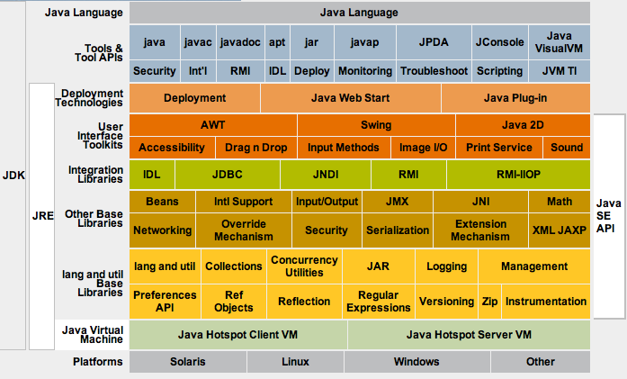
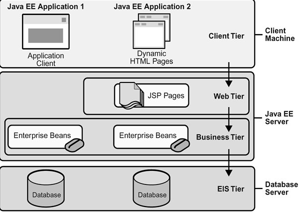
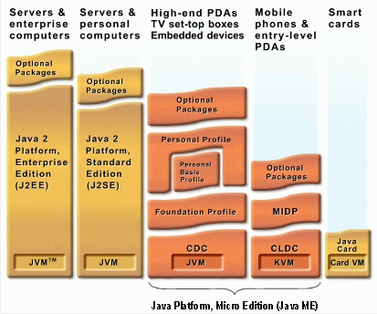

# Η ιστορία της γλώσσας προγραμματισμού Java {#Java} 
© Γιάννης Κωστάρας

---

Η γλώσσα προγραμματισμού Java ιδρύθηκε το 1991 και αρχικά ονομάστηκε _"Δρυς" (Oak)_ από μια ομάδα προγραμματιστών υπό τον [James Gosling](https://en.wikipedia.org/wiki/James_Gosling) στη [Sun Microsystems](https://en.wikipedia.org/wiki/Sun_Microsystems) με στόχο την αυτοματοποίηση των οικιακών συσκευών. Τα επόμενα δύο χρόνια ήταν απογοητευτικά για τη γλώσσα μέχρι το 1994, όταν η ομάδα ανάπτυξης επαναπροσδιορίζει τη γλώσσα με στόχο την κοινότητα του Internet. Η Oak μετονομάζεται σε _"Java"_ από το μάρκετινγκ. 

Ο [Netscape Navigator 2.0](https://en.wikipedia.org/wiki/Netscape_Navigator) υποστηρίζει τη γλώσσα το Σεπτέμβριο του 1995 με τη μορφή των μη αυτόνομων εφαρμογών [Java applets](https://en.wikipedia.org/wiki/Java_applet). Η Microsoft ενσωματώνει τη γλώσσα στον [Internet Explorer](https://en.wikipedia.org/wiki/Internet_Explorer) στο τέλος του 1995. 

Από τότε, οι δυνατότητες της γλώσσας απογειώνονται. Το 1996 η Sun αναπτύσσει το [Java Development Kit 1.0](https://en.wikipedia.org/wiki/Java_Development_Kit). Το επόμενο έτος, η έκδοση 1.1 υποστηρίζει [JavaBeans](https://en.wikipedia.org/wiki/JavaBeans). Το 1997 η Sun κατηγορεί τη Microsoft για παραβίαση της συμφωνίας όσον αφορά την Java στον Internet Explorer 4. 

Η Sun αναπτύσσει το JDK 1.2 και το [Swing](https://en.wikipedia.org/wiki/Swing_(Java)), το οποίο αποτελεί την αντικατάσταση του [AWT (Abstract Window Toolkit)](https://en.wikipedia.org/wiki/Abstract_Window_Toolkit), για την ανάπτυξη GUIs (γραφικών εφαρμογών). 
Ακολουθούν οι εκδόσεις 1.3, 1.4 και 1.5 όπου πλέον αλλάζει και η ονομασία της έκδοσης σε Java 5. Η Java 5 ήταν η πρώτη ουσιαστική αλλαγή του πυρήνα της γλώσσας απ' τη δημιουργία της, έτσι ώστε να υποστηρίζει Generics, Enumerated Types, autoboxing, varargs, annotations, static imports και νέες δυνατότητες για πολυνηματισμό (multi-threading). Η έκδοση 6 καταφέρνει να είναι 30% ταχύτερη από τις προηγούμενες εκδόσεις, ενώ η [έκδοση 7](Java7/REAMDE.md) φέρνει μικρές βελτιώσεις στη γλώσσα. Η [έκδοση 8](Java8/README.md) φέρνει σημαντικές αλλαγές στη γλώσσα παρέχοντάς της δυνατότητες συναρτησιακού (λ-) προγραμματισμού αλλάζοντας κατά πολύ τον τρόπο χρήσης της. Η πολυαναμενόμενη [έκδοση 9](Java9/README.md) έφερε δυνατότητες τμηματοποίησης (modularisation) της γλώσσας δίνοντας τη δυνατότητα να δημιουργήσετε την δική σας εφαρμογή που να περιλαμβάνει μόνο τα modules της Java που χρειάζεται η εφαρμογή σας για να τρέξει. 

**Εικόνα 1** _Η γλώσσα προγραμματισμού Java Standard Edition_

Εν τω μεταξύ, μετά το JDK 1.3 εμφανίστηκε και η [Java Enterprise Edition (JEE) 1.3](https://en.wikipedia.org/wiki/Java_Platform%2C_Enterprise_Edition) η οποία στοχεύει στην ανάπτυξη επιχειρηματικών εφαρμογών (κοινώς το Web). Περιλαμβάνει τεχνολογίες όπως [Enterprise JavaBeans (EJBs)](https://en.wikipedia.org/wiki/Enterprise_JavaBeans), servlets, Java Server Pages, Java Server Faces κ.ά. Σήμερα βρίσκεται στην έκδοση 8, με πολλές δυνατότητες και ευκολία χρήσης σε σχέση με τις προηγούμενες εκδόσεις. Παράλληλα, έχουν αναπτυχθεί πολλά frameworks για ανάπτυξη επιχειρηματικών εφαρμογών βασισμένα στη Java, όπως το [Apache Tapestry](https://en.wikipedia.org/wiki/Apache_Tapestry), το [Apache Struts](https://en.wikipedia.org/wiki/Apache_Struts_2) και το [Spring](https://en.wikipedia.org/wiki/Spring_Framework) για να αναφέρουμε τα πιο γνωστά. 

**Εικόνα 2** _Η γλώσσα προγραμματισμού Java Enterprise Edition_

Αλλά η Java έχει γίνει πολύ γνωστή και στον κλάδο των κινητών εφαρμογών με τη [Java Micro Edition (JME)](https://en.wikipedia.org/wiki/Java_Platform%2C_Micro_Edition).

**Εικόνα 3** _Η γλώσσα προγραμματισμού Java Mobile Edition_

Η Java έχει προκαλέσει περισσότερο ενθουσιασμό από οποιαδήποτε άλλη εξέλιξη στο Διαδίκτυο από την εποχή του [Mosaic](https://en.wikipedia.org/wiki/Mosaic_(web_browser)). Είναι μια γλώσσα προγραμματισμού για κατανεμημένες εφαρμογές. Έχει γίνει παγκοσμίως γνωστή ωστόσο, επειδή επιτρέπει στους χρήστες να αλληλεπιδρούν με τις ιστοσελίδες. Αντί για την απλή ανάγνωση μιας στατικής ιστοσελίδας και ίσως τη συμπλήρωση μιας φόρμας, οι χρήστες μπορούν πλέον να παίζουν παιχνίδια στο φυλλομετρητή τους, να χρησιμοποιούν λογιστικά φύλλα, να συνομιλούν σε πραγματικό χρόνο, να επεξεργάζονται πληροφορίες δυναμικά από πολλές διαφορετικές πηγές κ.ά. Ένα πολύ βασικό χαρακτηριστικό που αποτέλεσε κι έναν από τους κυριότερους λόγους διάδοσης της γλώσσας είναι ότι είναι ανεξάρτητη πλατφόρμας ('Write Once Run Everywhere'). Αυτό σημαίνει ότι γράφετε κώδικα μια φορά και αυτός τρέχει σε οποιαδήποτε πλατφόρμα που έχει εγκατεστημένο το [Java Virtual Machine](https://en.wikipedia.org/wiki/Java_virtual_machine). 

Η Java βασίστηκε στις παρακάτω αρχές:

* ξεκίνησε ως μια απλοποίηση της C/C++, αφαιρώντας όσα χαρακτηριστικά ήταν δύσκολα και πηγές λάθους, όπως π.χ. οι pointers
* ορίστηκε από την αρχή ως μια αυστηρά αντικειμενοστραφής (object-oriented) γλώσσα
* είναι ανεξάρτητη πλατφόρμας χάρις στη JVM
* ασφαλής (μέσω του Sandbox δεν σας επιτρέπει να γράψετε εφαρμογές που μπορούν να αποκτήσουν πρόσβαση στους πόρους του Η/Υ στον οποίο εκτελείται)
* και πολυ-νηματική (multi-threaded). 

Ή χρησιμοποιώντας τα λόγια της ίδιας της Sun, η Java είναι:

1. απλή, αντικειμενοστραφή, και οικεία
2. ισχυρή και ασφαλής
3. ουδέτερης αρχιτεκτονική και φορητή
4. υψηλής απόδοσης
5. διερμηνευτική, πολυνυματική, και δυναμική.

      
Με το JDK 1.2, η Java έγινε η πιο ελκυστική γλώσσα για την κατασκευή φιλικών προς το χρήστη γραφικών περιβάλλοντων με τη χρήση του Swing. Το [JavaFX](https://en.wikipedia.org/wiki/JavaFX), ο ανταγωνιστής των [Adobe AIR](https://en.wikipedia.org/wiki/Adobe_AIR) και [MS Silverlight](https://en.wikipedia.org/wiki/Microsoft_Silverlight), αποτελεί το νέο framework της γλώσσας για ανάπτυξη γραφικών εφαρμογών (αντικαθιστά το Swing).
      
Για να δούμε και μια άλλη γνώμη όμως, ο Stroustrup υποστηρίζει ότι ≪... η Java δεν είναι ανεξάρτητη πλατφόρμας. Είναι μια πλατφόρμα. Όπως και τα Windows, είναι μια ιδιόκτητη εμπορική πλατφόρμα. Δηλαδή, μπορείτε να γράψετε προγράμματα για Windows / Intel ή για Java / JVM, και σε κάθε περίπτωση γράφετε κώδικα για μια πλατφόρμα που ανήκει σε μία εταιρεία και για το εμπορικό όφελος των εν λόγω εταιριών. Έχει επισημανθεί ότι μπορείτε να γράψετε τα προγράμματα σε οποιαδήποτε γλώσσα για τη JVM και τα συναφή λειτουργικά συστήματα. Ωστόσο, η JVM, κ.λπ., είναι σε μεγάλο βαθμό μεροληπτική υπέρ της Java. Δεν είναι πουθενά κοντά σε μια γενική, λογικά, ουδέτερη γλώσσα VM/Λ.Σ. ...≫ 

Η Java έγινε πλέον ανοικτού κώδικα με το [OpenJDK](https://en.wikipedia.org/wiki/OpenJDK), η πρώτη έκδοση του οποίου κυκλοφόρησε για το Ubuntu και διανέμεται πλέον μ' αυτό.
      
Εν τω μεταξύ, η Microsoft δημιούργησε τον κύριο ανταγωνιστή της Java μέσω της πλατφόρμας της .NET, που ονομάζεται [C#](https://en.wikipedia.org/wiki/C_Sharp_(programming_language)), μια γλώσσα που απορρέει από την Java και τη C++ κι αυτός ήταν κι ένας από τους λόγους των πολλών αλλαγών που επήλθαν στη Java στην έκδοση 5. Η JVM μπορεί να θεωρηθεί ως η εξ' ορισμού πλατφόρμα για τα συστήματα Linux και στον αντίποδα το .NET για την πλατφόρμα Windows.
      
Το 2009 ο ήλιος της Sun έσβησε μετά την εξαγορά της από την Oracle, η οποία μάλιστα ισχυρίζεται, ότι η Java ήταν ο κύριος λόγος εξαγοράς της Sun καθώς το μεγαλύτερο μέρος του middleware της Oracle είναι γραμμένο σε Java. Αν και οι εξελίξεις έδειχναν αρνητικές, καθώς ο CEO της SUN παραιτήθηκε κι ακολούθησε κι η παραίτηση του πατέρα της Java του James Gosling, και μετά από πολλές περιπέτειες, η Oracle κατάφερε να βγάλει 2 επιτυχημένες εκδόσεις της Java (την 8 και την 9 με την 10 να είναι προ των πυλών). 

## Πηγές:
1. [Java History](http://www.java.com/en/javahistory/).
2. Wikipedia, [Java Programming Language](http://en.wikipedia.org/wiki/Java_%28programming_language%29).

---