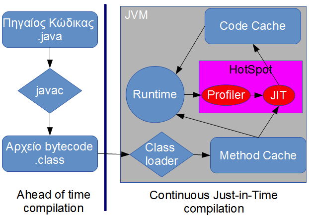
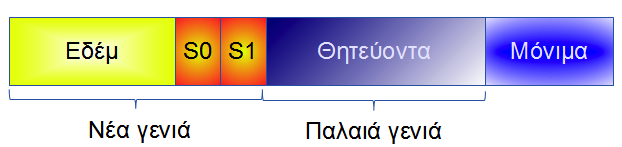
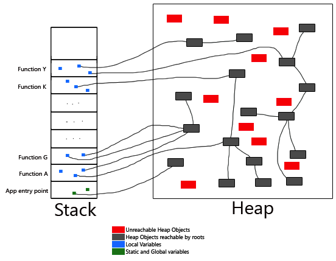
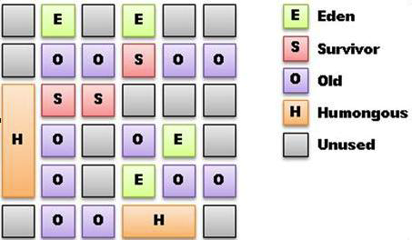

# Αποδοτική Java - Μέρος 1ο: Πώς δουλεύει η εικονική μηχανή {#Java7}
© Γιάννης Κωστάρας
---

[<-](../OS_Performance_Monitoring/README.md)| [->](../JavaPerformance2/README.md)

---

Παρά τη γενική εκτίμηση ότι η Java είναι μια αργή γλώσσα, η αλήθεια είναι ότι η Εικονική της Μηχανή - ΕΜ (Java Virtual Machine - JVM) είναι πολύ “σοφιστικέ” και τα τελευταία μάλιστα χρόνια έχει κάνει μεγάλα άλματα απόδοσης ενώ αποτελεί και μια πλατφόρμα εκτέλεσης άλλων γλωσσών προγραμματισμού.

Σ' αυτό το βιβλίο θα δούμε πώς δουλεύει η εικονική μηχανή, πώς εκτελείται ο κώδικας και πως δουλεύει ο σκουπιδιάρης (Garbage Collector), θα δούμε κάποια εργαλεία επίβλεψης της ΕΜ και θα δούμε πώς μπορούμε να ρυθμίσουμε την ΕΜ και ν’ αντιμετωπίσουμε διάφορα προβλήματα απόδοσης.

Δεν απαιτείται να είστε προγραμματιστής, αλλά μια γνώση της Εικονικής Μηχανής και γενικά της απόδοσης των πόρων του Η/Υ είναι αναγκαία. Τα εργαλεία που θα δούμε σας δίνουν μια εικόνα της χρήσης των επεξεργαστών του συστήματος, της κύριας μνήμης καθώς και των νημάτων που εκτελούνται. Σας επιτρέπουν να δείτε πόσο καλά δουλεύει ο σκουπιδιάρης (garbage collector) της ΕΜ με την εφαρμογή σας, να ανιχνεύσετε διαρροές μνήμης (memory leaks) και να βρείτε σε ποια σημεία (hot spots) η εφαρμογή σας ξοδεύει πολύ χρόνο.

Αλλά προτού μπορέσουμε να καταλάβουμε τι μας δείχνουν αυτά τα εργαλεία, θα πρέπει να κατανοήσουμε πως λειτουργεί η Εικονική Μηχανή της Java (Java Virtual Machine).

## Η Εικονική Μηχανή Java (Java Virtual Machine)
Η Εικονική Μηχανή Java είναι αυτό που λέει το όνομά της, δηλ. μια εικονική μηχανή. Αποτελείται από:

* έναν “υποδοχέα εκτέλεσης” (execution container) που είναι η μονάδα μετάφρασης και εκτέλεσης του κώδικα και
* τη μονάδα διαχείρισης μνήμης

## Υποδοχέας Εκτέλεσης (Execution Container)
Η εντολή ```javac``` μεταγλωττίζει τον πηγαίο κώδικα ```.java``` σε bytecode ```.class```. Η εικονική μηχανή εκτελείτα bytecodes ως μια διερμηνευτική (interpreted) γλώσσα! Στη συνέχεια, κατά τη διάρκεια της εκτέλεσης, βλέπει ποια τμήματα κώδικα εκτελούνται πιο συχνά (δηλ. ψάχνει για hot spots) και
αφού τα εντοπίσει, τα μεταγλωττίζει σε κώδικα μηχανής με τον μεταγλωττιστή τελευταίας στιγμής (Just-in-Time – JIT compiler) ενώσω εκτελείται η εφαρμογή! Αυτό έρχεται σε αντίθεση με γλώσσες όπως π.χ. η C ή C++ όπου η μεταγλώττιση γίνεται μια και καλή πριν την εκτέλεση της εφαρμογής, δηλ. ahead of time.

Εδώ ο αναγνώστης θα ρωτήσει ότι αφού ο κώδικας μηχανής εκτελείται πολύ πιο γρήγορα από τα bytecodes, γιατί δεν μεταγλωττίζουμε και στη Java όλες τις κλάσεις από πριν όπως και στη C/C++; Ο λόγος είναι ότι η μηχανή Hotspot, μέρος της οποίας είναι και ο JIT compiler, περιλαμβάνει κι έναν profiler ο οποίος ελέγχει ενδελεχώς τον κώδικα καθώς αυτός εκτελείται και ενδέχεται με τη πάροδο του χρόνου να βρει νέα hot spots που σημαίνει νέα μεταγλώττιση τελευταίας στιγμής κ.ο.κ. Καθώς η μεταγλώττιση σε γλώσσα μηχανής παίρνει χρόνο και δεν πρέπει να γίνεται ορατή στο χρήστη, το κέρδος από τη μεταγλώττιση σε γλώσσα μηχανής των κλάσεων που αποφασίζει ο profiler της μηχανής HotSpot θα πρέπει να υπερβαίνει και το κόστος εκτέλεσης αλλά και το κόστος της ίδιας της μεταγλώττισης. Με άλλα λόγια, η JIT μεταγλώττιση είναι μια συνεχής διαδικασία κατά την εκτέλεση της εφαρμογής που στόχο έχει να βελτιστοποιήσει
τους χρόνους εκτέλεσης της εφαρμογής.

Οι κλάσεις που μεταγλωττίζονται σε κώδικα μηχανής μεταφέρονται στη λανθάνουσα μνήμη κώδικα (Code Cache) όπως φαίνεται στο ακόλουθο διάγραμμα.



**Σχήμα 1** _Εκτέλεση κώδικα Java από την Εικονική Μηχανή_

Αν η Code Cache γεμίσει τότε σταματάει η μεταγλώττιση σε κώδικα μηχανής:
```
Java HotSpot(TM) 64-Bit Server VM warning: CodeCache is full.
Compiler has been disabled.
Java HotSpot(TM) 64-Bit Server VM warning: Try increasing the
code cache size using -XX:ReservedCodeCacheSize=
```
Φροντίστε να της δώσετε αρκετό χώρο με την παράμετρο: ```-XX:ReservedCodeCacheSize=nnm```, όπου ```nn``` είναι ο χώρος σε MB, π.χ. ```32```.

Η μηχανή HotSpot, όπως ίσως γνωρίζετε, περιλαμβάνει δυο κύριους τρόπους λειτουργίας:

* ```-client```, η οποία υποθέτει εφαρμογές επιφάνειας εργασίας (desktop) με όχι δυνατό υλισμικό (hardware), οπότε κάνει γρήγορες βελτιστοποιήσεις
* ```-server```, η οποία υποθέτει εφαρμογές διακομιστή με πολύ ισχυρό υλισμικό, οπότε και οι βελτιστοποιήσεις που κάνει είναι καλύτερες καθώς
θεωρεί ότι η εφαρμογή θα εκτελείται για περισσότερο χρόνο.

Τα παραπάνω ρυθμίζονται με τις παρακάτω παραμέτρους της εικονικής μηχανής:

* ```-Xmixed```: είναι η εξ’ ορισμού λειτουργία, δηλ. μείγμα διερμηνευμένου και μεταγλωττισμένου κώδικα
* ```-Xint```: μόνο διερμηνευμένος κώδικας (δηλ. bytecodes, όχι JIT μεταγλώττιση)
* ```-Xcompile```: προ-μεταγλώττιση (ahead of time compilation), όπως στη C/C++
* ```-XX:+TieredCompilation```¨ Συνδυασμός της client και server λειτουργίας (από την έκδοση 1.6.0_18)

## Διαχείριση μνήμης – Σκουπιδιάρης (Garbage Collector)
Όπως ίσως γνωρίζετε, η Εικονική Μηχανή (Java Virtual Machine) διαθέτει αυτόματη διαχείριση της μνήμης - σ’ αντίθεση με γλώσσες όπως οι C/C++ όπου ο προγραμματιστής είναι υπεύθυνος να “καθαρίσει” τα άχρηστα αντικείμενα - δηλ. αντικείμενα που δεν χρησιμοποιούνται πλέον από την εφαρμογή συλλέγονται από τον Σκουπιδιάρη (Garbage Collector) ο οποίος τα αναζητά στο σωρό (heap) και ελευθερώνει τη μνήμη απ’ αυτά.

Τα αντικείμενα δημιουργούνται συνήθως στο σωρό (heap) – κατάλοιπο από τη C – ενώ τα νήματα (threads) καθώς και τοπικές μεταβλητές πρωτογενών τύπων δεδομένων (π.χ. int, char κλπ.) δημιουργούνται στη στοίβα (stack). Από το JDK 1.6.0_14 και μετά, αντικείμενα μπορούν να δημιουργηθούν και στη στοίβα ή στους καταχωρητές με Escape Analysis (```-XX:+DoEscapeAnalysis```).

Ένα αντικείμενο θεωρείται ότι είναι για καταστροφή από τον GC όταν δεν υπάρχει δείκτης από κάποιο άλλο αντικείμενο που να δείχνει σ’ αυτό ή δεν
πρόκειται να χρησιμοποιηθεί μελλοντικά από την εφαρμογή. Οι περισσότεροι σκουπιδιάρηδες αχρησιμοποίητων αντικειμένων χρησιμοποιούν τη ζωσιμότητα (liveness) ενός αντικειμένου για να αποφασίσουν αν είναι για καταστροφή ή όχι. Ένα αντικείμενο θεωρείται _ζωντανό (live)_ αν υπάρχει μια διαδρομή από δείκτες μνήμης από κάποια(-ες) μεταβλητή(-ές) που να περιλαμβάνει το αντικείμενο. Διαφορετικά, το αντικείμενο θεωρείται _“νεκρό”_ και μπορεί να συλλεχθεί από τον σκουπιδιάρη. Η σχεδίαση του GC βασίζεται στην παραδοχή ότι τα περισσότερα αντικείμενα ζουν λίγο.

Έτσι, ο σωρός χωρίζεται σε δυο γενεές:

* τη νέα γενιά που περιέχει τα νέο-δημιουργημένα αντικείμενα
* την παλαιά γενιά που περιέχει αντικείμενα που ζουν περισσότερο.

Το ακόλουθο διάγραμμα παρουσιάζει τη διαχείριση μνήμης σωρού.



**Σχήμα 2** _Διαχείριση μνήμης (Memory pools)_

Τα νέα αντικείμενα αποθηκεύονται στην “Εδέμ”. Όταν γεμίσει, τότε ο σκουπιδιάρης θα πρέπει να βρει όσα αντικείμενα είναι ακόμα ζωντανά και να τα μεταφέρει είτε στο χώρο επιβίωσης (S0 ή S1) είτε στα “Θητεύοντα” (Tenured). Ο GC θα προσπαθήσει να κρατήσει τα ζωντανά αντικείμενα στη “Νέα γενιά” μεταφέροντάς τα από “Εδέμ” σε S0 ή σε S1 για έναν αριθμό από σαρώσεις (garbage collections). Ένα αντικείμενο “παλαιώνει” όταν επιβιώνει μετά από κάθε σάρωση. Μετά από έναν αριθμό σαρώσεων, που ρυθμίζεται από το όριο παλαιότητας (```-XX:MaxTenuringThreshold```), θεωρείται πλέον “παλαιό” και μεταφέρεται στα θητεύοντα. Αν γεμίσουν οι χώροι επιβίωσης, τότε πάλι τα πλεονάζοντα αντικείμενα προάγονται στον θητεύοντα χώρο. Επίσης, μεγάλα αντικείμενα (που δε χωρούν στη νέα γενιά) ανατίθενται απευθείας στον χώρο παλαιάς γενιάς.

Ποιο αναλυτικά η διαδικασία για το χώρο νέας γενιάς έχει ως εξής: Μετά από κάθε σάρωση τα αντικείμενα που επιβιώνουν μεταφέρονται σ’ έναν από τους δυο χώρους επιβίωσης π.χ. στον S0. Όταν ο S0 γεμίσει, οι επιβήτορες μεταφέρονται στον S1 και ο S0 αδειάζει τελείως και η διαδικασία επαναλαμβάνεται με τον S1 να παίζει πλέον το ρόλο του S0. Οι επιβήτορες που επιβίωσαν τόσες σαρώσεις όσες το όριο παλαιότητας, μεταφέρονται στα θητεύοντα και συνεχίζουν εκεί τη ... θητεία τους.

Με αυτόν τον τρόπο ο σκουπιδιάρης ψάχνει συχνότερα στο χώρο νέας γενιάς για νεκρά αντικείμενα. Λέμε ότι σκαλίζει (scavenge) για νεκρά αντικείμενα, χρησιμοποιεί δηλ. έναν πολύ αποδοτικό αλγόριθμο για να ψάχνει για ’νεκρά’ αντικείμενα που δεν επηρεάζει την απόδοση του προγράμματος.

Στην παλαιά γενιά (θητεύοντα) η διαδικασία είναι λίγο διαφορετική. Καθώς δεν υπάρχουν χώροι επιβίωσης, ο σκουπιδιάρης παλαιάς γενιάς ψάχνει
και πάλι για ζωντανά αντικείμενα και τα μαρκάρει (mark) ότι είναι ζωντανά και στη συνέχεια σαρώνει τα αντικείμενα που μας άφησαν χρόνους (sweep).
Με τον καιρό όμως ο χώρος παλαιάς γενιάς κατακερματίζεται (fragment) και χρειάζεται συμπίεση (compaction).

Όταν γεμίσει η παλαιά γενιά ή δεν υπάρχει χώρος λόγω κατακερματισμού, τότε χρησιμοποιείται ο full GC που σημαίνει ότι πρέπει να σταματήσει κάθε εκτέλεση του προγράμματος (περιμένει μέχρις ότου όλα τα νήματα φθάσουν σ’ ένα ’ασφαλές σημείο’ – safe point) για να μπορέσει ο σκουπιδιάρης να κάνει τη δουλειά του. Αυτό είναι πολύ κακό όταν πρόκειται για εφαρμογή πραγματικού χρόνου που έχει χρονικούς περιορισμούς απόκρισης και όχι μόνο. Γι’ αυτό το λόγο είναι ιδανικό να έχουμε πολλά νέα αντικείμενα και, ιδανικά, κανένα παλαιάς γενιάς, ώστε να αποφύγουμε τον full GC. Ο ταυτόχρονος full GC (CMS για τον οποίο θα μιλήσουμε παρακάτω) δεν περιμένει να γεμίσει ο θητεύοντας χώρος για να εκτελεστεί, αλλά και πάλι χρησιμοποιεί, όπως θα δούμε, αρκετούς πόρους του συστήματός μας για να δουλέψει.

Τι γίνεται όμως στην περίπτωση που ένα ή περισσότερα αντικείμενα από την παλαιά γενιά δείχνουν σε αντικείμενα της νέας γενιάς; Για να μην ψάχνει
ο σκουπιδιάρης σε ολόκληρη την παλαιά γενιά για δείκτες στη νέα γενιά, χρησιμοποιεί έναν “πίνακα καρτών (card table)” που έχει μέγεθος 512 bytes.
Όταν βρει ένα αντικείμενο στα θητεύοντα που να δείχνει σ’ ένα αντικείμενο της νέας γενιάς, καταχωρεί το δείκτη που δείχνει στη νέα γενιά σ’ αυτόν τον
πίνακα. Έτσι, όταν εκτελείται ο σκουπιδιάρης νέας γενιάς, ψάχνει σ’ αυτόν τον πίνακα κι όχι σ’ ολόκληρο το χώρο παλαιάς γενιάς. 

Το παρακάτω σχήμα μας δείχνει πώς ο σκουπιδιάρης βρίσκει “ζωντανά” αντικείμενα. Ξεκινάει από ριζικά αντικείμενα (root objects), όπως π.χ. νήματα,
στατικές μεταβλητές κλπ. και δημιουργεί γράφους με όλα τα αντικείμενα στα οποία δείχνουν τα ριζικά αντικείμενα. Τα αντικείμενα που “δείχνονται”
από άλλα ζωντανά αντικείμενα (δηλ. ανήκουν στο γράφο) είναι “ζωντανά” και δε συλλέγονται από το σκουπιδιάρη. Παρατηρήστε ότι οι μεταβλητές
βρίσκονται στη στοίβα κι όχι στο σωρό αλλά υπάρχουν και δείκτες που δείχνουν από το σωρό στο σωρό.



**Σχήμα 3** _Εύρεση ζωντανών αντικειμένων (root objects)_

Ένα συχνό λάθος που κάνουν πολλοί προγραμματιστές Java είναι να αναθέτουν πολύ μνήμη στην εφαρμογή τους πιστεύοντας ότι έτσι θα εκτελείται πιο γρήγορα. Αν όμως χρειαστεί να ενεργοποιηθεί ο full GC, τότε το πρόγραμμα θα σταματήσει την εκτέλεσή του για περισσότερο χρόνο μέχρις ότου ο GC σαρώσει όλη τη μνήμη. Προφανώς ο full GC θα χρειαστεί λιγότερο χρόνο όταν έχει να καθαρίσει μικρότερη μνήμη. Συστήνεται επομένως, όταν η εφαρμογή χρειάζεται π.χ. 300 MB μνήμης, να της αναθέσουμε όχι περισσότερα από 512 MB (κι όχι π.χ. 3 GB) ώστε ο full GC να τρέξει συχνότερα αλλά τουλάχιστο να του πάρει λιγότερο χρόνο για να καθαρίσει τη μνήμη. Και στη συνέχεια να βρούμε φυσικά γιατί κάποια αντικείμενα δεν καθαρίζονται και απαιτούν τον full GC. Ίσως να υπάρχουν αντικείμενα που χασομερούν (loitering objects) ή να υπάρχει κάποια διαρροή μνήμης (memory leak). Άλλες φορές η μνήμη νέας γενιάς δεν είναι αρκετά μεγάλη με αποτέλεσμα αντικείμενα που ενδέχεται μετά από λίγο να σαρώνονταν, δεν προλαβαίνουν και μεταφέρονται στα θητεύοντα (premature promotion – πρόωρη προαγωγή) που θα προκαλέσει ποιο συχνά full GC. Μεγαλώνοντας τη μνήμη νέας γενιάς ή το χώρο επιβίωσης ή το όριο παλαιότητας (tenuring
threshold) μπορούμε να λύσουμε αυτό το πρόβλημα. Αυτά είναι θέματα που μπορούμε ν’ ανιχνεύσουμε με τα εργαλεία του επόμενου άρθρου.

Οι σκουπιδιάρηδες μπορούν να τρέχουν παράλληλα με την εφαρμογή στις σύγχρονες ΕΜ ή όχι (να σταματήσουν την εφαρμογή για να καθαρίσουν). Επίσης, η δημιουργία αντικειμένων και ο καθαρισμός τους με τον καιρό κατακερματίζει (fragment) το σωρό με αποτέλεσμα ο full GC να χρειάζεται να τον αποκατακερματίσει (defragment) με τον αλγόριθμο Mark-Sweep-Compact. Πρόκειται για έναν αλγόριθμο Stop-the-World. Αν δεν έχετε αρκετή μνήμη, τότε μέρος του σωρού αποθηκεύεται στην ιδεατή μνήμη (virtual memory) δηλ. στο δίσκο σας, το οποίο θα ’χει ακόμα μεγαλύτερη επίπτωση στην απόδοση της εφαρμογής σας!

Η Διαχείριση Μνήμης είναι ένας σημαντικός παράγοντας καθυστέρησης (latency) της εφαρμογής σας και ενδέχεται να καταναλώνει σημαντικό μέρος της Κ.Μ.Ε. αν δε ρυθμιστεί σωστά. Μπορεί να ρυθμιστεί με δυο τρόπους:

* ρυθμίζοντας τις παραμέτρους της ΕΜ όπως το μέγεθος της λανθάνουσας μνήμης κώδικα (Code Cache) καθώς και το μέγεθος της διάθεσης, κατανομής και ανάκτησης της μνήμης σωρού
* ρυθμίζοντας τον κώδικα της εφαρμογής ώστε να χρησιμοποιεί λιγότερη μνήμη.

Υπάρχουν οι ακόλουθοι αλγόριθμοι για GC:

| Έκδοση Java | Νέας γενιάς | Παλαιάς γενιάς
| &lt;5  | Copying collector ```-XX:+UseSerialGC``` | Mark-Sweep-Compact collector ```-XX:+UseSerialGC```
| &gt;5  | Parallel copying collector ```-XX:+UseParNewGC``` | Concurrent Mark Sweep collector ```-XX:+UseConcMarkSweepGC```
|        | Parallel scavenge collector (&gt;10GB heap space) ```-XX:+UseParallelGC``` | Parallel Scavenge MarkSweep collector ```-XX:+UseParallelOldGC```
| &gt;7  | G1 young generation ```-XX:+UseG1GC``` | G1 mixed generation ```-XX:+UseG1GC```

**Πίνακας 1** _Σκουπιδιάρηδες παλαιάς και νέας γενιάς_

## Σκουπιδιάρηδες Νέας γενιάς
Ο _Σκουπιδιάρης Αντιγραφής (Copying Collector)_ είναι ο πιο παλαιός ιστορικά σκουπιδιάρης και ο εξ’ ορισμού στις εκδόσεις της Java πριν την 5. Ο
σκουπιδιάρης αυτός εργάζεται στο ίδιο νήμα μ’ αυτό της εφαρμογής, με αποτέλεσμα η εφαρμογή να πρέπει να σταματήσει (stop-the-world) προκειμένου ο σκουπιδιάρης να κάνει τη δουλειά του. Αν ακόμα χρησιμοποιείτε Η/Υ μ’ έναν μόνο επεξεργαστή, είναι τις περισσότερες φορές η καλύτερη λύση.

Ο _Παράλληλος Σκουπιδιάρης Αντιγραφής (parallel copying collector)_ είναι ο εξ’ ορισμού σκουπιδιάρης για τις εκδόσεις 5 και μετά, χρησιμοποιεί τόσα
νήματα όσοι και οι επεξεργαστές του Η/Υ και έχει ένα μηχανισμό που καλεί τον σκουπιδιάρη παλαιάς γενιάς όταν τελειώσει τη δουλειά του. Ενεργοποιείται με την παράμετρο ```-XX:+UseParNewGC``` αλλά δεν παύει να είναι κι αυτός ένας σκουπιδιάρης διακοπής του κυρίου προγράμματος (stop-theworld). Γράφτηκε για να δουλεύει με τον CMS της παλαιάς γενιάς.

Ο _Παράλληλος Σκουπιδιάρης Σκαλίσματος (parallel scavenge collector)_ έχει αναπτυχθεί για να δουλεύει με μεγάλους σωρούς (&gt; 10 GB). Ενεργοποιείται
με την παράμετρο ```-XX:UseParallelGC```, και είναι κι αυτός πολυνηματικός και stop-the-world. Δουλεύει με τον _Parallel Scavenge MarkSweep collector_.
Ο _Σκουπιδιάρης 1ης Γενιάς (G1 Young Generation)_ χρησιμοποιεί τον αλγόριθμο G1 και ακολουθεί τελείως διαφορετική διαχείριση της μνήμης. Χωρίζει τη μνήμη σε πολλές μικρές περιοχές οι οποίες χαρακτηρίζονται ως _Εδέμ_ ή _Επιβίωσης_.

## Σκουπιδιάρηδες Παλαιάς γενιάς
Για την παλαιά γενιά, ο _Σκουπιδιάρης Μαρκαρίσματος, Σάρωσης και Συμπύκνωσης (Mark-Sweep-Compact Collector)_ είναι μονονηματικός με αποτέλεσμα να σταματά η εκτέλεση του προγράμματος για να λειτουργήσει. Υπολογίστε μια παύση 1 sec/GB ζωντανών αντικειμένων. 

Ο _Παράλληλος Σκουπιδιάρης Σκαλίσματος Μαρκαρίσματος και Σάρωσης (parallel scavenge mark-sweep collector)_ είναι ο εξ’ ορισμού από την έκδοση 7u4 και χρησιμοποιεί πολυνηματισμό για να δουλέψει αλλά σταματά κι αυτός την εκτέλεση του προγράμματος. Ενεργοποιείται με την παράμετρο ```-XX:UseParallelOldGC```. Η διαφορά του από τον παράλληλο σκουπιδιάρη σκαλίσματος είναι ότι ενώ ο σκουπιδιάρης νέας γενιάς μεταφέρει τα ζωντανά αντικείμενα σε έναν από τους χώρους επιβίωσης, ο παλαιάς γενιάς απλά μαρκάρει τα ζωντανά αντικείμενα. Αυτό έχει σαν αποτέλεσμα να τμηματοποιείται (fragment) ο χώρος παλαιάς γενιάς και να χρειάζεται συμπίεση (compaction).

Ο _Ταυτόχρονος Σκουπιδιάρης (Concurrent Collector)_ επιτρέπει στα νήματά του να εκτελούνται ταυτόχρονα μ’ αυτά της εφαρμογής. Μοιράζει τη σάρωση σε 6 φάσεις:

1. αρχική φάση μαρκαρίσματος (stop-the-world)
2. φάση μαρκαρίσματος (ταυτόχρονη)
3. φάση προ-καθαρισμού (ταυτόχρονη)
4. φάση επανα-μαρκαρίσματος (stop-the-world)
5. φάση σάρωσης (ταυτόχρονη)
6. φάση επαναφοράς (ταυτόχρονη)

Όπως βλέπετε κάποιες φάσεις σταματούν την εκτέλεση του προγράμματος, αλλά διαρκούν πολύ λίγο. Ενεργοποιείται με την παράμετρο ```-XX:+UseConcMarkSweepGC```. Αν αποτύχει να συλλέξει τα νεκρά αντικείμενα, επειδή π.χ. αυτά δημιουργούνται γρηγορότερα απ’ όσα καταφέρνει να συλλέξει ή επειδή η μνήμη έχει κατακερματιστεί, τότε για τον επόμενο κύκλο χρησιμοποιεί τον σειριακό σκουπιδιάρη Mark-Sweep-Compact (έχει συμβεί concurrent mode failure). Για να δουλέψει θα πρέπει να υπάρχει αρκετή μνήμη σωρού ελεύθερη, που καθορίζεται με την παράμετρο ```-XX:+UseCMSInitiatingOccupancyFraction``` (εξ’ ορισμού: 68%) και καλό είναι να θέσετε και την παράμετρο ```-XX:+UseCMSInitiatingOccupancyOnly```. Χαρακτηριστικό του είναι ότι η μνήμη σωρού αυξομειώνεται!

Ο Σκουπιδιάρης _1ης Γενιάς (G1 Mixed Generation)_ χρησιμοποιεί τον αλγόριθμο G1 και χωρίζει τη μνήμη σε πολλές μικρές περιοχές όπως θα δούμε
παρακάτω.

Από τα παραπάνω, ο προσεχτικός αναγνώστης συνάγει ότι μόνο ο σκουπιδιάρης Concurrent Mark Sweep (CMS) δουλεύει ταυτόχρονα με την εφαρμογή (με μικρές μόνο παύσεις), όλοι οι άλλοι θα πρέπει να σταματήσουν την εφαρμογή για να δουλέψουν. Οι σκουπιδιάρηδες νέας και παλαιάς γενιάς δουλεύουν ανά ζευγάρια όπως φαίνεται από τις γραμμές του πίνακα 1. Π.χ. δίνοντας ```-XX:+UseParNewGC``` εννοείται ότι θα δουλέψει μαζί με τον CMS παλαιάς γενιάς (δεν χρειάζεται δηλ. να περάσετε και την παράμετρο ```-XX:+UseConcMarkSweepGC)```. Οι σκουπιδιάρηδες σκαλίσματος ```-XX:UseParallelGC``` και ```-XX:UseParallelOldGC``` μπορούν να χρησιμοποιήσουν και προσαρμοσμένο μέγεθος της μνήμης σωρού (```-XX:+UseAdaptiveSizePolicy```). Η παράμετρος
```-XX:+AggressiveHeap``` υπονοεί τους σκουπιδιάρηδες σκαλίσματος.

## Ο Σκουπιδιάρης 1ης Γενιάς (Generation 1 GC)

Η Java 7 προσθέτει ακόμα έναν σκουπιδιάρη (σε πειραματικό στάδιο ήδη από την έκδοση 6), τον G1 ο οποίος όμως ακολουθεί τελείως διαφορετική τεχνική από αυτήν που περιγράψαμε παραπάνω. Η μνήμη χωρίζεται σε 2000 περιοχές (```G1HeapRegionSize=1-32 MB```). Η νέα και η παλιά γενιά αποτελούνται η καθεμιά από ένα σύνολο από τέτοιες περιοχές. Μεγάλα αντικείμενα (humongous) αποθηκεύονται σε συνεχόμενες περιοχές (βλ. Σχήμα 4).



**Σχήμα 4** _Διαχείριση μνήμης από τον G1 GC_

Χρησιμοποιεί έναν μερικώς παράλληλο (partially concurrent) αλγόριθμο συλλογής που προσπαθεί να συμπυκνώσει (compact) το θητεύοντα χώρο με μικρές οριακές παύσεις stop-the-world για να μειώσει τις επιπτώσεις του FullGC που προκαλεί πέραν τον άλλων και κατακερματισμό (fragmentation) της μνήμης σωρού. Αυτό το καταφέρνει σαρώνοντας μερικές περιοχές μόνο κάθε φορά κι όχι ολόκληρο το χώρο νέας ή παλαιάς γενιάς.

Το κυριότερο πρόβλημα με όλους αυτούς τους αλγόριθμους συμπύκνωσης δεν είναι τόσο η αντιγραφή των αντικειμένων αλλά η ανανέωση των δεικτών που δείχνουν σ’ αυτά τα αντικείμενα τα οποία πλέον βρίσκονται σε νέες θέσεις μνήμης. Αν υπάρχουν αναφορές σ’ ένα αντικείμενο από πολλές περιοχές, τότε ενημερώνοντας αυτές τις αναφορές (δείκτες) παίρνει πολύ περισσότερο χρόνο από την αντιγραφή του αντικείμενου. Ο αλγόριθμος χρησιμοποιεί τα _Σύνολα Υπενθύμισης (RSet - Remember Set)_ για να ανιχνεύει ποια αντικείμενα μιας περιοχής αναφέρονται από αντικείμενα άλλων περιοχών. Αυτή η πληροφορία αποθηκεύεται σε κάρτες με
γέθους 512 bytes οι οποίες αποθηκεύονται στα RSets. Όσο μεγαλύτερα τα RSets τόσο περισσότερο καθυστερεί ο αλγόριθμος. Ο χρόνος που η εφαρμογή μπορεί να σταματά για σαρώσεις ορίζεται από την παράμετρο ```–XX:MaxGCPauseMillis=n``` με εξ’ ορισμού τιμή τα 200 ms. Τα ```Σύνολα Συλλογής (CSet - Collection Set)``` αποθηκεύουν ποιες περιοχές είναι προς συλλογή.

Κατά τη συλλογή της νέας γενιάς τα αντικείμενα που επιβιώνουν μεταφέρονται από τις περιοχές νέας γενιάς σε μια άλλη κενή περιοχή. Η διαδικασία
είναι παράλληλη ενώ κατά τη φάση της κένωσης σταματάει την εκτέλεση του προγράμματος (stop-the-world). Παρόμοια λειτουργεί και η συλλογή της παλαιάς γενιάς, κατά την οποία περιοχές με λίγα ζωντανά αντικείμενα εκκενώνονται και ανακτώνται άμεσα.

Υπάρχουν οι εξής φάσεις:

1. Ταυτόχρονο μαρκάρισμα (concurrent marking)
 1 .1. φάση μαρκαρίσματος, όπου εντοπίζονται τα ζωντανά αντικείμενα
 1 .2. φάση επαναμαρκαρίσματος, όπου γίνεται μια ενημέρωση από πιθανά νέα ζωντανά αντικείμενα στο εντωμεταξύ
 1 .3. φάση καθαρισμού (αποθήκευση των περιοχών που συλλέχθηκαν στα Csets)
2. Κένωση (evacuation) χώρων από νεκρά αντικείμενα προς επαναχρησιμοποίηση (με άλλα λόγια συμπίεση – compaction). Αν αποτύχει (evacuation failure), τότε χρησιμοποιείται ο full GC. 

Όταν τ’ αντικείμενα μιας περιοχής επιβιώσουν για έναν αριθμό σαρώσεων, τότε ολόκληρη η περιοχή προβιβάζεται σε περιοχή επιβίωσης, κι αν καταφέρουν να επιβιώσουν κι άλλο, σε θητεύουσα περιοχή.

## Εναλλακτικοί αλγόριθμοι σάρωσης
Αυτοί υλοποιούνται από τις ακόλουθες εικονικές μηχανές:

* [Oracle JRockit Real Time](http://www.oracle.com/technetwork/middleware/jrockit/overview/index.html), ο οποίος θα συγχωνευτεί με τον HotSpot
* [IBM Websphere Real Time](https://www-03.ibm.com/software/products/en/appserv-was),
* [Azul Zing](https://www.azul.com/products/zing/), ο οποίος είναι ο μόνος πραγματικά ταυτόχρονος (concurrent) σκουπιδιάρης τόσο κατά τη φάση της συλλογής όσο και κατά τη φάση της συμπύκνωσης προσφέροντας πραγματικά υψηλή απόδοση για όλες τις γενιές. 

## Επίλογος
Σ’ αυτό το κεφάλαιο μάθαμε πως δουλεύει η Εικονική Μηχανή Java, ο υποδοχέας εκτέλεσης και οι διάφοροι σκουπιδιάρηδες (Garbage Collector) και
πως γίνεται η διαχείριση μνήμης. Στο επόμενο κεφάλαιο θα δούμε διάφορα εργαλεία επίβλεψης της μνήμης σωρού αλλά και της απόδοσης εφαρμογών.

## Πηγές:
1. Hunt C. & Binu J. (2012), Java Performance, Addison-Wesley.
2. Evans, B. & Verburg M. (2012), The Well Grounded Java Developer, Manning.
3. Pepperdine, K. (2010), [“Performance Tuning with Cheap Drinks and Poor Tools”](https://www.youtube.com/watch?v=VGQAL9aUKfs).
4. Tene G. (2011) [“Understanding Java Garbage Collection and What You Can Do about It”](https://www.infoq.com/presentations/Understanding-Java-Garbage-Collection).
5. RR’s Random Ramblings (2012), [“Java Tuning in a Nutshell – Part 1”](http://randomlyrr.blogspot.be/2012/03/java-tuning-in-nutshell-part-1.html).
6. Thompson, M. (2013), [“Java Garbage Collection Distilled”](https://www.infoq.com/articles/Java_Garbage_Collection_Distilled), InfoQ.
7. Shirazi J. (2012), [“Garbage Collectors available in JDK 1.7.0_04”](http://www.fasterj.com/articles/oraclecollectors1.shtml).
8. Lee, S. (2012), [“Understanding Java Garbage Collection”](https://www.cubrid.org/blog/understanding-java-garbage-collection).
9. Lee, S. (2012), [“How to monitor Java Garbage Collection”](https://www.cubrid.org/blog/how-to-monitor-java-garbage-collection).
10. Lee, S. (2012), [“How to tune Java Garbage Collection”](https://www.cubrid.org/blog/textyle/428187).
11. Warburton, R. (2013), [“Garbage Collection in Java (1)”](https://www.javacodegeeks.com/2013/06/garbage-collection-in-java-1.html).
12. Warburton, R. (2013), [“Garbage Collection in Java (2)”](https://www.javacodegeeks.com/2013/06/garbage-collection-in-java-2.html).
13. Warburton, R. (2013), [“Garbage Collection in Java (3)”](https://www.javacodegeeks.com/2013/06/garbage-collection-in-java-3.html).
14. Warburton, R. (2013), [“Garbage Collection in Java (4)”](https://www.javacodegeeks.com/2013/07/garbage-collection-in-java-4.html).
15. Steingarten N. (2013), [“JVM Performance Magic Tricks”](https://www.javacodegeeks.com/2013/06/jvm-performance-magic-tricks.html).
16. [Java HotSpot VM Options](http://www.oracle.com/technetwork/java/javase/tech/vmoptions-jsp-140102.html).

---

[<-](../OS_Performance_Monitoring/README.md)| [->](../JavaPerformance2/README.md)

---