# Αποδοτική Java - Μέρος 2ο: Εργαλεία επίβλεψης {#JavaPerformance}
© Γιάννης Κωστάρας

---

[<-](../JavaPerformance1/README.md)| [->](../JavaPerformance2/README.md)

---

Στο πρώτο κεφάλαιο μιλήσαμε για το μοντέλο μνήμης της εικονικής μηχανής Java. Σ' αυτό το κεφάλαιο θα δούμε διάφορα εργαλεία που μας βοηθούν να επιβλέψουμε την απόδοση (monitoring) της Java εφαρμογής μας, δηλαδή τη συλλογή δεδομένων χωρίς επίδραση στην εφαρμογή. Στο τρίτο κεφάλαιο θα δούμε εργαλεία profiling με τα οποία μπορούμε να εντοπίσουμε πιθανά προβλήματα με στόχο να βελτιώσουμε την απόδοση της εφαρμογής μας. Τα εργαλεία κατατομής (profiling) αντιθέτως, επεμβαίνουν σημαντικά και επηρεάζουν την απόδοση της εφαρμογής.

Από το 1ο μέρος, θα πρέπει να συγκρατήσετε ότι υπάρχουν δυο χώροι μνήμης που χρησιμοποιεί η εικονική μηχανή (ΕΜ) Java:

* η _μνήμη σωρού (heap)_ στην οποία αποθηκεύονται τα αντικείμενα της εφαρμογής (και της ίδιας της ΕΜ) και χωρίζεται στην παλαιά και νέα γενιά 
* η _μνήμη στοίβας (stack)_ στην οποία αποθηκεύονται τα νήματα (threads) και οι τοπικές μεταβλητές

Αν και πολλά από τα εργαλεία που θα παρουσιαστούν καλύπτουν και τα ενδότερα της στοίβας, θα επικεντρωθούμε στο σκοπό αυτού του άρθρου που είναι η επίβλεψη του σωρού. Ο σκοπός της επίβλεψης είναι να δούμε πως εκτελεί η ΕΜ τους συλλέκτες σκουπιδιών. Π.χ. αν έγινε πρόωρη προώθηση αντικειμένων από τη νέα στην παλαιά γενιά, ή αν συνέβηκε Stop-the-world. Αυτό το πετυχαίνουν αναλύοντας τα αρχεία καταγραφής του συλλέκτη σκουπιδιών (GC logs).

Για να αναλύσουμε τα GC logs θα πρέπει να τρέξουμε την εφαρμογή μας δίνοντας τις παραμέτρους:
```
$java -verbose:gc -Xloggc:log.vgc MyApp
```
Άλλες παράμετροι που μπορεί να σας φανούν χρήσιμες: 
```
-XX:+PrintGCDetails
-XX:+PrintGCTimeStamps
-XX:+PrintGCDateStamps
-XX:+PrintGCTaskTimeStamps
-XX:+PrintTenuringDistribution
-XX:+PrintGCApplicationConcurrentTime
-XX:+PrintGCApplicationStoppedTime
-XX:+PrintHeapAtGC
-XX:+HeapDumpOnOutOfMemoryError
-XX:+PrintSafepointStatistics
-XX:PrintCMSStatistics=<n>
-XX:+PrintCMSInitiationStatistics
-XX:PrintFLSStatistics=1,2
-XX:PrintFLSCensus=1,2
```
Στο αρχείο καταγραφής ```log.vgc``` (ή όποιο άλλο όνομα του δώσατε) θα αποθηκευθούν οι πληροφορίες του σκουπιδιάρη. Η δομή μιας εγγραφής του αρχείου καταγραφής είναι η εξής:
```
Time [Type [gen1 info1] [gen2 info2] info]
```
όπου:
* ```Type```: GC ή Full GC (κι αν έχουν ενεργοποιηθεί οι λεπτομέρειες τότε περαιτέρω για το ποιος GC χρησιμοποιήθηκε όπως DefNew, ParNew, CMS, Tenured, PSYoungGen, PSOld κλπ.).
Π.χ.

  * ```“[Full GC”```
  * ```“[Full GC (System)”``` δηλώνει ότι έγινε κλήση της ```System.gc()```
  * ```“GC [PSYoungGen:”```
  * ```“[GC--”``` δηλώνει αποτυχία του CMS

Ο παραπάνω πίνακας δείχνει τι θα δείτε στα αρχεία καταγραφής περνώντας την αντίστοιχη παράμετρο στην ΕΜ.
  
**Πίνακας 1** _Παράμετρος ΕΜ και καταγραφή στο αρχείο καταγραφής_

| GC log | Παράμετρος |
| PSYoungGen | ```–XX:+UseParallelGC``` |
| ParNew  | ```-XX:+UseParNewGC``` |
| DefNew | ```–XX:+UseSerialGC``` |
| PSOldGen | ```–XX:+UseParallelOldGC``` |
| CMS | ```-XX:+UseConcMarkSweepGC``` |

Π.χ.
```
28.421: [Full GC 304895K->227178K(614848K), 0.4869834 secs]
Time	  [Type   HeapB →  HeapA(THSize), GC pause time] 
```
όπου ```HeapB``` είναι το μέγεθος του σωρού πριν (~305 Mb) και ```HeapA``` το μέγεθος μετά τη σάρωση (~227 Mb). ```THSize``` είναι το συνολικό μέγεθος του σωρού (~615 Mb) που διατίθεται στην εφαρμογή. Ο χρόνος ```time``` είναι από τότε που ξεκίνησε η ΕΜ ενώ ```pause time``` ο χρόνος που χρειάστηκε ο GC για να συλλέξει τα 305-227=78 Mb. 
Η παράμετρος ```-XX:+PrintGCDetails``` καταγράφει περισσότερες πληροφορίες. Ας δούμε ένα παράδειγμα σκουπιδιάρη σκαλίσματος (scavenge):
```
[GC
[PSYoungGen: 99952K->14688K(109312K)]
422212K->341136K(764672K), 0.0631991 secs]
[Times: user=0.83 sys=0.00, real=0.06 secs]

Μέγεθος μνήμης Eden: 109312 Kb
Μέγεθος μνήμης σωρού: 764672 Kb
Μέγεθος μνήμης θητεύοντων:  764672K - 109312K =  655360K.
```
Ένα παράδειγμα σκουπιδιάρη παλαιάς γενιάς:
```
[Full GC
[PSYoungGen: 11456K->0K(110400K)]
[PSOldGen: 651536K->58466K(655360K)]
662992K->58466K(765760K)
[PSPermGen: 10191K->10191K(22528K)], 1.1178951 secs]
[Times: user=1.01 sys=0.00, real=1.12 secs]
```
Ενώ θα πρέπει να γνωρίζετε πλέον τι σημαίνουν οι μεταβλητές ```user``` και ```sys```, η μεταβλητή ```real``` δείχνει τον πραγματικό χρόνο που πέρασε όσο εκτελείτο ο GC. Καθώς ο χρόνος αυτός είναι περίπου ίδιος με τον ```user``` σημαίνει ότι χρησιμοποιήθηκε ένα μόνο νήμα. Ο χρόνος ```real``` μπορεί να είναι μικρότερος του ```user``` που σημαίνει ότι ο GC εκτελέστηκε σε πολλά νήματα.

## Μέτρηση της εφαρμογής
Όταν μια εφαρμογή Java αργεί να αποκρίνεται, μπορεί να φταίει ένα ή περισσότερα από τα παρακάτω:

* το Λ.Σ. και γενικότερα το υλικό
* η Ε.Μ. Java (JVM)
* η ίδια η εφαρμογή

Προτού λοιπόν ξεκινήσουμε να βρούμε τα “ζεστά σημεία” (hot spots) της εφαρμογή μας, θα πρέπει πρώτα να βρούμε αν είναι αυτή ο φταίχτης ή όχι.
Στο Ubuntu μπορούμε να χρησιμοποιήσουμε ένα εργαλείο που είδαμε σε παλαιότερο τεύχος, το ```vmstat```:
```
vmstat <χρονικό διάστημα> <επαναλήψεις>
```
π.χ.
```
$ vmstat 5 10
```
διαβάζει τους μετρητές kstat κάθε 5 δευτερόλεπτα 10 φορές. Η έξοδος του εργαλείου χωρίζεται σε έξι μέρη:

* ```procs```
* ```memory```
* ```swap```
* ```io```
* ```system```
* ```cpu```

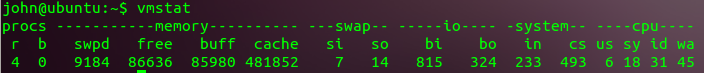

**Εικόνα 1** _vmstat_

* ```procs```:
  * ```r``` = αρ. νημάτων στην ουρά αναμονής για τη Κ.Μ.Ε. Αν ```r > 2 x αρ. επεξεργαστών``` (ή ```4x``` – υπάρχει διαφωνία στη βιβλιογραφία) τότε έχουμε συμφόρηση (bottleneck)
  * ```b``` = αριθμός μπλοκαρισμένων νημάτων
* ```memory```:
   * ```swpd ```= μέγεθος εικονικής/ιδεατής μνήμης που χρησιμοποιείται
   * ```free ```= μέγεθος ελεύθερης RAM
   * ```buff ```= μέγεθος μνήμης που χρησιμοποιείται ως buffer cache
   * ```cache``` = μέγεθος λανθάνουσας μνήμης
* ```swap```:
   * ```si``` = μέγεθος δεδομένων που διαβάζονται από την εικονική μνήμη στη RAM
   * ```so``` = μέγεθος δεδομένων που διαβάζονται από τη RAM στην εικονική μνήμη
* ```io```:
   * ```bi``` =  μέγεθος δεδομένων που διαβάζονται από το δίσκο
   * ```bo``` =  μέγεθος δεδομένων που γράφονται στο δίσκο
* ```system```:
   * ```in``` = αρ. διακοπών (interrupts)
   * ```cs``` = αρ. διακοπτών περιεχομένου (context switches)
* ```sys```:
   * ```us``` = ποσοστό χρήσης επεξεργασίας της εφαρμογής
   * ```sy``` = ποσοστό χρήσης επεξεργασίας του Λ.Σ.
   * ```id``` = ανενεργός χρόνος
   * ```wa``` = χρόνος αναμονής I/O
          
Αν ```sy > 10%``` ή ```sy = us``` για μεγάλο χρονικό διάστημα, τότε ξοδεύεται πολύς χρόνος στο Λ.Σ. άρα το Λ.Σ. είναι ο _κύριος καταναλωτής (dominant consumer)_ των πόρων του συστήματός μας. 

Αν έχουμε συμφόρηση τότε θα πρέπει να αυξήσουμε τον αρ. επεξεργαστών του συστήματός μας (ή να περιορίσουμε τον αρ. νημάτων της εφαρμογής μας). Μπορεί να χρειαστεί ν' αυξήσουμε τη RAM ή την εικονική μνήμη αν δούμε μεγάλες τιμές swap. Μεγάλες τιμές io σημαίνουν ότι περιμένουμε πολύ χρόνο για κάποιον πόρο (π.χ. δίσκο, δίκτυο, ΒΔ κλπ.). Τέλος, μεγάλες τιμές system δηλώνουν μεγάλο αρ. νημάτων που συναγωνίζονται να εκτελεστούν είτε σταματά η εκτέλεσή τους επειδή δεν μπορούν να συνεχίσουν (π.χ. περιμένοντας κάποιον πόρο ή κάποιο άλλο νήμα να τελειώσει)· σ' αυτήν την περίπτωση μειώστε τον αρ. νημάτων της εφαρμογής.

Αν μετά την πιο πάνω ανάλυση συναγάγαμε ότι ο κύριος καταναλωτής δεν είναι το Λ.Σ. ή η εικονική μηχανή, τότε θα πρέπει να δούμε τι φταίει στην εφαρμογή μας.

Τα εργαλεία επίβλεψης χωρίζονται σε δυο κατηγορίες όπως φαίνεται στον παρακάτω πίνακα:

**Πίνακας 2** _Εργαλεία επίβλεψης Εικονικής Μηχανής_

|Εργαλεία γραμμής εντολών (CUI) | Γραφικά εργαλεία (GUI) |
|[jstat](http://docs.oracle.com/javase/1.5.0/docs/tooldocs/share/jstat.html)| jconsole |
|[jmap](http://docs.oracle.com/javase/6/docs/technotes/tools/share/jmap.html) | jvisualvm & [visualvm](http://visualvm.java.net/) |
|     | [HPJMeter](https://h20392.www2.hp.com/portal/swdepot/displayProductInfo.do?productNumber=HPJMETER) |
|     | [Java Mission Control](http://download.oracle.com/technology/products/missioncontrol/updatesites/base/5.2.0/eclipse/) |
|     | [ChewieBug GCViewer](https://github.com/chewiebug/GCViewer)  |
|     | [jClarity Censum*](http://www.jclarity.com/products/censum/) |
|     | [IBM Garbage Collector and Memory Visualizer (GCMV)](http://www.ibm.com/developerworks/java/jdk/tools/gcmv/) |
|     | [GCHisto](https://java.net/projects/gchisto) |
|     | [JITWatch](https://github.com/AdoptOpenJDK/jitwatch/) |

Μερικά από αυτά τα εργαλεία θα τα αναλύσουμε παρακάτω.

## Εργαλεία γραμμής εντολών επίβλεψης και ανάλυσης GC logs (CUI)

Τα ```jstat``` και ```jmap``` έρχονται μαζί με το JDK (βρίσκονται στο φάκελο ```bin```).
```
jstat
```
Σύνταξη:
```
$ jstat -<option> [-t] [-h<lines>] <vmid> [<interval> [<count>]]
$ jstat -options
-class
-compiler
-gc
-gccapacity
-gccause
-gcnew
-gcnewcapacity
-gcold
-gcoldcapacity
-gcpermcapacity
-gcutil
-printcompilation 
```
όπου:
* ```<vmid>``` είναι η ταυτότητα της ΕΜ της εφαρμογής Java που θέλουμε να μετρήσουμε (η εφαρμογή μπορεί να τρέχει τοπικά ή απομακρυσμένα). Συνήθως, για τοπικές εφαρμογές, είναι το PID της εφαρμογής.
* ```<interval>``` κάθε πότε θα γίνεται δειγματοληψία (σε ms)
* ```<count>``` ο αριθμός δειγμάτων που θα παρθούν

**Πίνακας 3** _Παράμετροι jstat_

| Παράμετρος | Περιγραφή |
| ```gc``` | Δείχνει το τρέχον μέγεθος και χρήση κάθε περιοχής της μνήμης σωρού, το συνολικό αρ. GC που εκτελέστηκαν, και το συνολικό χρόνο που απαιτήθηκε |
| ```gccapacity``` | Δείχνει το ελάχιστο (ms) και μέγιστο (mx) μέγεθος κάθε περιοχής σωρού, το τρέχον μέγεθος και τον αρ.  GCs για κάθε περιοχή. (Δε δείχνει την τρέχουσα χρήση και το συνολικό χρόνο που ξοδεύτηκε σε GCs.) |
| ```gccause``` | Δείχνει την πληροφορία από την -gcutil + τους λόγους του προηγούμενου και του τρέχοντος GC. |
| ```gcnew``` | Δείχνει δεδομένα απόδοσης GC για τη νέα γενιά |
| ```gcnewcapacity``` | Δείχνει στατιστικά για το μέγεθος της νέας γενιάς |
| ```gcold``` | Δείχνει δεδομένα απόδοσης GC για τη παλαιά γενιά |
| ```gcoldcapacity``` | Δείχνει στατιστικά για το μέγεθος της παλαιάς γενιάς |
| ```gcpermcapacity``` | Δείχνει στατιστικά για τη μόνιμη περιοχή. |
| ```gcutil``` | Δείχνει το ποσοστό χρήσης κάθε περιοχής του σωρού, το συνολικό αρ. GCs και το συνολικό χρόνο που ξοδεύτηκε σε GCs. |

Όπως βλέπουμε, το ```jstat``` παρέχει και πολλές άλλες πληροφορίες εκτός από ανάλυση του συλλέκτη σκουπιδιών (GC) όπως πληροφορίες για το φορτωτή κλάσεων (class loader), το μεταγλωττιστή τελευταίας στιγμής (Just-in-Time compiler) κλπ. 
```
$ jps -l -m
5152 sun.tools.jps.Jps -l -m
1932 Main
```
όπου ```1932``` είναι το PID (ή VMID) της εφαρμογής που θέλουμε να μετρήσουμε:
```
$ jstat -gc 1932 1000
S0C       S1C       S0U    S1U      EC         EU          OC         OU         PC         PU         YGC     YGCT    FGC      FGCT     GCT
3008.0   3072.0    0.0     1511.1   343360.0   46383.0     699072.0   283690.2   75392.0    41064.3    2540    18.454    4      1.133    19.588
3008.0   3072.0    0.0     1511.1   343360.0   47530.9     699072.0   283690.2   75392.0    41064.3    2540    18.454    4      1.133    19.588
3008.0   3072.0    0.0     1511.1   343360.0   47793.0     699072.0   283690.2   75392.0    41064.3    2540    18.454    4      1.133    19.588
```
Η παραπάνω εντολή λαμβάνει δείγματα κάθε 1000 ms = 1 sec.
Ο παρακάτω πίνακας εξηγεί την κάθε στήλη.

**Πίνακας 4** _Επεξήγηση εξόδου jstat_

| Στήλη | Περιγραφή | Παράμετρος |
| ```S0C``` | Τρέχον μέγεθος της περιοχής S0 σε KB | ```-gc```|
| ```   ``` |                                      | ```-gccapacity```|
| ```   ``` |                                      | ```-gcnew```|
| ```   ``` |                                      | ```-gcnewcapacity```|
| ```S1C``` | Τρέχον μέγεθος της περιοχής S1 σε KB | ```-gc```|
| ```   ``` |                                      | ```-gccapacity```|
| ```   ``` |                                      | ```-gcnew```|
| ```   ``` |                                      | ```-gcnewcapacity```|
| ```S0U``` | Τρέχουσα χρήση της περιοχής S0 σε KB | ```-gc```|
| ```   ``` |                                      | ```-gcnew```|
| ```S1U``` | Τρέχουσα χρήση της περιοχής S1 σε KB | ```-gc```|
| ```   ``` |                                     | ```-gcnew```|
| ```EC``` | Τρέχον μέγεθος της περιοχής Εδέμ σε KB | ```-gc```|
| ```  ``` |                                        | ```-gccapacity```|
| ```  ``` |                                        | ```-gcnew```|
| ```  ``` |                                        | ```-gcnewcapacity```|
| ```EU``` | Τρέχουσα χρήση της περιοχής Εδέμ σε KB | ```-gc```|
| ```  ``` |                                        | ```-gcnew```|
| ```OC``` | Τρέχον μέγεθος της θητεύουσας περιοχής σε KB | ```-gc```|
| ```  ``` |                                              | ```-gccapacity```|
| ```  ``` |                                              | ```-gcold```|
| ```  ``` |                                              | ```-gcoldcapacity```|
| ```OU``` | Τρέχουσα χρήση της θητεύουσας περιοχής σε KB | ```-gc```|
| ```  ``` |                                              | ```-gcold```|
| ```PC``` | Τρέχον μέγεθος της μόνιμης περιοχής σε KB | -gc```|
| ```  ``` |                                           | -gccapacity```|
| ```  ``` |                                           | -gcold```|
| ```  ``` |                                           | -gcoldcapacity```|
| ```  ``` |                                           | -gcpermcapacity```|
| ```PU``` | Τρέχουσα χρήση της μόνιμης περιοχής  σε KB |```-gc```
| ```  ```  |                                           |```-gcold```
| ```YGC``` |Αρ. σαρώσεων GC νέας γενιάς | ```-gc```|
|     |                            | ```-gccapacity```|
|     |                            | ```-gcnew```|
|     |                            | ```-gcnewcapacity```|
|     |                            | ```-gcold```|
|     |                            | ```-gcoldcapacity```|
|     |                            | ```-gcpermcapacity```|
|     |                            | ```-gcutil```|
|     |                            | ```-gccause```|
| ```YGCT```| Συνολικός χρόνος σαρώσεων GC νέας γενιάς |```-gc``` |
| ```    |                                          |```-gcnew``` |
| ```     |                                         |```-gcutil``` |
| ```     |                                         |```-gccause``` |
| ```FGC``` | Αρ. full GC | ```-gc``` |
| |                 | ```-gccapacity``` |
| |                 | ```-gcnew``` |
| |                 | ```-gcnewcapacity``` |
| |                 | ```-gcold``` |
| |                 | ```-gcoldcapacity``` |
| |                 | ```-gcpermcapacity``` |
| |                 | ```-gcutil``` |
| |                 | ```-gccause``` |
| ```FGCT``` | Συνολικός χρόνος full GC | ```-gc``` |
|                                 | | ```-gcold``` |
|                                 | | ```-gcoldcapacity``` |
|                                 | | ```-gcpermcapacity``` |
|                                 | | ```-gcutil``` |
|                                 | | ```-gccause``` |
| ```GCT``` | Συνολικός χρόνος που ξοδεύτηκε για λειτουργίες GC| ```-gc``` |
| |                                                      | ```-gcold``` |
| |                                                      | ```-gcoldcapacity``` |
| |                                                      | ```-gcpermcapacity``` |
| |                                                      | ```-gcutil``` |
| |                                                      | ```-gccause``` |
| ```NGCMN``` | Ελάχιστο μέγεθος νέας γενιάς σε  KB | ```-gccapacity``` |
|       |                                     | ```-gcnewcapacity``` |
| ```NGCMX``` | Μέγιστο μέγεθος νέας γενιάς σε  KB  | ```-gccapacity``` |
|       |                                     | ```-gcnewcapacity``` |
| ```NGC```   | Τρέχον μέγεθος νέας γενιάς σε  KB   | ```-gccapacity``` |
|       |                                     | ```-gcnewcapacity``` |
| ```OGCMN``` | Ελάχιστο μέγεθος παλαιάς γενιάς σε  KB | ```-gccapacity``` |
|        |                                    | ```-gcoldcapacity``` |
| ```OGCMX``` | Μέγιστο μέγεθος παλαιάς γενιάς σε  KB | ```-gccapacity``` |
|      |                                       | ```-gcoldcapacity``` |
| ```OGC``` | Τρέχον μέγεθος παλαιάς γενιάς σε  KB | ```-gccapacity``` |
|     |                                     | ```-gcoldcapacity``` |
| ```PGCMN``` | Ελάχιστο μέγεθος μόνιμης γενιάς σε  KB | ```-gccapacity``` |
|     |                                          | ```-gcpermcapacity``` |
| ```PGCMX``` | Μέγιστο μέγεθος μόνιμης γενιάς σε  KB | ```-gccapacity``` |
|     |                                         | ```-gcpermcapacity``` |
| ```PGC``` | Τρέχον μέγεθος μόνιμης γενιάς σε  KB| ```-gccapacity``` |
|     |                                     | ```-gcpermcapacity```|
| ```PC```  | Τρέχον μέγεθος μόνιμης γενιάς σε  KB | ```-gccapacity```|
|    |                                      |  ```-gcpermcapacity```|
| ```PU``` | Τρέχουσα χρήση μόνιμης γενιάς σε  KB | ```-gc```|
|    |                                       | ```-gcold```|
| ```LGCC``` | Αιτία του τελευταίου GC | ```-gccause```|
| ```GCC``` | Αιτία του τρέχοντος GC | ```-gccause```|
| ```TT``` | Όριο παλαιότητας (tenuring threshold) | ```-gcnew```|
| ```MTT``` | Μέγιστο όριο παλαιότητας | ```-gcnew``` |
| ```DSS``` | Επαρκές μέγεθος του χώρου επιβίωσης σε KB | ```-gcnew```|

Ιδιαίτερη προσοχή θα πρέπει να δώσετε στις στήλες:  ```YGC, YGCT, FGC, FGCT``` και ```GCT```. Π.χ. στο πιο πάνω δείγμα, ```YGC = 2540``` και ```YGCT = 18.454```, επομένως κάθε συλλογή σκουπιδιών νέας γενιάς χρειάστηκε ```YGCT / YGC ≈ 7ms``` για να εκτελεστεί. Παρόμοια, ```FGCT / FGC ≈ 283ms```. 

### ```JMap```

Σύνταξη:
```
$ jmap -<option> <vmid> 
$ jmap -options
-heap
-histo[:live]
-permstat
-finalizerinfo
-dump:<dump-options>
-F
-J<flag>
```
Από τις παραπάνω παραμέτρους θα δείξουμε μόνο εκείνη που χρησιμοποιείται για την επίβλεψη του σωρού. Λόγω ενός προβλήματος στο Ubuntu, προτού εκτελέσετε την ```jmap```, θα πρέπει να εκτελέσετε την παρακάτω εντολή:
```
$ echo 0 | sudo tee /proc/sys/kernel/yama/ptrace_scope
[sudo] password for john:
$ jps -l -m
9953 benchmarks.jar 10792 sun.tools.jps.Jps -l -m 10777 org.openjdk.jmh.runner.ForkedMain 127.0.0.1 
$ jmap -heap 9953
Attaching to process ID 9953, please wait... 
Debugger attached successfully. 
Server compiler detected. 
JVM version is 24.65-b04 

using thread-local object allocation. 
Mark Sweep Compact GC 

Heap Configuration:
   MinHeapFreeRatio = 40
   MaxHeapFreeRatio = 70
   MaxHeapSize      = 520093696 (496.0MB)
   NewSize          = 1310720 (1.25MB)
   MaxNewSize       = 17592186044415 MB
   OldSize          = 5439488 (5.1875MB)
   NewRatio         = 2
   SurvivorRatio    = 8
   PermSize         = 21757952 (20.75MB)
   MaxPermSize      = 174063616 (166.0MB)
   G1HeapRegionSize = 0 (0.0MB) 
...
```
Η παράμετρος ```heap``` εμφανίζει μια εποπτική εικόνα της μνήμης σωρού:

* New Generation (Eden + 1 Survivor Space)
* Eden Space
* From Space
* To Space
* Tenured generation
* Perm Generation

και για καθέναν από αυτούς εμφανίζει τη χωρητικότητα (```capacity```), πόσος χώρος χρησιμοποιείται (```used```) και πόσος απομένει (```free```).

## Γραφικά εργαλεία επίβλεψης και ανάλυσης GC logs (GUI)

### HPJMeter
Θα ξεκινήσουμε με ένα από τα παλαιότερα εργαλεία στο χώρο, προσφέρεται δωρεάν από την HP. Εμφανίζει τις εξής μετρήσεις:

* Το μέγεθος του σωρού μετά από κάθε σάρωση (Garbage Collection - GC)
* Διάρκεια κάθε σάρωσης
* Ρυθμός δημιουργίας αντικειμένων
* Αριθμό bytes που ελευθερώνονται μετά από κάθε σάρωση
* Τύπος GC κ.ά.

Το HPJMeter διαβάζει τις μετρήσεις του GC από τα αρχεία καταγραφής της Εικονικής Μηχανής (ΕΜ). Τρέξτε το HPJMeter:
```
$ java -jar HPjmeter.jar
```
και ανοίξτε το αρχείο καταγραφής (π.χ. ```log.vgc```). 

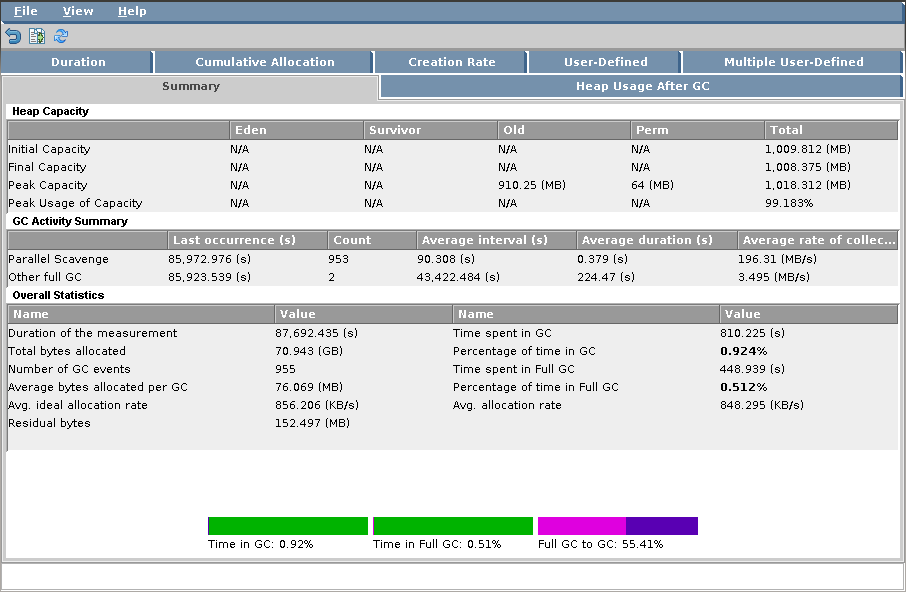

**Εικόνα 2** _HPJMeter μετά το άνοιγμα του αρχείου vgc_

Η παραπάνω εικόνα μας δίνει μια περίληψη των αποτελεσμάτων ενός αρχείου καταγραφής. Όπως βλέπετε στο κάτω μέρος, η εικονική μηχανή αφιέρωσε μόλις 0.92% για scavenge GC και 0.51% για full GC. Ο χρόνος όμως που αφιερώθηκε για full GC είναι το 55.41% του συνολικού χρόνου που αφιερώθηκε για GC. 

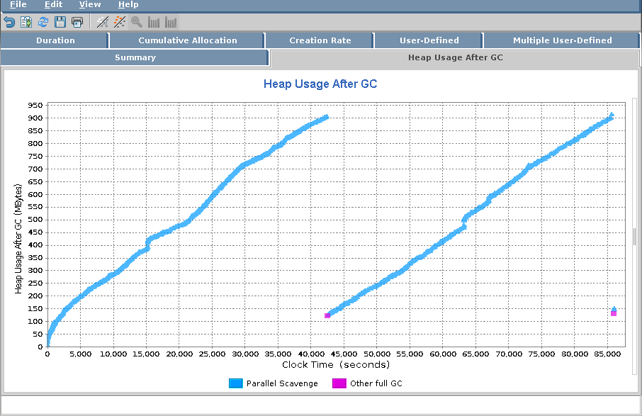

**Εικόνα 3** _HPJMeter - Χρήση σωρού μετά από κάθε σάρωση_

Η παραπάνω εικόνα  μας δείχνει ότι ο σωρός καθαρίζει μετά από κάθε full GC για να ξαναγεμίσει πάλι με αντικείμενα που δεν καθαρίζονται. Τα αντικείμενα αυτά λέγονται _ξεμένοντα (lingering)_ και προκαλούν full GC.

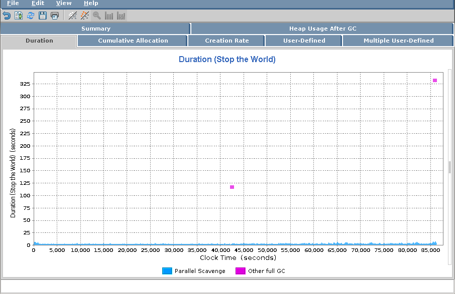

**Εικόνα 4** _HPJMeter - διάρκεια GC_

Η παραπάνω εικόνα παρουσιάζει τη διάρκεια κάθε σάρωσης. Στο κάτω μέρος του γραφήματος θα δείτε πολλές σαρώσεις του scavenge GC με μπλε χρώμα που ουσιαστικά δεν απαιτούν καθόλου χρόνο. Κάποια στιγμή όμως, κάπου στη μέση του χρονικού διαστήματος που έτρεξε η εφαρμογή, θα δείτε ένα full GC το οποίο πήρε ~120 δευτ/πτα, δηλ. ~2 λεπτά! Στο τέλος του χρονικού διαστήματος, συνέβηκε άλλο ένα full GC το οποίο αυτή τη φορά πήρε ~330 δευτ/πτα! Αυτό μας λέει ότι μάλλον έχουμε κάπου διαρροή μνήμης, καθώς η εφαρμογή δημιουργεί αντικείμενα τα οποία δε συλλέγονται με αποτέλεσμα να γεμίζει ο σωρός νέας γενιάς και να προκαλείται full GC. 

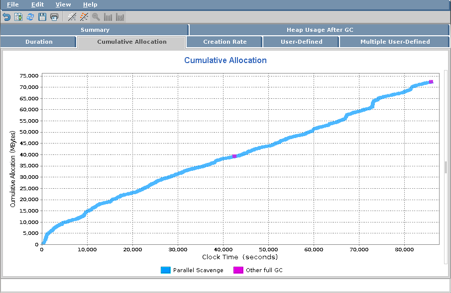

**Εικόνα 5** _HPJMeter - Συσσωρευτική Δημιουργία Αντικειμένων_

Στην πιο πάνω εικόνα βλέπουμε ότι η υπόνοια μας είναι μάλλον αληθινή. Βλέπουμε ότι υπάρχει μια συσσώρευση νέων αντικειμένων τα οποία ο scavenger αδυνατεί να μαζέψει, αλλά ούτε και ο πρώτος full GC κατάφερε να κάνει κάτι παραπάνω, καθώς η χρήση της μνήμης σωρού αυξάνεται μέχρι τον δεύτερο GC ο οποίος πάλι δεν μπόρεσε να κάνει κάτι. Η εφαρμογή μας είναι καταδικασμένη να κρασάρει.

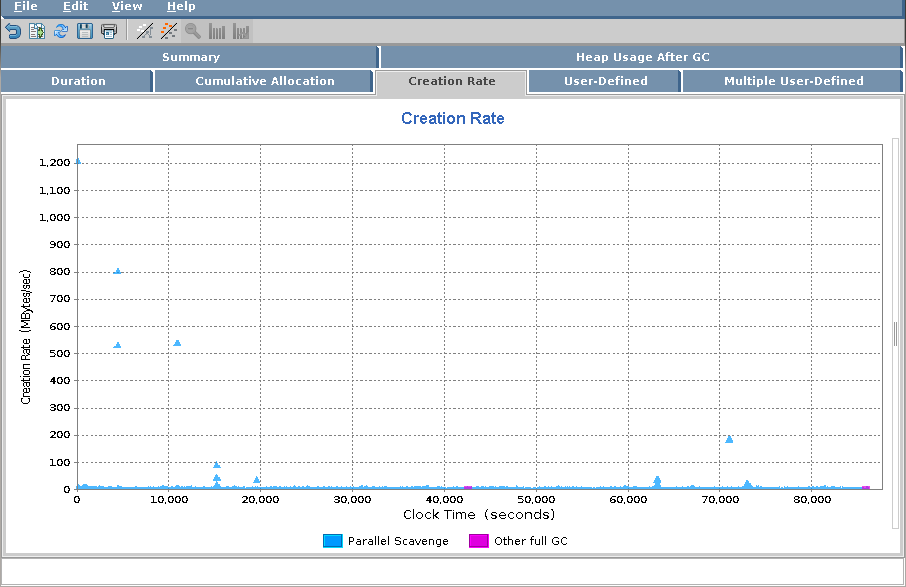

**Εικόνα 6** _HPJMeter - Ρυθμός Δημιουργίας Αντικειμένων_

Η εικόνα αυτή δεν έχει να μας προσφέρει κάτι παραπάνω. Ο ρυθμός δημιουργίας αντικειμένων πέφτει.

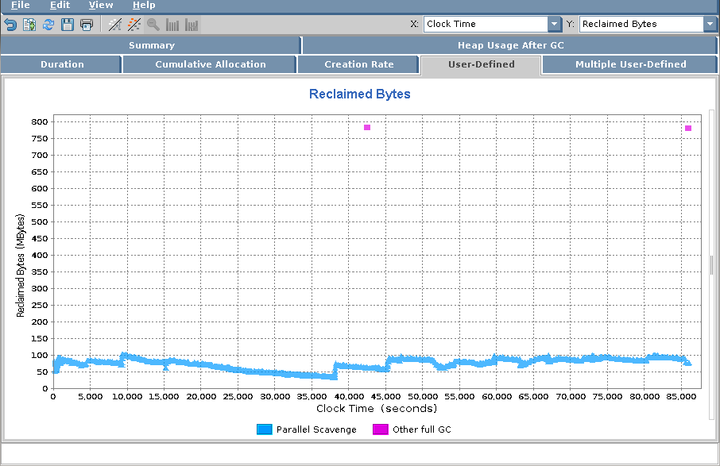

**Εικόνα 7** _HPJMeter - Bytes που ανακτήθηκαν_

Η πιο πάνω εικόνα μας δείχνει τα bytes που ανακτήθηκαν μετά από κάθε GC. Βλέπουμε, ότι ακόμα και μετά από full GC ο αριθμός τους είναι σταθερός. 

Μετά από τα παραπάνω αποτελέσματα θα πρέπει να ψάξουμε να βρούμε τη διαρροή μνήμης. Στο 3ο μέρος του άρθρου θα μιλήσουμε για τα εργαλεία που μπορούμε να χρησιμοποιήσουμε γι' αυτό το σκοπό.

Ας δούμε ακόμα ένα παράδειγμα.

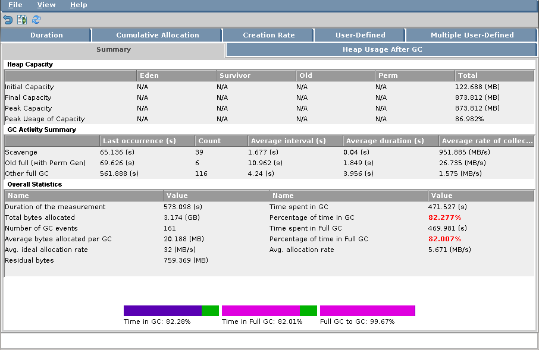

**Εικόνα 8** _HPJMeter μετά το άνοιγμα του αρχείου vgc_

Από την παραπάνω εικόνα βλέπουμε ότι η κατάσταση αυτού του διακομιστή είναι δραματική. 99,67% του χρόνου ξοδεύεται σε full GC!

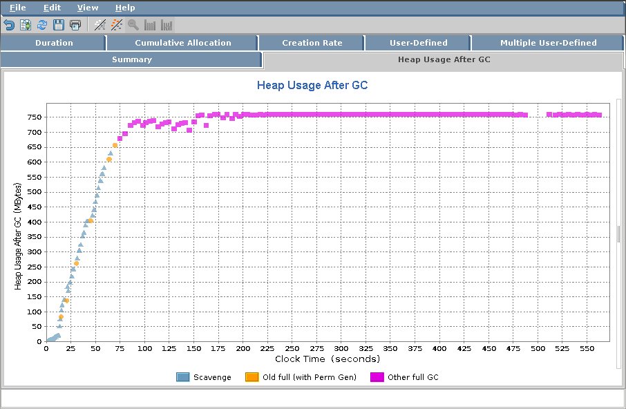

**Εικόνα 9** _HPJMeter - Χρήση σωρού μετά από κάθε σάρωση_

Η εικονική μηχανή προσπαθεί στην αρχή με τον scavenger αλλά γρήγορα η κατάσταση ξεφεύγει από τον έλεγχο και μεταλλάσσεται σε συνεχή full GCs τα οποία όμως δεν μπορούν να καθαρίσουν αντικείμενα. Βλέπετε ότι η μνήμη πλέον έχει γεμίσει από αντικείμενα που δεν μπορούν να καθαριστούν.

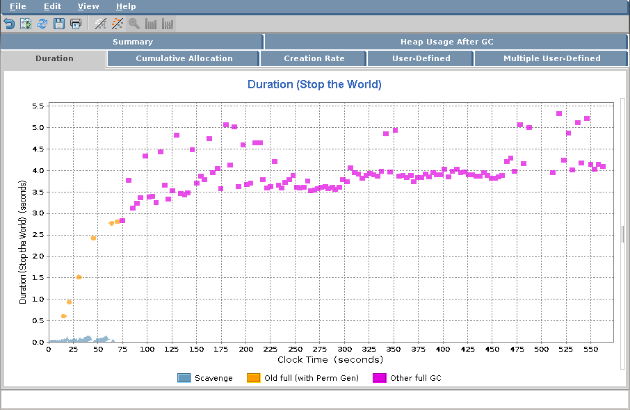

**Εικόνα 10** _HPJMeter - διάρκεια GC_

Τα συνεχή full GCs διαρκούν πολύ (4-5”). 

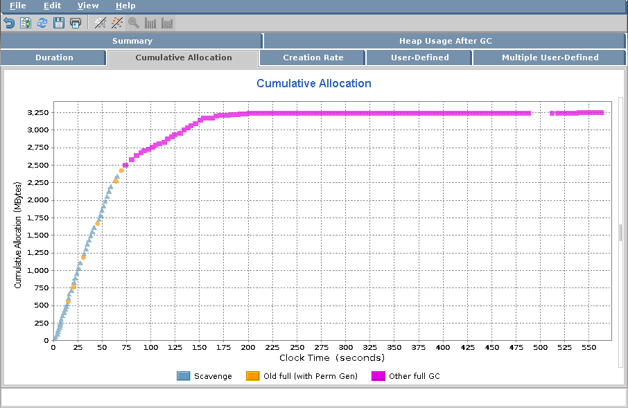

**Εικόνα 11** _HPJMeter - Συσσωρευτική Δημιουργία Αντικειμένων_

Από την εικόνα αυτή βλέπουμε πολύ απλά ότι μετά από λίγο η μνήμη έχει γεμίσει (εξαίρεση ```OutOfMemory```) και ο full GC δεν μπορεί να κάνει τίποτα.

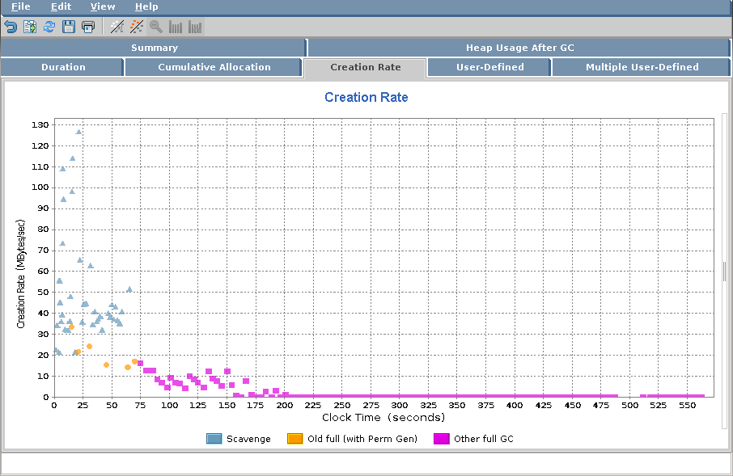

**Εικόνα 12** _HPJMeter - Ρυθμός Δημιουργίας Αντικειμένων_

Όμοια, από την εικόνα αυτή, βλέπουμε ότι, μετά από λίγο, δεν μπορούν να δημιουργηθούν άλλα αντικείμενα καθώς ο σωρός έχει γεμίσει.

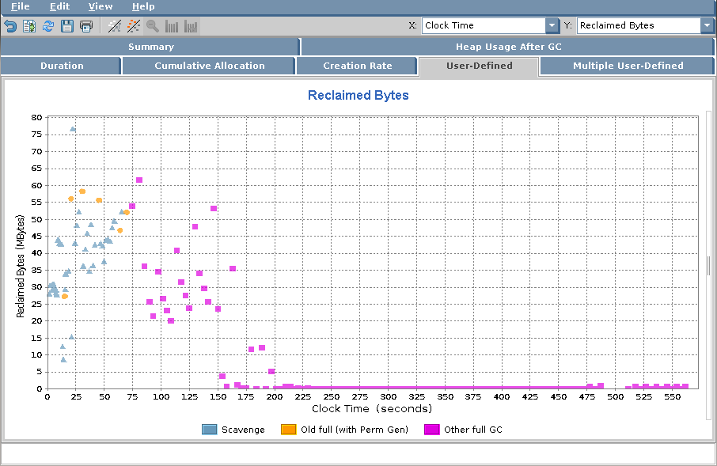

**Εικόνα 13** _HPJMeter - Bytes που ανακτήθηκαν_

Δεν μπορούν ν' ανακτηθούν πλέον άλλα bytes. 

Το εργαλείο σας δίνει επίσης τη δυνατότητα να συγκρίνετε δυο ```.vgc``` αρχεία. Αν και τα δυο παραπάνω παραδείγματα μας δείχνουν ξεκάθαρα ότι η εφαρμογή έχει πρόβλημα, μπορείτε ν' αντιμετωπίσετε άλλα προβλήματα, όπως πρόωρη μετακίνηση αντικειμένων στα θητεύοντα επειδή η μνήμη νέας γενιάς δεν είναι αρκετά μεγάλη κλπ. 

Τι μπορούμε να κάνουμε όταν αντιμετωπίζουμε καταστάσεις σαν τις παραπάνω; Προτού αρχίσετε να ψάχνετε με τον profiler, θα μπορούσατε πρώτα να δοκιμάσετε να περάσετε διαφορετικές παραμέτρους στην εικονική μηχανή, π.χ. να δείτε πως συμπεριφέρεται η εφαρμογή σας αν χρησιμοποιήσετε τον Concurrent Collector ή τον Parallel scavenge collector. Οι αλλαγές στην απόδοση μπορεί να είναι μεγάλες. Φυσικά όταν υπάρχει διαρροή μνήμης, δεν έχει νόημα να πειράξετε τις παραμέτρους της ΕΜ αλλά να διορθώσετε τη διαρροή μνήμης όπως θα δούμε στο 3ο μέρος.

### VisualVM ή JVisualVM
Πρόκειται για ένα εργαλείο “για όλες τις δουλειές”. Είναι:

* CPU performance profiler
* Memory profiler
* Ανιχνευτής διαρροής μνήμης

Έρχεται μαζί με το Oracle JDK κι όχι με το OpenJDK. Ψάξτε το στον φάκελο ```bin``` από την έκδοση 6 Update 7 της Oracle JVM και μετά. Τέλος λέγεται και NetBeans Profiler καθώς παρέχεται εξ' ορισμού με το [NetBeans](http://www.netbeans.org/). Μπορείτε να εγκαταστήσετε παλαιότερη έκδοση με την εντολή:
```
$ sudo apt-get install visualvm
...
$ jvisualvm &
```
ή να κατεβάσετε την τελευταία έκδοση από [εδώ](http://visualvm.java.net/), να την αποθηκεύσετε σε κάποιον φάκελο και να την ξεκινήσετε δίνοντας στη γραμμή εντολών:
```
$ cd visualvm
$ bin/visualvm &
```

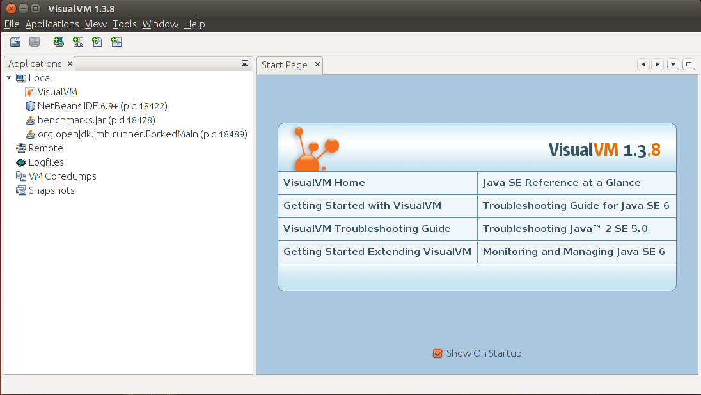

**Εικόνα 14** _VisualVM_

Θα χρειαστούμε κάποια πρόσθετα, οπότε κάντε κλικ στο μενού **Tools → Plugins → καρτέλα Available Plugins**, και εγκαταστήστε τα ακόλουθα:

* Memory Pools
* VisualVM-Extensions
* Visual GC
* VisualVM TDA Module
* Threads Inspector

και φυσικά όποια άλλα πρόσθετα θεωρείτε χρήσιμα.  Βασικά, τα πρόσθετα που μας ενδιαφέρουν για ανάλυση και επίβλεψη GC είναι το Visual GC και τα Memory Pools στα οποία και θα επικεντρωθούμε.

Αν επανεκκινήσατε το VisualVM για να ενημερωθεί με τα πρόσθετα, από την καρτέλα **Applications** κάντε δεξί κλικ στην εφαρμογή σας (κάτω από το **Local**) και **Open**. (Αν δεν έχετε κάποια εφαρμογή που να εκτελείται αλλά θέλετε να δείτε πως δουλεύει το εργαλείο, κάντε διπλό κλικ στο VisualVM για να ελέγξετε το ίδιο το εργαλείο)! Μπορείτε επίσης να επιβλέψετε μια εφαρμογή σε άλλον Η/Υ κάνοντας δεξί κλικ στο Remote και επιλέγοντας **Add Remote Host**. Θα πρέπει να τρέξετε το ```jstatd``` στον απομακρυσμένο Η/Υ (το οποίο έρχεται μαζί με το JDK κι όχι με το JRE).

Η πρώτη καρτέλα **Overview** μας δείχνει μερικές γενικές πληροφορίες για την εικονική μηχανή. Η καρτέλα **Monitor** (βλ. παρακάτω εικόνα) μας δείχνει μια εποπτεία της εφαρμογής, δηλ. της χρήση της Κ.Μ.Ε., της μνήμης σωρού, τον αριθμό των κλάσεων που έχουν φορτωθεί στη μνήμη καθώς και την κατάσταση των νημάτων. 

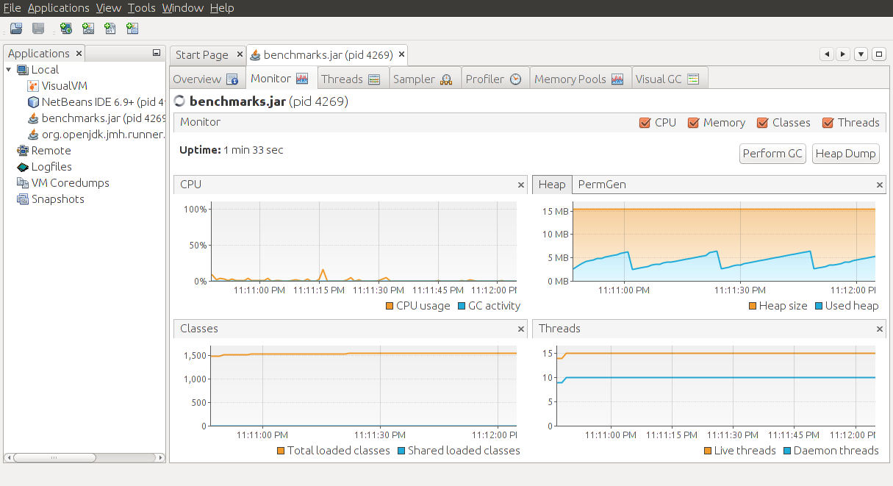

**Εικόνα 15** _VisualVM – καρτέλα Monitor_

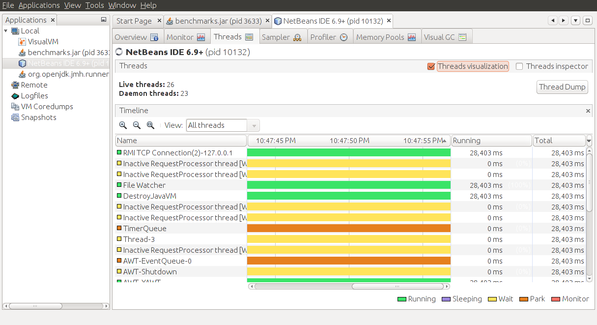

**Εικόνα 16** _VisualVM – καρτέλα Threads_

Η καρτέλα **Threads** μας δείχνει την κατάσταση των νημάτων. Ένα νήμα μπορεί να είναι σε μια από τις ακόλουθες καταστάσεις:

* **RUN**
  * Runnable: είναι έτοιμο να εκτελεστεί, αλλά δεν έχει ξεκινήσει την εκτέλεση.
  * Running: το νήμα εκτελείται από κάποιον επεξεργαστή.
* **WAIT**
  * Waiting: το νήμα είναι μπλοκαρισμένο περιμένοντας κάποια εξωτερική επεξεργασία να τελειώσει.
* **SLEEP**
  * Sleeping: το βάλανε για ύπνο.
* **BLOCK**
  * Blocked on I/O: περιμένει να ολοκληρωθεί μια λειτουργία  I/O.
  * Blocked on Synchronization: περιμένει να λάβει ένα κλείδωμα (lock).
* Dead: τελείωσε η εκτέλεσή του.

Το παράθυρο αυτό χρησιμεύει να δείτε ποια νήματα είναι μπλοκαρισμένα, τι συμβαίνει σε περίπτωση deadlock, συνωστισμού κλειδωμάτων (lock contention) κλπ. Μπορείτε επίσης να δημιουργήσετε ένα thread dump ώστε να δείτε πιο αναλυτικά την κατάσταση των νημάτων σας σε μια δεδομένη στιγμή.
Η καρτέλα [Visual GC](http://www.oracle.com/technetwork/java/visualgc-136680.html) μας δίνει μια ωραία εποπτική εικόνα του σκουπιδιάρη (βλ. εικόνα που ακολουθεί) και πώς αυτός δουλεύει καθώς εκτελείται η εφαρμογή! 

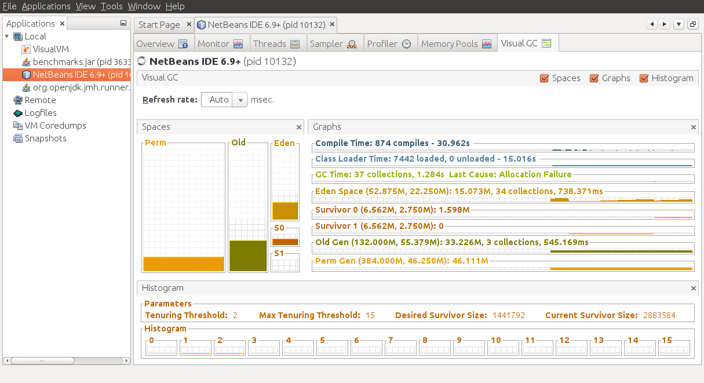

**Εικόνα 17** _VisualVM – καρτέλα Visual GC_

Στ' αριστερά βλέπετε τη _Μόνιμη γενιά (Perm)_ που χρησιμοποιεί η εικονική μηχανή για ν' αποθηκεύσει τα δικά της αντικείμενα, κλάσεις ή στατικά πεδία. (Η Μόνιμη Γενιά αντικαταστάθηκε από το metaspace στην Java 8, και δεν περιλαμβάνεται στο μέγεθος της μνήμης σωρού). Δεξιότερα είναι η Παλαιά γενιά (Old) στην οποία αποθηκεύονται τα θητεύοντα αντικείμενα. Δεξιότερα είναι η Νέα γενιά που χωρίζεται στις Eden, S0 και S1. Καθώς η εφαρμογή εκτελείται θα παρατηρήσετε την Eden να γεμίζει και στη συνέχεια να εκτελείται ο σκουπιδιάρης της νέας γενιάς που μεταφέρει όσα αντικείμενα είναι ακόμα “ζωντανά” σε κάποιον από τους χώρους επιβίωσης S0 ή S1 και μετά πάλι πίσω στον Eden κ.ο.κ. Όσα αντικείμενα επιβιώνουν μετά από κάποιον αριθμό σαρώσεων (tenuring threshold), μεταφέρονται στην παλαιά γενιά.

Το πρόσθετο [Memory Pools](https://java.net/projects/memorypoolview/) (βλ. παρακάτω εικόνα) εμφανίζει τη χρήση των διαφόρων χώρων μνήμης (Eden, Survivor, Perm, Tenured, Code Cache - χρησιμοποιείται από τον μεταγλωττιστή JIT για την αποθήκευση μεταγλωττισμένου κώδικα JIT. Χρήσιμο είναι το εργαλείο [JITWatch](https://github.com/AdoptOpenJDK/jitwatch/)) σε συνάρτηση με το χρόνο. 

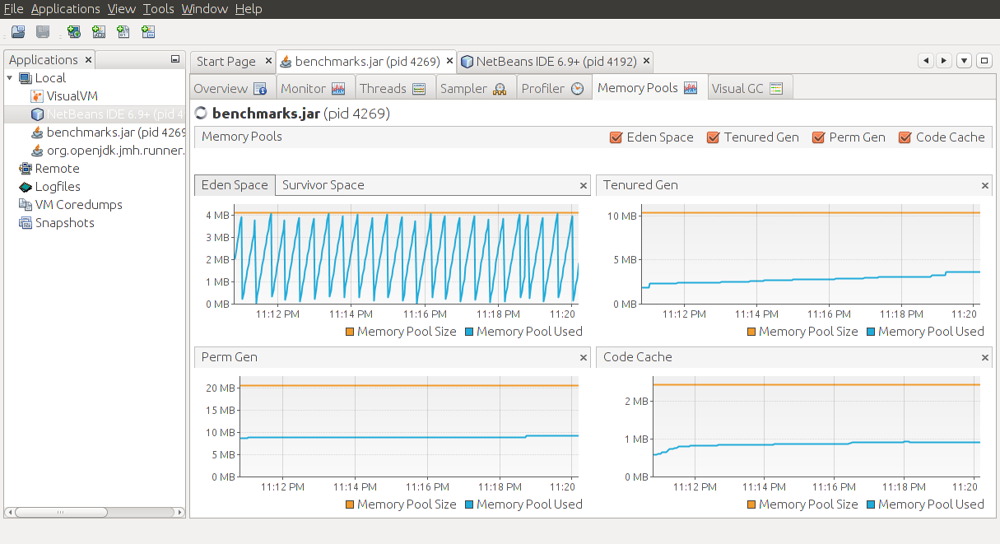

Εικόνα 18 – VisualVM – καρτέλα Memory Pools

Με το VisualVM μπορείτε να δημιουργήσετε στιγμιότυπα της εφαρμογής (application snapshots), heap dumps ακόμα και thread dumps. Αλλά γι' αυτά θα μιλήσουμε στο επόμενο κεφάλαιο. Παρατηρήστε ότι το VisualVM _δεν_ μπορεί ν' ανοίξει ```.vgc``` αρχείο, αλλά μας επιτρέπει να επιβλέπουμε την εφαρμογή μας ενώ αυτή τρέχει.

### Java Mission Control
Έρχεται μαζί με την ΕΜ Java της Oracle από την έκδοση 7 update 40 (JDK 7u40) και μετά αλλά όχι με το OpenJDK. Προέρχεται από την ΕΜ JRockit, την ΕΜ της Oracle. Όταν η Oracle εξαγόρασε τη Sun Microsystems, απέκτησε στη διάθεσή της και την ΕΜ Hotspot της Sun. Το αποτέλεσμα ήταν η Oracle να συγχωνεύσει τα καλύτερα χαρακτηριστικά της JRockit στην ΕΜ της Sun. Ένα από αυτά είναι και το Java Mission Control. Για να το εκκινήσετε (από το Oracle JDK κι όχι από το OpenJDK υποθέτοντας ότι το έχετε εγκαταστήσει π.χ. στο παρακάτω φάκελο):
```
$ /opt/java/jdk1.7.0_71/bin/jmc & 
```
Απλά επιλέξτε το VMID του προγράμματος που θέλετε να επιβλέψετε από τ' αριστερό πάνελ, δεξί κλικ και **Start JMX Console**. 

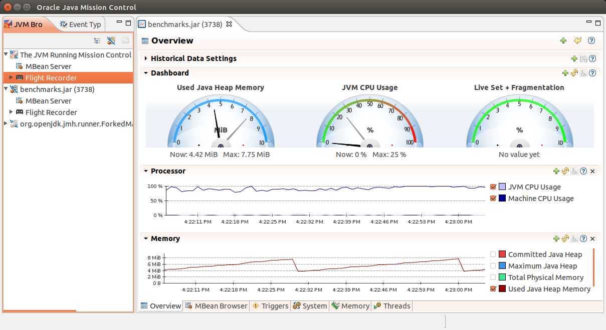

**Εικόνα 19** _Κονσόλα Java Mission Control – καρτέλα Overview_

Πέραν της καρτέλας **Overview**, ενδιαφέρον έχει για το σκοπό αυτού του άρθρου και η καρτέλα **Memory**.

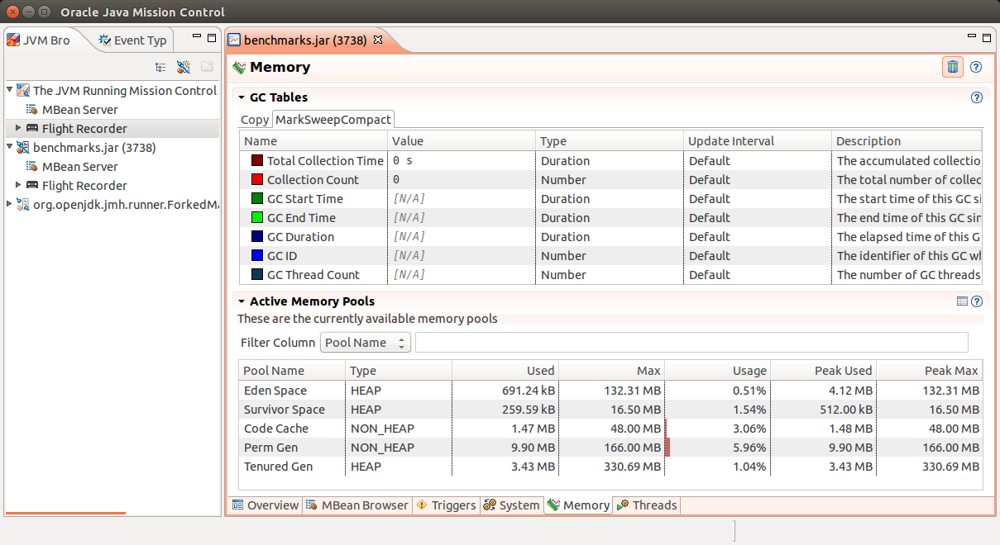

**Εικόνα 20** _Κονσόλα Java Mission Control – καρτέλα Memory_

Για να επιβλέψετε κάποιο πρόγραμμα που εκτελείται σε άλλον Η/Υ από αυτόν που εκτελείτε το JMC, θα πρέπει να εκκινήσετε την εφαρμογή σας με τις ακόλουθες παραμέτρους, να ενεργοποιήσετε δηλαδή το Java Descovery Protocol (JDP) ώστε να μπορέσει να ανιχνευθεί από το JMC (φυσικά θα πρέπει να αφήσετε τη θύρα ```7091``` ανοιχτή από τυχόν τείχος προστασίας (firewall)):
```
-Dcom.sun.management.jmxremote.port=true
-Dcom.sun.management.jmxremote.port=7091 -Dcom.sun.management.jmxremote.authenticate=false -Dcom.sun.management.jmxremote.ssl=false
-Dcom.sun.management.jmxremote.autodiscovery=true
```
(βλ. [http://hirt.se/blog/?p=388](http://hirt.se/blog/?p=388))

Οι παραπάνω 4 παράμετροι είναι οι ίδιες που απαιτούνται και από το VisualVM για να συνδεθεί με μια απομακρυσμένη εφαρμογή.
Αν η απομακρυσμένη ΕΜ δεν διαθέτει JDP, ενεργοποιήσετε τον πράκτορα jmxrmi όπως θα κάνατε για να συνδεθείτε με πελάτες JMX (όπως π.χ. το Jconsole). 
Σημειώστε, ότι η συχνότητα συλλογής δεδομένων είναι πολύ μικρή ώστε η επίδραση της επίβλεψης του JMC στην εφαρμογή να είναι αμελητέα.

### jClarity Censum
To [Censum](http://www.jclarity.com/products/censum/) είναι ένα εμπορικό εργαλείο από την jClarity που προσφέρει μερικές παραπάνω πληροφορίες από το HPJMeter. Για να το χρησιμοποιήσετε θα πρέπει να δώσετε τις ακόλουθες παραμέτρους κατά την εκτέλεση της εφαρμογής σας:
```
-Xloggc:<filename>
-XX:+PrintGCDetails
-XX:+PrintTenuringDistribution
```
Εκκινήστε το δίνοντας:
```
$ java -jar censum.jar
```
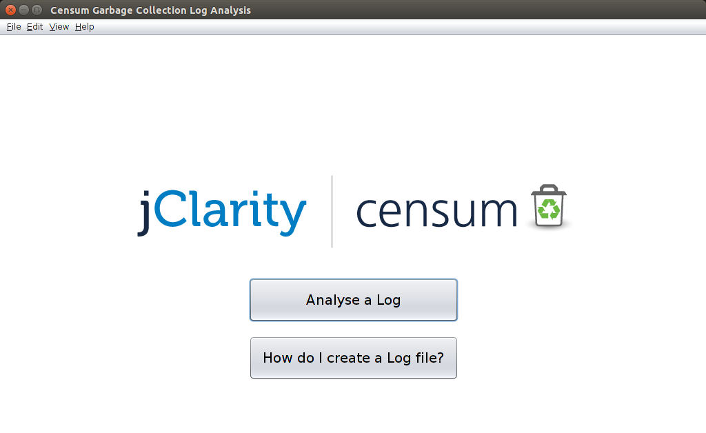

**Εικόνα 21** _jClarity Censum_

Το κουμπί **How do I create a log file** σας εξηγεί πως να δημιουργήσετε ένα αρχείο καταγραφής του συλλέκτη σκουπιδιών που θα μπορέσει να επεξεργαστεί το Censum. Αφού δημιουργήσατε το αρχείο, ανοίξτε το στο Censum με το κουμπί **Analyse a Log**.

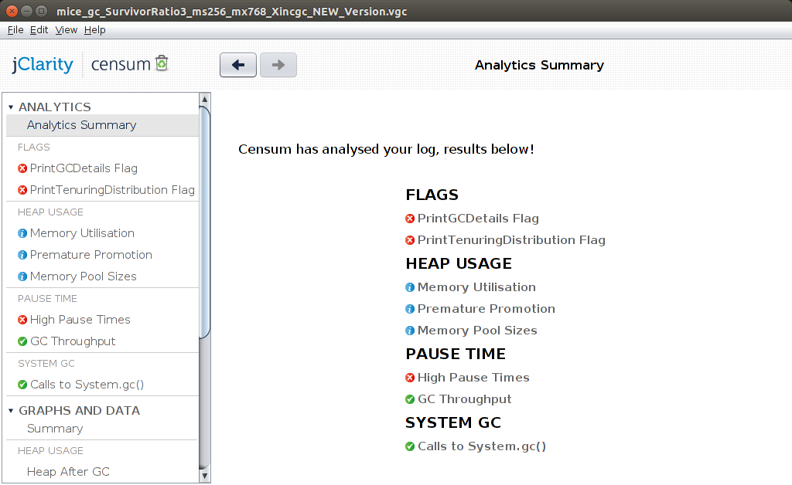

**Εικόνα 22** _jClarity Censum Analytics Summary_

Το εργαλείο εμφανίζει μια περίληψη όπου σας περιγράφει που μπορεί να υπάρχουν πιθανά προβλήματα. Π.χ. ελέγχει για πιθανές διαρροές μνήμης (Memory Utilisation), αν υπάρχει πρόωρη προαγωγή αντικειμένων στο χώρο θητεύοντων (Premature Promotion) κλπ.

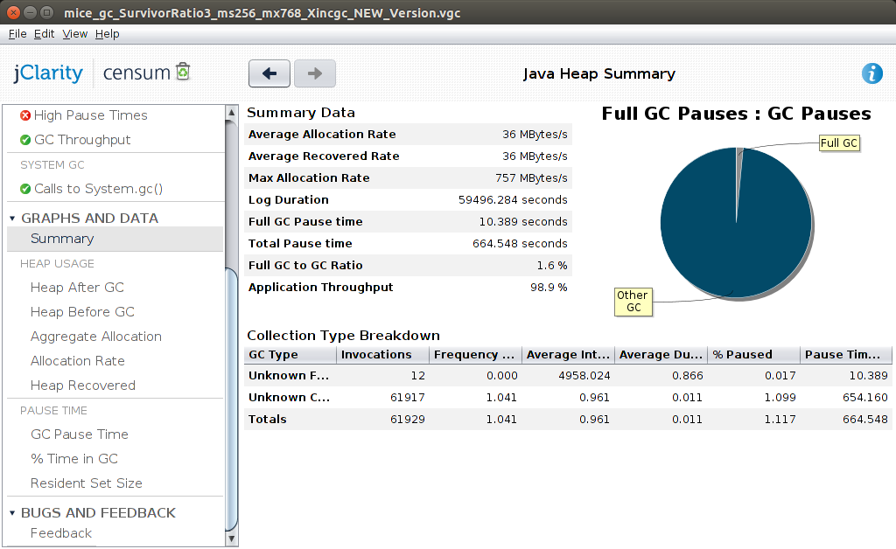

**Εικόνα 23** _jClarity Censum Analytics Summary_  

Διαθέτει διαγράμματα παρόμοια με το HPJMeter και γι' αυτό δε θα το αναλύσουμε περαιτέρω.

#### JConsole
Πρόκειται για ένα (συμβατό με JMX) εργαλείο, που περιλαμβάνεται στο JDK, το οποίο έχει τις εξής δυνατότητες:

* Επίβλεψης: μνήμης, νημάτων, φόρτωσης κλάσεων κλπ.
* Διαχείρισης: αλλαγή των παραμέτρων της γραμμής εντολών
* αλληλεπίδρασης με συγκεκριμένα MBeans της εφαρμογής

Στην Java 5 πρέπει να περάσετε την εξής παράμετρο για να ενεργοποιήσετε το JConsole:
```
-Dcom.sun.management.jmxremote
```
Από τη Java 6 και μετά είναι ενεργοποιημένη εξ' ορισμού. 
```
$ jconsole &
```
Η αρχική οθόνη ζητά να ορίσετε μια νέα σύνδεση με μια υπάρχουσα εφαρμογή της οποίας πρέπει να γνωρίζετε το PID (Process ID) αν εκτελείται τοπικά, ή το όνομα του Η/Υ και τη θύρα αν η εφαρμογή εκτελείται απομακρυσμένα. Επειδή το jconsole απαιτεί πολλούς πόρους για να εκτελεστεί, όταν θέλουμε να μετρήσουμε την απόδοση μιας εφαρμογής που τρέχει στο σύστημα παραγωγής, καλό είναι να συνδεόμαστε σ' αυτό από άλλον Η/Υ για να παράγουμε τις μετρήσεις για να μην επηρεάσουμε την απόδοση της εφαρμογής.

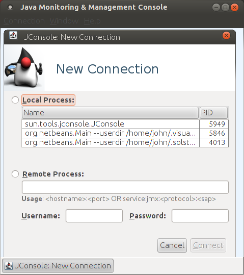

**Εικόνα 24** _Αρχική οθόνη του  JConsole_

Η αρχική οθόνη αποτελείται από έξι καρτέλες:

* Σύνοψης: εμφανίζει συνοπτικές πληροφορίες για την εικονική μηχανή και τις επιβλέπουσες τιμές.
* Μνήμης: πληροφορίες για τη χρήση μνήμη (σωρού και στοίβας).
* Διεργασιών: πληροφορίες για το αριθμό διεργασιών (νημάτων).
* Κλάσεων: πληροφορίες για τον αρ. των κλάσεων που φορτώθηκαν
* Mbeans: πληροφορίες για τα Mbeans
* VM: πληροφορίες της εικονικής μηχανής

Η πρώτη καρτέλα εμφανίζει μια σύνοψη της εφαρμογής, πιο συγκεκριμένα τη χρήση της μνήμης σωρού, τον αριθμό των νημάτων, τον αριθμό των κλάσεων που φορτώθηκαν και τη χρήση της Κ.Μ.Ε.

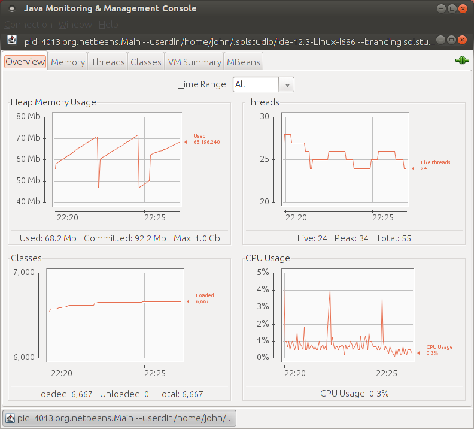

**Εικόνα 25** _JConsole: καρτέλα σύνοψης_

Στην καρτέλα μνήμης μπορείτε να επιλέξετε από την πτυσσόμενη λίστα πάνω αριστερά ποιο γράφημα θέλετε ν' απεικονίσετε: μνήμη σωρού, μνήμη στοίβας, παλαιά γενιά, Εδέμ, χώρο επιβίωσης, θητεύοντα αντικείμενα κλπ. Επιβλέποντας αυτά τα γραφήματα μπορεί ν' ανακαλύψετε μια διαρροή μνήμης. Μια σύνοψη της χρήσης μνήμης καθώς και των συλλεκτών σκουπιδιών που χρησιμοποιήθηκαν εμφανίζεται στο κάτω μέρος της καρτέλας.

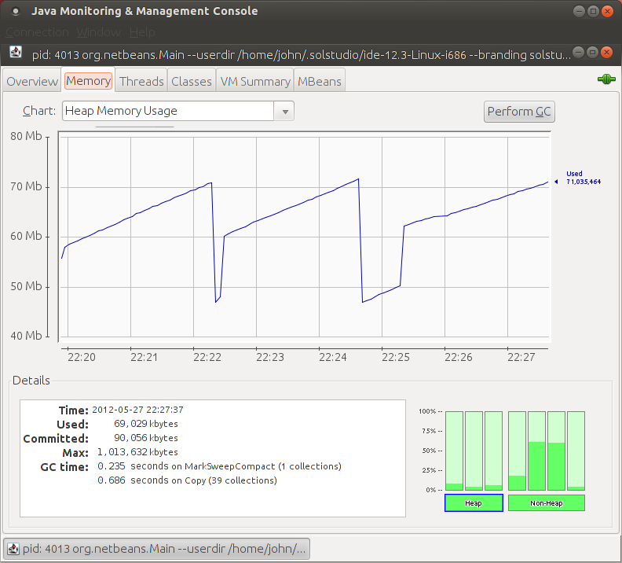

**Εικόνα 26** _JConsole: καρτέλα μνήμης_

Στην καρτέλα διεργασιών βλέπουμε τον αριθμό των διεργασιών (νημάτων) που εκτελούνται καθώς και το μέγιστο αριθμό τους. Στο κάτω μέρος της καρτέλας βλέπουμε αναλυτικά όλες τις διεργασίες, ενώ επιλέγοντας μια βλέπουμε την κατάστασή της. Μας δίνεται ακόμα η δυνατότητα ν' ανιχνεύσουμε deadlocks (που ξεφεύγει από το σκοπό τούτου του άρθρου). 

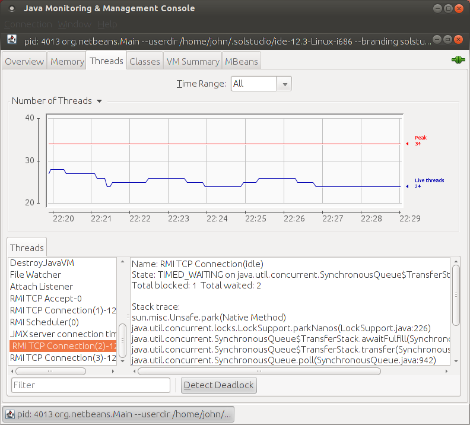

**Εικόνα 27** _JConsole: καρτέλα διεργασιών_

Η επόμενη καρτέλα απεικονίζει τον αρ. των κλάσεων που έχουν φορτωθεί.

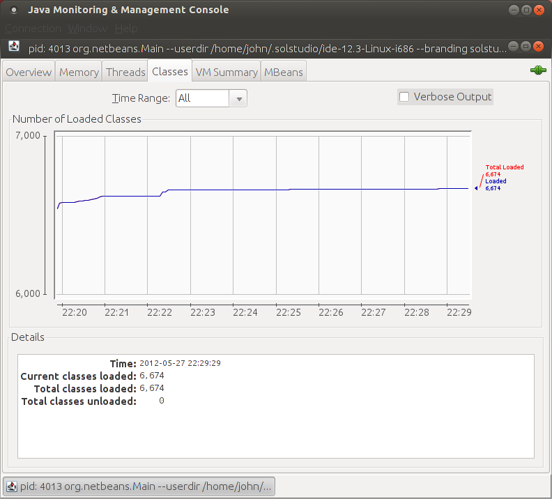

**Εικόνα 28** _JConsole: καρτέλα κλάσεων_
 
Η επόμενη καρτέλα απεικονίζει πληροφορίες της εικονικής μηχανής. Το **Total compile time** εμφανίζει το χρόνο που ξοδεύτηκε για μεταγλώττιση just-in-time (JIT). Η υλοποίηση της JVM καθορίζει πότε θα συμβεί μεταγλώττιση JIT. Η Hotspot VM χρησιμοποιεί προσαρμοστική μεταγλώττιση, κατά την οποία η εικονική μηχανή φορτώνει την εφαρμογή χρησιμοποιώντας έναν απλό διερμηνευτή, αλλά στη συνέχεια αναλύει τον κώδικα καθώς αυτός εκτελείται για ν' ανιχνεύσει προβλήματα απόδοσης ή "hot spots".

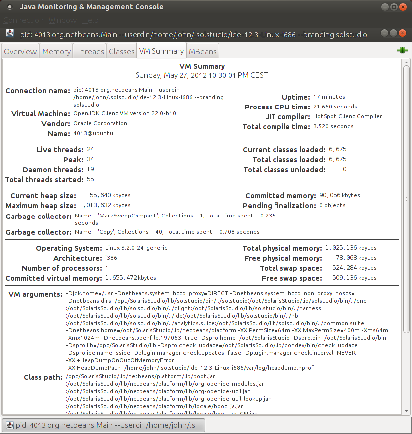

**Εικόνα 29** _JConsole: καρτέλα JVM_

Η τελευταία καρτέλα εμφανίζει ένα δέντρο με τα διάφορα MBeans που παρέχονται από τον διακομιστή MBeans της πλατφόρμας. Επιλέγοντας ένα MBean από το δέντρο εμφανίζονται οι ιδιότητές του, ενώ όσες τιμές εμφανίζονται με μπλε μπορείτε να τις αλλάξετε.

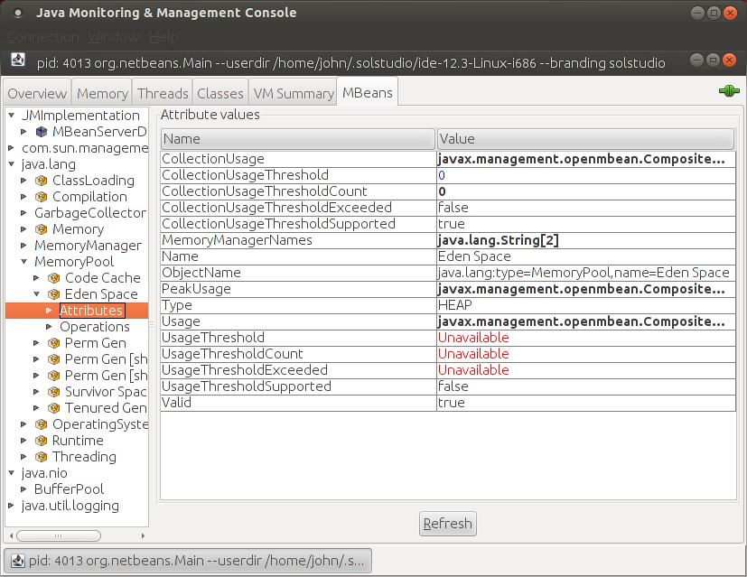

**Εικόνα 30** _JConsole: καρτέλα MBeans_

### JITWatch
Το εργαλείο αυτό είναι διαφορετικό από τα προηγούμενα. Χρησιμοποιείται για την επίβλεψη της λανθάνουσας μνήμης κώδικα (Code Cache). Αν θυμάστε από το 1ο μέρος του βιβλίου, η ΕΜ Hotspot αποθηκεύει τις μεταβλητές του προγράμματός σας στη στοίβα (stack) – δεν υπάρχουν καταχωρητές. Για να βελτιώσει την απόδοση του προγράμματος, χρησιμοποιεί το μεταγλωττιστή Just-In-Time (JIT) που ψάχνει για hot spots καθώς εκτελείται το πρόγραμμά σας και τα μεταγλωττίζει σε γλώσσα μηχανής (αποθηκεύοντάς τα στην Code Cache). 
Η ΕΜ Hotspot διαθέτει τους εξής μεταγλωττιστές JIT:

* Client (C1)
  * συλλέγει πληροφορίες σε σύντομο χρόνο προτού ξεκινήσει την μεταγλώττιση· συνήθως χρήσιμος για εφαρμογές desktop 
* Server (C2)
  * συλλέγει πληροφορίες για περισσότερο χρόνο και είναι συνήθως χρήσιμος για εφαρμογές διακομιστών
  * inlining4 (δηλ. μέγεθος bytecode μεθόδου ≤ 35 bytes)
  * dead code elimination
  * escape analysis
  * branch prediction
* Tiered (C1+C2)
  * συνδυάζει τα πλεονεκτήματα των δυο παραπάνω
  * εξ' ορισμού στην Java 8, στην έκδοση 7 ενεργοποιείται με την παράμετρο ```-XX:+TieredCompilation```

Για να δείτε ποιες μέθοδοι μεταγλωττίστηκαν, χρειάζεται να περάσετε την παράμετρο ```-XX:+PrintCompilation``` κατά την εκτέλεση της εφαρμογής σας. Η έξοδος εμφανίζεται στην οθόνη σας και δεν υπάρχει τρόπος ανακατεύθυνσης π.χ. σε κάποιο αρχείο:
```
240  31      java.lang.String::getChars (62 bytes)
1042 454 s   java.io.BufferedOutputStream::flush (12 bytes)
1044 455   n java.io.FileInputStream::available (native)   
402  262  !  java.lang.ClassLoader::loadClass (122 bytes)
```
Η 1η είναι ο χρόνος σε ms από τότε που ξεκίνησε η ΕΜ, 2η στήλη είναι ένα μοναδικό ID της μεθόδου και ακολουθούν διάφορες ενδείξεις (flags) όπως π.χ. ```s``` (synchronized), ```!``` (διαθέτει διαχειριστές εξαιρέσεων – exception handlers), ```n``` (native) κλπ. [36, 37]. Η τελευταία στήλη εμφανίζει το όνομα της μεθόδου, χωρίς τις παραμέτρους και την επιστρεφόμενη τιμή, καθώς και από πόσα bytes αποτελείται η μέθοδος μεταγλωττισμένη. 
Μπορείτε όμως να ενεργοποιήσετε και πλήρης καταγραφή της μεταγλώττισης JIT με τις ακόλουθες παραμέτρους:
```
-XX:+UnlockDiagnosticVMOptions 
-XX:+LogCompilation 
-XX:+TraceClassLoading
-XX:+PrintAssembly   (προαιρετικά)
-XX:LogFile=logfile.log
```
Αν δεν χρησιμοποιήσετε την τελευταία παράμετρο, το αποτέλεσμα είναι ένα μεγάλο αρχείο XML με όνομα ```hotspot_pid<PID>.log``` το οποίο περιέχει λεπτομέρειες για τις αποφάσεις που έλαβε ο μεταγλωττιστής JIT. Το εργαλείο JITWatch σας βοηθάει να αναλύσετε αυτό το αρχείο. Κατεβάστε τον πηγαίο κώδικα και χτίστε το δίνοντας την εντολή maven:
```
$ mvn package
```
Για να το εκκινήσετε:
```
$ cd jitwatch-master
$ ./launchUI.sh &
```
Πατήστε το κουμπί **Open Log** για ν' ανοίξετε ένα αρχείο καταγραφής. Άμα δε δημιουργήσατε κάποιο ακολουθώντας τις πιο πάνω οδηγίες, μπορείτε να δημιουργήσετε ένα δοκιμαστικό δίνοντας την εντολή: 
```
$ ./makeDemoLogFile.sh
```
Αφού ανοίξετε το αρχείο καταγραφής, πατήστε το κουμπί ```Config``` και προσθέστε τον πηγαίο και τον μεταγλωττισμένο κώδικα όπως φαίνεται στην ακόλουθη εικόνα:

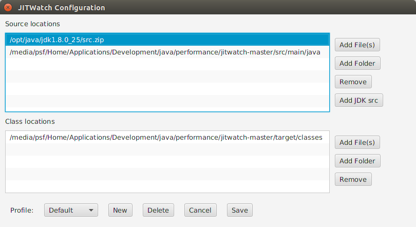

**Εικόνα 31** _JITWatch παράθυρο Config_

Στη συνέχεια πατήστε το κουμπί **Start**.

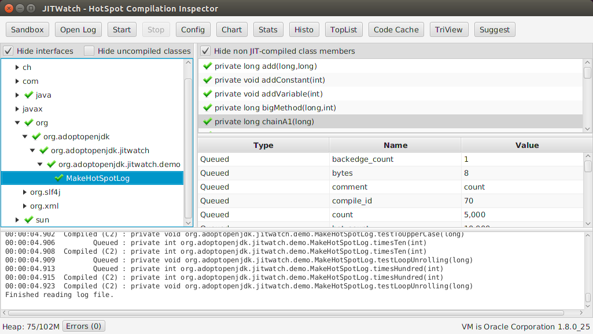

**Εικόνα 32** _JITWatch μετά το άνοιγμα αρχείου καταγραφής και πατώντας Start_

Μπορείτε να κάνετε δεξί κλικ πάνω σε μια μέθοδο και να επιλέξετε από το μενού **Show compile chain**:

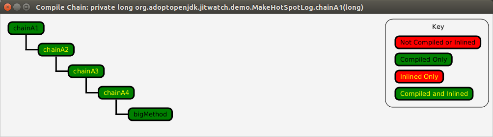

**Εικόνα 33** _JITWatch Show compile chain_

Πατώντας το κουμπί **Chart**:

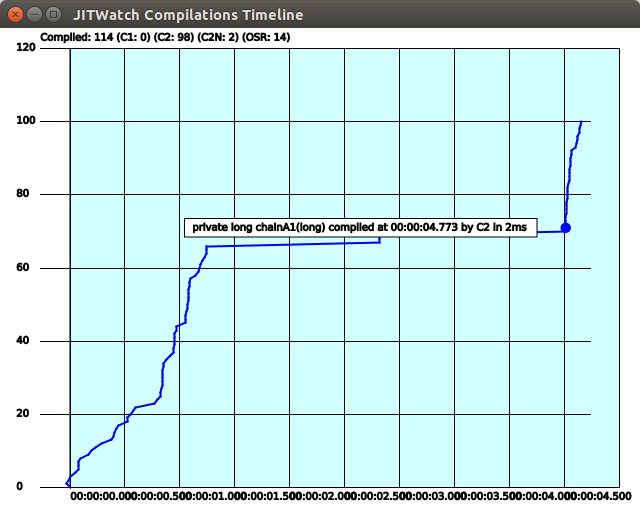

**Εικόνα 34** _JITWatch Compilations timeline_

Κουμπί **Stats**:

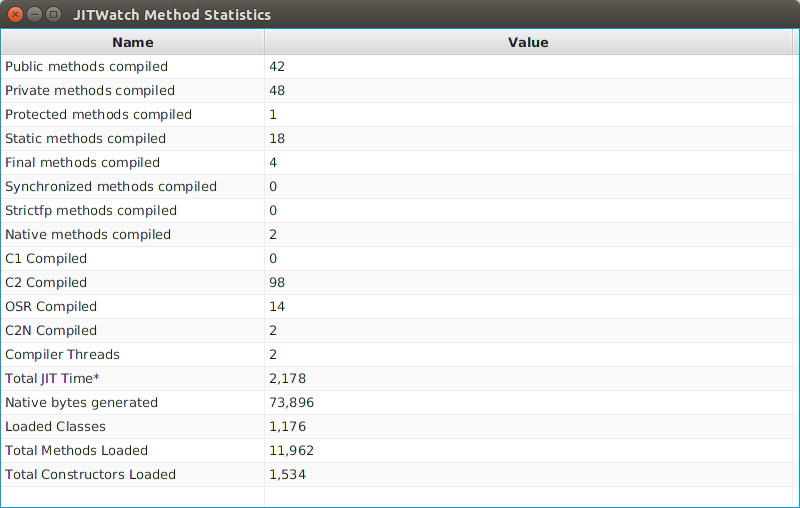

**Εικόνα 35** _JITWatch Method statistics_

Κουμπί **Code Cache**:

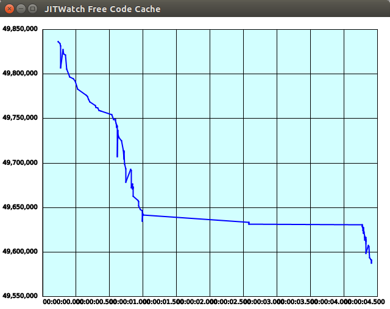

**Εικόνα 36** _JITWatch Free Code Cache_

Κουμπί **TriView**:

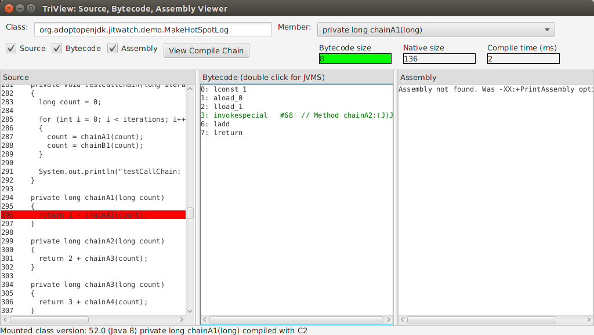

**Εικόνα 37** _JITWatch TriView_

Το παράθυρο αυτό δείχνει Java source code, bytecode, και disassembled machine code. Για να δείτε κώδικα assembly θα πρέπει να εγκαταστήσετε τη βιβλιοθήκη [HSDIS](https://kenai.com/projects/base-hsdis/downloads) στο φάκελο του JDK που περιέχει τη βιβλιοθήκη ```libjvm.so```. Επιλέγοντας διάφορες μεθόδους το παράθυρο μας δείχνει την αντίστοιχη γραμμή bytecode και κώδικα assembly.

Τέλος, το κουμπί **Suggest** μας εμφανίζει ένα παράθυρο που μας επεξηγεί το λόγο που επέλεξε ο μεταγλωττιστής JIT για τη συγκεκριμένη μέθοδο. 

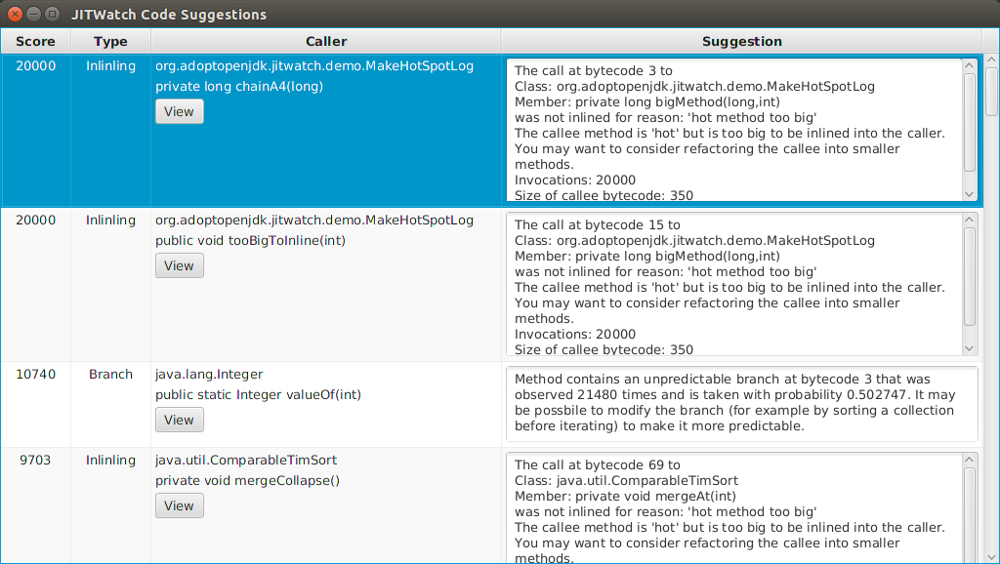

**Εικόνα 38** _JITWatch Suggest_

Πατώντας το κουμπί **Sandbox** μπορείτε να δοκιμάσετε διάφορες μεθόδους πως μεταγλωττίζονται σε bytecode και γλώσσα assembly.
Όπως ίσως καταλαβαίνετε, το JITWatch αποτελεί ένα πρώτης τάξης εργαλείο για να γράψετε πλήρως βελτιστοποιημένο κώδικα.

## Επίλογος
Σ' αυτό το κεφάλαιο είδαμε διάφορα εργαλεία που μπορείτε να χρησιμοποιήσετε για να επιβλέψετε την απόδοση μιας εφαρμογής Java. Τα εργαλεία αυτά σας επιτρέπουν να επιβλέπετε την μνήμη σωρού της εφαρμογής, είτε όσο η εφαρμογή τρέχει, είτε μέσω των αρχείων καταγραφής. Σας επιτρέπουν επίσης να ανιχνεύσετε διαρροές μνήμης, αν υπάρχει πρόωρη προαγωγή αντικειμένων στο χώρο θητεύοντων (Premature Promotion) και άλλα προβλήματα που σας βοηθούν να συντονίσετε την ΕΜ σας για μέγιστη απόδοση. Σας επιτρέπουν επίσης να επιβλέψετε τα νήματα που εκτελεί η εφαρμογή σας καθώς και την κατάσταση της Code Cache.

Δεν περιγράψαμε όλα τα εργαλεία του Πίνακα 2 λόγω έλλειψης χώρου αλλά τα πιο σημαντικά και πιο ενδιαφέροντα. Μπορείτε όμως να τα κατεβάσετε (κι ορισμένες φορές να τα χτίσετε από τον πηγαίο κώδικα) και να τα δοκιμάσετε. Κάποια από αυτά μπορεί να ικανοποιούν καλύτερα τις ανάγκες σας ή να τα καταλαβαίνετε καλύτερα.

Στο 3ο μέρος θα δούμε διάφορα εργαλεία κατατομής (profiling). Πολλά από τα εργαλεία που είδαμε σε αυτό το κεφάλαιο διαθέτουν και δυνατότητες profiling. Θα δούμε λοιπόν πως μπορούμε να τα χρησιμοποιήσουμε για να βρούμε σε ποιο σημείο του κώδικά μας υπάρχει π.χ. διαρροή μνήμης, ή συνωστισμός κλειδωμάτων κλπ. ώστε να μπορέσουμε να τα διορθώσουμε. 

## Πηγές:
1. Hunt C. & Binu J. (2012), _Java Performance_, Addison-Wesley.
2. Evans, B. & Verburg M. (2012), _The Well Grounded Java Developer_, Manning.
3. Pepperdine, K. (2010), [“Performance Tuning with Cheap Drinks and Poor Tools”](https://www.youtube.com/watch?v=VGQAL9aUKfs).
4. Tene G. (2011) [“Understanding Java Garbage Collection and What You Can Do about It”](https://www.infoq.com/presentations/Understanding-Java-Garbage-Collection).
5. RR’s Random Ramblings (2012), [“Java Tuning in a Nutshell – Part 1”](http://randomlyrr.blogspot.be/2012/03/java-tuning-in-nutshell-part-1.html).
6. Thompson, M. (2013), [“Java Garbage Collection Distilled”](https://www.infoq.com/articles/Java_Garbage_Collection_Distilled), InfoQ.
7. Shirazi J. (2012), [“Garbage Collectors available in JDK 1.7.0_04”](http://www.fasterj.com/articles/oraclecollectors1.shtml).
8. Lee, S. (2012), [“Understanding Java Garbage Collection”](https://www.cubrid.org/blog/understanding-java-garbage-collection).
9. Lee, S. (2012), [“How to monitor Java Garbage Collection”](https://www.cubrid.org/blog/how-to-monitor-java-garbage-collection).
10. Lee, S. (2012), [“How to tune Java Garbage Collection”](https://www.cubrid.org/blog/textyle/428187).
11. Warburton, R. (2013), [“Garbage Collection in Java (1)”](https://www.javacodegeeks.com/2013/06/garbage-collection-in-java-1.html).
12. Warburton, R. (2013), [“Garbage Collection in Java (2)”](https://www.javacodegeeks.com/2013/06/garbage-collection-in-java-2.html).
13. Warburton, R. (2013), [“Garbage Collection in Java (3)”](https://www.javacodegeeks.com/2013/06/garbage-collection-in-java-3.html).
14. Warburton, R. (2013), [“Garbage Collection in Java (4)”](https://www.javacodegeeks.com/2013/07/garbage-collection-in-java-4.html).
15. Steingarten N. (2013), [“JVM Performance Magic Tricks”](https://www.javacodegeeks.com/2013/06/jvm-performance-magic-tricks.html).
16. [Java HotSpot VM Options](http://www.oracle.com/technetwork/java/javase/tech/vmoptions-jsp-140102.html).

---

[<-](../JavaPerformance1/README.md)| [->](../JavaPerformance2/README.md)

---