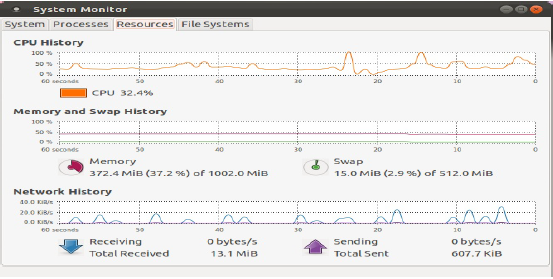
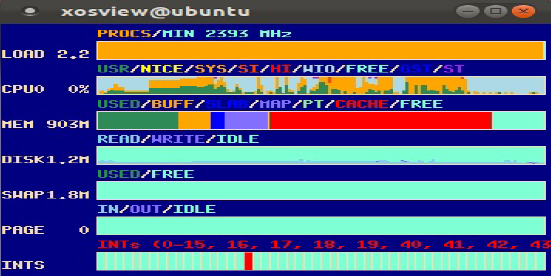
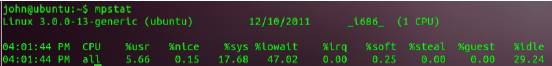
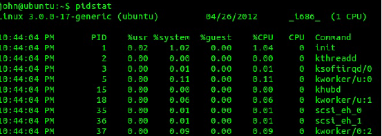
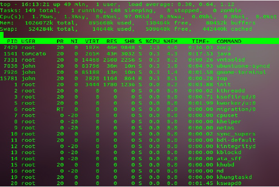
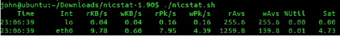
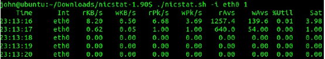
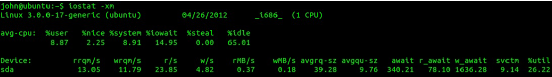
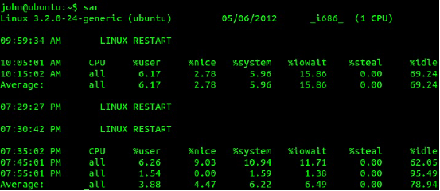

# Εργαλεία Παρακολούθησης Απόδοσης Εφαρμογών
© Γιάννης Κωστάρας

---

Για ν' αποδώσει μια εφαρμογή τα μέγιστα δεν αρκεί μόνο να χρησιμοποιεί πλήρως τους κύκλους μηχανής του επεξεργαστή αλλά να τους εκμεταλλεύεται κατά τέτοιο τρόπο που να μην τους σπαταλά π.χ. περιμένοντας δεδομένα από κάποια συσκευή εισόδου/εξόδου. Θα 'χετε παρατηρήσει κάποια εφαρμογή να 'κολλάει' χρησιμοποιώντας το 100% του επεξεργαστή σας χωρίς ν' αποκρίνεται, είτε γιατί περιμένει δεδομένα από κάποια μονάδα εισόδου/εξόδου είτε γιατί έπεσε σε ατέρμονα βρόχο στον κώδικά της.
Η χρήση του επεξεργαστή ενός Η/Υ διακρίνεται σε δυο κατηγορίες: σε _χρήση επεξεργασίας χρήστη/κώδικα εφαρμογής_ και _σε χρήση επεξεργασίας πυρήνα ή συστήματος_.  Η πρώτη αναφέρεται στο ποσοστό χρόνου που η εφαρμογή ξοδεύει για να εκτελέσει τον κώδικά της. Η δεύτερη αναφέρεται στο ποσοστό χρόνου που η εφαρμογή ξοδεύει εκτελώντας κώδικα του λειτουργικού συστήματος για χάρη της. Όταν μια εφαρμογή ξοδεύει πολύ από το χρόνο εκτέλεσής της σε επεξεργασία πυρήνα/συστήματος, είναι μια ένδειξη σπατάλης χρόνου επεξεργασίας σε συσκευές Ι/Ο ή ανταγωνισμού (δηλ. αναμονή) ενός διαμοιραζόμενου πόρου. Η ιδανική κατάσταση θα ήταν 0% σε επεξεργασία πυρήνα/συστήματος και όσο το δυνατό μεγαλύτερο ποσοστό επεξεργασίας του κώδικα της εφαρμογής.  

Στο Ubuntu η παρακολούθηση της απόδοσης του συστήματος γίνεται με διάφορα εργαλεία που διακρίνονται σε δυο κατηγορίες: _γραφικά_ και _γραμμής εντολών_.

## Γραφικά εργαλεία Παρακολούθησης Χρήσης Κ.Μ.Ε. 
Το πιο διαδεδομένο είναι το ```gnome-system-monitor``` (βλ. Εικόνα 1):
```
$ gnome-system-monitor
```



**Εικόνα 1** _gnome-system-monitor_

Η χρήση του επεξεργαστή φαίνεται στο ανώτερο τμήμα του παραθύρου στην καρτέλα **Resources**. Το σύστημά μου διαθέτει έναν μόνο επεξεργαστή, αλλά αν το δικό σας διαθέτει περισσότερους, τότε θα δείτε το φόρτο τους στο κάτω μέρος του γραφήματος. Δυστυχώς, το system monitor δεν διαχωρίζει μεταξύ χρήσης επεξεργασίας κώδικα και επεξεργασίας πυρήνα/συστήματος.
Ένα άλλο εργαλείο είναι το ```xosview``` (βλ. Εικόνα 2):
```
$ sudo apt-get install xosview
$ xosview
```


**Εικόνα 2** _xosview_
 
Αν και όχι ιδιαίτερα ευανάγνωστο, η δεύτερη γραμμή που εμφανίζει τη χρήση του επεξεργαστή διαχωρίζει ανάμεσα σε επεξεργασία χρήστη (USR) και επεξεργασία πυρήνα/συστήματος (SYS).

## Μη Γραφικά Εργαλεία Παρακολούθησης Χρήσης Κ.Μ.Ε.
Πέραν των ανωτέρω γραφικών εργαλείων, υπάρχουν και εργαλεία γραμμής εντολών, όπως:
```
$ vmstat 60
```
Η εντολή αυτή εμφανίζει τη συνδυαστική χρήση όλων των εικονικών επεξεργαστών του συστήματος. Αν δε δοθεί κάποιο χρονικό διάστημα (delay) σε δευτερόλεπτα, τότε η εντολή εμφανίζει το ιστορικό από την εκκίνηση του συστήματος. Οι στήλες ενδιαφέροντος φαίνονται με έντονη γραφή (βλ. Εικόνα 3).



**Εικόνα 3** _vmstat_

Η στήλη ```"us"``` εμφανίζει το ποσοστό χρήσης επεξεργασίας της εφαρμογής. Η στήλη ```"sy"``` εμφανίζει το ποσοστό χρήσης επεξεργασίας που ξοδεύεται από το σύστημα. Η στήλη ```"id"``` εμφανίζει το ποσοστό που ο επεξεργαστής παραμένει ανενεργός. ```"us"+"sy"+"id" = 100%```.
Οι παραπάνω πληροφορίες εμφανίζονται και σε μια πιο πινακοειδή μορφή (βλ. Εικόνα 4) με την εντολή :
```
$ sudo apt-get install sysstat
$ mpstat
```
Βλ. στήλες ```"%usr"```, ```"%sys"``` και ```"%idle"``` αντίστοιχα.


**Εικόνα 4** _mpstat_

Άλλο ένα χρήσιμο εργαλείο είναι η εντολή:
```
$ pidstat
```
που εμφανίζει πληροφορίες για κάθε διεργασία που εκτελείται (βλ. Εικόνα 5).



**Εικόνα 5** _pidstat_

Τέλος, μια ακόμα χρήσιμη εντολή είναι η
```
$ top
```
η οποία εμφανίζει χρήσιμα στατιστικά στοιχεία καθώς και χρήση της μνήμης. Αποτελείται από δυο μέρη. Το άνω μέρος εμφανίζει στατιστικά στοιχεία για το σύστημα ενώ το κάτω μέρος εμφανίζει στατιστικά για κάθε διεργασία που εκτελείται απ' το σύστημα ταξινομημένες ως προς ποσοστό χρήσης της κεντρικής μονάδας επεξεργασίας.



**Εικόνα 6** _top_

## Εργαλεία Παρακολούθησης της Ουράς Εκτέλεσης του Κατανεμητή της Κ.Μ.Ε. 
Ένας άλλος τρόπος παρακολούθησης του κατά πόσο το σύστημα έχει κορεστεί είναι η παρακολούθηση της ουράς εκτέλεσης του _κατανεμητή (scheduler)_ του επεξεργαστή. Στην ουρά αυτή αποθηκεύονται διεργασίες που είναι προς εκτέλεση από τον επεξεργαστή. Αν η ουρά αυτή περιέχει πολλές διεργασίες, αυτό είναι μια ένδειξη ότι το σύστημα τείνει προς κορεσμό. Το σύστημα αρχίζει να βρίσκεται σε κορεσμό όταν το βάθος της ουράς αυτής γίνει περίπου 4 φορές ο αριθμός των εικονικών επεξεργαστών του συστήματος. 
Το βάθος της ουράς εκτέλεσης είναι η πρώτη στήλη με την ετικέτα ```r``` της εντολής ```vmstat``` (βλ. Εικόνα 3). Αν το βάθος της ουράς εκτέλεσης σ' αυτό το σύστημα των 2 επεξεργαστών ξεπεράσει το 8 τότε το σύστημα υφίσταται κορεσμό και θα πρέπει να παρθούν μέτρα αντιμετώπισής του.

## Εργαλεία παρακολούθησης κύριας μνήμης
Πέραν της φυσικής κύριας μνήμης, ένα σύστημα διαθέτει επίσης _ιδεατή μνήμη (virtual memory)_ ή _μνήμη σάρωσης (swap memory)_. Πρόκειται για το partition ```/swap``` που διατίθεται αποκλειστικά ως επέκταση της κύριας μνήμης. Όταν η κύρια μνήμη γεμίσει, τότε χρησιμοποιείται η ιδεατή μνήμη η οποία φυσικά είναι πιο αργή από την κύρια μνήμη. Το Λ.Σ. μεταφέρει μια ή περισσότερες εφαρμογές, που δεν χρησιμοποιούνται συχνά, στην ιδεατή μνήμη για να ελευθερώσει χώρο κύριας μνήμης για να εκτελέσει μια άλλη εφαρμογή. Για να εκτελεστεί μια εφαρμογή που βρίσκεται στην ιδεατή μνήμη, θα πρέπει να ξαναφορτωθεί στην κύρια μνήμη, πράγμα που έχει επίπτωση στην απόδοση της εφαρμογής. Οι στήλες ```free, si``` και ```so``` του εργαλείου ```vmstat``` (βλ. Εικόνα 3) δείχνουν την ελεύθερη μνήμη (σε KB) και τον αριθμό των φορτώσεων από και προς την ιδεατή μνήμη. Όταν ο αριθμός αυτός είναι ```0```, τότε δε χρησιμοποιείται η ιδεατή μνήμη. Στο σύστημα της εικόνας 3 παρατηρούμε ότι χρησιμοποιείται η ιδεατή μνήμη. 
Για το σκοπό αυτό μπορεί να χρησιμοποιηθεί και η εντολή ```top``` ή επίβλεψη του αρχείου ```/proc/meminfo```. 

## Εργαλεία παρακολούθησης χρήσης δικτύου
Δυστυχώς το εργαλείο ```netstat``` (μαζί με το πακέτο ```sysstat```) δεν εμφανίζουν επαρκείς πληροφορίες για τη χρήση του δικτύου από μια εφαρμογή. Εμφανίζει μόνο στατιστικά όπως αρ. πακέτων που στάλθηκαν και λήφθηκαν ανά δευτ/πτο μαζί με λάθη και συγκρούσεις (collisions). Επιπλέον, δεν μπορούμε να γνωρίζουμε αν αυτά τα πακέτα χρησιμοποιούνται από την εφαρμογή ή όχι. 
Κατεβάστε τον πηγαίο κώδικα του ```nicstat``` από [εδώ](https://blogs.oracle.com/timc/entry/nicstat_the_solaris_and_linux) και 'χτίστε' το κατά τα γνωστά.
```
nicstat [-hnsz] [-i interface[,...]] | [interval [count]]
```
όπου:
```-h``` : εμφανίζει τη βοήθεια
```-n``` : εμφανίζει τις μη τοπικές διεπαφές
```-s``` : εμφανίζει μια περίληψη των αποτελεσμάτων
```-z```  : δεν εμφανίζει μηδενικά αποτελέσματα
```-i interface``` : εμφανίζει αποτελέσματα για τη συγκεκριμένη διεπαφή
```interval``` :  η συχνότητα εμφάνισης αποτελεσμάτων σε δευτ/πτα
```count``` : αρ. δειγμάτων 



**Εικόνα 7** _nicstat_
```
$ sudo nicstat.sh -i eth0 1
```
Οι στήλες σημαίνουν τα εξής:
* ```Int``` : η διεπαφή δικτύου
* ```rKb/s``` : kilobytes/sec που διαβάστηκαν
* ```wKb/s``` : kilobytes/sec που γράφτηκαν
* ```rPk/s``` : αρ. πακέτων/sec που διαβάστηκαν
* ```wPk/s``` : αρ. πακέτων/sec που γράφτηκαν
* ```rAvs``` : Μ.Ο. bytes που διαβάστηκαν
* ```wAvs``` : Μ.Ο. bytes που γράφτηκαν
* ```%Util``` : χρήση του δικτύου
* ```Sat``` : τιμή κορεσμού

Από το παράδειγμα της εικόνας 8 βλέπουμε ότι η χρήση του δικτύου περιορίζεται στο 4% και δεν υπάρχει πρόβλημα κορεσμού. 



**Εικόνα 8** _nicstat για το δίκτυο eth0_

## Εργαλεία παρακολούθησης χρήσης μονάδων εισόδου/εξόδου
Η χρήση των μονάδων εισόδου/εξόδου (π.χ. του σκληρού δίσκου) θα πρέπει επίσης να επιβλέπεται.
```
$ sudo iostat -xm
```
Το παρακάτω σύστημα εμφανίζει χρήση (```%util```) 26% για το δίσκο ```sda```, με αντίστοιχη χρήση της Κ.Μ.Ε. (```%system```) 9%. 



**Εικόνα 9** _iostat_

## Άλλα εργαλεία παρακολούθησης της απόδοσης
Πέραν των παραπάνω, υπάρχουν κι άλλα εργαλεία παρακολούθησης της απόδοσης των εφαρμογών που τρέχουν σ' ένα σύστημα Linux.
Η εντολή ```sar``` χρησιμοποιείται για τη συλλογή στατιστικών απόδοσης. Μπορείτε να επιλέξετε τι είδους δεδομένα θέλετε να συλλέξετε όπως χρήση Κ.Μ.Ε., χρήση συστήματος ή πυρήνα, αριθμό κλήσεων συστήματος, σελιδοποίηση μνήμης, στατιστικά χρήσης δίσκου I/O κ.ά.
Το εργαλείο ```sar``` είναι μέρος του πακέτου ```sysstat``` που εγκαταστήσαμε προηγούμενα για το ```mpstat```. Για να δουλέψει όμως, χρειάζεται μερικές ρυθμίσεις.
```
$ sudo vi /etc/default/sysstat
```
αλλάξτε τη γραμμή:
```
ENABLED="false"
```
σε
```
ENABLED="true"
```
και αποθηκεύστε τις αλλαγές.
Εξ ορισμού, το εργαλείο συλλέγει δεδομένα κάθε 10 λεπτά. Αν θέλετε να το αλλάξετε αυτό:
```
$ sudo vi /etc/cron.d/sysstat
```
και τροποποιήστε το κατάλληλα.
```
$ sudo service sysstat restart
$ sar
```



**Εικόνα 10** _sar_

Αν θέλετε να δείτε όλα τα στατιστικά:
```
$ sar -A
```
Αν θέλετε να αποθηκεύσετε τα στατιστικά σ' ένα αρχείο:
```
$ sudo sar -A > $(date +`hostname`-%d-%m-%y-%H%M.log)
```
Ανατρέξτε στις αναφορές για περισσότερες πληροφορίες σχετικά με το εργαλείο.

## Επίλογος
Σ' αυτό το άρθρο είδαμε διάφορα εργαλεία που μπορούν να χρησιμοποιηθούν από το διαχειριστή ενός συστήματος ή από έναν ειδικό μέτρησης της απόδοσης εφαρμογών ή ακόμα και από κάποιον προγραμματιστή για να μετρήσουν την απόδοση μιας ή περισσοτέρων εφαρμογών. Είδαμε εργαλεία μέτρησης της χρήσης της Κ.Μ.Ε., της κύριας μνήμης και των μονάδων εισόδου/εξόδου (δικτύου και δίσκων) από μια εφαρμογή.
Mάθαμε για τις δυο κατηγορίες στις οποίες διαχωρίζεται η επεξεργασία μιας εφαρμογής: τη _χρήση επεξεργασίας χρήστη/κώδικα εφαρμογής_ και τη _χρήση επεξεργασίας πυρήνα ή συστήματος_ και μιλήσαμε για τα διάφορα εργαλεία που διαθέτει το Ubuntu για την παρακολούθηση της απόδοσης εφαρμογών. Πλέον διαθέτετε ένα ολόκληρο “οπλοστάσιο” από εργαλεία για να μπορείτε να βρίσκετε πού ξοδεύονται οι πόροι του συστήματός σας.

##Πηγές:
1. Hunt C. & Binu J. (2011), Java Performance, O' Reilly.
2. [“How to configure sysstat/sar on Ubuntu/Debian](http://www.leonardoborda.com/blog/how-to-configure-sysstatsar-on-ubuntudebian/)
3. [“10 Useful Sar (Sysstat) Examples for UNIX / Linux Performance Monitoring”](http://www.thegeekstuff.com/2011/03/sar-examples/)
4. [“SYSSTAT Howto: A Deployment and Configuration Guide for Linux Servers”](https://www.linux.com/learn/tutorials/33766-sysstat-howto-a-deployment-and-configuration-guide-for-linux-servers) 
---