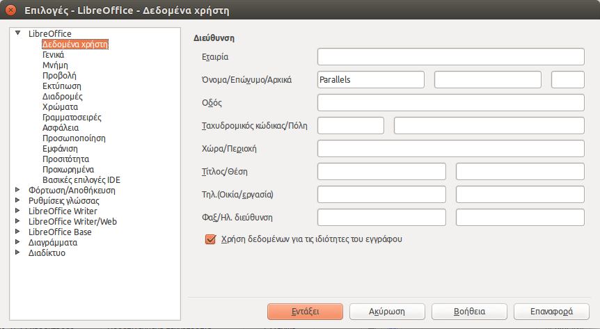

# LibreOffice Writer

---
[<-](../README.md) | [->](LibreOfficeWriter_chap2.md)
---

## Κεφάλαιο 1 - Εισαγωγή στο LibreOffice Writer

Ο επεξεργαστής κειμένου είναι το πρόγραμμα που ίσως χρησιμοποιείτε πιο συχνά για να γράψετε τα κείμενα σας, τις επιστολές σας, τις εργασίες σας κλπ. Μοιάζει πολύ με τις παλαιότερες εκδόσεις του MS-Word, μέχρι την έκδοση 2003.

### 1.1 Υποστήριξη Ελληνικών Χαρακτήρων

Όπως ίσως ήδη γνωρίζετε, το LibreOffice υποστηρίζει Ελληνικά. Ο πιο εύκολος ίσως τρόπος να τα εγκαταστήσετε είναι ως επέκταση \(extension\). Κατεβάστε την ελληνική υποστήριξη από [εδώ](http://extensions.services.openoffice.org/en/dictionaries) και αποθηκεύστε τη στο δίσκο σας. Στη συνέχεια από το LibreOffice επιλέξτε το μενού **Tools → Extension Manager → Add** και επιλέξτε το αποθηκευμένο αρχείο`el_gr_v110.oxt`. Πλέον μπορείτε να ενεργοποιήσετε τον ορθογράφο κατά την πληκτρολόγηση από το μενού **Tools → Options → Language Settings → Writing Aids** και στο πλαίσιο **Options** επιλέγετε **Check spelling as you type**. Επίσης, στο μενού **Tools → Options → Language Settings → Languages** μπορείτε να ορίσετε την προεπιλεγμένη γλώσσα και τις τοπικές ρυθμίσεις \(locale\) στα Ελληνικά, όπως επίσης και το νόμισμα \(EUR\).

Προτού αρχίσετε να πληκτρολογείτε κάποιο κείμενο, επιλέξτε **Tools → Language → For all Text → Greek**. Καθώς πληκτρολογείτε, βλέπετε τις λάθος λέξεις να υπογραμμίζονται με μια κόκκινη κυματιστή γραμμή. Κάντε δεξί κλικ πάνω σε μια τέτοια λέξη για να δείτε κάποιες επιλογές διόρθωσης. Αντί να κάνετε αυτή τη δουλειά κάθε λίγο και λιγάκι, μπορείτε να την αφήσετε για το τέλος. Επιλέξτε το μενού **Tools → Spelling and Grammar**. Από το παράθυρο της παρακάτω εικόνας έχετε τις εξής επιλογές:

* να επιλέξετε τη γλώσσα κειμένου \(Greek στην περίπτωσή που έχετε ελληνικό κείμενο\)
* **AutoCorrect** αν θέλετε να κάνει τις διορθώσεις χωρίς να σας ρωτήσει
* **Ignore Once** για να αγνοήσει το λάθος, αν όμως ξαναβρεί το ίδιο λάθος παρακάτω θα το ξαναεμφανίσει
* **Ignore All** για να αγνοήσει πάλι το ίδιο λάθος αν το ξαναβρεί παρακάτω
* **Add** για να προσθέσει τη λέξη σε κάποιο από τα λεξικά του
* **Change** για να αντικαταστήσει τη λέξη με κάποια από τις προτεινόμενες αλλά θα σας ξαναρωτήσει αν την ξαναβρεί
* **Change All** για να αντικαταστήσει επιπλέον και τις τυχόν επαναλήψεις της λάθος λέξης με την προτεινόμενη λέξη.

Το μενού **Options** σας μεταφέρει στο παράθυρο **Writing Aids** που είδαμε προηγουμένως.

**Εικόνα 1.1** _Spelling and Grammar_

Τέλος, αξίζει να σημειώσουμε το μενού **Tools → Language → Hyphenation**. Σας προτείνει συλλαβισμό \(-\) κάποιων λέξεων που δε χωράνε στην γραμμή, π.χ. σαρανταπο-δαρούσα.

Δυστυχώς, δεν βρήκα έκδοση με Ελληνικό μενού, του LibreOffice. Μπορείτε όμως να κατεβάσετε την τελευταία έκδοση ως πακέτα debian από [εδώ](http://www.greeklug.gr/index.php?option=com_docman&task=cat_view&gid=47&Itemid=84&lang=el).

### 1.2 Παραμετροποίηση

Από το μενού **Tools → Options → LibreOffice → User Data** μπορείτε να προσθέσετε τα προσωπικά σας δεδομένα \(βλ. Εικόνα 3\).

**Εικόνα 1.2** _User Data_

Επιλέξτε **Insert → Fields → Author** για να προσθέσετε το όνομά σας στο έγγραφο. Από το ίδιο μενού μπορείτε να προσθέσετε την τρέχουσα ημερομηνία και ώρα, τον τίτλο, το όνομα του αρχείου κλπ.

Μιας και είμαστε σ' αυτό το μενού, ας δούμε πως μπορούμε να προσθέσουμε αριθμό σελίδας. Από το μενού **Insert → Footer → Default** προσθέστε ένα υποσέλιδο στο έγγραφό σας. Στη συνέχεια, κάντε κλικ στο υποσέλιδο και επιλέξτε **Insert → Fields → Page Number**. Το **Page Count** είναι ο αριθμός σελίδων του εγγράφου, τον οποίο μπορείτε να στοιχίσετε αριστερά, δεξιά ή στο μέσο του υποσέλιδου.

### 1.3 Υποστήριξη πολλών τύπων εγγράφων

Ένα από τα πλεονεκτήματα του LibreOffice είναι η υποστήριξη πολλών μορφών εγγράφων. Έτσι, μπορείτε να αποθηκεύσετε τη δουλειά σας κατευθείαν σε .`pdf`χωρίς την ανάγκη κάποιου άλλου προγράμματος, από το μενού **File → Export as PDF** ή από το αντίστοιχο κουμπί της γραμμής εργαλείων.

Μπορείτε επίσης να ανοίξετε έγγραφα MS Word \(`.doc`και`.docx`\),`.rtf`, WordPerfect \(`.wpd`\), Lotus WordPro κ.ά. Επίσης, μπορείτε με το πάτημα ενός κουμπιού στη γραμμή εργαλείων \(κουμπί **Edit File**\) να μετατρέψετε το αρχείο “για ανάγνωση μόνο”, ώστε να αποφύγετε ενδεχόμενη ακούσια αλλαγή του.

### 1.4 Επίλογος

Στο πρώτο μέρος αυτού του βιβλίου δώσαμε μια σύντομη παρουσίαση της σουΐτας LibreOfficeκαι είδαμε κάποιες δυνατότητες παραμετροποίησης όπως π.χ. προσθήκη υποστήριξης Ελληνικής ορθογραφίας και σύνταξης. Στο επόμενο κεφάλαιο θα δούμε τα εργαλεία συνεργατικής συγγραφής εγγράφων \(collaboration tools\) που προσφέρει το LibreOffice.

**Πηγές:**

1. [Ελληνικό site](http://el.libreoffice.org/).
2. [List of Office Suites](http://en.wikipedia.org/wiki/List_of_office_suites).
3. [OpenOffice](http://en.wikipedia.org/wiki/OpenOffice.org).
4. [LibreOffice](http://en.wikipedia.org/wiki/LibreOffice).
5. LibreOffice \(2011\), [Getting Started with LibreOffice 3.3](http://wiki.documentfoundation.org/images/c/c4/0100GS3-GettingStartedLibO.pdf) .
6. LibreOffice \(2011\), [LibreOffice Writer Guide – Word Processing with LibreOffice 3.3](http://wiki.documentfoundation.org/images/b/ba/0200WG3-WriterGuide.pdf) .
7. Chanelle A. \(2009\), Beginning OpenOffice 3 From Novice to Professional, Apress.
8. Miller R. \(2005\),Point & Click OpenOffice.org!,Prentice Hall.
9. Perry E. \(2011-2012\), “How To – Libre Office Part 1-6”,Full Circle Magazine,τεύχη 46-51.

---
[<-](../README.md) | [->](LibreOfficeWriter_chap2.md)
---
