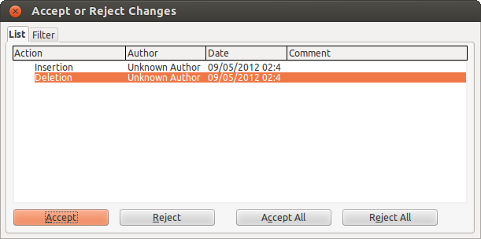
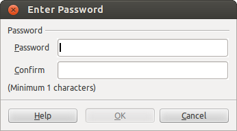

# LibreOffice Writer

[<-](LibreOfficeWriter_chap1.md) | [->](LibreOfficeWriter_chap3.md)

## Κεφάλαιο 2 - Εργαλεία Συνεργασίας

Σ' αυτό το κεφάλαιο θα δούμε τις δυνατότητες συνεργατικής συγγραφής κειμένων μεταξύ πολλών χρηστών \(collaboration\) που προσφέρει το LibreOffice. Π.χ. σε μια εταιρία, ή κατά τη συγγραφή των άρθρων ενός περιοδικού, πολλά άτομα δουλεύουν στο ίδιο κείμενο, πάνω στο οποίο θέλουν να κάνουν αλλαγές που θέλουν να τις δουν οι υπόλοιποι ή να ανταλλάξουν απόψεις. Παρακάτω θα δούμε πώς εφαρμόζονται αυτά τα εργαλεία στην πράξη κατά τη συγγραφή ενός άρθρου στο περιοδικό Ubuntistas.

### 2.1 Σχόλια

Ένα τελειωμένο άρθρο περνάει από επιμέλεια. Κατά την επιμέλεια του άρθρου ο επιμελητής μπορεί να χρειαστεί να προσθέσει κάποια σχόλια σε ορισμένα σημεία του άρθρου που αφορούν το συγγραφέα του άρθρου. Επιλέγει το κείμενο για το οποίο θέλει να προσθέσει σχόλια και στη συνέχεια το μενού **Insert → Comment**. Στα δεξιά του εγγράφου θα εμφανιστεί ένα τύπου post-it πλαίσιο με το όνομα του επιμελητή και την τρέχουσα ημερομηνία στο οποίο προσθέτει το σχόλιο. Όταν ο συγγραφέας του άρθρου ανοίξει το επιμελημένο έγγραφο, μπορεί να διαγράψει το σχόλιο, ή τα σχόλια του συγκεκριμένου επιμελητή ή και όλα τα σχόλια, επιλέγοντας το κατάλληλο μενού από το δεξί κλικ πάνω στο σχόλιο.

Μπορεί να αποκρύψει την εμφάνιση σχολίων από το μενού **View → Comments**.

Μπορεί ακόμα να εκτυπώσει τα σχόλια μαζί με το κείμενο. Από το μενού **File → Printer Settings** επιλέγει το κουμπί **Options** και από το παράθυρο που εμφανίζεται επιλέγει πώς θέλει να εκτυπωθούν τα σχόλια.

**Εικόνα 2.1** _Printer Settings_

### 2.2 Ανίχνευση αλλαγών

Όταν ο συγγραφέας τελειώσει με τη συγγραφή ενός άρθρου, ο επιμελητής αναλαμβάνει τη διόρθωση του άρθρου από ορθογραφικά και συντακτικά λάθη. Πριν ξεκινήσει να κάνει τις αλλαγές, ενεργοποιεί την ανίχνευση αλλαγών από το μενού **Edit → Changes → Record**. Για να φανούν οι αλλαγές ενεργοποιεί και την εμφάνισή τους από το μενού **Edit → Changes → Show**. Καθώς πληκτρολογεί βλέπει το κείμενο που εισάγειυπογραμμισμένοκαι το κείμενο που διαγράφει ωςδιαγραμμισμένο. Μπορεί να ρυθμίσει πώς θα φαίνονται οι αλλαγές στο έγγραφο από το μενού **Tools → Options → LibreOffice Writer → Changes**. Ο επιμελητής μπορεί επίσης να προσθέσει και κάποιο σχόλιο για τη διόρθωσή του από το μενού **Edit → Changes → Comment**. Με αυτόν τον τρόπο, ο συγγραφέας το άρθρου μπορεί να αναθεωρήσει τις αλλαγές του επιμελητή και να τις δεχτεί ή να τις απορρίψει επιλέγοντας **Edit → Changes → Accept or Reject**. Εμφανίζεται το παράθυρο της εικόνας 2 όπου ο συγγραφέας μπορεί να αποδεχτεί ή να απορρίψει τις αλλαγές του επιμελητή. Ο επιμελητής μπορεί βέβαια να “κλειδώσει” τις αλλαγές του ώστε να μην μπορεί να τις πειράξει ο συγγραφέας, από το μενού **Edit → Changes → Protect Record**. Όταν το άρθρο περάσει και από αυτή τη φάση, είναι έτοιμο για δημοσίευση.

**Εικόνα 2.2** _Accept or Reject track changes_

### 2.3 Δημιουργία εκδόσεων

Ο συγγραφέας μπορεί να δημιουργήσει πολλές εκδόσεις του άρθρου δίνοντας έτσι τη δυνατότητα στον επιμελητή να ξεκινήσει τη διόρθωση χωρίς να χρειάζεται να περιμένει την ολοκλήρωση του άρθρου. Από το μενού **File → Versions** εμφανίζεται το παράθυρο της παρακάτω εικόνας, απ' όπου ο συγγραφέας μπορεί να δημιουργήσει μια νέα έκδοση του άρθρου του και να λάβει μια επισκόπηση των διαθέσιμων εκδόσεων. Μπορεί να ανοίξει ή να διαγράψει μια έκδοση ή ακόμα και να συγκρίνει την τρέχουσα έκδοση του εγγράφου με μια παλαιότερη. Μπορεί επίσης να επιλέξει να αποθηκεύεται αυτόματα μια νέα έκδοση με το κλείσιμο του Writer.

**Εικόνα 2.3** _Δημιουργία εκδόσεων_

### 2.4 Συγχώνευση εγγράφων

Μερικές φορές τυχαίνει ο συγγραφέας και ο επιμελητής να δουλεύουν σε δυο διαφορετικές εκδόσεις του ίδιου άρθρου.

Μπορείτε να αναγνωρίσετε αν κάποιος τροποποίησε το έγγραφό σας χωρίς να χρησιμοποιήσει την αναθεώρηση ως εξής:

* Με συγχώνευση εγγράφων

* Με σύγκριση εγγράφων

Αφού ανοίξετε το έγγραφο, κλικ στο μενού **Edit → Changes → Merge Document**. Επίσης μπορείτε να συγκρίνετε τα δύο έγγραφα από το μενού **Edit → Compare Document**.

Σε περίπτωση διένεξης, εμφανίζεται διαλογικό παράθυρο απ’ όπου μπορείτε να επιλύσετε τη διένεξη.

### 2.5 Προστασία εγγράφου

Όταν τελειώσει και η επιμέλεια του άρθρου, καλό είναι ο συγγραφέας να προστατεύει το άρθρο από ατυχή ή σκόπιμη αλλαγή του. Από το μενού **File → Properties → Security** ο συγγραφέας μπορεί να προστατεύσει το έγγραφο ώστε να ανοίγει μόνο για ανάγνωση καθώς και από αλλαγές \(ίδιο αποτέλεσμα με το **Edit → Changes → Protect Record** που είδαμε παραπάνω\). Μόνο όποιος γνωρίζει τον κωδικό μπορεί να ανοίξει το έγγραφο για εγγραφή και να ενεργοποιήσει την ανίχνευση αλλαγών.

**Εικόνα 2.4** _Προστασία εγγράφου_

#### 2.6 Επίλογος

Σ' αυτό το κεφάλαιο είδαμε τα εργαλεία που προσφέρει το LibreOffice Writer για συνεργατική συγγραφή εγγράφων. Μετά τα παραπάνω, αναμένουμε να δούμε περισσότερους συγγραφείς και επιμελητές που να θέλουν να βοηθήσουν το περιοδικό.

**Πηγές:**

1. Princeton University, "[Collaboration Tools in Microsoft Word](http://helpdesk.princeton.edu/ntfileshare/word.html)”.
2. LibreOffice \(2011\), [Getting Started with LibreOffice 3.3](http://wiki.documentfoundation.org/images/c/c4/0100GS3-GettingStartedLibO.pdf).
3. LibreOffice \(2011\), [LibreOffice Writer Guide – Word Processing with LibreOffice 3.3](http://wiki.documentfoundation.org/images/b/ba/0200WG3-WriterGuide.pdf).
4. Chanelle A. \(2009\), _Beginning OpenOffice 3 From Novice to Professional_, Apress.
5. Miller R. \(2005\), _Point & Click OpenOffice.org!_, Prentice Hall.
6. Perry E. \(2011-2012\), “How To – Libre Office Part 1-11”, [Full Circle Magazine](http://fullcirclemagazine.org/), τεύχη 46-57.

---

[<-](LibreOfficeWriter_chap1.md) | [->](LibreOfficeWriter_chap3.md)

---