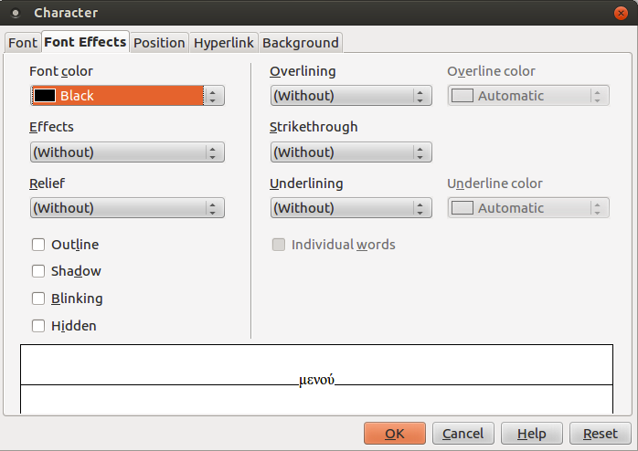
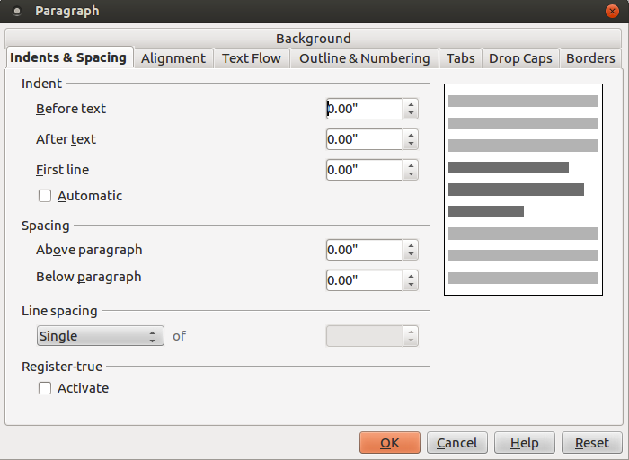

# LibreOffice Writer

---
[<-](LibreOfficeWriter_chap3.md) | [->](LibreOfficeWriter_chap5.md)
---

## Κεφάλαιο 4 - Μορφοποίηση

Σ’ αυτό το κεφάλαιο θα δούμε τις δυνατότητες μορφοποίησης που προσφέρει το LibreOffice.

### 4.1 Διαμόρφωση κειμένου

Επιλέξτε το κείμενο που θέλετε να μορφοποιήσετε. Από το μενού Format ! Character, ή με δεξί κλικ και επιλογή του μενού Character, εμφανίζεται το διαλογικό παράθυρο Character \(βλ. Εικόνα 4.1\).

**Εικόνα 4.1** _Διαλογικό παράθυρο Character, καρτέλα Font Effects_	

Η καρτέλα Εφέ κειμένου προσφέρει πολλές επιλογές όπως:

* Χρώμα γραμματοσειράς \(μπορείτε να το βρείτε και σαν κουμπί της εργαλειοθήκης Μορφοποίηση\)
* Εφέ \(κεφαλαία, πεζά, τίτλος, μικρά κεφαλαία\)
* Ανάγλυφο \(ανάγλυφο, χαραγμένο\)
* Διάρθρωση, σκιά, φλας, κρυφό (άμα θέλετε το κείμενο να μη φαίνεται). Βέβαια, από το μενού **Tools → Options → LibreOffice Writer → Formating Aids** μπορείτε να επιλέξετε να φαίνεται το κρυφό κείμενο τσεκάροντας το αντίστοιχο κουμπί επιλογής. Τότε, αν έχετε επιλεγμένο το **View → Nonprinting** characters, το κρυφό κείμενο φαίνεται με εστιγμένη διαγράμμιση. Αν και μπορεί να σας φαίνεται περίεργο να ορίσετε κείμενο ως κρυφό, έχει συμβεί στο παρελθόν να έχει δημοσιευθεί έγγραφο του οποίου τμήματα είχαν μορφοποιηθεί ως κρυφά επειδή είχαν λογοκριθεί. Χάκερς όμως πολύ εύκολα δημοσίευσαν ολόκληρο το έγγραφο εμφανίζοντας και τα λογοκριμένα (κρυφά) τμήματα χρησιμοποιώντας την παραπάνω τεχνική.
* Διαγράμμιση (και χρώμα διαγράμμισης)
* Διακριτή γραφή
* Υπογράμμιση (και χρώμα υπογράμμισης)

### 4.2 Διαμόρφωση παραγράφου

Κάντε κλικ στην παράγραφο που θέλετε να μορφοποιήσετε και στη συνέχεια δεξί κλικ και μενού **Paragraph** ή από το μενού **Format → Paragraph**. Εμφανίζεται το διαλογικό παράθυρο _Paragraph_ (βλ. Εικόνα 4.4).

**Εικόνα 4.4** _Διαλογικό παράθυρο Paragraph, καρτέλα Indents & Spacing_

Από την καρτέλα **Παρασκήνιο (Background)** μπορείτε ν’ αλλάξετε το χρώμα φόντου της παραγράφου.
H καρτέλα **Εσοχές & διάστιχο (Indents & Spacing)** σας επιτρέπει να (βλ. Εικόνα 4.4):
* αλλάξετε τις εσοχές της παραγράφου ή μόνο της 1ης γραμμής της παραγράφου
* το κενό μεταξύ της παραγράφου και των παραγράφων πριν και μετά 
* το διάστιχο μεταξύ των γραμμών της παραγράφου.
Η καρτέλα **Στοίχιση (Alignment)** σας επιτρέπει να αλλάξετε τη στοίχιση του κειμένου (αριστερή, κέντρο, δεξιά ή πλήρη).
Η καρτέλα **Ροή κειμένου (Text Flow)** (βλ. Εικόνα 4.5) σας επιτρέπει να:
* ορίσετε που να χωρίζεται μια λέξη όταν φθάνει στο τέλος της γραμμής (συλλαβισμός) δηλ. που θα μπει το ενωτικό (-). Δηλώνετε πόσους χαρακτήρες θα πρέπει να αφήνετε στο τέλος/στην αρχή της γραμμής και το μέγιστο αριθμό διαδοχικών ενωτικών. Αν δεν ορίσετε συλλαβισμό, τότε αν μια λέξη δε χωράει στην τρέχουσα γραμμή πηγαίνει ολόκληρη στην επόμενη γραμμή.
* εισάγετε αλλαγές σελίδας/στήλης κλπ. (βλ. και Insert → Manual Break)
* ρυθμίσετε τη συμπεριφορά της παραγράφου όπως:

  – να μη χωριστεί η παράγραφος αν αλλάξει σελίδα, δηλ. μετακινείται ολόκληρη η παράγραφος στην επόμενη σελίδα
  – διατηρεί την τρέχουσα και την επόμενη παράγραφο μαζί
  – ορίζει τον ελάχιστο αριθμό γραμμών της παραγράφου πριν την αλλαγή σελίδας, δηλ. αν ο αριθμός γραμμών της παραγράφου στο τέλος της σελίδας είναι μικρότερος από τον αριθμό που ορίσατε, τότε η παράγραφος μετακινείται στην επόμενη σελίδα
  – ορίζει τον ελάχιστο αριθμό γραμμών της παραγράφου της επόμενης σελίδας, αν αυτός είναι μικρότερος από τον αριθμό γραμμών που ορίσατε, τότε προσαρμόζεται ανάλογα η θέση της αλλαγής σελίδας.

---
[<-](LibreOfficeWriter_chap3.md) | [->](LibreOfficeWriter_chap5.md)
---