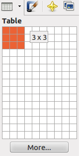
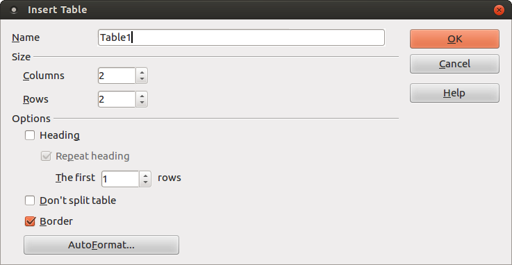
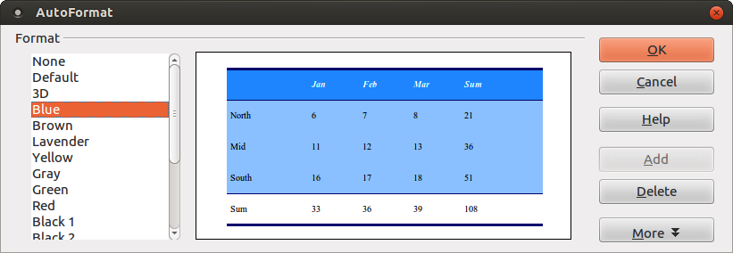
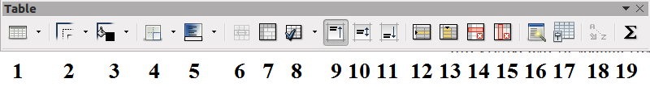
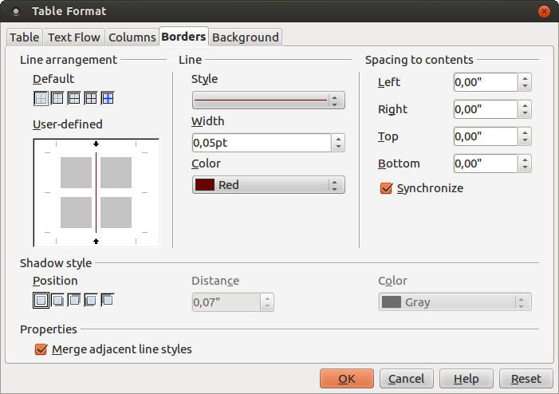
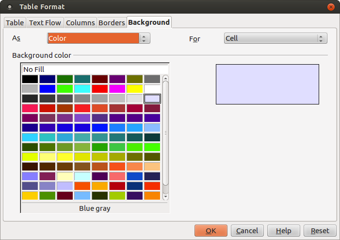

# LibreOffice Writer

[<-](LibreOfficeWriter_chap4.md) | [->](LibreOfficeWriter_chap6.md)

## Κεφάλαιο 5 - Πίνακες

Το LibreOffice διαθέτει πολλές δυνατότητες δημιουργίας και επεξεργασίας πινάκων. Με τον όρο _πίνακας_ εννοούμε ένα πλέγμα γραμμών και στηλών. Τα πλαίσια που δημιουργούνται με αυτό το τρόπο ονομάζονται _κελιά (cells)_. Κελί, δηλαδή, είναι ένα πλαίσιο μέσα σε ένα πίνακα, που δημιουργείται από τη διατομή μιας γραμμής και μιας στήλης. Ένας πίνακας, όπως μάθατε στα μαθηματικά λυκείου, ονομάζεται από τον αριθμό γραμμών και στηλών του. Π.χ. ένας πίνακας 2x3 έχει 2 γραμμές και 3 στήλες.

Ο πίνακας μας δίνει έναν ιδανικό τρόπο για να στοιχίζουμε το κείμενό μας, να δημιουργούμε λίστες, φόρμες κλπ. Μπορούμε να εισάγουμε κείμενο ή γραφικά σε ανεξάρτητα κελιά, περιγράμματα και σκίαση. Όπως θα δούμε στη συνέχεια, μπορούμε να δημιουργήσουμε ένα πίνακα με συγκεκριμένο μέγεθος, αριθμό κελιών.

### 5.1 Δημιουργία πίνακα

Υπάρχουν διάφοροι τρόποι δημιουργίας ενός πίνακα. Ο πιο εύκολος ίσως είναι από το κουμπί Table της βασικής γραμμής εργαλείων (βλ. Εικόνα 5.1). 
Επιλέγοντας με το ποντίκι το κάτω βελάκι δεξιά του κουμπιού, εμφανίζεται ένα πλέγμα στο οποίο σέρνοντας το ποντίκι ορίζετε τον αριθμό γραμμών και στηλών του πίνακα που θέλετε να δημιουργήσετε. Κάντε κλικ στη διάσταση που θέλετε, κι ένας νέος πίνακας τόσων γραμμών και στηλών που διαλέξατε εισάγεται στο έγγραφό σας στο σημείο του δρομέα.

**Εικόνα 5.1** _Εισαγωγή πίνακα nxm_

Ένας άλλος τρόπος είναι πατώντας πάνω στο κουμπί **Table** είτε από το μενού **Table → Insert → Table** είτε από το μενού **Insert → Table** εμφανίζεται το διαλογικό παράθυρο της εικόνας 5.2.

**Εικόνα 5.2** _Διαλογικό παράθυρο εισαγωγής πίνακα_

Από το παράθυρο αυτό, πέραν των γραμμών και των στηλών, μπορείτε να ορίσετε ένα όνομα για τον πίνακα, αν ο πίνακας θα περιλαμβάνει μια κεφαλίδα (η οποία θα μπορεί να επαναλαμβάνεται σε κάθε σελίδα αν ο πίνακας καταλαμβάνει περισσότερες από μια σελίδες), να ορίσετε αν θα φαίνεται ή όχι το περίγραμμά του, ακόμα και να χρησιμοποιήσετε κάποια από τα έτοιμα πρότυπα πινάκων (κουμπί **AutoFormat**).

**Εικόνα 5.3** _Αυτόματη μορφοποίηση πίνακα_

Αφού επιλέξετε τις ρυθμίσεις που επιθυμείτε, πατήστε στο κουμπί **OK**. Ας δημιουργήσουμε τον παρακάτω πίνακα 3x3 ως άσκηση:

| Χαρακτηρισμός / Διαστάσεις | Διπλής πυκνότητας ή Double Density (DD) | Υψηλής πυκνότητας ή High Density (HD) |
| --- | --- | --- |
| 3,5" | 720 Kb | 1,44 Mb |
| 5 1/4" | 360 Kb | 1,2 Mb |

Ο πίνακας αυτός διαθέτει μια κεφαλίδα (την πρώτη γραμμή) – επιλέξτε το κουμπί επιλογής Heading (βλ. Εικόνα 5.2) και δηλώστε ότι μόνο η 1η γραμμή αποτελεί κεφαλίδα. Μόλις πατήσετε **OK**, το Writer δημιούργησε τα κελιά του πίνακά σας και μένει μόνο να εισάγετε τα περιεχόμενα. Παρατηρήστε
ότι όλα τα κελιά έχουν στοίχιση στο κέντρο. Για να επιλέξουμε ολόκληρο τον πίνακα υπάρχουν διάφοροι τρόποι. Ένας από αυτούς είναι να τοποθετήσουμε το δρομέα σε κάποιο κελί του πίνακα και να επιλέξουμε το μενού **Table → Select → Table**. Διαφορετικά, αν τοποθετήσετε το δείκτη του ποvτικιού αριστερά της 1ης στήλης εμφανίζεται ένα δεξί μαύρο βελάκι →, σέρνοντάς το προς τα κάτω/πάνω βλέπετε να επιλέγονται οι γραμμές του πίνακα. Παρόμοια μπορείτε να επιλέξετε στήλες τοποθετώντας το δρομέα πάνω από την πρώτη γραμμή του πίνακα και σέρνοντας μόλις εμφανιστεί το βελάκι ↓. Μπορείτε να επιλέξετε ολόκληρο τον πίνακα πηγαίνοντας τον δρομέα του ποντικού στην πάνω αριστερή γωνία του πίνακα μέχρι να εμφανιστεί το πλάγιο βελάκι και μετά κάντε κλικ για να τον επιλέξετε.

Αφού επιλέξετε όλα τα κελιά του πίνακα, πατήστε το κουμπί της στοίχισης στο κέντρο από τη γραμμή εργαλείων μορφοποίησης. Πλέον ότι γράφετε μέσα στον πίνακα θα στοιχίζεται στο κέντρο. Μπορείτε να στοιχίσετε τα περιεχόμενα ενός ή περισσότερων κελιών και κατακόρυφα, επιλέγοντάς τα και πατώντας ένα από τα κουμπιά 9-11 (βλ. Εικόνα 5.4) ή με δεξί κλικ και **Cell → Top**, **Center** ή **Bottom**. 

Μπορούμε να πλοηγηθούμε μέσα σε ένα πίνακα, είτε κάνοντας κλικ με το ποντίκι στο κελί που θέλουμε ή χρησιμοποιώντας τα βελάκια ← ↑ → ↓. Με Tab μεταφερόμαστε στο επόμενο κελί ενώ όταν είμαστε στο τελευταίο κελί του πίνακα δημιουργείται μια νέα γραμμή. Shift+Tab μας μεταφέρει στο προηγούμενο κελί.
Μπορούμε ν’ αλλάξουμε το μέγεθος των γραμμών/στηλών του πίνακα τοποθετώντας το δρομέα του ποντικιού ακριβώς πάνω σε κάποια γραμμή διαχωρισμού κελιών του πίνακα. Ο δρομέας μετατρέπεται σε διπλό βελάκι ↔ αν πρόκειται για κατακόρυφη γραμμή και ανάλογα ↕ αν πρόκειται για οριζόντια γραμμή. Κάντε κλικ και σύρτε τη γραμμή με το ποντίκι σε μια νέα θέση. Θα δείτε ότι το μέγεθος της γραμμής/στήλης άλλαξε.

Όταν τοποθετείτε το δρομέα μέσα στον πίνακα, εμφανίζεται η γραμμή εργαλείων Table (βλ. Εικόνα 5.4). Αν όχι, τότε εμφανίστε τη από το μενού **View → Toolbars → Table**.

**Εικόνα 5.4** _Γραμμή εργαλείων πίνακα_

| 1 | Table Είναι το ίδιο με το κουμπί Table που περιγράψαμε προηγουμένως. |
| 2 | Line style Τεχνοτροπία ή στυλ γραμμής (π.χ. εστιγμένο). |
| 3 | Line color Χρώμα γραμμής |
| 4 | Borders Περίγραμμα κελιού |
| 5 | Background color Χρώμα παρασκηνίου |
| 6 | Merge cells Συγχώνευση κελιών |
| 7 | Split cells Διαίρεση κελιών |
| 8 | Optimize Βελτιστοποίηση (ίση κατανομή γραμμών/στηλών, βέλτιστο ύψος γραμμής, βέλτιστο πλάτος στήλης) |
| 9 | Top Στοίχιση κειμένου στο άνω μέρος του κελιού |
| 10 | Center Στοίχιση κειμένου στο μέσο του κελιού |
| 11 | Bottom Στοίχιση κειμένου στο κάτω μέρος του κελιού |
| 12 | Insert Row Εισαγωγή γραμμής |
| 13 | Insert Colum Εισαγωγή στήλης |
| 14 | Delete Row Διαγραφή γραμμής |
| 15 | Delete Column Διαγραφή στήλης |
| 16 | AutoFormat Αυτόματη μορφοποίηση |
| 17 | Table Properties Ιδιότητες πίνακα |
| 18 | Sort Ταξινόμηση |
| 19 | Sum Άθροισμα |

Ας δούμε πως μπορούμε να χρησιμοποιήσουμε τις παραπάνω εντολές. Για ν’ αλλάξουμε το στυλ/χρώμα/περίγραμμα γραμμής ή το χρώμα παρασκηνίου ενός κελιού/γραμμής/στήλης, το/την επιλέγουμε, όπως μάθαμε προηγούμενα, και κάνουμε την επιλογή μας από το αντίστοιχο κουμπί (2-5). 

Για να προσθέσουμε μια νέα γραμμή κάτω από την 1η γραμμή του πίνακα που δημιουργήσαμε ως άσκηση, τοποθετούμε το δρομέα σε κάποιο κελί της πρώτης γραμμή και πατάμε το κουμπί 12. Για να διαγράψουμε τη γραμμή που μόλις δημιουργήσαμε, τοποθετούμε το δρομέα σε κάποιο κελί της και πατάμε το κουμπί 14, ή από το μενού **Table → Delete → Rows** ή δεξί κλικ και **Row → Delete**.

Για να προσθέσουμε μια στήλη δεξιά της 2ης στήλης, τοποθετούμε το δρομέα σε κάποιο κελί της 2ης στήλης και πατάμε το κουμπί 13. Για να διαγράψουμε τη στήλη που μόλις δημιουργήσαμε, τοποθετούμε το δρομέα σε κάποιο κελί της και πατάμε το κουμπί 15 ή από το μενού **Table → Delete → Columns** ή δεξί κλικ και **Column → Delete**.

Για να προσθέσουμε μια νέα γραμμή πάνω από την 1η γραμμή του πίνακα που δημιουργήσαμε ως άσκηση, τοποθετούμε το δρομέα σε κάποιο κελί της πρώτης γραμμή και επιλέγουμε το μενού **Table → Insert → Rows** ή δεξί κλικ και **Row → Insert**. Από το παράθυρο που εμφανίζεται εισάγουμε τον αριθμό γραμμών που θέλουμε να εισάγουμε και στη θέση επιλέγουμε “Before” και **ΟΚ**. Αντίστοιχη διαδικασία ακολουθούμε για να εισάγουμε στήλες. 

Ας προσθέσουμε μια νέα γραμμή στον πίνακα της άσκησής μας όπως φαίνεται παρακάτω.

| Κατηγορίες Δισκεττών |
| Χαρακτηρισμός / Διαστάσεις | Διπλής πυκνότητας ή Double Density (DD) | Υψηλής πυκνότητας ή High Density (HD) |
| --- | --- | --- |
| 3,5" | 720 Kb | 1,44 Mb |
| 5 1/4" | 360 Kb | 1,2 Mb |

**Πίνακας 5.1** _Άσκηση_

Πώς όμως η πρώτη γραμμή αποτελείται από ένα μόνο κελί; Επιλέγουμε την 1η γραμμή και πατάμε στο κουμπί Merge Cells (6) ή από το μενού **Table → Merge Cells** ή δεξί κλικ και **Cell → Merge**.

Το ανάποδο της συγχώνευσης κελιών είναι η διαίρεση κελιών. Τοποθετήστε το δρομέα σ’ ένα κελί και πατήστε το κουμπί 7 ή από το μενού Table → Split Cells ή δεξί κλικ και Cell → Split. Εμφανίζεται ένα παράθυρο το οποίο σας ρωτάει σε πόσα κελιά να διαιρεθεί το κελί και την κατεύθυνση της διαίρεσης, δηλ. οριζόντια ή κατακόρυφη.

Τέλος από τις καρτέλες _Borders και Background_ μπορείτε να μορφοποιήσετε τις γραμμές διαχωρισμού των κελιών του πίνακα και το χρώμα φόντου των κελιών. Παρατηρήστε ότι δεν υπάρχουν πλάγιες γραμμές περιγράμματος / και \ όπως π.χ. στο Microsoft Word.

**Εικόνα 5.12** _Ιδιότητες πίνακα - καρτέλα Borders_

**Εικόνα 5.13** _Ιδιότητες πίνακα - καρτέλα Background_

### 5.5 Επίλογος
Σ’ αυτό το κεφάλαιο μιλήσαμε για τις δυνατότητες δημιουργίας και μορφοποίησης πινάκων του LibreOffice Writer. Μάθαμε πώς να μορφοποιούμε έναν πίνακα και καλύψαμε σχεδόν όλες τις δυνατότητες που μας παρέχει το LibreOffice Writer σχετικά με τους πίνακες. Στο επόμενο κεφάλαιο θα μιλήσουμε για τις δυνατότητες που μας παρέχει το LibreOffice Writer για τη δημιουργία ιστοσελίδων.

## Πηγές:

1. LibreOffice \(2011\), [Getting Started with LibreOffice 3.3](http://wiki.documentfoundation.org/images/c/c4/0100GS3-GettingStartedLibO.pdf) .
1. LibreOffice \(2011\), [LibreOffice Writer Guide – Word Processing with LibreOffice 3.3](http://wiki.documentfoundation.org/images/b/ba/0200WG3-WriterGuide.pdf).
1. Chanelle A. (2009), _Beginning OpenOffice 3 From Novice to Professional_, Apress.
1. Miller R. (2005), _Point & Click OpenOffice.org!_, Prentice Hall.

---

[<-](LibreOfficeWriter_chap4.md) | [->](LibreOfficeWriter_chap6.md)

---