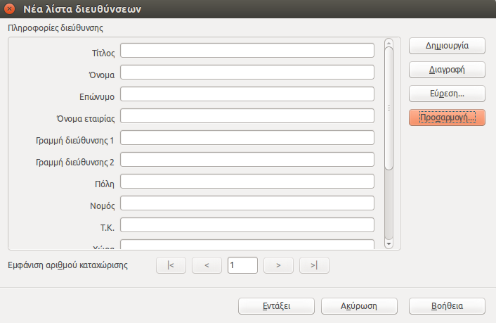

# LibreOffice Writer  
© Γιάννης Κωστάρας

[<-](LibreOfficeWriter_chap6.md)| [->](LibreOfficeWriter_chap8.md)

## Κεφάλαιο 7 - Συγχώνευση Αλληλογραφίας

Η λειτουργία συγχώνευσης αλληλογραφίας μας επιτρέπει να δημιουργούμε έγγραφα για ομαδικές αποστολές ηλεκτρονικής αλληλογραφίας ή/και εκτύπωσης.
Η λειτουργία συγχώνευσης αλληλογραφίας χρησιμοποιεί δύο αρχεία:
*	Το _κύριο έγγραφο_, το οποίο περιέχει το κείμενο που θέλουμε να επαναλαμβάνεται σε κάθε επιστολή
*	Το _αρχείο προέλευσης δεδομένων_, το οποίο περιέχει τα στοιχεία των παραληπτών, δηλαδή τα στοιχεία που θα αλλάζουν σε κάθε επιστολή. Για παράδειγμα, το όνομα, τη διεύθυνση, τον ταχυδρομικό κωδικό κάθε παραλήπτη, και άλλα.
Όλα τα στοιχεία που αφορούν ένα συγκεκριμένο παραλήπτη στο αρχείο προέλευσης δεδομένων αποτελούν μια _εγγραφή δεδομένων_. Σε κάθε εγγραφή, μια μεμονωμένη πληροφορία στο αρχείο προέλευσης δεδομένων, όπως το όνομα ή το επώνυμο του παραλήπτη, ονομάζεται _πεδίο_. 

| Όνομα	| Επώνυμο | Διεύθυνση | Ταχυδρομικός Κώδικας | Πόλη |
| Χρήστος | Παπάς |	 Κυκλάδων 15 | 15342 | Αγία Παρασκευή |
| Ελένη | Μπαλτά | Μαυρομιχάλη 2 | 15122 | Μαρούσι |
| Ευάγγελος | 	Μεταξάς |	Αγ. Παρασκευής 12 	| 15232 | Χαλάνδρι |
| Γεώργιος 	| Γεωργίου | Τήνου 8 | 15343  | Αγία Παρασκευή |
| Μαργαρίτα | 	Κομνηνού | 	Δουκ. Πλακεντίας 2 | 15234 | Χαλάνδρι | 

**Πίνακας 7.1** _Παράδειγμα αρχείου προέλευσης δεδομένων με 2 εγγραφές, όπου η κάθε εγγραφή περιέχει 4 πεδία_

Τα βασικά βήματα που πρέπει να ακολουθήσουμε για να δημιουργήσουμε ομαδικές επιστολές με τη λειτουργία συγχώνευσης αλληλογραφίας είναι τα εξής (βλ. Εικόνα 7.1):
1.	Δημιουργία του κύριου εγγράφου
2.	Δημιουργία του αρχείου προέλευσης δεδομένων
3.	Επιλογή των πεδίων που θα περιέχουν οι επιστολές
4.	Συγχώνευση των δεδομένων του αρχείου προέλευσης με τα περιεχόμενα του κύριου έγγραφου, έτσι ώστε να δημιουργηθεί μια μοναδική επιστολή για κάθε παραλήπτη.


**Εικόνα 7.1** _Τα βήματα της συγχώνευσης αλληλογραφίας_

### 7.1 Δημιουργία του κύριου εγγράφου

Όπως προαναφέραμε, ξεκινάμε τη διαδικασία συγχώνευσης αλληλογραφίας δημιουργώντας το κύριο έγγραφο. Αυτό πραγματοποιείται με τον παρακάτω τρόπο:
1.	Δημιουργούμε το έγγραφο επιστολής, ή ανοίγουμε το έγγραφο που περιέχει την επιστολή μας αν το έχουμε έτοιμο. Για το παράδειγμά μας, πληκτρολογούμε τα περιεχόμενα του παρακάτω κύριου εγγράφου αφήνοντας πέντε κενές γραμμές στην αρχή του εγγράφου:

```
							


					Παρασκευή, 29 Ιουλίου

Θα θέλαμε να σας ενημερώσουμε ότι από την Δευτέρα 1 Αυγούστου 
έως και την Παρασκευή 26 Αυγούστου το εκπαιδευτήριο θα παραμείνει
κλειστό λόγω των καλοκαιρινών διακοπών. Τα μαθήματα θα ξεκινήσουν 
πάλι κανονικά από τη Δευτέρα 29 Αυγούστου.

					Φιλικά,
					η Διεύθυνση του φροντιστηρίου
```

2.	Εκτελούμε την εντολή **Οδηγός Συγχώνευσης αλληλογραφίας** από το μενού **Εργαλεία**. Το πλαίσιο διαλόγου **Οδηγός συγχώνευσης αλληλογραφίας** εμφανίζεται στην οθόνη μας. Βλέπουμε 8 βήματα από τα οποία αποτελείται η λειτουργία συγχώνευσης αλληλογραφίας. Η δημιουργία του κυρίου εγγράφου ή εγγράφου εκκίνησης αποτελεί το 1ο βήμα. Επιλέγουμε **Χρήση του τρέχοντος εγγράφου** και πατάμε **Επόμενο**.


**Εικόνα 7.2** _Βήμα 1ο Επιλογή Εγγράφου Εκκίνησης_

3. Στο 2ο βήμα μπορούμε να επιλέξουμε αν θα δημιουργήσουμε _Επιστολή_ ή _Ηλεκτρονικό Μήνυμα_ (δηλ. email). Για το παράδειγμα μας, επιλέγουμε **Επιστολή** και κλικ στο **Επόμενο**.


**Εικόνα 7.3** _Βήμα 2ο Επιλογή Τύπου Εγγράφου_

4. Στο 3ο βήμα εισάγουμε τα δεδομένα μας, δηλ. τα ονόματα και τις διευθύνσεις των ατόμων που θέλουμε ν' αποστείλουμε την αλληλογραφία μας. Τα δεδομένα αυτά μπορούμε να τα αποθηκεύσουμε σε κάποιο έγγραφο με μορφή πίνακα ή σε ένα αρχείο βάσης δεδομένων.
Όλα τα δεδομένα που αφορούν ένα συγκεκριμένο παραλήπτη αποτελούν μια _εγγραφή δεδομένων_. Η πρώτη γραμμή ονομάζεται _γραμμή κεφαλίδων_ ενώ μία μεμονωμένη πληροφορία για κάθε παραλήπτη ονομάζεται _πεδίο_.


**Εικόνα 7.4** _Βήμα 3ο Εισαγωγή Ομάδας Διευθύνσεων_

5. Κάντε κλικ στο κουμπί **Επιλογή καταλόγου διευθύνσεων** και στο διαλογικό παράθυρο που εμφανίζεται πατήστε το κουμπί **Δημιουργία**. Εμφανίζεται το διαλογικό παράθυρο _Νέα λίστα διευθύνσεων_ (βλ. Εικόνα 7.5). Πατήστε το κουμπί **Προσαρμογή** και αφήστε μόνο τα πεδία που φαίνονται στην Εικόνα 7.6 διαγράφοντας τα υπόλοιπα. Όταν τελειώσετε πατήστε **Εντάξει**.



**Εικόνα 7.5** _Βήμα 3ο Νέα Λίστα Διευθύνσεων_


**Εικόνα 7.6** _Βήμα 3ο Προσαρμογή Καταλόγου Διευθύνσεων_

6. Εισάγετε μια μια τις πληροφορίες που φαίνονται στον Πίνακα 7.1 τα πεδία του διαλογικού παράθυρου _Νέα Λίστα Διευθύνσεων_ πατώντας **Tab** για να μεταβείτε στο επόμενο πεδίο. Πατήστε στο κουμπί **Δημιουργία** για να προσθέσετε νέο παραλήπτη. Όταν τελειώσετε πατήστε **Εντάξει**.

Π.χ.

*	Πληκτρολογούμε το Όνομα «Χρήστος» και πατάμε το **Tab**
*	Πληκτρολογούμε το Επώνυμο «Παπάς» και πατάμε **Tab**
*	Πληκτρολογούμε τη Διεύθυνση «Κυκλάδων 15» και πατάμε **Tab**
*	Πληκτρολογούμε τον Ταχυδρομικό Κώδικα «153 42» και πατάμε **Tab**

Τα βελάκια σας δίνουν τη δυνατότητα να πλοηγείστε στις εγγραφές ως εξής: &gt; και &gt;&#124; στην επόμενη και τελευταία εγγραφή, &lt; και &#124;&lt; στην προηγούμενη και την πρώτη εγγραφή.

7. Στο διαλογικό παράθυρο του βήματος 3 (βλ. Εικόνα 7.4) ελέγξτε αν τα δεδομένα διευθύνσεων ταιριάζουν σωστά. Αν όχι τότε μπορείτε ν' αλλάξετε το πως θα φαίνονται τα δεδομένα πατώντας στο κουμπί **Περισσότερα** ή αν δεν ταιριάζουν να πατήσετε στο κουμπί **Συμφωνία πεδίων**. Όταν είσαστε ευχαριστημένοι με το αποτέλεσμα, πατήστε **Επόμενο**.

8. Το 4ο βήμα του οδηγού σας επιτρέπει να εισάγετε έναν χαιρετισμό. Πατήστε **Επόμενο**.


**Εικόνα 7.7** _Βήμα 4ο Δημιουργία Χαιρετισμού_

9. Το 5ο βήμα του οδηγού σας επιτρέπει να τοποθετήσετε το χαιρετισμό και τη διεύθυνση σε σχέση με το υπόλοιπο κείμενο. Πατήστε **Επόμενο**.


**Εικόνα 7.8** _Βήμα 5ο Προσαρμογή Διάταξης της ομάδας διευθύνσεων και του χαιρετισμού_

10. Στο βήμα 6 _Προεπισκόπιση και επεξεργασία εγγράφου_ πατήστε στο κουμπί **Επεξεργασία εγγράφου** για να διατάξετε τα διάφορα στοιχεία του εγγράφου όπως τα θέλετε. Πατήστε στην **Επιστροφή στον οδηγό συγχώνευσης αλληλογραφίας** για να βγείτε από την προεπισκόπιση και **Επόμενο** για να συνεχίσετε. Πατώντας **Επόμενο** εκτελείτε η συγχώνευση αλληλογραφίας.

```
«Όνομα» «Επώνυμο» 
«Διεύθυνση1» 
«ΤαχυδρομικόςΚώδικας» «Πόλη» 
							
					Παρασκευή, 29 Ιουλίου

Αγαπητέ κύριε «Επώνυμο»,

Θα θέλαμε να σας ενημερώσουμε ότι από την Δευτέρα 1 Αυγούστου 
έως και την Παρασκευή 26 Αυγούστου το εκπαιδευτήριο θα παραμείνει 
κλειστό λόγω των καλοκαιρινών διακοπών. Τα μαθήματα θα ξεκινήσουν 
πάλι κανονικά από τη Δευτέρα 29 Αυγούστου.

					Φιλικά,
					η Διεύθυνση του φροντιστηρίου
```

11. Στο βήμα 7 μπορείτε να προσωποιήσετε τα συγχωνευμένα έγγραφα πατώντας στο κουμπί **Επεξεργασία μεμονωμένου εγγράφου** ή αναζητώντας κάποια επιστολή από την _Εύρεση_. Μπορείτε π.χ. να διορθώσετε το χαιρετισμό "Αγαπητέ κύριε Παπάς". Πατήστε στην **Επιστροφή στον οδηγό συγχώνευσης αλληλογραφίας** για να βγείτε από την προεπισκόπιση και **Επόμενο** για να συνεχίσετε. 


**Εικόνα 7.9** _Βήμα 7ο Προσωποποίηση των συγχωνευμένων εγγράφων του μηνύματος_

12. Στο τελευταίο βήμα έχετε τη δυνατότητα να αποθηκεύσετε το έγγραφο εκκίνησης, να αποθηκεύσετε (ως ένα ή ξεχωριστά έγγραφα) ή να εκτυπώσετε τις συγχωνευμένες επιστολές ή να τις αποστείλετε ως ηλεκτρονικά μηνύματα. Αποθηκεύστε τα δίνοντάς τους κατάληξη .odt.


**Εικόνα 7.10** _Βήμα 8ο Αποθήκευση, εκτύπωση ή αποστολή εγγράφου_

### Επίλογος

Σ’ αυτό το άρθρο μιλήσαμε για τις δυνατότητες συγχώνευσης αλληλογραφίας του LibreOffice Writer. Μπορείτε να πειραματιστείτε και με τις υπόλοιπες επιλογές του οδηγού συγχώνευσης αλληλογραφίας.

## Πηγές:

1. LibreOffice \(2011\), [Getting Started with LibreOffice 3.3](http://wiki.documentfoundation.org/images/c/c4/0100GS3-GettingStartedLibO.pdf) .
1. LibreOffice \(2011\), [LibreOffice Writer Guide – Word Processing with LibreOffice 3.3](http://wiki.documentfoundation.org/images/b/ba/0200WG3-WriterGuide.pdf).
1. Chanelle A. (2009), _Beginning OpenOffice 3 From Novice to Professional_, Apress.
1. Miller R. (2005), _Point & Click OpenOffice.org!_, Prentice Hall.

---

[<-](LibreOfficeWriter_chap6.md)| [->](LibreOfficeWriter_chap8.md)

---