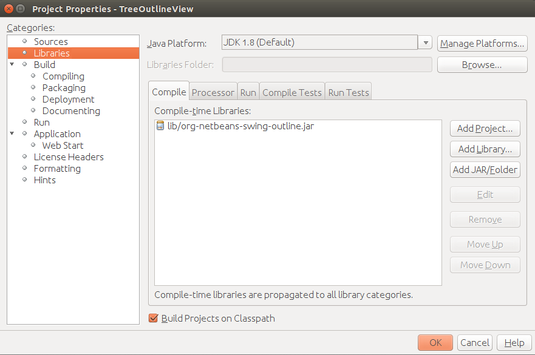
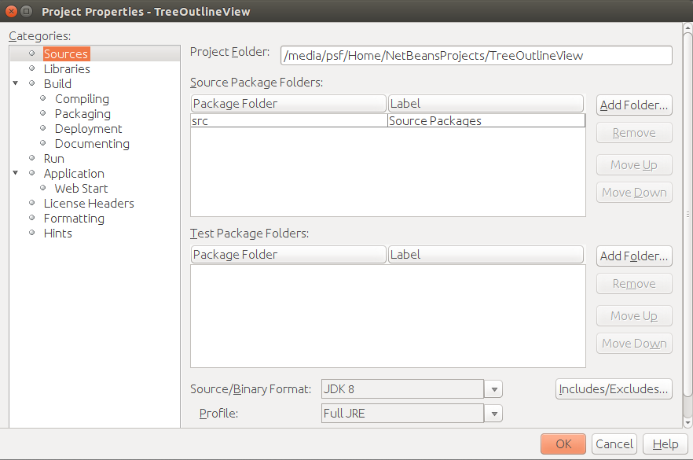

# Επισκόπηση της Java 8 {#Java8}
© Γιάννης Κωστάρας

---

Η έκδοση 8 της Java δημοσιεύθηκε το Μάρτιο 2014. Σε αντίθεση με την έκδοση 7, η έκδοση 8 φέρνει πολλά νέα χαρακτηριστικά στην πιο δημοφιλή γλώσσα προγραμματισμού. Όπως η έκδοση 5 εισήγαγε τα Generics τα οποία άλλαξαν τον τρόπο που προγραμματίζουμε, έτσι και η 8 αποτελεί την πιο επαναστατική έκδοση που θ' αλλάξει τον τρόπο που προγραμματίζατε μέχρι τώρα.

Η έκδοση αυτή διακρίνεται από τα ακόλουθα έργα: 

 * λ-λογισμός, Συναρτησιακές Διεπαφές (Functional Interfaces) και Streams API (JSR-335)
 * Date/Time API (JSR-310)
 * Type Annotations (JSR-308)
 * Μηχανή Javascript Nashorn
 * Προσθήκες στη βιβλιοθήκη concurrency
 * Αφαίρεση της μόνιμης γενιάς από την ΕΜ Hotspot
      
## Εγκατάσταση 
Για να δείτε τι έκδοση της Java τρέχετε δώστε σ' ένα  κέλυφος την εντολή:
```bash
$ java -version
java version "1.7.0_65" OpenJDK Runtime Environment (IcedTea 2.5.3) (7u71-2.5.3-0ubuntu0.14.04.1) OpenJDK 64-Bit Server VM (build 24.65-b04, mixed mode) 
```
Αν δε μπορείτε να βρείτε το OpenJDK 8 στο Ubuntu Software Center, τότε η [Azul](http://www.azulsystems.com/), μια εταιρία που προσφέρει την δική της εικονική μηχανή Java, πακετάρει και προσφέρει υποστήριξη για το OpenJDK (το οποίο ονομάζει [Zulu](http://www.azulsystems.com/products/zulu/downloads)). Αφού κατεβάσετε το πακέτο .deb, εγκαταστήστε το κατά τα γνωστά:
```bash
$ sudo dpkg -i zulu1.8.0_25-8.4.0.1-x86lx64.deb
...
$ java -version openjdk version "1.8.0_25" OpenJDK Runtime Environment (Zulu 8.4.0.1-linux64) (build 1.8.0_25-b17) OpenJDK 64-Bit Server VM (Zulu 8.4.0.1-linux64) (build 25.25-b02, mixed mode)
```
Η γλώσσα εγκαταστάθηκε στον κατάλογο ```/usr/lib/jvm/zulu-8-amd64/```. Αν δεν άλλαξε στην έκδοση 8, τότε ακολουθήστε παρακάτω τα βήματα:
```bash
$ sudo update-alternatives --config java
There are 4 choices for the alternative java (providing /usr/bin/java).  
Selection  Path                   Priority   Status ------------------------------------------------------            
* 0 /usr/lib/jvm/zulu-8-amd64/jre/bin/java         1080400   auto mode            
  1 /usr/lib/jvm/java-6-openjdk-amd64/jre/bin/java   1061      manual mode            
  2 /usr/lib/jvm/java-6-openjdk-i386/jre/bin/java    1060      manual mode
  3 /usr/lib/jvm/java-7-openjdk-amd64/jre/bin/java   1071      manual mode 
Press enter to keep the current choice[*], or type selection number: 
```
και επιλέξτε την έκδοση 8 (επιλογή 4 πιο πάνω). Αν από την άλλη, το σύστημά σας έθεσε ως εξ' ορισμού την έκδοση 8 αλλά εσείς θέλετε να συνεχίζετε να δουλεύετε με την έκδοση 7, πάλι τη θέτετε με την παραπάνω εντολή. Επαναλάβετε τα παραπάνω για τη ```javac```:
```bash
$ sudo update-alternatives –-config javac
```
Εναλλακτικά, μπορείτε να εγκαταστήσετε (και) την έκδοση της Oracle χρησιμοποιώντας τις ακόλουθες εντολές:
```bash
$ sudo add-apt-repository ppa:webupd8team/java -y
$ sudo apt-get update
$ sudo apt-get install oracle-java8-installer
```
Η γλώσσα εγκαταστάθηκε στον κατάλογο ```/usr/lib/jvm/java-8-oracle/```. Αν θέλετε να ενημερώσετε αυτόματα και το περιβάλλον, μπορείτε να δώσετε την εντολή:
```bash
$ sudo apt-get install oracle-java8-set-default
...
$ java -version java version "1.8.0_25" Java(TM) SE Runtime Environment (build 1.8.0_25-b17) Java HotSpot(TM) 64-Bit Server VM (build 25.25-b02, mixed mode) 
```
Αν είστε τέλος πιο τολμηροί και θέλετε να τη χτίσετε μόνοι σας από τον πηγαίο κώδικα, ακολουθήστε [αυτές τις οδηγίες](https://github.com/hgomez/obuildfactory/wiki/How-to-build-and-package-OpenJDK-8-on-Linux). 

## λ-λογισμός
Ένα πολυαναμενώμενο χαρακτηριστικό, που ήδη υποστηρίζεται από πολλές άλλες [γλώσσες προγραμματισμού](http://en.wikipedia.org/wiki/Comparison_of_programming_languages) (όπως C#, C/C++, Clojure, Erlang, Groovy, Haskell, Javascript, Lisp, Perl, Python, Ruby, Scala, Windows Powershell κ.ά.) και έπρεπε να υιοθετηθεί κι από τον κόσμο της πιο δημοφιλούς γλώσσας προγραμματισμού. Με απλά λόγια, μας επιτρέπει να περάσουμε τμήμα κώδικα ως παράμετρο μεθόδου, ή αλλιώς, να διαχειριστούμε τμήμα κώδικα ως δεδομένα. Μπορείτε να διαβάσετε γι' αυτό το στυλ προγραμματισμού π.χ. στη γλώσσα προγραμματισμού [Erlang](https://jkost.github.io/Erlang/).

Προτού προχωρήσουμε, ας δούμε μερικά από τα χαρακτηριστικά του λ-λογισμού. Έστω μια υποθετική γλώσσα προγραμματισμού, στην οποία μια μεταβλητή ορίζεται με την κωδική λέξη ```val```, και μια συνάρτηση με την κωδική λέξη ```fun```. Η υποθετική αυτή γλώσσα, λέμε ότι είναι συναρτησιακή (δηλ. ότι υποστηρίζει λ-λογισμό) εάν, μια συνάρτηση (μπλοκ κώδικα) μπορεί να χρησιμοποιηθεί ως:

* συνάρτηση πρώτης τάξης (first class function)
* function closure
* higher-order function
* συνάρτηση επιστροφής (return function)

Ας δούμε ένα παράδειγμα από κάθε περίπτωση. 

Έστω οι παρακάτω συναρτήσεις, όπως ορίζονται στην υποθετική γλώσσα:
```
fun double x = 2*x
fun incr x = x + 1
val a_tuple = [double, incr, double(incr 7)]
```
Η πρώτη γραμμή ορίζει μια συνάρτηση με όνομα ```double``` η οποία δέχεται ως είσοδο μια μεταβλητή ```x``` και ως έξοδο επιστρέφει το διπλάσιό της (```2*x```). Αν θυμάστε από το γυμνάσιο, μια συνάρτηση ορίζεται ως ```f(x) = y```, π.χ. ```f(x) = 2*x```, οπότε βλέπετε πως αντιστοιχίζεται στην παραπάνω σύνταξη της ψευδογλώσσας, όπου ```f ↔ double```. Αντίστοιχα ορίζεται και η συνάρτηση ```incr```. Η τρίτη γραμμή ορίζει μια μεταβλητή πίνακα η οποία ως στοιχεία δέχεται τις συναρτήσεις που ορίσαμε πιο πριν, αντί για απλά δεδομένα. Αυτό είναι ένα παράδειγμα συνάρτησης 1ης τάξεως, δηλ. συναρτήσεις μπορούν να χρησιμοποιηθούν όπως και τα δεδομένα, ως στοιχεία δηλ. ενός πίνακα. 

Ας δούμε το παρακάτω παράδειγμα:
```
val a = 1
fun f x = x + a
val x = 2
val y = 3
val z = f(x+y)  
```
Στο παραπάνω παράδειγμα, ορίζουμε τη συνάρτηση με όνομα ```f``` η οποία χρησιμοποιεί μια μεταβλητή (```a```) η οποία ορίζεται εκτός των ορίων της. Η συνάρτηση αυτή λέγεται _εγκύκλιος (function closure)_ γιατί ακριβώς περικλείει μεταβλητές που ορίζονται εκτός του σώματός της. Ο μεταγλωττιστής πρέπει να μπορεί να το καταλάβει αυτό και να μην εμφανίσει λάθος μεταγλώττισης. Αλήθεια, ποια είναι η τιμή της μεταβλητής ```z```;

Ας δούμε άλλο ένα παράδειγμα:
```
   fun n_times (f,n,x) =
    if n=0 then x
    else f (n_times(f,n-1,x))
    
   fun double x = x+x 
   val x1 = n_times(double,4,7)  or
   val x1 = n_times((fn x=>x+x),4,7)
```
Στο παραπάνω παράδειγμα ορίζουμε δυο συναρτήσεις, την αναδρομική ```n_times()``` και την ```double()```. Η ```n_times()``` δέχεται 3 παραμέτρους, από τις οποίες η πρώτη είναι τύπου συνάρτησης. Η ```double()``` περνάει ως πρώτη παράμετρος στην ```n_times()```. Καθώς η ```n_times()``` δέχεται μια άλλη συνάρτηση ως παράμετρος, λέγεται _συνάρτηση υψηλού επιπέδου (higher order function)_.

Τέλος, μια συνάρτηση μπορεί να επιστρέψει μια άλλη συνάρτηση:
```
fun even_or_odd (n) =
  if (n mod 2 = 0)
  then fn x => 2*x
  else fn x => 3*x
```
Στο παραπάνω παράδειγμα, η συνάρτηση ```even_or_odd()``` επιστρέφει είτε τη συνάρτηση ```2*x``` είτε την ```3*x```.

Ας ξεκινήσουμε με ένα παράδειγμα από τη C, για όσους θυμούνται. Στη C μια συνάρτηση δεν είναι μεταβλητή, μπορούμε όμως να ορίσουμε δείκτες σε συναρτήσεις, οι οποίοι μπορούν να εκχωρηθούν σε μεταβλητές, να τοποθετηθούν σε πίνακες, να περαστούν σε συναρτήσεις ή να επιστραφούν από συναρτήσεις κλπ. Π.χ. έστω η παρακάτω συνάρτηση ```qsort()``` η οποία ταξινομεί τα στοιχεία της λίστας ```list``` βάσει της συνάρτησης ταξινόμησης ```comp```. Όπως βλέπετε, περνάμε τμήμα κώδικα ως παράμετρο στην ```qsort()```.
```c
void qsort(void *list[], int left, int right, int (*comp)(void *, void *));
```
Η 4η παράμετρος της ```qsort()```, ```comp``` είναι δείκτης σε μια συνάρτηση που έχει δυο παραμέτρους τύπου ```void *``` και επιστρέφει ```int```. Κάθε δείκτης μπορεί να μετατραπεί (cast) σε ```void *``` και πάλι πίσω στον αρχικό του τύπο χωρίς να χαθεί πληροφορία, έτσι μπορούμε να καλέσουμε την ```qsort()``` με το να μετατρέψουμε τις παραμέτρους της σε ```void *```.

Στο σώμα της ```qsort()``` μπορούμε να έχουμε κώδικα σαν κι αυτόν:
```c
int result = (*comp)(list[i], list[left]);
```
Όταν καλείται η ```qsort()```, οι ```strcmp``` και ```numcmp``` είναι οι διευθύνσεις μνήμης των αντίστοιχων συναρτήσεων σύγκρισης:
```c
qsort((void**) list, 0, nlines-1, (int (*)(void*,void*)) numcmp);
qsort((void**) list, 0, nlines-1, (int (*)(void*,void*)) strcmp);
```
όπου
```c
/* numcmp: compare s1 and s2 numerically */
int numcmp(char *s1, char *s2);
```
και
```c
/*strcmp: compare s1 and s2 alphabetically */
int strcmp(char *s1, char *s2);
```
Αν δεν καταλάβατε τίποτα από τα παραπάνω, μην πτοείστε, δεν είναι απαραίτητα για να κατανοήσετε το λ-λογισμό στη Java.
Ας δούμε λοιπόν πως η Java υποστηρίζει το συναρτησιακό προγραμματισμό. Αν θέλαμε να γράψουμε τη μαθηματική συνάρτηση ```f(x) = 2*x``` στη Java, αυτή θα οριζόταν ως εξής:
```java
double dbl(double x) { return 2*x; }
```
Αυτό που έχει όμως σημασία στη παραπάνω δήλωση είναι μόνο η παράμετρος και η τιμή επιστροφής (και προαιρετικά το όνομα της συνάρτησης). Ακόμα και ο τύπος δεδομένων επιστροφής θα μπορούσε να εξαχθεί από τα συμφραζόμενα (δηλ. ότι θα είναι ίδιος με τον τύπο της παραμέτρου). Η παραπάνω δήλωση, μπορεί να γραφεί ως η λ έκφραση:
```java
(double x) -> 2*x; 
```
και μπορούμε ακόμα να κάνουμε χωρίς τον τύπο της παραμέτρου, δηλ.:
```java
x -> 2*x;
```
αν αυτός μπορεί να συναχθεί από τα συμφραζόμενα. Η παραπάνω σύνταξη δηλώνει μια λ-έκφραση στη Java 8. Στη C#, π.χ. η παραπάνω έκφραση γράφεται ως: ```x => 2*x```. 
Σύνταξη:
```
(parameters) -> expression
ή
(parameters) -> { statements; }
```
Παραδείγματα λ-εκφράσεων στη Java 8:
```java
(int x, int y) -> x + y
(x, y) -> x % y
() -> Math.pi
(String s) -> s.toUpperCase()  
String::toUpperCase 
x -> 2 * x
c -> { int n = c.size(); c.clear(); return n ; }
```
Όταν η λ-έκφραση αποτελείται μόνο από μια εντολή, δεν απαιτείται ```return``` ούτε άγκιστρα ```{}```. Η έκφραση ```String::toUpperCase``` ονομάζεται _αναφορά μεθόδου (method reference)_ και είναι μια εναλλακτική σύνταξη της λ-έκφρασης ```s -> s.toUpperCase()```. Περισσότερα για τις αναφορές μεθόδου παρακάτω.
Μέχρι την Java 7, το πιο κοντινό στις λ-εκφράσεις που μας παρείχε η γλώσσα ήταν οι ανώνυμες κλάσεις, όπως η προσθήκη ενός ```ActionListener``` στο παρακάτω παράδειγμα. 

```java
JButton button = new JButton("Click me!");
button.addActionListener(
  new ActionListener() {
    public void actionPerformed(ActionEvent e) {                      
       JOptionPane.showMessageDialog(frame, "Button clicked!");
    }
});
```

Ας δούμε άλλο ένα παράδειγμα:

```java
FileFilter directoryFilter = new FileFilter() {
  public boolean accept(File file) {
    return file.isDirectory();
  }
};
```

Η μέθοδος ```accept()``` δέχεται μια παράμετρο τύπου ```File``` και επιστρέφει μια μεταβλητή τύπου ```boolean```. Μπορεί να γραφτεί ως λ-έκφραση:

```java
FileFilter directoryFilter = (File f) -> f.isDirectory();
// ή f -> f.isDirectory();
```

Ως άσκηση, μετατρέψτε τη μέθοδο ```actionPerformed()``` ως λ-έκφραση.
Οι μέθοδοι ```actionPerformed()``` και ```accept()``` διαθέτουν κάποια χαρακτηριστικά που μας επιτρέπουν να μπορούμε να τις γράψουμε ως λ-εκφράσεις.  Περιέχονται σε κλάσεις ή διεπαφές (interfaces) που περιέχουν μια μόνο μέθοδο:

```java
public interface ActionListener extends EventListener {
  void actionPerformed(ActionEvent e);
} 
public abstract class FileFilter {
  abstract boolean accept(File f);
}
```

Αυτές οι μέθοδοι μπορούν να σχολιαστούν με ```@FunctionalInterface``` ώστε ο μεταγλωττιστής να εμφανίσει λάθος μεταγλώττισης όταν μελλοντικά προσθέσουμε κατά λάθος κι άλλες μεθόδους.

```java
interface ActionListener extends EventListener {  @FunctionalInterface
  void actionPerformed(ActionEvent e);
} 
```

Άλλα functional interfaces:

```java
interface Runnable { void run(); } 
interface Callable<V> { V call() throws Exception; } 
interface Comparator<T> { 
  int compare(T o1, T o2); 
  boolean equals(Object obj); 
}
```

μπορούν να γραφτούν ως λ-εκφράσεις, π.χ.:

```java
Runnable r = () -> {};  
Callable<Runnable> c = () ->  () -> { System.out.println("hi"); };
Callable<Integer> c = flag ? (() -> 23) : (() -> 42);
```

Παρατηρήστε ότι μέθοδοι που κληρονομούνται από την κλάση ```Object (equals(), hashCode()``` κλπ.) δεν λαμβάνονται υπόψιν, οπότε αν και η διεπαφή  ```Comparator``` φαίνεται να έχει δυο μεθόδους, στην ουσία μόνο η ```compare``` λαμβάνεται υπόψιν.
Η έκδοση 8 διαθέτει ένα νέο πακέτο ```java.util.function``` το οποίο περιέχει πολλές χρήσιμες κλάσεις τις οποίες περιγράφουμε στη συνέχεια:

* ```Consumer<T>```
* ```Supplier<T>```
* ```Predicate<T>```
* ```Function<T,R>```

Η διεπαφή ```Consumer``` διαθέτει μια μέθοδο ```accept()``` που δέχεται μια μόνο παράμετρο και δεν επιστρέφει τίποτα. 

```java
interface Consumer<T> {
  void accept(T t); // T -> void
}
```

Η διεπαφή ```Supplier``` διαθέτει μια μέθοδο δημιουργίας ```get()``` που δε δέχεται καμία παράμετρο και επιστρέφει ένα νέο αντικείμενο τύπου ```Τ```. 

```java
interface Supplier<T> {
   T get();  // () -> T
}
```

Η διεπαφή ```Predicate``` διαθέτει μια μέθοδο ```test()``` που ελέγχει αν η παράμετρος ικανοποιεί κάποια κριτήρια. 

```java
interface Predicate<T> {
   boolean test(T t);  // T -> boolean
}
```

Η διεπαφή ```Function``` διαθέτει μια μέθοδο ```apply()``` που μετατρέπει την είσοδό της από τον τύπο ```Τ``` σε τύπο ```R```. 

```java
interface Function<T, R> {
  R apply(T t);  // T -> R
}
```

Οι κλάσεις αυτές είναι ιδιαίτερα χρήσιμες και θα δούμε πως μπορούμε να τις χρησιμοποιήσουμε παρακάτω. 
Μια ακόμα χρήσιμη κλάση είναι η ```Optional<T>```.

```java
Optional<String> found = prices.stream().
  filter(name -> name.startsWith(letter)).
  findFirst();
found.orElse("Not found!");
found.ifPresent(name -> name.append("!"));
```

Αλλά ας ξεκινήσουμε να βλέπουμε κάποιες εφαρμογές των όσων μάθαμε μέχρι τώρα, μελετώντας τις προσθήκες που έχουν γίνει στις συλλογές (Collections).
Ας ξεκινήσουμε από ένα απλό παράδειγμα το οποίο τυπώνει τα περιεχόμενα της λίστας στην οθόνη:
```java
List<String> input = Arrays.asList("alfa", "bravo", "charlie", "delta", "echo", "foxtrot");
for (String s : input) 
    System.out.print(s + ",");
```
Στη Java 8 η παραπάνω έκφραση μπορεί να γραφεί ως:
```java
input.forEach(s -> System.out.print(s + ","));
``` 
Ενώ η πρώτη έκφραση χρησιμοποιεί το _Iterator design pattern_, δηλ. προσπελάζουμε ένα-ένα τα στοιχεία της λίστας για να τα τυπώσουμε, στη δεύτερη οι ρόλοι αντιστρέφονται, περνάμε δηλ. στη λίστα μια συνάρτηση (λ-έκφραση) που θα εφαρμοστεί σε όλα τα στοιχεία της. (Βλ. π.χ. γλώσσα [Ruby](https://jkost.github.io/Ruby/Ruby.html)).
```java
void forEach(Consumer<? super T> action);
```
Ο ορισμός της μεθόδου δέχεται ένα ```Consumer``` το οποίο είναι ```FunctionalInterface```, που καταναλώνει την παράμετρό της και δεν επιστρέφει τίποτα (```T -> void```) και άρα μπορεί να δεχτεί μια λ-έκφραση όπως η ```System.out.print```. Είδατε τι ωραία ταιριάζουν αυτά που μάθαμε;
Ας δούμε άλλο ένα παράδειγμα:
```java
// Remove the odd length words from the list.
list.removeIf(s -> s.length() % 2 != 0);
```
Ο ορισμός της δέχεται ένα ```Predicate```, δηλ. μια συνθήκη (ή κατηγορούμενο αν μεταφράσετε τον όρο στα ελληνικά):
```java
boolean removeIf(Predicate<? super E> filter);
```
Κι ένα πιο πολύπλοκο παράδειγμα:
```java
List<String> list = Arrays.asList(
            "aardvark", "bison", "capybara",
            "alligator", "bushbaby", "chimpanzee",
            "avocet", "bustard", "capuchin");
Map<String, Integer> result = new TreeMap<>();
list.forEach(s -> result.merge(s, s.length(), (l1, l2) -> l1+l2));
```
Περισσότερα παραδείγματα στην αναφορά [9] και [εδώ](https://github.com/stuart-marks/lambdaHOLv2). 

Θα περάσουμε τώρα στο Stream API (```java.util.stream```). Μια _ροή  (stream)_ είναι μια ακολουθία δεδομένων προς επεξεργασία. Τα δεδομένα 'ρέουν' χωρίς να αποθηκεύονται πουθενά. Διάφορες ενέργειες (operations) πάνω σ' ένα ρεύμα μπορούν να συνδυαστούν όπως οι _σωληνώσεις (pipes)_ στο Unix.  
Ας δούμε ένα παράδειγμα:
```java
/* Create an output list that contains
 * only the odd-length words, converted to upper case.
 */
List<String> result = input.stream()
                .filter(s -> s.length() % 2 != 0)
                .map(String::toUpperCase)
                .collect(Collectors.toList());
```
Δημιουργούμε μια ροή από μια συλλογή με την εντολή ```stream()```. Στη συνέχεια, εφαρμόζουμε εντολές γνωστές ως filter/map/reduce:
```java
Stream<T> filter(Predicate<? super T> predicate);
<R> Stream<R> map(Function<? super T, ? extends R> mapper);
<R, A> R collect(Collector<? super T, A, R> collector);
```
Η συνάρτηση ```filter()``` δέχεται μια συνθήκη και επιστρέφει μια ροή ίδιου τύπου ώστε να μπορεί να συνεχίσει η επεξεργασία. Με τον τρόπο αυτό φιλτράρει την εισερχόμενη ροή ανάλογα με τη συνθήκη. 
Η συνάρτηση ```map()``` δέχεται μια ροή τύπου ```T```, κάνει τη μετατροπή ```T -> R``` και επιστρέφει μια ροή τύπου ```R```. Στο πιο πάνω παράδειγμα, κάνει τη μετατροπή ```String -> String``` αλλά θα μπορούσαν οι δυο τύποι να είναι διαφορετικοί. 
Οι δυο αυτές μέθοδοι (επεξεργασίες) λέγονται _ενδιάμεσες (intermediate)_ ή _μετατροπής (transforming)_, επιστρέφουν μια νέα ροή και είναι τεμπέλικες (lazy), δηλ. δεν εκτελούνται αμέσως.
Η μέθοδος ```collect()```, τέλος, συλλέγει τα δεδομένα της ροής που δέχεται σε μια λίστα (```List```). Θα μπορούσε να τα συλλέξει ακόμα σε ένα ```Set``` ή ```Map```. Η μέθοδος αυτή λέγεται _τερματική (terminal)_ και παράγει κάποιο αποτέλεσμα. Μετά την εκτέλεσή της, η ροή θεωρείται ότι έχει καταναλωθεί και δεν μπορεί να χρησιμοποιηθεί πλέον. Μια τερματική μέθοδος εκτελείται αμέσως (eager). Αυτό έχει ως αποτέλεσμα, η πραγματική εκτέλεση να γίνεται αντίστροφα, δηλ. με το που συναντήσει ο μεταγλωττιστής μια τερματική μέθοδο, ξεκινά την εκτέλεση της εντολής. Θα δημιουργήσει δηλ. πρώτα μια ```List<String>```, στην οποία στη συνέχεια θα τοποθετήσει κεφαλαία αλφαριθμητικά και μόνο αλφαριθμητικά ζυγού μήκους. Στο συγκεκριμένο παράδειγμα δε φαίνονται τα πλεονεκτήματα αυτής της τεχνικής, καθώς θα πρέπει να επεξεργαστούμε ολόκληρη τη λίστα ```input```. 
Στην Java 7 το προηγούμενο παράδειγμα θα γραφόταν ως:
```java
List<String> result = new ArrayList<>();
for (String s : input) {
   if (s.length() % 2 != 0) {
      result.add(s.toUpperCase());
   }
}
```
Το παρακάτω παράδειγμα μειώνει (reduce) μια ροή σε ένα μόνο ακέραιο αριθμό:
```java
// Find the length of the longest string
int longestLength = input.stream()
                .mapToInt(String::length)
                .max()
                .getAsInt();
```

**Πίνακας 1** _Method References_

| Τύπος | Σύνταξη | λ-έκφραση | Παράδειγμα |
| Static | RefType::staticMethod | (args) -> RefType.staticMethod(args) | String::valueOf |
| Bound Instance | expr::instMethod | (args) -> expr.instMethod(args) | System.out::print |
| Unbound Instance | RefType::instMethod(arg0,rest) -> arg0.instMethod(rest) |            |
| Constructor | ClassName::new | (args)->new ClassName(args) | File::new |
 
**Πίνακας 2** _Stream API_

| μέθοδος | παράμετρος | επιστρέφει | λ | lazy/eager |
| map | Function<T,R> | Stream<R> | T -> R | lazy |
| filter | Predicate<T> | Stream<T> | T -> boolean | lazy |
| sorted | Comparator<T> | Stream<T> | (T, T) -> boolean | lazy |
| limit, substream, skip | int | Stream<T> | | lazy |
| forEach | Consumer<T>  | void | T -> void | eager | 
| findFirst | Predicate<T> | Optional<T> | T -> boolean | eager |
| reduce | BinaryOperator<T> | Optional<T> | (T,T) -> T | eager |
| collect | Supplier<R> | R | R -> R | eager |
| min, max | Comparator<T> | Optional<T> | T -> T | eager |
| flatMap | Function<T, Stream<R>> | Stream<R> | T -> Stream<R> | lazy |

Ας δούμε ακόμα ένα παράδειγμα. Έστω η παρακάτω κλάση που υπολογίζει διάφορα αθροίσματα, αναδρομικά. 
```java
public class Sum {

    /**
     * @param a from
     * @param b to inclusive
     * @return the sum of integers between a and b
     */
    public static int sumOfIntegers(int a, int b) {
        if (a > b) return 0;
        else return a + sumOfIntegers(a + 1, b);
    }

    /**
     * @param x
     * @return x^3
     */
    public static int cube(int x) {
        return x * x * x;
    }

    /**
     * @param a from
     * @param b to inclusive
     * @return the sum of cubes between a and b
     */
    public static int sumOfCubes(int a, int b) {
        if (a > b) return 0;
        else return cube(a) + sumOfCubes(a + 1, b);
    }


    /**
     * @param x
     * @return x!
     */
    public static int factorial(int x) {
        return (x == 0) ? 1 : x * factorial(x - 1);
    }

    /**
     * @param a from
     * @param b to inclusive
     * @return the sum of factorials between a and b
     */
    public static int sumOfFactorials(int a, int b) {
        if (a > b) return 0;
        else return factorial(a) + sumOfFactorials(a + 1, b);
    }

    public static void main(String[] args) {
        System.out.println("1+2+...+10=" + sumOfIntegers(1, 10));
        System.out.println("1^3+2^3+...+5^3=" + sumOfCubes(1, 5));
        System.out.println("1!+2!+...+10!=" + sumOfFactorials(1, 10));
    }
}
```

Πώς θα μπορούσαμε να δημιουργήσουμε μια γενική μέθοδο ```sum()``` ώστε να απαλείψουμε διπλότυπο κώδικα; Δείτε πώς στην παρακάτω λύση:
```java
public class Sum {

    /**
     * @param function to apply, e.g. factorial
     * @param a from
     * @param b to
     * @return the sum of the result of the function from a to b
     */
    public static int sum(Function<Integer, Integer> function, int a, int b) {
        if (a > b) return 0;
        else return function.apply(a) + sum(function, a + 1, b);
    }

    /**
     * @param x
     * @return x^3
     */
    public static int cube(int x) {
        return x * x * x;
    }

    /**
     * @param x
     * @return x!
     */
    public static int factorial(int x) {
        return (x == 0) ? 1 : x * factorial(x - 1);
    }

    public static void main(String[] args) {
         System.out.println("1+2+...+10=" 
          + sum(x -> x , 1, 10));
         System.out.println("1^3+2^3+...+5^3=" 
          + sum(x -> cube(x), 1, 5));
         System.out.println("1!+2!+...+10!=" 
      + sum(x -> factorial(x), 1, 10));
     }
} 
```
Δείτε πως η μέθοδος ```sum()``` αντικατέστησε τις ```sumOfIntegers(), sumOfCubes()``` και ```sumOfFactorials()```.

## Date/Time API (JSR-310)
Πρόκειται για τον αντικαταστάτη των ```java.util.Date``` και ```java.util.Calendar```. Βασίζεται στη βιβλιοθήκη [Joda Time](http://www.joda.org/joda-time). Βρίσκεται στο πακέτο ```java.time``` και οι κλάσεις της είναι αμετάβλητες (immutable) πράγμα που σημαίνει ότι δεν χρειάζεται συγχρονισμό σε πολυ-νηματικά περιβάλλοντα ούτε σε λ-εκφράσεις. Ακολουθεί το χρονολογικό πρότυπο [ISO 8601](http://en.wikipedia.org/wiki/ISO_8601) αλλά υποστηρίζει τη χρήση κι άλλων χρονολογιών (π.χ. ιαπωνικό, ισλαμικό κλπ.) - (βλ. κλάση Chronology). Αποτελείται από τα εξής υπο-πακέτα:

* ```java.time```
* ```java.time.chrono```
* ```java.time.format```
* ```java.time.temporal```
* ```java.time.zone```

Ακολουθούνται κάποιες συμβάσεις οι οποίες κάνουν τη ζωή μας πιο εύκολη. Έτσι, για τη δημιουργία αντικειμένων υπάρχουν στατικές μέθοδοι κατασκευής (factory methods) ```of()```, για τη μετατροπή από έναν τύπο σε άλλο οι μέθοδοι καλούνται ```from()```, για τη μετατροπή από αλφαριθμητικά καλούνται ```parse()```, ```with()``` για ν' αλλάξετε τις τιμές των αντικειμένων1.
Ας δούμε μερικά παραδείγματα:
```java
  LocalDate today = LocalDate.now();
  // 2014-11-18
  LocalDate date = LocalDate.of(2014, 11, 18);
  int year = date.getYear();      // 2014
  Month month = date.getMonth();    // NOVEMBER
  int day = date.getDayOfMonth();   // 18
  DayOfWeek dow = date.getDayOfWeek();  // TUESDAY
  int len = date.lengthOfMonth();   // 30
  boolean leap = date.isLeapYear(); // false
  
  year = date.get(ChronoField.YEAR);  // 2014
  int month_ = date.get(ChronoField.MONTH_OF_YEAR); //11 
  day = date.get(ChronoField.DAY_OF_MONTH); // 30
  
  LocalTime now = LocalTime.now();
  LocalTime time = LocalTime.of(19, 45, 25);
  int hour = time.getHour();    // 19
  int minute = time.getMinute();  // 45
  int second = time.getSecond();  // 25
  
  date = LocalDate.parse("2014-11-18");
  time = LocalTime.parse("13:45:20");
  
  // 2014-11-18T19:45:23
  LocalDateTime dt1 = LocalDateTime.of(2014, Month.NOVEMBER, 18, 19, 45, 23);
  LocalDateTime dt2 = LocalDateTime.of(date, time);
  LocalDateTime dt3 = date.atTime(19, 45, 23);
  LocalDateTime dt4 = date.atTime(time);
  LocalDateTime dt5 = time.atDate(date);
  
  LocalDate date1 = dt1.toLocalDate();  // 2014-11-18
  LocalTime time1 = dt1.toLocalTime();  // 19:45:23
  LocalTime truncatedTime = time1.truncatedTo(ChronoUnit.SECONDS);
  
  LocalDate date2 = date1.withYear(2015); // 2015-11-18
  //2015-11-25
  LocalDate date3 = date2.withDayOfMonth(25);
  //2015-09-25
  LocalDate date4 = date3.with(ChronoField.MONTH_OF_YEAR, 10);
  
  LocalDate date11 = date1.plusWeeks(1);  // 2014-11-25
  LocalDate date22 = date2.minusYears(3); // 2012-11-18
  //2016-03-25
  LocalDate date33 = date3.plus(6, ChronoUnit.MONTHS);
  // adjuster
  date3 = date2.with(lastDayOfMonth()); // 2015-11-31
  
  // 20141118
  String s1 = date.format(DateTimeFormatter.BASIC_ISO_DATE);
  // 2014-11-18
  String s2 = date.format(DateTimeFormatter.ISO_LOCAL_DATE);
  
  date1 = LocalDate.parse("20141118", DateTimeFormatter.BASIC_ISO_DATE);
  date2 = LocalDate.parse("2014-11-18", DateTimeFormatter.ISO_LOCAL_DATE);
  
  DateTimeFormatter formatter = DateTimeFormatter.ofPattern("dd/MM/yyyy");
  // 18/11/2014
  String formattedDate = date.format(formatter);
  // 2014-11-18
  date1 = LocalDate.parse(formattedDate, formatter);
  DateTimeFormatter hellenicFormatter = 
           DateTimeFormatter.ofPattern("dd MMMM yyyy", Locale.forLanguageTag("el-GR"));
  // 18 Νοεμβρίου 2014
  formattedDate = date.format(hellenicFormatter); 
  date2 = LocalDate.parse(formattedDate, hellenicFormatter);
  
  Duration d1 = Duration.between(now, time);
  Period sevenDays = Period.between(date1, date11);//P7D
  Duration threeMinutes = Duration.ofMinutes(3);//PT3M
  threeMinutes = Duration.of(3, ChronoUnit.MINUTES);
  sevenDays = Period.ofDays(7); //P7D
  Period threeWeeks = Period.ofWeeks(3); //P21D
  // P2Y6M1D
  Period twoYearsSixMonthsOneDay = Period.of(2, 6, 1);
  
  ZoneId zoneId = TimeZone.getDefault().toZoneId();
  ZoneId brxId = ZoneId.of("Europe/Brussels");
  LocalTime brxTime = now.atZone(brxId);
  ZonedDateTime.parse("2013-12-03T10:15:30+01:00[Europe/Paris]");
  
  Instant instant = Instant.now();
  instant = Instant.ofEpochSecond(3);
```
Παρατηρήστε ότι η κλάση ```DateTimeFormatter``` δε χρειάζεται συγχρονισμό όπως η ```DateFormatter``` που δεν ήταν thread safe. 
Υποστηρίζονται χρονικές ζώνες (time zones) (```ZoneId, ZoneOffset```).  Μια περίοδος (```Period```) αναφέρεται σε μια μεγάλη χρονική διάρκεια (ημερών, μηνών κλπ.) ενώ μια χρονική διάρκεια (```Duration```) αναφέρεται σε ώρες, λεπτά, δευτ/πτα. Τέλος, η κλάση ```Instant``` μετράει το χρόνο από την εποχή του Unix, δηλ. τα από την 1 Ιανουαρίου 1970 UTC. 

## Type Annotations (JSR-308)
Οι δηλώσεις (annotations) εισήχθησαν στη Java 5. Χρησιμοποιούνται κατά τη φάση της μεταγλώττισης για να δηλώσουν λάθη μεταγλώττισης, ή προειδοποιήσεις (warnings). Μπορούν ακόμα να χρησιμοποιηθούν αντί αρχείων ρυθμίσεων (configuration files). Οι ακόλουθες δηλώσεις θα πρέπει να σας είναι ήδη γνωστές:

* ```@Deprecated``` που δηλώνει ότι το μαρκαρισμένο στοιχείο δε θα υποστηρίζεται στο μέλλον
* ```@Override``` που ότι η μαρκαρισμένη μέθοδος επεκτείνει μια μέθοδο ορισμένη στην υπερκλάση.
* ```@SuppressWarnings``` που δηλώνει στον μεταγλωττιστή να αποσιωπήσει τις προειδοποιήσεις για το μαρκαρισμένο στοιχείο.
* ```@SafeVarargs``` που δηλώνει ότι το μαρκαρισμένο στοιχείο δεν εκτελεί μη ασφαλείς ενέργειες μέσω της παραμέτρου varargs.
* ```@FunctionalInterface``` που μάθαμε σ' αυτό το άρθρο και δηλώνει ότι η μαρκαρισμένη δήλωση αποτελεί συναρτησιακή διεπαφή.

Όλες οι παραπάνω δηλώσεις εμφανίζουν (ή δεν εμφανίζουν) προειδοποιήσεις αν (δεν) ικανοποιούνται.
Το JSR-308 φέρνει πολλές νέες δηλώσεις στη Java 8 [15]. Πλέον, μπορούν να εμφανίζονται σε κάθε δήλωση τύπου ή έκφρασης για να τον ενισχύσουν. Ας δούμε μερικά παραδείγματα: 
```java
  // Δημιουργία νέων αντικειμένων
  Person p = new @Interned Person();
  
  // Generics & arrays
  @NonEmpty int[] numbers;
  
  // Type casting
  Object myObject = (@NotNull Object) obj;
  
  // Κληρονομικότητα
  class FastList<T> implements @NonEmpty List< @ReadOnly T>
  
  // Εξαιρέσεις
  try {
  ... 
  } catch (@Critical Exception e) {
  ... 
  }
  
  // Δέκτες
  void calc(@ReadOnly int num){}
```
Για περισσότερες πληροφορίες, ο ενδιαφερόμενος αναγνώστης προτρέπεται να κοιτάξει το [Checker Framework](http://types.cs.washington.edu/checker-framework) και την αναφορά [15].

## Java 9
Πολλά από τα νέα χαρακτηριστικά που προορίζονταν για την έκδοση 8 τελικά θα πρέπει να περιμένουμε μέχρι την έκδοση 9 για να τα δούμε:
* Profiles
* Ένα νέο σύστημα πακεταρίσματος (“Project Jigsaw”) που θ' απλοποιήσει την δημιουργία, πακετάρισμα και εγκατάσταση των εφαρμογών (δηλ. δε θα βασίζεται πλέον στους φακέλους του Λ.Σ. όπως είναι σήμερα τα packages με τους γνωστούς περιορισμούς)
* Βελτιώσεις στο χρόνο εκκίνησης της JVM και άλλες εργονομικές βελτιώσεις

## ΟΠΕ
Ήδη οι τελευταίες εκδόσεις των πιο γνωστών Ολοκληρωμένων Περιβαλλόντων Εργασίας (Integrated Development Environments) υποστηρίζουν τα νέα χαρακτηριστικά της γλώσσας. Σ' αυτά περιλαμβάνονται το NetBeans 8, το Intellij Idea 14 και το Eclipse Luna. Αν επομένως επιθυμείτε να δοκιμάσετε τα παραπάνω, κατεβάστε κάποιο από τα προαναφερθέντα ΟΠΕ και δοκιμάστε τα! Στη συνέχεια περιγράφουμε την υποστήριξη της Java 8 από το NetBeans 8.
Αφού το κατεβάσετε, εγκαταστήστε το δίνοντας τις παρακάτω εντολές:

```bash
$ chmod u+x netbeans-8.0.2-linux.sh
$ ./netbeans-8.0.2-linux.sh
```

και ακολουθώντας τις οδηγίες του γραφικού οδηγού.
Εκτελέστε το:

```bash
$ netbeans-8.0.2/bin/netbeans &
```

Αφού ανοίξετε το πρόγραμμα, σετάρετε το JDK 8 από το μενού **Tools → Java Platforms** πατώντας στο κουμπί **Add Platform** και ορίζοντας τη διαδρομή του JDK 8 όπως σας ζητάει ο δοηγός. 

Δημιουργείστε ένα νέο έργο, ή ανοίξτε ένα υπάρχον, και ορίστε το επίπεδο της γλώσσας να είναι η 8, κάνοντας δεξί κλικ πάνω του και επιλέγοντας **Properties**. Επιλέξτε στην κατηγορία **Libraries, Java Platform** να είναι κάποιο JDK 8 και στην κατηγορία **Sources, Source/Binary Format** να είναι επίσης JDK 8. Happy coding!




**Εικόνα 1** _Ρύθμιση JDK 8 στο NetBeans 8_

Το  NetBeans σας παρέχει χρήσιμες συμβουλές (hints) με την μορφή ιδεών (γλόμπων) στα αριστερά του επεξεργαστή κειμένου για να μετατρέψετε τον κώδικά σας σε λ-εκφράσεις όπου αυτό είναι εφικτό [14].

## Επίλογος
Σ' αυτό το άρθρο μιλήσαμε για μερικές απ' τις κυριότερες αλλαγές που εισήλθαν στη Java 8. Μιλήσαμε για την υποστήριξη του συναρτησιακού προτύπου προγραμματισμού (βλ. λ-εκφράσεις) και τις αλλαγές που έχουν γίνει κυρίως στις κλάσεις των συλλογών (βλ. Streams). Το νέο Date & Time API, η νέα μηχανή Javascript και πολλές άλλες αλλαγές σε διάφορα πακέτα την επαναφέρουν ως σημαντικό παίχτη στο προσκήνιο. 

Μην καθυστερείτε. Αν δεν έχετε λόγους να μείνετε στην έκδοση 7 ή σε κάποια άλλη προηγούμενη έκδοση, κατεβάστε την έκδοση 8 και δοκιμάστε τη με κάποιο ΟΠΕ που την υποστηρίζει. Υπάρχει ήδη πλούσια βιβλιογραφία με την οποία μπορείτε να εμβαθύνετε στα νέα χαρακτηριστικά και ΟΠΕ που ήδη τα υποστηρίζουν.

## Πηγές
1. Kernighan B. & Ritchie D. (1988), _The C Programming Language_, 2nd Ed., Prentice Hall.
2. Darwin I. F. (2014), _Java Cookbook_, 3rd Ed., O’ Reilly.
3. Naftalin M. (2014), _Mastering Lambdas: Java Programming in a Multicore World_, Oracle Press.
4. Redko A. (2014), [“Java 8 Features – The ULTIMATE Guide”](http://www.javacodegeeks.com/2014/05/java-8-features-tutorial.html).
5. Subramaniam V. (2014), _Functional Programming in Java: Harnessing the Power of Java 8 Lambda Expressions_, Pragmatic.
6. Urma R-G., Fusco M., Mycroft Al. (2014), _Java 8 in Action: Lambdas, Streams, and functional-style programming_, Manning.
7. Warburton R. (2014), _Java 8 Lambdas: Pragmatic Functional Programming_, O' Reilly.
8. Nurkiewicz T. (2014), [“Optional in Java 8 cheat sheet”](http://www.javacodegeeks.com/2013/08/optional-in-java-8-cheat-sheet.html?utm_content=buffer2a9ed&utm_medium=social&utm_source=facebook.com&utm_campaign=buffer). 
9. (2013), [Everything about Java 8](http://www.techempower.com/blog/2013/03/26/everything-about-java-8/).
10. Neward T. (2013), “Java 8: Lambdas – Part 1”, Java Magazine, [Issue 13](http://www.oraclejavamagazine-digital.com/javamagazine_open/20130708#pg35), July-August, pp. 34-40.
11. Neward T. (2013), “Java 8: Lambdas – Part 2”, Java Magazine, [Issue 14](http://www.oraclejavamagazine-digital.com/javamagazine_open/20130910#pg29), September-October, pp. 28-34.
12. Urma R-G. (2014), “Processing Data with Java SE 8 Streams – Part 1”, Java Magazine, [Issue 17](http://www.oraclejavamagazine-digital.com/javamagazine_open/20140304#pg51), March-April, pp. 50-55.
13. Urma R-G. (2014), “Processing Data with Java SE 8 Streams – Part 2”, Java Magazine, [Issue 18](http://www.oraclejavamagazine-digital.com/javamagazine_open/20140506#pg50), May-June, pp. 49-53.
14. Wielenga G., Franklin L., Gydri A. (2014), “Quick and Easy Conversion to Java SE 8 with NetBeans IDE 8”, Java Magazine, [Issue 18](http://www.oraclejavamagazine-digital.com/javamagazine_open/20140506#pg43), May-June, pp. 42-45.
15. Juneau J. (2014), “JSR 308 Explained: Java Type Annotations”, Java Magazine, [Issue 17](http://www.oraclejavamagazine-digital.com/javamagazine_open/20140304?pg=57#pg57), March-April, pp. 56-61.
16. Evans B., Warburton R. (2014), “Java SE 8 Date and Time”, Java Magazine, [Issue 16](http://www.oraclejavamagazine-digital.com/javamagazine_open/20140304?pg=57#pg57), January-February, pp. 56-58.
17. Maiorano N. (2014), “Is Java 8 a Functional Language? Three ways it is – Three ways it isn’t”, [Java Magazine](http://javamag.org/download/java-magazine-8/), Vol. 1, No. 3, Issue 03, pp. 25-31.
18. Charbonneau P.-H. (2014), “Java 8: Removal of PermGen”, [Java Magazine](http://javamag.org/download/java-magazine-8/), Vol. 1, No. 3, Issue 03, pp. 82-89.

---