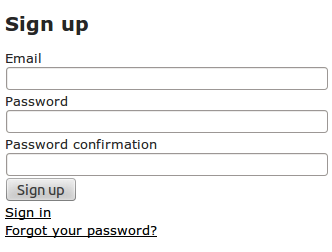
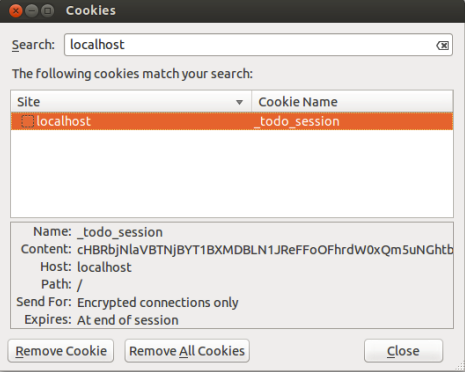

# Δημιουργώντας ασφαλείς εφαρμογές με τη  Ruby on Rails {#RubyOnRails}
© Γιάννης Κωστάρας

---

[🏠](https://jkost.github.io) | [⬆️](../../README.md) | [◀️](../RoR/README.md)

Στο προηγούμενο κεφάλαιο είδαμε πως μπορούμε να αναπτύξουμε εφαρμογές ιστού με τη βοήθεια της Ruby on Rails. Σ’ αυτό το κεφάλαιο θα φορέσουμε το καπέλο του χάκερ και θα δούμε πως μπορούμε να αποκτήσουμε μη εξουσιοδοτημένη πρόσβαση στην εφαρμογή, τον διακομιστή ή το λειτουργικό σύστημα που τρέχει την εφαρμογή ιστού. Καθώς και τι πρέπει να κάνουμε για να προστατέψουμε τα παραπάνω από τέτοιες ενέργειες.

Που είχαμε μείνει; Είχαμε δημιουργήσει μια εφαρμογή ιστού για διαχείριση έργων και στο τελευταίο βήμα ορίσαμε τη MySQL ως ΒΔ παραγωγής. Αυτό που ξεχάσαμε να πούμε είναι πώς να δηλώσουμε στη RoR να χρησιμοποιήσει τη ΒΔ παραγωγής. Αυτό γίνεται προσθέτοντας στο αρχείο ```config/environment.rb``` τη γραμμή:
```ruby
Rails.env=’production’
```
και επανεκκινώντας τον WEBrick.
Ελέγξτε αν η mysql τρέχει:
```bash
$ sudo netstat -tap | grep mysql
```
κι αν όχι ξεκινήστε τη:
```bash
$ service mysql restart
```
Αν θέλετε να δημιουργήσετε την εφαρμογή από την αρχή, τότε ακολουθήστε τα παρακάτω διορθωμένα βήματα από το προηγούμενο κεφάλαιο τα οποία δουλεύουν και με το Ubuntu 13.04:
```bash
$ sudo apt-get install ruby1.9.1 ruby1.9.1-dev
$ sudo apt-get install rubygems
$ sudo apt-get install nodejs
$ sudo gem sources -a http://gemcutter.org
$ sudo apt-get install sqlite3 libsqlite3-dev
$ sudo gem install sqlite3
$ sudo gem install rails
$ sudo apt-get install ruby-bundler
```
Με τα βήματα αυτά έχετε “στήσει” πλέον το σύστημά σας για να μπορείτε να “χτίσετε” την εφαρμογή ή να συνεχίσετε από εκεί που την αφήσατε. Στη συνέχεια θα υποθέσουμε ότι η εφαρμογή τρέχει στον υποθετικό ιστοτόπο [http://www.todo.gr](http://www.todo.gr). 

Μέχρι στιγμής ο μόνος χρήστης που μπορεί να προσθέσει/ενημερώσει έργα είναι ο ρόλος ```admin```. Ο ρόλος αυτός μπορεί πολύ εύκολα να παραβιαστεί κι ο επίδοξος χάκερ να αποκτήσει πλήρη πρόσβαση στην εφαρμογή και τη ΒΔ. Το ερώτημα είναι, ότι ένα ακριβό τείχος προστασίας (Firewall) κι ένα σύστημα ανίχνευσης (Intrusion Detection System) δεν αρκούν για να μας προστατεύσουν; Η απάντηση είναι ότι και τα δυο είναι άχρηστα στις κυβερνοεπιθέσεις που χρησιμοποιούν τις θύρες TCP ```80``` και ```443``` γιατί απλούστατα αυτές οι θύρες θα πρέπει να παραμείνουν πάντα ανοικτές!

## Ο χάκερ Μπάμπης
Το πρώτο πράγμα που παρατήρησε ο _ηθικός_ χάκερ Μπάμπης, ο οποίος “έπεσε” στην ιστοσελίδα μας, είναι ότι για την αυθεντικοποίηση δεν χρησιμοποιείται καν SSL (HTTPS). Χωρίς να ’χει πρόσβαση στο διακομιστή ή στον Η/Υ που φιλοξενεί την εφαρμογή, δοκιμάζει διάφορα εργαλεία για να βρει τον κωδικό του διαχειριστή. 

Ένα τέτοιο εργαλείο είναι το [Hydra](https://www.thc.org/thc-hydra/) (άλλα παρόμοια εργαλεία που θα μπορούσε να χρησιμοποιήσει είναι η [Medusa](http://foofus.net/goons/jmk/medusa/medusa.html) και το [ncrack](https://nmap.org/ncrack/)) το οποίο θα δοκιμάσει με τη σειρά διάφορους κωδικούς (brute force attack) (φυσικά μαντεύει ότι το όνομα χρήστη είναι ```admin```. Θα δοκιμάσει επίσης ```root, administrator``` κλπ.):
```bash
$ ./hydra -l admin -P Wordlists/LIST.txt
http://www.todo.gr:3000/tasks/new -t 30
Hydra v7.4.2 (c)2012 by van Hauser/THC & David Maciejak - for legal purposes only
Hydra (http://www.thc.org/thc-hydra) starting at 2013-07-10 20:15:52
[DATA] 30 tasks, 1 server, 4349 login tries (l:1/p:4349), ~144 tries per task
[DATA] attacking service http-get on port 3000
[STATUS] 1773.00 tries/min, 1773 tries in 00:01h, 2576 todo in 00:02h, 30 active
[3000][www] host: 192.168.156.145 login: admin password: admin
1 of 1 target successfully completed, 1 valid password found
Hydra (http://www.thc.org/thc-hydra) finished at 2013-07-10 20:17:34
```
Μετά από πολύ λίγο βρήκε τον κωδικό και μας τον έστειλε με email! Για να του τη σπάσουμε δοκιμάζουμε έναν πιο δύσκολο κωδικό. Αυτή τη φορά η εκτέλεση του παραπάνω προγράμματος θα επιστρέψει ```0 valid passwords found```. Πράγμα που σημαίνει, ότι είναι πολύ σημαντικό να θέτετε δύσκολους κωδικούς χρήστη.
Βέβαια, αυτά τα εργαλεία είναι τόσο αποτελεσματικά όσο και τα λεξικά (wordlists) που χρησιμοποιούν (```Wordlists/LIST.txt``` στο πιο πάνω παράδειγμα το οποίο ο Μπάμπης κατέβασε π.χ. από [9, 10]). Αν κάποιος που έχει το ρόλο ```admin``` συνδεθεί στην εφαρμογή π.χ. από κάποιο “ανοικτό” wifi αεροδρομίου ή internet cafe, στο οποίο, πολύ πιθανό, ο παροχέας της υπηρεσίας έχει εγκαταστήσει το κατάλληλο λογισμικό για να μπορεί να ανιχνεύει την κυκλοφορία δεδομένων, όπως θα δούμε παρακάτω, θα μπορούσε άνετα να υποκλέψει τον base64 κωδικό και να τον αποκωδικοποιήσει π.χ. [εδώ](https://www.base64decode.org/).
Η προστασία των δεδομένων θα πρέπει να ακολουθεί την τριάδα:

* ***Ε***μπιστευτικότητα (Confidentiality), η πληροφορία μπορεί να προσπελαστεί μόνο από εξουσιοδοτημένους χρήστες
* ***Α***κεραιότητα (Integrity), η πληροφορία δεν τροποποιείται από τρίτους κατά τη μετάδοση, αποθήκευση η ανάκτηση
* ***Δ***ιαθεσιμότητα (Availability), η πληροφορία διατίθεται μόνο στους εξουσιοδοτημένους χρήστες που τη ζήτησαν (ΕΑΔ ή CIA)!

Υπάρχουν διάφοροι τρόποι για να πετύχουμε ΕΑΔ:

* Αυθεντικοποίηση (authentication) χρηστών
* Εξουσιοδότηση (authorisation) δηλ. ποια δικαιώματα έχει ο χρήστης για να προσπελάσει κάποια πληροφορία
* Κρυπτογράφηση (encryption)
* Ψηφιακές υπογραφές (digital signatures)

## Προσθέτοντας αυθεντικοποίηση χρηστών 
Η αυθεντικοποίηση χρηστών περιλαμβάνει τα ακόλουθα βήματα:

1. _Εγγραφή (sign-up/register)_ νέου χρήστη με όνομα χρήστη, κωδικό πρόσβασης και διεύθυνση ηλεκτρονικού ταχυδρομείου
2. _Σύνδεση (login)_ εγγεγραμμένου χρήστη μετά από επιτυχή επιβεβαίωση ονόματος χρήστη και κωδικού.
3. _Περιορισμός πρόσβασης (access restriction)_ του χρήστη σε σελίδες που επιτρέπονται με βάση το ρόλο του
4. _Αποσύνδεση (logout)_ του συνδεδεμένου χρήστη από την εφαρμογή.

Σ’ αυτό το κεφάλαιο δε θα προχωρήσουμε στη δημιουργία των παραπάνω μόνοι μας [4, 5] αλλά θα χρησιμοποιήσουμε ένα από τα έτοιμα πακέτα αυθεντικοποίησης [3], μάλιστα το πιο διάσημο, το ```devise``` [6].

```bash
$ sudo gem install devise
```
Στη συνέχεια πρέπει να το δηλώσουμε στην εφαρμογή μας. Προσθέστε το στο ```Gemfile```:

```ruby
gem ’devise’
```
και στη συνέχεια εκτελέστε:

```bash
$ bundle install
```

Θα πρέπει να δείτε μια γραμμή:

```ruby
Using devise (2.2.4)
```

Ας ξεκινήσουμε λοιπόν με το ```devise```:

```bash
$ rails generate devise:install
```

Η εντολή σας αναφέρει 5 βήματα που πρέπει να κάνετε. Αγνοήστε τα βήματα 1 και 5 για την ώρα, το βήμα 2 το έχουμε ήδη κάνει, οπότε μένει να
κάνετε τα βήματα 3 και 4.
Στη συνέχεια πρέπει να δημιουργήσουμε το μοντέλο ```User```.

```bash
$ rails generate devise User is_admin:boolean
```

Ας δούμε τι δημιούργησε η παραπάνω εντολή:

```ruby
#app/models/user.rb
class User < ActiveRecord::Base
  # Include default devise modules. Others available are:
  # :token_authenticatable, :confirmable,
  # :lockable, :timeoutable and :omniauthable
  devise :database_authenticatable, :registerable,
    :recoverable, :rememberable, :trackable, :validatable
  # Setup accessible (or protected) attributes for your model
  attr_accessible :email, :password, :password_confirmation, :remember_me
  # attr_accessible :title, :body
end
```
και ο αντίστοιχος πίνακας που θα δημιουργηθεί φαίνεται εδώ:

```bash
db/migrate/xxxx_devise_create_users.rb
$ rake db:migrate
```

Για να δούμε τι νέες διαδρομές δημιουργήθηκαν:

```bash
$ rake routes
```

Οι διαδρομές που προστέθηκαν από το ```devise``` εμφανίζονται με το πρόθεμα ```’devise’```.

Δώστε στον αγαπημένο σας πλοηγό τη διεύθυνση: [http://localhost:3000/users/sign_up](http://localhost:3000/users/sign_up) και θα δείτε την παρακάτω εικόνα:



**Εικόνα 1** _Εγγραφή στη εφαρμογή todo_

Πλέον πρέπει να κάνουμε αρκετές αλλαγές στην εφαρμογή μας ώστε μόνο έγκυροι χρήστες να μπορούν να επεξεργάζονται έργα. Ας ξεκινήσουμε με το να παρέχουμε ένα υπερσύνδεσμο Sign out σε κάθε σελίδα. Θα δημιουργήσουμε μια μερική (partial) προβολή γι’ αυτό το σκοπό (```app/views/common/_session.html.erb```):

```html
<%- if user_signed_in? %>
  <p>Hello <%= current_user.email %><br />
  <%= link_to ’Sign out’, destroy_user_session_path, :method => :delete %></p>
<%- else %>
  <p>
  <%= link_to ’Register’, new_user_registration_path %> |
  <%= link_to ’Sign in’, new_user_session_path %>
  </p>
<%- end %>
```

και θα την εισάγουμε στο πρότυπο (```app/views/layouts/application.html.erb```):

```html
<div id=”sign_out”>
  <%= render ’common/session’ %>
</div>
```

ακριβώς κάτω από το ```<body>```.

Αν επαναφορτώσετε πάλι την τρέχουσα ιστοσελίδα της εφαρμογής ```todo``` θα δείτε στο πάνω μέρος κάτι σαν:

| Hello jkost@freemail.gr |
| Sign out |
| Welcome! You have signed up successfully. |

Η εφαρμογή πλέον γνωρίζει ποιος είσαι αλλά πρέπει να ξέρει και τι σου επιτρέπεται να κάνεις μ’ αυτή (authorisation). Δε θέλουμε λοιπόν όλοι οι χρήστες να μπορούν να επεξεργάζονται έργα, παρά μόνο όσοι χρήστες διαθέτουν το ρόλο ```admin```. Θέλουμε επομένως ένα φίλτρο που να εφαρμόζεται κατά την σύνδεση του χρήστη και να ελέγχει αν αυτός/-ή έχει το το πεδίο ```is_admin = true```. Θα πρέπει να εισάγουμε την παρακάτω μέθοδο (```app/controllers/application.rb```):

```ruby
class ApplicationController < ActionController::Base
  # Prevent CSRF attacks by raising an exception.
  # For APIs, you may want to use :null_session instead.
  protect_from_forgery with: :exception

  protected
  def authorize_admin!
    if user_signed_in? && current_user.is_admin
      return
    elsif user_signed_in?
      flash[:notice] = ’You must be an admin to be able to edit tasks’
      redirect_to :root
    else
      flash[:notice] = ’You need to sign in first’
      redirect_to new_user_session_path
    end
  end
end
```

και στη συνέχεια να αντικαταστήσουμε τη γραμμή βασικής αυθεντικοποίησης (```http_basic_authenticate_with```) με την ακόλουθη:

```ruby
# app/controllers/tasks_controller.rb
class TasksController < ApplicationController
  #http_basic_authenticate_with :name => ”admin”, :password => ”admin”, :except => [:index, :show]
  before_filter :authorize_admin!, :except => [:index, :show]
  before_action :set_task, only: [:show, :edit, :update, :destroy]
```

```ruby
# app/controllers/activities_controller.rb
class ActivitiesController < ApplicationController
  #http_basic_authenticate_with :name => ”admin”, :password => ”admin”, :only => :destroy
  before_filter :authorize_admin!, :only => :destroy
```

όπου η προηγούμενη συνθήκη αυθεντικοποίησης είναι σχολιασμένη για να δούμε τη διαφορά.

Ανανεώστε την ιστοσελίδα της εφαρμογής, συνδεθείτε ως μη διαχειριστής ή εγγραφείτε ως νέος χρήστης και προσπαθήστε να προσθέσετε ένα νέο έργο, να διαγράψετε ένα υπάρχον, ή να τροποποιήσετε ένα υπάρχον καθώς και να διαγράψετε μια δραστηριότητα. Η ενέργειά σας δε έχει ανταπόκριση και εμφανίζεται το μήνυμα:

| You must be an admin to be able to edit tasks |

Αλλά πώς μπορούμε να ορίσουμε κάποιον χρήστη ως διαχειριστή; Για την ώρα ο μόνος τρόπος είναι ν’ ανοίξουμε τη ΒΔ (```db/development.sqlite3```) εξωτερικά (π.χ. με το [πρόσθετο](https://addons.mozilla.org/en-US/firefox/addon/sqlite-manager/) του Firefox) και να τροποποιήσουμε το πεδίο ```is_admin``` κάποιου χρήστη σε ```1``` (```true```).
Αντίστοιχα αν δουλεύουμε με τη ΒΔ παραγωγής mysql. Μπορείτε να βρείτε τις ρυθμίσεις του ```devise``` στο αρχείο ```config/initializers/devise.rb```. Περισσότερα πάνω στην αυθεντικοποίηση στην ιστοσελίδα του [OWASP](https://www.owasp.org/index.php/Authentication_Cheat_Sheet). 

## Τα πιο συχνά προβλήματα ασφαλείας
Σύμφωνα με τον [OWASP](https://www.owasp.org/index.php/Authentication_Cheat_Sheet), οι [δέκα](https://www.owasp.org/index.php/Top_10_2013-Top_10) πιο συχνές ευπάθειες ασφαλείας (vulnerabilities) είναι:

1. Injection ([SQL](https://www.owasp.org/index.php/SQL_Injection), XML κλπ.)
2. [Λανθασμένη αυθεντικοποιήση](https://www.owasp.org/index.php/Authentication_Cheat_Sheet) και [διαχείριση συνεδριών (session management)](https://www.owasp.org/index.php/Session_Management_Cheat_Sheet)
3. [Cross-site Scripting (XSS)](https://www.owasp.org/index.php/Cross-site_Scripting_(XSS))
4. Ανασφαλής άμεση αναφορά αντικειμένου
5. Ανασφαλής κρυπτογράφηση ή διαφύλαξη κλειδιών
6. Διαρροή πληροφορίας και λαθεμένη διαχείριση λαθών
7. [Εκτέλεση κακόβουλου αρχείου](https://www.owasp.org/index.php/Command_Injection)
8. [Cross-site Request Forgery (CSRF)](https://www.owasp.org/index.php/Cross-Site_Request_Forgery_(CSRF))
9. Χρήση προγραμμάτων που έχουν ευπάθειες
10. [Αποτυχία περιορισμού πρόσβασης URL](https://www.owasp.org/index.php/Unvalidated_Redirects_and_Forwards_Cheat_Sheet)

Θα αναλύσουμε κάποιες, αλλά όχι όλες, από τις παραπάνω στη συνέχεια.

## Ενέσεις SQL (SQL Injection)
Ανάλογα με το ΣΔΒΔ που χρησιμοποιείτε υπάρχουν κι οι αντίστοιχες [ευπάθειες](http://www.sqlinjectionwiki.com/Categories.aspx?catId=5#ReferencesSQLInjectionExploitationTools) (βλ. και αναφορές [13-14]). Ο χάκερ Μπάμπης χρησιμοποιεί το [sqlmap](http://sqlmap.org/) γι’ αυτό το σκοπό (απαιτεί Python 2.7.x) (εσείς δοκιμάστε [https://localhost:3000](https://localhost:3000)):

```bash
$ ./sqlmap.py -u www.todo.gr -b -f
$ ./sqlmap.py -u www.todo.gr -o --passwords
$ ./sqlmap.py -u www.todo.gr -o --tables -D production
$ ./sqlmap.py -u www.todo.gr -o --columns -D production -T user
$ ./sqlmap.py -u www.todo.gr -o --dump -D production -T user
```

αλλά ευτυχώς χωρίς αποτέλεσμα.
Δοκιμάζει και το πρόσθετο για Firefox [SQL Inject Me](https://addons.mozilla.org/en-US/firefox/addon/sql-inject-me/) [13] σ’ όλες τις φόρμες της εφαρμογής (συνολικά 102 κυβερνοεπιθέσεις) χωρίς αποτέλεσμα.

Επισκεφθείτε και την ιστοσελίδα [http://rails-sqli.org](http://rails-sqli.org) αφιερωμένη ειδικά για SQLI για τη RoR. Μια πρόσφατη ευπάθεια (για εφαρμογές που χρησιμοποιούν AuthLogic κι όχι Devise) περιγράφεται [εδώ](blog.phusion.nl/2013/01/03/rails-sql-injection-vulnerability-hold-your-horses-here-are-the-facts/#.UOXr-j9680w) και από [εδώ](https://github.com/phusion/rails-cve-2012-5664-test) μπορείτε να κατεβάσετε μια εφαρμογή που την αναπαριστά.

## Cross Site Scripting (XSS)
Ο Μπάμπης θα δοκιμάσει και πάλι να “σπάσει” την εφαρμογή. Χωρίς να εγγραφεί στην εφαρμογή, θα προσπαθήσει να βρει ευπάθειες. Προσπαθεί να δημιουργήσει ένα νέο έργο, να διαγράψει/επεξεργαστεί ένα υπάρχον, αλλά η εφαρμογή του ζητάει να εγγραφεί. Βρίσκει όμως την πρώτη ευπάθεια· μπορεί να δημιουργήσει ενέργειες κι αυτό κάνει:

| Description: <script>alert(”GOTCHA!”)</script> |
| Assignee: b9b1s |

Θέλει να δει αν μπορεί να εκτελέσει συνεδρίες Javascript. Ευτυχώς αποδεικνύεται πως όχι. Ο κώδικας Javascript αποθηκεύεται ως απλό κείμενο, διαφορετικά, κάθε φορά που ένας επισκέπτης επισκέπτεται τη σελίδα θα εμφανιζόταν ένα διαλογικό παράθυρο με το μήνυμα GOTCHA! Με αυτό τον τρόπο θα μπορούσε να εκτελέσει σκριπτάκια XSS σε ανυποψίαστους χρήστες. Το πρόβλημα εντοπίζεται από τους προγραμματιστές και διορθώνεται εύκολα:

```ruby
class ActivitiesController < ApplicationController
  #http_basic_authenticate_with :name => ”admin”, :password => ”admin”, :only => :destroy
  before_filter :authorize_admin!, :only => [:create, :destroy]
```

Από την έκδοση RoR 3.0 και μετά παρέχεται εξ’ ορισμού προστασία έναντι XSS. Εντολές ή ετικέτες απενεργοποιούνται (escape) από τα αλφαριθμητικά (strings) προτού σταλούν στον πλοηγό. Αποφύγετε πάσι θυσία την εντολή ```raw```, όπως π.χ. ```<%= raw @task.description %>``` και προσέξτε σε τι ιστοτόπους συνδέεστε με την εντολή ```link_to```, π.χ. ```<%= link_to ”User Website”, user.website %>``` όπου ```user.website``` μπορεί να είναι:

```html
<a href=”javascript:alert(document.cookie)”>User Website</a>
```

Το OWASP παρέχει κι αυτή την πολύ καλή [ιστοσελίδα](https://www.owasp.org/index.php/XSS_Filter_Evasion_Cheat_Sheet) σχετικά με το θέμα. Θεωρητικά, το πρόβλημα έχει λυθεί από το [2009](http://googleonlinesecurity.blogspot.de/2009/03/reducing-xss-by-way-of-automatic.html). 

Υπάρχει ένας μηχανισμός που σας επιτρέπει να πείτε στον πλοηγό σας τι μέρη της ιστοσελίδας είναι “καλά” και τι όχι. Ο μηχανισμός αυτός λέγεται
[Content Security Policy](www.html5rocks.com/en/tutorials/security/content-security-policy/) και μπορείτε να τον ενεργοποιήσετε ως εξής (```app/controllers/application_controller.rb```)

```ruby
# Content Security Policy
def set_headers
response.headers[’Content-Security-Policy’] = ”default-src ’none’; script-src ’self’; style-src https://www.todo.gr”
end
```

όπου μπορείτε να παραμετροποιήσετε με τις ακόλουθες οδηγίες:

* ```default-src```
* ```style-src```
* ```frame-src```
* ```script-src```
* ```img-src```
* ```font-src```
* ```object-src```
* ```media-src```
* ```report-uri``` (αναφέρει για παραβιάσεις των οδηγιών)

κλπ. Προσέξτε ότι ```default-src``` είναι ```’none’``` πράγμα που σημαίνει ότι δεν επιτρέπουμε τίποτα που θα μπορούσε να εισάγει περιεχόμενο στη σελίδα
μας. Περιεχόμενο που δεν ανήκει στους ιστοτόπους που περιγράφουμε απλά δεν εκτελείται καν από τον πλοηγό. Στη συνέχεια, ενεργοποιούμε την πολιτική αυτή στους ελεγκτές μας ως εξής:
```
app/controllers/tasks_controller.rb &
app/controllers/activities_controller.rb
```

```ruby
before_filter :set_headers
```

Θα πρέπει να ’χετε υπόψιν όμως ότι inline Javascript (και CSS) δεν θα δουλέψει με CSP και καλό είναι να την εξάγετε σ’ ένα ```.js (.css)``` αρχείο. Χρήσιμο είναι και αυτό το [άρθρο](https://www.html5rocks.com/en/tutorials/security/content-security-policy/).

## Cross-site Request Forgery (CSRF)
Κάποιος χρήστης συνδέεται στον ιστοτόπο μας. Χωρίς να αποσυνδεθεί, συνδέεται σε μια ιστοσελίδα του χάκερ Μπάμπη. Η ιστοσελίδα αυτή περιέχει μια εικόνα:
`````` η οποία θα διαγράψει το 1ο έργο του χρήστη όταν αυτός την ανοίξει. (Στην έκδοση Rails 3 και μετά το συγκεκριμένο url δε δουλεύει καθώς η διαγραφή γίνεται με το ρήμα ```rest DELETE```). Ο λόγος είναι ότι σε κάθε συναλλαγή με το διακομιστή, ο πλοηγός του χρήστη στέλνει και το κουλουράκι που περιέχει την ταυτότητα συνεδρίας (session id), και καθώς η συνεδρία είναι ακόμα ανοιχτή, θα ’χει ως αποτέλεσμα η εντολή να εξυπηρετηθεί κανονικά από τον Webrick. Φυσικά, ο χρήστης μπορεί να μην καταλάβει τίποτα, αλλά την επόμενη φορά που θα επισκεφθεί τον
ιστοτόπο μας todo.gr για να δει τα έργα του, θα παρατηρήσει ότι το πρώτο από αυτά έχει σβηστεί. Αν και το παραπάνω URL δεν θα εκτελεστεί στην έκδοση Rails 4, υπάρχουν πολλά άλλα scripts ή πειραγμένες διευθύνσεις που μπορεί να σκαρφιστεί ο Μπάμπης για να μπορέσει π.χ. να σας υποκλέψει το κουλουράκι σας.

Ευτυχώς, η RoR έχει προνοήσει για τέτοιου είδους επιθέσεις:

```ruby
class ApplicationController < ActionController::Base
  # Prevent CSRF attacks by raising an exception.
  # For APIs, you may want to use :null_session instead.
  protect_from_forgery with: :exception
```

Επίσης, οι πρόσφατες εκδόσεις του Devise φαίνεται να ’χουν διορθώσει τέτοιες [ευπάθειες](http://blog.plataformatec.com.br/2013/08/csrf-token-fixation-attacks-in-devise/). Προσοχή όμως, ευπάθειες XSS μπορούν να ξεπεράσουν τις όποιες προστασίες απέναντι σε CSRF.

## Προστασία διακομιστή
Πλέον οι διακομιστές (web servers) είναι αυτοί που δέχονται τις περισσότερες κυβερνοεπιθέσεις. Επίσης, σ’ αυτούς εγκαθίστανται διάφορες εφαρμογές ιστού οι οποίες πολλές φορές διαθέτουν κενά ασφαλείας που εκμεταλλεύονται επίδοξοι χάκερς για ν’ αποκτήσουν πρόσβαση στον διακομιστή κι από κει στο λειτουργικό σύστημα ή το εσωτερικό δίκτυο. 

Με άλλα λόγια, θα πρέπει να προστατεύσουμε τόσο τον ίδιο το διακομιστή όσο και τις εφαρμογές που είναι εγκατεστημένες σ’ αυτόν. Οι εταιρίες και οι οργανισμοί δώσανε μεγαλύτερο βάρος τα τελευταία χρόνια στην προστασία του λειτουργικού συστήματος και του δικτύου παρά στους διακομιστές και τις διαδικτυακές εφαρμογές.

Ουσιαστικά, η προστασία πρέπει να ξεκινήσει από τον διακομιστή και ν’ ακολουθήσουν οι εφαρμογές που είναι εγκατεστημένες σ’ αυτόν. Ελέγξτε το διακομιστή σας για γνωστές ευπάθειες σε ιστοτόπους όπως αυτός [εδώ](https://www.cvedetails.com/vulnerability-list.php?vendor_id=7851&product_id=0&version_id=0&page=1&hasexp=0&opdos=0&opec=0&opov=0&opcsrf=0&opgpriv=0&opsqli=0&opxss=0&opdirt=0&opmemc=0&ophttprs=0&opbyp=0&opfileinc=0&opginf=0&cvssscoremin=0&cvssscoremax=0&year=0&month=0&cweid=0&order=2&trc=2&sha=511f30f7921b1cb064f8ddc882769f33a110c8d0) κι [εδώ](https://cve.mitre.org/cgi-bin/cvename.cgi?name=CVE-2010-0541).

Κατά πρώτον, θα πρέπει να ενημερώνετε τον διακομιστή σας (Webrick στο παράδειγμά μας) με patches που διορθώνουν κενά ασφαλείας. Παρόλ’ αυτά δε σημαίνει ότι θα πρέπει να εγκαθιστάτε οποιοδήποτε μπάλωμα βγαίνει στα τυφλά αλλά θα πρέπει να το ελέγχεται προτού το εγκαταστήσετε στο διακομιστή παραγωγής.
Κατόπιν, θα πρέπει να απεγκαταστήσετε όσες από τις εξ’ ορισμού εφαρμογές δε χρειάζονται. Ιδανικά, ο διακομιστής σας θα πρέπει να έχει μόνο την εφαρμογή ιστού που φιλοξενεί και τίποτ’ άλλο που θα μπορούσε να αποβεί χρήσιμο σε επίδοξους χάκερ. Επίσης, θα πρέπει να απεγκαταστήσετε και όποιες υπηρεσίες και προγράμματα δε χρειάζονται από το Λ.Σ. του Η/Υ παραγωγής καθώς και λογαριασμούς χρηστών που δεν είναι απαραίτητοι. Για τους υπόλοιπους, και κυρίως για των διαχειριστών και του υπερχρήστη, χρησιμοποιήστε πολύ ισχυρούς κωδικούς. Απενεργοποιήστε την απομακρυσμένη πρόσβαση αν δεν είναι απαραίτητη (π.χ. X-Windows, VNC κλπ.). Αντί των FTP, telnet, χρησιμοποιήστε SSH, SFTP ή FTPS για να συνδεθείτε απομακρυσμένα με το διακομιστή.

Υπάρχουν διάφορα εργαλεία για να ελέγξετε την ασφάλεια του συστήματός σας, όπως:

* [IBM Internet Security Scanner](http://www.iss.net)
* [Retina Network Security Scanner](http://www.eeye.com)
* [Nessus](http://www.nessus.org)
* [Tripwire](http://www.tripwire.com)
* [Brakeman](http://brakemanscanner.org) ειδικά για RoR
* [Codesake-dawn](http://rubygems.org/gems/codesake-dawn) RoR

Π.χ. το εμπορικό πρόγραμμα Tripwire σας επιτρέπει να δείτε ποια αρχεία άλλαξαν από την προηγούμενη φορά που δημιουργήσατε μια καλή κατάσταση του διακομιστή σας. Μπορεί να σας στέλνει αναφορές μέσω Η/Τ ανά τακτά χρονικά διαστήματα με τις αλλαγές/προσθήκες/διαγραφές στο διακομιστή παραγωγής. Στο τέλος της ενότητας δίνουμε ένα παράδειγμα του brakeman.

Επίσης, θα πρέπει να ενεργοποιήσετε HTTPS. Υπάρχουν πολλοί λόγοι γι’ αυτό. Χωρίς SSL (HTTPS ή Secure HTTP) ο πλοηγός σας ανταλλάσσει πληροφορίες με τον διακομιστή WebBrick χωρίς κρυπτογράφηση. Έτσι, όποιος παρακολουθεί το δίκτυο μπορεί πολύ εύκολα να διαβάσει π.χ. το όνομα χρήστη και τον κωδικό σας αφού αυτά μεταδίδονται χωρίς κρυπτογράφηση. 

Εργαλεία όπως το [WebScarab](https://www.owasp.org/index.php/Category:OWASP_WebScarab_Project), το [Burp](https://portswigger.net/burp/), αλλά και sniffers όπως [WireShark](https://www.wireshark.org/), [Ettercap](http://www.ettercap-project.org/ettercap/), [snoop](http://www.softpanorama.org/Net/Sniffers/snoop.shtml), [tcpdump](http://www.tcpdump.org/) αποτελούν κοινά εργαλεία για τις “ευπάθειες του ενδιάμεσου” (“man-in-the-middle attacks”). Κι αν νομίζετε ότι είναι πολύ δύσκολο να σπάσουν το wifi σας ή της εταιρείας σας, την επόμενη φορά που θα συνδεθείτε στο πρώτο ανοικτό wifi στο αεροδρόμιο, ή σε κάποιο Internet cafe, σκεφτείτε πολύ καλά τι προγράμματα μπορεί να χρησιμοποιούν όποιοι σας προσφέρουν “δωρεάν” σύνδεση για να μπορέσουν να σας υποκλέψουν πληροφορίες όπως τους κωδικούς σας (ιδιαίτερα αν συνδέεστε σε μη ασφαλείς – βλ. χωρίς HTTPS) διακομιστές αλλά και τη συνεδρία σας (session hijacking).

Αλλά τι εννοούμε με τον όρο _συνεδρία (session)_; Το πρωτόκολλο HTTP δε θυμάται καταστάσεις (είναι εξ’ ορισμού stateless). Δηλ. ο πλοηγός κάνει μια αίτηση στο διακομιστή και ο διακομιστής στέλνει μια απάντηση. Από εκεί και πέρα, ο διακομιστής δε θυμάται τίποτ’ άλλο για τον πελάτη-πλοηγό. Αλλά τότε, πώς μπορούμε π.χ. να κάνουμε ηλεκτρονικές αγορές; Στις ηλεκτρονικές αγορές, πλοηγούμαστε σε πολλές σελίδες και γεμίζουμε το ηλεκτρονικό καλάθι μας με προϊόντα. Αφού ο διακομιστής μας “ξεχνάει” μετά από κάθε ιστοσελίδα, πώς μπορεί να θυμάται τι έχουμε στο καλάθι μας;

Η λύση είναι οι συνεδρίες με τις οποίες ο διακομιστής σας “θυμάται”. Αυτό επιτυγχάνεται συνήθως με τα ... κουλουράκια (cookies), δηλ. μικρά αρχεία
κειμένου που αποθηκεύει ο πλοηγός σας στο σκληρό σας δίσκο και τα στέλνει κάθε φορά στο διακομιστή. Τα κουλουράκια σας χαρακτηρίζουν μοναδικά κι έτσι ο διακομιστής ξέρει ότι είστε πάλι εσείς που τον ενοχλείτε (δηλ. ο πλοηγός σας) και θυμάται τις προτιμήσεις σας. Στη RoR η συνεδρία είναι συνήθως ένας 32-bit κωδικός MD5 (δηλ. αυτό που αποθηκεύεται στο cookie). Μετά τη σύνδεσή σας με το διακομιστή από τη σελίδα σύνδεσης (login/password), χρησιμοποιείται μια συνεδρία κάθε φορά που επισκέπτεστε μια άλλη ιστοσελίδα του ιστοτόπου χωρίς να χρειάζεται κάθε φορά να δίνετε πάλι το όνομα χρήστη και τον κωδικό σας. Αν κάποιος σας υποκλέψει το κουλουράκι που χρησιμοποιείτε για τη συνεδρία τότε θα μπορέσει να συνδεθεί ως εσείς ακόμα και χωρίς να γνωρίζει το όνομα χρήστη και τον κωδικό σας!

Στον Firefox, κάνοντας κλικ πάνω στην υδρόγειο σφαίρα στα αριστερά της διεύθυνσης URL [http://localhost:3000](http://localhost:3000), ή από το μενού **Tools → Page Info**, εμφανίζεται το παράθυρο **Page Info** με ενεργοποιημένη την καρτέλα **Security**. Πατώντας στο κουμπί **View Cookies** και φιλτράροντας το διαλογικό παράθυρο Cookies ως προς “localhost” βλέπουμε το κουλουράκι που αποθήκευσε η εφαρμογή μας στον πλοηγό μας (βλ. Εικόνα 2).



**Εικόνα 2** _Κουλουράκι στον firefox_

Ο χάκερ Μπάμπης θα δοκιμάσει να δει αν διατηρείται η συνεδρία αφού αποσυνδεθεί. Αφού εγγραφεί και συνδεθεί στην εφαρμογή todo, θα μεταφερθεί στην αρχική σελίδα και θα την αποθηκεύσει στ’ αγαπημένα. Θα μεταφερθεί στη σελίδα προβολής ενός έργου και πάλι θ’ αποθηκεύσει τη σελίδα στ’ αγαπημένα. Στη συνέχεια θ’ αποσυνδεθεί και θα δοκιμάσει τους δυο σελιδοδείκτες. Ευτυχώς, η συνεδρία (session) δε διατηρείται κι ο Μπάμπης θα χρειαστεί να ξανασυνδεθεί στην εφαρμογή.

Πώς μπορούμε λοιπόν να ενεργοποιήσουμε SSL στο διακομιστή μας; Κατ’ αρχήν θα πρέπει να δημιουργήσετε ένα πιστοποιητικό κι ένα [κλειδί](http://www.zunisoft.com/2008/12/kb-webrick-ssl-configuration.html):

```bash
$ hostname
ubuntu
$ mkdir config/certs
$ cd config/certs
$ openssl genrsa -des3 -out server.key 2048
Generating RSA private key, 2048 bit long modulus .................
...............................................................
......................................+++ .....+++ e is 65537 (0
x10001) Enter pass phrase for server.key: Verifying - Enter pass
phrase for server.key:
$ openssl req -new -key server.key -out server.csr
Enter pass phrase for server.key:
...
Common Name (e.g. server FQDN or YOUR name) []:ubuntu
...
$ cp server.key server.key.org
$ openssl rsa -in server.key.org -out server.key
Enter pass phrase for server.key.org:
writing RSA key
$ openssl x509 -req -days 365 -in server.csr -signkey server.key -out server.crt
Signature ok subject=/C=GR/ST=Some-State/O=Internet Widgits Pty Ltd/
CN=ubuntu
Getting Private key
$ rm server.csr server.key.org
```
Στη συνέχεια δημιουργήστε ένα νέο εκτελέσιμο αρχείο ```bin/ssl_rails```:

```ruby
#!/usr/bin/env ruby
require ’rubygems’
require ’rails/commands/server’
require ’rack’
require ’webrick’
require ’webrick/https’
module Rails
  class Server < ::Rack::Server
    def default_options
      super.merge({
        :Port => 3000, # Specify the port here
        :environment => (ENV[’RAILS_ENV’] || ”development”).dup,
        :daemonize => false,
        :debugger => false,
        :config => File.expand_path(”config.ru”),
        :SSLEnable => true,
        :SSLVerifyClient => OpenSSL::SSL::VERIFY_NONE,
        :SSLPrivateKey => OpenSSL::PKey::RSA.new( File.open(”config/certs/server.key”).read),
        :SSLCertificate => OpenSSL::X509::Certificate.new(File.open(”config/certs/server.crt”).read), :SSLCertName => [[”CN”,     WEBrick::Utils::getservername]]
      })
    end
  end
end
APP_PATH = File.expand_path(’../../config/application’, __FILE__)
require_relative ’../config/boot’
require ’rails/commands’
```

Πλέον μπορείτε να εκκινήσετε τον webrick με την εντολή:

```bash
$ bundle exec ruby bin/ssl_rails s
=> Booting WEBrick
=> Rails 4.0.4 application starting in development on https://0.0.0.0:3000
=> Run ‘rails server -h‘ for more startup options
=> Ctrl-C to shutdown server
[2014-03-27 22:44:09] INFO WEBrick 1.3.1
[2014-03-27 22:44:09] INFO ruby 1.9.3 (2012-04-20) [x86_64-linux]
[2014-03-27 22:44:09] INFO
Certificate:
  Data:
    Version: 1 (0x0)
    Serial Number: 10668835244306579996 (0x940f5120f80fc21c)
  Signature Algorithm: sha1WithRSAEncryption
    Issuer: C=GR, ST=Some-State, O=Internet Widgits Pty Ltd, CN=ubuntu
    Validity
      Not Before: Mar 24 21:12:32 2014 GMT
      Not After : Mar 24 21:12:32 2015 GMT
    Subject: C=GR, ST=Some-State, O=Internet Widgits Pty Ltd, CN=ubuntu
    Subject Public Key Info:
      Public Key Algorithm: rsaEncryption
        Public-Key: (2048 bit)
        Modulus:
          ... WEBrick::HTTPServer#start: pid=3000 port=3000
```

Επειδή το πιστοποιητικό το δημιουργήσαμε οι ίδιοι και δεν το αγοράσαμε από κάποιον οργανισμό πιστοποιητικών (Certification Authority) όπως η
[Verisign](www.verisign.com) ή το [StartSSL](https://www.startssl.com/), ο πλοηγός σας θα σας προειδοποιήσει γι’ αυτό και θα πρέπει να προσθέσετε μια εξαίρεση (exception) για να προχωρήσετε. Το λουκετάκι δίπλα στη διεύθυνση [https://localhost:3000](https://localhost:3000) στον πλοηγό δηλώνει ότι η σύνδεση είναι ασφαλής. Κάνοντας κλικ πάνω του, εμφανίζεται το διαλογικό παράθυρο Page Info, όπως είδαμε προηγούμενα, και πατώντας το κουμπί View Certificate μπορούμε να δούμε περισσότερες πληροφορίες για το πιστοποιητικό που δημιουργήσαμε.

Αν θέλετε να έχετε παντού ενεργοποιημένο το SSL τότε φροντίστε να το δηλώσετε στον Webrick (```config/environments/development.rb```):

```
config.force_ssl = true
```

και φυσικά και στο ```config/environments/production.rb``` το οποίο στην ουσία ενεργοποιεί [Strict Transport Security](https://www.html5rocks.com/en/tutorials/security/transport-layer-security/).

Επίσης καλό είναι να δηλώσετε ότι θέλετε μόνο HTTPS κι εδώ (```app/controllers/application_controller.rb```):

```ruby
# Content Security Policy
def set_csp
  response.headers[’Content-Security-Policy’] = ”default-src https;
  script-src ’self’; style-src https://www.todo.gr”
end
```

αλλάζοντας το ```’none’``` σε ```https```.

Καλό είναι να θυμάστε τα εξής για τα κουλουράκια:
* το μέγεθός τους δεν υπερβαίνει τα 4 Kb
* αποθηκεύονται στον πλοηγό χωρίς κρυπτογράφηση (κωδικοποιούνται απλώς με κωδικοποίηση Base64) και γι’ αυτό συνιστάται να μην αποθηκεύετε κωδικούς, αρ. πιστωτικών καρτών κλπ. σ’ αυτά
* για να αποφευχθεί παραβίαση του κώδικα κατακερματισμού (hash tampering), δηλ. να μην μπορεί να ξαναχρησιμοποιήσει κάποιος άλλος το κουλουράκι για να συνδεθεί στην ίδια συνεδρία, προστίθεται στο τέλος του μια _σύνοψη (digest)_ που επιτρέπει να ελεγχθεί η εγκυρότητα της συνεδρίας. Ένας τυχαίος αριθμός (π.χ. ο τρέχων χρόνος) αποθηκεύεται επίσης στο κουλουράκι για να αποφευχθεί επαναχρησιμοποίηση του κουλουρακίου.

Θέτοντας (```config/initializers/session_store.rb```):

```ruby
Todo::Application.config.session_store :cookie_store, key: ’_todo_session’, :httponly => true
```

και επανεκκινώντας τον Webrick δηλώνετε ότι κώδικας javascript που εκτελείται στον πλοηγό δεν μπορεί να προσπελάσει τα κουλουράκια σας.

Οι χάκερ χρησιμοποιούν κι ένα άλλο κόλπο όμως. Αντί να προσπαθούν να αντιγράψουν το κουλουράκι σας, μπορούν να “υποχρεώσουν“ τον πλοηγό σας να χρησιμοποιήσει μια προκαθορισμένη συνεδρία που την έχουν δημιουργήσει οι ίδιοι. Η ευπάθεια αυτή ονομάζεται Session Fixation. Ο χάκερ συνδέεται στην εφαρμογή μας και λαμβάνει ένα κουλουράκι που περιέχει το session id. Στη συνέχεια, π.χ. με XSS (αν έχει καταφέρει), θέτει αυτό το κουλουράκι στον πλοηγό σας:

```
<script>document.cookie=”_session_id=16d5b78abb28e3d6206b60f22a03c8d9”;</script>.
```

Όταν ο χρήστης συνδεθεί στην εφαρμογή μας, θα χρησιμοποιεί το ίδιο session id με τον χάκερ. Ο οδηγός της αναφοράς [1] αναφέρει ως λύση την εντολή ```reset_session``` μετά από κάθε σύνδεση και δημιουργία νέου. Οι πρόσφατες εκδόσεις devise έχουν διορθώσει αυτήν την [ευπάθεια](http://blog.plataformatec.com.br/2010/11/session-fixation-vulnerability-in-devise/). Περισσότερα στην ιστοσελίδα του [OWASP](https://www.owasp.org/index.php/Session_Management_Cheat_Sheet).

Βέβαια, δεν αρκεί να ενεργοποιήσετε SSL, θα πρέπει να προστατέψετε και την πρόσβαση στον διακομιστή και την εφαρμογή ιστού. Κατ’ αρχήν, καλό είναι να δημιουργήσετε ένα νέο χρήστη (από το Users and Groups), π.χ. ```webrick``` που ν’ ανήκει σε μια νέα ομάδα π.χ. ```webrick``` και αφαιρέστε όλα τα προνόμια από την ομάδα ```webrick```. (Αν σας λείπει το παλιό: ```sudo apt-get install gnome-system-tools```)

```
$ su – webrick
Password:
$ groups
webrick
$ exit
$ sudo cp -r todo /home/webrick/todo
$ sudo chown -R webrick:webrick /home/webrick/todo
$ su - webrick
$ sudo chmod 500 todo
```

επιτρέποντας έτσι μόνο ```r-x``` permissions στο χρήστη ```webrick```. Δώστε ιδιαίτερη προσοχή στα δικαιώματα των ακόλουθων ευαίσθητων, από πλευράς
ασφαλείας, αρχεία: 

```
config/database.yml 
config/initializers/devise.rb
config/initializers/secret_token.rb
db/seeds.rb
db/development.sqlite3
```

Ανάλογα βήματα μπορείτε να ακολουθήσετε αν χρησιμοποιείτε άλλους διακομιστές όπως ο [Thin](http://code.macournoyer.com/thin/) ή ο [Mongrel](https://github.com/mongrel/mongrel) οι οποίοι είναι και πιο γρήγοροι από τον Webrick.

## Εργαλεία ελέγχου ευπαθειών
Ας δούμε τι ευπάθειες θα βρει το brakeman:

```
$ cd todo
$ brakeman
...
+SUMMARY+ +-------------------+-------+ | Scanned/Reported | Total | 
+-------------------+-------+ | Controllers | 3 | |
Models | 3 | | Templates | 9 | |
Errors | 0 | | Security Warnings | 1 (1) |
+-------------------+-------+ +-----------------+-------+ |
Warning Type | Total | +-----------------+-------+ | Session
Setting | 1 | +-----------------+-------+ +SECURITY WARNINGS
+
+------------+-------+--------+-----------------+----------------------------------------------------+
| Confidence | Class | Method | Warning Type | Message |
+------------+-------+--------+-----------------+----------------------------------------------------+
| High | | | Session Setting | Session
secret should not be included in version control near line 12 |
+------------+-------+--------+-----------------+----------------------------------------------------+
```

Aπλά σας ζητάει να αποκλείσετε το ```config/initializers/secret_token.rb``` από το σύστημα διαχείρισης εκδόσεων (version control) που χρησιμοποιείτε (π.χ. να το προσθέσετε στο ```.gitignore``` ή ```.hgignore``` αν χρησιμοποιείτε git ή mercurial αντίστοιχα). Άλλα εργαλεία που μπορείτε να  χρησιμοποιήσετε, είναι τα [OpenVas](http://www.openvas.org/) και [ZAP](https://github.com/zaproxy/zaproxy) [15].

## Επίλογος
Σ’ αυτό το άρθρο είδαμε πως μπορούμε να προστατεύσουμε τις εφαρμογές μας ιστού από επίδοξους χάκερς. Η προστασία που θα πρέπει να παρέχουμε πρέπει να ’ναι πολυεπίπεδη, δηλ.:

* προστασία Λ.Σ.
* προστασία διακομιστή
* προστασία ΣΔΒΔ
* προστασία εφαρμογής ιστού

Μιλήσαμε για τις 10 πιο συχνές ευπάθειες ασφαλείας του OWASP και αναλύσαμε τις εξής: XSS, CSFP και SQLI. Είδαμε δυο “θεραπείες” ενάντια σε XSS:

* httponly
* Content Security Policy

ενώ ο ενδιαφερόμενος αναγνώστης θα μπορούσε να κοιτάξει και μια τρίτη, την X-XSS-Protection. Π.χ. θα μπορούσαμε να προσθέσουμε κι άλλες κεφαλίδες ως εξής [14] (```app/controllers/application_controller.rb```):

```ruby
# Content Security Policy, X-XSS-Protection, X-Frame-Options
def set_headers
  response.headers[’Content-Security-Policy’] = ”default-src ’none’;
  script-src ’self’; style-src https://www.todo.gr”
  response.headers[’X-XSS-Protection’] = ’1’
  response.headers[’X-Frame-Options’] = ’SAMEORIGIN’
end
```

όπου ```X-Frame-Options``` προστατεύει από [clickjacking](https://cure53.de/xfo-clickjacking.pdf). Μπορείτε να την ενεργοποιήσετε καθολικά προσθέτοντας την παρακάτω γραμμή στο ```config/environments/development.rb``` & ```production.rb```

```ruby
config.action_dispatch.default_headers[’X-Frame-Options’] = ’SAMEORIGIN’
```

Είδαμε ακόμα πως να ενεργοποιήσουμε SSL (προσοχή στην πρόσφατη ευπάθεια με [openssl](http://seclists.org/fulldisclosure/2014/Apr/231)) και να προστατέψουμε την πρόσβαση στον Webrick. Απλά “ξύσαμε” την κορυφή του παγόβουνου του τεράστιου θέματος που λέγεται ασφάλεια εφαρμογών και πήρατε μια ιδέα εννοιών και πραγμάτων που πρέπει να ’χετε υπόψιν σας.

Η RoR παρέχει γενικά καλή προστασία ενάντια πολλών ευπαθειών που πρέπει να απασχολούν τους προγραμματιστές άλλων γλωσσών προγραμματισμού. Βέβαια αυτό δεν σημαίνει ότι πρέπει να επαναπαύεστε αλλά θα πρέπει να σιγουρευτείτε ότι καλύπτεστε τουλάχιστο από τις 10 ευπάθειες του OWASP προτού θεωρήσετε ότι έχετε πετύχει κάποιο ικανοποιητικό επίπεδο ασφαλείας και να δοκιμάσετε κάποιες από τις επικεφαλίδες που περιγράφονται στην αναφορά [16].

Υπάρχουν πολλά που δεν καλύφθηκαν από αυτό το άρθρο λόγω έλλειψης χώρου και χρόνου και από το γεγονός ότι το θέμα είναι απλά τεράστιο. Το
άρθρο δεν πέτυχε το στόχο του να αποτελέσει ένα απλό κείμενο αντιμετώπισης κοινών ευπαθειών, αλλά προσπάθησε. 

Τέλος, αν θέλετε να προχωρήσετε περαιτέρω την ανάπτυξη της εφαρμογής, θα πρέπει να αλλάξετε το μοντέλο ώστε κάθε χρήστης να μπορεί να διαχειρίζεται τα δικά του έργα (κι όχι μόνο ο ρόλος admin) και να ξανατρέξετε τα εργαλεία που μάθατε σ’ αυτό το άρθρο ώστε να βεβαιιωθείτε ότι δεν προσθέσατε νέες ευπάθειες. Καλή τύχη.

## Πηγές:
1. [Ruby on Rails Security Guide](http://guides.rubyonrails.org/security.html)
2. [Ruby on Rails CheatSheet](https://www.owasp.org/index.php/Ruby_on_Rails_Cheatsheet)
3. [Rails Authentication](https://www.ruby-toolbox.com/categories/rails_authentication)
4. Powesky B. & Raphael D. (2009), _Security on Rails_, Pragmatic.
5. Husseiny, K.E. (2012), [“Rails: User/Password Authentication from Scratch, Part I”](https://www.sitepoint.com/rails-userpassword-authentication-from-scratch-part-i/)
6. Husseiny, K.E. (2012), [“Rails: User/Password Authentication from Scratch, Part II”](https://www.sitepoint.com/rails-userpassword-authentication-from-scratch-part-ii/)
7. Mishra, [“Devise Authentication in Rails 3 (Updated for devise 2)](https://railskey.wordpress.com/2012/05/16/devise-authentication-in-rails-3/).
8. M3g9tr0n (2012), [“Cracking Story – How I Cracked Over 122 Million SHA1 and MD5 Hashed Passwords”](https://blog.thireus.com/cracking-story-how-i-cracked-over-122-million-sha1-and-md5-hashed-passwords/)
9. M3g9tr0n, Thireus, CrackTheHash (2013), [“Look Back on 2012’s Famous Hash Leaks – Wordlist, Analysis, and New Cracking Techniques”](https://blog.thireus.com/look-back-on-2012s-famous-password-hash-leaks-wordlist-analysis-and-new-cracking-techniques/)
10. [The OpenSSL Toolkit](http://openssl.cs.utah.edu/) 
11. [OpenSSL command-line HowTo](https://www.madboa.com/geek/openssl/)
12. [WEBrick SSL Configuration (2008)](http://www.zunisoft.com/2008/12/25/kb-webrick-ssl-configuration/)
13. TroyHunt (2013), [“Everything you wanted to know about SQL injection (but were afraid to ask)”](https://www.troyhunt.com/everything-you-wanted-to-know-about-sql/)
14. Salvari S. (2013), [“SQL Injection Tutorial: All common SQL injection problems and Solutions”](https://www.ethicalhackx.com/sql-injection-tutorial-common-sql-injection-problems-solutions-full/)
15. West M. (2013), [“Browser-side security: Mitigate the risk for XSS”](https://mikewest.org/2013/02/securing-the-client-side-devoxx-2012)
16. Lampe J. (2013), [“OWASP Top Ten Testing and Tools for 2013”](http://resources.infosecinstitute.com/owasp-top-ten-testing-and-tools-for-2013/)

---

[🏠](https://jkost.github.io) | [⬆️](../../README.md) | [◀️](../RoR/README.md)

---