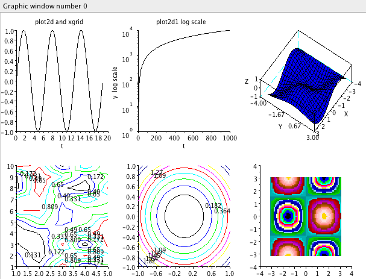
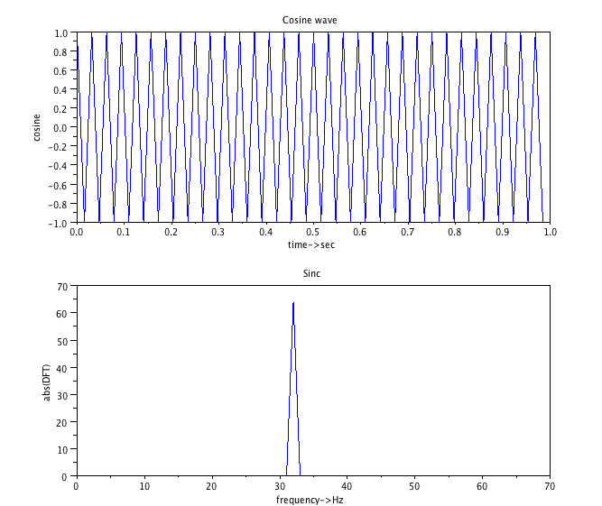

# Εισαγωγή στο Scilab ή Ψlab {#Scilab}
© Γιάννης Κωστάρας

---
Πρόκειται για ένα ευρέως διαδεδομένο, ανοικτού κώδικα επιστημονικό λογισμικό πακέτο, αντίστοιχο με το Matlab, γραμμένο αρχικά σε C και Fortran (πλέον σε Java) από την [INRIA](http://www.inria.fr/) (Institut National de Rescherche en Informatique et en Automatique). Το **Scilab** ή **Sci**entific **Lab**oratory, είναι μια διερμηνευτική (interpreted) γλώσσα προγραμματισμού με πολλές βιβλιοθήκες που παρέχουν στους προγραμματιστές δυνατότητες επεξεργασίας πινάκων/διανυσμάτων, σημάτων, στατιστικής και μαθηματικών υπολογισμών και πολλές άλλες όπως θα δούμε στη συνέχεια του άρθρου. 
Είναι ειδικά σχεδιασμένο για υπολογισμούς με πίνακες, όπως η επίλυση γραμμικών συστημάτων, η εύρεση ιδιοτιμών και ιδιοδιανυσμάτων, η αντιστροφή τετραγωνικών πινάκων κλπ. Επιπλέον είναι εφοδιασμένο με πολλές επιλογές για γραφικά (δηλ. την κατασκευή γραφικών παραστάσεων) και προγράμματα για την επίλυση άλλων προβλημάτων όπως η εύρεση των ριζών μη γραμμικής εξίσωσης, η επίλυση μη γραμμικών συστημάτων, η επίλυση προβλημάτων αρχικών τιμών με συνήθεις διαφορικές εξισώσεις κ.ά. Τέλος, είναι σχεδιασμένο για την αριθμητική επίλυση προβλημάτων σε αριθμητική πεπερασμένης ακρίβειας (finite-precision arithmetic), δηλαδή δεν βρίσκει την ακριβή αλλά μια προσεγγιστική λύση ενός προβλήματος. 

## Εγκατάσταση
Μπορείτε να το κατεβάσετε από [αυτήν την ιστοσελίδα](http://www.scilab.org/). Η τελευταία του έκδοση είναι η 5.3.2. Εναλλακτικά, από το Ubuntu Update Centre. Στη δεύτερη περίπτωση, μπορείτε να ξεκινήσετε το πρόγραμμα από το μενού **Applications → Science → Scilab**. Μετά από λίγο εμφανίζεται η κονσόλα με την προτροπή (prompt) να περιμένει υπομονετικά τις εντολές σας.
```
___________________________________________        
scilab-5.3.2

Consortium Scilab (DIGITEO)
Copyright (c) 1989-2011 (INRIA)
Copyright (c) 1989-2007 (ENPC)
___________________________________________        
 
 
Startup execution:
  loading initial environment

-->
```

## Βασικά στοιχεία της γλώσσας
Μπορείτε να καλέσετε το πολύ χρήσιμο σύστημα βοήθειας είτε απ' το αντίστοιχο εικονίδιο της γραμμής εργαλείων  είτε με την εντολή:
```
--> help
```
Το σύστημα βοήθειας διαθέτει χρήσιμα παραδείγματα τα οποία μπορείτε να εκτελέσετε άμεσα στην κονσόλα πατώντας το κουμπί . Με το κουμπί  μπορείτε να επεξεργαστείτε τον κώδικα σ' ένα άλλο παράθυρο που ονομάζεται Notes (Σημειώσεις). 

## Σχόλια
```
--> // This is a comment
```
## Τελεστές

| + | πρόσθεση |
| * | πολλ/σμός |
| - | αφαίρεση |
| / | διαίρεση |
| ^ | ύψωση σε δύναμη |
| ' | σύζευξη |

π.χ.
```
-->1+2
 ans  =
    3.  
-->2^3;
```
Παρατηρήστε ότι όταν η εντολή τελειώνει με ```;``` το αποτέλεσμα δεν εμφανίζεται στην οθόνη. Σ' αυτή την περίπτωση ή θα πρέπει να χρησιμοποιήσουμε την ειδική μεταβλητή ```ans``` στην οποία αποθηκεύεται το τελευταίο αποτέλεσμα ή θα πρέπει να αποθηκεύσουμε το αποτέλεσμα σε μια μεταβλητή.
```
-->ans
 ans  = 
    8.  
--> x = 3+2*3;
--> x = 
    9.  
```
Όσοι υπολογίσατε 15 στο τελευταίο αποτέλεσμα δε λάβατε υπόψιν σας την προτεραιότητα των πράξεων:

| 1 | ( ) |
| 2 | ^ |
| 3 | *, / |
| 4 | +, - |

Το Ψlab κάνει διάκριση μεταξύ πεζών και κεφαλαίων. Έτσι οι μεταβλητές ```x``` και ```X``` είναι διαφορετκές.
Υπάρχουν πολλές χρήσιμες συναρτήσεις στο Scilab, π.χ.: ```sin, cos, tan, asin, acos, atan, abs, min, max, sqrt, sum, rem, mod, fix, round, ceil, floor, exp, log, log10```
π.χ.
```
--> max(2, abs(-5), sin(%pi/2))
ans = 
   5
```
καθώς και σταθερές:
```
%pi  %i  %e   %t   %f
-->%pi
 %pi  =
    3.1415927
-->%e
 %e  =
    2.7182818    
```
```%i``` είναι το φανταστικό μέρος ενός μιγαδικού αριθμού, π.χ.
```
-->z=1+4*%i
 z  =
    1. + 4.i  
```
ενώ ```%t``` είναι η λογική τιμή true και ```%f``` η λογική τιμή false.
```
-->'This is a string';
-->"This is also a string";
```
Μπορείτε, τέλος, να συνεχίσετε μια εντολή στην επόμενη γραμμή χρησιμοποιώντας τον τελεστή ```...```

``` 
--> s =  1 -1/2 + 1/3 -1/4 + 1/5 ...
--> - 1/6 + 1/7 - 1/8 + 1/9 - 1/10;
```

## Διανύσματα/Πίνακες
Οι πραγματικές δυνατότητες όμως του Ψlab φαίνονται στην επεξεργασία πινάκων και διανυσμάτων. Ας δούμε πως μπορούμε να εισάγουμε το ακόλουθο μαγικό τετράγωνο στο Scilab

| 2 7 6 |
| 9 5 1 |
| 4 3 8 |

Το πιο πάνω μαγικό τετράγωνο είναι ένας πίνακας 3x3 όπου το άθροισμα των γραμμών και των στήλων του δίνουν το ίδιο αποτέλεσμα. 

```
--> magic_square=[2 7 6;9 5 1;4 3 8]
 magic_square  =
    2.    7.    6.  
    9.    5.    1.  
    4.    3.    8.  
-->size(M)   // 3x3
 ans  =
    3.    3.  
```

Παρατηρήστε ότι διαχωρίζουμε τα στοιχεία μιας γραμμής ή στήλης με κενό ή κόμμα (```,```) και το τέλος κάθε γραμμής με το (```;```). Ο πίνακας περικλείεται σε ```[ ]```.
```
-->sum(magic_square, 'r')  // rows
 ans  =
    15.    15.    15.  
-->sum(magic_square, 'c')  //columns
 ans  =
    15.  
    15.  
    15.  
-->sum(magic_square)
 ans  =
    45.  
-->diag(magic_square)
 ans  =
    2.  
    5.  
    8. 
-->sum(diag(magic_square))
 ans  =
    15.   
```
Όπως βλέπετε απ' τις παραπάνω εντολές, το άθροισμα των γραμμών (```'r'```) καθώς και των στηλών (```'c'```) του πίνακα είναι 15. Το άθροισμα όλων των στοιχείων του είναι 45 ενώ το άθροισμα της διαγωνίου του (```diag```) είναι επίσης 15. Το άθροισμα της άλλης διαγωνίου του όμως; Ένας τρόπος είναι αυτός: 
```
-->M(3,1)+M(2,2)+M(1,3)
 ans  =
    15.  
```
όπου ```Μ(x, y)```, ```x```=γραμμή και ```y```=στήλη.
Ένας άλλος είναι η χρήση της συνάρτησης ```mtlb_fliplr```

```
-->mtlb_fliplr(M)
 ans  =
    6.    7.    2.  
    1.    5.    9.  
    8.    3.    4.  
-->sum(diag(mtlb_fliplr(M)))
 ans  =
    15.  
```

Είναι άραγε και το άθροισμα δυο μαγικών τετραγώνων ένα μαγικό τετράγωνο;
```
-->M = magic_square;
-->S = M + magic_square;  
```
Επαναλάβετε όσα μάθατε πιο πάνω για να βρείτε την απάντηση.
Τέλος, η εντολή transpose (ανάστροφο) είναι το ```'``` μετά το όνομα του πίνακα:
```
-->M'
 ans  =
    2.    9.    4.  
    7.    5.    3.  
    6.    1.    8.
-->z'
 ans  =
    1. - 4.i  
-->v=[1, 2, -3, 1]
 v  =
    1.    2.  - 3.    1.  
-->v'
 ans  =
    1.  
    2.  
  - 3.  
    1.  
-->inv(M)  // inverse (αντίστροφος)
 ans  =
  - 0.1027778  0.1055556  0.0638889  
    0.1888889  0.0222222 -0.1444444  
  - 0.0194444 -0.0611111  0.1472222
-->det(M)  // ορίζουσα  
 ans  =
  - 360.  
```
Αν ήσασταν καλοί στα μαθηματικά στο σχολείο, θα θυμάστε ότι ο πολλ/σμός δυο πινάκων MxN δεν πολλ/ζει το στοιχείο M(i,j) με το N(i,j). Γι' αυτό το λόγο (δηλ. την πράξη στοιχείο στοιχείο,  M(i,j) ☼ N(i,j) όπου ☼ τελεστής), υπάρχουν οι ακόλουθοι τελεστές:

| + |  πρόσθεση |
| .* | πολλ/σμός |
| - | αφαίρεση |
| ./ | δεξιά διαίρεση |
| .^ | ύψωση σε δύναμη |
| .\ | αριστερά διαίρεση |

Ένας πολύ χρήσιμος τελεστής είναι ο τελεστής (```:```)
```
-->1:10
 ans  =
    1. 2. 3. 4. 5. 6. 7. 8. 9. 10. 
-->10:-2:0
 ans  =
    10. 8. 6. 4. 2. 0. 
-->M(3,2:3)
 ans  =
    3.    8.    
```

Ουπς! Τι ήταν αυτό το τελευταίο; Φέρε μου από την τρίτη γραμμή τα στοιχεία της 2ης έως 3ης στήλης! 
```
-->M(2,:) // φέρε τη 2η γραμμή
 ans  = 
    9.    5.    1.  
-->M(1:$-1, $)
 ans  =
    6.  
    1.  
```
Ο χαρακτήρας ```$``` δηλώνει το μεγαλύτερο δείκτη μιας γραμμής ή στήλης (π.χ. 3 για τον Μ).
Αλλά γιατί το άθροισμα ενός μαγικού τετραγώνου 3x3 είναι 15; Αν οι ακέραιοι από το 1 μέχρι το 9 ταξινομηθούν σε 3 ομάδες ίσων αθροισμάτων, τότε το άθροισμα αυτό πρέπει να ισούται με:

```
-->sum(1:9)/3
 ans  =
    15.  
```
Και μερικές ακόμα χρήσιμες εντολές:
```
-->zeros(2,3)
 ans  =
    0.    0.    0.  
    0.    0.    0.  
-->ones(2,2)
 ans  =
    1.    1.  
    1.    1.  
-->eye(3,3)
 ans  =
    1.    0.    0.  
    0.    1.    0.  
    0.    0.    1.  
-->rand (1,3,'uniform')
 ans  =
    0.2113249 0.7560439 0.0002211
-->a=[1 2 3 ];b=[4 5 6];c=[7 8 9];
-->d=[a;b;c]
 d  =
    1.    2.    3.  
    4.    5.    6.  
    7.    8.    9.  
```
Στην τελευταία εντολή βλέπουμε πως μπορούμε να συνενώσουμε ή συγχωνεύσουμε (concatenate) πίνακες.

## Πολυώνυμα
Μπορούμε να ορίσουμε ένα πολυώνυμο με τη συνάρτηση poly παρέχοντας ως ορίσματα ένα διάνυσμα, τη μεταβλητή και ένα τρίτο όρισμα που δηλώνει ότι το διάνυσμα είναι οι συντελεστές του:
```
-->p=[6 -5 1]  // 
 p  =
    6.  - 5.    1.  
-->pp=poly(p, 'x', 'coeff') 
 ans  =
              2  
    6 - 5x + x   
-->roots(p)
 ans  =
    3.  
    2.     
```
Tο πολυώνυμο p(x)=x2-5x+6 μπορεί να γραφεί και πιο απλά ως:
```
--> p=[1 -5 6];
--> roots(p)
 ans  =
    3.  
    2.   
--> horner(p,0)  
 ans  =
    1.  - 5.    6. 
--> q=[1 -2 3];
--> // συνέλιξη (γινόμενο) 
--> convol(p,q) 
 ans  =
    1.  - 7.    19.  - 27.    18.
--> derivat(p) // παράγωγος
 ans  =
    0.    0.    0.   
```

## Έλεγχος ροής
Όπως σε όλες τις γλώσσες προγραμματισμού, έτσι και στο Ψlab μπορούμε ν' αλλάξουμε τη ροή του προγράμματος με τις εντολές: ```if, select, for, while και break```.
Πρώτα, ένας πίνακας με τις λογικές εκφράσεις:

| ==  | ίσο |
| ~= | άνισο |
| >= | μεγαλύτερο ίσο |
| <= | μικρότερο ίσο |
| > | μεγαλύτερο |
| < | μικρότερο |
| ~ | αντίθετο |

Η σύνταξη της εντολής ```if```
``` 
if condition
   body
end
if condition_1
   body_1
elseif condition_2
   body_2
elseif condition_3
   body_3
elseif ...
   ...
end
```

Η σύνταξη της εντολής ```select```
```
select expr
  case expr1 then instructions1
  case expr2 then instructions2
  ...
  case exprn then instructionsn
  [else instructions]
end
```

Η σύνταξη της εντολής ```for```
```
for var = init_val : step : fin_val
   body
end
```
Η σύνταξη της εντολής ```while```
```
while condition
   body
end
```
Προτού παρουσιάσουμε ένα παράδειγμα, ας δούμε πως μπορούμε να αποθηκεύσουμε και να φορτώσουμε ένα αρχείο Ψlab. Τα αρχεία του Scilab έχουν κατάληξη, όπως σωστά μαντέψατε, ```.sci```. Πατήστε το κουμπί **Launch SciNotes** της κονσόλας για να εμφανιστεί το παράθυρο των σημειώσεων. Πληκτρολογήστε ή επικολλήστε το ακόλουθο πρόγραμμα και αποθηκεύστε το με τ' όνομα ```celsius_to_fahr.sci```.
```
// Μετατροπή 3 θερμοκρασιών Celsius σε Fahrenheit 
// f, c  θερμοκρασίες Fahr, celsius
// i     μετρητής

i = 1;
while i <= 3,
  c = input( 'Δώσε θερμοκρασία σε Celsius: ');
  if (c>300 | c<-300) then
      disp('Η θερμοκρασία Celsius πρέπει να είναι μεταξύ των ορίων [-300..300]');
  else
      f = (9/5) * c + 32;
  disp( 'Ισοδύναμη θερμοκρασία Fahrenheit: '); disp(f); 
  i = i + 1;
  end
end
```
Εκτελέστε το όπως είπαμε στην αρχή του άρθρου:
```
-->exec('celsius_to_fahr.sci', -1)
Δώσε θερμοκρασία σε Celsius: 500
 Η θερμοκρασία Celsius πρέπει να είναι μεταξύ των ορίων [-300..300]                                         
Δώσε θερμοκρασία σε Celsius: 2 
 Ισοδύναμη θερμοκρασία Fahrenheit:    
    35.6  
```

## Συναρτήσεις
Η σύνταξη μιας συνάρτησης έχει ως εξής:
```
function [out1, out2, ...] = name(in1, in2, ...)
...
endfunction
```
Ένα παράδειγμα αναδρομικής συνάρτησης δίνεται παρακάτω:
```
//function [K] = fibonacci(n)
//Gives the n-th term of the Fibonacci sequence 0,1,1,2,3,5,8,13,...
function [K]=fibonacci(n)
    if n==1
      K = 0;
    elseif n==2
      K = 1;
    elseif n>2 & int(n)==n  // check if n is an integer greater than 2
      K=fibonacci(n-1)+ fibonacci(n-2);
    else
      disp('error! -- input must be a positive integer');
    end
endfunction
```
Π.χ.
```
-->exec('fibonacci.sci', -1)
-->fibonacci(20)
 ans  =
    4181.  
```

## Γραφήματα
Μπορείτε να απεικονίσετε γραφικά πίνακες ή διανύσματα με τις εντολές ```plot, plot2d, plot3d```. Η εντολή ```subplot(m,n,p)``` διαχωρίζει το παράθυρο σε ένα πίνακα mxn και σχεδιάζει το p-στό γράφημα.
```
--> // [0..2π] με βήμα 0.1
--> t = (0:0.1:2*%pi);
--> y = sin(t);
--> plot(t,y);
--> y=cos(t);
--> plot(t,y);
--> xtitle('sin & cos ','t','sin(t), cos(t)');
--> clf    //  clear graphics
//----------------------------------subplot(2,3,1);
t=(0:.1:6*%pi);
plot2d(t',sin(t)');
xtitle('plot2d and xgrid ','t','sin(t)');
xgrid([10,10],2);
//----------------------------------
subplot(2,3,2);
plot2d1('enl',1,(1:10:10000)');
xtitle('plot2d1 log scale','t','y  log scale');
//----------------------------------
subplot(2,3,3);
t=-%pi:.3:%pi;
plot3d(t,t,sin(t)'*cos(t),35,45,'X@Y@Z',[2,2,4]);
//----------------------------------
subplot(2,3,4);
contour(1:5,1:10,rand(5,10),5);
//----------------------------------
subplot(2,3,5);
deff('[z]=surf(x,y)','z=x**2+y**2');
fcontour(-1:.1:1,-1:.1:1,surf,10);
//----------------------------------
subplot(2,3,6);
t=-%pi:.1:%pi;
m=sin(t)'*cos(t);
grayplot(t,t,m);
//----------------------------------
```



Εικόνα 1 – Γραφήματα

## Επεξεργασία σήματος
Και τελειώνω μ' ένα παράδειγμα μετασχηματισμού Fourier. Στο παρακάτω παράδειγμα παριστάνεται γραφικά ένα συνημιτονοειδές σήμα πλάτους +1 και περιόδου 1/30, δειγματοληπτημένο σε διαστήματα 1/128 δευτ/πτα. 
```
subplot(211);
nt=64; T=1; f1=32;
dt=T/nt
t=0:dt:T-dt;
df=1/T
fmax=nt/(2*T)
f=0:df:df*(nt-1);
y=cos(2*%pi*f1*t);
plot(t,y);
xtitle('Cosine wave','time->sec','cosine');
//Yss=zeros(1,nt/2);
Y=fft(y,-1); //Yss(1:nt/2)=(2/nt)*Y(1:nt/2);
//[f' abs(Yss)']
subplot(212); 
plot(f,abs(Y))
xtitle('Sinc','frequency->Hz','abs(DFT)');
```



Εικόνα 2 – Μετασχηματισμός Fourier

## Επίλογος
Σ' αυτό το άρθρο είδαμε μερικά από τα χαρακτηριστικά ενός πολύ χρήσιμου και διαδεδομένου εργαλείου επιστημονικής έρευνας, του Scilab. Αν κοιτάξετε το σύστημα βοήθειας θα δείτε ότι οι δυνατότητες του εργαλείου είναι πολύ περισσότερες απ' αυτές που περιγράψαμε παραπάνω και καλύπτουν την επεξεργασία σημάτων, μετασχηματισμούς Fourier, γραμμική άλγεβρα, παραγώγους και ολοκληρώματα, στατιστική, γενετικούς αλγορίθμους κ.ά.  Είτε είστε ερευνητής, είτε χομπίστας, είτε απλός μαθητής, το εργαλείο αυτό μπορεί κυριολεκτικά να σας λύσει τα χέρια στα διάφορα μαθηματικά και μη προβλήματά σας. Και πάνω από όλα είναι δωρεάν και ανοικτού κώδικα!

## Πηγές:
1. [Scilab tutorials](http://www.scilab.org/support/documentation/tutorials). 
2. Baudin M. (2010), _Introduction to Scilab_, Scilab Consortium – Digiteo.
3. Rietsch E. (2010), [An Introduction to Scilab from a Matlab User's Point of View](http://wiki.scilab.org/Tutorials?action=AttachFile&do=get&target=Scilab4Matlab.pdf). 
4. Sayood K. (2007), _Learning Programming using MATLAB_, Morgan & Claypool. 
5. Γεωργίου Γ., Ξενοφώντος Χ. (2007), _Εισαγωγή στη MATLAB_, Λευκωσία.  
6. Leung Ho Yin, Terence and Nam Kiu, Tsing, [A Short Introduction to Scilab](http://hkumath.hku.hk/~nkt/Scilab/IntroToScilab.html).
7. [Getting Started with Scilab](http://hkumath.hku.hk/~nkt/Scilab/IntroToScilab.html). 
8. [Μαγικά τετράγωνα](http://en.wikipedia.org/wiki/Magic_square). 
        
---