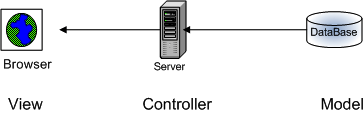
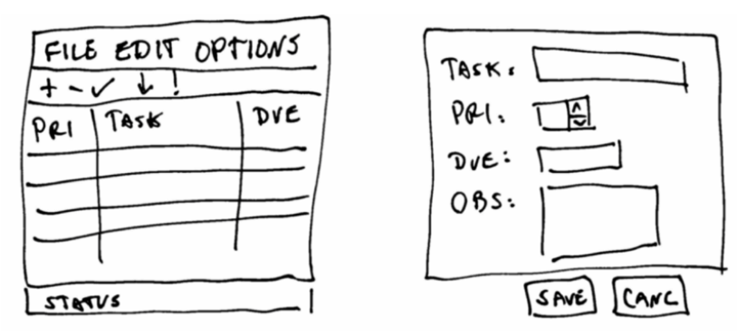
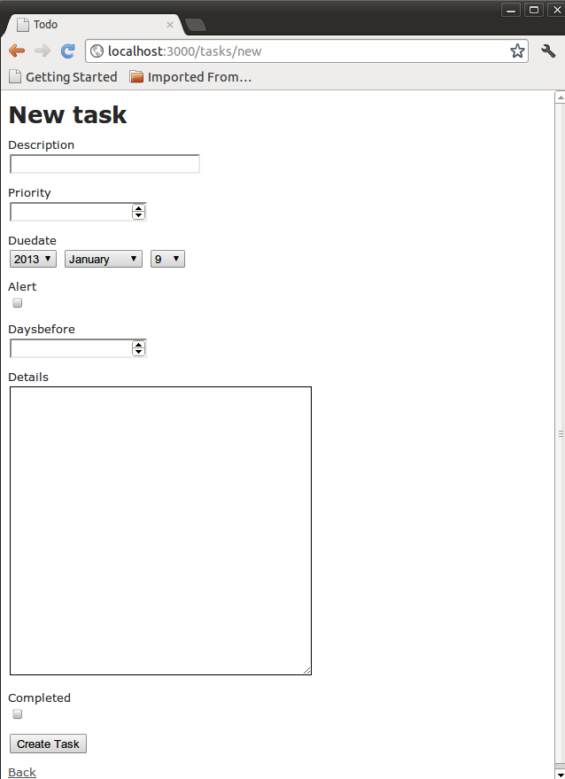
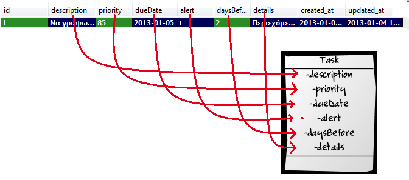
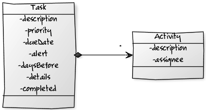
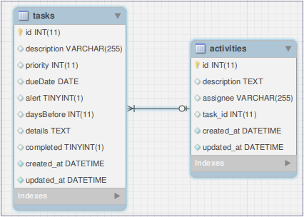

# Εισαγωγή στη Ruby on Rails {#RubyOnRails}
© Γιάννης Κωστάρας

---

[<-](../SystemRuby.md)| [->](../SecureRoR/README.md)

---

Σ’ αυτό το κεφάλαιο θα μιλήσουμε για την ανάπτυξη εφαρμογών ιστού, ή αλλιώς δυναμικών ιστοσελίδων. Σχεδόν κάθε γλώσσα προγραμματισμού παρέχει και τη δυνατότητα δημιουργίας δυναμικών ιστοσελίδων:

* C → CGI
* Perl → PHP
* Java → Java Enterprise Edition (JEE), Spring MVC κ.ά.
* .NET → ASPX
* Groovy → Grails
* Ruby → Ruby on Rails (RoR)
* Python → Django
* Erlang → Erlang

Αν και η PHP αποτελεί την πιο διαδεδομένη γλώσσα ανάπτυξης εφαρμογών ιστού, η Ruby on Rails (RoR) σας επιτρέπει την ανάπτυξη εφαρμογών ιστού πολύ γρήγορα χάρις στις παραδοχές της και τη μοντέρνα σχεδίασή της. Η φιλοσοφία της γλώσσας αποτελείται από τις ακόλουθες αρχές:

* “Μην επαναλαμβάνεσαι” - Don’t Repeat Yourself (DRY)
* “Σύμβαση αντί για ρύθμιση” - Convention over Configuration
* “REST” - οργάνωση της εφαρμογής γύρω από τους πόρους

Καθώς ο αναγνώστης έχει μια γνώση της γλώσσας Ruby από προηγούμενα τεύχη, ήταν φυσικό επακόλουθο να επιλεγεί για να δούμε πώς μπορεί να τη χρησιμοποιήσει για ν’ αναπτύξει εφαρμογές ιστού ή δυναμικές ιστοσελίδες.

## Υπόβαθρο
Οι εφαρμογές ιστού ακολουθούν μια λίγο πιο πολύπλοκη αρχιτεκτονική από τις εφαρμογές επιφάνειας εργασίας (desktop) ή αυτόνομες εφαρμογές (standalone). Όπως φαίνεται στο ακόλουθο σχήμα, ακολουθούν την αρχιτεκτονική _MVC (Model-View-Controller)_ όπου η _Προβολή (View)_ βρίσκεται συνήθως στον Η/Υ του πελάτη (client) ενώ ο _Ελεγκτής (Controller)_ και το _Μοντέλο (Model)_ στον διακομιστή (server) ή σε διαφορετικούς διακομιστές. Η επικοινωνία με το χρήστη (Προβολή - View) γίνεται μέσω ενός πλοηγού (π.χ. Firefox, Chrome κλπ.), δηλ. δεν απαιτούν περαιτέρω εγκατάσταση άλλης εφαρμογής στον Η/Υ του χρήστη. Μια Βάση Δεδομένων (π.χ. Sqlite, Postgresql, MySQL, Oracle κλπ.) αποθηκεύει τα δεδομένα (Μοντέλο - Model) και τέλος ένας διακομιστής ιστού (web server) ή διακομιστής εφαρμογών (application server) παίζει το ρόλο του ελεγκτή (controller), του οποίου η δουλειά είναι να επεξεργάζεται τις αιτήσεις που προέρχονται από τον πλοηγό ανακτώντας δεδομένα από τη ΒΔ και να επιστρέφει τις απαντήσεις σε μια μορφή που μπορεί να απεικονίσει ο πλοηγός (π.χ. HTML).



** Εικόνα 1** _Αρχιτεκτονική μιας εφαρμογής ιστού_

Παραδείγματα διακομιστών ιστού φαίνονται στον ακόλουθο πίνακα:

| Γλώσσα | Διακομιστής Ιστού | 
| PHP | Apache |
| JEE | Apache Tomcat |
|  | Jetty |
|  | Oracle GlassFish |
|  | BEA WebLogic |
|  | IBM WebSphere |
| ASPX  | IIS |
| RoR | Mongrel, Webrick |
| Grails | (βλ. JEE) |
| Django | Apache, Cherokee |
| Erlang | Yaws |

**Πίνακας 1** _Διακομιστές ιστού ανά γλώσσα προγραμματισμού_

Τέλος, πριν προχωρήσουμε, αξίζει να εξηγήσουμε ποια είναι η διαφορά μεταξύ της Ruby και της Ruby on Rails. Ενώ η πρώτη είναι μια γλώσσα προγραμματισμού, την οποία γνωρίσαμε σε παλαιότερα τεύχη, η RoR δεν είναι τίποτα άλλο από αρχεία συνόδου (scripts) γραμμένα σε Ruby τα οποία αποτελούν το πλαίσιο εργασίας (framework) για την ανάπτυξη εφαρμογών ιστού.

#Εγκατάσταση
Έχοντας εγκαταστήσει τη Ruby (αν όχι, ανατρέξτε στο κεφάλαιο 1), μπορείτε πολύ εύκολα να εγκαταστήσετε τη Ruby on Rails (RoR) ως εξής:
```bash
$ sudo gem update --system
$ sudo gem sources -a http://gemcutter.org
$ sudo gem install rails
$ rails –v
Rails 3.2.8
```
(Η Ruby 1.9.1 ενδέχεται να σας δημιουργήσει προβλήματα με τη RoR, γι’ αυτό είτε αναβαθμιστείτε στην 1.9.2 είτε χρησιμοποιήστε την 1.8.7). Η πιο
πάνω εντολή προ-απαιτεί την εγκατάσταση του πακέτου rubygems. Αν δεν το έχετε εγκαταστήσει, εγκαταστήστε το προτού εκτελέσετε τις παραπάνω
εντολές:
```bash
$ sudo gem install rubygems
```
Τέλος, απαιτείται η εγκατάσταση του Συστήματος Διαχείρισης Βάσεων Δεδομένων (ΣΔΒΔ) Sqlite:
```bash
$ sudo apt-get install sqlite3 libsqlite3-dev
$ sudo gem install sqlite3
```

## Απαιτήσεις συστήματος
Θα αναπτύξουμε μια εφαρμογή διαχείρισης έργων (tasks), δηλ. μια λίστα todo. Ακολουθούν οι απαιτήσεις της εφαρμογής:

* Η εφαρμογή θα εμφανίζει μια λίστα έργων
* Ο χρήστης θα μπορεί να δημιουργήσει ένα νέο έργο, να ενημερώσει ένα έργο ή να διαγράψει ένα ή περισσότερα έργα
* Τα έργα θα πρέπει να έχουν προτεραιότητες (0-100), ώστε οι χρήστες να μπορούν να επικεντρώνονται στα έργα με τις υψηλότερες προτεραιότητες
* Τα έργα θα πρέπει να έχουν προθεσμίες, ώστε οι χρήστες να επικεντρώνονται σε εκείνα τα έργα που λήγουν
* Θα πρέπει να υπάρχουν οπτικές ενδείξεις για έργα που έχει περάσει η προθεσμία τους ή είναι έτοιμα να λήξουν
* Τα έργα μπορούν να μαρκαριστούν ότι έχουν ολοκληρωθεί, αλλά αυτό δε σημαίνει ότι θα διαγραφούν ή δε θα εμφανίζονται εκτός κι αν ο χρήστης επιλέξει να τα διαγράψει.

Θα υπάρχουν δυο κύριες οθόνες για την εφαρμογή: μια λίστα έργων και μια φόρμα εισαγωγής/ανάγνωσης έργων. Ένα σκίτσο φαίνεται στην εικόνα 2.



**Εικόνα 2** _Σκίτσα της εφαρμογής διαχείρισης έργων_

## Δημιουργία μιας πρότυπης εφαρμογής

Ας δημιουργήσουμε μια νέα εφαρμογή RoR:
```bash
$ rails new todo
```
Η εντολή αυτή θα δημιουργήσει μια νέα εφαρμογή RoR στον κατάλογο ```todo```. Αν όλα πήγαν καλά, κι αφού δώσατε τον κωδικό του συστήματος όταν
και αν σας ζητήθηκε, τότε θα πρέπει να δείτε το παρακάτω μήνυμα:
```bash
Your bundle is complete! Use ‘bundle show [gemname]‘ to see where a bundled gem is installed.
```
Η ανωτέρω εντολή rails δημιούργησε μια πλήρη εφαρμογή ιστού. Για να την εκτελέσετε, εκκινήστε πρώτα τον διακομιστή:
```bash
$ cd todo
$ rails server &
=> Booting WEBrick
=> Rails 3.2.8 application starting in development on http
://0.0.0.0:3000
=> Call with -d to detach
=> Ctrl-C to shutdown server
[2012-10-16 23:37:19] INFO WEBrick 1.3.1
[2012-10-16 23:37:19] INFO ruby 1.8.7 (2012-02-08) [
universal-darwin11.0]
[2012-10-16 23:37:19] INFO WEBrick::HTTPServer#start: pid
=9779 port=3000
Started GET ”/assets/rails.png” for 127.0.0.1 at Tue Oct 16
23:37:32 +0200 2012
Connecting to database specified by database.yml
Served asset /rails.png - 304 Not Modified (2ms)
```
Ανοίξτε τον αγαπημένο σας πλοηγό και πλοηγηθείτε στη διεύθυνση: [http://localhost:3000](http://localhost:3000). Θα δείτε την αρχική σελίδα του διακομιστή. Η αρχική αυτή σελίδα είναι η ```public/index.html```. Αν η παραπάνω εντολή εκκίνησης του server ’πέταξε’ κάποια εξαίρεση σχετικά με ```execjs```, δώστε την ακόλουθη εντολή και ξαναδοκιμάστε.
```bash
$ sudo gem install nodejs
```
Θα παρατηρήσετε ότι η εντολή ```rails``` δημιούργησε ένα σωρό από αρχεία μέσα στον φάκελο ```todo```. Η RoR ακολουθεί την αρχή της σύμβασης (onvention) έναντι της ρύθμισης (configuration), με απλά λόγια περιμένει ότι θα ονομάσετε τα αρχεία σας σύμφωνα με κάποιους κανόνες σύμβασης και θα τα τοποθετήσετε σε κάποιους προκαθορισμένους φακέλους. Έτσι, δεν χρειάζεται να τροποποιήσετε κάποιο(-α) αρχείο(-α) ρυθμίσεων (όπως π.χ. το ```web.xml``` στην JEE).

Άμα ανατρέξουμε στις απαιτήσεις τις εφαρμογής, θα δούμε ότι χρειάζεται να δημιουργήσουμε σελίδες για τη _Δημιουργία (Creation), Ανάγνωση
(Read), Ενημέρωση (Update)_ και _Διαγραφή (Delete)_ έργων (ΔΑΕΔ – CRUD). Η ακόλουθη εντολή (```scaffold```) δημιουργεί μια πρότυπη εφαρμογή που κάνει
ακριβώς αυτά. Το μόνο που χρειάζεται να της περάσουμε είναι πληροφορίες για το μοντέλο μας, που δεν είναι άλλο από την κλάση ```Task```:
```bash
$ rails generate scaffold Task description:string priority:
integer dueDate:date alert:boolean daysBefore:integer
details:text
```
Η κλάση ```Task``` περιλαμβάνει τα ακόλουθα πεδία:

| Πεδίο | Τύπος δεδομένων |
| description | string |
| priority | integer |
| dueDate | date |
| alert | boolean |
| daysBefore | integer |
| details | text |

**Πίνακας 2** _Πεδία κλάσης Task_

Προτού όμως μπορέσουμε να δούμε μια λίστα έργων στον πλοηγό μας, θα πρέπει να δημιουργήσουμε τη βάση δεδομένων (ΒΔ) που θα αποθηκεύσει τα δεδομένα μας. Όπως ίσως προσέξατε, η RoR χρησιμοποιεί εξ ορισμού την [Sqlite3](http://sqlite.org) ως ΒΔ. Αυτό βέβαια μπορεί να αλλάξει εύκολα όπως θα δούμε
αργότερα, όταν θα αλλάξουμε την εφαρμογή μας ώστε να χρησιμοποιήσει τη [MySQL](http://mysql.com). Για την ώρα όμως, η Sqlite μας κάνει μια χαρά. Όταν τρέξαμε την παραπάνω εντολή, η RoR δημιούργησε κι ένα μικρό script μετάβασης (migration) το οποίο θα χρησιμοποιήσουμε για να δημιουργήσουμε τον
πίνακα που θ’ αποθηκεύσει τα δεδομένα μας. Αυτό βρίσκεται στο φάκελο ```db/migrate```:
```ruby
class CreateTasks < ActiveRecord::Migration
  def change
    create_table :tasks do |t|
      t.string :description
      t.integer :priority
      t.date :dueDate
      t.boolean :alert
      t.integer :daysBefore
      t.text :details
      t.timestamps
    end
  end
end
20121021092304_create_tasks.rb
```
Για να δημιουργήσετε τον πίνακα ```tasks``` (βλέπετε τη σύμβαση; αφού η κλάση μας ονομάζεται ```Task```, ο πίνακας θα ονομαστεί ```tasks```), εκτελέστε την εντολή:
```bash
$ rake db:migrate
== CreateTasks: migrating
====================================================
-- create_table(:tasks)
-> 0.0020s
== CreateTasks: migrated (0.0026s)
===========================================
```
Η εντολή ```rake``` είναι κάτι αντίστοιχο με την εντολή ```make``` της C και την ```ant``` της Java. Για να δούμε αν τα καταφέραμε. Αν ακόμα τρέχετε τον διακομιστή, τότε πλοηγηθείτε στην ιστοσελίδα: [http://localhost:3000/tasks](http://localhost:3000/tasks):

| Listing Tasks |
| Description Priority Duedate Alert Daysbefore Details |
| New Task |

Μην κάθεστε! Προσθέστε μερικά έργα (βλ. Εικόνα 3):



**Εικόνα 3** _Δημιουργία νέου έργου_

Θα δείτε ότι έχετε δημιουργήσει μια σχεδόν πλήρη εφαρμογή ιστού όπου μπορείτε να δημιουργήσετε, ενημερώσετε, διαγράψετε έργα καθώς και να δείτε μια λίστα των διαθέσιμων έργων.

Η λίστα έργων θα φαινόταν πιο επαγγελματική αν οι κεφαλίδες των στηλών ήταν π.χ. στα ελληνικά (αν αναφέρεστε μόνο στην ελληνική αγορά). Προτού μπορέσουμε να τροποποιήσουμε μια εφαρμογή που δημιουργήθηκε από το scaffold, θα πρέπει να μάθουμε λίγα πράγματα για την αρχιτεκτονική μιας εφαρμογής RoR. Η εφαρμογή αυτή καθεαυτή βρίσκεται στο φάκελο ```app```. Εκεί θα βρείτε τους εξής υποφακέλους (μαζί με άλλους):

* ```models```: περιλαμβάνει τα μοντέλα δεδομένων μας (π.χ. ```task.rb```) που αποθηκεύονται στη ΒΔ.
* ```views```: είναι η πρόσοψη της εφαρμογής, η αναπαράσταση της πληροφορίας στο χρήστη (συνήθως με τη μορφή ιστοσελίδων)
* ```controllers```: είναι ο εγκέφαλος της εφαρμογής· αποφασίζει πώς θα αλληλεπιδράσει ο χρήστης με την εφαρμογή ελέγχοντας ποια δεδομένα προσπελάζονται από το μοντέλο και ποια προβολή (view) θα τα παρουσιάσει.

Μετά από τα παραπάνω, ποια αρχεία πιστεύετε ότι πρέπει ν’ αλλάξουμε; Φυσικά, τα αρχεία στο φάκελο ```views```. Τα αρχεία αυτά όμως δεν έχουν κατάληξη ```.html``` όπως ίσως θα περιμένατε, αλλά ```.erb``` (Embedded Ruby), ή αλλιώς πρότυπα σελίδων (page templates) δηλ. σελίδες HTML μαζί με κώδικα που όταν εκτελούνται παράγουν τις ιστοσελίδες που βλέπετε στον πλοηγό σας. Ανοίξτε καθένα από τα αρχεία ```.erb``` που βρίσκονται στο φάκελο ```views/tasks/``` στον αγαπημένο σας κειμενογράφο και αλλάξτε τις κεφαλίδες στα ελληνικά. Ανανεώνοντας τα περιεχόμενα του πλοηγού σας βλέπετε αμέσως τις αλλαγές. Δείτε πως μ’ αυτόν τον τρόπο επιταχύνεται ο χρόνος ανάπτυξης, καθώς δε χρειάζεται να μεταγλωττίσετε τον κώδικα και να τον εγκαταστήσετε (deploy) στον διακομιστή όπως με άλλες γλώσσες.

_Παρατήρηση_! Ενδέχεται να βρείτε στο αρχείο ```_form.html.erb``` εντολές της μορφής ```<%= f.label :Description %><br />``` τις οποίες μπορείτε ν’ αλλάξετε σε ```<%= f.label :Περιγραφή %><br />```. Για τον παρατηρητικό αναγνώστη, το ```:Description``` είναι επίσης αλφαριθμητικό το οποίο ονομάζεται _σύμβολο_ στη Ruby. Απλά αν ο τίτλος σας έχει κενά, καλό είναι να τον βάλετε μέσα σε εισαγωγικά, π.χ. :”Ημερομηνία παράδοσης”.

## Τα πάντα ρει
Όπως ίσως γνωρίζετε, τίποτα δε μένει στατικό σ’ αυτόν τον κόσμο, ούτε οι προδιαγραφές, οι οποίες συνέχεια αλλάζουν και πρέπει να αλλάζουμε και τις εφαρμογές λογισμικού για να τις ικανοποιήσουμε. Οι πελάτες μας ζητήσανε να προσθέσουμε μια νέα στήλη που να δηλώνει αν ένα έργο ολοκληρώθηκε ή όχι. Εδώ θα καταλάβετε τι είναι η μετάβαση (migration).
```bash
$ rails generate migration AddCompletedToTasks completed:
boolean
$ rake db:migrate
== AddCompletedToTasks: migrating
=========================================
-- add_column(:tasks, :completed, :boolean)
-> 0.0090s
== AddCompletedToTasks: migrated (0.0096s)
=========================================
```
Η πρώτη εντολή δημιούργησε το ακόλουθο αρχείο στο φάκελο ```db/migrate```:
```ruby
class AddCompletedToTasks < ActiveRecord::Migration
  def change
    add_column :tasks, :completed, :boolean
  end
end
db/migrate/20121022201252_add_completed_to_tasks.rb
```
ενώ η δεύτερη εντολή εκτέλεσε τη μετάβαση κατά τα γνωστά. Η εντολή αυτή καταλαβαίνει από το timestamp της εντολής ```migrate``` ποια script μετάβασης έχουν ήδη εκτελεστεί και ποια όχι, και εκτελεί όσα δεν έχουν ήδη εκτελεστεί και ενημερώνει κατάλληλα τη ΒΔ.
Και για ποιο λόγο δεν μπορούμε να δημιουργήσουμε αυτήν την αλλαγή μόνοι μας και πρέπει να την κάνουμε μέσω της εντολής ```rake```; Πέραν του ότι μας γλυτώνει χρόνο, με την εντολή ```rake``` μπορούμε να επιστρέψουμε σε μια προηγούμενη κατάσταση της εφαρμογής μας αν η τελευταία αλλαγή που κάναμε δεν ήταν σωστή. Η ```rake``` φροντίζει να κρατάει ένα στιγμιότυπο της εφαρμογής μας ενημερώνοντας όλα τα αρχεία που χρειάζεται.

Μπορείτε να δείτε την αλλαγή είτε μπαίνοντας στο περιβάλλον της ```sqlite3``` από τη γραμμή εντολών, είτε χρησιμοποιώντας κάποιο γραφικό εργαλείο
όπως ο [SQLite Database Browser](http://sqlitebrowser.org/) ή το πρόσθετο (plugin) SQLiteManager για Firefox (ανοίξτε το από το μενού του Firefox ***Tools → SQLite Manager** και στη συνέχεια από το μενού **Tools → Options** του εργαλείου αλλάξτε την εξ ορισμού επέκταση από ```sqlite``` σε ```sqlite3```). Το αρχείο που πρέπει να ανοίξετε είναι το ```db/development.sqlite3```. Επίσης, το ```AddCompletedToTasks``` δεν είναι τυχαίο. Αποτελεί άλλη
μια σύμβαση της RoR, η οποία της λέει να προσθέσει ένα νέο πεδίο ```completed``` στον πίνακα ```tasks```. Αντίστοιχες συμβάσεις είναι π.χ. η ```RemoveCompletedFromTasks```.

Από εκεί και πέρα θα πρέπει να αλλάξετε μόνοι σας τα αρχεία ```.erb``` προσθέτοντας το νέο πεδίο για να εμφανιστούν οι αλλαγές στον πλοηγό. Ελέγξτε αν το μοντέλο ```app/models/task.rb``` περιέχει το νέο πεδίο ```:completed```. Αν όχι, τότε κάτι πήγε στραβά κατά τη μετάβαση και πρέπει να το προσθέσετε για να δουλέψει η εφαρμογή με τις αλλαγές. Επίσης, θα πρέπει να προσθέσετε το νέο πεδίο στις φόρμες που βρίσκονται στο ```app/views/tasks/``` (αφήνεται ως άσκηση στον αναγνώστη).

## Αντιστοίχιση Σχεσιακού με Αντικειμενοστραφές μοντέλο
Η κλάση ```Task``` του μοντέλου μας κληρονομεί από την κλάση ```ActiveRecord```.
```ruby
class Task < ActiveRecord::Base
  attr_accessible :alert, :completed, :daysBefore, :description, :details, :dueDate, :priority
end
```
Η κλάση αυτή αντιστοιχίζει πίνακες με κλάσεις, εγγραφές με αντικείμενα και στήλες με ιδιότητες αντικειμένων (βλ. Σχήμα 4). Αυτή η τεχνική είναι γνωστή ως _Object-Relational Mapping (ORM)_. Καθώς τα ΣΔΒΔ χρησιμοποιούν το σχεσιακό μοντέλο (βλ. SQL) και η Ruby το αντικειμενοστραφές μοντέλο, το ```ActiveRecord``` αποτελεί τη γέφυρα μεταξύ των δυο.



**Εικόνα 4** _Object-Relational Mapping (ORM)_

## Δυο δρόμους έχει η ζωή
Ο προσεχτικός αναγνώστης θα παρατήρησε ότι προσπελάσαμε την εφαρμογή μας δίνοντας [http://localhost:3000/tasks](http://localhost:3000/tasks) κι όχι
[http://localhost:3000](http://localhost:3000). Η RoR συνάγει από τη διεύθυνση (URL) ποιον κώδικα να εκτελέσει βασισμένη σε ορισμένους κανόνες. Είναι από τις πολύ λίγες φορές που θα πρέπει να ρυθμίσετε (configure) τη RoR κι όχι να βασιστείτε σε συμβάσεις (conventions). Οι κανόνες που χρησιμοποιεί η RoR για να αντιστοιχίσει διευθύνσεις URL σε κώδικα λέγονται _διαδρομές (routes)_ και ορίζονται στο πρόγραμμα Ruby ```config/routes.rb```. Για να μπορείτε να προσπελάσετε την εφαρμογή δίνοντας [http://localhost:3000](http://localhost:3000), αναζητήστε την παρακάτω γραμμή που ξεκινάει με ```root``` και αλλάξτε τη στην παρακάτω (βλ. [http://guides.rubyonrails.org/routing.html](http://guides.rubyonrails.org/routing.html)):
```ruby
root :to => ’tasks#index’
```
Η γραμμή αυτή λέει στη RoR να καλέσει την ιστοσελίδα ```index``` του ελεγκτή ```tasks``` όταν ο χρήστης καλέσει την αρχή (ρίζα) της εφαρμογής. Για να δουλέψει, πρέπει να κάνετε κάτι ακόμα:
```bash
$ rm public/index.html
```

## Έλεγχος εισαγωγής δεδομένων
Ο παρατηρητικός αναγνώστης θα πρόσεξε επίσης ότι μπορούμε να δημιουργήσουμε κενά έργα, δηλ. χωρίς περιγραφή κλπ. Ας δούμε πώς μπορούμε να εισάγουμε ελέγχους κατά την εισαγωγή των δεδομένων. Οι έλεγχοι γίνονται στο επίπεδο του μοντέλου. Ανοίξτε το αρχείο ```app/models/task.rb``` και αλλάξτε το όπως παρακάτω (βλ. [http://guides.rubyonrails.org/active_record_validations_callbacks.html](http://guides.rubyonrails.org/active_record_validations_callbacks.html)):
```ruby
class Task < ActiveRecord::Base 
  validates :dueDate, :presence => true
  validates :description, :presence => true, :length => { :minimum => 5 }
  validates :priority, :numericality => { 
    :only_integer => true, 
    :greater_than_or_equal_to => 0, 
    :less_than_or_equal_to => 100 
  }
end
```
Επίσης, παρατηρήστε ότι ο οποιοσδήποτε μπορεί να εισάγει και να τροποποιεί έργα. Θα προσθέσουμε έναν απλό (κι όχι ασφαλή) έλεγχο ότι μόνο όποιος γνωρίζει τον κωδικό του διαχειριστή μπορεί να εισάγει/τροποποιεί έργα και θα δούμε στο επόμενο τεύχος έναν ασφαλή τρόπο με διαχείριση χρηστών. Προσθέστε την παρακάτω γραμμή στον ελεγκτή (βλ. [http://guides.rubyonrails.org/security.html](http://guides.rubyonrails.org/security.html)):
```
class TasksController < ApplicationController
  http_basic_authenticate_with :name => ”admin”, :password => ”admin”, :except => [:index, :show]
   ...
```
Τώρα, την πρώτη φορά που θα προσπαθήσετε να εισάγετε/τροποποιήσετε ένα έργο, εμφανίζεται ένα παράθυρο που σας ζητάει να εισάγετε ένα όνομα χρήστη κι ένα κωδικό. Αν εισάγετε τα σωστά admin/admin τότε μπορείτε να εκτελέσετε τις παραπάνω ενέργειες. Στο επόμενο κεφάλαιο θα δούμε πώς να προσθέσουμε χρήστες και πώς να κάνουμε την εφαρμογή μας ασφαλή από κυβερνοεπιθέσεις.

## Επεξήγηση της εφαρμογής
Όπως είδαμε, η εντολή ```scaffold``` δημιούργησε μια ολόκληρη εφαρμογή για μας. Για να μπορέσουμε όμως να την τροποποιήσουμε ώστε να ικανοποιεί τις τωρινές και μελλοντικές απαιτήσεις μας, θα πρέπει να κατανοήσουμε πώς δουλεύει.

Ας δούμε ένα σενάριο:
1. Ο χρήστης εισάγει στον πλοηγό του τη διεύθυνση: [http://localhost:3000/](http://localhost:3000/).
2. Η RoR περνάει την αίτηση του χρήστη στο αρχείο ```config/routes.rb```.
3. Η αίτηση ταυτίζεται με τη γραμμή: ```root :to => ’tasks#index’``` η οποία της λέει να καλέσει την μέθοδο ```index``` του ελεγκτή ```tasks```.
4. Η μέθοδος ```index``` της κλάσης ```TasksController``` (```app/controllers/tasks_controllers.rb```):
```ruby
# GET /tasks
# GET /tasks.json
def index
  @tasks = Task.all
  respond_to do |format|
    format.html # index.html.erb
    format.json { render json: @tasks }
  end
end
```
ανακτά όλες τις εγγραφές τύπου ```Task``` από τη ΒΔ (```Task.all```) και τις αποθηκεύει στη δομή πίνακα ```@tasks```. Στη συνέχεια εμφανίζει τη σελίδα ```index```. Παρατηρήστε ότι αντίστοιχα ισχύουν αν λάβει μια αίτηση τύπου ```json``` (π.χ. [http://localhost:3000/posts.json](http://localhost:3000/posts.json)).
5. Η πρότυπη σελίδα ```app/views/tasks/index.html.erb``` καλείται στη συνέχεια:
```ruby
<% @tasks.each do |task| %>
<tr>
  <td><%= task.description %></td>
  ...
  </tr>
<% end %>
```
η οποία προσπελάζει ένα ένα τα έργα από τον πίνακα ```@tasks```, που γέμισε προηγουμένως ο ελεγκτής, και εμφανίζει τις ιδιότητες καθενός έργου σε πινακοειδή μορφή HTML. Ο κώδικας μεταξύ ```<%=``` και ```%>``` ονομάζεται _έκφραση_. Όπως καταλαβαίνετε, η παραπάνω έκφραση απλά διαβάζει την ιδιότητα ```description``` του αντικειμένου ```@task``` και την εμφανίζει στην πρώτη στήλη του πίνακα HTML. Αν θέλουμε να εμφανίσουμε πιο πολύπλοκη πληροφορία, τότε μπορούμε να χρησιμοποιήσουμε τα scriplets: ```<%``` και ```%>``` (παρατηρήστε ότι δεν υπάρχει το ```=```), όπως φαίνεται πιο πάνω κατά την προσπέλαση των δεδομένων του πίνακα ```@tasks```.

Παρατηρήστε ότι το όνομα του αρχείου ```index.html.erb``` ταυτίζεται με το όνομα της μεθόδου ```index``` του ```TasksController```.

* ```link_to``` δημιουργεί έναν υπερσύνδεσμο
* ```edit_task_path``` και ```new_task_path``` είναι βοηθήματα (helpers).

Ας δούμε ένα ακόμα σενάριο:

1. Ο χρήστης εισάγει στον πλοηγό του τη διεύθυνση: [http://localhost:3000/tasks/1](http://localhost:3000/tasks/1).
2. Η RoR περνάει την αίτηση του χρήστη στο αρχείο ```config/routes.rb```.
3. Η αίτηση ταυτίζεται με τη γραμμή: ```resources :tasks``` (η οποία μεταφράζεται στη γραμμή ```match ’tasks/:id’ =>’tasks#show’```) η οποία της λέει να καλέσει τη μέθοδο ```show``` του ελεγκτή ```tasks```.
4. Η μέθοδος ```show``` της κλάσης ```TasksController```:
```ruby
# GET /tasks/1
# GET /tasks/1.json
def show
  @task = Task.find(params[:id])
  respond_to do |format|
    format.html # show.html.erb
    format.json { render json: @task }
  end
end
```
ανακτά την εγγραφή ```Task``` με ```:id=1``` από τη ΒΔ περνώντας τυχόν παραμέτρους στον πίνακα κατακερματισμού ```params(Task.find(params[:id])```, στη συγκεκριμένη περίπτωση η ```params[:id] = params[1]``` που αντιστοιχεί στην 1η εγγραφή του πίνακα ```tasks```) και την αποθηκεύει στη μεταβλητή ```@task```. (Εδώ, γίνεται ένα Object Relational Mapping μεταξύ των στηλών μιας εγγραφής του πίνακα ```tasks``` και των ιδιοτήτων του αντικειμένου ```@task```, π.χ. τα δεδομένα της στήλης ```Description``` της 1ης εγγραφής αποθηκεύονται στο πεδίο ```@task.description```, βλ. Eικόνα 4). Στη συνέχεια, εμφανίζει τη σελίδα ```show```.

Η ```params``` είναι ένας πίνακας κατακερματισμού (hashtable), ο οποίος περιέχει τα δεδομένα της εκάστοτε φόρμας (τα κλειδιά διαφέρουν ανάλογα με την περίπτωση), π.χ.:

| params | |
| Κλειδί (key) | Τιμή (value) |
| id | 1 |
| action | “show” |
| controller | “tasks” |

**Πίνακας 3** _Πίνακας κατακερματισμού params_

5. Η πρότυπη σελίδα ```app/views/tasks/show.html.erb``` καλείται στη συνέχεια:
```ruby
<p>
<b>Id:</b>
<%= @task.id %>
</p>
...
```
η οποία εμφανίζει τις ιδιότητες του έργου που έχουν αποθηκευθεί στη μεταβλητή ```@task``` σε μορφή HTML. Ας δούμε τώρα την περίπτωση που ο χρήστης θέλει να δημιουργήσει ένα νέο έργο:

1. Ο χρήστης επιλέγει τον υπερσύνδεσμο New Task ο οποίος δείχνει στο [http://localhost:3000/tasks/new/](http://localhost:3000/tasks/new/).
2. Η αίτηση στέλνεται στο ```routes.rb```. Η διαδρομή ```tasks/new``` αντιστοιχείται με τη μέθοδο ```new``` του ελεγκτή ```tasks```.
3. Η μέθοδος ```new``` της κλάσης ```TasksController```:
```ruby
# GET /tasks/new
# GET /tasks/new.json
def new
  @task = Task.new
  respond_to do |format|
    format.html # new.html.erb
    format.json { render json: @task }
  end
end
```
δημιουργεί ένα νέο κενό έργο, το οποίο αποθηκεύει στη μεταβλητή ```@task```, και εμφανίζει τη σελίδα ```new```. Είναι σημαντικό να δημιουργηθεί ένα νέο ```Task``` το οποίο θ’ εμφανίσει τυχόν δεδομένα (στην περίπτωση ```edit```) στη φόρμα εισαγωγής προτού εμφανιστεί η φόρμα εισαγωγής, αλλιώς θα δημιουργηθεί ένα λάθος ότι ```@task.id = nil```. 
4. Εμφανίζεται η φόρμα εισαγωγής ```new.html.erb```
```ruby
<h1>New task</h1>
<%= render ’form’ %>
<%= link_to ’Back’, tasks_path %>
```
η οποία βασίζεται στη μερική (partial) φόρμα ```_form.html.erb```. Η τελευταία είναι κοινή φόρμα των ```new.html.erb``` και ```edit.html.erb``` καθώς η μορφή τους είναι πανομοιότυπη (DRY).
```ruby
<%= form_for(@task) do |f| %>
  ...
  <div class=”field”>
    <%= f.label :description %><br />
    <%= f.text_field :description %>
  </div>
  ...
  <div class=”actions”>
    <%= f.submit %>
  </div>
<% end %>
```
5. Όταν ο χρήστης πατήσει το κουμπί υποβολής ```Submit```, η φόρμα καλεί την αντίστοιχη ενέργεια ```<%= f.submit %>``` η οποία δημιουργεί την αίτηση ```tasks/create``` η οποία ταυτίζεται (```routes.rb```) με τη μέθοδο ```create``` του ελεγκτή ```tasks```:
```ruby
# POST /tasks
# POST /tasks.json
def create
  @task = Task.new(params[:task])
  respond_to do |format|
    if @task.save
      format.html { redirect_to @task, notice: ’Task was successfully created.’ }
      format.json { render json: @task, status: :created, location: @task }
    else
      format.html { render action: ”new” }
      format.json { render json: @task.errors, status: :unprocessable_entity }
    end
  end
end
```
Η μέθοδος αυτή δημιουργεί ένα νέο αντικείμενο ```@task``` από τα δεδομένα της φόρμας, το αποθηκεύει στη ΒΔ (```@task.save```) και επανακατευθύνει (```redirect_to```) το χρήστη στην ιστοσελίδα ```show (@task)``` εμφανίζοντας ένα (flash) μήνυμα (notice) στην κορυφή της. Αν κάτι πήγε στραβά, τότε εμφανίζει πάλι τη σελίδα ```new```.

Η περίπτωση που ο χρήστης θέλει να αλλάξει τα δεδομένα ενός έργου μοιάζει με την προηγούμενη περίπτωση:

1. Ο χρήστης πατάει τον υπερσύνδεσμο ```Edit``` ο οποίος δείχνει στο [http://localhost:3000/tasks/:id/edit/](http://localhost:3000/tasks/:id/edit/).
2. Η αίτηση στέλνεται στο ```routes.rb```. Η διαδρομή ```tasks/:id/edit``` αντιστοιχίζεται με τη μέθοδο ```edit``` του ελεγκτή ```tasks```.
3. Η μέθοδος ```edit``` της κλάσης ```TasksController```:
```ruby
# GET /tasks/1/edit
def edit
  @task = Task.find(params[:id])
end
```
ανακτά το έργο με ```:id=1```, το αποθηκεύει στη μεταβλητή ```@task``` και εμφανίζει τη σελίδα ```edit```.
4. Εμφανίζεται η φόρμα εισαγωγής ```edit.html.erb``` η οποία βασίζεται στη μερική (partial) φόρμα ```_form.html.erb```.
5. Όταν ο χρήστης πατήσει το κουμπί υποβολής **Submit**, η φόρμα καλεί την αντίστοιχη ενέργεια ```<%= f.submit %>``` η οποία δημιουργεί την αίτηση ```tasks/:id/update``` που ταυτίζεται (```routes.rb```) με τη μέθοδο ```update``` του ελεγκτή ```tasks```:
```ruby
# GET /tasks/1/edit
# PUT /tasks/1/update
# POST /tasks.json
def update
  @task = Task.find(params[:id])
    respond_to do |format|
    if @task.update_attributes(params[:task])
      format.html { redirect_to @task, notice: ’Task was successfully updated.’ }
      format.json { head :no_content }
    else
      format.html { render action: ”edit” }
      format.json { render json: @task.errors, status: :unprocessable_entity }
    end
  end
end
```
Η μέθοδος αυτή ανακτά το έργο με ```:id=1``` από τη ΒΔ και το αποθηκεύει στην ```@task```, το ενημερώνει με τα δεδομένα της φόρμας (```update_attributes(params[:task])```) και επανακατευθύνει (```redirect_to```) το χρήστη στην ιστοσελίδα ```show (@task)``` εμφανίζοντας ένα flash μήνυμα (notice) στην κορυφή της ή πάλι τη φόρμα ```edit``` σε περίπτωση λάθους. Η ενημέρωση του ```@task``` ενημερώνει αυτόματα και την αντίστοιχη εγγραφή στον πίνακα ```tasks```. 

Η περίπτωση της διαγραφής αφήνεται ως άσκηση στον αναγνώστη.

## Προσθέτοντας στυλ
Μπορείτε να προσθέσετε τα δικά σας στυλ CSS για να “ντύσετε” την εφαρμογή σας στο φάκελο ```app/assets/stylesheets```, τις εικόνες σας στο φάκελο ```app/assets/images``` και τυχόν κώδικα javascript στο φάκελο ```app/assets/js```. Από κει και πέρα χρειάζεται να τροποποιήσετε την πρότυπη σελίδα ```app/views/layouts/application.html.erb``` βάσει της οποίας μοιάζουν όλες οι ιστοσελίδες της εφαρμογής σας ή να δημιουργήσετε τη δική σας.
```html
<!DOCTYPE html>
<html>
  <head>
    <title>Todo</title>
      <%= stylesheet_link_tag ”application”, :media => ”all”%>
      <%= javascript_include_tag ”application” %>
      <%= csrf_meta_tags %>
  </head>
  <body>
    <%= yield %>
  </body>
</html>
```
Αλλάξτε το application css με το δικό σας στη γραμμή:
```html
<%= stylesheet_link_tag ”application”, :media => ”all” %>
```
Ο παρατηρητικός αναγνώστης θα παρατηρήσει ότι το παραπάνω πρότυπο ακολουθεί τη σύνταξη της HTML 5, για την οποία μπορείτε να διαβάσετε [εδώ](https://jkost.github.io/HTML5/).

## Τροποποιώντας την πρότυπη εφαρμογή
Και να που έρχεται μια νέα απαίτηση: “για κάθε έργο (Task) απαιτείται ένας αριθμός ενεργειών (Actions) για να ολοκληρωθεί. Μια ενέργεια αποτελείται από μια περιγραφή και σε ποιον ανατίθεται για να εκπληρωθεί”. Φυσικά ξεκινάμε από το μοντέλο (_μην εκτελέσετε την παρακάτω εντολή!_):
```βαση
$ rails generate model Action description:text assignee:string task:references
```

Aν και η παραπάνω εντολή φαίνεται εντελώς αθώα, ονομάζοντας την κλάση μας ```Action``` θα μας δημιουργήσει προβλήματα αργότερα. Ο λόγος είναι ότι ο πίνακας κατακερματισμού ```params``` περιέχει ένα κλειδί ```action``` (βλ. πίνακα 3) κι όταν θα πάμε να δημιουργήσουμε μια νέα ενέργεια, αυτή θα προσπαθήσει ν’ αποθηκευθεί με κλειδί ```action``` στον ```params```. Αυτό όμως δε θα γίνει, το κλειδί ```action``` θα περιέχει την τιμή ```“create”``` κι όχι τα δεδομένα της ενέργειας που καταχωρήσαμε στη φόρμα μας, με αποτέλεσμα η εφαρμογή μας να μη δουλεύει. Εγώ την έπαθα και μου πήρε κάμποση ώρα
να καταλάβω τι συμβαίνει. Αν η παραπάνω επεξήγηση δεν σας βοήθησε να καταλάβετε ποιο είναι το πρόβλημα, δεν πειράζει, αρκεί να ονομάσετε το
μοντέλο σας π.χ. ```Activity``` ή κάτι άλλο, πάντως όχι ```Action```.
```bash
$ rails generate model Activity description:text assignee:string task:references
```
Η παραπάνω εντολή δημιούργησε τα αρχεία ```app/models/activity.rb``` και ```db/migrate/..._create_activities.rb```.
```ruby
class Activity < ActiveRecord::Base 
  belongs_to :task 
  attr_accessible :assignee, :description
end
```
Η γραμμή ```belongs_to :task``` ορίζει μια σχέση που δηλώνει ότι μια ενέργεια ανήκει σ’ ένα έργο. Πρέπει όμως να δηλώσουμε αυτή τη σχέση και στο
άλλο μοντέλο:
```ruby
class Task < ActiveRecord::Base
  attr_accessible :alert, :completed, :daysBefore, :description, :details, :dueDate, :priority
  validates :dueDate, :presence => true
  validates :description, :presence => true,
            :length => { :minimum => 5 }
  validates :priority, :numericality => { :only_integer => true, 
                                          :greater_than_or_equal_to => 0, 
                                          :less_than_or_equal_to => 100 }
  has_many :activities
end
```
όπως φαίνεται από την εντολή ```has_many :activities```.



**Εικόνα 5** _Διάγραμμα κλάσεων της εφαρμογής_

```db/migrate/..._create_activities.rb```:
```ruby
class CreateActivities < ActiveRecord::Migration
  def change
    create_table :activities do |t|
      t.text :description
      t.string :assignee
      t.references :task
      t.timestamps
    end
    add_index :activities, :task_id
  end
end
```
Η γραμμή ```t.references``` δημιουργεί ένα ξένο κλειδί για τη σχέση ανάμεσα στα δυο μοντέλα, ενώ η γραμμή ```add_index``` δημιουργεί ένα ευρετήριο για
αυτή τη στήλη.



**Εικόνα 6** _Διάγραμμα οντοτήτων συσχετίσεων_

Η εντολή:

```bash
$ rake db:migrate
```

δημιούργησε τον πίνακα ```activities``` εκτελώντας το παραπάνω script. Στη συνέχεια, ο ελεγκτής δημιουργείται με την εντολή:
```bash
$ rails generate controller activities
```
η οποία δημιουργεί το αρχείο ```app/controllers/activities_controller.rb```.
Χρειάζεται να ενημερώσουμε και το ```routes.rb``` ως εξής:
```ruby
resources :tasks do
  resources :activities
end
```
Στη συνέχεια θα ενημερώσουμε την όψη ```show.html.erb``` ώστε να μπορούμε να εισάγουμε μια νέα ενέργεια: 
```html
...
<p>
  <b>Completed:</b>
  <%= @task.completed %>
</p>
<h2>Actions</h2>
  <% @task.activities.each do |activity| %>
  <p>
    <b>Description:</b>
    <%= activity.description %>
  </p>
  <p>
    <b>Assignee:</b>
    <%= activity.assignee %>
  </p>
  <% end %>
  <h2>Add an action:</h2>
    <%= form_for([@task, @task.activities.build]) do |f| %>
    <div class=”field”>
      <%= f.label :description %><br />
      <%= f.text_area :description %>
    </div>
    <div class=”field”>
      <%= f.label :assignee %><br />
      <%= f.text_field :assignee %>
    </div>
    <div class=”actions”>
      <%= f.submit %>
    </div>
    <% end %>
    <%= link_to ’Edit’, edit_task_path(@task) %> |
    <%= link_to ’Back’, tasks_path %>
```
Ο παραπάνω κώδικας προσθέτει μια νέα φόρμα στη σελίδα ```show```, η οποία δημιουργεί μια νέα ενέργεια καλώντας τη μέθοδο create του ελεγκτή
```ActivitiesController```:
```ruby
class ActivitiesController < ApplicationController
  def create
    @task = Task.find(params[:task_id])
    @activity = @task.activities.create(params[:activity])
    redirect_to task_path(@task)
  end
end
```
Η παραπάνω εντολή ανακτά από το μοντέλο (```Task```) την εγγραφή ```:task_id```, δημιουργεί μια νέα ενέργεια (```@activity```) από τα στοιχεία της
φόρμας και ανακατευθύνει το χρήστη πίσω στη σελίδα ```show``` (```@task```). Εδώ είναι το σημείο όπου αν ονομάζαμε το μοντέλο μας ```Action```, η εντολή```params([:action])``` θα επέστρεφε ```”create”``` αντί για τα δεδομένα της φόρμας, με αποτέλεσμα η εφαρμογή μας να μη δουλεύει σωστά.

Μπορούμε να βελτιώσουμε την αναγνωσιμότητα του αρχείου ```show.html.erb``` μεταφέροντας τον κώδικα των ενεργειών σε μερικές φόρμες (partials):
```app/views/activities/_activity.html.erb```
```html
<p>
  <b>Description:</b>
  <%= activity.description %>
</p>
<p>
  <b>Assignee:</b>
  <%= activity.assignee %>
</p>
```
και
```app/views/activities/_form.html.erb```
```html
<%= form_for([@task, @task.activities.build]) do |f| %>
  <div class=”field”>
    <%= f.label :description %><br />
    <%= f.text_area :description %>
  </div>
  <div class=”field”>
    <%= f.label :assignee %><br />
    <%= f.text_field :assignee %>
  </div>
  <div class=”actions”>
    <%= f.submit %>
  </div>
<% end %>
```
τροποποιώντας την show.html.erb ως εξής:
```html
...
<p>
  <b>Completed:</b>
  <%= @task.completed %>
</p>
<h2>Actions</h2>
  <%= render @task.activities %>
  <h2>Add an action:</h2>
  <%= render ”activities/form” %>
  <%= link_to ’Edit’, edit_task_path(@task) %> |
  <%= link_to ’Back’, tasks_path %>
```
Ως τελευταίο βήμα, θα προσθέσουμε τη δυνατότητα, όποιος γνωρίζει τον κωδικό του διαχειριστή, να μπορεί να διαγράψει ενέργειες.
Ξεκινάμε προσθέτοντας έναν υπερσύνδεσμο διαγραφής μιας ενέργειας στη φόρμα ```_activity```:
```html
<p>
<%= link_to ’Delete Action’,
  [activity.task, activity],
  :confirm => ’Are you sure?’,
  :method => :delete %>
</p>
```
ο οποίος θα στείλει μια αίτηση ```DELETE /tasks/:id/activities/:id``` στον ```ActivitiesController```, στον οποίο πρέπει να προσθέσουμε τη νέα
μέθοδο:
```ruby
class TasksController < ApplicationController
  http_basic_authenticate_with :name => ”admin”, :password => ”admin”, :only => :destroy
  ...
  def destroy
    @task = Task.find(params[:task_id])
    @activity = @task.activities.find(params[:id])
    @activity.destroy
    redirect_to task_path(@task)
  end
end
```
Τέλος, θα πρέπει να μεριμνήσουμε ώστε στην περίπτωση που διαγραφεί ένα έργο, να διαγραφούν και οι σχετικές ενέργειες:
```app/models/task.rb```
```ruby
class Task < ActiveRecord::Base
  ...
  has_many :activities, :dependent => :destroy
end
```

## Προς παραγωγή
Κάποια στιγμή θ’ αποφασίσετε ότι η εφαρμογή σας είναι έτοιμη προς παραγωγή. Θα πρέπει να την εγκαταστήσετε στον διακομιστή παραγωγής και να τη ρυθμίσετε ώστε να δουλεύει με τη ΒΔ παραγωγής (MySQL στο παράδειγμά μας).
Ανοίξτε το αρχείο ```config/database.yml```:
```ruby
development:
  adapter: sqlite3
  database: db/development.sqlite3
  pool: 5
  timeout: 5000
test:
  adapter: sqlite3
  database: db/test.sqlite3
  pool: 5
  timeout: 5000
production:
  adapter: sqlite3
  database: db/production.sqlite3
  pool: 5
  timeout: 5000
```
Παρατηρήστε ότι ορίζονται τρεις ΒΔ, μια για ανάπτυξη, μια για testing και μια για παραγωγή.
Τροποποιήστε τη ΒΔ παραγωγής ως ακολούθως:
```ruby
production:
  adapter: mysql2
  encoding: utf8
  database: todo_production
  pool: 5
  username: root
  password:
  socket: /var/run/mysqld/mysqld.sock
```
ή ```socket: /opt/lampp/var/mysql/mysqld.sock``` αν χρησιμοποιείτε lampp.
Για να δημιουργήσετε τη ΒΔ παραγωγής, δώστε τις εντολές:
```bash
$ rake db:create RAILS_ENV=”production”
$ rake db:migrate RAILS_ENV=”production”
```
Θα πρέπει να έχετε εγκαταστήσει:
```bash
$ sudo apt-get install libmysql-ruby
$ sudo apt-get install libmysqlclient-dev
$ sudo gem install mysql
$ sudo gem install activerecord-mysql2-adapter
```
Αν παρ’ όλ’ αυτά συνεχίζει να παραπονιέται ότι δε βρίσκει τη mysql2, τότε προσθέστε στο αρχείο ```Gemfile``` κάτω από τη γραμμή ```gem ’rails’``` τη
γραμμή:
```bash
gem ’mysql2’, ’~> 0.3.10’
```
και από το κέλυφος δώστε:
```bash
$ bundle install
$ bundle show mysql2
```
Αν όλα πήγαν καλά, τότε θα πρέπει να δημιουργήθηκε η ΒΔ ```todo_production``` στη MySQL.

## Ολοκληρωμένα Περιβάλλοντα Εργασίας (ΟΠE)
Όπως είδαμε σ’ αυτό το άρθρο, μπορείτε να αναπτύξετε μια εφαρμογή RoR από τη γραμμή εντολών. Υπάρχουν όμως και ολοκληρωμένα περιβάλλοντα εργασίας που σας βοηθούν σ’ αυτή τη δουλειά:

* [RadRails](http://www.aptana.com/products/radrails) – δωρεάν
* [RubyMine](http://www.jetbrains.com/ruby/index.html)
* [3rdRail](http://www.embarcadero.com/products/3rdrail)
* [NetBeans](http://netbeans.org/features/ruby/index.html) – δωρεάν

και φυσικά οι αγαπημένοι σας κειμενογράφοι [vim](https://www.vim.org/scripts/script.php?script_id=1567) και [emacs](rinari.rubyforge.org) διαθέτουν πρόσθετα για υποστήριξη RoR. Ένα ΟΠΕ μπορεί ν’ αποβεί ιδιαίτερα χρήσιμο, πέραν των άλλων, κατά την αποσφαλμάτωση της εφαρμογής σας (όταν π.χ. ψάχνετε να βρείτε γιατί η ```params([:action])``` δεν επιστρέφει αυτό που περιμένατε).

## Επίλογος
Σ’ αυτό το κεφάλαιο είδαμε πώς μπορούμε να αναπτύξουμε εφαρμογές ιστού γρήγορα και αποτελεσματικά με τη Ruby on Rails. Μιλήσαμε για την αρχιτεκτονική Model-View-Controller (MVC) που ακολουθεί η RoR, τη σύμβαση αντί για τη ρύθμιση, και αναπτύξαμε μια μικρή εφαρμογή ιστού. Αν και δεν καλύψαμε όλες τις απαιτήσεις, όπως π.χ.

* Θα πρέπει να υπάρχουν οπτικές ενδείξεις για έργα που έχει περάσει η προθεσμία τους ή είναι έτοιμα να λήξουν
* Τα έργα μπορούν να μαρκαριστούν ότι έχουν ολοκληρωθεί, αλλά αυτό δε σημαίνει ότι θα διαγραφούν ή δε θα εμφανίζονται εκτός κι αν ο χρήστης
επιλέξει να τα διαγράψει πλέον ο αναγνώστης έχει αποκτήσει τις απαραίτητες γνώσεις για να τις υλοποιήσει.

Η εφαρμογή μας ωστόσο καθετί άλλο παρά ασφαλής μπορεί να χαρακτηριστεί. Ο καθένας μπορεί να πλοηγηθεί στα έργα άλλων χρηστών και σχετικά εύκολα μπορεί να παραβιάσει το παράθυρο αυθεντικοποίησης που του επιτρέπει να αλλάξει ή να διαγράψει έργα και ενέργειες. Στο επόμενο κεφάλαιο θα προσθέσουμε δυνατότητες εγγραφής και σύνδεσης χρηστών και θα δούμε τι τεχνικές μπορεί να χρησιμοποιήσει ένας επίδοξος χάκερ για να μπει και να τροποποιήσει την εφαρμογή χωρίς να του έχει δοθεί πρόσβαση σ’ αυτή. Και, φυσικά, πώς να προστατευτούμε από τέτοιες ενέργειες.

## Πηγές:
1. [Ruby on Rails](http://rubyonrails.org/).
2. [Guides](http://guides.rubyonrails.org/).
3. Carneiro C. Jr., Al Barazi R. (2010), _Beginning Rails 3_, Apress.
4. Griffiths, D. (2009), _Head First Rails_, O’ Reilly.

---

[<-](../SystemRuby.md)| [->](../SecureRoR/README.md)

---