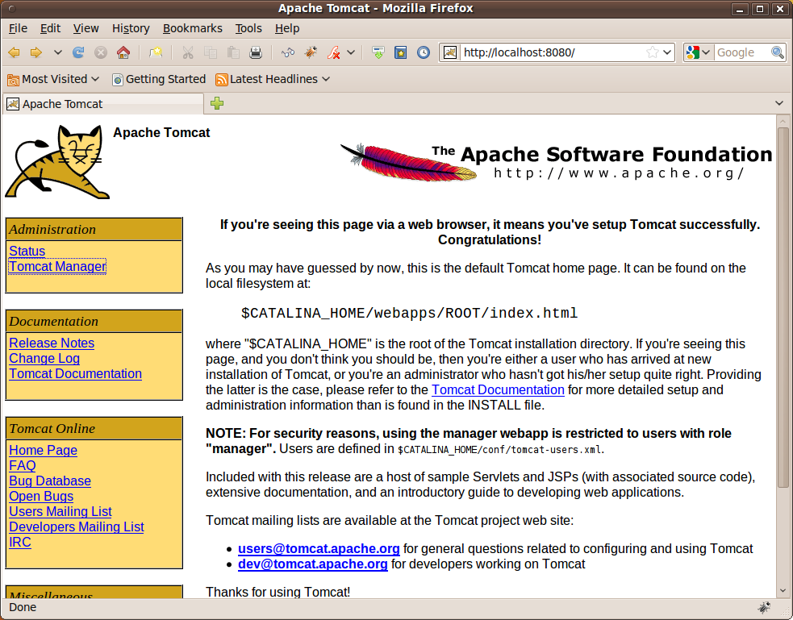

# Πώς να προστατέψετε τον Apache Tomcat
Ο [Apache](http://httpd.apache.org/) είναι ένας web server που χρησιμοποιείται για τη δημοσίευση στατικών ιστοσελίδων. Ο [Tomcat](http://tomcat.apache.org/) είναι ένας application server ή servlet container που χρησιμοποιείται για τη δημοσίευση δυναμικών ιστοσελίδων που προέρχονται από κώδικα γραμμένο στη γλώσσα προγραμματισμού Java. Και οι δυο διακομιστές είναι «παιδιά» του ιδρύματος παραγωγής προγραμμάτων ανοικτού κώδικα [Apache](http://www.apache.org/).

Σ' αυτό το άρθρο θα δούμε πώς μπορούμε να προστατεύσουμε τον Tomcat από πιθανές κακόβουλες επιθέσεις. Φυσικά, τα παρακάτω είναι ενδεικτικά και δεν καλύπτουν όλες τις περιπτώσεις, αλλά σας δίνουν μια ιδέα του τι πρέπει να προσέξετε, πράγματα δηλ. που συνήθως είτε μας ξεφεύγουν είτε τ' αγνοούμε.

_Tο άρθρο αυτό αναφέρεται σε μια παλιά έκδοση του Apache Tomcat. Θα ακολουθήσει μια ενημερωμένη έκδοση για την τελευταία έκδοση του Apache Tomcat._

## Προστατεύοντας τον Tomcat
Αν δεν έχετε ήδη κατεβάσει τον Apache Tomcat, κατεβάστε την έκδοση 6.0 από το [εδώ](http://tomcat.apache.org/download-60.cgi) και εγκαταστήστε την στον κατάλογο ```/opt/``` π.χ.:
```bash
$ cd /opt/
$ sudo unzip /home/<user>/Downloads/apache-tomcat-6.0.20.zip
$ sudo mv /opt/apache-tomcat-6.0.20/ /opt/apache-tomcat/
```
Αν θέλετε να 'χετε πολλαπλές εκδόσεις του Tomcat, μπορείτε π.χ. να τον εγκαταστήσετε στον κατάλογο ```/opt/Tomcat/apache-tomcat-6.0.20```.

Δημιουργήστε ένα χρήστη και μια ομάδα ```tomcat```. Επιλέξτε από το μενού **Σύστημα -> Διαχείριση συστήματος -> Χρήστες και Ομάδες**, πατήστε το κουμπί **Ξεκλείδωμα**, δώστε τον κωδικό του υπερχρήστη, στη συνέχεια πατήστε το κουμπί **Προσθήκη χρήστη** και δώστε ```tomcat``` για όνομα χρήστη και _Unprivileged_ για **Προφίλ**. Μαζί με το χρήστη, δημιουργήθηκε και η ομάδα ```tomcat```.


**Εικόνα 1** _Δημιουργία λογαριασμού χρήστη tomcat_

```bash
$ sudo chown -R tomcat:tomcat /opt/apache-tomcat/
```
Προστατέψτε την πρόσβαση στον κατάλογό του:
```bash
$ sudo chmod 500 /opt/apache-tomcat/
```
δίνοντάς του μόνο δικαιώματα ```r-x``` στον χρήστη ```tomcat```. Με τον τρόπο αυτό αποτρέπετε άλλους χρήστες π.χ. από το να επικολλήσουν ευάλωτα αρχεία στον κατάλογο ```webapps/``` του ```Tomcat``` ή να τροποποιήσουν αρχεία π.χ. στον κατάλογο ```conf/```. Στην αναφορά [2] προτείνεται να δωθούν στον κατάλογο ```conf/``` δικαιώματα ```400 (r--)```, στον ```tmp/```  ```600 (rw-)``` και στον ```logs/ 300 (-wx)```. Κάνοντας όμως αυτές τις αλλαγές, δε θα εκτελείται η εφαρμογή Web Application Manager, όπως θα δούμε παρακάτω, ενώ ενδέχεται να μη ξεκινάει ο Tomcat καθώς κάθε φορά που ξεκινάει, τροποποιεί το αρχείο ```conf/tomcat-users.xml```. Νομίζω πως απλά τα δικαιώματα ```500``` στον κατάλογο ```/opt/apache-tomcat/``` είναι αρκετά για τις περισσότερες των χρήσεων.

Από δω και πέρα, συνδεθείτε ως χρήστης ```tomcat``` για να κάνετε πιο εύκολα τις απαιτούμενες αλλαγές:
```bash
$ su – tomcat
Password:
$ cd /opt/apache-tomcat/
```
Στη συνέχεια θα ορίσουμε το διαχειριστή του Tomcat μέσω του οποίου θα μπορούμε να πλοηγηθούμε στην εφαρμογή Web Application Manager. Προτού συνεχίσουμε, θα σετάρουμε τον Tomcat να μη δέχεται ν' αποθηκεύει κωδικούς χρηστών χωρίς κρυπτογράφηση στα αρχεία ρυθμίσεών του. Για λόγους ασφαλείας, θα πρέπει πάντα να χρησιμοποιούνται κρυπτογραφημένοι κωδικοί. Εντοπίστε τις παρακάτω γραμμές στο αρχείο ```conf/server.xml```:
```xml
<Realm className="org.apache.catalina.realm.UserDatabaseRealm"
 resourceName="UserDatabase"/>
```
και προσθέστε:
```xml
<Realm className="org.apache.catalina.realm.UserDatabaseRealm"
 resourceName="UserDatabase" digest="SHA"/>
```
Ας δημιουργήσουμε τώρα έναν κρυπτογραφημένο κωδικό για τον διαχειριστή του Tomcat, χρησιμοποιώντας ένα πρόγραμμα που έρχεται για το σκοπό αυτό μαζί με τον Tomcat. Προτού όμως μπορέσουμε να το κάνουμε αυτό, χρειαζόμαστε να ορίσουμε τη μεταβλητή περιβάλλοντος ```JAVA_HOME``` στον Tomcat. 
```bash
$ cd /opt/apache-tomcat/bin/
$ chmod +x *.sh
$ vi setclasspath.sh
```
Προσθέστε κάτω από τη γραμμή ```CLASSPATH=``` τις γραμμές: 
```bash
BASEDIR=..
JAVA_HOME=/usr/lib/jvm/java-6-openjdk/
```
και αποθηκεύστε το αρχείο.
```bash
$ ./setclasspath.sh
$ ./digest.sh -a SHA <password>
```
όπου ```<password>``` είναι ο κωδικός που δίνετε. Θα λάβετε ως αποτέλεσμα κάτι παρόμοιο με το παρακάτω:
```
<password>:4233137d1c510f2e55ba5cb220b864b11033f156
```
Αντιγράψτε τον παραπάνω κωδικό. Ανοίξτε το αρχείο ```conf/tomcat-users.xml``` στον αγαπημένο σας κειμενογράφο (τον ```vi``` :-)), σβήστε όλους τους χρήστες και ρόλους που υπάρχουν μεταξύ των ετικετών ```<tomcat-users>``` και ```</tomcat-users>``` και εισάγετε μεταξύ των ετικετών αυτών το όνομα του διαχειριστή (διαλέξαμε ```tomcat``` στο παρακάτω παράδειγμα αλλά μπορείτε να διαλέξετε ότι όνομα διαχειριστή θέλετε), τον κρυπτογραφημένο κωδικό που δημιουργήσαμε παραπάνω, και το ρόλο ```manager```:
```xml
<user name="tomcat" password="4233137d1c510f2e55ba5cb220b864b11033f156" roles="manager"/>
```
Το αρχείο ```tomcat-users.xml``` θα πρέπει να μοιάζει με το παρακάτω:
```xml
<tomcat-users>
  <user name="tomcat"  
  password="4233137d1c510f2e55ba5cb220b864b11033f156" roles="manager"/>
</tomcat-users>
```
Επιβεβαιώστε ότι το εξ' ορισμού servlet δεν εξυπηρετεί index σελίδες όταν δεν υπάρχει αντίστοιχο αρχείο:
```xml
<servlet>
   <servlet-name>default</servlet-name>
<servlet-class>org.apache.catalina.servlets.DefaultServlet</servlet-class>
   <init-param>
     <param-name>debug</param-name>
     <param-value>0</param-value>
   </init-param>
   <init-param>
     <param-name>listings</param-name>
     <param-value>false</param-value>  <!-- make sure this is false -->
   </init-param>
   <load-on-startup>1</load-on-startup>
</servlet>
```
Ας δούμε τι έχουμε καταφέρει μέχρι στιγμής. Εκκινήστε τον Tomcat:
```bash
$ /opt/apache-tomcat/bin/startup.sh
Using CATALINA_BASE:   /opt/apache-tomcat
Using CATALINA_HOME:   /opt/apache-tomcat
Using CATALINA_TMPDIR: /opt/apache-tomcat/temp
Using JRE_HOME:       /usr/lib/jvm/java-6-openjdk/
```
ανοίξτε τον αγαπημένο σας πλοηγό (π.χ. Firefox), και πλοηγηθείτε στη διεύθυνση:
http://localhost:8080/


**Εικόνα 2** _Η αρχική ιστοσελίδα του Tomcat_

Θα πρέπει να μπορείτε να δείτε την αρχική ιστοσελίδα του Tomcat. Κάντε κλικ στον υπερσύνδεσμο _Tomcat Manager_. Θα σας ζητηθεί το όνομα χρήστη κι ο κωδικός του διαχειριστή για να συνεχίσετε. Δώστε το όνομα του διαχειριστή (tomcat στο παράδειγμά μας) και τον μη κρυπτογραφημένο κωδικό, για να προσπελάσετε τη σελίδα διαχείρισης του Tomcat.


**Εικόνα 3** _Η ιστοσελίδα διαχείρισης του Tomcat_

Αν όλα δουλέψανε όπως έπρεπε, τότε μπράβο! Διαφορετικά, ελέγξτε τα αρχεία καταγραφής στον κατάλογο ```/opt/apache-tomcat/logs/``` για να δείτε τι πρόβλημα υπάρχει. 

## Ενεργοποίηση HTTPS
Η επικοινωνία όμως του πλοηγού με τον Tomcat γίνεται ακόμα στη μη ασφαλή θύρα 8080. Στη συνέχεια θα δούμε πώς να ενεργοποιήσουμε ασφαλή μεταφορά δεδομένων με ενεργοποίηση SSL. Θα χρειαστούμε γι' αυτό το λόγο ένα πιστοποιητικό ώστε να κρυπτογραφείται η επικοινωνία με τον Tomcat. Τα self-signed certificates, σαν αυτό που θα δημιουργήσουμε, επαρκούν μόνο για κρυπτογράφηση των δεδομένων, όχι για πιστοποίηση του διακομιστή που τα δημιούργησε. Για πιστοποίηση, απαιτείται η χρήση Φορέων Πιστοποίησης (Certification Authorities). Για τις ανάγκες μας όμως, είναι αρκετό. Αν όμως επιθυμείτε να χρησιμοποιήσετε τον Tomcat σε ένα εμπορικό περιβάλλον που να εξυπηρετεί χρήστες του διαδικτύου, θα χρειαστεί ν' αγοράσετε ένα πιστοποιητικό από έναν Φορέα Πιστοποίησης όπως η [Verisign](http://www.verisign.com/).

Θα χρησιμοποιήσουμε το εργαλείο ```keytool``` που έρχεται μαζί με το Java Runtime Environment (JRE) για να δημιουργήσουμε ένα X.509 self-signed certificate. Άλλο παρόμοιο εργαλείο είναι το ```openssl```.
```bash
$ hostname
<hostname>
$ keytool -genkeypair -alias tomcat -keyalg RSA -keysize 1024 -validity 365 -keystore /opt/apache-tomcat/conf/keystore
```
Η παραπάνω εντολή δημιουργεί το αρχείο ```/opt/apache-tomcat/conf/keystore```. Στο αρχείο αυτό αποθηκεύονται το δημόσιο και ιδιωτικό κλειδί μεγέθους 1024 bytes που απαιτούνται για την κρυπτογράφηση των δεδομένων με χρήση του αλγορίθμου RSA, ένα ψευδώνυμο ```tomcat```, και η διάρκεια 365 ημερών εγκυρότητας του πιστοποιητικού. 

Το πρόγραμμα ```keytool``` στη συνέχεια σας ρωτάει μια σειρά από ερωτήσεις, όπως έναν κωδικό, το ονοματεπώνυμό σας και πληροφορίες του οργανισμού στον οποίο εργάζεστε. Τον κωδικό πρέπει να τον δώσετε επίσης σε κρυπτογραφημένη μορφή (μπορείτε π.χ. να χρησιμοποιήσετε τον ίδιο κρυπτογραφημένο κωδικό που χρησιμοποιήσατε για το χρήστη ```tomcat``` πιο πάνω στο αρχείο ```tomcat-users.xml```, διαφορετικά θα πρέπει να χρησιμοποιήσετε πάλι την εντολή ```digest.sh``` που είδαμε παραπάνω για να δημιουργήσετε ένα νέο κρυπτογραφημένο κωδικό προτού εκτελέσετε την εντολή ```keytool```). Προσοχή, το ονοματεπώνυμο στην ουσία είναι το ```CN``` ή ```Common Name``` που είναι το πλήρες όνομα του διακομιστή (hostname) στον οποίο έχει εγκατασταθεί ο Tomcat κι όχι το ονοματεπώνυμό σας. Αν οι πληροφορίες που του δώσατε είναι σωστές, δώστε ```yes``` και στην τελευταία ερώτηση (```Enter key password for <tomcat>```) απλά πατήστε ```ENTER```.
```bash
Enter keystore password: <password in digest form>
Re-enter new password: <password in digest form>
What is your first and last name?
  [Unknown]:  <hostname>
What is the name of your organizational unit?
  [Unknown]:  <μονάδα οργανισμού>
What is the name of your organization?
  [Unknown]:  <οργανισμός>
What is the name of your City or Locality?
  [Unknown]:  <πόλη>
What is the name of your State or Province?
  [Unknown]:  <δήμος>
What is the two-letter country code for this unit?
  [Unknown]:  GR
Is CN=<hostname>, OU=Uknown, O=Uknown, L=<πόλη>, ST=<δήμος>, C=GR correct?
  [no]:  yes

Enter key password for <tomcat>
	(RETURN if same as keystore password):  
```
Επιβεβαιώστε ότι ο αρχείο keystore όντως δημιουργήθηκε στη σωστή τοποθεσία:
```bash
$ ls -al /opt/apache-tomcat/conf/keystore
```
Τέλος, ανοίξτε το αρχείο ```conf/server.xml```, και βγάλτε τα σχόλια (```<!-- -->```) από τις παρακάτω γραμμές:
```xml
<!--
<Connector port="8443" protocol="HTTP/1.1" SSLEnabled="true"
      maxThreads="150" scheme="https" secure="true"
      clientAuth="false" sslProtocol="TLS" />
-->
```
και προσθέστε και τις παρακάτω γραμμές:
```xml
<Connector port="8443" protocol="HTTP/1.1" SSLEnabled="true"
       maxThreads="150" scheme="https" secure="true"
       clientAuth="false" sslProtocol="TLS" 
       keystoreFile="conf/keystore" 
       keystorePass="536c0b339345616c1b33caf454454d8b8a190d6c"/>
```
όπου στο ```keystorePass``` πρέπει να εισάγετε τον ίδιο κωδικό που δώσατε στο ```keytool``` πιο πάνω. Είναι επίσης χρήσιμη τακτική να ενεργοποιήσετε συμπίεση των δεδομένων προς μετάδοση, προσθέτοντας τις παρακάτω γραμμές:
```xml
<Connector port="8443" protocol="HTTP/1.1" SSLEnabled="true"
       maxThreads="150" scheme="https" secure="true"
       clientAuth="false" sslProtocol="TLS" 
	  compression="on"
	  compressionMinSize="2048"
	  noCompressionUserAgents="gozilla, traviata"
	  compressableMimeType="text/html,text/xml"
       keystoreFile="conf/keystore" 
       keystorePass="536c0b339345616c1b33caf454454d8b8a190d6c"/>
```
Μπορείτε να βάλετε εντός σχολίων τις παρακάτω γραμμές για να απενεργοποιήσετε τη θύρα ```8080```:
```xml
<!--
<Connector port="8080" protocol="HTTP/1.1"
        connectionTimeout="20000"
        redirectPort="8443" />
-->
```
ή να την αφήσετε ενεργή (δηλ. εκτός σχολίων) και να ενεργοποιήσετε ανακατεύθυνση κάθε αιτήματος της θύρας ```8080``` στη θύρα ```8443``` (βλ. ```redirectPort="8443"``` πιο πάνω) προσθέτοντας στο ```conf/web.xml``` τις ακόλουθες γραμμές ακριβώς πριν την τελευταία γραμμή ```</web-app>```:
```xml
<security-constraint>
  <web-resource-collection>	
     <web-resource-name>Redirect to SSL</web-resource-name>
	<url-pattern>/*</url-pattern>
  </web-resource-collection>
  <user-data-constraint> 
	<transport-guarantee>CONFIDENTIAL</transport-guarantee> 
  </user-data-constraint>
</security-constraint>
```
Με την παραπάνω αλλαγή, κάθε φορά που προσπαθείτε να προσπελάσετε μια σελίδα του Tomcat μέσω της μη ασφαλής θύρας ```8080```, γίνεται αυτόματη ανακατεύθυνση στη θύρα ```8443```.

Αν δεν θέλετε να γίνεται η ανακατεύθυνση για όλες τις εφαρμογές ιστού που έχετε εγκαταστήσει στον Tomcat, τότε αλλάζετε το ```/*``` με τη λογική διαδρομή της εφαρμογής. Αν π.χ. έχετε εγκαταστήσει την εφαρμογή ```http://localhost:8080/mywebapp``` τότε ορίζετε το ```url-pattern``` σε: ```/mywebapp/*```.
 
Αν δεν θέλετε να γίνεται η ανακατεύθυνση σε ```https``` για τις εφαρμογές ιστού αλλά θέλετε να προστατέψετε μόνο τον _Tomcat Manager_, τότε σε εκδόσεις του Tomcat παλιότερες της 6.0.xx θα πρέπει ν' ανοίξετε το αρχείο ```server/webapps/manager/WEB-INF/web.xml``` και να προσθέσετε τις ακόλουθες γραμμές μέσα στο ```<security-constraint>```:
```bash
<security-constraint>  
  ...
  <user-data-constraint> 
	<transport-guarantee>CONFIDENTIAL</transport-guarantee> 
  </user-data-constraint>
  <auth-constraint>
    <role-name>manager</role-name>
  </auth-constraint>
</security-constraint>
```
Ο λόγος είναι ότι η εφαρμογή Tomcat Manager στις εκδόσεις 5.5.xx και παλιότερες δεν βρίσκεται στον κατάλογο ```webapps``` αλλά στον ```server/webapps```. Στην έκδοση 6.0.xx και νεώτερες, η εφαρμογή ```manager``` βρίσκεται μέσα στον κατάλογο ```webapps```, οπότε το παραπάνω αρχείο βρίσκεται στη θέση ```webapps/manager/WEB-INF/web.xml```. Οπότε, εναλλακτικά, μπορείτε να προσθέσετε ανακατεύθυνση σε HTTPS σε όποια εφαρμογή επιθυμείτε αρκεί να προσθέσετε τις παραπάνω γραμμές στο αντίστοιχο ```web.xml``` αρχείο της εφαρμογής ιστού.

Επανεκινήστε τον Tomcat:
```bash
$ /opt/apache-tomcat/bin/shutdown.sh
$ /opt/apache-tomcat/bin/startup.sh
```
και πλοηγηθείτε στη διεύθυνση:
http://localhost:8080/

Θα παρατηρήσετε ότι πλέον είναι αδύνατο να συνδεθείτε στη θύρα ```8080```, εκτός κι αν ενεργοποιήσατε ανακατεύθυνση οπότε μεταβαίνετε αυτόματα στη διεύθυνση:
https://localhost:8443/

Αυτή τη φορά θα εμφανιστεί ένα μήνυμα που θα σας λέει ότι η σύνδεση δεν είναι πιστοποιημένη διότι δημιουργήσαμε ένα πιστοποιητικό υπογεγραμμένο από εμάς τους ίδιους και δεν χρησιμοποιήσαμε ενός Φορέα Πιστοποίησης. 


**Εικόνα 4** _Μήνυμα προειδοποίησης μη πιστοποιημένης σύνδεσης_

Κάντε κλικ στους υπερσυνδέσμους **Technical Details** και **I Understand The Risks** για να δείτε περισσότερες πληροφορίες. 


**Εικόνα 5** _Μήνυμα προειδοποίησης μη πιστοποιημένης σύνδεσης με περισσότερες πληροφορίες_

Πατήστε το κουμπί **Add Exception...** για να εμφανιστεί το παράθυρο _Add Security Exception_ και στη συνέχεια το κουμπί **Confirm Security Exception** για να πλοηγηθείτε εν τέλει στην αρχική ιστοσελίδα του Tomcat. Από δω και πέρα σας είναι γνωστά!


**Εικόνα 6** _Μήνυμα επιβεβαίωσης προσθήκης του πιστοποιητικού μας στον firefox_


**Εικόνα 7** _Η αρχική ιστοσελίδα του Tomcat με ασφαλή σύνδεση_


**Εικόνα 8** _Η ιστοσελίδα διαχείρισης του Tomcat με ασφαλή σύνδεση_

## Συμπερασματικά
Όπως είδαμε, η εγκατάσταση του Tomcat δεν έρχεται έτοιμη με δικλείδες ασφαλείας αλλά απαιτείται αρκετός κόπος ώστε να προστατεύσουμε τον ίδιο καθώς και την κυκλοφορία των δεδομένων μεταξύ του Tomcat και του πλοηγού. Προστατεύοντας τον Tomcat δε σημαίνει ότι και οι εφαρμογές ιστού που 'χετε εγκαταστήσει σ' αυτόν είναι ασφαλείς, αλλά αυτό αποτελεί ένα άρθρο από μόνο του. Φυσικά, μπορείτε ν' ανατρέξετε στις πηγές για να δοκιμάσετε ακόμα περισσότερες λύσεις που θα κάνουν τον Tomcat και τις web εφαρμογές σας ακόμα πιο ασφαλή.

## Πηγές
1. Brittain, J. & Darwin, I. F. (2007), _Tomcat the Definitive Guide_, 2nd Edition, O' Reilly.
2. Edmonds, D. (2007), [Securing Tomcat](http://www.owasp.org/index.php/Securing_tomcat) 
3. Wilson, Ann (2007), [Basic Tomcat Tour and Tomcat Security](http://www.unidata.ucar.edu/projects/THREDDS/tech/tutorial/BasicTomcatTourAndSecurity.html) 